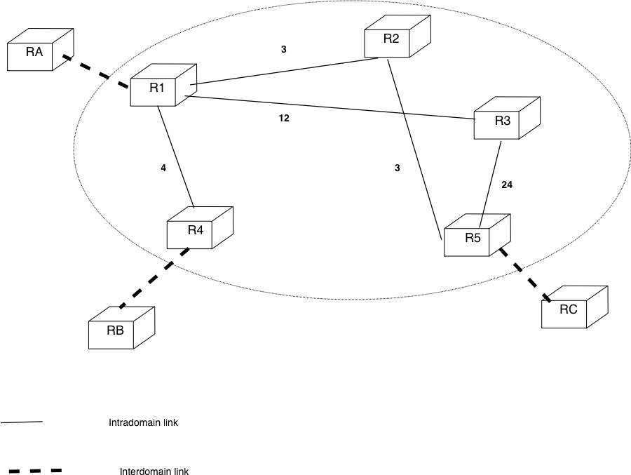

BGP and IP over Ethernet
========================

In this set of exercices, we will discuss about the BGP decision process and analyse in more details the operation of IP in an Ethernet network.

The deadline for this exercise will be Tuesday December 8th, 13.00.

BGP
---

1. In the network shown below, draw the iBGP and eBGP sessions that must be established among the routers.

 .. figure:: ../S9/fig/BGP-figs-007-c.png
    :align: center
    :scale: 70
   
    A small domain

2. Consider the network shown below. Assume that `R3` and `R5` use the `MED` attribute when advertising a route towards `R1` and `R2`. The `MED` attribute that they advertise is the IGP cost to their nexthop.

 .. figure:: ../S9/fig/BGP-figs-005-c.png
    :align: center
    :scale: 70
   
    A small internetwork

 #. Consider that `R5` is attached to prefix `p1` and advertises this prefix. What are the routes received and chosen by `R1` and `R2` ?
 #. Consider that `R9` is attached to prefix `p2` and advertises this prefix. What are the routes received and chosen by `R1` and `R2` ?
 #. Consider that `R6` is attached to prefix `p3` and advertises this prefix. What are the paths received and chosen by `R1` and `R2` ?

3. Consider the network shown below. In this network, `RA` advertises prefix `p`. Shown the iBGP sessions in this network and all the BGP messages that are exchanged when :

 .. figure:: ../S9/fig/BGP-figs-006-c.png
    :align: center
    :scale: 70
   
    A small internetwork

 - `RA` advertises `p` first on link `RA-R1` and later on link `RA-R3`
 - Link `RA-R3` fails
 - Perform the same analysis again by considering now that `R3` inserts a `local-pref` value of `100` in the routes received from `RA` while `R1` inserts a `local-pref` value of `50`.

4. Consider now the network shown below where the link costs are specified. Compute the routing tables on all routers when :

 - prefix `p1` is advertised by `RA`, `RB` and `RC` with an AS Path of length 1
 - prefix `p2` is advertised by `RA` with an AS Path length of 2 and by `RB` and `RC` with an AS Path of length 1
 - What happens in these two situations when the link `R3-R5` fails ?

  
   A small internetwork

IP over Ethernet
----------------

1. Consider the network shown below. In this network, write the routing tables that need to be configured on all routers. Assume that host `154.112.3.5` sends an IP packet towards host `154.112.0.15` and that this host sends a reply. Show all Ethernet frames that are exchanged. Provide your answer in a table that lists for each frame :

 - the link on which the frame is sent
 - the Ethernet source and destination addresses
 - the IP source and destination addresses (if any)

 .. figure:: fig/topologie2.png
    :align: center
    :scale: 70
   
    A small enterprise network 

2. Many TCP/IP implementations today send an ARP request for their own IP address before sending their first IP packet using this address. Can you explain why this is useful in practice ?

 .. figure:: fig/IPEth-003-c.png
    :align: center
    :scale: 70
   
    A small Ethernet 

3. Consider now the transmission of IPv4 packets. One security issue with IPv4 is the Address Resolution Protocol (ARP). Can you explain what ARP spoofing or ARP poisoning is and show how host `A` in the network below could intercept all the IP packets sent by host `B` via the default router ?

4. Same question as above, but now consider that the Ethernet network is not a coaxial cable but an Ethernet switch.  Is it possible to protect switches against these ARP spoofing attacks ? If so how ?

 .. figure:: fig/IPEth-001-c.png
    :align: center
    :scale: 70
   
    A small switched Ethernet 
