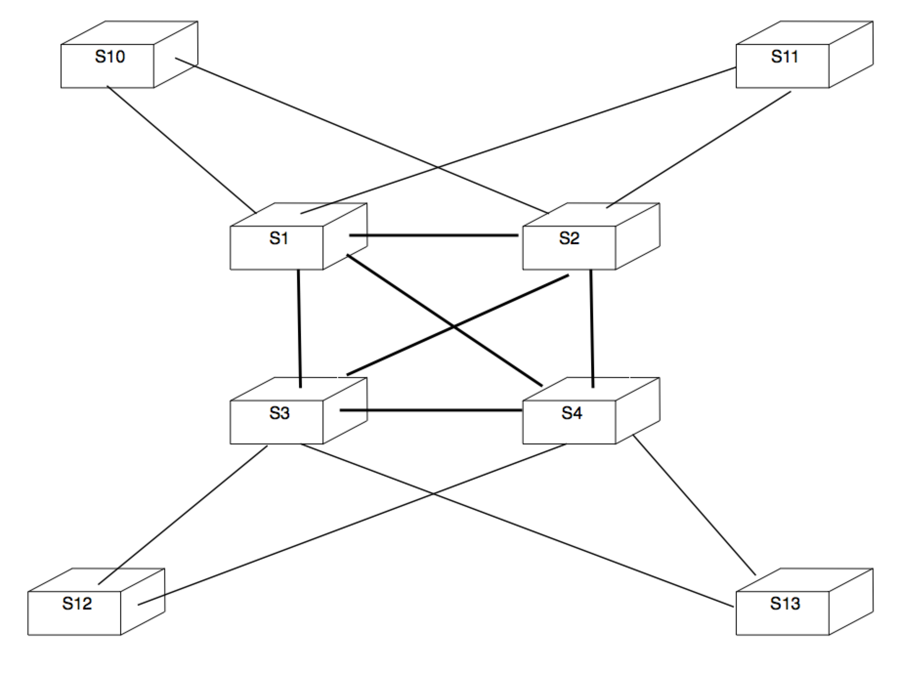
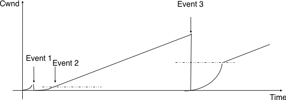

Ethernet networks
=================

The deadline for this exercise is Tuesday December 15th, 13.00.

Exercises
---------

1 Consider the switched network shown in the figure below. What is the spanning tree that will be computed by 802.1d in this network assuming that all links have a unit cost ? Indicate the state of each port.

.. figure:: fig/switchesok.png
   :align: center
   :scale: 50 

   A small network composed of Ethernet switches

2 Consider the switched network shown in the figure above.  In this network, assume that the LAN between switches `3` and `12` fails. How should the switches update their port/address tables after the link failure ?

3 Many enterprise networks are organized with a set of backbone devices interconnected by using a full mesh of links as shown in the figure below. In this network, what are the benefits and drawbacks of using Ethernet switches and IP routers running OSPF ?

   A typical enterprise backbone network 

4 Most commercial Ethernet switches are able to run the Spanning tree protocol independently on each VLAN. What are the benefits of using per-VLAN spanning trees ?

TCP congestion control
----------------------

1 The figure below describes the evolution of the congestion window of a TCP connection. Can you find the reasons for the three events that are marked in the figure ?

 .. figure:: fig/revision-figs-001-c.png
    :align: center
    :scale: 70 

    Evolution of the congestion window

2 The figure below describes the evolution of the congestion window of a TCP connection. Can you find the reasons for the three events that are marked in the figure ?

   Evolution of the congestion window

3 A web server serves mainly HTML pages that fit inside 10 TCP segments. Assuming that the transmission time of each segment can be neglected, compute the total transfer time of such a page (in round-trip-times) assuming that :

 - the TCP stack uses an initial window size of 1 segment
 - the TCP stack uses an initial window size of three segments

4 :rfc:`3168` defines mechanism that allow routers to mark packets by setting one bit in the packet header when they are congested. When a TCP destination receives such a marking in a packet, it returns the congestion marking to the source that reacts by halving its congestion window and performs congestion avoidance. Consider a TCP connection where the fourth data segment experiences congestion. Compare the delay to transmit 8 segments in a network where routers discards packets during congestion and a network where routers mark packets during congestion

The Border Gateway Protocol
---------------------------

1 There are currently 13 IPv4 addresses that are associated to the root servers of the Domain Name System. However, http://www.root-servers.org/ indicates that there are more than 100 different physical servers that support. This is a large anycast service. How would you configure BGP routers to provide such anycast service ?

2 Consider the network shown in the figure below. In this network, `R0` advertises prefix `p` and all link metrics are set to `1`

 - Draw the iBGP and eBGP sessions
 - Assume that session `R0-R8` is down when `R0` advertises `p` over `R0-R7`. What are the BGP messages exchanged and the routes chosen by each router in the network ?
 - Session `R0-R8` is established and `R0` advertises prefix `p` over this session as well
 - Do the routes selected by each router change if the `MED` attribute is used on the `R7-R6` and `R3-R10` sessions, but not on the `R4-R9` and `R6-R8` sessions ?
 - Is it possible to configure the routers in the `R1 - R6` network such that `R4` reaches prefix `p` via `R6-R8` while `R2`uses the `R3-R10` link ?

.. figure:: fig/revision-figs-003-c.png
   :align: center
   :scale: 30 

   A simple Internet

3 The `MED` attribute is often set at the IGP cost to reach the BGP nexthop of the advertised prefix. However, routers can also be configured to always use the same `MED` values for all routes advertised over a given session. How would you use it in the figure above so that link `R10-R3` is the primary link while `R7-R6` is a backup link ? Is there an advantage or drawback of using the `MED` attribute for this application compared to `local-pref` ?

4 In the figure above, assume that the managers of `R8` and `R9` would like to use the `R8-R6` link as a backup link, but the managers of `R4` and `R6` do no agree to use the `MED` attribute nor to use a different `local-pref` for the routes learned from 
