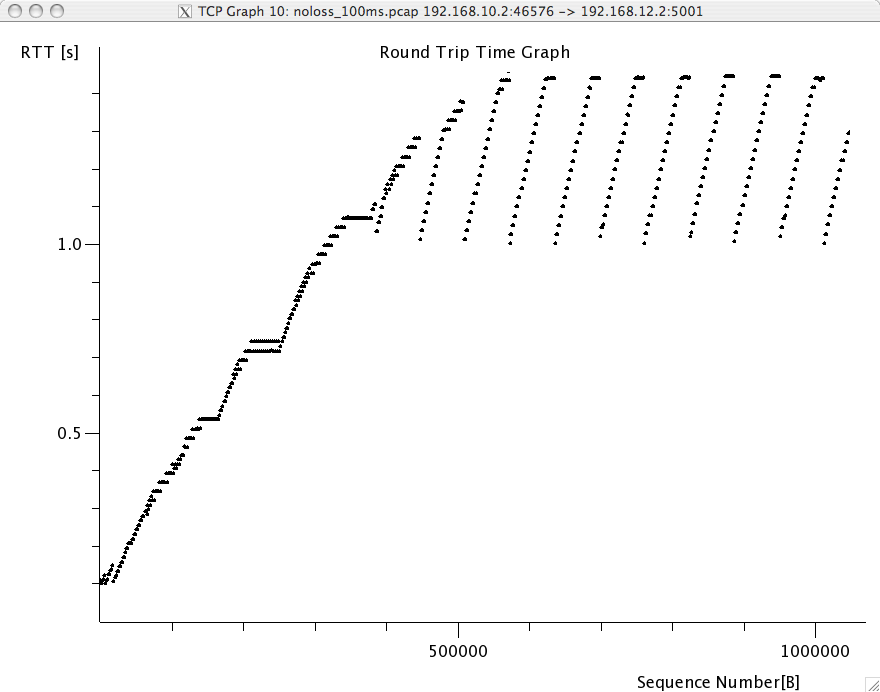

The Transmission Control Protocol
=================================

The Transmission Control Protocol plays a key role in the TCP/IP protocol suite by providing a reliable byte stream service on top of the unreliable connectionless service provided by IP. During this exercise session, you will learn how to establish correctly a TCP connection and analyse packet traces that contain TCP segments. Note that some of exercises involve the creation of non-standard TCP segments. These exercises cannot be performed outside the netkit_ environment that is described below.

Packet trace analysis tools
---------------------------

When debugging networking problems or to analyse performance problems, it is sometimes useful to capture the segments that are exchanged between two hosts and to analyse them.  

Several packet trace analysis tools are available, either as commercial or open-source tools. These tools are able to capture all the packets exchanged on a link. Of course, capturing packets require administrator privileges. They can also analyse the content of the captured packets and display information about them. The captured packets can be stored in a file for offline analysis.

tcpdump_ is probably one of the most well known packet capture software. It is able to both capture packets and display their content. tcpdump_ is a text-based tool that can display the value of the most important fields of the captured packets. Additional information about tcpdump_ may be found in :manpage:`tcpdump(1)`. The text below is an example of the output of tcpdump_ for the first TCP segments exchanged on an scp transfer between two hosts ::

 21:05:56.230737 IP 192.168.1.101.54150 > 130.104.78.8.22: S 1385328972:1385328972(0) win 65535 <mss 1460,nop,wscale 3,nop,nop,timestamp 274527749 0,sackOK,eol>
 21:05:56.251468 IP 130.104.78.8.22 > 192.168.1.101.54150: S 3627767479:3627767479(0) ack 1385328973 win 49248 <nop,nop,timestamp 1212093352 274527749,mss 1452,nop,wscale 0,nop,nop,sackOK>
 21:05:56.251560 IP 192.168.1.101.54150 > 130.104.78.8.22: . ack 1 win 65535 <nop,nop,timestamp 274527749 1212093352>
 21:05:56.279137 IP 130.104.78.8.22 > 192.168.1.101.54150: P 1:21(20) ack 1 win 49248 <nop,nop,timestamp 1212093355 274527749>
 21:05:56.279241 IP 192.168.1.101.54150 > 130.104.78.8.22: . ack 21 win 65535 <nop,nop,timestamp 274527749 1212093355>
 21:05:56.279534 IP 192.168.1.101.54150 > 130.104.78.8.22: P 1:22(21) ack 21 win  65535 <nop,nop,timestamp 274527749 1212093355> 
 21:05:56.303527 IP 130.104.78.8.22 > 192.168.1.101.54150: . ack 22 win 49248 <nop,nop,timestamp 1212093357 274527749>
 21:05:56.303623 IP 192.168.1.101.54150 > 130.104.78.8.22: P 22:814(792) ack 21 win 65535 <nop,nop,timestamp 274527749 1212093357>

You can easily recognise in the output above the `SYN` segment containing the `MSS`, `window scale`, `timestamp` and `sackOK` options, the `SYN+ACK` segment whose `wscale` option indicates that the server uses window scaling for this connection and then the first few segments exchanged on the connection.

wireshark_ is more recent than tcpdump_. It evolved from the ethereal packet trace analysis software. It can be used as a text tool like tcpdump_. For a TCP connection, wireshark_ would provide almost the same output as tcpdump_. The main advantage of wireshark_ is that it also includes a graphical user interface that allows to perform various types of analysis on a packet trace.

.. figure:: fig/wireshark-open.png
   :align: center
   :scale: 50

   Wireshark : default window

The wireshark window is divided in three parts. The top part of the window is a summary of the first packets from the trace. By clicking on one of the lines, you can show the detailed content of this packet in the middle part of the window. The middle of the window allows you to inspect all the fields of the captured packet. The bottom part of the window is the hexadecimal representation of the packet, with the field selected in the middle window being highlighted.

wireshark_ is very good at displaying packets, but it also contains several analysis tools that can be very useful. The first tool is `Follow TCP stream`. It is part of the `Analyze` menu and allows you to reassemble and display all the payload exchanged during a TCP connection. This tool can be useful if you need to analyse for example the commands exchanged during a SMTP session.

The second tool is the flow graph that is part of the `Statistics` menu. It provides a time sequence diagram of the packets exchanged with some comments about the packet contents. See blow for an example.

.. figure:: fig/wireshark-flowgraph.png
   :align: center
   :scale: 50

   Wireshark : flow graph

The third set of tools are the `TCP stream graph` tools that are part of the `Statistics menu`. These tools allow you to plot various types of information extracted from the segments exchanged during a TCP connection. A first interesting graph is the `sequence number graph` that shows the evolution of the sequence number field of the captured segments with time. This graph can be used to detect graphically retransmissions.

.. figure:: fig/wireshark-seqgraph.png
   :align: center
   :scale: 50

   Wireshark : sequence number graph

A second interesting graph is the `round-trip-time` graph that shows the evolution of the round-trip-time in function of time. This graph can be used to check whether the round-trip-time remains stable or not. Note that from a packet trace, wireshark_ can plot two `round-trip-time` graphs, One for the flow from the client to the server and the other one. wireshark_ will plot the `round-trip-time` graph that corresponds to the selected packet in the top wireshark_ window. 

   Wireshark : round-trip-time graph

Emulating a network with Netkit
-------------------------------

Netkit_ is network emulator based on User Mode Linux.  It allows to easily set up an emulated network of Linux machines, that can act as end-host or routers.  

Where can I find Netkit?
........................

Netkit_ is available online.  Files can be downloaded from http://wiki.netkit.org/index.php/Download_Official, and instructions for the installations are available here : http://wiki.netkit.org/download/netkit/INSTALL . 

Netkit has already been installed in the student labs, in `/etinfo/applications/netkit` . All you have to do in order to use it is to set the following environment variables :

::

 export NETKIT_HOME=/etinfo/applications/netkit
 export MANPATH=:$NETKIT_HOME/man
 export PATH=$NETKIT_HOME/bin:$PATH

It is usually convenient to put those lines in your shell initialization file.  

How do I use Netkit? 
....................

There are two ways to use Netkit : The manual way, and by using pre-configured labs.  In the first case, you boot and control each machine individually, using the commands starting with a "v" (for virtual machine).   In the second case, you can start a whole network in a single operation.  The commands for controlling the lab start with a "l".  The man pages of those commands is available from `http://wiki.netkit.org/man/man7/netkit.7.html`

You must be careful not to forgot to stop your virtual machines and labs, using either `vhalt` or `lhalt`.  

Example of using a lab
......................

A lab is simply a directory containing at least a configuration file called `lab.conf`, and one directory for each virtual machine.  In the case the lab available on iCampus, the network is composed of two pc, pc1 and pc2, both of them being connected to a router r1.  The lab.conf file contains the following lines : 

::
 pc1[0]=A
 pc2[0]=B
 r1[0]=A
 r1[1]=B

This means that pc1 and r1 are connected to a "virtual LAN" named A via their interface eth0, while pc2 and r1 are connected to the "virtual LAN" B via respectively their interfaces eth0 and eth1.  

The directory of each device is initially empty, but will be used by Netkit to store their filesystem. 

The lab directory can contain optional files.  In the lab provided to you, the "pc1.startup" file contains the shell instructions to be executed on startup of the virtual machine.  In this specific case, the script configures the interface eth0 to allow traffic exchanges between pc1 and r1, as well as the routing table entry to join pc2.   

Starting a lab consists thus simply in unpacking the provided archive, going into the lab directory and typing `lstart` to start the network.  

File sharing between virtual machines and host
..............................................

Virtual machines can access to the directory of the lab they belong to.  This repertory is mounted in their filesystem at the path  `/hostlab`.  

Tools available on Netkit
.........................

As the virtual machines run Linux, standard networking tools such as hping, tcpdump, netstats etc. are available as usual.  

Note that capturing network traces can be facilitated by using the `uml_dump` extension available here : http://kartoch.msi.unilim.fr/blog/?p=19 .  This extension is already installed in the Netkit installation on the student lab.  In order to capture the traffic exchanged on a given 'virtual LAN', you simply need to issue the command `vdump <LAN name>` on the host. If you want to pipe the trace to wireshark, you can use `vdump A | wireshark -i - -k`

In the lab provided in iCampus, you can find a simple Python_ client/server application that establishes TCP connections. Feel free to re-use this code to perform your analysis.    

To be provided by Virginie

Questions
---------

#. A TCP/IP stack receives a SYN segment with the sequence number set to 1234. What will be the value of the acknowledgement number in the returned SYN+ACK segment ?

#. Is it possible for a TCP/IP stack to return a SYN+ACK segment with the acknowledgement number set to `0` ? If no, explain why. If yes, what was the content of the received SYN segment.

#. Open the tcpdump_ packet trace :download:`traces/trace.5connections_opening_closing.pcap` and identify the number of different TCP connections that are established and closed. For each connection, explain by which mechanism they are closed. Analyse the initial sequence numbers that are used in the SYN and SYN+ACK segments. How do these initial sequence numbers evolve ? Are they increased every 4 microseconds ?

#. The tcpdump_ packet trace :download:`traces/trace.5connections.pcap` contains several connection attempts. Can you explain what is happening with these connection attempts ?

#. The tcpdump_ packet trace :download:`traces/trace.ipv6.google.com.pcap` was collected from a popular website that is accessible by using IPv6. Explain the TCP options that are supported by the client and the server.

#. The tcpdump_ packet trace :download:`traces/trace.sirius.info.ucl.ac.be.pcap` Was collected on the departmental server. What are the TCP options supported by this server ?

#. A TCP implementation maintains a Transmission Control Block (TCB) for each TCP connection. This TCB is a data structure that contains the complete "`state`"  of each TCP connection. The TCB is described in :rfc:`793`. It contains first the identification of the TCP connection : 

 - `localip` : the IP address of the local host
 - `remoteip` : the IP address of the remote host
 - `remoteport` : the TCP port used for this connection on the remote host
 - `localport` : the TCP port used for this connection on the local host. Note that when a client opens a TCP connection, the local port will often be chosen in the ephemeral port range ( 49152 <= localport <= 65535 ). 
 - `sndnxt` : the sequence number of the next byte in the byte stream (the first byte of a new data segment that you send will use this sequence number)
 - `snduna` : the earliest sequence number that has been sent but has not yet been acknowledged
 - `rcvnxt` : the sequence number of the next byte that your implementation expects to receive from the remote host. For this exercise, you do not need to maintain a receive buffer and your implementation can discard the out-of-sequence segments that it receives
 - `sndwnd` : the current sending window
 - `rcvwnd` : the current window advertised by the receiver

Using the :download:`traces/trace.sirius.info.ucl.ac.be.pcap` packet trace, what is the TCB of the connection on host `130.104.78.8` when it sends the third segment of the trace ?

#. The tcpdump_ packet trace :download:`traces/trace.maps.google.com` was collected by containing a popular web site that provides mapping information. How many TCP connections were used to retrieve the information from this server ?

#. Some network monitoring tools such as ntop_ collect all the TCP segments sent and received by a host or a group of hosts and provide interesting statistics such as the number of TCP connections, the number of bytes exchanged over each TCP connection, ... Assuming that you can capture all the TCP segments sent by a host, propose the pseudocode of an application that would list all the TCP connections established and accepted by this host and the number of bytes exchanged over each connection. Do you need to count the number of bytes contained inside each segment to report the number of bytes exchanged over each TCP connection ?

#. There are two types of firewalls [#ffirewall]_ : special devices that are placed at the border of campus or enterprise networks and software that runs on endhosts. Software firewalls typically analyse all the packets that are received by a host and decide based on the packet's header and contents whether it can be processed by the host's network stack or must be discarded. System administrators often configure firewalls on laptop or student machines to prevent students from installing servers on their machines. How would you design a simple firewall that blocks all incoming TCP connections but still allows the host to establish TCP connections to any remote server ?

#. Using the netkit_ lab explained above, perform some tests by using :man:`hping3(8)`. :man:`hping3(8)` is a command line tool that allows anyone (having system administrator privileges) to send special IP packets and TCP segments. :man:`hping3(8)` can be used to verify the configuration of firewalls [#ffirewall]_ or diagnose problems. We will use it to test the operation of the Linux TCP stack running inside netkit_.

 #. On the server host, launch :man:`tcpdump(1)` with `-vv` as parameter to collect all packets received from the client and display them. Using :man:`hping3(8)` on the client host, send a valid SYN segment to one unused port on the server host (e.g. `12345`). What are the contents of the segment returned by the server ?

 #. Perform the same experiment, but now send a SYN segment towards port `7`. This port is the default port for the discard service (see :man:`services(5)`) launched by :man:`xinetd(8)`). What segment does the server sends in reply ? What happens upon reception of this segment ? Explain your answer. 

#. The Linux TCP/IP stack can be easily configured by using :man:`sysctl(8)` to change kernel configuration variables. See http://fasterdata.es.net/TCP-tuning/ip-sysctl-2.6.txt for a recent list of the sysctl variables on the Linux TCP/IP stack. Try to disable the selective acknowledgements and the RFC1323 timestamp and large window options and open a TCP connection on port `7` on the server by using :man:telnet`(1)`. Check by using :man:`tcpdump(1)` the effect of these kernel variables on the segments sent by the Linux stack in netkit_.

#. Network administrators sometimes need to verify which networking daemons are active on a server. When logged on the server, several tools can be used to verify this. A first solution is to use the :manpage:`netstat(8)` command. This command allows you to extract various statistics from the networking stack on the Linux kernel. For TCP, `netstat` can list all the active TCP connections with the state of their FSM. `netstat` supports the following options that could be useful during this exercises :

 - `-t` requests information about the TCP connections
 - `-n` requests numeric output (by default, `netstat` sends DNS queries to resolve IP addresses in hosts and uses `/etc/services` to convert port number in service names, `-n` is recommended on netkit_ machines)
 - `-e` provides more information about the state of the TCP connections
 - `-o` provides information about the timers
 - `-a` provides information about all TCP connections, not only those in the Established state

 On the netkit_ lab, launch a daemon and start a TCP connection by using :manpage:`telnet(1)` and use :manpage:`netstat(8)` to verify the state of these connections.

 A second solution to determine which network daemons are running on a server is to use a tool like :manpage:`nmap(1)`. :manpage:`nmap(1)` can be run remotely and thus can provide information about a host on which the system administrator cannot login. Use :manpage:`tcpdump(1)` to collect the segments sent by :manpage:`nmap(1)`  running on the client and explain how :manpage:`nmap(1)` operates.

#. Long lived TCP connections are susceptible to the so-called `RST attacks`. Try to find additional information about this attack and explain how a TCP stack could mitigate such attacks.

.. # sctp ? http://wiki.wireshark.org/SampleCaptures?action=AttachFile&do=get&target=sctp-www.cap

.. rubric:: Footnotes

.. [#ffirewall] A firewall is a software or hardware device that analyses TCP/IP packets and decides, based on a set of rules, to accept or discard the packets received or sent. The rules used by a firewall usually depend on the value of some fields of the packets (e.g. type of transport protocols, ports, ...). We will discuss in more details the operation of firewalls in the network layer chapter. 

.. include:: ../../book/links.rst

.. 
   Additional questions to ask to the students
   initial sequence number of the SYN segment : why is it useful and how to compute it ?
   selection of the port number in the SYN segment
   SYN flood and DoS attacks, how to deal with such attacks

   Points to check during the evaluation of the TCP code
   - increment of sequence number/ack modulo 2**32
   - retransmission of SYN segment and possibly data segment
   - ack processing should be decoupled from data processing (i.e. you can receive a segment that both advances the ack and contains data due to pyggyback)
   - data transfert (send and receive data segments on the established connection) 
