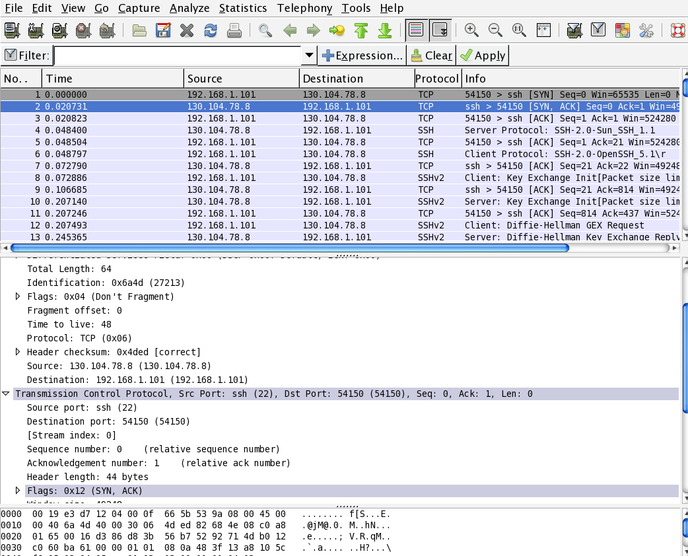
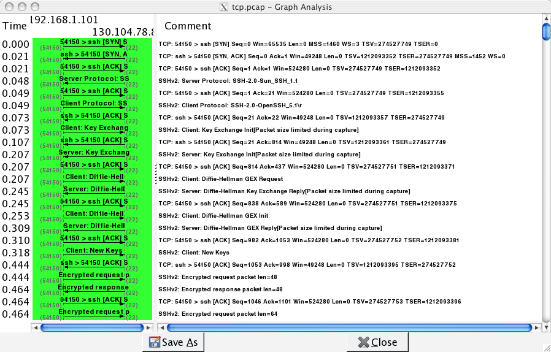
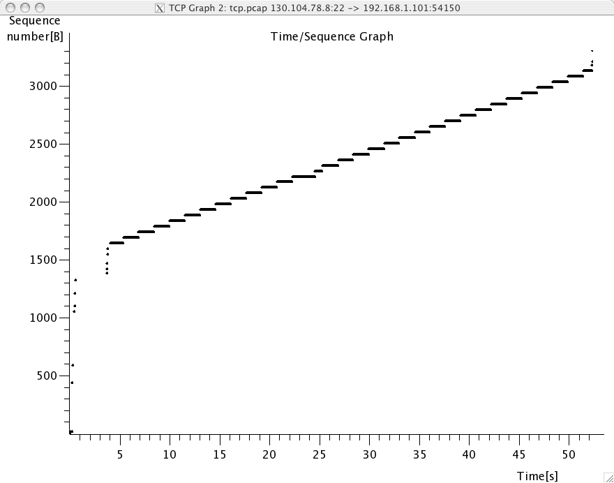
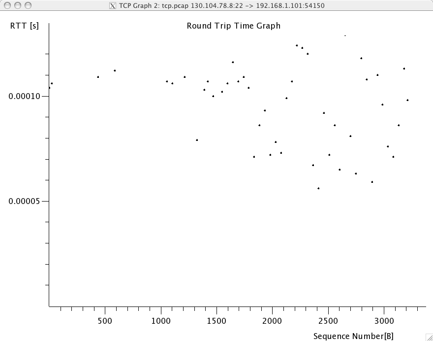

TCP congestion control
======================

The TCP congestion control mechanisms, defined in :rfc:`5681` plays a key role in today's Internet. Without this mechanism that was first defined and implemented in the late 1980s, the Internet would not have been able to continue to work until now. The objective of this exercise is to allow you to have a better understanding of the operation of TCP's congestion control mechanism by analysing all the segments exchanged over a TCP connection.

The deadline for this exercise is Tuesday October 27th, 13.00.

Experimental setup
------------------

For this exercise, we have performed measurements in the emulated [#femulation]_ network shown below.

.. figure:: fig/emulated-network-001-c.png
   :align: center

   Emulated network

The emulated network is composed of three UML machines [#fcongestion]_: a client, a server and a router. The client and the server are connected via the router. The client sends 1 MBytes of data to the server by using iperf_. The link between the router and the client is controlled by using the `netem <http://www.linuxfoundation.org/en/Net:Netem>`_ Linux kernel module. This module allows us to insert additional delays, reduce the link bandwidth and insert random packet losses. 

We used `netem <http://www.linuxfoundation.org/en/Net:Netem>`_ To perform three measurements :

#. no losses on the link between `R` and `S`, 100 milliseconds of delay
#. 1% of segment losses on the link between `R` and `S`, 100 milliseconds of delay
#. 10% of segment losses on the link between `R` and `S`, 100 milliseconds of delay

Note that due to the way `netem <http://www.linuxfoundation.org/en/Net:Netem>`_ has been configured, the delays and the losses are only applied on packets received by `S`, not on packets sent by `S`.

For each measurement, we have collected a packet trace that can be analysed by using wireshark_ and two tcpprobe_ traces. You can download these traces from the links below :

 - :download:`traces/0pc_100msec.tar.gz` : 100 milliseconds delay, no packet losses
 - :download:`traces/1pc_100msec.tar.gz` : 100 milliseconds delay, 1% packet losses
 - :download:`traces/10pc_100msec.tar.gz` : 100 milliseconds delay, 10% packet losses

Each team of two students will analyse these three traces, first by using wireshark_ and then by looking at the tcpprobe_ trace to find more detailed explanation. For each trace, you must : 

 1. identify the TCP options that have been used on the TCP connection
 2. try to find explanations for the evolution of the round-trip-time on each of these TCP connections. For this, you can use the `round-trip-time` graph of wireshark_
 3. verify whether the TCP implementation used implemented `delayed acknowledgements`
 3. analyse the packet trace without packet losses and explain the behaviour of TCP congestion control scheme by looking at the tcpprobe_ traces
 4. inside the traces with packet losses, find :

   a. one segment that has been retransmitted by using `fast retransmit`. Explain this retransmission in details.
   b. one segment that has been retransmitted thanks to the expiration of TCP's retransmission timeout. Explain why this segment could not have been retransmitted by using `fast retransmit`.

 6. wireshark_ contain several two useful graphs : the `round-trip-time` graph and the `time sequence` graph. Explain how you would compute the same graph from such a trace 

 7. When displaying TCP segments, recent versions of wireshark_ contain `expert analysis` heuristics that indicate whether the segment has been retransmitted, whether it is a duplicate ack or whether the retransmission timeout has expired. Explain how you would implement the same heuristics as wireshark_. 
 

Packet trace analysis tools
---------------------------

When debugging networking problems or to analyse performance problems, it is sometimes useful to capture the segments that are exchanged between two hosts and to analyse them.  

Several packet trace analysis softwares are available, either as commercial or open-source tools. These tools are able to capture all the packets exchanged on a link. Of course, capturing packets require administrator privileges. They can also analyse the content of the captured packets and display information about them. The captured packets can be stored in a file for offline analysis.

tcpdump_ is probably one of the most well known packet capture software. It is able to both capture packets and display their content. tcpdump_ is a text-based tool that can display the value of the most important fields of the captured packets. Additional information about tcpdump_ may be found in :manpage:`tcpdump(1)`. The text below is an example of the output of tcpdump_ for the first TCP segments exchanged on an scp transfer between two hosts ::

 21:05:56.230737 IP 192.168.1.101.54150 > 130.104.78.8.22: S 1385328972:1385328972(0) win 65535 <mss 1460,nop,wscale 3,nop,nop,timestamp 274527749 0,sackOK,eol>
 21:05:56.251468 IP 130.104.78.8.22 > 192.168.1.101.54150: S 3627767479:3627767479(0) ack 1385328973 win 49248 <nop,nop,timestamp 1212093352 274527749,mss 1452,nop,wscale 0,nop,nop,sackOK>
 21:05:56.251560 IP 192.168.1.101.54150 > 130.104.78.8.22: . ack 1 win 65535 <nop,nop,timestamp 274527749 1212093352>
 21:05:56.279137 IP 130.104.78.8.22 > 192.168.1.101.54150: P 1:21(20) ack 1 win 49248 <nop,nop,timestamp 1212093355 274527749>
 21:05:56.279241 IP 192.168.1.101.54150 > 130.104.78.8.22: . ack 21 win 65535 <nop,nop,timestamp 274527749 1212093355>
 21:05:56.279534 IP 192.168.1.101.54150 > 130.104.78.8.22: P 1:22(21) ack 21 win  65535 <nop,nop,timestamp 274527749 1212093355> 
 21:05:56.303527 IP 130.104.78.8.22 > 192.168.1.101.54150: . ack 22 win 49248 <nop,nop,timestamp 1212093357 274527749>
 21:05:56.303623 IP 192.168.1.101.54150 > 130.104.78.8.22: P 22:814(792) ack 21 win 65535 <nop,nop,timestamp 274527749 1212093357>

You can easily recognise in the output above the `SYN` segment containing the `MSS`, `window scale`, `timestamp` and `sackOK` options, the `SYN+ACK` segment whose `wscale` option indicates that the server uses window scaling for this connection and then the first few segments exchanged on the connection.

wireshark_ is more recent than tcpdump_. It evolved from the ethereal packet trace analysis software. It can be used as a text tool like tcpdump_. For a TCP connection, wireshark_ would provide almost the same output as tcpdump_. The main advantage of wireshark_ is that it also includes a graphical user interface that allows to perform various types of analysis on a packet trace.

   Wireshark : default window

The wireshark window is divided in three parts. The top part of the window is a summary of the first packets from the trace. By clicking on one of the lines, you can show the detailed content of this packet in the middle part of the window. The middle of the window allows you to inspect all the fields of the captured packet. The bottom part of the window is the hexadecimal representation of the packet, with the field selected in the middle window being highlighted.

wireshark_ is very good at displaying packets, but it also contains several analysis tools that can be very useful. The first tool is `Follow TCP stream`. It is part of the `Analyze` menu and allows you to reassemble and display all the payload exchanged during a TCP connection. This tool can be useful if you need to analyse for example the commands exchanged during a SMTP session.

The second tool is the flow graph that is part of the `Statistics` menu. It provides a time sequence diagram of the packets exchanged with some comments about the packet contents. See blow for an example.

   Wireshark : flow graph

The third set of tools are the `TCP stream graph` tools that are part of the `Statistics menu`. These tools allow you to plot various types of information extracted from the segments exchanged during a TCP connection. A first interesting graph is the `sequence number graph` that shows the evolution of the sequence number field of the captured segments with time. This graph can be used to detect graphically retransmissions.

   Wireshark : sequence number graph

A second interesting graph is the `round-trip-time` graph that shows the evolution of the round-trip-time in function of time. This graph can be used to check whether the round-trip-time remains stable or not. Note that from a packet trace, wireshark_ can plot two `round-trip-time` graphs, One for the flow from the client to the server and the other one. wireshark_ will plot the `round-trip-time` graph that corresponds to the selected packet in the top wireshark_ window. 

   Wireshark : round-trip-time graph

scapy_
......

In addition to allowing you to send and receive packets, scapy_ also allows you to easily read packet traces captured by tools such as tcpdump_ or wireshark_ provided that they are in the libpcap_ format. The `rdpcap` method allows you to read an entire trace in memory and convert it into a list of scapy_ packets ::

   >>> l=rdpcap("/mnt/host/tcp.pcap")
   >>> l   
   <tcp.pcap: TCP:2863 UDP:48 ICMP:0 Other:14>

This packet trace contains 2863 TCP segments, 48 UDP segments and 14 other packets. You can easily access any of the TCP segments of the trace ::

 >>> l[1234]
 <Ether  dst=00:19:e3:d7:12:04 src=00:0f:66:5b:53:9a type=0x800 |<IP  version=4L ihl=5L tos=0x0 len=64 id=27625 flags=DF frag=0L ttl=48 proto=tcp chksum=0x4c51 src=130.104.78.8 dst=192.168.1.101 options='' |<TCP  sport=ssh dport=54150 seq=3627769700L ack=1386377058 dataofs=11L reserved=0L flags=A window=49248 chksum=0xcab2 urgptr=0 options=[('NOP', None), ('NOP', None), ('Timestamp', (1212095749, 274527976)), ('NOP', None), ('NOP', None), ('SAck', (1386379938, 1386400098))] |>>>
 >>> ls(l[1234][TCP])      
 sport      : ShortEnumField       = 22              (20)
 dport      : ShortEnumField       = 54150           (80)
 seq        : IntField             = 3627769700L     (0)
 ack        : IntField             = 1386377058      (0)
 dataofs    : BitField             = 11L             (None)
 reserved   : BitField             = 0L              (0)
 flags      : FlagsField           = 16L             (2)
 window     : ShortField           = 49248           (8192)
 chksum     : XShortField          = 51890           (None)
 urgptr     : ShortField           = 0               (0)
 options    : TCPOptionsField      = [('NOP', None), ('NOP', None), ('Timestamp', (1212095749, 274527976)), ('NOP', None), ('NOP', None), ('SAck', (1386379938, 1386400098))] ({})
 >>> l[1234][TCP].window
 49248

You can write python scripts to extract information from a libpcap trace. When writing such a script, do not forget that the trace contains the segments sent and received by a host. For this exercise, scapy_ is not required. You can answer the questions without using scapy_

tcpprobe_
.........

During the previous exercise, you have used :manpage:`netstat(8)` To lookup the state of the TCP connections on a given host. On the Linux kernel, there are tools that can provide more information than :manpage:`netstat(8)`. One of these tools is the `TCPProbe <http://www.linuxfoundation.org/en/Net:TcpProbe>`_ kernel module. When installed on a Linux kernel, this kernel module prints one ASCII line containing the following information upon the arrival and the transmission of each TCP segment :

 #. The timestamp (seconds.nanoseconds)
 #. The source endpoint (address:port)
 #. The destination endpoint (address:port)  
 #. This column should be ignored
 #. This column should be ignored
 #. The current value of `snd.nxt`
 #. The current value of `snd.una`
 #. The current value of the congestion window `snd.cwnd` (in segments)
 #. The current value of the slow-start threshold `snd.ssthresh` (in segments)
 #. The current size of the sending window `snd.wnd` (in bytes)
 #. The current value of the smoothed round-trip-time `srtt` (in multiples of 10 milliseconds)
 #. The current value of `rcv.nxt`
 #. This column should be ignored
 #. The current value of the receive window `rcv.wnd`

A sample TCPProbe trace is shown below ::

 14.449378000 192.168.10.2:48044 192.168.12.2:5001 0 32 0x6fed8c49 0x6fed8689 2 2147483647 5792 8 0x6fe931b6 0x6fe931b6 5840
 14.459272000 192.168.10.2:48044 192.168.12.2:5001 0 32 0x6fed9799 0x6fed86a1 3 2147483647 5792 7 0x6fe931b6 0x6fe931b6 5840
 14.471374000 192.168.10.2:48044 192.168.12.2:5001 0 32 0x6feda2e9 0x6fed8c49 4 2147483647 8688 6 0x6fe931b6 0x6fe931b6 5840
 14.483485000 192.168.10.2:48044 192.168.12.2:5001 0 32 0x6fedae39 0x6fed91f1 5 2147483647 11584 6 0x6fe931b6 0x6fe931b6 5840
 14.495677000 192.168.10.2:48044 192.168.12.2:5001 0 32 0x6fedb989 0x6fed9799 6 2147483647 14480 5 0x6fe931b6 0x6fe931b6 5840
 14.507770000 192.168.10.2:48044 192.168.12.2:5001 0 32 0x6fedc4d9 0x6fed9d41 7 2147483647 17376 5 0x6fe931b6 0x6fe931b6 5840
 14.519939000 192.168.10.2:48044 192.168.12.2:5001 0 32 0x6fedd029 0x6feda2e9 8 2147483647 20272 5 0x6fe931b6 0x6fe931b6 5840
 14.532096000 192.168.10.2:48044 192.168.12.2:5001 0 32 0x6feddb79 0x6feda891 9 2147483647 23168 5 0x6fe931b6 0x6fe931b6 5840

As you can see from the trace, the values of `snd.nxt` and `snd.una` are in hexadecimal. The congestion window and the slow-start threshold are expressed in MSS-sized segments. We see clearly in the trace above the congestion window that increases. The slow-start threshold is initialised at `2147483647` when the TCP connection starts. Its value will be updated after the first congestion event.
Information from a tcpprobe_ trace can be easily plotted by using a tool such as gnuplot. See http://www.linuxfoundation.org/en/Net:TcpProbe for an example gnuplot script to plot the evolution of `snd.cwnd` and `snd.ssthresh`.

.. rubric:: Footnotes

.. [#femulation] With an emulated network, it is more difficult to obtain quantitative results than with a real network since all the emulated machines need to share the same CPU and memory. This creates interactions between the different emulated machines that do not happen in the real world. However, since the objective of this exercise is only to allow the students to understand the behaviour of the TCP congestion control mechanism, this is not a severe problem.

.. [#fcongestion] For more information about the TCP congestion control schemes implemented in the Linux kernel, see http://linuxgazette.net/135/pfeiffer.html and http://www.cs.helsinki.fi/research/iwtcp/papers/linuxtcp.pdf or the source code of a recent Linux. A description of some of the sysctl variables that allow to tune the TCP implementation in the Linux kernel may be found in http://fasterdata.es.net/TCP-tuning/linux.html. For this exercise, we have configured the Linux kernel to use the NewReno scheme :rfc:`3782` that is very close to the official standard defined in :rfc:`5681`

.. include:: ../../book/links.rst
