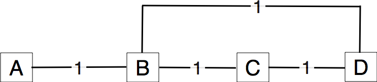
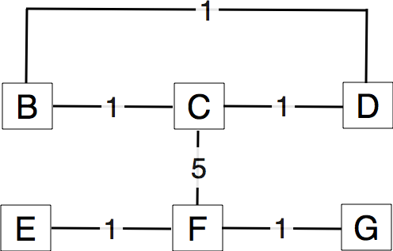

Routing protocols
=================

The network layer contains two types of protocols :

 - the *data plane* protocols such as IP that define the format of the packets that are exchanged between routers and how they must be forwarded
 - the *routing protocols*, that are part of the *control plane*. Routers exchange routing messages in order to build their routing tables and forwarding tables to forward the packets in the data plane

Several types of routing protocols are used in computer networks. In this set of exercises, you will study intradomain routing protocols. More precisely, you  will analyse the operation of routing protocols that use distance vectors or link-state. 

Questions
---------

1. Routing protocols used in IP networks only use positive link weights. What would happen with a distance vector routing protocol in the network below that contains a negative link weight ?

.. figure:: fig/routing-fig-001-c.png 
   :align: center 
   :scale: 50 

   Simple network

2. Same question as above with a link weight set to zero.

3. When a network specialist designs a network, one of the problems that he needs to solve is to set the metrics the links in his network. In the USA, the Abilene network interconnects most of the research labs and universities. The figure below shows the topology [#fabilene]_ of this network in 2009.

.. figure:: fig/abilene-web-map.png
   :align: center
   :scale: 50 

   The Abilene network
 
In this network, assume that all the link weights are set to 1. What is the paths followed by a packet sent by the router located in `Los Angeles` to reach :

  * the router located in `New York` 
  * the router located in `Washington` ?

 * Is it possible to configure the link metrics so that the packets sent by the router located in `Los Angeles` to the routers located in respectively `New York` and `Washington` do not follow the same path ? 

 * Is it possible to configure the link weights so that the packets sent by the router located in `Los Angeles` to router located in `New York` follow one path while the packets sent by the router located in `New York` to the router located in  `Los Angeles` follow a completely different path ?

 * Assume that the routers located in `Denver` and `Kansas City` need to exchange lots of packets. Can you configure the link metrics such that the link between these two routers does not carry any packet sent by another router in the network ?

4. In the five nodes network shown below, can you configure the link metrics so that the packets sent by router `E` to router `A` use link `B->A` while the packets sent by router `B` use links `B->D` and `D->A`?

.. figure:: fig/routing-fig-003-c.png 
   :align: center 
   :scale: 50 

   Simple five nodes network

5. In the five nodes network shown above, assuming that all link weights are set to `1`, what is the path followed by `E` to reach `D` ?

6. In the five nodes network shown above, can you configure the link weights so that the packets sent by router `E` (resp. `F`) follow the `E->B->A` path (resp. `F->D->B->A`) ?

7. In the five nodes network shown above, can you configure the link weights so that no packet is ever sent on the link between routers `B` and `D` ?

8. In the five nodes network shown above, can you configure the link weigths so that the packets sent by `A` towards `E` follow the path `A->D->B->E` while the packets sent by `B` towards `E` follow the path `B->D->F`?

9. In the five nodes network shown above, assuming unitary link weights, is it possible that the packets sent by `X` towards `Y` follow the reverse path of the packets sent by `Y` towards `X` ?

10. In the network above, is it possible to configure the link weights so that the paths `E->F->D->A`, `E->B->D->A` and `E->B->A` have the same cost ?

11. Consider the network below and assume that it uses distance vectors with the weights shown in the figure. List all the distance vectors that are exchanged until all routers have a route to reach each other router in the network.

   A four routers network

12. In the figure above, what are the messages exchanged when the network administrator reconfigures the link `B-D` with a weight of `9` ?

13. In the figure above (all link weights are set to `1`), what are the messages exchanged when link `C-D` fails ?

14. Consider again the four routers network shown above with the link weights shown in the figure, but now with a link state routing protocol. 

 - What are the link state packets sent by each router in the network ? 
 - What are the routing tables computed by using the Dijkstra algorithm on each router ?
 - Which link state packets are sent when link `B-C` fails ?
 - Which link state packets are sent when the network administrator reconfigures the link `B-D` to use a weight of `9` ? Does this change affects the routing tables ? 
 - What happens

15. Consider the six-routers network shown in the figure below. 

 - Assume that a distance vector routing protocol is used. What are the routing tables on each router ? Which messages are exchanged and when link `C-F` fails ?
 - Assume now that a link state routing protocol is used. What are the routing tables on each router ? Which link state packets are exchanged and when link `C-F` fails ?

   A six routers network

.. rubric:: Footnotes

.. [#fabilene] This figure was downloaded from the Abilene observatory http://www.internet2.edu/observatory/archive/data-views.html. This observatory contains a detailed description of the Abilene network including detailed network statistics and all the configuration of the equipment used in the network. 
