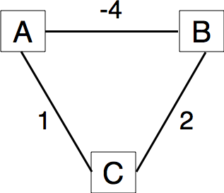
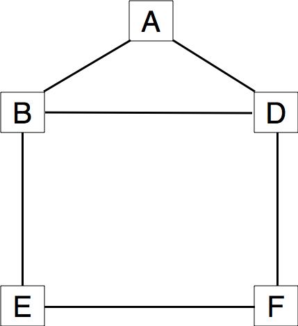
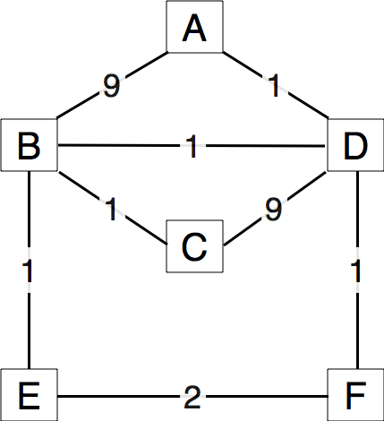

Routing protocols
=================

The network layer contains two types of protocols :

 - the *data plane* protocols such as IP that define the format of the packets that are exchanged between routers and how they must be forwarded
 - the *routing protocols*, that are part of the *control plane* that exchange routing messages in order to build the routing tables and forwarding tables used by the routers to forward the packets in the data plane

Several types of routing protocols are used in IP networks. In this exercises, we will study the distance vector intradomain routing protocols. More precisely, we will analyse the opration of a routing protocol that uses distance vectors with split horizon.

The deadline for this exercise is Tuesday November 3rd, 13.00. Inside each group, each team of two students will write a small report in pdf format containing the answers to the questions below.

Questions
---------

1. Routing protocols used in IP networks only use positive link weights. What would happen with a distance vector routing protocol in the network below that contains a negative link weight ?

   Simple network

2. When a network specialist designs a network, one of the problems that he needs to solve is to seet the weights of the links in his network. In the USA, the Abilene network interconnects most of the research labs and universities. The figure below shows the topology [#fabilene]_ of this network in 2009.

.. figure:: fig/abilene-web-map.png
   :align: center

   Abilene

* In this network, assume that all the link weights are set to 1. What are the paths followed by packet sent by the router in `Los Angeles` to reach the router in `New York` and `Washington` ?

* Is it possible to configure the link weights so that the packets sent by `Los Angeles` to `New York` and `Washington` do not follow the same path ? 

* Is it possible to configure the link weights so that the packets sent by `Los Angeles` to `New York` follow one path while the packets sent by `New York` to reach `Los Angeles` follow a completely different path ?

* Assume that `Denver` and `Kansas City` need to exchange lots of packets. Can you configure the link metrics such that the link between these two routers does not carry any packet coming from other routers in the network ?

3. In the five nodes network shown below, can you configure the link weights so that the packets sent by `E` to `A` use link `B->A` while the packets sent by `B` use links `B->D` and `D->A`?

   Simple five nodes network

4. In the five nodes network shown above, can you configure the link weights so that the packets sent by `E` (resp. `F`) follow the `E->B->A` path (resp. `F->

5. In the above questions, you have worked on the stable state of the routing tables computed by routing protocols. Let us now consider the transient problems that main happen when the network topology changes [#ffailures]_. For this, consider the network topology shown in the figure below and assume that all routers use a distance vector protocol that uses split horizon.

   Simple network 

* Compute the routing tables of all routers in this network

* The link between routers `B` and `D` fails. B detects the failure at time `t0` and `D` detects the failure 2 seconds later. Simulate the operation of the *distance vector* routing protocol with *split horizon* running on all routers. For the simulation, assume that a router needs two milliseconds to send its distance vector over one link and that it needs 10 milliseconds to recompute its routing table after any modification. The link delays can be neglected. Assume that a router sends immediately its distance vector once it has recomputed its routing table upon reception of a distance vector from one of its neighbors. Once a router has updated its routing, verify the path that it uses to reach the other routers and indicate any problem.

* The link between routers `B` and `D` comes back. Perform the same analysis as in the previous question.

.. rubric:: Footnotes

.. [#fabilene] This figure was downloaded from the Abilene observatory http://www.internet2.edu/observatory/archive/data-views.html. This observatory contains a detailed description of the Abilene network including detailed network statistics and all the configuration of the equipment used in the network. 

.. [#ffailures] The main events that can affect the topology of a network are :
 - the failure of a link. Measurements performed in IP networks have shown that such failures happen frequently and usually for relatively short periods of time
 - the addition of one link in the network. This may be because a new link has been provisionned or more frequently because the link failed some time ago and is now back
 - the failure/crash of a router followed by its reboot. 
 - a change in the metric of a link by reconfiguring the routers attached to the link
