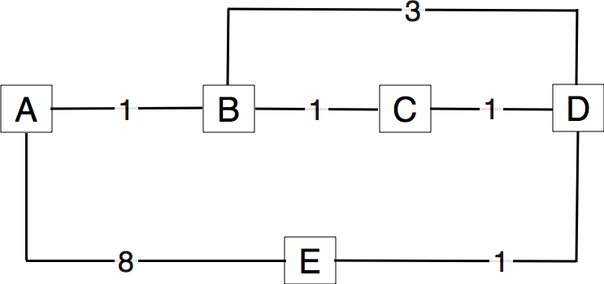

A prototype IPv4 router in scapy_
=================================

During this exercise, you will implement a subset of a prototype IPv4 router by using scapy_. Your router will be able to :
 - forward IPv4 packets
 - reply to ICMP `Echo request` messages produced by :manpage:`ping(8)`
 - support :manpage:`traceroute(8)`

The deadline for this exercise is Tuesday November 10th, 13.00.

1. In the previous questions, you have worked on the stable state of the routing tables computed by routing protocols. Let us now consider the transient problems that main happen when the network topology changes [#ffailures]_. For this, consider the network topology shown in the figure below and assume that all routers use a distance vector protocol that uses split horizon.

   Simple network 

If you compute the routing tables of all routers in this network, you would obtain a table such as the table below :

 ===========  ========  ========  =======  =======  =======
 Destination   Routes   Routes    Routes   Routes   Routes  
 	       on A     on B      on C     on D     on E
 -----------  --------  --------  -------  -------  -------
 A             0        1 via A   2 via B  3 via C  4 via D
 B 	       1 via B  0     	  1 via B  2 via C  3 via D
 C             2 via B  1 via C	  0        1 via C  2 via D
 D             3 via B  2 via C	  1 via D  0 	    1 via D
 E             4 via B  3 via C	  2 via D  1 via E  0
 ===========  ========  ========  =======  =======  =======

 Distance vector protocols can operate in two different modes : `periodic updates` and `triggered updates`. `Periodic updates` is the default mode for a distance vector protocol. For example, each router could advertise its distance vector every thirty seconds. With the `triggered updates` a router sends its distance vector when its routing table changes (and periodically when there are no changes).  

 * Consider a distance vector protocol using split horizon and `periodic updates`. Assume that the link `B-C` fails. `B` and `C` update their local routing table but they will only advertise it at the end of their period. Select one ordering for the  `periodic updates` and every time a router sends its distance vector, indicate the vector sent to each neighbor and update the table above. How many periods are required to allow the network to converge to a stable state ?

 * Consider the same distance vector protocol, but now with `triggered updates`. When link `B-C` fails, assume that `B` updates its routing table immediately and sends its distance vector to `A` and `D`. Assume that both `A` and `D` process the received distance vector and that `A` sends its own distance vector, ... Indicate all the distance vectors that are exchanged and update the table above each time a distance vector is sent by a router (and received by other routers) until all routers have learned a new route to each destination. How many distance vector messages must be exchanged until the network converges to a stable state ?

2. Consider the network shown below. In this network, the metric of each link is set to `1` except link `A-B` whose metric is set to `4` in both directions. In this network, there are two paths with the same cost between `D` and `C`. Old routers would randomly select one of these equal cost paths and install it in their forwarding table. Recent routers are able to use up to `N` equal cost paths towards the same destination. 

 .. figure:: fig/BGP-figs-010-c.png
    :align: center
    :scale: 70
   
    A simple network running a link state routing protocol

 On recent routers, a lookup in the forwarding table for a destination address returns a set of outgoing interfaces. How would you design an algorithm that selects the outgoing interface used for each packet, knowing that to avoid reordering, all segments of a given TCP connection should follow the same path ? 

2. Consider again the network shown above. After some time, the routing protocol converges and all routers compute the following routing tables :

 ===========  ========  =========  =========  =========  =========
 Destination   Routes   Routes     Routes     Routes   	 Routes  
 	       on A     on B       on C       on D     	 on E
 -----------  --------  ---------  ---------  ---------  ---------
 A             0        2 via C    1 via A    3 via B,E  2 via C
 B 	       2 via C  0     	   1 via B    1 via B    2 via D,C
 C             1 via C  1 via C	   0          2 via B,E  1 via C
 D             3 via C  1 via D	   2 via B,E  0 	 1 via D
 E             2 via C  2 via C,D  1 via E    1 via E    0
 ===========  ========  =========  =========  =========  =========

An important difference between distance vector and link state routing is that link state routers flood link state packets that allow the other routers to recompute their own routing tables while distance vector routers exchange distance vectors. Consider that link `B-C` fails and that router `B` is the first to detect the failure. At this point, `B` cannot reach anymore `A`, `C` and 50% of its paths towards `E` have failed. `C` cannot reach `B` anymore and half of its paths towards `D` have failed.

Router `B` will flood its updated link state packet through the entire network and all routers will recompute their forwarding table. Upon reception of a link state packet, routers usually first flood the received link-state packet and then recompute their forwarding table. Assume that `B` is the first to recompute its forwarding table, followed by `D`, `A`, `C` and finally `E`

#. After each update of a forwarding table, verify which pairs of routers are able to exchange packets. Provide your answer using a table similar to the one shown above.
#. Can you find an ordering of the updates of the forwarding tables that avoids all transient problems ?

.. [#ffailures] The main events that can affect the topology of a network are :
 - the failure of a link. Measurements performed in IP networks have shown that such failures happen frequently and usually for relatively short periods of time
 - the addition of one link in the network. This may be because a new link has been provisioned or more frequently because the link failed some time ago and is now back
 - the failure/crash of a router followed by its reboot. 
 - a change in the metric of a link by reconfiguring the routers attached to the link
 See http://totem.info.ucl.ac.be/lisis_tool/lisis-example/ for an analysis of the failures inside the Abilene network in June 2005 or http://citeseer.ist.psu.edu/old/markopoulou04characterization.html for an analysis of the failures affecting a larger ISP network

.. exercices complementaires : calculer 8/13,  adresse plus basse et plus haute, découper un bloc /9 en deux plus petits blocs, ...

Internet Protocol
-----------------

1. For the following IPv4 subnets, indicate the smallest and the largest IPv4 address inside the subnet :

 - 8.0.0.0/8
 - 172.12.0.0/16
 - 200.123.42.128/25
 - 12.1.2.0/13

2. For the following IPv6 subnets, indicate the smallest and the largest IPv6 address inside the subnet :
 
 - FE80::/64
 - 2001:db8::/48
 - 2001:6a8:3080::/48

3. netkit_ allows to easily perform experiments by using an emulated environment is is composed of virtual machines running User Model Linux. netkit_ allows to setup a small network in a lab and configure it as if you had access to several PCs interconnected by using cables and network equipments.

 A netkit_ lab is defined as a few configuration files and scripts :
  
  - `lab.conf` is a textfile that defines the virtual machines and the network topology. A simple `lab.conf` file is shown below :

  ::
   LAB_DESCRIPTION="a string describing the lab"
   LAB_VERSION=1.0
   LAB_AUTHOR="the author of the lab"
   LAB_EMAIL="email address of the author"
    
   h1[0]="lan"
   h2[0]="lan"

  This configuration file requests the creation of two virtual machines, named `h1` and `h2`. Each of these hosts has one network interface (`eth0`) that is connected to the local area network named `"lan"`. netkit_ allows to define several interfaces on a given host and attach them to different local area networks.

  - a `host.startup` file for each host (`h1.startup` and `h2.startup` in the example above). This file is a shell script that is executed at the end of the boot of the virtual host. This is typically in this script that the network interfaces are configured and the daemons are launched.
  - a directory for each host (`h1` and `h2` in the example above). This directory is used to store configuration files that must be copied on the virtual machine's filesystems when they are first created.

 netkit_ contains several scripts that can be used to run a lab. `lstart` allows to launch a lab and `lhalt` allows to halt the machines at the end of a lab. If you need to exchange files between the virtual machines and the Linux host on which netkit_ runs, note that the virtual hosts mount the directory that contains the running lab in `/hostlab` and your home directory in `/hosthome`.

 For this exercise, you will use a netkit_ lab containing 4 hosts and two routers. The configuration files are available :download:`netkit/lab-2routers.tar.gz`. The network topology of this lab is shown in the figure below.

.. figure:: ../S6/fig/routing-fig-008-c.png
   :scale: 50

   The two routers lab
 
 In this network, we will use subnet `172.12.1.0/24` for lan1, `172.12.2.0/24` for lan2 and `172.12.3.0/24` for lan3.

 On Linux, the IP addresses assigned on an interface can be configured by using :manpage:`ifconfig(8)`. When :manpage:`ifconfig(8)` is used without parameters, it lists all the existing interfaces of the host with their configuration. A sample :manpage:`ifconfig(8)` output is shown below ::

 host:~# ifconfig
 eth0	  Link encap:Ethernet  HWaddr FE:3A:59:CD:59:AD  
          Inet addr:192.168.1.1  Bcast:192.168.1.255  Mask:255.255.255.0
          inet6 addr: fe80::fc3a:59ff:fecd:59ad/64 Scope:Link
          UP BROADCAST RUNNING MULTICAST  MTU:1500  Metric:1
          RX packets:3 errors:0 dropped:0 overruns:0 frame:0
          TX packets:3 errors:0 dropped:0 overruns:0 carrier:0
          collisions:0 txqueuelen:1000 
          RX bytes:216 (216.0 b)  TX bytes:258 (258.0 b)
          Interrupt:5 
 lo       Link encap:Local Loopback  
          inet addr:127.0.0.1  Mask:255.0.0.0
          inet6 addr: ::1/128 Scope:Host
          UP LOOPBACK RUNNING  MTU:16436  Metric:1
          RX packets:0 errors:0 dropped:0 overruns:0 frame:0
          TX packets:0 errors:0 dropped:0 overruns:0 carrier:0
          collisions:0 txqueuelen:0 
          RX bytes:0 (0.0 b)  TX bytes:0 (0.0 b)

 
 This host has two interfaces : the loopback interface (`lo` with IPv4 address `127.0.0.1` and IPv6 address `::1`) and the `eth0` interface. The `192.168.1.1/24` address and a link local IPv6 address (`fe80::fc3a:59ff:fecd:59ad/64`) have been assigned to interface `eth0`. The broadcast address is used in some particular cases, this is outside the scope of this exercise. :manpage:`ifconfig(8)` also provides statistics such as the number of packets sent and received over this interface. Another important information that is provided by :manpage:`ifconfig(8)` is the hardware address (HWaddr) used by the datalink layer of the interface. On the example above, the `eth0` interface uses the 48 bits `FE:3A:59:CD:59:AD` hardware address.

 You can configure the IPv4 address assigned to an interface by specifying the address and the netmask ::

 ifconfig eth0 192.168.1.2 netmask 255.255.255.128 up

or you can also specify the prefix length ::

 ifconfig eth0 192.168.1.2/25 up

 In both cases, `ifconfig eth0` allows you to verify that the interface has been correctly configured ::

 eth0      Link encap:Ethernet  HWaddr FE:3A:59:CD:59:AD  
           inet addr:192.168.1.2  Bcast:192.168.1.127  Mask:255.255.255.128
           inet6 addr: fe80::fc3a:59ff:fecd:59ad/64 Scope:Link
           UP BROADCAST RUNNING MULTICAST  MTU:1500  Metric:1
           RX packets:3 errors:0 dropped:0 overruns:0 frame:0
           TX packets:3 errors:0 dropped:0 overruns:0 carrier:0
           collisions:0 txqueuelen:1000 
           RX bytes:216 (216.0 b)  TX bytes:258 (258.0 b)
           Interrupt:5 

 
 Another important commant on Linux is :manpage:`route(8)` that allows to look at the contents of the routing table stored in the Linux kernel and change it. For example, `route -n` returns the contents of the IPv4 routing table. See :manpage:`route(8)` for a detailed description on how you can configure routes by using this tool. 

 #. Use :manpage:`ifconfig(8)` to configure the following IPv4 addresses :
  
   - `172.16.1.11/24` on interface `eth0` on `h1`
   - `172.16.1.12/24` on interface `eth0` on `h2`

 #. Use `route -n` to look at the contents of the routing table on the two hosts.
 #. Verify by using :manpage:`ping(8)` that `h1` can reach `172.16.1.12` 
 #. Use :manpage:`ifconfig(8)` to configure IPv4 address `172.16.1.1/24` on the `eth0` interface of `router1` and `172.16.2.1/24` on the `eth1` interface on this router.
 #. Since hosts `h1` and `h2` are attached to a local area network that contains a single router, this router can act as a default router. Add a default route on `h1` and `h2` so that they can use `router1` as their default router to reach any remote IPv4 address. Verify by using :manpage:`ping(8)` that `h1` can reach address `172.16.2.1`. 
 #. What do you need to configure on `router2`, `h3` and `h4` so that all hosts and routers can reach all hosts and routers in the emulated network ? Add the `ifconfig` and `route` commands in the `.startup` files of all the hosts so that the network is correctly configured when it is started by using `lstart`.

4. Do the same exercise as above by using IPv6. Assume that the subnet `2001:db8:1::/64` is used for `lan1`, `2001:db8:2::/64` is used for `lan2` and `2001:db8:3::/64` is used for `lan3`. Note that you should use :manpage:`ping6(8)` to ping an IPv6 address instead of :manpage:`ping(8)` 

5. RIP

todo
.. figure:: ../S6/fig/routing-fig-009-c.png
   :scale: 50

   The five routers lab

6. OSPF

todo
.. include:: ../../book/links.rst

.. exercices complementaires : calculer 8/13,  adresse plus basse et plus haute, découper un bloc /9 en deux plus petits blocs, ...
.. tp forwarding dans un réseau avec des routeurs
.. revoir mieux la configuration de base des uml, elle a posé des problèmes, penser à expliquer les routes par défaut, la configuration des adresses ip de chaque pc a pris du temps, voir comment on peut simplifier cela et mieux l'expliquer

