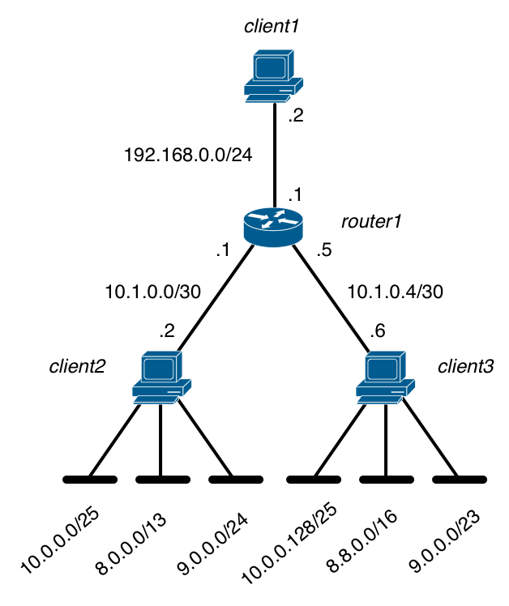

A prototype IPv4 router in scapy_
=================================

During this exercise, you will implement a subset of a prototype IPv4 router by using scapy_. Your router will be able to :
 - forward IPv4 packets
 - reply to ICMP `Echo request` messages produced by :manpage:`ping(8)`
 - support :manpage:`traceroute(8)`

The deadline for this exercise is Tuesday November 10th, 13.00.

Preparation of the lab
----------------------

The first step of this exercise is to prepare the configuration of the emulated network that you will use. Your emulated network will be composed of four virtual machines :
 - your router with three interfaces : `eth0`, `eth1` and `eth2`
 - three clients : `client1`, `client2` and `client3`. Each client has an `eth0` interface

The different interfaces have been connected as follows :
 - `eth0` on the router is connected to `eth0` on `client1`
 - `eth1` on the router is connected to `eth0` on `client2`
 - `eth2` on the router is connected to `eth0` on `client3`

.. note:: 

 The virtual machines will be placed in the `/etinfo/applications/uml2/` directory. You will find in the README file additional information about their installation. 

The clients will use the IPv4 implementation of the Linux kernel while the router will use your implementation written in scapy_. As you will use the emulated network to send and receive IPv4 packets, you need to configure the interfaces on all clients. On Linux, the IP addresses assigned on an interface can be configured by using :manpage:`ifconfig(8)`. When :manpage:`ifconfig(8)` is used without parameters, it lists all the existing interfaces of the host with their configuration. A sample :manpage:`ifconfig(8)` output is shown below ::

 UML1:~# ifconfig
 eth0      Link encap:Ethernet  HWaddr FE:3A:59:CD:59:AD  
          Inet addr:192.168.1.1  Bcast:192.168.1.255  Mask:255.255.255.0
          inet6 addr: fe80::fc3a:59ff:fecd:59ad/64 Scope:Link
          UP BROADCAST RUNNING MULTICAST  MTU:1500  Metric:1
          RX packets:3 errors:0 dropped:0 overruns:0 frame:0
          TX packets:3 errors:0 dropped:0 overruns:0 carrier:0
          collisions:0 txqueuelen:1000 
          RX bytes:216 (216.0 b)  TX bytes:258 (258.0 b)
          Interrupt:5 
 lo       Link encap:Local Loopback  
          inet addr:127.0.0.1  Mask:255.0.0.0
          inet6 addr: ::1/128 Scope:Host
          UP LOOPBACK RUNNING  MTU:16436  Metric:1
          RX packets:0 errors:0 dropped:0 overruns:0 frame:0
          TX packets:0 errors:0 dropped:0 overruns:0 carrier:0
          collisions:0 txqueuelen:0 
          RX bytes:0 (0.0 b)  TX bytes:0 (0.0 b)

This UML host has two interfaces : the loopback interface (`lo` with IPv4 address `127.0.0.1` and IPv6 address `::1`) and the `eth0` interface. The `192.168.1.1/24` address and a link local IPv6 address (`fe80::fc3a:59ff:fecd:59ad/64`) have been assigned to interface `eth0`. The broadcast address is used in some particular cases, this is outside the scope of this exercise. :manpage:`ifconfig(8)` also provides statistics such as the number of packets sent and received over this interface.

Another important information that is provided by :manpage:`ifconfig(8)` is the hardware address (HWaddr) used by the datalink layer of the interface. On the example above, the `eth0` interface uses the 48 bits `FE:3A:59:CD:59:AD` hardware address.

You can configure the IPv4 address assigned to an interface by specifying the address and the netmask ::

 ifconfig eth0 192.168.1.2 netmask 255.255.255.128

or you can also specify the prefix length ::

 ifconfig eth0 192.168.1.2/25

In both cases, `ifconfig eth0` allows you to verify that the interface has been correctly configured ::

 eth0      Link encap:Ethernet  HWaddr FE:3A:59:CD:59:AD  
           inet addr:192.168.1.2  Bcast:192.168.1.127  Mask:255.255.255.128
           inet6 addr: fe80::fc3a:59ff:fecd:59ad/64 Scope:Link
           UP BROADCAST RUNNING MULTICAST  MTU:1500  Metric:1
           RX packets:3 errors:0 dropped:0 overruns:0 frame:0
           TX packets:3 errors:0 dropped:0 overruns:0 carrier:0
           collisions:0 txqueuelen:1000 
           RX bytes:216 (216.0 b)  TX bytes:258 (258.0 b)
           Interrupt:5 

:manpage:`ifconfig` also allows you to configure several IPv4 addresses over a single physical interface. This is useful for some particular configuration and we will use these virtual interfaces to reduce the number of interfaces in our emulated network. The first virtual interface of `eth0` is `eth0:0`, the second `eth0:1`, ... You can configure a different IPv4 address on each virtual interface  ::

 ifconfig eth0:1 10.0.0.1/8 
 ifconfig eth0:1
 eth0:1    Link encap:Ethernet  HWaddr FE:3A:59:CD:59:AD  
           inet addr:10.0.0.1  Bcast:10.255.255.255  Mask:255.0.0.0
           UP BROADCAST RUNNING MULTICAST  MTU:1500  Metric:1
           Interrupt:5 

Use :manpage:`ifconfig(8)` to configure the following IPv4 addresses :
 - `192.168.0.2/24` on `eth0` on `client1`
 - `10.1.0.2/30` on `eth0` on `client2`
 -  one IPv4 address inside `10.0.0.0/25` on `eth0:0` on `client2` 
 -  one IPv4 address inside `8.0.0.0/13` on `eth0:1` on `client2` 
 -  one IPv4 address inside `9.0.0.0/24` on `eth0:2` on `client2` 
 - `10.1.0.6/30` on `eth0` on `client3`
 -  one IPv4 address inside `10.0.0.128/25` on `eth0:0` on `client3` 
 -  one IPv4 address inside `8.8.0.0/16` on `eth0:1` on `client3` 
 -  one IPv4 address inside `9.0.0.0/23` on `eth0:2` on `client3` 

   Testbed configuration

Concerning the addresses of the virtual interfaces on `client2` and `client3`, when there are overlapping prefixes, ensure that the address assigned in largest subnet on one client does not belong to the more specific subnet allocated to the other client. Verify the configuration of these addresses with :manpage:`ifconfig(8)`. For each interface, note its hardware address. Then, use :manpage:`ping(8)` on each virtual machine to verify that the locally assigned IPv4 addresses are working correctly.

The last point that you need to configure is the mapping between the IP addresses and the hardware addresses on the clients. When a client sends an IP packet inside on an Ethernet LAN, it places the packet inside an Ethernet frame that contains the hardware address of the source Ethernet interface, the hardware address
of the destination Ethernet interface and the entire IP packet. In a real network, a special protocol [#farp]_ is used for this, but implementing this protocol is outside the scope of this exercise. It is also possible to configure these mappings manually by using the :manpage:`arp(8)` software. :manpage:`arp(8)` inserts in the Linux kernel a static mapping between an IP address and an Ethernet address. :manpage:`arp(8)` can be used as follows ::

 UML2:~# arp -i eth0 -s 192.168.1.1 C6:41:03:34:F4:98`
 Uml2:~# arp -v -n
 Address                  HWtype  HWaddress           Flags Mask            Iface
 192.168.1.1              ether   c6:41:03:34:f4:98   CM                    eth0
 Entries: 1	Skipped: 0	Found: 1

The first line adds a mapping between IPv4 address `192.168.1.1` and hardware address `C6:41:03:34:F4:98` on interface `eth0`. The `arp -v -n` command allows you to see the content of the mapping table maintained by the kernel.

Use :manpage:`arp(8)` to insert the following mappings :
 - on `client1` insert a mapping between `192.168.0.1` and the hardware address of interface `eth0` on `router1`
 - on `client2` insert a mapping between `10.1.0.1` and the hardware address of interface `eth1` on `router1`
 - on `client3` insert a mapping between `10.1.0.6` and the hardware address of interface `eth2` on `router1`

Verify each mapping with `arp -v -n`. 

As your router will use scapy_ to process IPv4 packets, you need to disable IPv4 on the Linux kernel of the `router` virtual machine. This can be done by installing an :manpage:`iptables(8)` on each interface on your `router` ::

 iptables -A INPUT -p ip -i eth0 -j DROP
 iptables -A OUTPUT -p ip -i eth0 -j DROP
   

Implementation of a prototype IPv4 router in scapy_
---------------------------------------------------

scapy_ was optimised to allow hosts to easily send crafted IP packets, but it was not designed to implement a router that needs to forward packets. For this, you will need to understand a little bit of the operation of the datalink layer used in the emulated testbed. In the emulated testbed, Ethernet interfaces are emulated on each UML. We will explain in details the operation of Ethernet in the chapter dedicated to Local Area Networks. At this stage, the important information that you must know concerning Ethernet :
 - each Ethernet interface has a unique 48 bits hardware address
 - each Ethernet frame contains the hardware address of the interface on the host that sent the frame and the hardware address of the host that will receive the frame on this Ethernet network
 - Ethernet frames can contain up to 1500 bytes of data
 
You can obtain the 48 bits hardware addresses of the Ethernet interfaces on the emulated testbed by using :manpage:`ifconfig(8)` on each UML.

You can use scapy_ to easily build an Ethernet frame that contains an IPv4 packet and send it over a particular interface. For example, assuming that `client1` uses the `AA:AA:AA:AA:AA:AA` hardware address while `router1` uses address `BB:BB:BB:BB:BB:BB`, you can proceed as follows to send one IP packet from `client1` to the router ::
    
 # build an Ethernet frame containing an IP packet
 frame=Ether(src="AA:AA:AA:AA:AA:AA", dst="BB:BB:BB:BB:BB:BB")/IP(src="192.168.0.2",dst="192.168.0.1")
 # send the frame over the eth0 interface
 sendp(frame, iface="eth0")

Note that the code above uses `sendp` an not `send` to send the Ethernet frame. `send` uses the IP implementation and the routing tables on the local host to decide on which interface the packet should be forward. We will not use `send` in this exercise as your will use the routing tables that you implement in scapy_ and not the kernel's routing tables. 

scapy_ allows you to easily create and parse IPv4 packets and ICMP messages. For reference, here are the fields of the IPv4 header and of the ICMP header ::

 >>> ls(IP)
 version    : BitField             = (4)
 ihl        : BitField             = (None)
 tos        : XByteField           = (0)
 len        : ShortField           = (None)
 id         : ShortField           = (1)
 flags      : FlagsField           = (0)
 frag       : BitField             = (0)
 ttl        : ByteField            = (64)
 proto      : ByteEnumField        = (0)
 chksum     : XShortField          = (None)
 src        : Emph                 = (None)
 dst        : Emph                 = ('127.0.0.1')
 options    : IPoptionsField       = ('')
 >>> ls(ICMP)
 type       : ByteEnumField        = (8)
 code       : ByteField            = (0)
 chksum     : XShortField          = (None)
 id         : ConditionalField     = (0)
 seq        : ConditionalField     = (0)
 ts_ori     : ConditionalField     = (75208778)
 ts_rx      : ConditionalField     = (75208778)
 ts_tx      : ConditionalField     = (75208778)
 gw         : ConditionalField     = ('0.0.0.0')
 ptr        : ConditionalField     = (0)
 reserved   : ConditionalField     = (0)
 addr_mask  : ConditionalField     = ('0.0.0.0')
 unused     : ConditionalField     = (0)

To implement your prototype IPv4 router in scapy_, proceed as follows :

First, define several python data structures that allow you to store the configuration of your router, namely :

 - the list of all hardware addresses of your router
 - the list of all IPv4 addresses that have been assigned to your router
 - for each interface of your router, the hardware address of the `client` attached to this interface (we assume that the Ethernet links used in the emulated testbed model point-to-point links and ignore the issues that arise with local area networks)
 
Second, in addition to its list of IPv4 and hardware addresses, a router needs a routing table where it can easily perform a longest prefix match. Many data structures could be used to implement such a longest prefix match. For this exercise, use the py-radix library available from  http://www.mindrot.org/projects/py-radix/ . py-radix has been installed on the virtual machines in the lab. The `README <http://www.mindrot.org/files/py-radix/README>`_ file from the py-radix distribution contains some information about the utilisation of this data structure. For this exercise, you need to :

 - store in the radix tree the forwarding table that the router shown in the figure above would use. For this, insert each of the prefixes shown in the figure above in the radix tree and associate the appropriate interface as the `data` of each node
 - initialise a data structure that maps with each outgoing interface the hardware address of the nexthop router attached to this interface (`client1`, `client2` or `client3`)

Third, start your implementation with the skeleton below ::

   import Queue,sys,radix
   from scapy.packet import *
   from scapy.fields import *
   from scapy.automaton import *
   from scapy.layers.inet import *
   from scapy.sendrecv import *

   TIMEOUT = 2

   class InternetRouter(Automaton):
	# IP addresses local to the router
	local_ips = ... 
	
	# hardware addresses local to the router corresponding to each interface
	hard_addr_src = ... 
	# Remote hardware addresses corresponding to each interface
	hard_addr_dst = ... 
	
	def parse_args(self, **kargs):
	    Automaton.parse_args(self, **kargs)
	    # build the radix tree
	    ...

	# the master filter ensures that the router captures correctly
	# all Ethernet frames containing IP packets addresses to one
	# of its Ethernet interfaces 
    
	def master_filter(self, pkt):
	    return (IP in pkt and pkt.dst in self.mac_addr_src.values() )
	
	# Scapy IPv4 Forwarding Automata
		
	@ATMT.state(initial=1)
	def WAIT_FOR_PACKET_TO_FORWARD(self):
	    pass
		
	@ATMT.timeout(WAIT_FOR_PACKET_TO_FORWARD, TIMEOUT)
	def timeout_waiting_for_packet_to_forward(self):
		print "<WAIT_FOR_IP_PACKET/timeout>: Nothing to forward..."
		raise self.WAIT_FOR_PACKET_TO_FORWARD()	

Fourth, start to build your prototype router in scapy_ . Your first objective will be to support :manpage:`ping(8)`. A client, such as `client1` must be able to `ping` the IP address of your router (i.e. `192.168.0.1`) and receive the correct ICMP message in response. For this, define a first receive condition that process any IP packet whose destination address is one of the IPv4 addresses assigned to the router ::

	@ATMT.receive_condition(WAIT_FOR_PACKET_TO_FORWARD)
	def received_local_ICMP(self, pkt):
	    if (ICMP in pkt and pkt[IP].dst in self.local_ips and pkt[ICMP].type==`echo-request`):
	    ...

When building an ICMP message, scapy_ supports all the ICMP types and codes. An ICMP message is always sent inside an IPv4 packet. Note that when :manpage:`ping(8)` sends a ICMP echo request, it sets the value of the `seq` and ìd` fields. These two fields must be echoed in the returned `ICMP` `Echo reply` message. A typical ICMP `Echo reply` in response to a received ICMP `Echo request` will be built as follows ::

 IP(src=myIP,dst=pkt[IP].src)/ICMP(type='echo-reply', seq=pkt[ICMP].seq,id=pkt[ICMP].id)/pkt[Raw]

Fifth. Now that your router can receive packets on one of your its local addresses, the next step is to forward IPv4 packets. You will implement this forwarding as another receive condition ::

	@ATMT.receive_condition(WAIT_FOR_PACKET_TO_FORWARD, prio=2)			
	def received_fwd_IP(self, pkt):
	    if not (pkt[IP].dst in self.local_ips):
		 ...

To forward the packet, remember that a router needs to :
  - update the TTL (assume first that the decremented TTL is >0)
  - lookup the packet's destination address in the router's forwarding table using the radix tree (assume first that the packet destination is found in the forwarding table)
  - forward the packet over the appropriate outgoing interface

A real router would update the TTL of the received packet and recomputes the packet's checksum incrementally. In scapy, it is easier to extract the payload and the important fields of the received packet and create a new IPv4 packet as in this case scapy_ automatically computes the checksum. Once the IPv4 packet to be forwarded has been built, add it to an `Ether` frame whose source (resp. destination) hardware address is the hardware address of the router (resp. nexthop router - i.e. `client1` or `client2` in this exercise) on the outgoing link. 

Test that your router works by performing a :manpage:`ping(8)` from `client1` to the addresses configured on `client2` and `client3`.

Finally, a real router should also send ICMP messages in case of errors. Modify your code so that your router :
 - sends an ICMP `TTL Exceeded` messages when it receives a packet whose `TTL` is set to `1`. This ICMP message can be built with `type=time-exceeded` and `code=ttl-zero-during-transit` with scapy_
 - sends an ICMP `Destination unreachable` when it receives a packet whose destination address cannot be found in its forwarding table. This ICMP message can be built with `type=dest-unreach` and `code=network-unreachable`

If these ICMP messages are implemented correctly, your should be able to use :manpage:`traceroute(8)` in your emulated network.

.. rubric:: Footnotes

.. [#farp] In practice, IPv4 hosts and routers use the Address Resolution Protocol (ARP) specified in :rfc:`826` to find the hardware address that corresponds to an IPv4 address. However, implementing this protocol is outside the scope of this exercise.

.. include:: ../../book/links.rst
