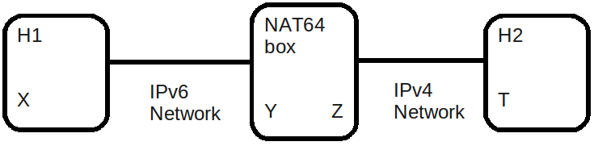

An IPv6 to IPv4 gateway.
========================

At the global scale, the Internet is a fully distributed and uncoordinated network. 
For this reason the transition towards the next version of the Internet Protocol (IPv6) 
requires to be incremental to preserve the communication towards hosts that would
not have done the transition towards IPv6 yet. 

In this exercise you'll implement a gateway that allow communications between
hosts that only supports IPv6 and hosts that only supports IPv4. This gateway
will a simplified version of the NAT64 box described in [#nat64]_. It will not
only handle TCP flows without name servers.

The deadline for this exercise will be Tuesday November 17th, 13.00.

NAT64 Box behavior. 
............................................

The figure above shows a three nodes topology with 
an IPv6 node H1 wich has an IPv6 address `X` and an IPv4 node H2
with IPv4 address `T`. They are connected by a NAT64 gateway having
both an IPv6 address `Y` and an IPv4 address `Z`.

The NAT64 box connects the IPv6 network to the IPv4 network. This NAT64
box has a /n prefix (called Pref64::/n) that it use to represent IPv4
address in the IPv6 address space and an IPv4 address `Z` assigned to
it's IPv4 interface. On H1 the routing is configured in such a way that
the IPv6 packets address to the destination address containing Pref64::/n
are routed to the IPv6 interface of the NAT64 box.

The steps by which H1 establishes communication with H2 are:

1. H1 sends a packet to H2. The packet is sent from a source transport
   address of `(X,x)` to a destination transport address of `(Pref64:T:SUFFIX,t)`
   where `x` and `t` are ports set by H1.

2. The packet is routed to the IPv6 interface of the NAT64 box since the
   IPv6 routing is configured that way.

3. NAT64 receives the packet and perform the following operations:

   * NAT64 selects an unused port `z` on its IPv4 address `Z` and create
     the mapping entry `(X,x)` <---> `(Z,z)` where `(X,x)` is the IPv6 source
     transport address translated to the `(Z,z)` IPv4 source transport address.
     
   
   * NAT64 translates the IPv6 header of the packet coming from `X` into 
     an IPv4 header to create the packets going to `Z` by performing the
     following operations:
          
         - Version is set to 4
         - The TOS octet set to 0.
         - The Total Length is the Payload length from the IPv6 header plus
           the size of the IPv4 header (20).
         - Identification is set to 0.
         - Flags: The More fragments is set to zero. The Don't fragment is 
           set to one.
         - Fragment offset: 0.
         - Time to Live is the Hop Limit value copied from the IPv6 header.
         - The protocol is copied from the Next header field in the IPv6 header.
         - The header checksum is computed once the IPv4 header has been created.
         - The source address is derived from the mapping entry in that case
           it will be set to `Z`.

   * NAT64 includes `(Z,z)` as the source transport address in the packet and
     `(T,t)` as destination transport address in the packet. T is directly extracted
     from the IPv6 destination address `Pref64:T:SUFFIX` of the received IPv6 packet that is being 
     translated.

5. NAT64 sends the translated packet out its IPv4 interface and the packet arrive at H2

6. H2 node responds by sending a packet with destination transport address `(Z,z)` and
   source transport address `(T,t)`.

7. The packet is routed to the NAT64 box, which will look for an existing mapping 
   containing `(Z,z)`. Since the mapping `(X,x)` <---> `(Z,z)` exists, the NAT64 performs
   the following operations:

    * NAT64 translate the IPv4 header into an IPv6 header by performing the following
      operations:

	- Version is set to 6
        - Traffic Class is set to 0.
        - Flow Label is set to 0.
        - The Payload length is the total length from the IPv4 header minus the size
          fo the IPv4 header and IPv4 options if present.
        - The Next Header is set from the Protocol field copied from the IPv4 header.
        - Hop Limit is copied from the TTL Value of the IPv4 header.

    * NAT64 includes `(X,x)` as IPv6 destination transport address in the packet and 
      `(Pref64:T:SUFFIX,t)`, as the IPv6 source transport address in the packet. `T`
      being the source IPv4 address of the IPv4 packet that is being translated.

8. The translated packet is sent out to the IPv6 interface to H1.

Lab preparation. 
............................................

Before implementing NAT64 in scapy, you need to setup the IPv6-IPv4 emulated environment. Your
emulated network will be composed of three virtual machines.
   
   * Your NAT64 box with 2 interfaces: eth0 with an IPv6 address and eth1 with an IPv4 address.

   * H1 with an IPv6 address on eth0.

   * H2 with an IPv4 address only on eth0. 

The different interfaces have been connected as follows :

 - `eth0` on NAT64 is connected to `eth0` on `H1`
 - `eth1` on NAT64 is connected to `eth0` on `H2`

`H1` and `H2` will use the IPv4 implementation of the Linux kernel while `NAT64` will use your IPv6-IPv4 translator 
implementation written in scapy_. You will use the emulated network to send and receive IPv4 and IPv6 packets and 
need to configure the interfaces on `H1`,`H2` and `NAT64`. 

Use :manpage:`ifconfig(8)` to configure the following IPv4 and IPv6 addresses :

 - `2001::2/64` on `eth0` on `H1` this is corresponding to `X` from the previous section.
 - `2001::1/64` on `eth0` on `NAT64` this is corresponding to `Y` from the previous section.
 - `192.168.1.1/24` on `eth1` on `NAT64` this is corresponding to `Z` from the previous section.
 - `192.168.1.2/24` on `eth1` on `H2` this is corresponding to `T` from the previous section.

You need to configure the routing on H1 so that all packet with a destination of `2003::/64` 
will be sent towards `NAT64`. This is corresponding to `Pref64::/n` from the previous section.

Your implementation will do NAT64 for TCP only. To check that your NAT64 implementation is functionning you 
need to configure H2 with a server waiting
for a IPv4 connection and sending 'HELLO` to connecting clients. On H1 you need a client connecting H2 
to the IPv6 destination address `2003::c0a8:0102:ffff:ffff` that embbeds the IPv4 address `192.168.1.2`.

A NAT64 gateway implementation written in scapy. 
............................................

The main data structure used to implement the NAT64 box is a mapping entry. It will be used
by your NAT64 implementation to remember which flows are associated to which machines. 

The data
present in this mapping entry is created automatically by extracting the IPv6 source address of
the received packets, The IPv4 source address that NAT64 use to communicate with H2, the TCP source port 
used in the received IPv6 packets and the TCP source port used in the sent IPv4 packets by NAT64.

- The first step of your implementation will be to extract those information from the received
  packets and to store them in a newly created mapping entry.

Once the mapping entry has been created, you need to translate the IPv6 header into an IPv4 header 
by creating a new scapy IPv4 packet with the information present in the received IPv6 packet.
The payload of the packet must stay the same.

- The second step of your implementation will be to perform this packet header translation and
  send the packet on the network towards H2.

When H2 will reply, NAT64 will receive the packets and lookup the mapping entry with the TCP destination 
port of the packet and the IPv6 destination address of the packet.

- The third step of your implementation will be to perform this lookup.

Once the mapping entry has been found, you need to translate back the IPv4 header into an IPv6 header 
by creating a new scapy IPv6 packet with the information present in the received IPv4 packet.
The payload of the packet must stay the same.

- The second step of your implementation will be to perform this packet header translation and
  send the packet on the network towards H1.

.. rubric:: Footnotes

.. [#nat64] See http://tools.ietf.org/html/draft-ietf-behave-v6v4-xlate-stateful-02

