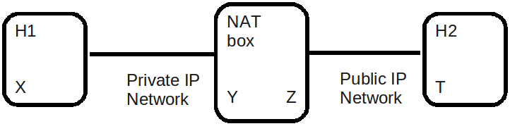

A NAT gateway.
========================

At the global scale, the Internet is a fully distributed and uncoordinated network.
Historically IP addresses were allocated in a first came first served basis. As
a consequence a quick shortage of IPv4 prefixes happened and people started
to have difficulties to obtain a prefix. As a temporarly solution, IP Network Address
Translation (NAT) was designed to use IP addresses in its private range and to map and 
route them with public source addresses already allocated.

In this exercise you'll implement a gateway that allow communications between
hosts that are addressed in a private network and hosts that are addressed in a
public network. This gateway will a simplified version of the NAT box described 
in [#nat]_ and simulate what's happening in your home network when you connect
to the Internet. It will only handle TCP flows without name servicing.

The deadline for this exercise will be Tuesday November 17th, 13.00.

NAT Box behavior. 
............................................

The figure above shows a three nodes topology with 
an IP node H1 wich has an IP address `X` and an IP node H2
with IP address `T`. They are connected by a NAT gateway having
both a private IP address `Y` and a public IPv4 address `Z`.

The NAT box connects the private IP network to the public IP network. 
On H1 the routing is configured in such a way that
the private IP packets having the destination address being in the
public range are routed to the public IP interface of the NAT box.

The steps by which H1 establishes communication with H2 are:

1. H1 sends a packet to H2. The packet is sent from a source transport
   address of `(X,x)` to a destination transport address of `(T,t)`
   where `x` and `t` are ports set by H1.

2. The packet is routed to the private IP interface of the NAT box since the
   IP routing is configured that way.

3. NAT receives the packet and perform the following operations:

   * NAT selects an unused port `z` on its public IP address `Z` and create
     the mapping entry `(X,x)` <---> `(Z,z)` where `(X,x)` is the private IP source
     transport address translated to the `(Z,z)` IP source transport address.
     
   
   * NAT translates the IP header of the packet coming from `X` into 
     an IP header to create the packets going to `Z` by performing the
     following operations:
          
         - Version is set to 4
         - The TOS octet set to 0.
         - Identification is set to 0.
         - Flags: The More fragments is set to zero. The Don't fragment is 
           set to one.
         - Fragment offset: 0.
         - Time to Live is copied from the IP header coming from the private network.
         - The protocol is copied from the protocol field in the private IP header.
         - The header checksum is computed once the IPv4 header has been created.
         - The source address is derived from the mapping entry in that case
           it will be set to `Z`.

   * NAT includes `(Z,z)` as the source transport address in the packet and
     `(T,t)` as destination transport address in the packet. T is directly extracted
     from the IP destination address of the received IP packet coming from the private
     network and the TCP checksum is recomputed.

5. NAT sends the translated packet out its public IP interface and the packet arrive at H2

6. H2 node responds by sending a packet with destination transport address `(Z,z)` and
   source transport address `(T,t)`.

7. The packet is routed to the NAT box, which will look for an existing mapping 
   containing `(Z,z)`. Since the mapping `(X,x)` <---> `(Z,z)` exists, the NAT performs
   the following operations:

    * NAT translate the IP header of the public packet into an IP header of the private network
      by performing the same operations as in step 3.

    * NAT includes `(X,x)` as IP destination transport address in the packet and 
      `(T,t)`, as the IP source transport address in the packet. `T`
      being the public source IP address of the IP packet that is being translated.

8. The translated packet is sent out to the IP interface to H1.

Lab preparation. 
............................................

Before implementing NAT in scapy, you need to setup the private IP-public IP emulated environment. Your
emulated network will be composed of three virtual machines.
   
   * Your NAT box with 2 interfaces: eth0 with a private IP address and eth1 with a public IP address.

   * H1 with an private IP address on eth0.

   * H2 with an public IP address only on eth0. 

The different interfaces have been connected as follows :

 - `eth0` on NAT is connected to `eth0` on `H1`
 - `eth1` on NAT is connected to `eth0` on `H2`

`H1` and `H2` will use the IP implementation of the Linux kernel while `NAT` will use your NAT gateway
implementation written in scapy_. You will use the emulated network to send and receive public and private IP packets.

The filesystems and the kernel of the virtual machines are stored
in the directory `/etinfo/INGI2141/uml/nat`. To create the
virtual setup illustrated on the figure execute the following procedure:

#. Copy the boot script of each H1,H2 and NAT virtual machines in your working directory ::

	cp /etinfo/INGI2141/uml/nat/start_h1 ~/INGI2141/UML/NAT
	cp /etinfo/INGI2141/uml/nat/start_h2 ~/INGI2141/UML/NAT
	cp /etinfo/INGI2141/uml/nat/start_nat ~/INGI2141/UML/NAT

#. Open 3 terminals, 1 for each virtual machine 

#. In the first terminal, start the virtual machine `H1` by executing
   the script `start_h1`. 
   In the second terminal, start the virtual machine
   `H2` by executing the script `start_h2`. In the third
   terminal start the virtual machine `NAT` by executing the script
   `start_nat`

#. The interfaces of your boxes are configured with 
the following IPv4 addresses :

 - `192.168.1.2/24` on `eth0` on `H1` this is corresponding to `X` from the previous section.
 - `192.168.1.1/24` on `eth0` on `NAT` this is corresponding to `Y` from the previous section.
 - `216.239.59.104/24` on `eth1` on `NAT` this is corresponding to `Z` from the previous section.
 - `216.239.59.103/24` on `eth1` on `H2` this is corresponding to `T` from the previous section.

#. Check the IP connectivity between `H1` and `NAT` and `H2` and `NAT` by
   using the ping command. 

You need to configure the routing on H1 so that all packet with a destination in 
the public network will be sent towards `NAT`. This is can be achieved by adding a default route.
To do this execute the following command on `H1` ::

  ip route add default via 192.168.1.1

Your implementation will do NAT for TCP only. You need to configure filters on `NAT` so 
that it will receive IP TCP messages from `H2` this will not interfere with the kernel ::

   iptables -A INPUT -p tcp -i eth1 -j DROP
   iptables -A OUTPUT -p tcp -o eth1 -j DROP

To check that your NAT implementation is functionning you 
need to configure H2 with a server waiting
for a IP TCP connection and sending 'HELLO` to connecting clients. On H1 you need a client connecting H2 
to the public IP destination address `216.239.59.103`.

On `H2` you'll find the file `srv-tcp.py` that start an IP/TCP server waiting on the port given on 
argument and echoing any received data to a connected client. On `H1` you'll find the file `cl-tcp.py`
that connects to a server with a given IP and TCP port given in argument. Once you have launched the  
server on `H2` ::

  ./srv-tcp.py 1234

You should be able to connect to it via your NAT scapy gateway when NAT implementation will be 
correct ::

  ./cl-tcp.py 216.239.59.103 1234

A NAT gateway implementation written in scapy. 
................................................

The main data structure used to implement the NAT box is a mapping entry. It will be used
by your NAT implementation to remember which flows are associated to which machines. 

The data
present in this mapping entry is created automatically by extracting the IP source address of
the private received packets, The public IP source address that NAT use to communicate with H2, the TCP source port 
used in the received public IP packets and the TCP source port used in the sent IP public packets by NAT.

- The first step of your implementation will be to extract those information from the received
  packets and to store them in a newly created mapping entry.

Once the mapping entry has been created, you need to translate the private IP header into a public IP header 
by creating a new scapy IP packet with the information present in the private received IP packet.
The payload of the packet must stay the same and the TCP checksum must be recomputed.

- The second step of your implementation will be to perform this packet header translation and
  send the packet on the network towards H2.

When H2 will reply, NAT will receive the public packets and lookup the mapping entry with the TCP destination 
port of the packet and the IP destination address of the packet.

- The third step of your implementation will be to perform this lookup.

Once the mapping entry has been found, you need to translate back the public IP header into an private IP header 
by creating a new scapy private IP packet with the information present in the public received IP packet.
The payload of the packet must stay the same and the TCP checksum must be recomputed.

- The second step of your implementation will be to perform this packet header translation and
  send the packet on the network towards H1.

To implement the Nat scapy gateway, you can start with the following skeletton ::

 ## This file abstracts a *very* simple Nat gateway by 
 #  using Scapy Automaton Facility
 ## Mickael Hoerdt <mickael.hoerdt@uclouvain.be>
 ## UCL - INL <http://inl.info.ucl.ac.be>

 import Queue,sys
 import ipaddr
 from scapy.packet import *
 from scapy.fields import *
 from scapy.automaton import *
 from scapy.layers.inet import *
 from scapy.sendrecv import *

 EXT_VERSION = "v0.1"
 TIMEOUT = 2

 class Nat(Automaton):

	mac_addr_src = { "00:00:E3:00:30:04":'eth0', "00:00:E3:00:30:03":'eth1'}
	mac_addr_dst = { "bcastv4":'ff:ff:ff:ff:ff:ff'}

	def parse_args(self, **kargs):
		Automaton.parse_args(self, **kargs)
		self.mapping={}	
		self.public_addr='216.239.59.104'	
		print "Entering <WAIT_FOR_TCP_PACKET> ..."
        
	def master_filter(self, pkt):
		if (TCP in pkt):
			if(not pkt.src.upper() in self.mac_addr_src.keys()):
				if(not pkt.dst.upper() in self.mac_addr_dst.values()):
					return True

	# Scapy Nat Automata
		
	@ATMT.state(initial=1)
	def WAIT_FOR_PACKET_TO_TRANSLATE(self):
		#print "<WAIT_FOR_TCP_PACKET>"
		pass
		
	@ATMT.timeout(WAIT_FOR_PACKET_TO_TRANSLATE, TIMEOUT)
	def timeout_waiting_for_packet_to_forward(self):
		print "<WAIT_FOR_TCP_PACKET/timeout>: Nothing to translate..."
		raise self.WAIT_FOR_PACKET_TO_TRANSLATE()	

	@ATMT.receive_condition(WAIT_FOR_PACKET_TO_TRANSLATE, prio=1)
	def received_TCP(self, pkt):
		# Packets arrived from the private network
		if (self.mac_addr_src[pkt.dst.upper()] == "eth0"):
			#Look for the entry in the mapping
			#If if doesn't exist, create a new one (with a random port).	

			if((pkt[IP].src,pkt[TCP].sport) in self.mapping.values()):	
				for map_src,map_port in self.mapping.keys():
					if(self.mapping[map_src,map_port] == (pkt[IP].src,pkt[TCP].sport)):
						break
			else:
				print "Nat: Creating a new NAT mapping entry:",pkt[IP].src,"  ",pkt[TCP].sport
				src_port=int(random.random()*65535)	
				self.mapping[(self.public_addr,src_port)]=(pkt[IP].src,pkt[TCP].sport)
				map_src,map_port=self.public_addr,src_port
			
			#extract the destination
			#Fill up the important information for the new packet

			new_ip_packet=IP(src=map_src,dst=pkt[IP].dst,ttl=pkt[IP].ttl)/pkt[TCP]
			new_ip_packet[TCP].sport=map_port
			
			#Remove checksum to force scapy to recompute it
			#and send the packet 

			new_ip_packet[TCP].chksum=None
			self.send(new_ip_packet)
			
		# Packets arrived from the public network
		if (self.mac_addr_src[pkt.dst.upper()] == "eth1"):
			#Try to find the corresponding mapping entry
			try:
				#Extract the source IP and the dport from the mapping
				(src,map_port)=self.mapping[(pkt[IP].dst,pkt[TCP].dport)]
				
				#Build the destination and fill up important information
				new_ip_packet=IP(src=pkt[IP].src,dst=src,ttl=pkt[IP].ttl)/pkt[TCP]
				new_ip_packet[TCP].dport=map_port	
				
				#Remove checksum to force scapy to recompute it
				#and send the packet 
				new_ip_packet[TCP].chksum=None
				self.send(new_ip_packet)	
			
			except KeyError:
				print "Nat: Mapping entry not found:",pkt[IP].dst,"  ",pkt[TCP].dport

.. rubric:: Footnotes

.. [#nat] http://tools.ietf.org/html/rfc1631

