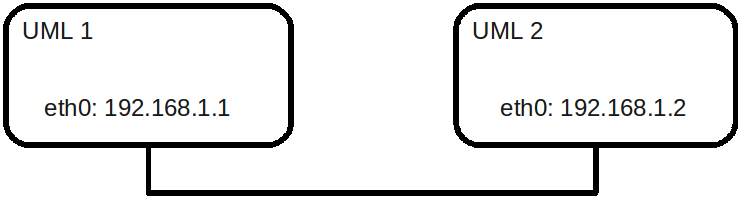

UML
=====================

   User Mode Linux setup

The filesystems and the kernel of the virtual machines are stored
in the directory `/etinfo/applications/INGI2141/uml`. To create the
virtual setup illustrated on the figure execute the following procedure:

#. Copy the boot script of each virtual machines in your working directory ::

	cp /etinfo/applications/INGI2141/uml/start_uml1 ~
	cp /etinfo/applications/INGI2141/uml/start_uml2 ~

#. Open 2 terminals, 1 for each virtual machines

#. In the first terminal, start the virtual machine UML1 by executing
   the script `start_uml1`. 
   In the second terminal, start the virtual machine
   UML2 by executing the script `start_uml2`.

#. Once the machines will have finished their boot process, you can login
   on each machine as root. To check their virtual IP connectivity ping the
   IP of the interfaces on the other end of the virtual link by executing the
   following commands ::

	ping 192.168.1.1
	ping 192.168.1.2

You can share files between the virtual machines and the machine where you
are running the User Mode Linux processes in the directory `/mnt/host` of the
virtual machines.
