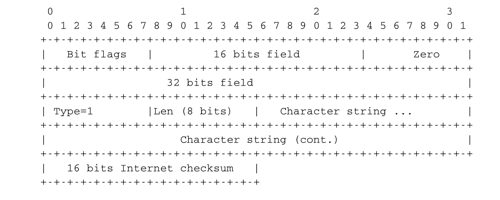

.. Copyright |copy| 2013 by Olivier Bonaventure
.. This file is licensed under a `creative commons licence <http://creativecommons.org/licenses/by/3.0/>`_

********************
Serving applications
********************

.. warning:: 

   This is an unpolished draft of the second edition of this ebook. If you find any error or have suggestions to improve the text, please create an issue via https://github.com/obonaventure/cnp3/issues?milestone=3

Writing simple networked applications
=====================================

Networked applications were usually implemented by using the :term:`socket` :term:`API`. This API was designed when TCP/IP was first implemented in the `Unix BSD`_ operating system [Sechrest]_ [LFJLMT]_, and has served as the model for many APIs between applications and the networking stack in an operating system. Although the socket API is very popular, other APIs have also been developed. For example, the STREAMS API has been added to several Unix System V variants [Rago1993]_. The socket API is supported by most programming languages and several textbooks have been devoted to it. Users of the C language can consult [DC2009]_, [Stevens1998]_, [SFR2004]_ or [Kerrisk2010]_. The Java implementation of the socket API is described in [CD2008]_ and in the `Java tutorial <http://java.sun.com/docs/books/tutorial/networking/sockets/index.html>`_. In this section, we will use the python_ implementation of the socket_ API to illustrate the key concepts. Additional information about this API may be found in the `socket section <http://docs.python.org/library/socket.html>`_ of the `python documentation <http://docs.python.org/>`_ .

The socket API is quite low-level and should be used only when you need a complete control of the network access. If your application simply needs, for instance, to retrieve data from a web server, there are much simpler and higher-level APIs. 

A detailed discussion of the socket API is outside the scope of this section and the references cited above provide a detailed discussion of all the  details of the socket API. As a starting point, it is interesting to compare the socket API with the service primitives that we have discussed in the previous chapter. Let us first consider the connectionless service that consists of the following two primitives : 

 - `DATA.request(destination,message)` is used to send a message to a specified destination. In this socket API, this corresponds to the ``send`` method.
 - `DATA.indication(message)` is issued by the transport service to deliver a message to the application. In the socket API, this corresponds to the return of the ``recv`` method that is called by the application. 

The `DATA` primitives are exchanged through a service access point. In the socket API, the equivalent to the service access point is the `socket`. A `socket` is a data structure which is maintained by the networking stack and is used by the application every time it needs to send or receive data through the networking stack. The `socket` method in the python_ API takes two main arguments :

 - an `address family` that specifies the type of address family and thus the underlying networking stack that will be used with the socket. This parameter can be either ``socket.AF_INET`` or ``socket.AF_INET6``. ``socket.AF_INET``, which corresponds to the TCP/IPv4 protocol stack is the default. ``socket.AF_INET6`` corresponds to the TCP/IPv6 protocol stack.
 - a `type` indicates the type of service which is expected from the networking stack. ``socket.STREAM`` (the default) corresponds to the reliable bytestream connection-oriented service. ``socket.DGRAM`` corresponds to the connectionless service.
 
.. However, it is important to understand the basics and the limitations of this API. We use the `python socket API <http://docs.python.org/library/socket.html>` to describe these issues. The socket API allows applications to interact with the transport services offered by the networking stack. The simplest transport service is the connectionless service. The simplest client application that uses this service will issue a `DATA.request` with its request and wait for a `DATA.indication` that contains the response.

.. index:: socket, sendto, AF_INET, AF_INET6, SOCK_DGRAM, SOCK_STREAM

A simple client that sends a request to a server is often written as follows in descriptions of the socket API.

.. literalinclude:: exercices/python/simpleclientip6.py
   :language: python

A typical usage of this application would be 

.. code-block:: text

   python client.py ::1 12345

where ``::1`` is the IPv6 address of the host (in this case the localhost) where the server is running and ``12345`` the port of the server.

The first operation is the creation of the ``socket``. Two parameters must be specified while creating a ``socket``. The first parameter indicates the address family and the second the socket type. The second operation is the transmission of the message by using ``sendto`` to the server. It should be noted that ``sendto`` takes as arguments the message to be transmitted and a tuple that contains the IPv6 address of the server and its port number. 

The code shown above supports only the TCP/IPv6 protocol stack. To use the TCP/IPv4 protocol stack the ``socket`` must be created by using the ``socket.AF_INET`` address family. Forcing the application developer to select TCP/IPv4 or TCP/IPv6 when creating a ``socket`` is a major hurdle for the deployment and usage of TCP/IPv6 in the global Internet [Cheshire2010]_. While most operating systems support both TCP/IPv4 and TCP/IPv6, many applications still only use TCP/IPv4 by default. In the long term, the ``socket`` API should be able to handle TCP/IPv4 and TCP/IPv6 transparently and should not force the application developer to always specify whether it uses TCP/IPv4 or TCP/IPv6. 

.. index:: getaddrinfo, AF_UNSPEC

Another important issue with the socket API as supported by python_ is that it forces the application to deal with IP addresses instead of dealing directly with domain names. This limitation dates from the early days of the ``socket`` API in Unix 4.2BSD. At that time, name resolution was not widely available and only IP addresses could be used. Most applications rely on DNS names to interact with servers and this utilisation of the DNS plays a very important role to scale web servers and content distribution networks. To use domain names, the application needs to perform the DNS resolution by using the ``getaddrinfo`` method. This method queries the DNS and builds the ``sockaddr`` data structure which is used by other methods of the socket API. In python_, ``getaddrinfo`` takes several arguments :

 - a `name` that is the domain name for which the DNS will be queried
 - an optional `port number` which is the port number of the remote server
 - an optional `address family` which indicates the address family used for the DNS request. ``socket.AF_INET`` (resp. ``socket.AF_INET6``) indicates that an IPv4 (IPv6) address is expected. Furthermore, the python_ socket API allows an application to use ``socket.AF_UNSPEC`` to indicate that it is able to use either IPv4 or IPv6 addresses.
 - an optional `socket type` which can be either ``socket.SOCK_DGRAM`` or ``socket.SOCK_STREAM``

In today's Internet hosts that are capable of supporting both IPv4 and IPv6, all applications should be able to handle both IPv4 and IPv6 addresses. When used with the ``socket.AF_UNSPEC`` parameter, the ``socket.getaddrinfo`` method returns a list of tuples containing all the information to create a ``socket``.

.. code-block:: python

  import socket
  socket.getaddrinfo('www.example.net',80,socket.AF_UNSPEC,socket.SOCK_STREAM)
  [ (30, 1, 6, '', ('2001:db8:3080:3::2', 80, 0, 0)), 
    (2, 1, 6, '', ('203.0.113.225', 80))]

In the example above, ``socket.getaddrinfo`` returns two tuples. The first one corresponds to the ``sockaddr`` containing the IPv6 address of the remote server and the second corresponds to the IPv4 information. Due to some peculiarities of IPv6 and IPv4, the format of the two tuples is not exactly the same, but the key information in both cases are the network layer address (``2001:db8:3080:3::2`` and ``203.0.113.225``) and the port number (``80``). The other parameters are seldom used.

``socket.getaddrinfo`` can be used to build a simple client that queries the DNS and contact the server by using either IPv4 or IPv6 depending on the addresses returned by the ``socket.getaddrinfo`` method. The client below iterates over the list of addresses returned by the DNS and sends its request to the first destination address for which it can create a ``socket``. Other strategies are of course possible. For example, a host running in an IPv6 network might prefer to always use IPv6 when IPv6 is available [#fipv6pref]_. 

.. Another example is the happy eyeballs approach which is being discussed within the IETF_ [WY2011]_. For example, [WY2011]_ mentions that some web browsers try to use the first address returned by ``socket.getaddrinfo``. If there is no answer within some small delay (e.g. 300 milliseconds), the second address is tried.

.. literalinclude:: python/simpleclientname.py
   :language: python

.. index:: socket.connect, socket.send, socket.recv, socket.close, socket.shutdown

Now that we have described the utilisation of the socket API to write a simple client using the connectionless transport service, let us have a closer look at the reliable byte stream transport service. As explained above, this service is invoked by creating a ``socket`` of type ``socket.SOCK_STREAM``. Once a socket has been created, a client will typically connect to the remote server, send some data, wait for an answer and eventually close the connection. These operations are performed by calling the following methods :

 - ``socket.connect`` : this method takes a ``sockaddr`` data structure, typically returned by ``socket.getaddrinfo``, as argument. It may fail and raise an exception if the remote server cannot be reached.
 - ``socket.send`` : this method takes a string as argument and returns the number of bytes that were actually sent. The string will be transmitted as a sequence of consecutive bytes to the remote server. Applications are expected to check the value returned by this method and should resend the bytes that were not send.
 - ``socket.recv`` : this method takes an integer as argument that indicates the size of the buffer that has been allocated to receive the data. An important point to note about the utilisation of the ``socket.recv`` method is that as it runs above a bytestream service, it may return any amount of bytes (up to the size of the buffer provided by the application). The application needs to collect all the received data and there is no guarantee that some data sent by the remote host by using a single call to the ``socket.send`` method will be received by the destination with a single call to the ``socket.recv`` method. 
 - ``socket.shutdown`` : this method is used to release the underlying connection. On some platforms, it is possible to specify the direction of transfer to be released (e.g. ``socket.SHUT_WR`` to release the outgoing direction or ``socket.SHUT_RDWR`` to release both directions).
 - ``socket.close``: this method is used to close the socket. It calls ``socket.shutdown`` if the underlying connection is still open.

With these methods, it is now possible to write a simple HTTP client. This client operates over both IPv6 and IPv4 and writes the main page of the remote server on the standard output. It also reports the number of ``socket.recv`` calls that were used to retrieve the homepage [#fnumrecv]_ . 

.. literalinclude:: python/httpclient.py
   :language: python

As mentioned above, the socket API is very low-level. This is the interface to the transport service. For a common and simple task, like retrieving a document from the Web, there are much simpler solutions. For example, the python_ `standard library <http://docs.python.org/library/>`_ includes several high-level APIs to implementations of various application layer protocols including HTTP. For example, the `httplib <http://docs.python.org/library/httplib.html>`_ module can be used to easily access documents via HTTP. 

.. literalinclude:: python/http-client-httplib.py
 :language: python

Another module, `urllib2 <http://docs.python.org/library/urllib2.html>`_ allows the programmer to directly use URLs. This is much more simpler than directly using sockets. 

.. literalinclude:: python/http-cclient-urllib2.py
 :language: python

But simplicity is not the only advantage of using high-level libraries. They allow the programmer to manipulate higher-level concepts ( e.g. `I want the content pointed by this URL`) but also include many features such as transparent support for the utilisation of :term:`TLS` or IPv6.

The second type of applications that can be written by using the socket API are the servers. A server is typically runs forever waiting to process requests coming from remote clients. A server using the connectionless will typically start with the creation of a `socket` with the ``socket.socket``. This socket can be created above the TCP/IPv4 networking stack (``socket.AF_INET``) or the TCP/IPv6 networking stack (``socket.AF_INET6``), but not both by default. If a server is willing to use the two networking stacks, it must create two threads, one to handle the TCP/IPv4 socket and the other to handle the TCP/IPv6 socket. It is unfortunately impossible to define a socket that can receive data from both networking stacks at the same time with the python_ socket API.

.. index:: socket.bind, socket.recvfrom

A server using the connectionless service will typically use two methods from the socket API in addition to those that we have already discussed.

 - ``socket.bind`` is used to bind a socket to a port number and optionally an IP address. Most servers will bind their socket to all available interfaces on the servers, but there are some situations where the server may prefer to be bound only to specific IP addresses. For example, a server running on a smartphone might want to be bound to the IP address of the WiFi interface but not on the 3G interface that is more expensive.
 - ``socket.recvfrom`` is used to receive data from the underlying networking stack. This method returns both the sender's address and the received data.

The code below illustrates a very simple server running above the connectionless transport service that simply prints on the standard output all the received messages. This server uses the TCP/IPv6 networking stack.

.. literalinclude:: python/simpleserverudp.py
   :language: python

A server that uses the reliable byte stream service can also be built above the socket API. Such a server starts by creating a socket that is bound to the port that has been chosen for the server. Then the server calls the ``socket.listen`` method. This informs the underlying networking stack of the number of transport connection attempts that can be queued in the underlying networking stack waiting to be accepted and processed by the server. The server typically has a thread waiting on the ``socket.accept`` method. This method returns as soon as a connection attempt is received by the underlying stack. It returns a socket that is bound to the established connection and the address of the remote host. With these methods, it is possible to write a very simple web server that always returns a `404` error to all `GET` requests and a `501` errors to all other requests. 

.. literalinclude:: python/simplehttpserver.py
   :language: python

This server is far from a production-quality web server. A real web server would use multiple threads and/or non-blocking IO to process a large number of concurrent requests [#fapache]_ . Furthermore, it would also need to handle all the errors that could happen while receiving data over a transport connection. These are outside the scope of this section and additional information on more complex networked applications may be found elsewhere. For example, [RG2010]_ provides an in-depth discussion of the utilisation of the socket API with python while [SFR2004]_ remains an excellent source of information on the socket API in C.

Exercises
=========

1. Amazon provides the `S3 storage service <https://s3.amazonaws.com/>`_ where companies and researchers can store lots of information and perform computations on the stored information. Amazon allows users to send files through the Internet, but also by sending hard-disks. Assume that a 1 Terabyte hard-disk can be delivered within 24 hours to Amazon by courier service. What is the minimum bandwidth required to match the bandwidth of this courier service ? 

2. Several large data centers operators (e.g. `Microsoft <http://www.microsoft.com/showcase/en/us/details/bafe5c0f-8651-4609-8c71-24c733ce628b>`_ and `google <http://www.youtube.com/watch?v=zRwPSFpLX8I>`_) have announced that they install servers as containers with each container hosting up to 2000 servers. Assuming a container with 2000 servers and each storing 500 GBytes of data, what is the time required to move all the data stored in one container over one 10 Gbps link ? What is the bandwidth of a truck that needs 10 hours to move one container from one data center to another. 

3. The socket_ interface allows you to use the UDP protocol that provides the connectionless service on a Unix host. UDP, in theory, allows you to send SDUs of up to 64 KBytes. 

 - Implement a small UDP client and a small UDP server in C 
 - run the client and the servers on different workstations to determine experimentally the largest SDU that is supported by your language and OS. If possible, use different languages and Operating Systems in each group.

.. socket layer with UDP, what is the largest data that you can send by using C, Java or python, is it 64KBytes or less ?

4. The time protocol, defined in :rfc:`868` allows to read the current time on a remote host. Implement this very simple protocol on top of the UDP and TCP sockets. Compared the time required to retrieve this time information over UDP and TCP. 

5. By using the socket interface, implement on top of the connectionless unreliable service provided by UDP a simple client that sends the message shown in the figure below.

 In this message, the bit flags should be set to `01010011b`, the value of the 16 bits field must be the square root of the value contained in the 32 bits field, the character string must be an ASCII representation (without any trailing `\0`) of the number contained in the 32 bits character field. The last 16 bits of the message contain an Internet checksum that has been computed over the entire message.

 Upon reception of a message, the server verifies that : 

  - the flag has the correct value
  - the 32 bits integer is the square of the 16 bits integer
  - the character string is an ASCII representation of the 32 bits integer
  - the Internet checksum is correct

 If the verification succeeds, the server returns a SDU containing `11111111b`. Otherwise it returns `01010101b`

 Your implementation must be able to run on both low endian and big endian machines. If you have access to different types of machines (e.g. x86_ laptops and SPARC_ servers), try to run your implementation on both types of machines. 

.. To ensure that your implementation is portable, try to Inside each group, implement two different clients and two different servers (both using different languages). The clients and the servers must run on both the Linux workstations and the Sun server (`sirius`). Verify the interoperability of the clients and the servers inside the group. You can use C, Java or python to write these implementations. 

   Simple SDU format 

.. todo:: provide server

6. The socket_ library is also used to develop applications above the reliable bytestream service provided by TCP. We have installed on the `cnp3.info.ucl.ac.be` server a simple server that provides a simple client-server service. The service operates as follows :

 - the server listens on port `62141` for a TCP connection
 - upon the establishment of a TCP connection, the server sends an integer by using the following TLV format :
   
    - the first two bits indicate the type of information (01 for ASCII, 10 for boolean)
    - the next six bits indicate the length of the information (in bytes)
    - An ASCII TLV has a variable length and the next bytes contain one ASCII character per byte. A boolean TLV has a length of one byte. The byte is set to `00000000b` for `true` and `00000001b` for false. 
 - the client replies by sending the received integer encoded as a 32 bits integer in `network byte order`
 - the server returns a TLV containing `true` if the integer was correct and a TLV containing `false` otherwise and closes the TCP connection

 Implement a client to interact with this server in C

7. The Trivial File Transfer Protocol (TFTP), defined in :rfc:`1350` is a simple file transfer protocol that runs on top of UDP. Implement a client for this protocol that allows to retrieve a file on a remote server.

.. 5. JSON ?

..  To be written : connect by name API is key !  http://www.stuartcheshire.org/IETF72/

.. [Cheshire2010]_

.. rubric:: Footnotes

.. [#fipv6pref] Most operating systems today by default prefer to use IPv6 when the DNS returns both an IPv4 and an IPv6 address for a name. See http://ipv6int.net/systems/ for more detailed information. 

.. [#fnumrecv] Experiments with the client indicate that the number of `socket.recv` calls can vary at each run. There are various factors that influence the number of such calls that are required to retrieve some information from a server. We'll discuss some of them after having explained the operation of the underlying transport protocol.

.. [#fapache] There are many `production quality web servers software <http://en.wikipedia.org/wiki/Comparison_of_web_server_software>`_ available. apache_ is a very complex but widely used one. `thttpd <http://www.acme.com/software/thttpd/>`_ and `lighttpd <http://www.lighttpd.net/>`_ are less complex and their source code is probably easier to understand.

.. include:: /links.rst

