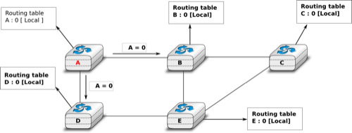
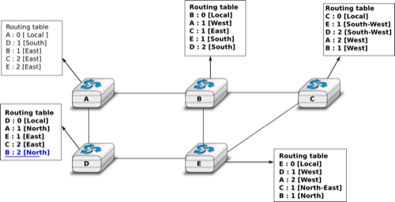
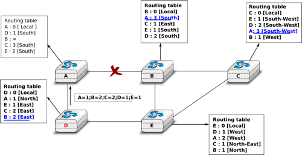
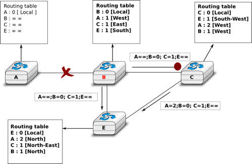

.. Copyright |copy| 2010 by Olivier Bonaventure
.. This file is licensed under a `creative commons licence <http://creativecommons.org/licenses/by/3.0/>`_

.. index:: Distance vector

Distance vector routing
-----------------------

Distance vector routing is a simple distributed routing protocol. Distance vector routing allows routers to automatically discover the destinations reachable inside the network as well as the shortest path to reach each of these destinations. The shortest path is computed based on `metrics` or `costs` that are associated to each link. We use `l.cost` to represent the metric that has been configured for link `l` on a router. 

Each router maintains a routing table. The routing table `R` can be modelled as a data structure that stores, for each known destination address `d`, the following attributes :

 - `R[d].link` is the outgoing link that the router uses to forward packets towards destination `d`
 - `R[d].cost` is the sum of the metrics of the links that compose the shortest path to reach destination `d`
 - `R[d].time` is the timestamp of the last distance vector containing destination `d`

A router that uses distance vector routing regularly sends its distance vector over all its interfaces. The distance vector is a summary of the router's routing table that indicates the distance towards each known destination. This distance vector can be computed from the routing table by using the pseudo-code below.

.. code-block:: python

 Every N seconds: 
  v=Vector()
  for d in R[]:
     # add destination d to vector
     v.add(Pair(d,R[d].cost))
  for i in interfaces
     # send vector v on this interface
     send(v,interface)  

When a router boots, it does not know any destination in the network and its routing table only contains itself. It thus sends to all its neighbours a distance vector that contains only its address at a distance of `0`. When a router receives a distance vector on link `l`, it processes it as follows.

.. code-block:: python

 # V : received Vector
 # l : link over which vector is received
 def received(V,l):
    # received vector from link l  
    for d in V[]
      if not (d in R[]) :
         # new route 
      	 R[d].cost=V[d].cost+l.cost
      	 R[d].link=l
      	 R[d].time=now
      else :
         # existing route, is the new better ?
	 if ( ((V[d].cost+l.cost) < R[d].cost) or ( R[d].link == l) )  :
	      # Better route or change to current route 
       	      R[d].cost=V[d].cost+l.cost
       	      R[d].link=l
       	      R[d].time=now

The router iterates over all addresses included in the distance vector. If the distance vector contains an address that the router does not know, it inserts the destination inside its routing table via link `l` and at a distance which is the sum between the distance indicated in the distance vector and the cost associated to link `l`. If the destination was already known by the router, it only updates the corresponding entry in its routing table if either : 
 
 - the cost of the new route is smaller than the cost of the already known route `( (V[d].cost+l.cost) < R[d].cost)`
 - the new route was learned over the same link as the current best route towards this destination `( R[d].link == l)`

The first condition ensures that the router discovers the shortest path towards each destination. The second condition is used to take into account the changes of routes that may occur after a link failure or a change of the metric associated to a link.

To understand the operation of a distance vector protocol, let us consider the network of five routers shown below.

   Operation of distance vector routing in a simple network

Assume that `A` is the first to send its distance vector `[A=0]`.

 - `B` and `D` process the received distance vector and update their routing table with a route towards `A`. 
 - `D` sends its distance vector `[D=0,A=1]` to `A` and `E`. `E` can now reach `A` and `D`.
 - `C` sends its distance vector `[C=0]` to `B` and `E`
 - `E` sends its distance vector `[E=0,D=1,A=2,C=1]` to `D`, `B` and `C`. `B` can now reach `A`, `C`, `D` and `E`
 - `B` sends its distance vector `[B=0,A=1,C=1,D=2,E=1]` to `A`, `C` and `E`. `A`, `B`, `C` and `E` can now reach all destinations.
 - `A` sends its distance vector `[A=0,B=1,C=2,D=1,E=2]` to `B` and `D`. 

At this point, all routers can reach all other routers in the network thanks to the routing tables shown in the figure below.

   Routing tables computed by distance vector in a simple network

To deal with link and router failures, routers use the timestamp stored in their routing table. As all routers send their distance vector every `N` seconds, the timestamp of each route should be regularly refreshed. Thus no route should have a timestamp older than `N` seconds, unless the route is not reachable anymore. In practice, to cope with the possible loss of a distance vector due to transmission errors, routers check the timestamp of the routes stored in their routing table every `N` seconds and remove the routes that are older than :math:`3 \times N` seconds. When a router notices that a route towards a destination has expired, it must first associate an :math:`\infty` cost to this route and send its distance vector to its neighbours to inform them. The route can then be removed from the routing table after some time (e.g. :math:`3 \times N` seconds), to ensure that the neighbouring routers have received the bad news, even if some distance vectors do not reach them due to transmission errors. 

Consider the example above and assume that the link between routers `A` and `B` fails. Before the failure, `A` used `B` to reach destinations `B`, `C` and `E` while `B` only used the `A-B` link to reach `A`. The affected entries timeout on routers `A` and `B` and they both send their distance vector.

 - `A` sends its distance vector :math:`[A=0,B=\infty,C=\infty,D=1,E=\infty]`. `D` knows that it cannot reach `B` anymore via `A`
 - `D` sends its distance vector :math:`[D=0,B=\infty,A=1,C=2,E=1]` to `A` and `E`. `A` recovers routes towards `C` and `E` via `D`.
 - `B` sends its distance vector :math:`[B=0,A=\infty,C=1,D=2,E=1]` to `E` and `C`. `C` learns that there is no route anymore to reach `A` via `B`.
 - `E` sends its distance vector :math:`[E=0,A=2,C=1,D=1,B=1]` to `D`, `B` and `C`. `D` learns a route towards `B`. `C` and `B` learn a route towards `A`. 
 
At this point, all routers have a routing table allowing them to reach all another routers, except router `A`, which cannot yet reach router `B`. `A` recovers the route towards `B` once router `D` sends its updated distance vector :math:`[A=1,B=2,C=2,D=1,E=1]`. This last step is illustrated in figure :ref:`fig-afterfailure`, which shows the routing tables on all routers.

.. _fig-afterfailure:

   Routing tables computed by distance vector after a failure

.. index:: count to infinity

Consider now that the link between `D` and `E` fails. The network is now partitioned into two disjoint parts : (`A` , `D`)  and (`B`, `E`, `C`). The routes towards `B`, `C` and `E` expire first on router `D`. At this time, router `D` updates its routing table.

If `D` sends :math:`[D=0, A=1, B=\infty, C=\infty, E=\infty]`, `A` learns that `B`, `C` and `E` are unreachable and updates its routing table.

Unfortunately, if the distance vector sent to `A` is lost or if `A` sends its own distance vector ( :math:`[A=0,D=1,B=3,C=3,E=2]` ) at the same time as `D` sends its distance vector, `D` updates its routing table to use the shorter routes advertised by `A` towards `B`, `C` and `E`. After some time `D` sends a new distance vector : :math:`[D=0,A=1,E=3,C=4,B=4]`. `A` updates its routing table and after some time sends its own distance vector :math:`[A=0,D=1,B=5,C=5,E=4]`, etc. This problem is known as the `count to infinity problem` in networking literature. Routers `A` and `D` exchange distance vectors with increasing costs until these costs reach :math:`\infty`. This problem may occur in other scenarios than the one depicted in the above figure. In fact, distance vector routing may suffer from count to infinity problems as soon as there is a cycle in the network. Cycles are necessary to have enough redundancy to deal with link and router failures. To mitigate the impact of counting to infinity, some distance vector protocols consider that :math:`16=\infty`. Unfortunately, this limits the metrics that network operators can use and the diameter of the networks using distance vectors.

.. index:: split horizon, split horizon with poison reverse

This count to infinity problem occurs because router `A` advertises to router `D` a route that it has learned via router `D`. A possible solution to avoid this problem could be to change how a router creates its distance vector. Instead of computing one distance vector and sending it to all its neighbors, a router could create a distance vector that is specific to each neighbour and only contains the routes that have not been learned via this neighbour. This could be implemented by the following pseudocode.

.. code-block:: python

 Every N seconds: 
  # one vector for each interface
  for l in interfaces:
    v=Vector()
    for d in R[]:
      if (R[d].link != i) :
      	 v=v+Pair(d,R[d.cost])
    send(v)
    # end for d in R[]
  #end for l in interfaces  

This technique is called `split-horizon`. With this technique, the count to infinity problem would not have happened in the above scenario, as router `A` would have advertised :math:`[A=0]`, since it learned all its other routes via router `D`. Another variant called `split-horizon with poison reverse` is also possible.  Routers using this variant advertise a cost of :math:`\infty` for the destinations that they reach via the router to which they send the distance vector. This can be implemented by using the pseudo-code below.

.. code-block:: python

 Every N seconds: 
  for l in interfaces:
    # one vector for each interface
    v=Vector()
    for d in R[]:
      if (R[d].link != i) :
      	 v=v+Pair(d,R[d.cost])
      else:
         v=v+Pair(d,infinity);
    send(v)
    # end for d in R[]
  #end for l in interfaces  

Unfortunately, split-horizon, is not sufficient to avoid all count to infinity problems with distance vector routing. Consider the failure of link `A-B` in the network of four routers below.

   Count to infinity problem

After having detected the failure, router `B` sends its distance vectors :

 - :math:`[A=\infty,B=0,C=\infty,E=1]` to router `C`
 - :math:`[A=\infty,B=0,C=1,E=\infty]` to router `E`

If, unfortunately, the distance vector sent to router `C` is lost due to a transmission error or because router `C` is overloaded, a new count to infinity problem can occur. If router `C` sends its distance vector :math:`[A=2,B=1,C=0,E=\infty]` to router `E`, this router installs a route of distance `3` to reach `A` via `C`. Router `E` sends its distance vectors :math:`[A=3,B=\infty,C=1,E=1]` to router `B` and :math:`[A=\infty,B=1,C=\infty,E=0]` to router `C`. This distance vector allows `B` to recover a route of distance `4` to reach `A`.

.. note:: Forwarding tables versus routing tables

   Routers usually maintain at least two data structures that contain information the reachable destinations. The first data structure is the `routing table`. The `routing table` is a data structure that associates a destination to an outgoing interface or a nexthop router and a set of additional attributes. Different routing protocols can associate different attributes for each destination. Distance vector routing protocols will store the cost to reach the destination along the shortest path. Other routing protocols may store information about the number of hops of the best path, its lifetime or the number of sub paths. A `routing table` may store multipath paths towards a given destination and flag one of them as the best one. The `routing table` is a software data structure which is updated by (one or more) routing protocols. The `routing table` is usually not directly used when forwarding packets. Packet forwarding relies on a more compact data structure which is the `forwarding table`. On high-end routers, the `forwarding table` is implemented directly in hardware while lower performance routers will use a software implementation. A `forwarding table` contains a subset of the information found in the `routing table`. It only contains the paths that are used to forward packets and no attributes. A `forwarding table` will typically associate each destination to an outgoing interface or nexthop router.
