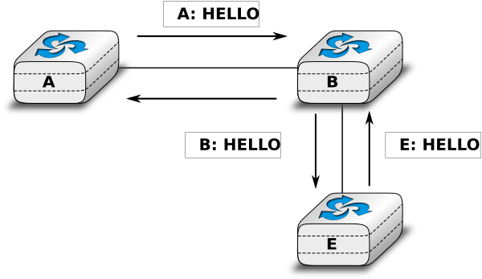
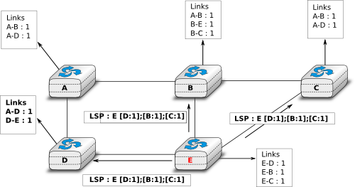
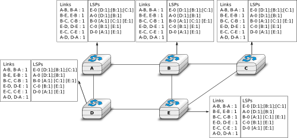
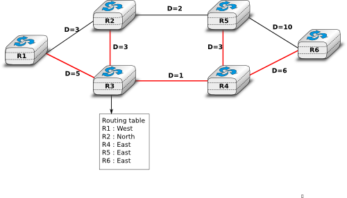

.. Copyright |copy| 2010 by Olivier Bonaventure
.. This file is licensed under a `creative commons licence <http://creativecommons.org/licenses/by/3.0/>`_

.. index:: link-state routing

.. _linkstate:

Link state routing
------------------

Link state routing is the second family of routing protocols. While distance vector routers use a distributed algorithm to compute their routing tables, link-state routers exchange messages to allow each router to learn the entire network topology. Based on this learned topology, each router is then able to compute its routing table by using a shortest path computation [Dijkstra1959]_. 

For link-state routing, a network is modelled as a `directed weighted graph`. Each router is a node, and the links between routers are the edges in the graph.  A positive weight is associated to each directed edge and routers use the shortest path to reach each destination. In practice, different types of weight can be associated to each directed edge :

 - unit weight. If all links have a unit weight, shortest path routing prefers the paths with the least number of intermediate routers.
 - weight proportional to the propagation delay on the link. If all link weights are configured this way, shortest path routing uses the paths with the smallest propagation delay. 
 - :math:`weight=\frac{C}{bandwidth}` where `C` is a constant larger than the highest link bandwidth in the network. If all link weights are configured this way, shortest path routing prefers higher bandwidth paths over lower bandwidth paths
 
Usually, the same weight is associated to the two directed edges that correspond to a physical link (i.e. :math:`R1 \rightarrow R2` and :math:`R2 \rightarrow R1`). However, nothing in the link state protocols requires this. For example, if the weight is set in function of the link bandwidth, then an asymmetric ADSL link could have a different weight for the upstream and downstream directions. 	  
Other variants are possible. Some networks use optimisation algorithms to find the best set of weights to minimize congestion inside the network for a given traffic demand [FRT2002]_. 

.. index:: Hello message

When a link-state router boots, it first needs to discover to which routers it is directly connected. For this, each router sends a HELLO message every `N` seconds on all of its interfaces. This message contains the router's address. Each router has a unique address. As its neighbouring routers also send HELLO messages, the router automatically discovers to which neighbours it is connected. These HELLO messages are only sent to neighbours who are directly connected to a router, and a router never forwards the HELLO messages that they receive. HELLO messages are also used to detect link and router failures. A link is considered to have failed if no HELLO message has been received from the neighbouring router for a period of :math:`k \times N` seconds.

   The exchange of HELLO messages

Once a router has discovered its neighbours, it must reliably distribute its local links to all routers in the network to allow them to compute their local view of the network topology. For this, each router builds a `link-state packet` (LSP) containing the following information :

 - LSP.Router : identification (address) of the sender of the LSP
 - LSP.age : age or remaining lifetime of the LSP
 - LSP.seq : sequence number of the LSP
 - LSP.Links[] : links advertised in the LSP. Each directed link is represented with the following information :  
   - LSP.Links[i].Id : identification of the neighbour
   - LSP.Links[i].cost : cost of the link

These LSPs must be reliably distributed inside the network without using the router's routing table since these tables can only be computed once the LSPs have been received. The `Flooding` algorithm is used to efficiently distribute the LSPs of all routers.  Each router that implements `flooding` maintains a `link state database` (LSDB) containing the most recent LSP sent by each router. When a router receives an LSP, it first verifies whether this LSP is already stored inside its LSDB. If so, the router has already distributed the LSP earlier and it does not need to forward it. Otherwise, the router forwards the LSP on all links except the link over which the LSP was received. Flooding can be implemented by using the following pseudo-code.

.. code-block:: python

  # links is the set of all links on the router
  # Router R's LSP arrival on link l
  if newer(LSP, LSDB(LSP.Router)) :
    LSDB.add(LSP)
    for i in links :
      if i!=l :
      	 send(LSP,i)
  else:
   # LSP has already been flooded 

In this pseudo-code, `LSDB(r)` returns the most recent `LSP` originating from router `r` that is stored in the `LSDB`. `newer(lsp1,lsp2)` returns true if `lsp1` is more recent than `lsp2`. See the note below for a discussion on how `newer` can be implemented.

.. note:: Which is the most recent LSP ?

 A router that implements flooding must be able to detect whether a received LSP is newer than the stored LSP. This requires a comparison between the sequence number of the received LSP and the sequence number of the LSP stored in the link state database. The ARPANET routing protocol [MRR1979]_ used a 6 bits sequence number and implemented the comparison as follows :rfc:`789` 

 .. code-block:: python

   def newer( lsp1, lsp2 ):
     return ( ( ( lsp1.seq > lsp2.seq) and ( (lsp1.seq-lsp2.seq)<=32) ) or
     	     ( ( lsp1.seq < lsp2.seq) and ( (lsp2.seq-lsp1.seq)> 32) )    )

 This comparison takes into account the modulo :math:`2^{6}` arithmetic used to increment the sequence numbers. Intuitively, the comparison divides the circle of all sequence numbers into two halves. Usually, the sequence number of the received LSP is equal to the sequence number of the stored LSP incremented by one, but sometimes the sequence numbers of two successive LSPs may differ, e.g. if one router has been disconnected from the network for some time. The comparison above worked well until October 27, 1980. On this day, the ARPANET crashed completely. The crash was complex and involved several routers. At one point, LSP `40` and LSP `44` from one of the routers were stored in the LSDB of some routers in the ARPANET. As LSP `44` was the newest, it should have replaced by LSP `40` on all routers. Unfortunately, one of the ARPANET routers suffered from a memory problem and sequence number `40` (`101000` in binary) was replaced by `8` (`001000` in binary) in the buggy router and flooded. Three LSPs were present in the network and `44` was newer than `40` which is newer than `8`, but unfortunately `8` was considered to be newer than `44`... All routers started to exchange these three link state packets for ever and the only solution to recover from this problem was to shutdown the entire network :rfc:`789`.

 Current link state routing protocols usually use 32 bits sequence numbers and include a special mechanism in the unlikely case that a sequence number reaches the maximum value (using a 32 bits sequence number space takes 136 years if a link state packet is generated every second).

 To deal with the memory corruption problem, link state packets contain a checksum. This checksum is computed by the router that generates the LSP. Each router must verify the checksum when it receives or floods an LSP. Furthermore, each router must periodically verify the checksums of the LSPs stored in its LSDB.

Flooding is illustrated in the figure below. By exchanging HELLO messages, each router learns its direct neighbours. For example, router `E` learns that it is directly connected to routers `D`, `B` and `C`. Its first LSP has sequence number `0` and contains the directed links `E->D`, `E->B` and `E->C`. Router `E` sends its LSP on all its links and routers `D`, `B` and `C` insert the LSP in their LSDB and forward it over their other links. 

   Flooding : example 

Flooding allows LSPs to be distributed to all routers inside the network without relying on routing tables. In the example above, the LSP sent by router `E` is likely to be sent twice on some links in the network. For example, routers `B` and `C` receive `E`'s LSP at almost the same time and forward it over the `B-C` link. To avoid sending the same LSP twice on each link, a possible solution is to slightly change the pseudo-code above so that a router waits for some random time before forwarding a LSP on each link. The drawback of this solution is that the delay to flood an LSP to all routers in the network increases. In practice, routers immediately flood the LSPs that contain new information (e.g. addition or removal of a link) and delay the flooding of refresh LSPs (i.e. LSPs that contain exactly the same information as the previous LSP originating from this router) [FFEB2005]_.

To ensure that all routers receive all LSPs, even when there are transmissions errors, link state routing protocols use `reliable flooding`. With `reliable flooding`, routers use acknowledgements and if necessary retransmissions to ensure that all link state packets are successfully transferred to all neighbouring routers.  Thanks to reliable flooding, all routers store in their LSDB the most recent LSP sent by each router in the network. By combining the received LSPs with its own LSP, each router can compute the entire network topology.

   Link state databases received by all routers 

.. note:: Static or dynamic link metrics ?

 As link state packets are flooded regularly, routers are able to measure the quality (e.g. delay or load) of their links and adjust the metric of each link according to its current quality. Such dynamic adjustments were included in the ARPANET routing protocol [MRR1979]_ . However, experience showed that it was difficult to tune the dynamic adjustments and ensure that no forwarding loops occur in the network [KZ1989]_. Today's link state routing protocols use metrics that are manually configured on the routers and are only changed by the network operators or network management tools [FRT2002]_.

.. index:: two-way connectivity

When a link fails, the two routers attached to the link detect the failure by the lack of HELLO messages received in the last :math:`k \times N` seconds. Once a router has detected a local link failure, it generates and floods a new LSP that no longer contains the failed link and the new LSP replaces the previous LSP in the network. As the two routers attached to a link do not detect this failure exactly at the same time, some links may be announced in only one direction. This is illustrated in the figure below. Router `E` has detected the failures of link `E-B` and flooded a new LSP, but router `B` has not yet detected the failure.

.. figure:: ../../book/network/svg/ls-twoway.png
   :align: center
   :scale: 100   

   The two-way connectivity check

When a link is reported in the LSP of only one of the attached routers, routers consider the link as having failed and they remove it from the directed graph that they compute from their LSDB. This is called the `two-way connectivity check`. This check allows link failures to be flooded quickly as a single LSP is sufficient to announce such bad news. However, when a link comes up, it can only be used once the two attached routers have sent their LSPs. The `two-way connectivity check` also allows for dealing with router failures. When a router fails, all its links fail by definition. Unfortunately, it does not, of course, send a new LSP to announce its failure. The `two-way connectivity check` ensures that the failed router is removed from the graph.

When a router has failed, its LSP must be removed from the LSDB of all routers [#foverload]_. This can be done by using the `age` field that is included in each LSP. The `age` field is used to bound the maximum lifetime of a link state packet in the network. When a router generates a LSP, it sets its lifetime (usually measured in seconds) in the `age` field. All routers regularly decrement the `age` of the LSPs in their LSDB and a LSP is discarded once its `age` reaches `0`. Thanks to the `age` field, the LSP from a failed router does not remain in the LSDBs forever.

To compute its forwarding table, each router computes the spanning tree rooted at itself by using Dijkstra's shortest path algorithm [Dijkstra1959]_. The forwarding table can be derived automatically from the spanning as shown in the figure below.

   Computation of the forwarding table

.. rubric:: Footnotes

.. [#foverload] It should be noted that link state routing assumes that all routers in the network have enough memory to store the entire LSDB. The routers that do not have enough memory to store the entire LSDB cannot participate in link state routing. Some link state routing protocols allow routers to report that they do not have enough memory and must be removed from the graph by the other routers in the network.
