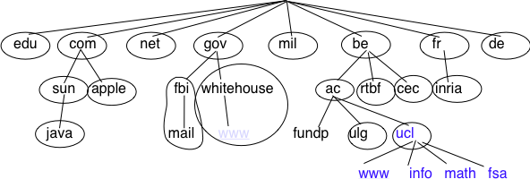
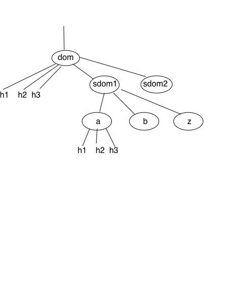

.. Copyright |copy| 2013 by Olivier Bonaventure
.. This file is licensed under a `creative commons licence <http://creativecommons.org/licenses/by-sa/3.0/>`_

.. index:: naming, addressing

Naming and addressing
---------------------

The network and the transport layers rely on addresses that are encoded as fixed size bit strings. A network layer uniquely identifies a host. Several transport layer entities can use the service of the same network layer. For example, a reliable transport protocol and a connectionless transport protocol can coexist on the same host. In this case, the network layer multiplexes the segments produced by the two protocols. This multiplexing is usually achieved by placing in the network packet header a field that indicates which transport protocol produced and should process the segment. Given that there are few different transport protocols, this field does not need to be long. The port numbers play a similar role in the transport layer since they enable it to multiplex data from several application processes.

While addresses are natural for the network and transport layer entities, human users prefer to use names when interacting with servers. Names can be encoded as a character string and a mapping services allows applications to map a name into the corresponding address. Using names is friendlier for the human users than addresses, but it also provides a level of indirection which is very useful in various situations. Before looking at these benefits of names, it is useful to discuss how names are used on the Internet. 

In the early days of the Internet, there were only a few number of hosts (mainly minicomputers) connected to the network. The most popular applications were remote login and file transfer. By 1983, there were already five hundred hosts attached to the Internet. Each of these hosts were identified by a unique IPv4 address. Forcing human users to remember the IPv4 addresses of the remote hosts that they want to use was not user-friendly. Human users prefer to remember names, and use them when needed. Using names as aliases for addresses is a common technique in Computer Science. It simplifies the development of applications and allows the developer to ignore the low level details. For example, by using a programming language instead of writing machine code, a developer can write software without knowing whether the variables that it uses are stored in memory or inside registers. 

Because names are at a higher level than addresses, they allow (both in the example of programming above, and on the Internet) to treat addresses as mere technical identifiers, which can change at will. Only the names are stable. 

.. index:: Network Information Center, hosts.txt

The first solution that allowed applications to use names was the :term:`hosts.txt` file. This file is similar to the symbol table found in compiled code. It contains the mapping between the name of each Internet host and its associated IP address [#fhosts]_. It was maintained by SRI International that coordinated the Network Information Center (NIC). When a new host was connected to the network, the system administrator had to register its name and IP address at the NIC. The NIC updated the :term:`hosts.txt` file on its server. All Internet hosts regularly retrieved the updated :term:`hosts.txt` file from the server maintained by SRI_. This file was stored at a well-known location on each Internet host (see :rfc:`952`) and networked applications could use it to find the IP address corresponding to a name. 

A :term:`hosts.txt` file can be used when there are up to a few hundred hosts on the network. However, it is clearly not suitable for a network containing thousands or millions of hosts. A key issue in a large network is to define a suitable naming scheme. The ARPANet initially used a flat naming space, i.e. each host was assigned a unique name. To limit collisions between names, these names usually contained the name of the institution and a suffix to identify the host inside the institution (a kind of poor man's hierarchical naming scheme). On the ARPANet few institutions had several hosts connected to the network. 

However, the limitations of a flat naming scheme became clear before the end of the ARPANet and :rfc:`819` proposed a hierarchical naming scheme. While :rfc:`819` discussed the possibility of organising the names as a directed graph, the Internet opted eventually for a tree structure capable of containing all names. In this tree, the top-level domains are those that are directly attached to the root. The first top-level domain was `.arpa` [#fdnstimeline]_. This top-level name was initially added as a suffix to the names of the hosts attached to the ARPANet and listed in the `hosts.txt` file. In 1984, the `.gov`, `.edu`, `.com`, `.mil` and `.org` generic top-level domain names were added and :rfc:`1032` proposed the utilisation of the two letter :term:`ISO-3166` country codes as top-level domain names. Since :term:`ISO-3166` defines a two letter code for each country recognised by the United Nations, this allowed all countries to automatically have a top-level domain. These domains include `.be` for Belgium, `.fr` for France, `.us` for the USA, `.ie` for Ireland or `.tv` for Tuvalu, a group of small islands in the Pacific and `.tm` for Turkmenistan. Today, the set of top-level domain-names is managed by the Internet Corporation for Assigned Names and Numbers (:term:`ICANN`). Recently, :term:`ICANN` added a dozen of generic top-level domains that are not related to a country and the `.cat` top-level domain has been registered for the Catalan language. There are ongoing discussions within :term:`ICANN` to increase the number of top-level domains.

Each top-level domain is managed by an organisation that decides how sub-domain names can be registered. Most top-level domain names use a first-come first served system, and allow anyone to register domain names, but there are some exceptions. For example, `.gov` is reserved for the US government, `.int` is reserved for international organisations and names in the `.ca` are mainly `reserved <http://en.wikipedia.org/wiki/.ca>`_ for companies or users who are present in Canada.

   The tree of domain names

:rfc:`1035` recommended the following :term:`BNF` for fully qualified
domain names, to allow host names with a syntax which works with all
applications (the domain names themselves have a much richer syntax).

   BNF of the fully qualified host names

This grammar specifies that a host name is an ordered list of labels separated by the dot (`.`) character. Each label can contain letters, numbers and the hyphen character (`-`) [#fidn]_. Fully qualified domain names are read from left to right. The first label is a hostname or a domain name followed by the hierarchy of domains and ending with the root implicitly at the right. The top-level domain name must be one of the registered TLDs [#ftld]_. For example, in the above figure, `www.whitehouse.gov` corresponds to a host named `www` inside the `whitehouse` domain that belongs to the `gov` top-level domain. `info.ucl.ac.be` corresponds to the `info` domain inside the `ucl` domain that is included in the `ac` sub-domain of the `be` top-level domain.

This hierarchical naming scheme is a key component of the Domain Name System (DNS). The DNS is a distributed database that contains mappings between fully qualified domain names and IP addresses. The DNS uses the client-server model. The clients are hosts that need to retrieve the mapping for a given name. Each :term:`nameserver` stores part of the distributed database and answers the queries sent by clients. There is at least one :term:`nameserver` that is responsible for each domain. In the figure below, domains are represented by circles and there are three hosts inside domain `dom` (`h1`, `h2` and `h3`) and three hosts inside domain `a.sdom1.dom`. As shown in the figure below, a sub-domain may contain both host names and sub-domains.

   A simple tree of domain names

A :term:`nameserver` that is responsible for domain `dom` can directly answer the following queries :
 
 - the IP address of any host residing directly inside domain `dom` (e.g. `h2.dom` in the figure above)
 - the nameserver(s) that are responsible for any direct sub-domain of domain `dom` (i.e. `sdom1.dom` and `sdom2.dom` in the figure above, but not `z.sdom1.dom`)

To retrieve the mapping for host `h2.dom`, a client sends its query to the name server that is responsible for domain `.dom`. The name server directly answers the query. To retrieve a mapping for `h3.a.sdom1.dom` a DNS client first sends a query to the name server that is responsible for the `.dom` domain. This nameserver returns the nameserver that is responsible for the `sdom1.dom` domain. This nameserver can now be contacted to obtain the nameserver that is responsible for the `a.sdom1.dom` domain. This nameserver can be contacted to retrieve the mapping for the `h3.a.sdom1.dom` name. Thanks to this organisation of the nameservers, it is possible for a DNS client to obtain the mapping of any host inside the `.dom` domain or any of its subdomains. To ensure that any DNS client will be able to resolve any fully qualified domain name, there are special nameservers that are responsible for the root of the domain name hierarchy. These nameservers are called :term:`root nameserver`. There are currently about a dozen root nameservers.

.. [#fdozen]_.   

Each root nameserver maintains the list [#froot]_ of all the nameservers that are responsible for each of the top-level domain names and their IP addresses [#frootv6]_. All root nameservers are synchronised and provide the same answers. By querying any of the root nameservers, a DNS client can obtain the nameserver that is responsible for any top-level-domain name. From this nameserver, it is possible to resolve any domain name. 

To be able to contact the root nameservers, each DNS client must know their IP addresses. This implies, that DNS clients must maintain an up-to-date list of the IP addresses of the root nameservers. Without this list, it is impossible to contact the root nameservers. Forcing all Internet hosts to maintain the most recent version of this list would be difficult from an operational point of view. To solve this problem, the designers of the DNS introduced a special type of DNS server : the DNS resolvers. A :term:`resolver` is a server that provides the name resolution service for a set of clients. A network usually contains a few resolvers. Each host in these networks is configured to send all its DNS queries via one of its local resolvers. These queries are called `recursive queries` as the :term:`resolver` must recurse through the hierarchy of nameservers to obtain the `answer`. 

DNS resolvers have several advantages over letting each Internet host query directly nameservers. Firstly, regular Internet hosts do not need to maintain the up-to-date list of the IP addresses of the root servers. Secondly, regular Internet hosts do not need to send queries to nameservers all over the Internet. Furthermore, as a DNS resolver serves a large number of hosts, it can cache the received answers. This allows the resolver to quickly return answers for popular DNS queries and reduces the load on all DNS servers [JSBM2002]_.  

Benefits of names
^^^^^^^^^^^^^^^^^

Using names instead of addresses inside applications has several important benefits in addition to being more human friendly. To understand these benefits, let us consider a popular application that provides information stored on servers. This application involves clients and servers. The server processes provide information upon requests from client processes running on remote hosts. A first deployment of this application would be to rely only on addresses. In this case, the server process would be installed on one host and the clients would connect to this server to retrieve information. Such a deployment has several drawbacks :
 
 - if the server process moves to another physical server, all clients must be informed about the new server address
 - if there are many concurrent clients, the load of the server will increase without any possibility of adding another server without changing the server addresses used by the clients 

Using names solves these problems and provide additional benefits. If clients are configured with the name of the server, they will query the name service before connecting to the server. The name service will resolve the name into the corresponding address. If a server process needs to move from one physical server to another, it suffices to update the name to address mapping of the name service to allow all clients to connect to the new server. The name service also enables the servers to better sustain be load. Assume a very popular server which is accessed by millions of user. This service cannot be provided by a single physical server due to performance limitations. Thanks to the utilisation of names, it is possible to scale this service by mapping a given name to a set of addresses. When a client queries the name service for the server's name, the name service returns one of the addresses in the set. Various strategies can be used to select one particular address inside the set of addresses. A first strategy is to select a random address in the set. A second strategy is to maintain information about the load on the servers and return the address of the less loaded server. Note that the list of server addresses does not need to remain fixed. It is possible to add and remove addresses from the list to cope with load fluctuations. Another strategy is to infer the location of the client from the name request and return the address of the closest server.

Mapping a single name onto a set of addresses allow popular servers to scale dynamically. There are also benefits in mapping multiple names, possibly a large number of them, onto a single address. Consider the case of information servers run by individuals or SMEs. Some of these servers attract only a few clients per day. Using a single physical server for each of these services would be a waste of resources. A better approach is to use a single server for a set of services that are all identified by different names. This enables service providers to support a large number of servers, identifiied by different names, onto a single physical server. If one of these servers becomes very popular, it will be possible to map its name onto a set of addresses to be able to sustain the load. There are some deployments where this mapping is done dynamically in function of the load.

Names provide a lot of flexibility compared to addresses. For the network, they play a similar role as variables in programming languages. No programmer using a high-level programming language would consider using addresses instead of variables. For the same reasons, all networked applications should depend on names and avoid dealing with addresses as much as possible. 

.. rubric:: Footnotes

.. [#fhosts] The :term:`hosts.txt` file is not maintained anymore. A historical snapshot retrieved on April 15th, 1984 is available from http://ftp.univie.ac.at/netinfo/netinfo/hosts.txt

.. [#fdnstimeline] See http://www.donelan.com/dnstimeline.html for a time line of DNS related developments. 

.. [#fidn] This specification evolved later to support domain names written by using other character sets than us-ASCII :rfc:`5890`. This extension is important to support languages other than English, but a detailed discussion is outside the scope of this document.

.. [#ftld] The official list of top-level domain names is maintained by :term:`IANA` at http://data.iana.org/TLD/tlds-alpha-by-domain.txt Additional information about these domains may be found at http://en.wikipedia.org/wiki/List_of_Internet_top-level_domains

.. [#froot] A copy of the information maintained by each root nameserver is available at http://www.internic.net/zones/root.zone

.. [#frootv6] Until February 2008, the root DNS servers only had IPv4 addresses. IPv6 addresses were added to the root DNS servers slowly to avoid creating problems as discussed in http://www.icann.org/en/committees/security/sac018.pdf In 2013, several DNS root servers are still not reachable by using IPv6. The full list is available at http://www.root-servers.org/

.. include:: /links.rst

