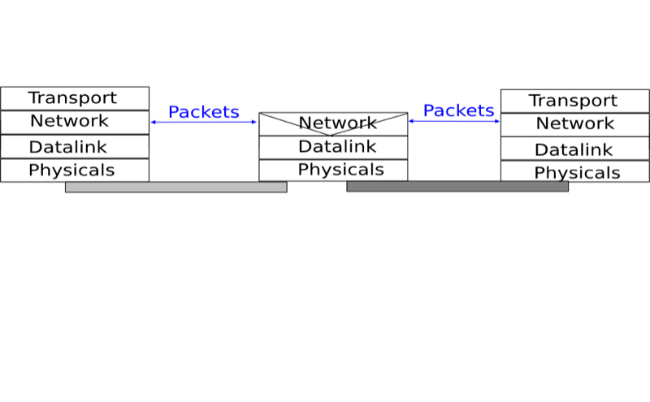
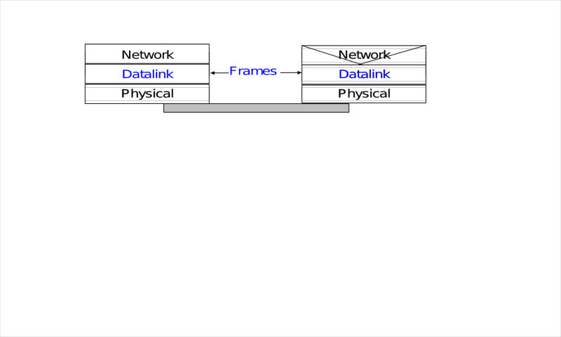
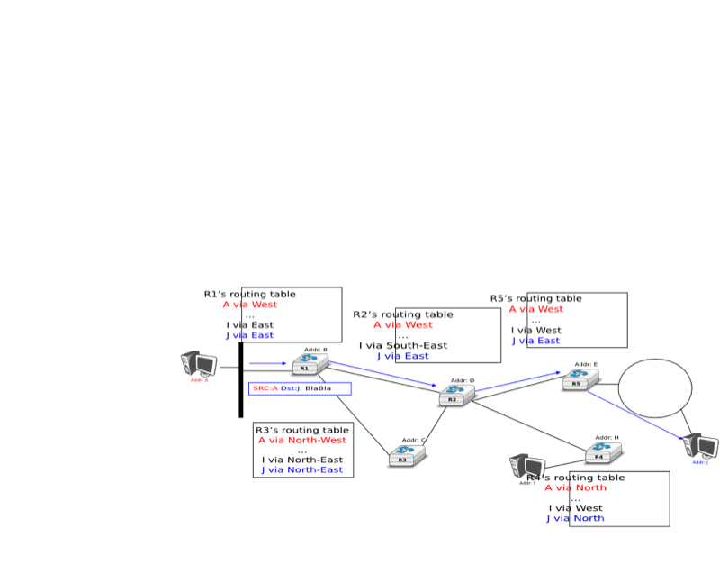

.. Copyright |copy| 2010 by Olivier Bonaventure
.. This file is licensed under a `creative commons licence <http://creativecommons.org/licenses/by/3.0/>`_

Building a network
##################

In the previous section, we have explained how reliable protocols allow hosts to exchange data reliably even if the underlying physical layer is imperfect and thus unreliable. Connecting two hosts together through a wire is the first step to build a network. However, this is not sufficient. Hosts usually need to interact with remote hosts that are not directly connected through a direct physical layer link. This can be achieve by adding one layer above the datalink layer : the `network` layer.

The main objective of the network layer is to allow endsystems, connected to different networks, to exchange information through intermediate systems called :term:`router`. The unit of information in the network layer is called a :term:`packet`.

   
   TODO The network layer in the reference model

Before explaining the network layer in detail, it is useful to remember the characteristics of the service provided by the `datalink` layer. There are many variants of the datalink layer. Some provide a reliable service while others do not provide any guarantee of delivery. The reliable datalink layer services are popular in environments such as wireless networks were transmission errors are frequent. On the other hand, unreliable services are usually used when the physical layer provides an almost reliable service (i.e. only a negligible fraction of the frames are affected by transmission errors). Such `almost reliable` services are frequently in wired and optical networks. In this chapter, we will assume that the datalink layer service provides an `almost reliable` service since this is both the most general one and also the most widely deployed one. 

.. TODO add footnote ? Using a connection-oriented datalink layer causes some problems that are beyond the scope of this chapter. See :rfc:`3819` for a discussion on this topic.

   The point-to-point datalink layer

There are three main types of datalink layers. The simplest datalink layer is when there are only two communicating systems that are directly connected through the physical layer. Such a datalink layer is used when there is a point-to-point link between the two communicating systems. The two systems can be endsystems or routers. :abbr:`PPP (Point-to-Point Protocol)`, defined in :rfc:`1661`, is an example of such a point-to-point datalink layer. Datalink layers exchange `frames` and a datalink :term:`frame` sent by a datalink layer entity on the left is transmitted through the physical layer, so that it can reach the datalink layer entity on the right. Point-to-point datalink layers can either provide an unreliable service (frames can be corrupted or lost) or a reliable service (in this case, the datalink layer includes retransmission mechanisms).  
.. The unreliable service is frequently used above physical layers (e.g. optical fiber, twisted pairs) having a low bit error ratio while reliability mechanisms are often used in wireless networks to recover locally from transmission errors.

.. todo:: Don't think that we need to discuss LANs here

The second type of datalink layer is the one used in Local Area Networks (LAN). Conceptually, a LAN is a set of communicating devices such that any two devices can directly exchange frames through the datalink layer. Both endsystems and routers can be connected to a LAN. Some LANs only connect a few devices, but there are LANs that can connect hundreds or even thousands of devices. In this chapter, we focus on the utilization of point-to-point datalink layers. We will describe later the organisation and the operation of Local Area Networks and their impact on the network layer.

Even if we only consider the point-to-point datalink layers, there is an important characteristics of these layers that we cannot ignore. No datalink layer is able to send frames of unlimited side. Each datalink layer is characterized by a maximum frame size. There are more than a dozen different datalink layers and unfortunately most of them use a different maximum frame size. This heterogeneity in the maximum frame sizes will cause problems when we will need to exchange data between hosts attached to different types of datalink layers.

As a first step, let us assume that we only need to exchange small amount of data. In this case, there is no issue with the maximum length of the frames. However, there are other more interesting problems that we need to tackle. To understand these problems, let us consider the network represented in the figure below.

.. graphviz::

   graph foo {
      A [shape=box];
      B [shape=box];
      C [shape=box];
      A--R1;
      R1--R3;
      R3--R5;
      R1--R2;
      R2--R4;
      R4--R5;
      R3--R4;
      R2--C;
      R4--C;
      R5--B;
   }

.. figure:: todo

   TODO figure with 5 routers and hosts

This network contains two types of devices. The end hosts, represented as a small workstation and the routers, represented as boxes with three arrows. An endhost is a device which is able to send and receive data for its own usage in contrast with routers that most of the time forward data towards their final destination. Routers have multiple links to neighboring routers or endhosts. Endhosts are usually attached via a single link to the network. Nowadays, with the growth of wireless networks, more and more endhosts are equipped with several physical interfaces. These endhosts are often called `multihomed`. Still, using several interfaces at the same time often leads to practical issues that are beyond the scope of this document. For this reason, we will only consider `single-homed` hosts in this ebook.

To understand the key principles behind the operation of a network, let us analyse all the operations that need to be performed to allow host `A` in the above network to send one byte to host `B`. Thanks to the datalink layer used above the `A-R1` link, host `A` can easily send a byte to router `R1` inside a frame. However, upon reception of this frame, router `R1` needs to understand that the byte is destined to host `B` and not to itself. This is the objective of the network layer.

.. index:: address

The network layer enables the transmission of information between hosts that are not directly connected through intermediate routers. This transmission is carried out by putting the information to be transmitted inside a data structure which is called a `packet`. Like a frame that contains useful data and control information, a packet also contains useful data and control information. An important issue in the network layer is the ability to identify a node (host or router) inside the network. This identification is performed by associating an address to each node. An `address` is usually represented as a sequence of bits. Most networks use fixed-length addresses. At this stage, let us simply assume that each of the nodes in the above network has an address which corresponds to the binary representation on its name on the figure. 

To send one byte of information to host `B`, host `A` needs to place this information inside a `packet`. In addition to the data being transmitted, the packet must also either contain the addresses of the source and the destination nodes or information that indicates the path that needs to be followed to reach the destination. 

There are two possible organisations for the network layer :

 - `datagram`
 - `virtual circuits` 

The first and most popular organisation of the network layer is the datagram organisation. This organisation is inspired by the organisation of the postal service. Each host is identified by a `network layer address`. To send information to a remote host, a host creates a packet that contains :

 - the network layer address of the destination host
 - its own network layer address
 - the information to be sent

.. The network layer limits the maximum packet size. Thus, the information must have been divided in packets by the transport layer before being passed to the network layer. 

To understand the datagram organisation, let us consider the figure below. A network layer address, represented by a letter, has been assigned to each host and router. To send some information to host `J`, host `A` creates a packet containing its own address, the destination address and the information to be exchanged.

   A simple internetwork 

.. index:: hop-by-hop forwarding, forwarding table

With the datagram organisation, routers use `hop-by-hop forwarding`. This means that when a router receives a packet that is not destined to itself, it looks up the destination address of the packet in its `forwarding table`. A `forwarding table` is a data structure that maps each destination address (or set of destination addresses) to the outgoing interface over which a packet destined to this address must be forwarded to reach its final destination. The router consults its forwarding table for each packet that it handles. 

The figure illustrates some possible forwarding tables in this network. By inspecting the forwarding tables of the different routers, one can find the path followed by packets sent from a source to a particular destination. In the example above, host `A` sends its packet to router `R1`. `R1` consults its routing table and forwards the packet towards `R2`. Based on its own routing table, `R2` decides to forward the packet to `R5` that can deliver it to its destination. Thus, the path from `A` to `J` is `A -> R1 -> R2 -> R5 -> J`.

The computation of the forwarding tables of all the routers inside a network is a key element for the correct operation of the network. This computation can be carried out in different ways and it is possible to use both distributed and centralized algorithms. These algorithms provide different performance, may lead to different types of paths, but their composition must lead to valid path. 

In a network, a path can be defined as the list of all intermediate routers for a given source destination pair. For a given source/destination pair, the path can be derived by first consulting the forwarding table of the router attached the source to determine the next router on the path towards the chosen destination. Then, the forwarding table of this router is queried for the same destination... The queries continue until the destination is reached. In a network that has valid forwarding tables, all the paths between all source/destination pairs contain a finite number of intermediate routers. However, if forwarding tables have not been correctly computed, two types of invalid path can occur. 

.. index:: black hole

A path may lead to a black hole. In a network, a black hole is a router that receives packets for at least one given source/destination pair but does not have any entry inside its forwarding table for this destination. Since it does not know how to reach the destination, the router cannot forward the received packets and must discard them. Any centralized or distributed algorithm that computes forwarding tables must ensure that there are not black holes inside the network.

.. index:: forwarding loop

A second type of problem may exist in networks using the datagram organisation. Consider a path that contain a cycle. For example, router `R1` sends all packets towards destination `D` via router `R2`, router `R2` forwards these packets to router `R3` and finally router `R3`'s forwarding table uses router `R1` as its nexthop to reach destination `D`. In this case, if a packet destined to `D` is received by router `R1`, it will loop on the `R1 -> R2 -> R3 -> R1` cycle and will never reach its final destination. As in the black hole case, the destination is not reachable from all sources in the network. However, in practice the loop problem is worse than the black hole problem because when a packet is caught in a forwarding loop, it unnecessarily consumes bandwidth. In the black hole case, the problematic packet is quickly discarded. We will see later that network layer protocols include techniques to minimize the impact of such forwarding loops.

Any solution which is used to compute the forwarding tables of a network must ensure that all destinations are reachable from any source. This implies that it must guarantee the absence of black holes and forwarding loops. 

.. index:: data plane

The `forwarding tables` and the precise format of the packets that are exchanged inside the network are part of the `data plane` of the network.  This `data plane` contains all the protocols and algorithms that are used by hosts and routers to create and process the packets that contain user data. On high-end routers, the data plane is often implemented in hardware for performance reasons.

.. To allow hosts to exchange packets, a network relies on two different types of protocols and mechanisms. First, there must be a precise definition of the format of the packets that are sent by hosts and processed by routers. Second, the algorithm used by the routers to forward these packets must be defined. This protocol and this algorithm are part of the `data plane` of the network layer.

.. index:: control plane

Besides the `data plane`, a network is also characterized by its `control plane`. The control plane includes all the protocols and algorithms (often distributed) that are used to compute the forwarding tables that are installed on all routers inside the network. While there is only one possible `data plane` for a given networking technology, different networks using the same technology may use different control planes. The simplest `control plane` for a network is always to compute manually the forwarding tables of all routers inside the network. This simple control plane is sufficient when the network is (very) small, usually up to a few routers. 

In most networks, manual forwarding tables are not a solution for two reasons. First, most networks are too large to enable a manual computation of the forwarding tables. Second, with manually computed forwarding tables, it is very difficult to deal with link and router failures. Networks need to operate 24h a day, 365 days per year. During the lifetime of a network, many events can affect the routers and links that it contains. Link failures are regular events in deployed networks. Links can fail for various reasons, including electromagnetic interference, fiber cuts, hardware or software problems on the terminating routers, ... Some links also need to be added to the network or removed because their utilisation is too low or their cost is too high. Similarly, routers also fail. There are two types of failures that affect routers. A router may stop forwarding packets due to hardware or software problem (e.g. due to a crash of its operating system). A router may also need to be halted from time to time (e.g. to upgrade its operating system to fix some bugs). These planned and unplanned events affect the set of links and routers that can be used to forward packets in the network. Still, most network users expect that their network will continue to correctly forward packets despite all these events. With manually computed forwarding tables, it is usually impossible to precompute the forwarding tables while taking into account all possible failure scenarios.

An alternative to manually computed forwarding tables is to use a network management platform that tracks the network status and can push new forwarding tables on the routers when it detects any modification to the network topology. This solution gives some flexibility to the network managers in computing the paths inside their network. However, this solution only works if the network management platform is always capable of reaching all routers even when the network topology changes. This may require a dedicated network that allows the management platform to push information on the forwarding tables.

.. todo:: cite references

..  Openflow is an example of this kind of solution.

Another interesting point that is worth being discussed is when the forwarding tables are computed. A widely used solution is to compute the entries of the forwarding tables for all destinations on all routers. This ensures that each router has a valid route towards each destination. These entries can be updated when an event occurs and the network topology changes. A drawback of this approach is that the forwarding tables can become large in large networks since each router must maintain one entry for each destination at all times inside its forwarding table.

Some networks use the arrival of packets as the trigger to compute the corresponding entries in the forwarding tables. Several technologies have been built upon this principle. When a packet arrives, the router consults its forwarding table to find a path towards the destination. If the destination is present in the forwarding table, the packet is forwarded. Otherwise, the router needs to find a way to forward the packet and update its forwarding table.

Several techniques to update the forwarding tables upon the arrival of a packet have been used in deployed networks. In this section, we briefly present the principles that underly three of these techniques.

The first technique assumes that the underlying network topology is a tree. A tree is the simplest network to be considered when forwarding packets. The main advantage of using a tree is that there is only one path between any pair of nodes inside the network. Since a tree does not contain any cycle, it is impossible to have forwarding loops in a tree-shaped network.

.. index:: port-address table

In a tree-shaped network, it is relatively simple to for each node to automatically compute its forwarding table by inspecting the packets that it receives. For this, each node uses the sources and destination addresses present inside each packet. The source address allows to learn the location of the different sources inside the network. Each source has a unique address. When a node receives a packet over a given interface, it learns that the source (address) of this packet is reachable via this interface. The node maintains a data structure that maps each known source address to an incoming interface. This data structure is often called the port-address table since it indicates the interface (or port) to reach a given address. Learning the location of the sources is not sufficient, nodes also need to forward packets towards their destination. When a node receives a packet whose destination address is already present inside its port-address table, it simply forwards the packet on the interface listed in the port-address table. In this case, the packet will follow the port-address table entries in the downstream nodes and will reach the destination. If the destination address is not included in the port-address table, the node simply forwards the packet on all its interfaces, except the interface from which the packet was received. Forwarding a packet over all interfaces is usually called `broadcasting` in the terminology of computer networks. Sending the packet over all interfaces except one is a costly operation since the packet will be sent over links that do not reach the destination. Given the tree-shape of the network, the packet will explore all downstream branches of the tree and will thus finally reach its destination. In practice, the `broadcasting` operation does not occur too often and its cost is limited. 

To understand the operation of the port-address table, let us consider the example network shown in the figure below. This network contains three hosts : `A`, `B` and `C` and five nodes, `R1` to `R5`. When the network boots, all the forwarding tables of the nodes are empty.

.. graphviz::

   graph foo {
      A [shape=box];
      B [shape=box];
      C [shape=box];
      A--R1;
      R1--R3;
      R3--R5;
      R1--R2;
      R3--R4;
      R2--C;
      R5--B;
   }

Host `A` sends a packet towards `B`. When receiving this packet, `R1` learns that `A` is reachable via its `North` interface. Since it does not have an entry for destination `B` in its port-address table, it forwards the packet to both `R2` and `R3`. When `R2` receives the packet, it updates its own forwarding table and forward the packet to `C`. Since `C` is not the intended recipient, it simply discards the received packet. Node `R3` also received the packet. It learns that `A` is reachable via its `North` interface and broadcasts the packet to `R4` and `R5`. `R5` also updates its forwarding table and finally forwards it to destination `B`.`Let us now consider what happens when `B` sends a reply to `A`. `R5`  first learns that `A` is attached to its `South` port. It then consults its port-address table and finds that `A` is reachable via its `North` interface. The packet is then forwarded hop-by-hop to `A` without any broadcasting. If `C` sends a packet to `B`, this packet will reach `R1` that contains a valid forwarding entry in its forwarding table.

By inspecting the source and destination addresses of packets, network nodes can automatically derive their forwarding tables. As we will discuss later, this technique is used in Ethernet networks. Despite being widely used, it has two important drawbacks. First, packets sent to unknown destinations are broadcasted in the network even if the destination is not attached to the network. Consider the transmission of ten packets destined to `Z` in the network above. When a node receives a packet towards this destination, it can only broadcast the packet. Since `Z` is not attached to the network, no node will ever receive a packet whose source is `Z` to update its forwarding table. The second and more important problem is that few networks have a tree-shaped topology. It is interesting to analyze what happens when a port-address table is used in a network that contains a cycle. Consider the simple network shown below with a single host.

.. graphviz::

   graph foo {
      A [shape=box];
      B [shape=box];
      A--R1 ;
      R1--R2 ;
      R1--R3;
      R2--R3;
      R3--B;
   }

Assume that the network has started and all port-station and forwarding tables are empty. Host `A` sends a packet towards `B`. Upon reception of this packet, `R1` updates its port-address table. Since `B` is not present in the port-address table, the packet is broadcasted. Both `R2` and `R3` receive a copy of the packet sent by `A`. They both update their port-address table. Unfortunately, they also both broadcast the received packet. `B` receives a first copy of the packet, but `R3` and `R2` receive it again. `R3` will then broadcast this copy of the packet to `B` and `R1` while `R2` will broadcast its copy to `R1`. Although `B` has already received two copies of the packet, it is still inside the network and will continue to loop. Due to the presence of the cycle, a single packet towards an unknown destination generates copies of this packet that loop and will saturate the network bandwidth. Network operators who are using port-address tables to automatically compute the forwarding tables also use distributed algorithms to ensure that the network topology is always a tree.

.. 
 //     imagepath="../svg/icons/:../../svg/icons/";
 //     r1 [label="R1" labelloc=bottom shapefile="router.png" ];
 //     r2 [label="R2" labelloc=bottom shape=box imagescale=true image="router.png" ];
 //     r3 [label="R3" labelloc=bottom shape=none image="router.png" ];

.. http://support.novell.com/techcenter/articles/ana19910501.html reference source routing token ring

.. index:: source routing

Another technique can be used to automatically compute forwarding tables. It has been used in interconnected Token Ring networks and is used in some wireless networks. Intuitively, `Source routing` enables a destination to automatically discover the paths from a given source towards itself. This technique requires nodes to change some information inside some packets. For simplicity, let us assume that the `data plane` supports two types of packets :

 - the `data packets`
 - the `control packets`

`Data packets` are used to exchange data while `control packets` are used to discover the paths between endhosts. With `Source routing`, network nodes can be kept as simple as possible and all the complexity is placed on the endhosts. This is in contrast with the previous technique where the nodes had to maintain a port-address and a forwarding table while the hosts simply sent and received packets. Each node is configured with one unique address and there is one identifier per outgoing link. For simplicity and to avoid cluttering the figures with those identifiers, we will assume that each node uses as link identifiers north, west, south, ... In practice, a node would associate one integer to each outgoing link. 

.. graphviz::

   graph foo {
      A [shape=box];
      B [shape=box];
      A--R1 ;
      R1--R2 [];
      R1--R3 [];
      R2--R3 [];
      R3--R4 [];
      R4--B ;
   }

In this network above, node `R2` is attached to two outgoing links. `R2` is connected to both `R1` and `R3`. `R2` can easily determine that it is connected to these two nodes by exchanging packets with them or observing the packets that it receives over each interface. Assume for example that when a host or node starts, it sends a special control packet over each of its interfaces to advertise its own address to its neighbors. When a host or node receives such a packet, it automatically replies with its own address. This exchange can also be used to verify whether a neighbor, either node or host, is still alive. whose identifiers are respectively `R2.ne` and `R2.se`. With `source routing`, the data plane packets include a list identifiers. This list is called a `source route` and indicates the path to be followed by the packet as a sequence of link identifiers. When a node receives such a `data plane` packet, it first checks whether the packet's destination is direct neighbor. In this case, the packet is forwarded to the destination. Otherwise, the node extracts the next address from the list and forwards it to the neighbor. This allows the source to specify the explicit path to be followed for each packet. For example, in the figure above there are two possible paths between `A` and `B`. To use the path via `R2`, `A` would send a packet that contains `R1,R2,R3` as source route. To avoid going via `R2`, `A` would place `R1,R3` as the source route in its transmitted packet. If `A` knows the complete network topology and all link identifiers, it can easily compute the source route towards each destination. If needed, it could even use different paths, e.g. for redundancy, to reach a given destination. However, in a real network hosts do not usually have a map of the entire network topology. 

.. index:: record route

In networks that rely on source routing, hosts use control packets to automatically discover the best path(s). In addition to the source and destination addresses, `control packets` contain a list that records the intermediate nodes. This list is often called the `record route` because it allows to record the route followed by a given packet. When a node receives a `control packet`, it first checks whether its address is included in the record route. If yes, the control packet is silently discarded. Otherwise, it adds its own address to the `record route` and forwards the packet to all its interfaces, except the interface over which the packet has been received. Thanks to this, the `control packet` will be able to explore all paths between a source and a given destination.

For example, consider again the network topology above. `A` sends a control packet towards `B`. The initial `record route` is empty. When `R1` receives the packet, it adds its own address to the `record route` and forwards a copy to `R2` and another to `R2`. `R2` receives the packet, adds itself to the `record route` and forwards it to `R3`. `R3` receives two copies of the packet. The first contains the `[R1,R2]` `record route` and the second `[R1,R2,R3]`. In the end, `B` will receive two control packets containing  `[R1,R2,R3,R4]` and `[R1,R3,R4]` as `record routes`. 
`B` can keep these two paths or select the best one and discard the second. A popular heuristic is to select the `record route` of the first received packet as being the best one since this likely corresponds to the shortest delay path.

With the received `record route`, `B` can send a `data packet` to `A`. For this, it simply reverses the chosen `record route`. However, we still need to communicate the chosen path to `A`. This can be done by putting the `record route` inside a control packet which is sent back to `A` over the reverse path. An alternative is to simply send a `data packet` back to `A`. This packet will travel back to `A`. To allow `A` to inspect the entire path followed by the `data packet`, its `source route` must contain all intermediate routers when it is received by `A`. This can be achieved by encoding the `source route` using a data structure that contains an index and the ordered list of node addresses. The index always points to the next address in the `source route`. It is initialized at `0` when a packet is created and incremented by each intermediate node. 

Flat or hierarchical addresses
------------------------------

The last, but important, point to discuss about the `data plane` of the networks that rely on the datagram mode is their addressing scheme. In the examples above, we have used letters to represent the addresses of the hosts and network nodes. In practice, all addresses are encoded as a bit string. Most network technologies use a fixed size bit string to represent source and destination address. These addresses can be organized in two different ways.

The first organisation, which is the one that we have implicitly assumed until now, is the `flat addressing` scheme. Under this scheme, each host and network node has a unique address. The unicity of the addresses is important for the operation of the network. If two hosts have the same address, it can become difficult for the network to forward packets towards this destination. `Flat addresses` are typically used in situations where network nodes and hosts need to be able to communicate immediately with unique addresses. These `flat addresses` are often embedded inside the hardware of network interface cards. The network card manufacturer creates one unique address for each interface and this address is stored in the read-only memory of the interface. An advantage of this addressing scheme is that it easily supports ad-hoc and mobile networks. When a host moves, it can attach to another network and remain confident that its address is unique and enables it to communicate inside the new network.

With `flat addressing` the lookup operation in the forwarding table can be implemented as an exact match. The `forwarding table` contains the (sorted) list of all known destination addresses. When a packet arrives, a network node only needs to check whether this address is part of the forwarding table or not. In software, this is an `O(log(n))` operation if the list is sorted. In hardware, Content Addressable Memories can perform this lookup operation efficiently, but their size is usually limited.

.. https://www.pagiamtzis.com/pubs/pagiamtzis-jssc2006.pdf

A drawback of the `flat addressing scheme` is that the forwarding tables grow linearly with the number of hosts and nodes in the network. With this addressing scheme, each forwarding table must contain an entry that points to every address reachable inside the network. Since large networks can contain ten of millions or more of hosts, this is a major problem on network nodes that need to be able to quickly forward packets. As an illustration, it is interesting to consider the case of an interface running at 10 Gbps. Such interfaces are found on high-end servers and in various network nodes today. Assuming a packet size of 1000 bits, a pretty large and conservative number, such interface must forward ten million packets every second. This implies that a network node that receives packets over such a link must forward one 1000 bits packet every 100 nanoseconds. This is the same order of magnitude as the memory access times of old DRAMs. 

A widely used alternative to the `flat addressing scheme` is the `hierarchical addressing scheme`. This addressing scheme builds upon the fact that networks usually contain much more hosts than network nodes. In this case, a first solution to reduce the size of the forwarding tables is to create a hierarchy of addresses. This is the solution chosen by the post office were addresses contain a country, sometimes a state or province, a city, a street and finally a street number. When an enveloppe is forwarded by a postoffice in a remote country, it only looks at the destination country, while a post office in the same province will look at the city information. Only the post office responsible for a given city will look at the street name and only the postman will use the street number. `Hierarchical addresses` provide a similar solution for network addresses. For example, the address of an Internet host attached to a campus network could contain in the high-order bits an identification of the Internet Service Provider (ISP) that serves the campus network. Then, a subsequent block of bits identifies the campus network which is one of the customers from the ISP. Finally, the low order bits of the address identify the host in the campus network.

This hierarchical allocation of addresses can be applied in any type of network. In practice, the allocation of the addresses must follow the network topology. Usually, this is achieved by dividing the addressing space in consecutive blocks and then allocating these blocks to different parts of the network. In a small network, the simplest solution is to allocate one block of addresses to each network node and assign the host addresses from the attached node. 

.. graphviz::

   graph foo {
      A [shape=box];
      B [shape=box];
      A--R1 ;
      R1--R2 [];
      R1--R3 [];
      R2--R3 [];
      R3--R4 [];
      R4--B ;
   }

In the above figure, assume that the network uses 16 bits addresses and that the prefix `01001010` has been assigned to the entire network. Since the network contains four routers, the network operator could assign one block of sixty-four addresses to each router. `R1` would use address `0100101000000000` while `A` could use address `0100101000000001`. `R2` could be assigned all adresses from `0100101001000000`  to `0100101001111111`. `R4` could then use `0100101011000000` and assign ``0100101011000001` to `B`. Other allocation schemes are possible. For example, `R3` could be allocated a larger block of addresses than `R2` and `R4` could use a sub-block from `R3`'s address block. 

The main advantage of hierarchical addresses is that it is possible to significantly reduce the size of the forwarding tables. In many networks, the number of nodes can be several orders of magnitude smaller than the number of hosts. A campus network may contain a few dozen of network nodes for thousands of hosts. The largest Internet Services Providers typically contain not more than a few tends of thousands of network nodes but still serve tens or hundreds of millions of hosts.

Despite their popularity, `hierarchical addresses` have some drawbacks. Their first drawback is that a lookup in the forwarding table is more complex than when using `flat addresses`. For example, on the Internet, network nodes have to perform a longest-match to forward each packet. This is partially compensated by the reduction in the size of the forwarding tables, but the additional complexity of the lookup operation has been a difficulty to implement hardware support for packet forwarding. A second drawback of the utilisation of hierarchical addresses is that when a host connects for the first time to a network, it must contact one network node to determine its own address. This requires some packet exchanges between the host and some network nodes. Furthermore, if a host moves and is attached to another network node, its network address will change. This can be an issue with some mobile hosts. 

Virtual circuit organisation
----------------------------

The second organisation of the network layer, called `virtual circuits`, has been inspired by the organisation of telephone networks. Telephone networks have been designed to carry phone calls that usually last a few minutes. Each phone is identified by a telephone number and is attached to a telephone switch. To initiate a phone call, a telephone first needs to send the destination's phone number to its local switch. The switch cooperates with the other switches in the network to create a bi-directional channel between the two telephones through the network. This channel will be used by the two telephones during the lifetime of the call and will be released at the end of the call. Until the 1960s, most of these channels were created manually, by telephone operators, upon request of the caller. Today's telephone networks use automated switches and allow several channels to be carried over the same physical link, but the principles remain roughly the same.

.. index:: label switching

In a network using virtual circuits, all hosts are also identified with a network layer address. However, packet forwarding is not performed by looking at the destination address of each packet. With the `virtual circuit` organisation, each data packet contains one label [#flabels]_. A label is an integer which is part of the packet header. Network nodes implement `label switching` to forward `labelled data packet`. Upon reception of a packet, a network nodes consults its `label forwarding table` to find the outgoing interface for this packet. In contrast with the datagram mode, this lookup is very simple. The `label forwarding table` is an array stored in memory and the label of the incoming packet is the index to access this array. This implies that the lookup operation has an `O(1)` complexity in contrast with other packet forwarding techniques. To ensure that on each node the packet label is an index in the `label forwarding table`, each network node that forwards a packet replaces the label of the forwarded packet with the label found in the `label forwarding table`.  Each entry of the `label forwarding label` contains two informations :

 - the outgoing interface for the packet
 - the label for the outgoing packet

For example, consider the `label forwarding table` of a network node below. 

+--------+--------------------+----------+
| index  | outgoing interface | label    |
+--------+--------------------+----------+
|  0     |  South             |    7     |
+--------+--------------------+----------+
|  1     |  none              |   none   |
+--------+--------------------+----------+
|  2     |  West              |    2     |
+--------+--------------------+----------+
|  3     |  East              |    2     |
+--------+--------------------+----------+

If this node receives a packet with `label=2`, it forwards the packet on its `West` interface and sets the `label` of the outgoing packet to `2`. If the received packet's `label` is set to `3`, then the packet is forwarded over the `East` interface and the `label` of the outgoing packet is set to `2`. If a packet is received with a label field set to `1`, the packet is discard since the corresponding `label forwarding table` entry is invalid.

`Label switching` enables a full control on the path followed by packets inside the network. Consider the network below and assume that we want to use two virtual circuits : `R1->R3->R4->R2->R5` and `R2->R1->R3->R4->R5`.

.. graphviz::

   graph foo {
      R1--R2 [];
      R1--R3 [];
      R2--R4 [];
      R3--R4 [];
      R4--R5 [];
      R2--R5 [];
   }

To create these virtual circuits, we need to configure the 
label forwarding tables` of all network nodes. For simplicity, assume that a label forwarding table only contain two entries. Assume that `R5` wants to receive the packets from the virtual circuit created by `R1` (resp. `R2`) with `label=1` (`label=0`). `R4` could use the following `label forwarding table`:

+--------+--------------------+----------+
| index  | outgoing interface | label    |
+--------+--------------------+----------+
|  0     |  ->R2              |    1     |
+--------+--------------------+----------+
|  1     |  ->R5              |    0     |
+--------+--------------------+----------+

Since a packet received with `label=1` must be forwarded to `R5` with `label=1`, `R2`'s `label forwarding table` could contain :

+--------+--------------------+----------+
| index  | outgoing interface | label    |
+--------+--------------------+----------+
|  0     |  none              |   none   |
+--------+--------------------+----------+
|  1     |  ->R5              |    1     |
+--------+--------------------+----------+

Two virtual circuits pass through `R3`. They both need to be forwarded to `R4`, but `R4` expects `label=1` for packets belonging to the virtual circuit originated by `R2` and `label=0` for packets belonging to the other virtual circuit. `R3` could choose to leave the labels unchanged.

+--------+--------------------+----------+
| index  | outgoing interface | label    |
+--------+--------------------+----------+
|  0     |  ->R4              |    0     |
+--------+--------------------+----------+
|  1     |  ->R4              |    1     |
+--------+--------------------+----------+

With the above `label forwarding table`, `R1` needs to originate the packets that belong to the `R1->R3->R4->R2->R5` with `label=1`. The packets received from `R2` and belonging to the `R2->R1->R3->R4->R5` would then use `label=0` on the `R1-R3` link. `R1`'s label forwarding could be built as follows :

+--------+--------------------+----------+
| index  | outgoing interface | label    |
+--------+--------------------+----------+
|  0     |  ->R3              |    0     |
+--------+--------------------+----------+
|  1     |  none              |    1     |
+--------+--------------------+----------+

We will discuss later Multi-Protocol Label Switching (MPLS) as the example of a deployed networking technology that relies on label switching. MPLS is more complex than the above description because it has been designed to be easily integrated with datagram technologies. However, the principles remain. `Asynchronous Transfer Mode`(ATM) and Frame Relay are other examples of technologies that rely on `label switching`.

Nowadays, most deployed networks rely on distributed algorithms, called routing protocols, to compute the forwarding tables that are installed on the network nodes. These distributed algorithms are part of the `control plane`. Their are usually implemented in software and are executed on the main CPU of the network nodes. There are two main families of routing protocols : distance vector routing and link state routing. Both are capable of discovering autonomously the network and react dynamically to topology changes.

.. The datagram organisation has been very popular in computer networks. Datagram based network layers include IPv4 and IPv6 in the global Internet, CLNP defined by the ISO, IPX defined by Novell or XNS defined by Xerox [Perlman2000]_.

.. 
 .. figure:: svg/simple-lan.png
    :align: center
    :scale: 80    
   
    A local area network 

.. An important difference between the point-to-point datalink layers and the datalink layers used in LANs is that in a LAN, each communicating device is identified by a unique `datalink layer address`. This address is usually embedded in the hardware of the device and different types of LANs use different types of datalink layer addresses. A communicating device attached to a LAN can send a datalink frame to any other communicating device that is attached to the same LAN. Most LANs also support special broadcast and multicast datalink layer addresses. A frame sent to the broadcast address of the LAN is delivered to all communicating devices that are attached to the LAN. The multicast addresses are used to identify groups of communicating devices. When a frame is sent towards a multicast datalink layer address, it is delivered by the LAN to all communicating devices that belong to the corresponding group.

.. index:: NBMA, Non-Broadcast Multi-Access Networks

.. The third type of datalink layers are used in Non-Broadcast Multi-Access (NBMA) networks. These networks are used to interconnect devices like a LAN. All devices attached to an NBMA network are identified by a unique datalink layer address. However, and this is the main difference between an NBMA network and a traditional LAN, the NBMA service only supports unicast. The datalink layer service provided by an NBMA network supports neither broadcast nor multicast.

.. The network layer itself relies on the following principles : 

.. #. Each network layer entity is identified by a `network layer address`. This address is independent of the datalink layer addresses that it may use.
.. #. The service provided by the network layer does not depend on the service or the internal organisation of the underlying datalink layers.
.. #. The network layer is conceptually divided into two planes : the `data plane` and the `control plane`. The `data plane` contains the protocols and mechanisms that allow hosts and routers to exchange packets carrying user data. The `control plane` contains the protocols and mechanisms that enable routers to efficiently learn how to forward packets towards their final destination. 

.. The independence of the network layer from the underlying datalink layer is a key principle of the network layer. It ensures that the network layer can be used to allow hosts attached to different types of datalink layers to exchange packets through intermediate routers. Furthermore, this allows the datalink layers and the network layer to evolve independently from each other. This enables the network layer to be easily adapted to a new datalink layer every time a new datalink layer is invented.

..
 
 There are two types of service that can be provided by the network layer :

..

 - an `unreliable connectionless` service
 - a `connection-oriented`, reliable or unreliable, service

..  Connection-oriented services have been popular with technologies such as :term:`X.25` and :term:`ATM` or :term:`frame-relay`, but nowadays most networks use an `unreliable connectionless` service. This is our main focus in this chapter.

.. maybe add more information

The control plane
=================

One of the objectives of the `control plane` in the network layer is to maintain the routing tables that are used on all routers. As indicated earlier, a routing table is a data structure that contains, for each destination address (or block of addresses) known by the router, the outgoing interface over which the router must forward a packet destined to this address. The routing table may also contain additional information such as the address of the next router on the path towards the destination or an estimation of the cost of this path. 

In this section, we discuss the three main techniques that can be used to maintain the routing tables in a network.

.. rubric:: Footnotes

.. [#flabels] We will see later a more detailed description of Multiprotocol Label Switching, a networking technology that is capable of using one or more labels.

.. include:: /links.rst

