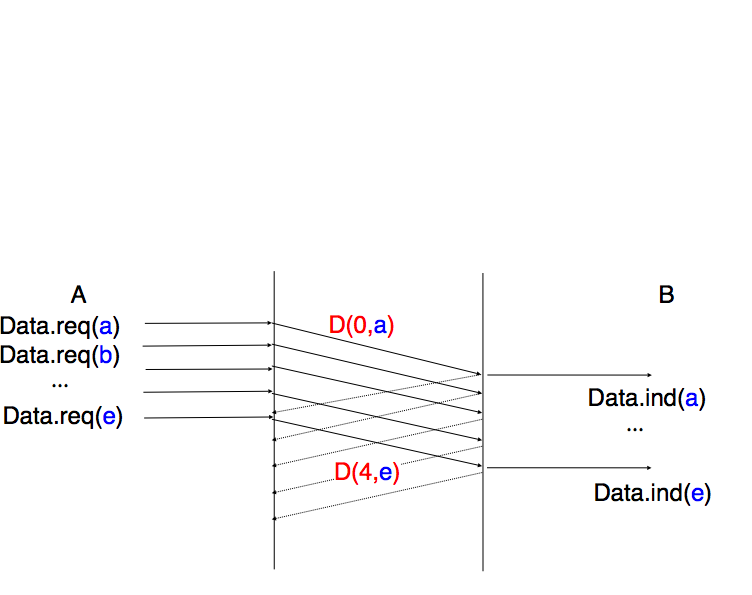
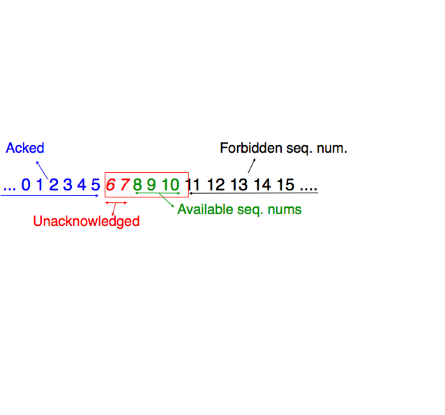
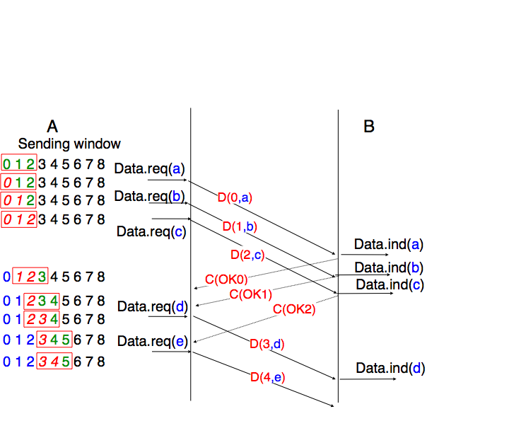
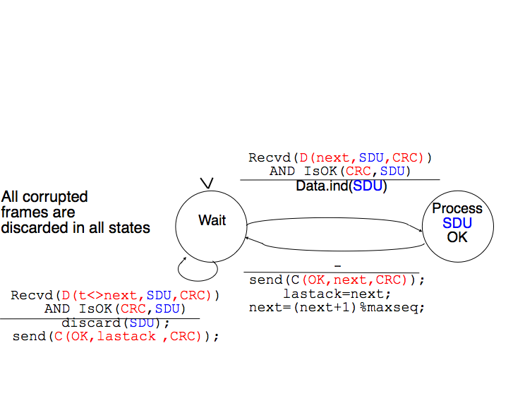
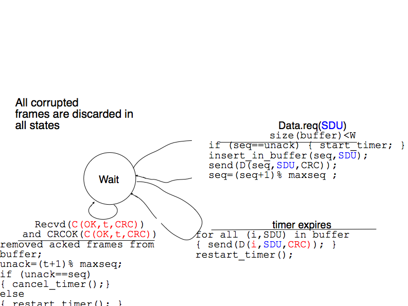
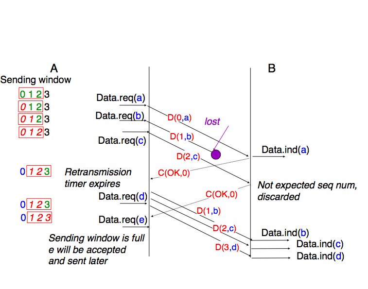
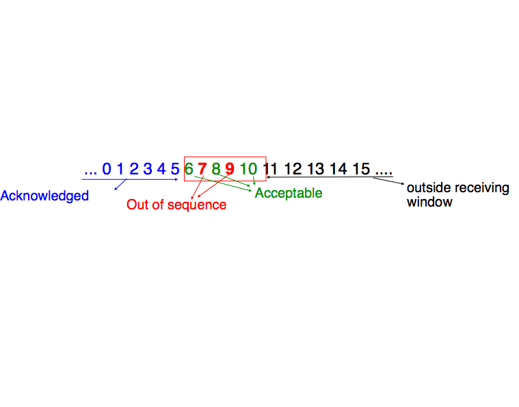
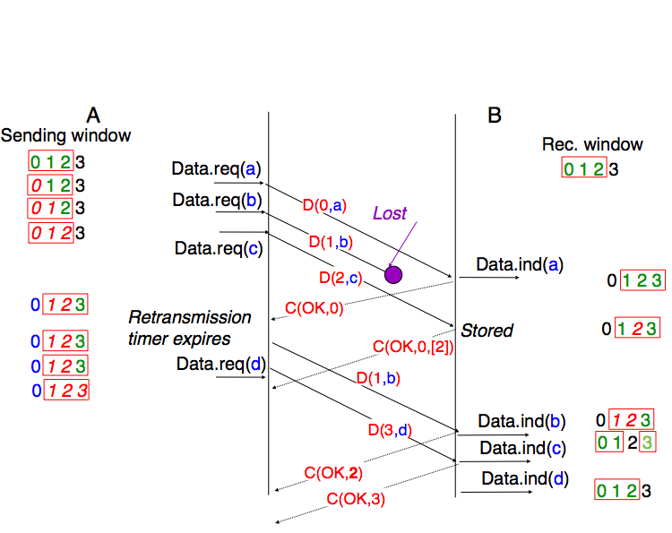
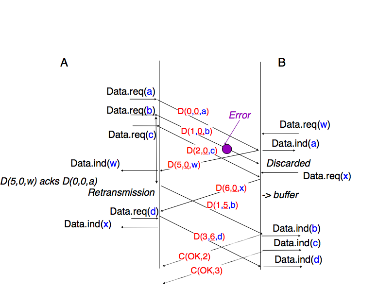

.. Copyright |copy| 2013 by Olivier Bonaventure
.. Some portions of this text come from the first edition of this ebook
.. This file is licensed under a `creative commons licence <http://creativecommons.org/licenses/by-sa/3.0/>`_

********************
Connecting two hosts
********************

.. index:: electrical cable, optical fiber, multimode optical fiber, monomode optical fiber 

.. warning:: 

   This is an unpolished draft of the second edition of this ebook. If you find any error or have suggestions to improve the text, please create an issue via https://github.com/obonaventure/cnp3/issues?milestone=1

The first step when building a network, even a worldwide network such as the Internet, is to connect two hosts together. This is illustrated in the figure below.

 .. figure:: figures/twohosts.png
    :align: center
    :scale: 70
   
    Connecting two hosts together

To enable the two hosts to exchange information, they need to be linked together by some kind of physical media. Computer networks have used various types of physical media to exchange information, notably :

 - `electrical cable`. Information can be transmitted over different types of electrical cables. The most common ones are the twisted pairs (that are used in the telephone network, but also in enterprise networks) and the coaxial cables (that are still used in cable TV networks, but are no longer used in enterprise networks). Some networking technologies operate over the classical electrical cable.
 - `optical fiber`. Optical fibers are frequently used in public and enterprise networks when the distance between the communication devices is larger than one kilometer. There are two main types of optical fibers : multimode and monomode. Multimode is much cheaper than monomode fiber because a LED can be used to send a signal over a multimode fiber while a monomode fiber must be driven by a laser. Due to the different modes of propagation of light, monomode fibers are limited to distances of a few kilometers while multimode fibers can be used over distances greater than several tens of kilometers. In both cases, repeaters can be used to regenerate the optical signal at one endpoint of a fiber to send it over another fiber. 
 - `wireless`. In this case, a radio signal is used to encode the information exchanged between the communicating devices. Many types of modulation techniques are used to send information over a wireless channel and there is lot of innovation in this field with new techniques appearing every year. While most wireless networks rely on radio signals, some use a laser that sends light pulses to a remote detector. These optical techniques allow to create point-to-point links while radio-based techniques, depending on the directionality of the antennas, can be used to build networks containing devices spread over a small geographical area.

The physical layer
==================

These physical media can be used to exchange information once this information has been converted into a suitable electrical signal. Entire telecommunication courses and textbooks are devoted to the problem of converting analog or digital information into an electrical signal so that it can be transmitted over a given physical `link`. In this book, we only consider two very simple schemes that allow to transmit information over an electrical cable. This enables us to highlight the key problems when transmitting 
information over a physical link. We are only interested in techniques that allow to transmit digital information through the wire and will focus on the transmission of bits, i.e. either `0` or `1`. 

.. note:: Bit rate

 In computer networks, the bit rate of the physical layer is always expressed in bits per second. One Mbps is one million bits per second and one Gbps is one billion bits per second. This is in contrast with memory specifications that are usually expressed in bytes (8 bits), KiloBytes ( 1024 bytes) or MegaBytes (1048576 bytes). Thus transferring one MByte through a 1 Mbps link lasts 8.39 seconds.

  ========        ===============
  Bit rate        Bits per second
  ========        ===============
  1 Kbps	  :math:`10^3`
  1 Mbps	  :math:`10^6`
  1 Gbps	  :math:`10^9`
  1 Tbps	  :math:`10^{12}`
  ========        ===============

To understand some of the principles behind the physical transmission of information, let us consider the simple case of an electrical wire that is used to transmit bits. Assume that the two communicating hosts want to transmit one thousand bits per second. To transmit these bits, the two hosts can agree on the following rules :

 - On the sender side :
    - set the voltage on the electrical wire at ``+5V`` during one millisecond to transmit a bit set to `1`
    - set the voltage on the electrical wire at ``-5V`` during one millisecond to transmit a bit set to `0`
   
 - On the receiver side :
    - every millisecond, record the voltage applied on the electrical wire. If the voltage is set to ``+5V``, record the reception of bit `1`. Otherwise, record the reception of bit `0`
  
.. index:: time-sequence diagram

This transmission scheme has been used in some early networks. We use it as a basis to understand how hosts communicate.  From a Computer Science viewpoint, dealing with voltages is unusual. Computer scientists frequently rely on models that enable them to reason about the issues that they face without having to consider all implementation details. The physical transmission scheme described above can be represented by using a `time-sequence diagram`.

A `time-sequence diagram` describes the interactions between communicating hosts. By convention, the communicating hosts are represented in the left and right parts of the diagram while the electrical link occupies the middle of the diagram. In such a time-sequence diagram, time flows from the top to the bottom of the diagram. The transmission of one bit of information is represented by three arrows. Starting from the left, the first horizontal arrow represents the request to transmit one bit of information. This request is represented by using a `primitive` which can be considered as a kind of procedure call. This primitive has one parameter (the bit being transmitted) and a name (`DATA.request` in this example). By convention, all primitives that are named `something.request` correspond to a request to transmit some information. The dashed arrow indicates the transmission of the corresponding electrical signal on the wire. Electrical and optical signals do not travel instantaneously. The diagonal dashed arrow indicates that it takes some time for the electrical signal to be transmitted from `Host A` to `Host B`. Upon reception of the electrical signal, the electronics on `Host B`'s network interface detects the voltage and converts it into a bit. This bit is delivered as a `DATA.indication` primitive. All primitives that are named `something.indication` correspond to the reception of some information. The dashed lines also represents the relationship between two (or more) primitives. Such a time-sequence diagram provides information about the ordering of the different primitives, but the distance between two primitives does not represent a precise amount of time.

  .. msc::

      a [label="", linecolour=white],
      b [label="Host A", linecolour=black],
      z [label="Physical link", linecolour=white],
      c [label="Host B", linecolour=black],
      d [label="", linecolour=white];

      a=>b [ label = "DATA.req(0)" ] ,
      b>>c [ label = "0", arcskip="1"];
      c=>d [ label = "DATA.ind(0)" ];

Time-sequence diagrams are usual when trying to understand the characteristics of a given communication scheme. When considering the above transmission scheme, is it useful to evaluate whether this scheme allows the two communicating hosts to reliably exchange information ? A digital transmission will be considered as reliable when a sequence of bits that is transmitted by a host is received correctly at the other end of the wire. In practice, achieving perfect reliability when transmitting information using the above scheme is difficult. Several problems can occur with such a transmission scheme.

The first problem is that electrical transmission can be affected by electromagnetic interferences. These interferences can have various sources including natural phenomenons like thunderstorms, variations of the magnetic field, but also can be caused by interference with other electrical signals such as interference from neighboring cables, interferences from neighboring antennas, ... Due to all these interferences, there is unfortunately no guarantee that when a host transmit one bit on a wire, the same bit is received at the other end. This is illustrated in the figure below where a `DATA.request(0)` on the left host leads to a `Data.indication(1)` on the right host. 

  .. msc::

      a [label="", linecolour=white],
      b [label="Host A", linecolour=black],
      z [label="Physical link", linecolour=white],
      c [label="Host B", linecolour=black],
      d [label="", linecolour=white];
      a=>b [ label = "DATA.req(0)" ] ,
      b>>c [ label = "", arcskip="1"];
      c=>d [ label = "DATA.ind(1)" ];

With the above transmission scheme, a bit is transmitted by setting the voltage on the electrical cable to a specific value during some period of time. We have seen that due to electromagnetic interferences, the voltage measured by the receiver can differ from the voltage set by the transmitter. This is the main cause of transmission errors. However, this is not the only type of problem that can occur. Besides defining the voltages for bits `0` and `1`, the above transmission scheme also specifies the duration of each bit. If one million bits are sent every second, then each bit lasts 1 microsecond. On each host, the transmission (resp. the reception) of each bit is triggered by a local clock having a 1 MHz frequency. These clocks are the second source of problems when transmitting bits over a wire. Although the two clocks have the same specification, they run on different hosts, possibly at a different temperature and with a different source of energy. In practice, it is possible that the two clocks do not operate at exactly the same frequency. Assume that the clock of the transmitting host operates at exactly 1000000 Hz while the receiving clock operates at 999999 Hz. This is a very small difference between the two clocks. However, when using the clock to transmit bits, this difference is important. With its 1000000 Hz clock, the transmitting host will generate one million bits during a period of one second. During the same period, the receiving host will sense the wire 999999 times and thus will receive one bit less than the bits originally transmitted. This small difference in clock frequencies implies that bits can "disappear" during their transmission on an electrical cable. This is illustrated in the figure below.

  .. msc::

      a [label="", linecolour=white],
      b [label="Host A", linecolour=black],
      z [label="Physical link", linecolour=white],
      c [label="Host B", linecolour=black],
      d [label="", linecolour=white];

      a=>b [ label = "DATA.req(0)" ] ,
      b>>c [ label = "", arcskip="1"];
      c=>d [ label = "DATA.ind(0)" ];

      a=>b [ label = "DATA.req(0)" ];

      a=>b [ label = "DATA.req(1)" ] ,
      b>>c [ label = "", arcskip="1"];
      c=>d [ label = "DATA.ind(1)" ];

A similar reasoning applies when the clock of the sending host is slower than the clock of the receiving host. In this case, the receiver will sense more bits than the bits that have been transmitted by the sender. This is illustrated in the figure below where the second bit received on the right was not transmitted by the left host.

  .. msc::

      a [label="", linecolour=white],
      b [label="Host A", linecolour=black],
      z [label="Physical link", linecolour=white],
      c [label="Host B", linecolour=black],
      d [label="", linecolour=white];

      a=>b [ label = "DATA.req(0)" ] ,
      b>>c [ label = "", arcskip=1];
      c=>d [ label = "DATA.ind(0)" ];

      c=>d [ label = "DATA.ind(0)" ];

      a=>b [ label = "DATA.req(1)" ] ,
      b>>c [ label = "", arcskip=1];
      c=>d [ label = "DATA.ind(1)" ];

From a Computer Science viewpoint, the physical transmission of information through a wire is often considered as a black box that allows to transmit bits. This black box is often referred to as the `physical layer service` and is represented by using the `DATA.request` and `DATA.indication` primitives introduced earlier. This physical layer service facilitates the sending and receiving of bits. This service abstracts the technological details that are involved in the actual transmission of the bits as an electromagnetic signal. However, it is important to remember that the `physical layer service` is imperfect and has the following characteristics :

 - the `Physical layer service` may change, e.g. due to electromagnetic interferences, the value of a bit being transmitted
 - the `Physical layer service` may deliver `more` bits to the receiver than the bits sent by the sender
 - the `Physical layer service` may deliver `fewer` bits to the receiver than the bits sent by the sender

.. index:: Manchester encoding

Many other types of encodings have been defined to transmit information over an electrical cable. All physical layers are able to send and receive physical symbols that represent values `0` and `1`. However, for various reasons that are outside the scope of this chapter, several physical layers exchange other physical symbols as well. For example, the Manchester encoding used in several physical layers can send four different symbols. The Manchester encoding is a differential encoding scheme in which time is divided into fixed-length periods. Each period is divided in two halves and two different voltage levels can  be applied. To send a symbol, the sender must set one of these two voltage levels during each half period. To send a `1` (resp. `0`), the sender must set a high (resp. low) voltage during the first half of the period and a low (resp. high) voltage during the second half. This encoding ensures that there will be a transition at the middle of each period and allows the receiver to synchronise its clock to the sender's clock. Apart from the encodings for `0` and `1`, the Manchester encoding also supports two additional symbols : `InvH` and `InvB`  where the same voltage level is used for the two half periods. By definition, these two symbols cannot appear inside a frame which is only composed of `0` and `1`. Some technologies use these special symbols as markers for the beginning or end of frames.

 .. figure:: ../../book/lan/png/lan-fig-006-c.png
    :align: center
    :scale: 70
   
    Manchester encoding

.. index:: Physical layer

.. figure:: ../../book/intro/svg/intro-figures-027-c.png
   :align: center
   :scale: 80

   The Physical layer

All the functions related to the physical transmission or information through a wire (or a wireless link) are usually known as the `physical layer`. The physical layer allows thus two or more entities that are directly attached to the same transmission medium to exchange bits. Being able to exchange bits is important as virtually any information can be encoded as a sequence of bits. Electrical engineers are used to processing streams of bits, but computer scientists usually prefer to deal with higher level concepts. A similar issue arises with file storage. Storage devices such as hard-disks also store streams of bits. There are hardware devices that process the bit stream produced by a hard-disk, but computer scientists have designed filesystems to allow applications to easily access such storage devices. These filesystems are typically divided into several layers as well. Hard-disks store sectors of 512 bytes or more. Unix filesystems group sectors in larger blocks that can contain data or `inodes` representing the structure of the filesystem. Finally, applications manipulate files and directories that are translated in blocks, sectors and eventually bits by the operating system.

.. index:: Datalink layer, frame

Computer networks use a similar approach. Each layer provides a service that is built above the underlying layer and is closer to the needs of the applications. The datalink layer builds upon the service provided by the physical layer. We will see that it also contains several functions.

The datalink layer
==================

.. index:: frame

Computer scientists are usually not interested in exchanging bits between two hosts. They prefer to write software that deals with larger blocks of data in order to transmit messages or complete files. Thanks to the physical layer service, it is possible to send a continuous stream of bits between two hosts. This stream of bits can include logical blocks of data, but we need to be able to extract each block of data from the bit stream despite the imperfections of the physical layer. In many networks, the basic unit of information exchanged between two directly connected hosts is often called a `frame`. A `frame` can be defined has a sequence of bits that has a particular syntax or structure. We will see examples of such frames later in this chapter. 

To enable the transmission/reception of frames, the first problem to be solved is how to encode a frame as a sequence of bits, so that the receiver can easily recover the received frame despite the limitations of the physical layer.

.. index:: framing

If the physical layer were perfect, the problem would be very simple. We would simply need to define how to encode each frame as a sequence of consecutive bits. The receiver would then easily be able to extract the frames from the received bits. Unfortunately, the imperfections of the physical layer make this framing problem slightly more complex. Several solutions have been proposed and are used in practice in different network technologies.

Framing
-------

The `framing` problem can be defined as : "`How does a sender encode frames so that the receiver can efficiently extract them from the stream of bits that it receives from the physical layer`". 

A first solution to this problem is to require the physical layer to remain idle for some time after the transmission of each frame. These idle periods can be detected by the receiver and serve as a marker to delineate frame boundaries. Unfortunately, this solution is not acceptable for two reasons. First, some physical layers cannot remain idle and always need to transmit bits. Second, inserting an idle period between frames decreases the maximum bit rate that can be achieved. 

.. note:: Bit rate and bandwidth

  Bit rate and bandwidth are often used to characterize the transmission capacity of the physical service. The original definition of `bandwidth <http://www.merriam-webster.com/dictionary/bandwidth>`_, as listed in the `Webster dictionary <http://www.merriam-webster.com/dictionary>`_ is `a range of radio frequencies which is occupied by a modulated carrier wave, which is assigned to a service, or over which a device can operate`. This definition corresponds to the characteristics of a given transmission medium or receiver. For example, the human ear is able to decode sounds in roughly the 0-20 KHz frequency range. By extension, bandwidth is also used to represent the capacity of a communication system in bits per second. For example, a Gigabit Ethernet link is theoretically capable of transporting one billion bits per second.

.. index:: bit stuffing, stuffing (bit)

Given that multi-symbol encodings cannot be used by all physical layers, a generic solution which can be used with any physical layer that is able to transmit and receive only bits `0` and `1` is required. This generic solution is called `stuffing` and two variants exist : `bit stuffing` and `character stuffing`. To enable a receiver to easily delineate the frame boundaries, these two techniques reserve special bit strings as frame boundary markers and encode the frames so that these special bit strings do not appear inside the frames.

`Bit stuffing` reserves the `01111110` bit string as the frame boundary marker and ensures that there will never be six consecutive `1` symbols transmitted by the physical layer inside a frame. With bit stuffing, a frame is sent as follows. First, the sender transmits the marker, i.e. `01111110`. Then, it sends all the bits of the frame and inserts an additional bit set to `0` after each sequence of five consecutive `1` bits. This ensures that the sent frame never contains a sequence of six consecutive bits set to `1`. As a consequence, the marker pattern cannot appear inside the frame sent. The marker is also sent to mark the end of the frame. The receiver performs the opposite to decode a received frame. It first detects the beginning of the frame thanks to the `01111110` marker. Then, it processes the received bits and counts the number of consecutive bits set to `1`. If a `0` follows five consecutive bits set to `1`, this bit is removed since it was inserted by the sender. If a `1` follows five consecutive bits sets to `1`, it indicates a marker if it is followed by a bit set to `0`. The table below illustrates the application of bit stuffing to some frames.

 ===========================   =============================================
 Original frame	      	       Transmitted frame
 ===========================   =============================================
 0001001001001001001000011     01111110000100100100100100100001101111110
 0110111111111111111110010     01111110011011111011111011111011001001111110
 01111110		       0111111001111101001111110
 ===========================   =============================================
 

For example, consider the transmission of `0110111111111111111110010`. The sender will first send the `01111110` marker followed by `011011111`. After these five consecutive bits set to `1`, it inserts a bit set to `0` followed by `11111`. A new `0` is inserted, followed by `11111`. A new `0` is inserted followed by the end of the frame `110010` and the `01111110` marker.

`Bit stuffing` increases the number of bits required to transmit each frame. The worst case for bit stuffing is of course a long sequence of bits set to `1` inside the frame. If transmission errors occur, stuffed bits or markers can be in error. In these cases, the frame affected by the error and possibly the next frame will not be correctly decoded by the receiver, but it will be able to resynchronize itself at the next valid marker. 

.. index:: character stuffing, stuffing (character)

`Bit stuffing` can be easily implemented in hardware. However, implementing it in software is difficult given the complexity of performing bit manipulations in software. Software implementations prefer to process characters than bits, software-based datalink layers usually use `character stuffing`. This technique operates on frames that contain an integer number of characters. In computer networks, characters are usually encoded by relying on the :term:`ASCII` table. This table defines the encoding of various alphanumeric characters as a sequence of bits. :rfc:`20` provides the ASCII table that is used by many protocols on the Internet. For example, the table defines the following binary representations :

 - `A` : `1000011` b 
 - `0` : `0110000` b
 - `z` : `1111010` b
 - `@` : `1000000` b
 - `space` : `0100000` b

In addition, the :term:`ASCII` table also defines several non-printable or control characters. These characters were designed to allow an application to control a printer or a terminal. These control characters include `CR` and `LF`, that are used to terminate a line, and the `BEL` character which causes the terminal to emit a sound.

 - `NUL`: `0000000` b
 - `BEL`: `0000111` b
 - `CR` : `0001101` b
 - `LF` : `0001010` b
 - `DLE`: `0010000` b
 - `STX`: `0000010` b
 - `ETX`: `0000011` b

Some characters are used as markers to delineate the frame boundaries. Many `character stuffing` techniques use the `DLE`, `STX` and `ETX` characters of the ASCII character set. `DLE STX` (resp. `DLE ETX`) is used to mark the beginning (end) of a frame. When transmitting a frame, the sender adds a `DLE` character after each transmitted `DLE` character. This ensures that none of the markers can appear inside the transmitted frame. The receiver detects the frame boundaries and removes the second `DLE` when it receives two consecutive `DLE` characters. For example, to transmit frame `1 2 3 DLE STX 4`, a sender will first send `DLE STX` as a marker, followed by `1 2 3 DLE`. Then, the sender transmits an additional `DLE` character followed by `STX 4` and the `DLE ETX` marker.

 ===========================================  ===============================================================
 Original frame	      	                      Transmitted frame
 ===========================================  ===============================================================
 **1** **2** **3** **4**		      `DLE STX` **1** **2** **3** **4** `DLE ETX`
 **1** **2** **3** **DLE** **STX** **4**      `DLE STX` **1** **2** **3** **DLE** `DLE` **STX** `4` `DLE ETX`
 **DLE STX DLE ETX**	                      `DLE STX` **DLE** `DLE` **STX** **DLE** `DLE` ETX** `DLE ETX`
 ===========================================  ===============================================================

`Character stuffing` , like bit stuffing, increases the length of the transmitted frames. For `character stuffing`, the worst frame is a frame containing many `DLE` characters. When transmission errors occur, the receiver may incorrectly decode one or two frames (e.g. if the errors occur in the markers). However, it will be able to resynchronise itself with the next correctly received markers.

Bit stuffing and character stuffing allow to recover frames from a stream of bits or bytes. This framing mechanism provides a richer service than the physical layer. Through the framing service, one can send and receive complete frames. This framing service can also be represented by using the `DATA.request` and `DATA.indication` primitives. This is illustrated in the figure below, assuming hypothetical frames containing four useful bit and one bit of framing for graphical reasons.

  .. msc::

      a [label="", linecolour=white],
      bf [label="Framing-A", linecolour=black],
      bp [label="Phys-A", linecolour=black],
      cp [label="Phys-B", linecolour=black],
      cf [label="Framing-B", linecolour=black],
      d [label="", linecolour=white];

      a=>bf [ label = "DATA.req(1...1)", textcolour=red ];
      bf=>bp [label="DATA.req(0)"],
      bp>>cp [label="0", arcskip=1];
      cp=>cf [label="DATA.ind(0)"];
      bf=>bp [label="DATA.req(1)"],
      bp>>cp [label="1", arcskip=1];
      cp=>cf [label="DATA.ind(1)"];
      ...;
      bf=>bp [label="DATA.req(1)"],
      bp>>cp [label="1", arcskip=1];
      cp=>cf [label="DATA.ind(1)"];
      bf=>bp [label="DATA.req(0)"],
      bp>>cp [label="0", arcskip=1];
      cp=>cf [label="DATA.ind(0)"];
      cf=>d [ label = "DATA.ind(1...1)", textcolour=red ];

We can now build upon the framing mechanism to allow the hosts to exchange frames containing an integer number of bits or bytes. Once the framing problem has been solved, we can focus on designing a technique that allows to reliably exchange frames. 

Recovering from transmission errors
-----------------------------------
 
In this section, we develop a reliable datalink protocol running above the physical layer service. To design this protocol, we first assume that the physical layer provides a perfect service. We will then develop solutions to recover from the transmission errors. 

.. Reliable data transfer above a perfect physical service
.. ^^^^^^^^^^^^^^^^^^^^^^^^^^^^^^^^^^^^^^^^^^^^^^^^^^^^^^^

The datalink layer is designed to send and receive frames on behalf of a user. We model these interactions by using the `DATA.req` and `DATA.ind` primitives. However, to simplify the presentation and to avoid confusion between a `DATA.req` primitive issued by the user of the datalink layer entity, and a `DATA.req` issued by the datalink layer entity itself, we will use the following terminology :

 - the interactions between the user and the datalink layer entity are represented by using the classical `DATA.req` and the `DATA.ind` primitives
 - the interactions between the datalink layer entity and the framing sublayer are represented by using `send` instead of `DATA.req` and `recvd` instead of `DATA.ind`
 
When running on top of a perfect framing sublayer, a datalink entity can simply issue a `send(SDU)` upon arrival of a `DATA.req(SDU)` [#fsdu]_ .Similarly, the receiver issues a `DATA.ind(SDU)` upon receipt of a `recvd(SDU)`. Such a simple protocol is sufficient when a single SDU is sent. This is illustrated in the figure below.

  .. msc::

      a [label="", linecolour=white],
      b [label="Host A", linecolour=black],
      z [label="", linecolour=white],
      c [label="Host B", linecolour=black],
      d [label="", linecolour=white];

      a=>b [ label = "DATA.req(SDU)" ] ,
      b>>c [ label = "Frame(SDU)", arcskip="1"];
      c=>d [ label = "DATA.ind(SDU)" ];

.. .. figure:: ../../book/transport/svg/transport-fig-004.png
   :align: center
   :scale: 70 

   The simplest reliable protocol

Unfortunately, this is not always sufficient to ensure a reliable delivery of the SDUs. Consider the case where a client sends tens of SDUs to a server. If the server is faster that the client, it will be able to receive and process all the segments sent by the client and deliver their content to its user. However, if the server is slower than the client, problems may arise. The datalink entity contains buffers to store SDUs that have been received as a `Data.request` but have not yet been sent. If the application is faster than the physical link, the buffer may become full. At this point, the operating system suspends the application to let the datalink entity empty its transmission queue. The datalink entity also uses a buffer to store the received frames that have not yet been processed by the application. If the application is slow to process the data, this buffer may overflow and the datalink entity will not able to accept any additional frame. The buffers of the datalink entity have a limited size and if they overflow, the arriving frames will be discarded, even if they are correct.

To solve this problem, a reliable protocol must include a feedback mechanism that allows the receiver to inform the sender that it has processed a frame and that another one can be sent. This feedback is required even though there are no transmission errors. To include such a feedback, our reliable protocol must process two types of frames :

 - data frames carrying a SDU
 - control frames carrying an acknowledgment indicating that the previous frames was processed correctly

These two types of frames can be distinguished by dividing the frame in two parts :

 - the `header` that contains one bit set to `0` in data frames and set to `1` in control frames
 - the payload that contains the SDU supplied by the application

The datalink entity can then be modelled as a finite state machine, containing two states for the receiver and two states for the sender. The figure below provides a graphical representation of this state machine with the sender above and the receiver below.

..
  .. digraph:: sender
	rankdir=LR;
	node [shape = circle label="Wait\nfor\nSDU"] Wait_SDU; 
	node [shape = circle label="Wait\nfor\n\OK"] Wait_OK;
	Wait_SDU -> Wait_OK[label= <<TABLE BORDER="0" CELLBORDER="0">
                       <TR>
                          <TD>DATA.req(SDU)</TD>
                       </TR>
		       

                       <TR>
                          <TD>send(D(SDU))</TD>
                       </TR>
                    </TABLE>>];

..	Wait_OK -> Wait_SDU [label=<recvd(C(OK)) ======= >]; 

..
 .. digraph:: receiver
	rankdir=LR;
	node [shape=circle label=<Wait for frame>] Wait_frame; 
	node [shape=circle label=<Process SDU>] Process_SDU;
	Process_SDU -> Wait_frame [label= <<TABLE BORDER="0" CELLBORDER="0">
                       <TR>
                          <TD>recvd(D(SDU))</TD>
                       </TR>
		       

                       <TR>
                          <TD>Data.ind(SDU)</TD>
                       </TR>
                    </TABLE>>];
	Wait_frame -> Process_SDU -> [label= <<TABLE BORDER="0" CELLBORDER="0">
                       <TR>
                          <TD> </TD>
                       </TR>
		       

                       <TR>
                          <TD>send(C(OK))</TD>
                       </TR>
                    </TABLE>>];

.. / send(C(OK))>]; 

..	Wait_frame -> Process_SDU [label=<
..	recvd(D(SDU))
..	 ========= 
..	DATA.ind(SDU)
..	>]; 

.. figure:: ../../book/transport/png/transport-fig-008-c.png
   :align: center
   :scale: 60 

   Finite state machine of the simplest reliable protocol

The above FSM shows that the sender has to wait for an acknowledgement from the receiver before being able to transmit the next SDU.  The figure below illustrates the exchange of a few frames between two hosts.

  .. msc::

      a [label="", linecolour=white],
      b [label="Host A", linecolour=black],
      z [label="", linecolour=white],
      c [label="Host B", linecolour=black],
      d [label="", linecolour=white];

      a=>b [ label = "DATA.req(a)"], b>>c [ label = "D(a)", arcskip="1"];
      c=>d [ label = "DATA.ind(a)" ],c>>b [label= "C(OK)", arcskip="1"];
      |||;
      a=>b [ label = "DATA.req(b)" ], b>>c [ label = "D(b)",arcskip="1"];
      c=>d [ label = "DATA.ind(b)" ], c>>b [label= "C(OK)", arcskip="1"];
      |||;

.. note:: Services and protocols

  An important aspect to understand before studying computer networks is the difference between a *service* and a *protocol*. In order to understand the difference between the two, it is useful to start with real world examples. The traditional Post provides a service where a postman delivers letters to recipients. The Post defines precisely which types of letters (size, weight, etc) can be delivered by using the Standard Mail service. Furthermore, the format of the envelope is specified (position of the sender and recipient addresses, position of the stamp). Someone who wants to send a letter must either place the letter at a Post Office or inside one of the dedicated mailboxes. The letter will then be collected and delivered to its final recipient. Note that for the regular service the Post usually does not guarantee the delivery of each particular letter, some letters may be lost, and some letters are delivered to the wrong mailbox. If a letter is important, then the sender can use the registered service to ensure that the letter will be delivered to its recipient. Some Post services also provide an acknowledged service or an express mail service that is faster than the regular service.

.. attention on the transmission errors that can occur in the physical layer. We first present techniques to detect transmission errors and later solutions to recover from these transmission errors.

.. The `Datalink layer` builds on the service provided by the underlying physical layer. The `Datalink layer` allows two hosts that are directly connected through the physical layer to exchange information. The unit of information exchanged between two entities in the `Datalink layer` is a frame. A frame is a finite sequence of bits. Some `Datalink layers` use variable-length frames while others only use fixed-length frames. Some `Datalink layers` provide a connection-oriented service while others provide a connectionless service. Some `Datalink layers` provide reliable delivery while others do not guarantee the correct delivery of the information.

.. An important point to note about the `Datalink layer` is that although the figure below indicates that two entities of the `Datalink layer` exchange frames directly, in reality this is slightly different. When the `Datalink layer` entity on the left needs to transmit a frame, it issues as many `Data.request` primitives to the underlying `physical layer` as there are bits in the frame. The physical layer will then convert the sequence of bits in an electromagnetic or optical signal that will be sent over the physical medium. The `physical layer` on the right hand side of the figure will decode the received signal, recover the bits and issue the corresponding `Data.indication` primitives to its `Datalink layer` entity. If there are no transmission errors, this entity will receive the frame sent earlier. 

.. The datalink layer uses the service provided by the physical layer. Although there are many different implementations of the physical layer from a technological perspective, they all provide a service that enables the datalink layer to send and receive bits between directly connected devices. The datalink layer receives packets from the network layer. Two datalink layer entities exchange `frames`. As explained in the previous chapter, most datalink layer technologies impose limitations on the size of the frames. Some technologies only impose a maximum frame size, others enforce both minimum and maximum frames sizes and finally some technologies only support a single frame size. In the latter case, the datalink layer will usually include an adaptation sublayer to allow the network layer to send and receive variable-length packets. This adaptation layer may include fragmentation and reassembly mechanisms.

.. alternating bit

Reliable data transfer on top of an imperfect link
--------------------------------------------------

The datalink layer must deal with the transmission errors. In practice, we mainly have to deal with two types of errors in the datalink layer : 

 - Frames can be corrupted by transmission errors 
 - Frames can be lost or unexpected frames can appear

A first glance, loosing frames might seem strange on single link. However, if we take framing into account, transmission errors can affect the frame delineation mechanism and make the frame unreadable. For the same reason, a receiver could receive two (likely invalid) frames after a sender has transmitted a single frame.

To deal with these types of imperfections, reliable protocols rely on different types of mechanisms. The first problem is transmission errors. Data transmission on a physical link can be affected by the following errors :

 - random isolated errors where the value of a single bit has been modified due to a transmission error
 - random burst errors where the values of `n` consecutive bits have been changed due to transmission errors
 - random bit creations and random bit removals where bits have been added or removed due to transmission errors

The only solution to protect against transmission errors is to add redundancy to the frames that are sent. `Information Theory` defines two mechanisms that can be used to transmit information over a transmission channel affected by random errors. These two mechanisms add redundancy to the transmitted information, to allow the receiver to detect or sometimes even correct transmission errors. A detailed discussion of these mechanisms is outside the scope of this chapter, but it is useful to consider a simple mechanism to understand its operation and its limitations.

.. `Information theory` defines `coding schemes`. There are different types of coding schemes, but let us focus on coding schemes that operate on binary strings. A coding scheme is a function that maps information encoded as a string of `m` bits into a string of `n` bits. The simplest coding scheme is the (even) parity coding. This coding scheme takes an `m` bits source string and produces an `m+1` bits coded string where the first `m` bits of the coded string are the bits of the source string and the last bit of the coded string is chosen such that the coded string will always contain an even number of bits set to `1`. For example :

.. - `1001` is encoded as `10010`
.. - `1101` is encoded as `11011`

.. This parity scheme has been used in some RAMs as well as to encode characters sent over a serial line. It is easy to show that this coding scheme allows the receiver to detect a single transmission error, but it cannot correct it. However, if two or more bits are in error, the receiver may not always be able to detect the error.

.. Some coding schemes allow the receiver to correct some transmission errors. For example, consider the coding scheme that encodes each source bit as follows :

..  - `1` is encoded as `111`
..  - `0` is encoded as `000`

.. For example, consider a sender that sends `111`. If there is one bit in error, the receiver could receive `011` or `101` or `110`. In these three cases, the receiver will decode the received bit pattern as a `1` since it contains a majority of bits set to `1`. If there are two bits in error, the receiver will not be able anymore to recover from the transmission error. 

.. This simple coding scheme forces the sender to transmit three bits for each source bit. However, it allows the receiver to correct single bit errors. More advanced coding systems that allow to recover from errors are used in several types of physical layers.

Besides framing, datalink layers also include mechanisms to detect and sometimes even recover from transmission errors. To allow a receiver to detect transmission errors, a sender must add some redundant information as an `error detection` code to the frame sent. This `error detection` code is computed by the sender on the frame that it transmits. When the receiver receives a frame with an error detection code, it recomputes it and verifies whether the received `error detection code` matches the computer `error detection code`. If they match, the frame is considered to be valid. Many error detection schemes exist and entire books have been written on the subject. A detailed discussion of these techniques is outside the scope of this book, and we will only discuss some examples to illustrate the key principles.

To understand `error detection codes`, let us consider two devices that exchange bit strings containing `N` bits. To allow the receiver to detect a transmission error, the sender converts each string of `N` bits into a string of `N+r` bits. Usually, the `r` redundant bits are added at the beginning or the end of the transmitted bit string, but some techniques interleave redundant bits with the original bits. An `error detection code` can be defined as a function that computes the `r` redundant bits corresponding to each string of `N` bits. The simplest error detection code is the parity bit. There are two types of parity schemes : even and odd parity. With the `even` (resp. `odd`) parity scheme, the redundant bit is chosen so that an even (resp. odd) number of bits are set to `1` in the transmitted bit string of `N+r` bits. The receiver can easily recompute the parity of each received bit string and discard the strings with an invalid parity. The parity scheme is often used when 7-bit characters are exchanged. In this case, the eighth bit is often a parity bit. The table below shows the parity bits that are computed for bit strings containing three bits. 

  ====================    ==========   	   ===========
  3 bits string		  Odd parity	   Even parity	 
  ====================    ==========	   ===========
  000	     		  1		   0
  001			  0		   1
  010			  0		   1
  100			  0		   1
  111			  0		   1
  110			  1		   0
  101			  1		   0
  011			  1		   0
  ====================    ==========       ===========

The parity bit allows a receiver to detect transmission errors that have affected a single bit among the transmitted `N+r` bits. If there are two or more bits in error, the receiver may not necessarily be able to detect the transmission error. More powerful error detection schemes have been defined. The Cyclical Redundancy Checks (CRC) are widely used in datalink layer protocols. An N-bits CRC can detect all transmission errors affecting a burst of less than N bits in the transmitted frame and all transmission errors that affect an odd number of bits. Additional details about CRCs may be found in [Williams1993]_.

It is also possible to design a code that allows the receiver to correct transmission errors. The simplest `error correction code` is the triple modular redundancy (TMR). To transmit a bit set to `1` (resp. `0`), the sender transmits `111` (resp. `000`). When there are no transmission errors, the receiver can decode `111` as `1`. If transmission errors have affected a single bit, the receiver performs majority voting as shown in the table below. This scheme allows the receiver to correct all transmission errors that affect a single bit. 

  ====================    =============
  Received bits           Decoded bit
  ====================    =============
	 000	     		0
	 001			0
	 010			0
	 100			0
	 111			1
	 110			1
	 101			1
	 011			1
  ====================    =============

Other more powerful error correction codes have been proposed and are used in some applications. The `Hamming Code <http://en.wikipedia.org/wiki/Hamming_code>`_ is a clever combination of parity bits that provides error detection and correction capabilities. 

Reliable protocols use error detection schemes, but none of the widely used reliable protocols rely on error correction schemes. To detect errors, a frame is usually divided into two parts :

 - a `header` that contains the fields used by the reliable protocol to ensure reliable delivery. The header contains a checksum or Cyclical Redundancy Check (CRC) [Williams1993]_ that is used to detect transmission errors
 - a `payload` that contains the user data 

Some headers also include a `length` field, which indicates the total length of the frame or the length of the payload. 

The simplest error detection scheme is the checksum. A checksum is basically an arithmetic sum of all the bytes that a frame is composed of. There are different types of checksums. For example, an eight bit checksum can be computed as the arithmetic sum of all the bytes of (both the header and trailer of) the frame. The checksum is computed by the sender before sending the frame and the receiver verifies the checksum upon frame reception. The receiver discards frames received with an invalid checksum. Checksums can be easily implemented in software, but their error detection capabilities are limited. Cyclical Redundancy Checks (CRC) have better error detection capabilities [SGP98]_, but require more CPU when implemented in software.

.. note:: Checksums, CRCs, ...

   Most of the protocols in the TCP/IP protocol suite rely on the simple Internet checksum in order to verify that a received packet has not been affected by transmission errors. Despite its popularity and ease of implementation, the Internet checksum is not the only available checksum mechanism. Cyclical Redundancy Checks (CRC_) are very powerful error detection schemes that are used notably on disks, by many datalink layer protocols and file formats such as zip or png. They can easily be implemented efficiently in hardware and have better error-detection capabilities than the Internet checksum [SGP98]_ . However, CRCs are sometimes considered to be too CPU-intensive for software implementations and other checksum mechanisms are preferred. The TCP/IP community chose the Internet checksum, the OSI community chose the Fletcher checksum [Sklower89]_ . Nowadays there are efficient techniques to quickly compute CRCs in software [Feldmeier95]_

.. , the SCTP protocol initially chose the Adler-32 checksum but replaced it recently with a CRC (see :rfc:`3309`).

.. CRC, checksum, fletcher, crc-32, Internet checksum
.. real checksum http://citeseerx.ist.psu.edu/viewdoc/summary?doi=10.1.1.55.8520
.. do not invent your own checksum, use existing ones
.. implementations can be optimised by using table lookups
.. crc : http://en.wikipedia.org/wiki/Cyclic_redundancy_check
.. tcp offload engine http://www.10gea.org/tcp-ip-offload-engine-toe.htm
.. stcp used Adler-32 but it now uses CRC :rfc:`3309`

.. The second imperfection of the network layer is that segments may be lost. As we will see later, the main cause of packet losses in the network layer is the lack of buffers in intermediate routers. 

Since the receiver sends an acknowledgement after having received each data frame, the simplest solution to deal with losses is to use a retransmission timer. When the sender sends a frame, it starts a retransmission timer. The value of this retransmission timer should be larger than the `round-trip-time`, i.e. the delay between the transmission of a data frame and the reception of the corresponding acknowledgement. When the retransmission timer expires, the sender assumes that the data segment has been lost and retransmits it. This is illustrated in the figure below.

.. msc::

      a [label="", linecolour=white],
      b [label="Host A", linecolour=black],
      z [label="", linecolour=white],
      c [label="Host B", linecolour=black],
      d [label="", linecolour=white];

      a=>b [ label = "DATA.req(a)\nstart timer" ] ,
      b>>c [ label = "D(a)", arcskip="1"];
      c=>d [ label = "DATA.ind(a)" ];
      c>>b [label= "C(OK)", arcskip="1"]; 
      b->a [linecolour=white, label="cancel timer"];
      |||;
      a=>b [ label = "DATA.req(b)\nstart timer" ] ,
      b-x c [ label = "D(b)", arcskip="1", linecolour=red];
      |||;
      a=>b [ linecolour=white, label = "timer expires" ] ,
      b>>c [ label = "D(b)", arcskip="1"];
      c=>d [ label = "DATA.ind(b)" ];
      c>>b [label= "C(OK)", arcskip="1"];
      |||;

Unfortunately, retransmission timers alone are not sufficient to recover from losses. Let us consider, as an example, the situation depicted below where an acknowledgement is lost. In this case, the sender retransmits the data segment that has not been acknowledged. Unfortunately, as illustrated in the figure below, the receiver considers the retransmission as a new segment whose payload must be delivered to its user.

.. msc::

      a [label="", linecolour=white],
      b [label="Host A", linecolour=black],
      z [label="", linecolour=white],
      c [label="Host B", linecolour=black],
      d [label="", linecolour=white];

      a=>b [ label = "DATA.req(a)\nstart timer" ] ,
      b>>c [ label = "D(a)", arcskip="1"];
      c=>d [ label = "DATA.ind(a)" ];
      c>>b [label= "C(OK)", arcskip="1"]; 
      b->a [linecolour=white, label="cancel timer"];
      |||;
      a=>b [ label = "DATA.req(b)\nstart timer" ] ,
      b>>c [ label = "D(b)", arcskip="1"];
      c=>d [ label = "DATA.ind(b)" ];
      c-x b [label= "C(OK)", linecolour=red, arcskip="1"]; 
      |||;
      a=>b [ linecolour=white, label = "timer expires" ] ,
      b>>c [ label = "D(b)", arcskip="1"];
      c=>d [ label = "DATA.ind(b) !!!!!", linecolour=red ];
      c>>b [label= "C(OK)", arcskip="1"];
      |||;

.. index:: sequence number

To solve this problem, datalink protocols associate a `sequence number` to each data frame. This `sequence number` is one of the fields found in the header of data frames. We use the notation `D(x,...)` to indicate a data frame whose sequence number field is set to value `x`. The acknowledgements also contain a sequence number indicating the data frames that it is acknowledging. We use `OKx` to indicate an acknowledgement frame that confirms the reception of `D(x,...)`. The sequence number is encoded as a bit string of fixed length. The simplest reliable protocol is the Alternating Bit Protocol (ABP). 

.. index:: Alternating Bit Protocol

The Alternating Bit Protocol uses a single bit to encode the sequence number. It can be implemented easily. The sender and the receiver only require a four-state Finite State Machine.

.. figure:: ../../book/transport/svg/transport-fig-021.png
   :align: center
   :scale: 80 

   Alternating bit protocol : Sender FSM

The initial state of the sender is `Wait for D(0,...)`. In this state, the sender waits for a `Data.request`. The first data frame that it sends uses sequence number `0`. After having sent this frame, the sender waits for an `OK0` acknowledgement. A frame is retransmitted upon expiration of the retransmission timer or if an acknowledgement with an incorrect sequence number has been received.

The receiver first waits for `D(0,...)`. If the frame contains a correct `CRC`, it passes the SDU to its user and sends `OK0`. If the frame contains an invalid CRC, it is immediately discarded. Then, the receiver waits for `D(1,...)`. In this state, it may receive a duplicate `D(0,...)` or a data frame with an invalid CRC. In both cases, it returns an `OK0` frame to allow the sender to recover from the possible loss of the previous `OK0` frame.

.. figure:: ../../book/transport/svg/transport-fig-022.png
   :align: center
   :scale: 70 

   Alternating bit protocol : Receiver FSM

.. note:: Dealing with corrupted frames

 The receiver FSM of the Alternating bit protocol discards all frames that contain an invalid CRC. This is the safest approach since the received frame can be completely different from the frame sent by the remote host. A receiver should not attempt at extracting information from a corrupted frame because it cannot know which portion of the frame has been affected by the error.

The figure below illustrates the operation of the alternating bit protocol.

.. msc::

      a [label="", linecolour=white],
      b [label="Host A", linecolour=black],
      z [label="", linecolour=white],
      c [label="Host B", linecolour=black],
      d [label="", linecolour=white];

      a=>b [ label = "DATA.req(a)\nstart timer" ] ,
      b>>c [ label = "D(0,a)", arcskip="1"];
      c=>d [ label = "DATA.ind(a)" ];
      c>>b [label= "C(OK0)", arcskip="1"]; 
      b->a [linecolour=white, label="cancel timer"];
      |||;
      a=>b [ label = "DATA.req(b)\nstart timer" ];
      b>>c [ label = "D(1,b)", arcskip="1"];
      c=>d [ label = "DATA.ind(b)" ];
      c>>b [label= "C(OK1)", arcskip="1"];
      b->a [linecolour=white, label="cancel timer"];
      |||;
      a=>b [ label = "DATA.req(c)\nstart timer" ] ,
      b>>c [ label = "D(0,c)", arcskip="1"];
      c=>d [ label = "DATA.ind(c)" ];
      c>>b [label= "C(OK0)", arcskip="1"];
      b->a [linecolour=white, label="cancel timer"];
      |||;

The Alternating Bit Protocol can recover from the losses of data or control frames. This is illustrated in the two figures below. The first figure shows the loss of one data segment.

.. msc::

      a [label="", linecolour=white],
      b [label="Host A", linecolour=black],
      z [label="", linecolour=white],
      c [label="Host B", linecolour=black],
      d [label="", linecolour=white];

      a=>b [ label = "DATA.req(a)\nstart timer" ] ,
      b>>c [ label = "D(0,a)", arcskip="1"];
      c=>d [ label = "DATA.ind(a)" ];
      c>>b [label= "C(OK0)", arcskip="1"]; 
      b->a [linecolour=white, label="cancel timer"];
      |||;
      a=>b [ label = "DATA.req(b)\nstart timer" ] ,
      b-x c [ label = "D(1,b)", arcskip="1", linecolour=red];
      |||;
      |||;
      a=>b [ linecolour=white, label = "timer expires" ] ,
      b>>c [ label = "D(1,b)", arcskip="1"];
      c=>d [ label = "DATA.ind(b)" ];
      c>>b [label= "C(OK1)", arcskip="1"];
      |||;

And the loss of one control frame.

.. msc::

      a [label="", linecolour=white],
      b [label="Host A", linecolour=black],
      z [label="", linecolour=white],
      c [label="Host B", linecolour=black],
      d [label="", linecolour=white];

      a=>b [ label = "DATA.req(a)\nstart timer" ] ,
      b>>c [ label = "D(0,a)", arcskip="1"];
      c=>d [ label = "DATA.ind(a)" ];
      c>>b [label= "C(OK0)", arcskip="1"];
      b->a [linecolour=white, label="cancel timer"];

      |||;
      a=>b [ label = "DATA.req(b)\nstart timer" ] ,
      b>>c [ label = "D(1,b)", arcskip="1"];
      c=>d [ label = "DATA.ind(b)" ];
      c-x b [label= "C(OK1)", linecolour=red, arcskip="1"]; 
      |||;
      a=>b [ linecolour=white, label = "timer expires" ] ,
      b>>c [ label = "D(1,b)", arcskip="1"];
      c=>d [ label = "Duplicate frame\nignored", textcolour=red, linecolour=white ];
      c>>b [label= "C(OK1)", arcskip="1"];
      |||;

.. 
   note:: Random errors versus malicious modifications
   The protocols of the transport layer are designed to recover from the random errors and losses that may occur in the underlying layers. There random errors are caused by 
   see [SPMR09]_ for how to recompute a CRC
   Checksums and CRCs should not be confused with hash functions such as MD5 defined in :rfc:`1321` or `SHA-1 <http://www.itl.nist.gov/fipspubs/fip180-1.htm>`_ .

The Alternating Bit Protocol can recover from transmission errors and frame losses. However, it has one important drawback. Consider two hosts that are directly connected by a 50 Kbits/sec satellite link that has a 250 milliseconds propagation delay. If these hosts send 1000 bits frames, then the maximum throughput that can be achieved by the alternating bit protocol is one frame every :math:`20+250+250=520` milliseconds if we ignore the transmission time of the acknowledgement. This is less than 2 Kbits/sec ! 

.. 
  figure:: ../../book/transport/png/transport-fig-024-c.png
  :align: center
  :scale: 70 
  Performance of the alternating bit protocol

Go-back-n and selective repeat
^^^^^^^^^^^^^^^^^^^^^^^^^^^^^^

To overcome the performance limitations of the alternating bit protocol, reliable protocols rely on `pipelining`. This technique allows a sender to transmit several consecutive frames without being forced to wait for an acknowledgement after each frame. Each data frame contains a sequence number encoded in an `n` bits field.

   Pipelining improves the performance of reliable protocols

`Pipelining` allows the sender to transmit frames at a higher rate. However this higher transmission rate may overload the receiver. In this case, the frames sent by the sender will not be correctly received by their final destination. The reliable protocols that rely on pipelining allow the sender to transmit `W` unacknowledged frames before being forced to wait for an acknowledgement from the receiving entity. 

This is implemented by using a `sliding window`. The sliding window is the set of consecutive sequence numbers that the sender can use when transmitting frames without being forced to wait for an acknowledgement. The figure below shows a sliding window containing five segments (`6,7,8,9` and `10`). Two of these sequence numbers (`6` and `7`) have been used to send frames and only three sequence numbers (`8`, `9` and `10`) remain in the sliding window. The sliding window is said to be closed once all sequence numbers contained in the sliding window have been used. 

   The sliding window 

The figure below illustrates the operation of the sliding window. It uses a sliding window of three frames. The sender can thus transmit three frames before being forced to wait for an acknowledgement. The sliding window moves to the higher sequence numbers upon the reception of each acknowledgement. When the first acknowledgement (`OK0`) is received, it allows the sender to move its sliding window to the right and sequence number `3` becomes available. This sequence number is used later to transmit the frame containing `d`.

   Sliding window example 

In practice, as the frame header includes an `n` bits field to encode the sequence number, only the sequence numbers between :math:`0` and :math:`2^{n}-1` can be used. This implies that, during a long transfer, the same sequence number will be used for different frames and the sliding window will wrap. This is illustrated in the figure below assuming that `2` bits are used to encode the sequence number in the frame header. Note that upon reception of `OK1`, the sender slides its window and can use sequence number `0` again.

.. figure:: figures/png/gbnwinex.png
   :align: center
   :scale: 70 

   Utilisation of the sliding window with modulo arithmetic

.. index:: go-back-n

Unfortunately, frame losses do not disappear because a reliable protocol uses a sliding window. To recover from losses, a sliding window protocol must define : 

 - a heuristic to detect frame losses 
 - a `retransmission strategy` to retransmit the lost frames

.. index:: cumulative acknowledgements

The simplest sliding window protocol uses the `go-back-n` recovery. Intuitively, `go-back-n` operates as follows. A `go-back-n` receiver is as simple as possible. It only accepts the frames that arrive in-sequence. A `go-back-n` receiver discards any out-of-sequence frame that it receives. When `go-back-n` receives a data frame, it always returns an acknowledgement containing the sequence number of the last in-sequence frame that it has received. This acknowledgement is said to be `cumulative`. When a `go-back-n` receiver sends an acknowledgement for sequence number `x`, it implicitly acknowledges the reception of all frames whose sequence number is earlier than `x`. A key advantage of these cumulative acknowledgements is that it is easy to recover from the loss of an acknowledgement. Consider for example a `go-back-n` receiver that received frames `1`, `2` and `3`. It sent `OK1`, `OK2` and `OK3`. Unfortunately, `OK1` and `OK2` were lost. Thanks to the cumulative acknowledgements, when the receiver receives `OK3`, it knows that all three frames have been correctly received. 

The figure below shows the FSM of a simple `go-back-n` receiver. This receiver uses two variables : `lastack` and `next`. `next` is the next expected sequence number and `lastack` the sequence number of the last data frame that has been acknowledged. The receiver only accepts the frame that are received in sequence. `maxseq` is the number of different sequence numbers (:math:`2^n`).

   Go-back-n : receiver FSM

A `go-back-n` sender is also very simple. It uses a sending buffer that can store an entire sliding window of frames [#fsizesliding]_ . The frames are sent with increasing sequence numbers (modulo `maxseq`). The sender must wait for an acknowledgement once its sending buffer is full. When a `go-back-n` sender receives an acknowledgement, it removes from the sending buffer all the acknowledged frames and uses a retransmission timer to detect frame losses. A simple `go-back-n` sender maintains one retransmission timer per connection. This timer is started when the first frame is sent. When the `go-back-n sender` receives an acknowledgement, it restarts the retransmission timer only if there are still unacknowledged frames in its sending buffer. When the retransmission timer expires, the `go-back-n` sender assumes that all the unacknowledged frames currently stored in its sending buffer have been lost. It thus retransmits all the unacknowledged frames in the buffer and restarts its retransmission timer.

   Go-back-n : sender FSM

The operation of `go-back-n` is illustrated in the figure below. In this figure, note that upon reception of the out-of-sequence frame `D(2,c)`, the receiver returns a cumulative acknowledgement `C(OK,0)` that acknowledges all the frames that have been received in sequence. The lost frame is retransmitted upon the expiration of the retransmission timer.

   Go-back-n : example

The main advantage of `go-back-n` is that it can be easily implemented, and it can also provide good performance when only a few frames are lost. However, when there are many losses, the performance of `go-back-n` quickly drops for two reasons :
 
 - the `go-back-n` receiver does not accept out-of-sequence frames
 - the `go-back-n` sender retransmits all unacknowledged frames once it has detected a loss

.. index:: selective repeat

`Selective repeat` is a better strategy to recover from losses. Intuitively, `selective repeat` allows the receiver to accept out-of-sequence frames. Furthermore, when a `selective repeat` sender detects losses, it only retransmits the frames that have been lost and not the frames that have already been correctly received.

A `selective repeat` receiver maintains a sliding window of `W` frames and stores in a buffer the out-of-sequence frames that it receives. The figure below shows a five-frame receive window on a receiver that has already received frames `7` and `9`.

   The receiving window with selective repeat 

A `selective repeat` receiver discards all frames having an invalid CRC, and maintains the variable `lastack` as the sequence number of the last in-sequence frame that it has received. The receiver always includes the value of `lastack` in the acknowledgements that it sends. Some protocols also allow the `selective repeat` receiver to acknowledge the out-of-sequence frames that it has received. This can be done for example by placing the list of the correctly received, but out-of-sequence frames in the acknowledgements together with the `lastack` value.

When a `selective repeat` receiver receives a data frame, it first verifies whether the frame is inside its receiving window. If yes, the frame is placed in the receive buffer. If not, the received frame is discarded and an acknowledgement containing `lastack` is sent to the sender. The receiver then removes all consecutive frames starting at `lastack` (if any) from the receive buffer. The payloads of these frames are delivered to the user, `lastack` and the receiving window are updated, and an acknowledgement acknowledging the last frame received in sequence is sent.

The `selective repeat` sender maintains a sending buffer that can store up to `W` unacknowledged frames. These frames are sent as long as the sending buffer is not full. Several implementations of a `selective repeat` sender are possible. A simple implementation associates one retransmission timer to each frame. The timer is started when the frame is sent and cancelled upon reception of an acknowledgement that covers this frame. When a retransmission timer expires, the corresponding frame is retransmitted and this retransmission timer is restarted. When an acknowledgement is received, all the frames that are covered by this acknowledgement are removed from the sending buffer and the sliding window is updated.

The figure below illustrates the operation of `selective repeat` when frames are lost. In this figure, `C(OK,x)` is used to indicate that all frames, up to and including sequence number `x` have been received correctly.

   Selective repeat : example 

.. index:: selective acknowledgements

Pure cumulative acknowledgements work well with the `go-back-n` strategy. However, with only cumulative acknowledgements a `selective repeat` sender cannot easily determine which frames have been correctly received after a data frame has been lost. For example, in the figure above, the second `C(OK,0)` does not inform explicitly the sender of the reception of `D(2,c)` and the sender could retransmit this frame although it has already been received. A possible solution to improve the performance of `selective repeat` is to provide additional information about the received frames in the acknowledgements that are returned by the receiver. For example, the receiver could add in the returned acknowledgement the list of the sequence numbers of all frames that have already been received. Such acknowledgements are sometimes called `selective acknowledgements`. This is illustrated in the figure above.

.. ..figure:: png/manque
      :align: center
      :scale: 70 

..   TODO : SACK Selective repeat : example 

In the figure above, when the sender receives `C(OK,0,[2])`, it knows that all frames up to and including `D(0,...)` have been correctly received. It also knows that frame `D(2,...)` has been received and can cancel the retransmission timer associated to this frame. However, this frame should not be removed from the sending buffer before the reception of a cumulative acknowledgement (`C(OK,2)` in the figure above) that covers this frame. 

.. note:: Maximum window size with `go-back-n` and `selective repeat`

 A reliable protocol that uses `n` bits to encode its sequence number can send up to :math:`2^n` successive frames. However, to ensure a reliable delivery of the frames, `go-back-n` and `selective repeat` cannot use a sending window of :math:`2^n` frames.
 Consider first `go-back-n` and assume that a sender sends :math:`2^n` frames. These frames are received in-sequence by the destination, but all the returned acknowledgements are lost. The sender will retransmit all frames. These frames will all be accepted by the receiver and delivered a second time to the user. It is easy to see that this problem can be avoided if the maximum size of the sending window is :math:`{2^n}-1` frames.
 A similar problem occurs with `selective repeat`. However, as the receiver accepts out-of-sequence frames, a sending window of :math:`{2^n}-1` frames is not sufficient to ensure a reliable delivery. It can be easily shown that to avoid this problem, a `selective repeat` sender cannot use a window that is larger than :math:`\frac{2^n}{2}` frames.

.. `Go-back-n` or `selective repeat` are used to provide a reliable data transfer above an unreliable physical layer service. Until now, we have assumed that the size of the sliding window was fixed for the entire lifetime of the connection. In practice a  layer entity is usually implemented in the operating system and shares memory with other parts of the system. Furthermore, a transport layer entity must support several (possibly hundreds or thousands) of transport connections at the same time. This implies that the memory which can be used to support the sending or the receiving buffer of a transport connection may change during the lifetime of the connection [#fautotune]_ . Thus, a transport protocol must allow the sender and the receiver to adjust their window sizes.

.. To deal with this issue, transport protocols allow the receiver to advertise the current size of its receiving window in all the acknowledgements that it sends. The receiving window advertised by the receiver bounds the size of the sending buffer used by the sender. In practice, the sender maintains two state variables : `swin`, the size of its sending window (that may be adjusted by the system) and `rwin`, the size of the receiving window advertised by the receiver. At any time, the number of unacknowledged segments cannot be larger than :math:`\min(swin,rwin)` [#facklost]_ . The utilisation of dynamic windows is illustrated in the figure below.

.. .. figure:: ../../book/transport/svg/transport-fig-039.png
     :align: center
     :scale: 90 

      Dynamic receiving window

.. The receiver may adjust its advertised receive window based on its current memory consumption, but also to limit the bandwidth used by the sender. In practice, the receive buffer can also shrink as the application may not able to process the received data quickly enough. In this case, the receive buffer may be completely full and the advertised receive window may shrink to `0`. When the sender receives an acknowledgement with a receive window set to `0`, it is blocked until it receives an acknowledgement with a positive receive window. Unfortunately, as shown in the figure below, the loss of this acknowledgement could cause a deadlock as the sender waits for an acknowledgement while the receiver is waiting for a data segment.

.. .. figure:: ../../book/transport/png/transport-fig-040-c.png
      :align: center
      :scale: 70 

      Risk of deadlock with dynamic windows

.. index:: persistence timer

.. To solve this problem, transport protocols rely on a special timer : the `persistence timer`. This timer is started by the sender whenever it receives an acknowledgement advertising a receive window set to `0`. When the timer expires, the sender retransmits an old segment in order to force the receiver to send a new acknowledgement, and hence send the current receive window size.

..
 ..  note:: Negative acknowledgements

.. To conclude our description of the basic mechanisms found in transport protocols, we still need to discuss the impact of segments arriving in the wrong order. If two consecutive segments are reordered, the receiver relies on their sequence numbers to reorder them in its receive buffer. Unfortunately, as transport protocols reuse the same sequence number for different segments, if a segment is delayed for a prolonged period of time, it might still be accepted by the receiver. This is illustrated in the figure below where segment `D(1,b)` is delayed.

..
 .. figure:: png/transport-fig-041-c.png
    :align: center
    :scale: 70 

    Ambiguities caused by excessive delays

.. index:: maximum segment lifetime (MSL)

.. To deal with this problem, transport protocols combine two solutions. First, they use 32 bits or more to encode the sequence number in the segment header. This increases the overhead, but also increases the delay between the transmission of two different segments having the same sequence number. Second, transport protocols require the network layer to enforce a `Maximum Segment Lifetime (MSL)`. The network layer must ensure that no packet remains in the network for more than MSL seconds. In the Internet the MSL is assumed [#fmsl]_ to be 2 minutes :rfc:`793`. Note that this limits the maximum bandwidth of a transport protocol. If it uses `n` bits to encode its sequence numbers, then it cannot send more than :math:`2^n` segments every MSL seconds.

.. index:: piggybacking

Reliable protocols often need to send data in both directions. To reduce the overhead caused by the acknowledgements, most reliable protocols use `piggybacking`. Thanks to this technique, a datalink entity can place the acknowledgements and the receive window that it advertises for the opposite direction of the data flow inside the header of the data frames that it sends. The main advantage of piggybacking is that it reduces the overhead as it is not necessary to send a complete frame to carry an acknowledgement. This is illustrated in the figure below where the acknowledgement number is underlined in the data frames. Piggybacking is only used when data flows in both directions. A receiver will generate a pure acknowledgement when it does not send data in the opposite direction as shown in the bottom of the figure.

   Piggybacking example

.. [#fsdu] SDU is the acronym of Service Data Unit. We use it as a generic term to represent the data that is transported by a protocol.

.. [#fsizesliding] The size of the sliding window can be either fixed for a given protocol or negotiated during the connection establishment phase. Some protocols allow to change the maximum window size during the data transfert. We will explain these techniques with real protocols later. 

.. .. [#fautotune] For a discussion on how the sending buffer can change, see e.g. [SMM1998]_

.. .. [#facklost] Note that if the receive window shrinks, it might happen that the sender has already sent a segment that is not anymore inside its window. This segment will be discarded by the receiver and the sender will retransmit it later.

.. .. [#fmsl] As we will see in the next chapter, the Internet does not strictly enforce this MSL. However, it is reasonable to expect that most packets on the Internet will not remain in the network during more than 2 minutes. There are a few exceptions to this rule, such as :rfc:`1149` whose implementation is described in http://www.blug.linux.no/rfc1149/ but there are few real links supporting :rfc:`1149` in the Internet.

.. include:: /links.rst

