.. Copyright |copy| 2013 by Olivier Bonaventure
.. This file is licensed under a `creative commons licence <http://creativecommons.org/licenses/by-sa/3.0/>`_

.. index:: congestion control, medium access control

******************
Sharing resources
******************

A network is designed to support a potentially large number of users that exchange information with each other. These users produce and consume information which is exchanged through the network. To support its users, a network uses several types of resources. It is important to keep in mind the different resources that are shared inside the network.

The first and more important resource inside a network is the link bandwidth. There are two situations where link bandwidth needs to be shared between different users. The first situation is when several hosts are attached to the same physical link. This situation mainly occurs in Local Area Networks (LAN). A LAN is a network that efficiently interconnects several hosts (usually a few dozens to a few hundreds) in the same room, building or campus. Consider for a example a network with five hosts. Any of these hosts needs to be able to exchange information with any of the other five hosts. A first organisation for this LAN is the full-mesh.

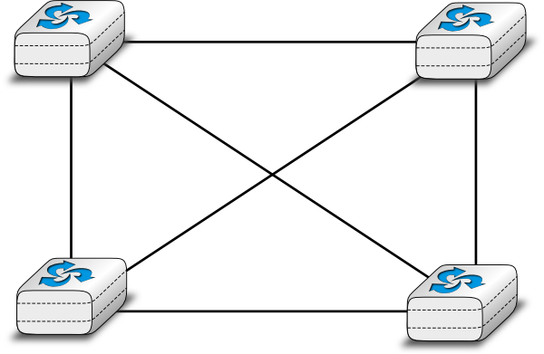

   A Full mesh network

The full-mesh is the most reliable and highest performing network to interconnect these five hosts. However, this network organisation has two important drawbacks. First, if a network contains `n` hosts, then :math:`\frac{n\times(n-1)}{2}` links are required. If the network contains more than a few hosts, it becomes impossible to lay down the required physical links. Second, if the network contains `n` hosts, then each host must have :math:`n-1` interfaces to terminante :math:`n-1` links. This is beyond the capabilities of most hosts. Furthermore, if a new host is added to the network, new links have to be laid down and one interface has to be added to each participating host. However, full-mesh has the advantage of providing the lowest delay between the hosts and the best resiliency against link failures. In practice, full-mesh networks are rarely used expected when there are few network nodes and resiliency is key.

The second possible physical organisation, which is also used inside computers to connect different extension cards, is the bus. In a bus network, all hosts are attached to a shared medium, usually a cable through a single interface. When one host sends an electrical signal on the bus, the signal is received by all hosts attached to the bus. A drawback of bus-based networks is that if the bus is physically cut, then the network is split into two isolated networks.  For this reason, bus-based networks are sometimes considered to be difficult to operate and maintain, especially when the cable is long and there are many places where it can break. Such a bus-based topology was used in early Ethernet networks. 

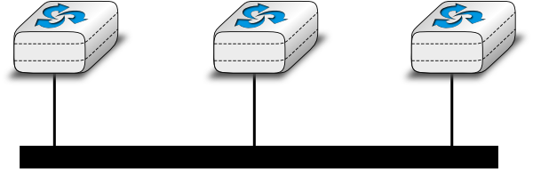

   A network organized as a Bus

A third organisation of a computer network is a star topology. In such topologies, hosts have a single physical interface and there is one physical link between each host and the center of the star. The node at the center of the star can be either a piece of equipment that amplifies an electrical signal, or an active device, such as a piece of equipment that understands the format of the messages exchanged through the network. Of course, the failure of the central node implies the failure of the network. However, if one physical link fails (e.g. because the cable has been cut), then only one node is disconnected from the network. In practice, star-shaped networks are easier to operate and maintain than bus-shaped networks. Many network administrators also appreciate the fact that they can control the network from a central point. Administered from a Web interface, or through a console-like connection, the center of the star is a useful point of control (enabling or disabling devices) and an excellent observation point (usage statistics).

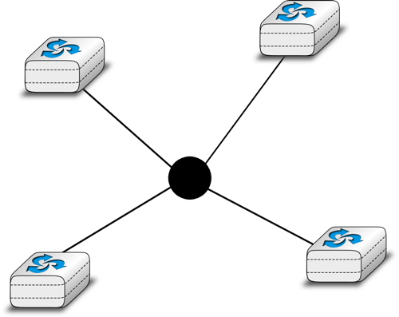

   A network organised as a Star

A fourth physical organisation of a network is the ring topology. Like the bus organisation, each host has a single physical interface connecting it to the ring. Any signal sent by a host on the ring will be received by all hosts attached to the ring. From a redundancy point of view, a single ring is not the best solution, as the signal only travels in one direction on the ring; thus if one of the links composing the ring is cut, the entire network fails. In practice, such rings have been used in local area networks, but are now often replaced by star-shaped networks. In metropolitan networks, rings are often used to interconnect multiple locations. In this case, two parallel links, composed of different cables, are often used for redundancy. With such a dual ring, when one ring fails all the traffic can be quickly switched to the other ring.

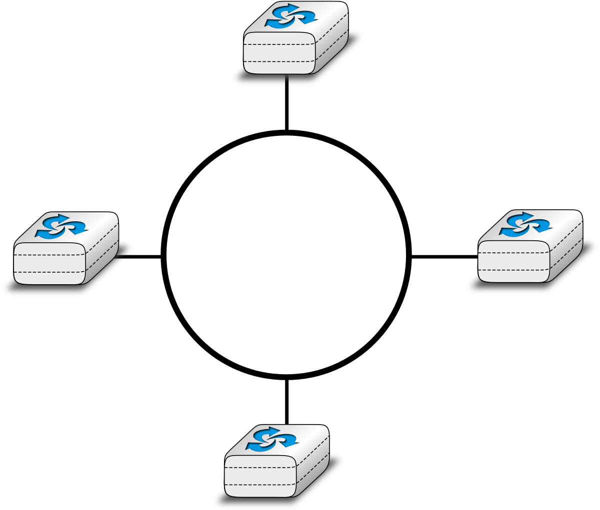

   A network organised as a ring

A fifth physical organisation of a network is the tree. Such networks are typically used when a large number of customers must be connected in a very cost-effective manner. Cable TV networks are often organised as trees.

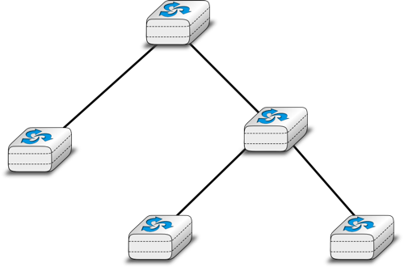

   A network organized as a Tree

Sharing bandwidth
=================
   
In all these networks, except the full-mesh, the link bandwidth is shared among all connected hosts. Various algorithms have been proposed and are used to efficiently share the access to this resource. We explain several of them in the Medium Access Control section below.

.. note:: Fairness in computer networks

 Sharing resources is important to ensure that the network efficiently serves its user. In practice, there are many ways to share resources. Some resource sharing schemes consider that some users are more important than others and should obtain more resources. For example, on the highways, police cars and ambulances have priority to use the highways. In some cities, traffic lanes are reserved for buses to promote public services, ... In computer networks, the same problem arise. Given that resources are limited, the network needs to enable users to efficiently share them. Before designing an efficient resource sharing scheme, one needs to first formalize its objectives. In computer networks, the most popular objective for resource sharing schemes is that they must be `fair`. In a simple situation, for example two hosts using a shared 2 Mbps link, the sharing scheme should allocate the same bandwidth to each user, in this case 1 Mbps. However, in a large networks, simply dividing the available resources by the number of users is not sufficient. Consider the network shown in the figure below where `A1` sends data to `A2`, `B1` to `B2`, ... In this network, how should we divide the bandwidth among the different flows ? A first approach would be to allocate the same bandwidth to each flow. In this case, each flow would obtain 5 Mbps and the link between `R2` and `R3` would not be fully loaded. Another approach would be to allocate 10 Mbps to `A1-A2`, 20 Mbps to `C1-C2` and nothing to `B1-B2`. This is clearly unfair. 

   .. graphviz::

      graph foo {
       rankdir="LR";
       A1 [color=white, shape=box label=<<TABLE border="0" cellborder="0">
                       <TR><TD width="45" height="60" fixedsize="true"></TD></TR><TR><td>A1</td></TR>
              </TABLE>>];
       A2 [color=white, shape=box label=<<TABLE border="0" cellborder="0">
                       <TR><TD width="45" height="60" fixedsize="true"></TD></TR><TR><td>A2</td></TR>
              </TABLE>>];
       B1 [color=white, shape=box label=<<TABLE border="0" cellborder="0">
                       <TR><TD width="45" height="60" fixedsize="true"></TD></TR><TR><td>B1</td></TR>
              </TABLE>>];
       B2 [color=white, shape=box label=<<TABLE border="0" cellborder="0">
                       <TR><TD width="45" height="60" fixedsize="true"></TD></TR><TR><td>B2</td></TR>
              </TABLE>>];
       C1 [color=white, shape=box label=<<TABLE border="0" cellborder="0">
                       <TR><TD width="45" height="60" fixedsize="true"></TD></TR><TR><td>C1</td></TR>
              </TABLE>>];
       C2 [color=white, shape=box label=<<TABLE border="0" cellborder="0">
                       <TR><TD width="45" height="60" fixedsize="true"></TD></TR><TR><td>C2</td></TR>
              </TABLE>>];
       R1[shape=box, color=white, label=<<TABLE border="0" cellborder="0">
                       <TR><TD width="75" height="30" fixedsize="true"></TD></TR><TR><td>R1</td></TR>
              </TABLE>>];
       R2[color=white, label=<<TABLE border="0" cellborder="0">
                       <TR><TD width="75" height="30" fixedsize="true"></TD></TR><TR><td>R2</td></TR>
              </TABLE>>];
       R3[color=white, label=<<TABLE border="0" cellborder="0">
                       <TR><TD width="75" height="30" fixedsize="true"></TD></TR><TR><td>R3</td></TR>
              </TABLE>>];
       A1--R1 ;
       B1--R1;
       R1--R2 [label="10 Mbps"];
       C1--R2;
       A2--R2;
       R2--R3 [label="20 Mbps"];
       C2--R3;
       B2--R3;
      }

 .. index:: max-min fairness

 In large networks, fairness is always a compromise. The most widely used definition of fairness is the `max-min fairness`. A bandwidth allocation in a network is said to be `max-min fair` if it is such that it is impossible to allocate more bandwidth to one of the flows without reducing the bandwidth of a flow that already has a smaller allocation than the flow that we want to increase. If the network is completely known, it is possible to derive a `max-min fair` allocation as follows. Initially, all flows have a null bandwidth and they are placed in the candidate set. The bandwidth allocation of all flows in the candidate set is increased until one link becomes congested. At this point, the flows that use the congested link have reached their maximum allocation. They are removed from the candidate set and the process continues until the candidate set becomes empty.

 In the above network, the allocation of all flows would grow until `A1-A2` and `B1-B2` reach 5 Mbps. At this point, link `R1-R2` becomes congested and these two flows have reached their maximum. The allocation for flow `C1-C2` can increase until reaching 15 Mbps. At this point, link `R2-R3` is congested. To increase the bandwidth allocated to `C1-C2`, one would need to reduce the allocation to flow `B1-B2`. Similarly, the only way to increase the allocation to flow `B1-B2` would require a decrease of the allocation to `A1-A2`.  

Network congestion
==================

Sharing bandwidth among the hosts directly attached to a link is not the only sharing problem that occurs in computer networks. To understand the general problem, let us consider a very simple network which contains only point-to-point links. This network contains three hosts and two network nodes. All links inside the network have the same capacity. For example, let us assume that all links have a bandwidth of 1000 bits per second and that the hosts send packets containing exactly one thousand bits. 

.. graphviz::

   graph foo {
      rankdir=LR;
      A [color=white, shape=box label=<<TABLE border="0" cellborder="0">
                       <TR><TD width="45" height="60" fixedsize="true"></TD></TR><TR><td>A</td></TR>
              </TABLE>>];
      B [color=white, shape=box label=<<TABLE border="0" cellborder="0">
                       <TR><TD width="45" height="60" fixedsize="true"></TD></TR><TR><td>B</td></TR>
              </TABLE>>];
      C [color=white, shape=box label=<<TABLE border="0" cellborder="0">
                       <TR><TD width="45" height="60" fixedsize="true"></TD></TR><TR><td>C</td></TR>
              </TABLE>>];
      R1[shape=box, color=white, label=<<TABLE border="0" cellborder="0">
                       <TR><TD width="75" height="30" fixedsize="true"></TD></TR><TR><td>R1</td></TR>
              </TABLE>>];
       R2[color=white, label=<<TABLE border="0" cellborder="0">
                       <TR><TD width="75" height="30" fixedsize="true"></TD></TR><TR><td>R2</td></TR>
              </TABLE>>];
      A--R1 ;
      B--R1;
      R1--R2 [];
      R2--C [];
   }

 
In the network above, consider the case where host `A` is transmitting packets to destination `C`. `A` can send one packet per second and its packets will be delivered to `C`. Now, let us explore what happens when host `B` also starts to transmit a packet. Node `R1` will receive two packets that must be forwarded to `R2`. Unfortunately, due to the limited bandwidth on the `R1-R2` link, only one of these two packets can be transmitted. The outcome of the second packet will depend on the available buffers on `R1`. If `R1` has one available buffer, it could store the packet that has not been transmitted on the `R1-R2` link until the link becomes available. If `R1` does not have available buffers, then the packet needs to be discarded. 

.. index:: network congestion

Besides the link bandwidth, the buffers on the network nodes are the second type of resource that needs to be shared inside the network. The node buffers play an important role in the operation of the network because that can be used to absorb transient traffic peaks. Consider again the example above. Assume that one average host `A` and host `B` send a group of three packets every ten seconds. Their combined transmission rate (0.6 packets per second) is, on average, lower than the network capacity (1 packet per second). However, if they both start to transmit at the same time, node `R1` will have to absorb a burst of packets. This burst of packets is a small `network congestion`. We will say that a network is congested, when the sum of the traffic demand from the hosts is larger than the network capacity :math:`\sum{demand}>capacity`. This `network congestion` problem is one of the most difficult resource sharing problem in computer networks. `Congestion` occurs in almost all networks. Minimizing the amount of congestion is a key objective for many network operators. In most cases, they will have to accept transient congestion, i.e. congestion lasting a few seconds or perhaps minutes, but will want to prevent congestion that lasts days or months. For this, they can rely on a wide range of solutions. We briefly present some of these in the paragraphs below.

.. todo:: provide references to congestion books

.. index:: congestion collapse

If `R1` has enough buffers, it will be able to absorb the load without having to discard packets. The packets sent by hosts `A` and `B` will reach their final destination `C`, but will experience a longer delay than when they are transmitting alone. The amount of buffering on the network node is the first paper that a network operator can tune to control congestion inside his network. Given the decreasing cost of memory, one could be tempted to put as many buffers [#fbufferbloat]_ as possible on the network nodes. Let us consider this case in the network above and assume that `R1` has infinite buffers. Assume now that hosts `A` and `B` try to transmit a file that corresponds to one thousand packets each. Both are using a reliable protocol that relies on go-back-n to recover from transmission errors. The transmission starts and packets start to accumulate in `R1`'s buffers. These presence of these packets in the buffers increases the delay between the transmission of a packet by `A` and the return of the corresponding acknowledgement. Given the increasing delay, host `A` (and `B` as well) will consider that some of the packets that it sent have been lost. These packets will be retransmitted and will enter the buffers of `R1`. The occupancy of the buffers of `R1` will continue to increase and the delays as well. This will cause new retransmissions, ... In the end, several copies of the same packet will be transmitted over the `R1-R2`, but only one file will be delivered (very slowly) to the destination. This is known as the `congestion collapse` problem :rfc:`896`. Congestion collapse is the nightmare for network operators. When it happens, the network carries packets without delivering useful data to the end users.

.. note:: Congestion collapse on the Internet

 Congestion collapse is unfortunately not only an academic experience. Van Jacobson reports in [Jacobson1988]_ one of these events that affected him while he was working at the Lawrence Berkeley Laboratory (LBL). LBL was two network nodes away from the University of California in Berkeley. At that time, the link between the two sites had a bandwidth of 32 Kbps, but some hosts were already attached to 10 Mbps LANs. "In October 1986,  the data throughput from LBL to UC Berkeley ... dropped from 32 Kbps to 40 bps. We were fascinated by this sudden factor-of-thousand drop in bandwidth and embarked on an investigation of why things had gotten so bad." This work lead to the development of various congestion control techniques that have allowed the Internet to continue to grow without experiencing widespread congestion collapse events. 

Besides bandwidth and memory, a third resource that needs to be shared inside a network is the (packet) processing capacity. To forward a packet, a network node needs bandwidth on the outgoing link, but it also needs to analyze the packet header to perform a lookup inside its forwarding table. Performing these lookup operations require resources such as CPU cycles or memory accesses. Network nodes are usually designed to be able to sustain a given packet processing rate, measured in packets per second. 

.. note:: Packets per second versus bits per second

 The performance of network nodes can be characterized by two key metrics :
 
   - the node's capacity measured in bits per second
   - the node's lookup performance measured in packets per second

 The node's capacity in bits per second mainly depends on the physical interfaces that it uses and also on the capacity of the internal interconnection (bus, crossbar switch, ...) between the different interfaces inside the node. Many vendors, in particular for low-end devices will use the sum of the bandwidth of the nodes' interfaces as the node capacity in bits per second. Measurements do not always match this maximum theoretical capacity. A well designed network node will usually have a capacity in bits per second larger than the sum of its link capacities. Such nodes will usually reach this maximum capacity when forwarding large packets. 

 When a network node forwards small packets, its performance is usually limited by the number of lookup operations that it can perform every second. This lookup performance is measured in packets per second. The performance may depend on the length of the forwarded packets. The key performance factor is the number of minimal size packets that are forwarded by the node every second. This rate can lead to a capacity in bits per second which is much lower than the sum of the bandwidth of the node's links.

.. add something on bisection bandwidth ?
.. http://courses.cs.washington.edu/courses/csep524/99wi/lectures/lecture7/sld006.htm

Let us now try to present a broad overview of the congestion problem in networks. We will assume that the network is composed of dedicated links having a fixed bandwidth [#fadjust]_. A network contains hosts that generate and receive packets and nodes that forward packets. Assuming that each host is connected via a single link to the network, the largest demand is :math:`\sum{Access Links}`. In practice, this largest demand is never reached and the network will be engineered to sustain a much lower traffic demand. The difference between the worst-case traffic demand and the sustainable traffic demand can be large, up to several orders of magnitude. Fortunately, the hosts are not completely dumb and they can adapt their traffic demand to the current state of the network and the available bandwidth. For this, the hosts need to `sense` the current level of congestion and adjust their own traffic demand based on the estimated congestion. Network nodes can react in different ways to network congestion and hosts can sense the level of congestion in different ways.

Let us first explore which mechanisms can be used inside a network to control congestion and how these mechanisms can influence the behavior of the end hosts.

As explained earlier, one of the first manifestation of congestion on network nodes is the saturation of the network links that leads to a growth in the occupancy of the buffers of the node. This growth of the buffer occupancy implies that some packets will spend more time in the buffer and thus in the network. If hosts measure the network delays (e.g. by measuring the round-trip-time between the transmission of a packet and the return of the corresponding acknowledgement) they could start to sense congestion. On low bandwidth links, a growth in the buffer occupancy can lead to an increase of the delays which can be easily measured by the end hosts. On high bandwidth links, a few packets inside the buffer will cause a small variation in the delay which may not necessarily be larger that the natural fluctuations of the delay measurements. 

If the buffer's occupancy continues to grow, it will overflow and packets will need to be discarded. Discarding packets during congestion is the second possible reaction of a network node to congestion. Before looking at how a node can discard packets, it is interesting to discuss qualitatively the impact of the buffer occupancy on the reliable delivery of data through a network. This is illustrated by the figure below, adapted from [Jain1990]_. 

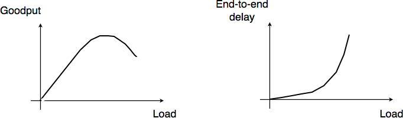

   Network congestion

When the network load is low, buffer occupancy and link utilizations are low. The buffers on the network nodes are mainly used to absorb very short bursts of packets, but on average the traffic demand is lower than the network capacity. If the demand increases, the average buffer occupancy will increase as well. Measurements have shown that the total throughput increases as well. If the buffer occupancy is zero or very low, transmission opportunities on network links can be missed. This is not the case when the buffer occupancy is small but non zero. However, if the buffer occupancy continues to increase, the buffer becomes overloaded and the throughput does not increase anymore. When the buffer occupancy is close to the maximum, the throughput may decrease. This drop in throughput can be caused by excessive retransmissions of reliable protocols that incorrectly assume that previously sent packets have been lost while they are still waiting in the buffer. The network delay on the other hand increases with the buffer occupancy. In practice, a good operating point for a network buffer is a low occupancy to achieve high link utilization and also low delay for interactive applications. 

.. index:: packet discard mechanism

Discarding packets is one of the signals that the network nodes can use to inform the hosts of the current level of congestion. Buffers on network nodes are usually used as FIFO queues to preserve packet ordering. Several `packet discard mechanisms` have been proposed for network nodes. These techniques basically answer two different questions :

 - `What triggers a packet to be discarded ?` What are the conditions that lead a network node to decide to discard a packet. The simplest answer to this question is : `When the buffer is full`. Although this is a good congestion indication, it is probably not the best one from a performance viewpoint. An alternative is to discard packets when the buffer occupancy grows too much. In this case, it is likely that the buffer will become full shortly. Since packet discarding is an information that allows hosts to adapt their transmission rate, discarding packets early could allow hosts to react earlier and thus prevent congestion from happening.
 - `Which packet(s) should be discarded ?` Once the network node has decided to discard packets, it needs to actually discard real packets.

By combining different answers to these questions, network researchers have developed different packet discard mechanisms.

 - `tail drop` is the simplest packet discard technique. When a buffer is full, the arriving packet is discarded. `Tail drop` can be easily implemented. This is, by far, the most widely used packet discard mechanism. However, it suffers from two important drawbacks. First, since `tail drop` discards packets only when the buffer is full, buffers tend to be congested and realtime applications may suffer from the increased delays. Second, `tail drop` is blind when it discards a packet. It may discard a packet from a low bandwidth interactive flow while most of the buffer is used by large file transfers. 
 - `drop from front` is an alternative packet discard technique. Instead of removing the arriving packet, it removes the packet that was at the head of the queue. Discarding this packet instead of the arriving one can have two advantages. First, it already stayed a long time in the buffer. Second, hosts should be able to detect the loss (and thus the congestion) earlier.
 - `probabilistic drop`. Various random drop techniques have been proposed. Compared to the previous techniques. A frequently cited technique is `Random Early Discard` (RED) [FJ1993]_. RED measures the average buffer occupancy and probabilistically discards packets when this average occupancy is too high. Compared to `tail drop` and `drop from front`, an advantage of `RED` is that thanks to the probabilistic drops, packets should be discarded from different flows in proportion of their bandwidth. 

Discarding packets is a frequent reaction to network congestion. Unfortunately, discarding packets is not optimal since a packet which is discarded on a network node has already consumed resources on the upstream nodes. There are other ways for the network to inform the end hosts of the current congestion level. A first solution is to mark the packets when a node is congested. Several networking technologies have relied on this kind of packet marking.

.. index:: Forward Explicit Congestion Notification, FECN

In datagram networks, `Forward Explicit Congestion Notification` (FECN) can be used. One field of the packet header, typically one bit, is used to indicate congestion. When a host sends a packet, the congestion bit is reset. If the packet passes through a congested node, the congestion bit is set. The destination can then determine the current congestion level by measuring the fraction of the packets that it received with the congestion bit set. It may then return this information to the sending host to allow it to adapt its retransmission rate. Compared to packet discarding, the main advantage of FECN is that hosts can detect congestion explicitly without having to rely on packet losses.

In virtual circuit networks, packet marking can be improved if the return packets follow the reverse path of the forward packets. It this case, a network node can detect congestion on the forward path (e.g. due to the size of its buffer), but mark the packets on the return path. Marking the return packets (e.g. the acknowledgements used by reliable protocols) provides a faster feedback to the sending hosts compared to FECN. This technique is usually called `Backward Explicit Congestion Notification (BECN)`.

If the packet header does not contain any bit in the header to represent the current congestion level, an alternative is to allow the network nodes to send a control packet to the source to indicate the current congestion level. Some networking technologies use such control packets to explicitly regulate the transmission rate of sources. However, their usage is mainly restricted to small networks. In large networks, network nodes usually avoid using such control packets. These controlled packets are even considered to be dangerous in some networks. First, using them increases the network load when the network is congested. Second, while network nodes are optimized to forward packets, they are usually pretty slow at creating new packets.

.. index:: scheduler, scheduling algorithm

Dropping and marking packets is not the only possible reaction of a router that becomes congested. A router could also selectively delay packets belonging to some flows. There are different algorithms that can be used by a router to delay packets. If the objective of the router is to fairly distribute to bandwidth of an output link among competing flows, one possibility is to organize the buffers of the router as a set of queues. For simplicity, let us assume that the router is capable of supporting a fixed number of concurrent flows, say `N`. One of the queues of the router is associated to each flow and when a packet arrives, it is placed at the tail of the corresponding queue. All the queues are controlled by a `scheduler`. A `scheduler` is an algorithm that is run each time there is an opportunity to transmit a packet on the outgoing link. Various schedulers have been proposed in the scientific literature and some are used in real routers.

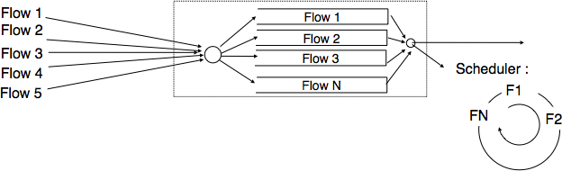
   
   A round-robin scheduler 

A very simple scheduler is the `round-robin scheduler`. This scheduler serves all the queues in a round-robin fashion. If all flows send packets of the same size, then the round-robin scheduler allocates the bandwidth fairly among the different flows. Otherwise, it favors flows that are using larger packets. Extensions to the `round-robin scheduler` have been proposed to provide a fair distribution of the bandwidth with variable-length packets [SV1995]_ but these are outside the scope of this chapter.

.. code-block:: python
   
   # N queues
   # state variable : next_queue
   next_queue=0
   while (true) :
     if isEmpty(buffer) :
       wait
       # wait for next packet in buffer
     if !isEmpty(queue[next_queue]) :
         # Send packet at head of next_queue
         p=remove_packet(queue[next_queue])
        send(p)
     next_queue=(next_queue+1)%N
   # end while

Distributing the load across the network
========================================

.. distributing the load

Delays, packet discards, packet markings and control packets are the main types of information that the network can exchange with the end hosts. Discarding packets is the main action that a network node can perform if the congestion is too severe. Besides tackling congestion at each node, it is also possible to change the divert some traffic flows from heavily loaded links to reduce congestion. Early routing algorithms [MRR1980]_ have used delay measurements to detect congestion between network nodes and update the link weights dynamically. By reflecting the delay perceived by applications in the link weights used for the shortest paths computation, these routing algorithms managed to dynamically change the forwarding paths in reaction to congestion. However, deployment experience showed that these dynamic routing algorithms could cause oscillations and did not necessarily lower congestion. Deployed datagram networks rarely use dynamic routing algorithms, except in some wireless networks. In datagram networks, the state of the art reaction to long term congestion, i.e. congestion lasting hours, days or more, is to measure the traffic demand and then select the link weights [FRT2002]_ that allow to minimize the maximum link loads. If the congestion lasts longer, changing the weights is not sufficient anymore and the network needs to be upgraded with few or faster links. However, in Wide Area Networks, adding new links can take months.

In virtual circuit networks, another way to manage or prevent congestion is to limit the number of circuits that use the network at any time. This technique is usually called `connection admission control`. When a host requests the creation of a new circuit in the network, it specifies the destination and in some networking technologies the required bandwidth. With this information, the network can check whether there are enough resources available to reach this particular destination. If yes, the circuit is established. However, the requested is denied and the host will have to defer the creation of its virtual circuit. `Connection admission control` schemes are widely used in the telephone networks. In these networks, a busy tone corresponds to an unavailable destination or a congested network. 

In datagram networks, this technique cannot be easily used since the basic assumption of such a network is that a host can send any packet towards any destination at any time. A host does not need to request the authorization of the network to send packets towards a particular destination.

Based on the feedback received from the network, the hosts can adjust their transmission rate. We discuss in section `Congestion control` some techniques that allow hosts to react to congestion.

Another way to share the network resources is to distribute the load across multiple links. Many techniques have been designed to spread the load over the network. As an illustration, let us briefly consider how load can be shared when accessing some content. Consider a large and popular file such as the image of a Linux distribution or the upgrade of a commercial operating system that will be downloaded by many users. There are many ways to distribute this large file. A naive solution is to place one copy of the file on a server and allow all users to download this file from the server. If the file is popular and millions of users want to download it, the server will quickly become overloaded. There are two classes of solutions that can be used to serve a large number of users. A first approach is to store the file on servers whose name is known by the clients. Before retrieving the file, each client will query the name service to obtain the address of the server. If the file is available from many servers, the name service can provide different addresses to different clients. This will automatically spread the load since different clients will download the file from different servers. Most large content providers use such a solution to distribute large files or videos.

There is another solution that allows to spread the load among many sources without relying on the name service. The popular bittorent service 
is an example of this approach. With this solution, each file is divided in blocks of a fixed size. To retrieve a file, a client needs to retrieve all the blocks that compose the file. However, nothing forces the client to retrieve all the blocks in sequence and from the same server. Each file is associated with metadata that indicates for each block a list of addresses of hosts that store this block. To retrieve a complete file, a client first downloads the metadata. Then, it tries to retrieve each block from one of the hosts that store the block. In practice, implementations often try to download several blocks in parallel. Once one block has been successfully downloaded, the next block can be requested. If a host is slow to provide one block or becomes unavailable, the client can contact another host listed in the metadata. Most deployments of bittorrent allow the clients to participate to the distribution of blocks. Once a client has downloaded one block, it contacts the server which stores the metadata to indicate that it can also provide this block. With this scheme, when a file is popular, its blocks are downloaded by many hosts that automatically participate in the distribution of the blocks. Thus, the number of `servers` that are capable of providing blocks from a popular file automatically increases with the file's popularity. 

Now that we have provided a broad overview of the techniques that can be used to spread the load and allocate resources in the network, let us analyze two techniques in more details : Medium Access Control and Congestion control.

.. ieee ethernet mac ?

Medium Access Control algorithms
================================

.. index:: collision

The common problem among Local Area Networks is how to efficiently share the available bandwidth. If two devices send a frame at the same time, the two electrical, optical or radio signals that correspond to these frames will appear at the same time on the transmission medium and a receiver will not be able to decode either frame. Such simultaneous transmissions are called `collisions`. A `collision` may involve frames transmitted by two or more devices attached to the Local Area Network. Collisions are the main cause of errors in wired Local Area Networks.

All Local Area Network technologies rely on a `Medium Access Control` algorithm to regulate the transmissions to either minimise or avoid collisions. There are two broad families of `Medium Access Control` algorithms :

 #. `Deterministic` or `pessimistic` MAC algorithms. These algorithms assume that collisions are a very severe problem and that they must be completely avoided. These algorithms ensure that at any time, at most one device is allowed to send a frame on the LAN. This is usually achieved by using a distributed protocol which elects one device that is allowed to transmit at each time. A deterministic MAC algorithm ensures that no collision will happen, but there is some overhead in regulating the transmission of all the devices attached to the LAN.
 #. `Stochastic` or `optimistic` MAC algorithms. These algorithms assume that collisions are part of the normal operation of a Local Area Network. They aim to minimise the number of collisions, but they do not try to avoid all collisions. Stochastic algorithms are usually easier to implement than deterministic ones.

We first discuss a simple deterministic MAC algorithm and then we describe several important optimistic algorithms, before coming back to a distributed and deterministic MAC algorithm.

Static allocation methods
-------------------------

A first solution to share the available resources among all the devices attached to one Local Area Network is to define, `a priori`, the distribution of the transmission resources among the different devices. If `N` devices need to share the transmission capacities of a LAN operating at `b` Mbps, each device could be allocated a bandwidth of :math:`\frac{b}{N}` Mbps. 

.. index:: Frequency Division Multiplexing, FDM

Limited resources need to be shared in other environments than Local Area Networks. Since the first radio transmissions by `Marconi <http://en.wikipedia.org/wiki/Guglielmo_Marconi>`_ more than one century ago, many applications that exchange information through radio signals have been developed. Each radio signal is an electromagnetic wave whose power is centered around a given frequency. The radio spectrum corresponds to frequencies ranging between roughly 3 KHz and 300 GHz. Frequency allocation plans negotiated among governments reserve most frequency ranges for specific applications such as broadcast radio, broadcast television, mobile communications, aeronautical radio navigation, amateur radio, satellite, etc. Each frequency range is then subdivided into channels and each channel can be reserved for a given application, e.g. a radio broadcaster in a given region.

.. index:: Wavelength Division Multiplexing, WDM

`Frequency Division Multiplexing` (FDM) is a static allocation scheme in which a frequency is allocated to each device attached to the shared medium. As each device uses a different transmission frequency, collisions cannot occur. In optical networks, a variant of FDM called `Wavelength Division Multiplexing` (WDM) can be used. An optical fiber can transport light at different wavelengths without interference. With WDM, a different wavelength is allocated to each of the devices that share the same optical fiber.

.. index:: Time Division Multiplexing

`Time Division Multiplexing` (TDM) is a static bandwidth allocation method that was initially defined for the telephone network. In the fixed telephone network, a voice conversation is usually transmitted as a 64 Kbps signal. Thus, a telephone conservation generates 8 KBytes per second or one byte every 125 microseconds. Telephone conversations often need to be multiplexed together on a single line. For example, in Europe, thirty 64 Kbps voice signals are multiplexed over a single 2 Mbps (E1) line. This is done by using  `Time Division Multiplexing` (TDM). TDM divides the transmission opportunities into slots. In the telephone network, a slot corresponds to 125 microseconds. A position inside each slot is reserved for each voice signal. The figure below illustrates TDM on a link that is used to carry four voice conversations. The vertical lines represent the slot boundaries and the letters the different voice conversations. One byte from each voice conversation is sent during each 125 microseconds slot. The byte corresponding to a given conversation is always sent at the same position in each slot.

.. figure:: ../../book/lan/png/lan-fig-012-c.png
   :align: center
   :scale: 70
   
   Time-division multiplexing 

TDM as shown above can be completely static, i.e. the same conversations always share the link, or dynamic. In the latter case, the two endpoints of the link must exchange messages specifying which conversation uses which byte inside each slot. Thanks to these signalling messages, it is possible to dynamically add and remove voice conversations from a given link. 

TDM and FDM are widely used in telephone networks to support fixed bandwidth conversations. Using them in Local Area Networks that support computers would probably be inefficient. Computers usually do not send information at a fixed rate. Instead, they often have an on-off behaviour. During the on period, the computer tries to send at the highest possible rate, e.g. to transfer a file. During the off period, which is often much longer than the on period, the computer does not transmit any packet. Using a static allocation scheme for computers attached to a LAN would lead to huge inefficiencies, as they would only be able to transmit at :math:`\frac{1}{N}` of the total bandwidth during their on period, despite the fact that the other computers are in their off period and thus do not need to transmit any information. The dynamic MAC algorithms discussed in the remainder of this chapter aim solve this problem.

ALOHA
-----

.. index:: packet radio

In the 1960s, computers were mainly mainframes with a few dozen terminals attached to them. These terminals were usually in the same building as the mainframe and were directly connected to it. In some cases, the terminals were installed in remote locations and connected through a :term:`modem` attached to a :term:`dial-up  line`. The university of Hawaii chose a different organisation. Instead of using telephone lines to connect the distant terminals, they developed the first `packet radio` technology [Abramson1970]_. Until then, computer networks were built on top of either the telephone network or physical cables. ALOHANet showed that it was possible to use radio signals to interconnect computers.

.. index:: ALOHA

The first version of ALOHANet, described in [Abramson1970]_, operated as follows: First, the terminals and the mainframe exchanged fixed-length frames composed of 704 bits. Each frame contained 80 8-bit characters, some control bits and parity information to detect transmission errors. Two channels in the 400 MHz range were reserved for the operation of ALOHANet. The first channel was used by the mainframe to send frames to all terminals. The second channel was shared among all terminals to send frames to the mainframe. As all terminals share the same transmission channel, there is a risk of collision. To deal with this problem as well as transmission errors, the mainframe verified the parity bits of the received frame and sent an acknowledgement on its channel for each correctly received frame. The terminals on the other hand had to retransmit the unacknowledged frames. As for TCP, retransmitting these frames immediately upon expiration of a fixed timeout is not a good approach as several terminals may retransmit their frames at the same time leading to a network collapse. A better approach, but still far from perfect, is for each terminal to wait a random amount of time after the expiration of its retransmission timeout. This avoids synchronisation among multiple retransmitting terminals. 

The pseudo-code below shows the operation of an ALOHANet terminal. We use this python syntax for all Medium Access Control algorithms described in this chapter. The algorithm is applied to each new frame that needs to be transmitted. It attempts to transmit a frame at most `max` times (`while loop`). Each transmission attempt is performed as follows: First, the frame is sent. Each frame is protected by a timeout. Then, the terminal waits for either a valid acknowledgement frame or the expiration of its timeout. If the terminal receives an acknowledgement, the frame has been delivered correctly and the algorithm terminates. Otherwise, the terminal waits for a random time and attempts to retransmit the frame. 

.. code-block:: python

 # ALOHA
 N=1
 while N<= max :
    send(frame)
    wait(ack_on_return_channel or timeout)
    if (ack_on_return_channel):
       	break  # transmission was successful
    else:
	# timeout 
	wait(random_time)
	N=N+1
  else:		
    # Too many transmission attempts

[Abramson1970]_ analysed the performance of ALOHANet under particular assumptions and found that ALOHANet worked well when the channel was lightly loaded. In this case, the frames are rarely retransmitted and the `channel traffic`, i.e. the total number of (correct and retransmitted) frames transmitted per unit of time is close to the `channel utilization`, i.e. the number of correctly transmitted frames per unit of time. Unfortunately, the analysis also reveals that the `channel utilization` reaches its maximum at :math:`\frac{1}{2 \times e}=0.186` times the channel bandwidth. At higher utilization, ALOHANet becomes unstable and the network collapses due to collided retransmissions.

.. note:: Amateur packet radio

 Packet radio technologies have evolved in various directions since the first experiments performed at the University of Hawaii. The Amateur packet radio service developed by amateur radio operators is one of the descendants ALOHANet. Many amateur radio operators are very interested in new technologies and they often spend countless hours developing new antennas or transceivers. When the first personal computers appeared, several amateur radio operators designed radio modems and their own datalink layer protocols [KPD1985]_ [BNT1997]_. This network grew and it was possible to connect to servers in several European countries by only using packet radio relays. Some amateur radio operators also developed TCP/IP protocol stacks that were used over the packet radio service. Some parts of the `amateur packet radio network <http://www.ampr.org/>`_ are connected to the global Internet and use the `44.0.0.0/8` prefix. 

.. index:: slotted ALOHA

Many improvements to ALOHANet have been proposed since the publication of [Abramson1970]_, and this technique, or some of its variants, are still found in wireless networks today. The slotted technique proposed in [Roberts1975]_ is important because it shows that a simple modification can significantly improve channel utilization. Instead of allowing all terminals to transmit at any time, [Roberts1975]_ proposed to divide time into slots and allow terminals to transmit only at the beginning of each slot. Each slot corresponds to the time required to transmit one fixed size frame. In practice, these slots can be imposed by a single clock that is received by all terminals. In ALOHANet, it could have been located on the central mainframe. The analysis in [Roberts1975]_ reveals that this simple modification improves the channel utilization by a factor of two. 
	
.. index:: CSMA, Carrier Sense Multiple Access

Carrier Sense Multiple Access
-----------------------------

ALOHA and slotted ALOHA can easily be implemented, but unfortunately, they can only be used in networks that are very lightly loaded. Designing a network for a very low utilisation is possible, but it clearly increases the cost of the network. To overcome the problems of ALOHA, many Medium Access Control mechanisms have been proposed which improve channel utilization. Carrier Sense Multiple Access (CSMA) is a significant improvement compared to ALOHA. CSMA requires all nodes to listen to the transmission channel to verify that it is free before transmitting a frame [KT1975]_. When a node senses the channel to be busy, it defers its transmission until the channel becomes free again. The pseudo-code below provides a more detailed description of the operation of CSMA. 

.. index:: persistent CSMA, CSMA (persistent)

.. code-block:: python

  # persistent CSMA
  N=1
  while N<= max :
    wait(channel_becomes_free)
    send(frame)
    wait(ack or timeout)
    if ack :
       	break  # transmission was successful
    else :
	# timeout 
	N=N+1
  # end of while loop 
    # Too many transmission attempts

The above pseudo-code is often called `persistent CSMA` [KT1975]_ as the terminal will continuously listen to the channel and transmit its frame as soon as the channel becomes free. Another important variant of CSMA is the `non-persistent CSMA` [KT1975]_. The main difference between persistent and non-persistent CSMA described in the pseudo-code below is that a non-persistent CSMA node does not continuously listen to the channel to determine when it becomes free. When a non-persistent CSMA terminal senses the transmission channel to be busy, it waits for a random time before sensing the channel again. This improves channel utilization compared to persistent CSMA. With persistent CSMA, when two terminals sense the channel to be busy, they will both transmit (and thus cause a collision) as soon as the channel becomes free. With non-persistent CSMA, this synchronisation does not occur, as the terminals wait a random time after having sensed the transmission channel. However, the higher channel utilization achieved by non-persistent CSMA comes at the expense of a slightly higher waiting time in the terminals when the network is lightly loaded. 

.. index:: non-persistent CSMA, CSMA (non-persistent)

.. code-block:: python

 # Non persistent CSMA
 N=1
 while N<= max :
    listen(channel)
    if free(channel):
       send(frame)	
       wait(ack or timeout)
       if received(ack) :
       	  break  # transmission was successful
       else :
	  # timeout 
	  N=N+1
    else:
       wait(random_time)
  # end of while loop		
    # Too many transmission attempts

[KT1975]_ analyzes in detail the performance of several CSMA variants. Under some assumptions about the transmission channel and the traffic, the analysis compares ALOHA, slotted ALOHA, persistent and non-persistent CSMA. Under these assumptions, ALOHA achieves a channel utilization of only 18.4% of the channel capacity. Slotted ALOHA is able to use 36.6% of this capacity. Persistent CSMA improves the utilization by reaching 52.9% of the capacity while non-persistent CSMA achieves 81.5% of the channel capacity. 

.. index:: Carrier Sense Multiple Access with Collision Detection, CSMA/CD

Carrier Sense Multiple Access with Collision Detection
------------------------------------------------------

.. index:: speed of light

CSMA improves channel utilization compared to ALOHA. However, the performance can still be improved, especially in wired networks. Consider the situation of two terminals that are connected to the same cable. This cable could, for example, be a coaxial cable as in the early days of Ethernet [Metcalfe1976]_. It could also be built with twisted pairs. Before extending CSMA, it is useful to understand more intuitively, how frames are transmitted in such a network and how collisions can occur. The figure below illustrates the physical transmission of a frame on such a cable. To transmit its frame, host A must send an electrical signal on the shared medium. The first step is thus to begin the transmission of the electrical signal. This is point `(1)` in the figure below. This electrical signal will travel along the cable. Although electrical signals travel fast, we know that information cannot travel faster than the speed of light (i.e. 300.000 kilometers/second). On a coaxial cable, an electrical signal is slightly slower than the speed of light and 200.000 kilometers per second is a reasonable estimation. This implies that if the cable has a length of one kilometer, the electrical signal will need 5 microseconds to travel from one end of the cable to the other. The ends of coaxial cables are equipped with termination points that ensure that the electrical signal is not reflected back to its source. This is illustrated at point `(3)` in the figure, where the electrical signal has reached the left endpoint and host B. At this point, B starts to receive the frame being transmitted by A. Notice that there is a delay between the transmission of a bit on host A and its reception by host B. If there were other hosts attached to the cable, they would receive the first bit of the frame at slightly different times. As we will see later, this timing difference is a key problem for MAC algorithms. At point `(4)`, the electrical signal has reached both ends of the cable and occupies it completely. Host A continues to transmit the electrical signal until the end of the frame. As shown at point `(5)`, when the sending host stops its transmission, the electrical signal corresponding to the end of the frame leaves the coaxial cable. The channel becomes empty again once the entire electrical signal has been removed from the cable.

.. figure:: ../../book/lan/png/lan-fig-024-c.png
   :align: center
   :scale: 70
   
   Frame transmission on a shared bus 

Now that we have looked at how a frame is actually transmitted as an electrical signal on a shared bus, it is interesting to look in more detail at what happens when two hosts transmit a frame at almost the same time. This is illustrated in the figure below, where hosts A and B start their transmission at the same time (point `(1)`). At this time, if host C senses the channel, it will consider it to be free. This will not last a long time and at point `(2)` the electrical signals from both host A and host B reach host C. The combined electrical signal (shown graphically as the superposition of the two curves in the figure) cannot be decoded by host C. Host C detects a collision, as it receives a signal that it cannot decode. Since host C cannot decode the frames, it cannot determine which hosts are sending the colliding frames. Note that host A (and host B) will detect the collision after host C (point `(3)` in the figure below).

.. figure:: ../../book/lan/png/lan-fig-025-c.png
   :align: center
   :scale: 70
   
   Frame collision on a shared bus 

.. index:: collision detection, jamming

As shown above, hosts detect collisions when they receive an electrical signal that they cannot decode. In a wired network, a host is able to detect such a collision both while it is listening (e.g. like host C in the figure above) and also while it is sending its own frame. When a host transmits a frame, it can compare the electrical signal that it transmits with the electrical signal that it senses on the wire. At points `(1)` and `(2)` in the figure above, host A senses only its own signal. At point `(3)`, it senses an electrical signal that differs from its own signal and can thus detects the collision. At this point, its frame is corrupted and it can stop its transmission. The ability to detect collisions while transmitting is the starting point for the `Carrier Sense Multiple Access with Collision Detection (CSMA/CD)` Medium Access Control algorithm, which is used in Ethernet networks [Metcalfe1976]_ [802.3]_ . When an Ethernet host detects a collision while it is transmitting, it immediately stops its transmission. Compared with pure CSMA, CSMA/CD is an important improvement since when collisions occur, they only last until colliding hosts have detected it and stopped their transmission. In practice, when a host detects a collision, it sends a special jamming signal on the cable to ensure that all hosts have detected the collision.

To better understand these collisions, it is useful to analyse what would be the worst collision on a shared bus network. Let us consider a wire with two hosts attached at both ends, as shown in the figure below. Host A starts to transmit its frame and its electrical signal is propagated on the cable. Its propagation time depends on the physical length of the cable and the speed of the electrical signal. Let us use :math:`\tau` to represent this propagation delay in seconds. Slightly less than :math:`\tau` seconds after the beginning of the transmission of A's frame, B decides to start transmitting its own frame. After :math:`\epsilon` seconds, B senses A's frame, detects the collision and stops transmitting. The beginning of B's frame travels on the cable until it reaches host A. Host A can thus detect the collision at time :math:`\tau-\epsilon+\tau \approx 2\times\tau`. An important point to note is that a collision can only occur during the first :math:`2\times\tau` seconds of its transmission. If a collision did not occur during this period, it cannot occur afterwards since the transmission channel is busy after :math:`\tau` seconds and CSMA/CD hosts sense the transmission channel before transmitting their frame. 

.. figure:: ../../book/lan/png/lan-fig-027-c.png
   :align: center
   :scale: 70
   
   The worst collision on a shared bus

Furthermore, on the wired networks where CSMA/CD is used, collisions are almost the only cause of transmission errors that affect frames. Transmission errors that only affect a few bits inside a frame seldom occur in these wired networks. For this reason, the designers of CSMA/CD chose to completely remove the acknowledgement frames in the datalink layer. When a host transmits a frame, it verifies whether its transmission has been affected by a collision. If not, given the negligible Bit Error Ratio of the underlying network, it assumes that the frame was received correctly by its destination. Otherwise the frame is retransmitted after some delay.

Removing acknowledgements is an interesting optimisation as it reduces the number of frames that are exchanged on the network and the number of frames that need to be processed by the hosts. However, to use this optimisation, we must ensure that all hosts will be able to detect all the collisions that affect their frames. The problem is important for short frames. Let us consider two hosts, A and B, that are sending a small frame to host C as illustrated in the figure below. If the frames sent by A and B are very short, the situation illustrated below may occur. Hosts A and B send their frame and stop transmitting (point `(1)`). When the two short frames arrive at the location of host C, they collide and host C cannot decode them (point `(2)`). The two frames are absorbed by the ends of the wire. Neither host A nor host B have detected the collision. They both consider their frame to have been received correctly by its destination.

.. figure:: ../../book/lan/png/lan-fig-026-c.png
   :align: center
   :scale: 70
   
   The short-frame collision problem

.. index:: slot time (Ethernet)

To solve this problem, networks using CSMA/CD require hosts to transmit for at least :math:`2\times\tau` seconds. Since the network transmission speed is fixed for a given network technology, this implies that a technology that uses CSMA/CD enforces a minimum frame size. In the most popular CSMA/CD technology, Ethernet, :math:`2\times\tau` is called the `slot time` [#fslottime]_. 

.. index:: binary exponential back-off (CSMA/CD)

The last innovation introduced by CSMA/CD is the computation of the retransmission timeout. As for ALOHA, this timeout cannot be fixed, otherwise hosts could become synchronised and always retransmit at the same time. Setting such a timeout is always a compromise between the network access delay and the amount of collisions. A short timeout would lead to a low network access delay but with a higher risk of collisions. On the other hand, a long timeout would cause a long network access delay but a lower risk of collisions. The `binary exponential back-off` algorithm was introduced in CSMA/CD networks to solve this problem.

To understand `binary exponential back-off`, let us consider a collision caused by exactly two hosts. Once it has detected the collision, a host can either retransmit its frame immediately or defer its transmission for some time. If each colliding host flips a coin to decide whether to retransmit immediately or to defer its retransmission, four cases are possible :

 1. Both hosts retransmit immediately and a new collision occurs
 2. The first host retransmits immediately and the second defers its retransmission
 3. The second host retransmits immediately and the first defers its retransmission
 4. Both hosts defer their retransmission and a new collision occurs

In the second and third cases, both hosts have flipped different coins. The delay chosen by the host that defers its retransmission should be long enough to ensure that its retransmission will not collide with the immediate retransmission of the other host. However the delay should not be longer than the time necessary to avoid the collision, because if both hosts decide to defer their transmission, the network will be idle during this delay. The `slot time` is the optimal delay since it is the shortest delay that ensures that the first host will be able to retransmit its frame completely without any collision. 

If two hosts are competing, the algorithm above will avoid a second collision 50% of the time. However, if the network is heavily loaded, several hosts may be competing at the same time. In this case, the hosts should be able to automatically adapt their retransmission delay. The `binary exponential back-off` performs this adaptation based on the number of collisions that have affected a frame. After the first collision, the host flips a coin and waits 0 or 1 `slot time`. After the second collision, it generates a random number and waits 0, 1, 2 or 3 `slot times`, etc. The duration of the waiting time is doubled after each collision. The complete pseudo-code for the CSMA/CD algorithm is shown in the figure below. 

.. code-block:: python

 # CSMA/CD pseudo-code
 N=1
 while N<= max :
    wait(channel_becomes_free)
    send(frame)   
    wait_until (end_of_frame) or (collision)	
    if collision detected:
	stop transmitting
	send(jamming)
	k = min (10, N)
	r = random(0, 2**k - 1) 
	wait(r*slotTime)
	N=N+1
    else :	
        wait(inter-frame_delay)
	break
  # end of while loop	
    # Too many transmission attempts
	

The inter-frame delay used in this pseudo-code is a short delay corresponding to the time required by a network adapter to switch from transmit to receive mode. It is also used to prevent a host from sending a continuous stream of frames without leaving any transmission opportunities for other hosts on the network. This contributes to the fairness of CSMA/CD. Despite this delay, there are still conditions where CSMA/CD is not completely fair [RY1994]_. Consider for example a network with two hosts : a server sending long frames and a client sending acknowledgments. Measurements reported in [RY1994]_ have shown that there are situations where the client could suffer from repeated collisions that lead it to wait for long periods of time due to the exponential back-off algorithm. 

.. [#fslottime] This name should not be confused with the duration of a transmission slot in slotted ALOHA. In CSMA/CD networks, the slot time is the time during which a collision can occur at the beginning of the transmission of a frame. In slotted ALOHA, the duration of a slot is the transmission time of an entire fixed-size frame.

.. index:: Carrier Sense Multiple Access with Collision Avoidance, CSMA/CA

Carrier Sense Multiple Access with Collision Avoidance
------------------------------------------------------

The `Carrier Sense Multiple Access with Collision Avoidance` (CSMA/CA) Medium Access Control algorithm was designed for the popular WiFi wireless network technology [802.11]_. CSMA/CA also senses the transmission channel before transmitting a frame. Furthermore, CSMA/CA tries to avoid collisions by carefully tuning the timers used by CSMA/CA devices.

.. index:: Short Inter Frame Spacing, SIFS

CSMA/CA uses acknowledgements like CSMA. Each frame contains a sequence number and a CRC. The CRC is used to detect transmission errors while the sequence number is used to avoid frame duplication. When a device receives a correct frame, it returns a special acknowledgement frame to the sender. CSMA/CA introduces a small delay, named `Short Inter Frame Spacing`  (SIFS), between the reception of a frame and the transmission of the acknowledgement frame. This delay corresponds to the time that is required to switch the radio of a device between the reception and transmission modes.

.. index:: Distributed Coordination Function Inter Frame Space, DIFS, Extended Inter Frame Space, EIFS

Compared to CSMA, CSMA/CA defines more precisely when a device is allowed to send a frame. First, CSMA/CA defines two delays : `DIFS` and `EIFS`. To send a frame, a device must first wait until the channel has been idle for at least the `Distributed Coordination Function Inter Frame Space` (DIFS) if the previous frame was received correctly. However, if the previously received frame was corrupted, this indicates that there are collisions and the device must sense the channel idle for at least the `Extended Inter Frame Space` (EIFS), with :math:`SIFS<DIFS<EIFS`. The exact values for SIFS, DIFS and EIFS depend on the underlying physical layer [802.11]_. 

The figure below shows the basic operation of CSMA/CA devices. Before transmitting, host `A` verifies that the channel is empty for a long enough period. Then, its sends its data frame. After checking the validity of the received frame, the recipient sends an acknowledgement frame after a short SIFS delay. Host `C`, which does not participate in the frame exchange, senses the channel to be busy at the beginning of the data frame. Host `C` can use this information to determine how long the channel will be busy for. Note that as :math:`SIFS<DIFS<EIFS`, even a device that would start to sense the channel immediately after the last bit of the data frame could not decide to transmit its own frame during the transmission of the acknowledgement frame.

.. figure:: ../../book/lan/svg/datalink-fig-006-c.png
   :align: center
   :scale: 70
   
   Operation of a CSMA/CA device

.. index:: slotTime (CSMA/CA)

The main difficulty with CSMA/CA is when two or more devices transmit at the same time and cause collisions. This is illustrated in the figure below, assuming a fixed timeout after the transmission of a data frame. With CSMA/CA, the timeout after the transmission of a data frame is very small, since it corresponds to the SIFS plus the time required to transmit the acknowledgement frame.

.. figure:: ../../book/lan/svg/datalink-fig-007-c.png
   :align: center
   :scale: 70
   
   Collisions with CSMA/CA 

To deal with this problem, CSMA/CA relies on a backoff timer. This backoff timer is a random delay that is chosen by each device in a range that depends on the number of retransmissions for the current frame. The range grows exponentially with the retransmissions as in CSMA/CD. The minimum range for the backoff timer is :math:`[0,7*slotTime]` where the `slotTime` is a parameter that depends on the underlying physical layer. Compared to CSMA/CD's exponential backoff, there are two important differences to notice. First, the initial range for the backoff timer is seven times larger. This is because it is impossible in CSMA/CA to detect collisions as they happen. With CSMA/CA, a collision may affect the entire frame while with CSMA/CD it can only affect the beginning of the frame. Second, a CSMA/CA device must regularly sense the transmission channel during its back off timer. If the channel becomes busy (i.e. because another device is transmitting), then the back off timer must be frozen until the channel becomes free again. Once the channel becomes free, the back off timer is restarted. This is in contrast with CSMA/CD where the back off is recomputed after each collision. This is illustrated in the figure below. Host `A` chooses a smaller backoff than host `C`. When `C` senses the channel to be busy, it freezes its backoff timer and only restarts it once the channel is free again.

.. figure:: ../../book/lan/svg/datalink-fig-008-c.png
   :align: center
   :scale: 70
   
   Detailed example with CSMA/CA

The pseudo-code below summarizes the operation of a CSMA/CA device. The values of the SIFS, DIFS, EIFS and slotTime depend on the underlying physical layer technology [802.11]_

.. code-block:: python

 # CSMA/CA simplified pseudo-code
 N=1
 while N<= max :
    waitUntil(free(channel)) 
    if correct(last_frame) :
       wait(channel_free_during_t >=DIFS)
    else:
       wait(channel_free_during_t >=EIFS)
       	
    back-off_time = int(random[0,min(255,7*(2^(N-1)))])*slotTime
    wait(channel free during backoff_time)
    # backoff timer is frozen while channel is sensed to be busy
    send(frame) 
    wait(ack or timeout)
    if received(ack)
       # frame received correctly
       break
    else:
       # retransmission required
       N=N+1
 # end of while loop	

.. index:: hidden station problem

Another problem faced by wireless networks is often called the `hidden station problem`. In a wireless network, radio signals are not always propagated same way in all directions. For example, two devices separated by a wall may not be able to receive each other's signal while they could both be receiving the signal produced by a third host. This is illustrated in the figure below, but it can happen in other environments. For example, two devices that are on different sides of a hill may not be able to receive each other's signal while they are both able to receive the signal sent by a station at the top of the hill. Furthermore, the radio propagation conditions may change with time. For example, a truck may temporarily block the communication between two nearby devices. 

.. figure:: ../../book/lan/svg/datalink-fig-009-c.png
   :align: center
   :scale: 70
   
   The hidden station problem 

.. index:: Request To Send, RTS, Clear To Send, CTS

To avoid collisions in these situations, CSMA/CA allows devices to reserve the transmission channel for some time. This is done by using two control frames : `Request To Send` (RTS) and `Clear To Send` (CTS). Both are very short frames to minimize the risk of collisions. To reserve the transmission channel, a device sends a RTS frame to the intended recipient of the data frame. The RTS frame contains the duration of the requested reservation. The recipient replies, after a SIFS delay, with a CTS frame which also contains the duration of the reservation. As the duration of the reservation has been sent in both RTS and CTS, all hosts that could collide with either the sender or the reception of the data frame are informed of the reservation. They can compute the total duration of the transmission and defer their access to the transmission channel until then. This is illustrated in the figure below where host `A` reserves the transmission channel to send a data frame to host `B`. Host `C` notices the reservation and defers its transmission.

.. figure:: ../../book/lan/svg/datalink-fig-010-c.png
   :align: center
   :scale: 70
   
   Reservations with CSMA/CA

The utilization of the reservations with CSMA/CA is an optimisation that is useful when collisions are frequent. If there are few collisions, the time required to transmit the RTS and CTS frames can become significant and in particular when short frames are exchanged. Some devices only turn on RTS/CTS after transmission errors.

	
Deterministic Medium Access Control algorithms
----------------------------------------------

During the 1970s and 1980s, there were huge debates in the networking community about the best suited Medium Access Control algorithms for Local Area Networks. The optimistic algorithms that we have described until now were relatively easy to implement when they were designed. From a performance perspective, mathematical models and simulations showed the ability of these optimistic techniques to sustain load. However, none of the optimistic techniques are able to guarantee that a frame will be delivered within a given delay bound and some applications require predictable transmission delays. The deterministic MAC algorithms were considered by a fraction of the networking community as the best solution to fulfill the needs of Local Area Networks. 

Both the proponents of the deterministic and the opportunistic techniques lobbied to develop standards for Local Area networks that would incorporate their solution. Instead of trying to find an impossible compromise between these diverging views, the IEEE 802 committee that was chartered to develop Local Area Network standards chose to work in parallel on three different LAN technologies and created three working groups. The `IEEE 802.3 working group <http://www.ieee802.org/3/>`_ became responsible for CSMA/CD. The proponents of deterministic MAC algorithms agreed on the basic principle of exchanging special frames called tokens between devices to regulate the access to the transmission medium. However, they did not agree on the most suitable physical layout for the network. IBM argued in favor of Ring-shaped networks while the manufacturing industry, led by General Motors, argued in favor of a bus-shaped network. This led to the creation of the `IEEE 802.4 working group` to standardise Token Bus networks and the `IEEE 802.5 working group <http://www.ieee802.org/5/>`_ to standardise Token Ring networks. Although these techniques are not widely used anymore today, the principles behind a token-based protocol are still important.

The IEEE 802.5 Token Ring technology is defined in [802.5]_. We use Token Ring as an example to explain the principles of the token-based MAC algorithms in ring-shaped networks. Other ring-shaped networks include the almost defunct FDDI [Ross1989]_ or the more recent Resilient Pack Ring [DYGU2004]_ . A good survey of the token ring networks may be found in [Bux1989]_ .

A Token Ring network is composed of a set of stations that are attached to a unidirectional ring. The basic principle of the Token Ring MAC algorithm is that two types of frames travel on the ring : tokens and data frames. When the Token Ring starts, one of the stations sends the token. The token is a small frame that represents the authorization to transmit data frames on the ring. To transmit a data frame on the ring, a station must first capture the token by removing it from the ring. As only one station can capture the token at a time, the station that owns the token can safely transmit a data frame on the ring without risking collisions. After having transmitted its frame, the station must remove it from the ring and resend the token so that other stations can transmit their own frames.

.. _fig-tokenring:
.. figure:: ../../book/lan/svg/datalink-fig-011-c.png
   :align: center
   :scale: 70
   
   A Token Ring network

While the basic principles of the Token Ring are simple, there are several subtle implementation details that add complexity to Token Ring networks. To understand these details let us analyse the operation of a Token Ring interface on a station. A Token Ring interface serves three different purposes. Like other LAN interfaces, it must be able to send and receive frames. In addition, a Token Ring interface is part of the ring, and as such, it must be able to forward the electrical signal that passes on the ring even when its station is powered off.

When powered-on, Token Ring interfaces operate in two different modes : `listen` and `transmit`. When operating in `listen` mode, a Token Ring interface receives an electrical signal from its upstream neighbour on the ring, introduces a delay equal to the transmission time of one bit on the ring and regenerates the signal before sending it to its downstream neighbour on the ring.

The first problem faced by a Token Ring network is that as the token represents the authorization to transmit, it must continuously travel on the ring when no data frame is being transmitted. Let us assume that a token has been produced and sent on the ring by one station. In Token Ring networks, the token is a 24 bits frame whose structure is shown below.

.. index:: Token Ring token frame, 802.5 token frame

.. figure:: ../../book/lan/pkt/token.png
   :align: center
   :scale: 100

   802.5 token format

.. index:: Starting Delimiter (Token Ring), Ending Delimiter (Token Ring)

The token is composed of three fields. First, the `Starting Delimiter` is the marker that indicates the beginning of a frame. The first Token Ring networks used Manchester coding and the `Starting Delimiter` contained both symbols representing `0` and symbols that do not represent bits. The last field is the `Ending Delimiter` which marks the end of the token. The `Access Control` field is present in all frames, and contains several flags. The most important is the `Token` bit that is set in token frames and reset in other frames.

.. index:: Token Ring Monitor

Let us consider the five station network depicted in figure :ref:`fig-tokenring` above and assume that station `S1` sends a token. If we neglect the propagation delay on the inter-station links, as each station introduces a one bit delay, the first bit of the frame would return to `S1` while it sends the fifth bit of the token. If station `S1` is powered off at that time, only the first five bits of the token will travel on the ring. To avoid this problem, there is a special station called the `Monitor` on each Token Ring. To ensure that the token can travel forever on the ring, this `Monitor` inserts a delay that is equal to at least 24 bit transmission times. If station `S3` was the `Monitor` in figure :ref:`fig-tokenring`, `S1` would have been able to transmit the entire token before receiving the first bit of the token from its upstream neighbor.

Now that we have explained how the token can be forwarded on the ring, let us analyse how a station can capture a token to transmit a data frame. For this, we need some information about the format of the data frames. An 802.5 data frame begins with the `Starting Delimiter` followed by the `Access Control` field whose `Token` bit is reset, a `Frame Control` field that allows for the definition of several types of frames, destination and source address, a payload, a CRC, the `Ending Delimiter` and a `Frame Status` field. The format of the Token Ring data frames is illustrated below.

.. index:: Token Ring data frame, 802.5 data frame

.. figure:: ../../book/lan/pkt/8025.png
   :align: center
   :scale: 100

   802.5 data frame format

To capture a token, a station must operate in `Listen` mode. In this mode, the station receives bits from its upstream neighbour. If the bits correspond to a data frame, they must be forwarded to the downstream neighbour. If they correspond to a token, the station can capture it and transmit its data frame. Both the data frame and the token are encoded as a bit string beginning with the `Starting Delimiter` followed by the `Access Control` field. When the station receives the first bit of a `Starting Delimiter`, it cannot know whether this is a data frame or a token and must forward the entire delimiter to its downstream neighbour. It is only when it receives the fourth bit of the `Access Control` field (i.e. the `Token` bit) that the station knows whether the frame is a data frame or a token. If the `Token` bit is reset, it indicates a data frame and the remaining bits of the data frame must be forwarded to the downstream station. Otherwise (`Token` bit is set), this is a token and the station can capture it by resetting the bit that is currently in its buffer. Thanks to this modification, the beginning of the token is now the beginning of a data frame and the station can switch to `Transmit` mode and send its data frame starting at the fifth bit of the `Access Control` field. Thus, the one-bit delay introduced by each Token Ring station plays a key role in enabling the stations to efficiently capture the token. 

After having transmitted its data frame, the station must remain in `Transmit` mode until it has received the last bit of its own data frame. This ensures that the bits sent by a station do not remain in the network forever. A data frame sent by a station in a Token Ring network passes in front of all stations attached to the network. Each station can detect the data frame and analyse the destination address to possibly capture the frame. 

.. The `Frame Status` field that appears after the `Ending Delimiter` is used to provide acknowledgements without requiring special frames. The `Frame Status` contains two flags : `A` and `C`. Both flags are reset when a station sends a data frame. These flags can be modified by their recipients. When a station senses its address as the destination address of a frame, it can capture the frame, check its CRC and place it in its own buffers. The destination of a frame must set the `A` bit (resp. `C` bit) of the `Frame Status` field once it has seen (resp. copied) a data frame. By inspecting the `Frame Status` of the returning frame, the sender can verify whether its frame has been received correctly by its destination.

.. index:: Monitor station, Token Holding Time

The text above describes the basic operation of a Token Ring network when all stations work correctly. Unfortunately, a real Token Ring network must be able to handle various types of anomalies and this increases the complexity of Token Ring stations. We briefly list the problems and outline their solutions below. A detailed description of the operation of Token Ring stations may be found in [802.5]_. The first problem is when all the stations attached to the network start. One of them must bootstrap the network by sending the first token. For this, all stations implement a distributed election mechanism that is used to select the `Monitor`. Any station can become a `Monitor`. The `Monitor` manages the Token Ring network and ensures that it operates correctly. Its first role is to introduce a delay of 24 bit transmission times to ensure that the token can travel smoothly on the ring. Second, the `Monitor` sends the first token on the ring. It must also verify that the token passes regularly. According to the Token Ring standard [802.5]_, a station cannot retain the token to transmit data frames for a duration longer than the `Token Holding Time` (THT) (slightly less than 10 milliseconds). On a network containing `N` stations, the `Monitor` must receive the token at least every :math:`N \times THT` seconds. If the `Monitor` does not receive a token during such a period, it cuts the ring for some time and then reinitialises the ring and sends a token.

Several other anomalies may occur in a Token Ring network. For example, a station could capture a token and be powered off before having resent the token. Another station could have captured the token, sent its data frame and be powered off before receiving all of its data frame. In this case, the bit string corresponding to the end of a frame would remain in the ring without being removed by its sender. Several techniques are defined in [802.5]_ to allow the `Monitor` to handle all these problems. If unfortunately, the `Monitor` fails, another station will be elected to become the new `Monitor`.

Congestion control
==================

Most networks contain links having different bandwidth. Some hosts can use low bandwidth wireless networks. Some servers are attached via 10 Gbps interfaces and inter-router links may vary from a few tens of kilobits per second up to hundred Gbps. Despite these huge differences in performance, any host should be able to efficiently exchange segments with a high-end server.

.. index:: TCP self clocking

To understand this problem better, let us consider the scenario shown in the figure below, where a server (`A`) attached to a `10 Mbps` link needs to reliably transfer segments to another computer (`C`) through a path that contains a `2 Mbps` link.

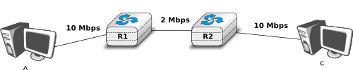

   Reliable transport with heterogeneous links 

In this network, the segments sent by the server reach router `R1`. `R1` forwards the segments towards router `R2`. Router `R1` can potentially receive segments at `10 Mbps`, but it can only forward them at `2 Mbps` to router `R2` and then to host `C`.  Router `R1` includes buffers that allow it to store the packets that cannot immediately be forwarded to their destination. To understand the operation of a reliable transport protocol in this environment, let us consider a simplified model of this network where host `A` is attached to a `10 Mbps` link to a queue that represents the buffers of router `R1`. This queue is emptied at a rate of `2 Mbps`.

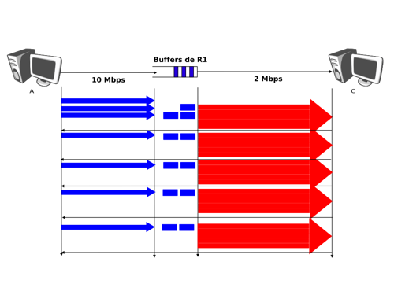

   Self clocking

Let us consider that host `A` uses a window of three segments. It thus sends three back-to-back segments at `10 Mbps` and then waits for an acknowledgement. Host `A` stops sending segments when its window is full. These segments reach the buffers of router `R2`. The first segment stored in this buffer is sent by router `R2` at a rate of `2 Mbps` to the destination host. Upon reception of this segment, the destination sends an acknowledgement. This acknowledgement allows host `A` to transmit a new segment. This segment is stored in the buffers of router `R2` while it is transmitting the second segment that was sent by host `A`... Thus, after the transmission of the first window of segments, the reliable transport protocol sends one data segment after the reception of each acknowledgement returned by the destination. In practice, the acknowledgements sent by the destination serve as a kind of `clock` that allows the sending host to adapt its transmission rate to the rate at which segments are received by the destination. This `self-clocking` is the first mechanism that allows a window-based reliable transport protocol to adapt to heterogeneous networks [Jacobson1988]_. It depends on the availability of buffers to store the segments that have been sent by the sender but have not yet been transmitted to the destination.

However, transport protocols are not only used in this environment. In the global Internet, a large number of hosts send segments to a large number of receivers. For example, let us consider the network depicted below which is similar to the one discussed in [Jacobson1988]_ and :rfc:`896`. In this network, we assume that the buffers of the router are infinite to ensure that no packet is lost.

.. index:: congestion collapse

.. figure:: ../../book/transport/png/transport-fig-083-c.png 
   :align: center
   :scale: 70 

   The congestion collapse problem

If many senders are attached to the left part of the network above, they all send a window full of segments. These segments are stored in the buffers of the router before being transmitted towards their destination. If there are many senders on the left part of the network, the occupancy of the buffers quickly grows. A consequence of the buffer occupancy is that the round-trip-time, measured by the transport protocol, between the sender and the receiver increases. Consider a network where 10,000 bits segments are sent. When the buffer is empty, such a segment requires 1 millisecond to be transmitted on the `10 Mbps` link and 5 milliseconds to be the transmitted on the `2 Mbps` link. Thus, the measured round-trip-time measured is roughly 6 milliseconds if we ignore the propagation delay on the links. If the buffer contains 100 segments, the round-trip-time becomes :math:`1+100 \times 5+ 5` milliseconds as new segments are only transmitted on the `2 Mbps` link once all previous segments have been transmitted. Unfortunately, if the reliable transport protocol uses a retransmission timer and performs `go-back-n` to recover from transmission errors it will retransmit a full window of segments. This increases the occupancy of the buffer and the delay through the buffer... Furthermore, the buffer may store and send on the low bandwidth links several retransmissions of the same segment. This problem is called `congestion collapse`. It occurred several times during the late 1980s on the Internet [Jacobson1988]_. 

The `congestion collapse` is a problem that all heterogeneous networks face. Different mechanisms have been proposed in the scientific literature to avoid or control network congestion. Some of them have been implemented and deployed in real networks. To understand this problem in more detail, let us first consider a simple network with two hosts attached to a high bandwidth link that are sending segments to destination `C` attached to a low bandwidth link as depicted below.

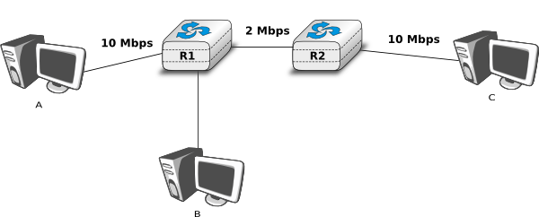

   The congestion problem

To avoid `congestion collapse`, the hosts must regulate their transmission rate [#fcredit]_ by using a `congestion control` mechanism. Such a mechanism can be implemented in the transport layer or in the network layer. In TCP/IP networks, it is implemented in the transport layer, but other technologies such as `Asynchronous Transfer Mode (ATM)` or `Frame Relay` include congestion control mechanisms in lower layers.

.. index:: Fairness, max-min fairness

Let us first consider the simple problem of a set of :math:`i` hosts that share a single bottleneck link as shown in the example above. In this network, the congestion control scheme must achieve the following objectives [CJ1989]_ :

 #. The congestion control scheme must `avoid congestion`. In practice, this means that the bottleneck link cannot be overloaded. If :math:`r_i(t)` is the transmission rate allocated to host :math:`i` at time :math:`t` and :math:`R` the bandwidth of the bottleneck link, then the congestion control scheme should ensure that, on average, :math:`\forall{t} \sum{r_i(t)} \le R`. 
 #. The congestion control scheme must be `efficient`. The bottleneck link is usually both a shared and an expensive resource. Usually, bottleneck links are wide area links that are much more expensive to upgrade than the local area networks. The congestion control scheme should ensure that such links are efficiently used. Mathematically, the control scheme should ensure that :math:`\forall{t} \sum{r_i(t)} \approx R`.
 #. The congestion control scheme should be `fair`. Most congestion schemes aim at achieving `max-min fairness`. An allocation of transmission rates to sources is said to be `max-min fair` if :

   - no link in the network is congested 
   - the rate allocated to source :math:`j` cannot be increased without decreasing the rate allocated to a source :math:`i` whose allocation is smaller than the rate allocated to source :math:`j` [Leboudec2008]_ .  

Depending on the network, a `max-min fair allocation` may not always exist. In practice, `max-min fairness` is an ideal objective that cannot necessarily be achieved. When there is a single bottleneck link as in the example above, `max-min fairness` implies that each source should be allocated the same transmission rate.

To visualise the different rate allocations, it is useful to consider the graph shown below. In this graph, we plot on the `x-axis` (resp. `y-axis`) the rate allocated to host `B` (resp. `A`). A point in the graph :math:`(r_B,r_A)` corresponds to a possible allocation of the transmission rates. Since there is a `2 Mbps` bottleneck link in this network, the graph can be divided into two regions. The lower left part of the graph contains all allocations :math:`(r_B,r_A)` such that the bottleneck link is not congested (:math:`r_A+r_B<2`). The right border of this region is the `efficiency line`, i.e. the set of allocations that completely utilise the bottleneck link (:math:`r_A+r_B=2`). Finally, the `fairness line` is the set of fair allocations. 

.. figure:: ../../book/transport/png/transport-fig-092-c.png 
   :align: center
   :scale: 70 

   Possible allocated transmission rates

As shown in the graph above, a rate allocation may be fair but not efficient (e.g. :math:`r_A=0.7,r_B=0.7`), fair and efficient ( e.g. :math:`r_A=1,r_B=1`) or efficient but not fair (e.g. :math:`r_A=1.5,r_B=0.5`). Ideally, the allocation should be both fair and efficient. Unfortunately, maintaining such an allocation with fluctuations in the number of flows that use the network is a challenging problem. Furthermore, there might be several thousands flows that pass through the same link [#fflowslink]_.

To deal with these fluctuations in demand, which result in fluctuations in the available bandwidth, computer networks use a congestion control scheme. This congestion control scheme should achieve the three objectives listed above. Some congestion control schemes rely on a close cooperation between the endhosts and the routers, while others are mainly implemented on the endhosts with limited support from the routers. 

A congestion control scheme can be modelled as an algorithm that adapts the transmission rate (:math:`r_i(t)`) of host :math:`i` based on the feedback received from the network. Different types of feedbacks are possible. The simplest scheme is a binary feedback [CJ1989]_  [Jacobson1988]_ where the hosts simply learn whether the network is congested or not. Some congestion control schemes allow the network to regularly send an allocated transmission rate in Mbps to each host [BF1995]_. 

.. index:: Additive Increase Multiplicative Decrease (AIMD)

Let us focus on the binary feedback scheme which is the most widely used today. Intuitively, the congestion control scheme should decrease the transmission rate of a host when congestion has been detected in the network, in order to avoid congestion collapse. Furthermore, the hosts should increase their transmission rate when the network is not congested. Otherwise, the hosts would not be able to efficiently utilise the network. The rate allocated to each host fluctuates with time, depending on the feedback received from the network. The figure below illustrates the evolution of the transmission rates allocated to two hosts in our simple network. Initially, two hosts have a low allocation, but this is not efficient. The allocations increase until the network becomes congested. At this point, the hosts decrease their transmission rate to avoid congestion collapse. If the congestion control scheme works well, after some time the allocations should become both fair and efficient.

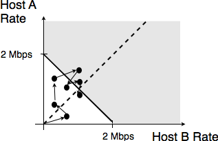

   Evolution of the transmission rates 

Various types of rate adaption algorithms are possible. `Dah Ming Chiu`_ and `Raj Jain`_ have analysed, in [CJ1989]_, different types of algorithms that can be used by a source to adapt its transmission rate to the feedback received from the network. Intuitively, such a rate adaptation algorithm increases the transmission rate when the network is not congested (ensure that the network is efficiently used) and decrease the transmission rate when the network is congested (to avoid congestion collapse).

The simplest form of feedback that the network can send to a source is a binary feedback (the network is congested or not congested). In this case, a `linear` rate adaptation algorithm can be expressed as :

  - :math:`rate(t+1)=\alpha_C + \beta_C rate(t)` when the network is congested
  - :math:`rate(t+1)=\alpha_N + \beta_N rate(t)` when the network is *not* congested

With a linear adaption algorithm, :math:`\alpha_C,\alpha_N, \beta_C` and :math:`\beta_N` are constants. 
The analysis of [CJ1989]_ shows that to be fair and efficient, such a binary rate adaption mechanism must rely on `Additive Increase and Multiplicative Decrease`. When the network is not congested, the hosts should slowly increase their transmission rate (:math:`\beta_N=1~and~\alpha_N>0`). When the network is congested, the hosts must multiplicatively decrease their transmission rate (:math:`\beta_C < 1~and~\alpha_C = 0`). Such an AIMD rate adaptation algorithm can be implemented by the pseudo-code below. 

.. code-block:: python

    # Additive Increase Multiplicative Decrease	
    if congestion :
       rate=rate*betaC    # multiplicative decrease, betaC<1
    else
       rate=rate+alphaN    # additive increase, v0>0

.. note:: Which binary feedback ?

 Two types of binary feedback are possible in computer networks. A first solution is to rely on implicit feedback. This is the solution chosen for TCP. TCP's congestion control scheme [Jacobson1988]_ does not require any cooperation from the router. It only assumes that they use buffers and that they discard packets when there is congestion. TCP uses the segment losses as an indication of congestion. When there are no losses, the network is assumed to be not congested. This implies that congestion is the main cause of packet losses. This is true in wired networks, but unfortunately not always true in wireless networks. 
 Another solution is to rely on explicit feedback. This is the solution proposed in the DECBit congestion control scheme [RJ1995]_ and used in Frame Relay and ATM networks. This explicit feedback can be implemented in two ways. A first solution would be to define a special message that could be sent by routers to hosts when they are congested. Unfortunately, generating such messages may increase the amount of congestion in the network. Such a congestion indication packet is thus discouraged :rfc:`1812`. A better approach is to allow the intermediate routers to indicate, in the packets that they forward, their current congestion status. Binary feedback can be encoded by using one bit in the packet header. With such a scheme, congested routers set a special bit in the packets that they forward while non-congested routers leave this bit unmodified. The destination host returns the congestion status of the network in the acknowledgements that it sends. Details about such a solution in IP networks may be found in :rfc:`3168`. Unfortunately, as of this writing, this solution is still not deployed despite its potential benefits.

Congestion control in a window-based transport protocol
-------------------------------------------------------

AIMD controls congestion by adjusting the transmission rate of the sources in reaction to the current congestion level. If the network is not congested, the transmission rate increases. If congestion is detected, the transmission rate is multiplicatively decreased. In practice, directly adjusting the transmission rate can be difficult since it requires the utilisation of fine grained timers. In reliable transport protocols, an alternative is to dynamically adjust the sending window. This is the solution chosen for protocols like TCP and SCTP that will be described in more details later. To understand how window-based protocols can adjust their transmission rate, let us consider the very simple scenario of a reliable transport protocol that uses `go-back-n`. Consider the very simple scenario shown in the figure below.

.. graphviz::

   graph foo {
      randkir=LR;
      A [color=white, shape=box label=<<TABLE border="0" cellborder="0">
                       <TR><TD width="45" height="60" fixedsize="true"></TD></TR><TR><td>A</td></TR>
              </TABLE>>];
      B [color=white, shape=box label=<<TABLE border="0" cellborder="0">
                       <TR><TD width="45" height="60" fixedsize="true"></TD></TR><TR><td>B</td></TR>
              </TABLE>>];
      D [color=white, shape=box label=<<TABLE border="0" cellborder="0">
                       <TR><TD width="45" height="60" fixedsize="true"></TD></TR><TR><td>D</td></TR>
              </TABLE>>];
      R1[shape=box, color=white, label=<<TABLE border="0" cellborder="0">
                       <TR><TD width="75" height="30" fixedsize="true"></TD></TR><TR><td>R1</td></TR>
              </TABLE>>];
       R2[color=white, label=<<TABLE border="0" cellborder="0">
                       <TR><TD width="75" height="30" fixedsize="true"></TD></TR><TR><td>R2</td></TR>
              </TABLE>>];
      A--R1;
      B--R1;
      R1--R2 [label="500 kbps"];
      R2--D;
   }

The links between the hosts and the routers have a bandwidth of 1 Mbps while the link between the two routers has a bandwidth of 500 Kbps. There is no significant propagation delay in this network. For simplicity, assume that hosts `A` and `B` send 1000 bits packets. The transmission of such a packet on a `host-router` (resp. `router-router` ) link requires 1 msec (resp. 2 msec). If there is no traffic in the network, round-trip-time measured by host `A` is slightly larger than 4 msec. Let us observe the flow of packets with different window sizes to understand the relationship between sending window and transmission rate.

Consider first a window of one segment. This segment takes 4 msec to reach host `D`. The destination replies with an acknowledgement and the next segment can be transmitted. With such a sending window, the transmission rate is roughly 250 segments per second of 250 Kbps. 

.. code-block:: console

 +-----+----------+----------+----------+
 |Time | A-R1     | R1-R2    | R2-D     |
 +=====+==========+==========+==========+
 |t0   | data(0)  |          |          |
 +-----+----------+----------+          |
 |t0+1 |          |          |          |
 +-----+          |  data(0) |          |
 |t0+2 |          |          |          |
 +-----+          +----------+----------+
 |t0+3 |          |          | data(0)  |
 +-----+----------+          +----------+
 |t0+4 | data(1)  |          |          |
 +-----+----------+----------+          |
 |t0+5 |          |          |          |
 +-----+          |  data(1) |          |
 |t0+6 |          |          |          |
 +-----+          +----------+----------+
 |t0+7 |          |          | data(1)  |
 +-----+----------+          +----------+
 |t0+8 | data(2)  |                     |
 +-----+----------+----------------------
 

Consider now a window of two segments. Host `A` can send two segments within 2 msec on its 1 Mbps link. If the first segment is sent at time :math:`t_{0}`, it reaches host `D` at :math:`t_{0}+4`. Host `D` replies with an acknowledgement that opens the sending window on host `A` and enables it to transmit a new segment. In the meantime, the second segment was buffered by router `R1`. It reaches host `D` at :math:`t_{0}+6` and an acknowledgement is returned. With a window of two segments, host `A` transmits at roughly 500 Kbps, i.e. the transmission rate of the bottleneck link.

.. code-block:: console

 +-----+----------+----------+----------+
 |Time | A-R1     | R1-R2    | R2-D     |
 +=====+==========+==========+==========+
 |t0   | data(0)  |          |          |
 +-----+----------+----------+          |
 |t0+1 | data(1)  |          |          |
 +-----+----------+ data(0)  |          |
 |t0+2 |          |          |          |
 +-----+          +----------+----------+
 |t0+3 |          |          | data(0)  |
 +-----+----------+ data(1)  +----------+
 |t0+4 | data(2)  |          |          |
 +-----+----------+----------+----------+
 |t0+5 |          |          | data(1)  |
 +-----+----------+ data(2)  +----------+
 |t0+6 | data(3)  |          |          |
 +-----+----------+----------+----------+

  
Our last example is a window of four segments. These segments are sent at :math:`t_{0}`, :math:`t_{0}+1`, :math:`t_{0}+2` and :math:`t_{0}+3`. The first segment reaches host `D` at :math:`t_{0}+4`. Host `D` replies to this segment by sending an acknowledgement that enables host `A` to transmit its fifth segment. This segment reaches router `R1` at :math:`t_{0}+5`. At that time, router `R1` is transmitting the third segment to router `R2` and the fourth segment is still in its buffers. At time :math:`t_{0}+6`, host `D` receives the second segment and returns the corresponding acknowledgement. This acknowledgement enables host `A` to send its sixth segment. This segment reaches router `R1` at roughly :math:`t_{0}+7`. At that time, the router starts to transmit the fourth segment to router `R2`. Since link `R1-R2` can only sustain 500 Kbps, packets will accumulate in the buffers of `R1`. On average, there will be two packets waiting in the buffers of `R1`. The presence of these two packets will induce an increase of the round-trip-time as measured by the transport protocol. While the first segment was acknowledged within 4 msec, the fifth segment (`data(4)`) that was transmitted at time :math:`t_{0}+4` is only acknowledged at time :math:`t_{0}+11`. On average, the sender transmits at 500 Kbps, but the utilisation of a large window induces a longer delay through the network. 

.. code-block:: console

 +-----+----------+----------+----------+
 |Time | A-R1     | R1-R2    | R2-D     |
 +=====+==========+==========+==========+
 |t0   | data(0)  |          |          |
 +-----+----------+----------+          |
 |t0+1 | data(1)  |          |          |
 +-----+----------+  data(0) |          |
 |t0+2 | data(2)  |          |          |
 +-----+----------+----------+----------+
 |t0+3 | data(3)  |          | data(0)  |
 +-----+----------+  data(1) +----------+
 |t0+4 | data(4)  |          |          |
 +-----+----------+----------+----------+
 |t0+5 |          |          | data(1)  |
 +-----+----------+  data(2) +----------+
 |t0+6 | data(5)  |          |          |
 +-----+----------+----------+----------+
 |t0+7 |          |          | data(2)  |
 +-----+----------+  data(3) +----------+
 |t0+8 | data(6)  |          |          |
 +-----+----------+----------+----------+
 |t0+9 |          |          | data(3)  |
 +-----+----------+  data(4) +----------+
 |t0+10| data(7)  |          |          |
 +-----+----------+----------+----------+ 
 |t0+11|          |          | data(4)  |
 +-----+----------+  data(5) +----------+
 |t0+12| data(8)  |          |          |
 +-----+----------+----------+----------+ 

.. index:: congestion window

From the above example, we can adjust the transmission rate by adjusting the sending window of a reliable transport protocol. A reliable transport protocol cannot send data faster than :math:`\frac{window}{rtt}` where :math:`window` is current sending window. To control the transmission rate, we introduce a `congestion window`. This congestion window limits the sending window. A any time, the sending window is restricted to :math:`\min(swin,cwin)`, where `swin` is the sending window and `cwin` the current `congestion window`. Of course, the window is further constrained by the receive window advertised by the remote peer. With the utilization of a congestion window, a simple reliable transport protocol that uses fixed size segments could implement `AIMD` as follows. 

For the `Additive Increase` part our simple protocol would simply increase its `congestion window` by one segment every round-trip-time. The 
`Multiplicative Decrease` part of `AIMD` could be implemented by halving the congestion window when congestion is detected. For simplicity, we assume that congestion is detected thanks to a binary feedback and that no segments are lost. We will discuss in more details how losses affect a real transport protocol like TCP. 

A congestion control scheme for our simple transport protocol could be implemented as follows.

.. code-block:: python

   # Initialisation 
   cwin = 1  # congestion window measured in segments
    
   # Ack arrival 
   if newack :  # new ack, no congestion
      # increase cwin by one every rtt
      cwin = cwin+ (1/cwin)
   else: 
      # no increase
  
   Congestion detected: 
      cwnd=cwin/2 # only once per rtt

In the above pseudocode, `cwin` contains the congestion window stored as a real in segments. This congestion window is updated upon the arrival of each acknowledgment and when congestion is detected. For simplicity, we assume that `cwin` is stored as a floating point number but only full segments can be transmitted. 

As an illustration, let us consider the network scenario above and assume that the router implements the DECBit binary feedback scheme [RJ1995]_. This scheme uses a form of Forward Explicit Congestion Notification and a router marks the congestion bit in arriving packets when its buffer contains one or more packets. In the figure below, we use a `*` to indicate a marked packet.

.. code-block:: console

 +-----+----------+----------+----------+
 |Time | A-R1     | R1-R2    | R2-D     |
 +-----+==========+==========+==========+
 |t0   | data(0)  |          |          |
 +-----+----------+----------+          |
 |t0+1 |          |          |          |
 +-----+          |  data(0) |          |
 |t0+2 |          |          |          |
 +-----+          +----------+----------+
 |t0+3 |          |          | data(0)  |
 +-----+----------+          +----------+
 |t0+4 | data(1)  |          |          |
 +-----+----------+----------+          |
 |t0+5 | data(2)  |          |          |
 +-----+----------+ data(1)  |          |
 |t0+6 |          |          |          |
 +-----+          +----------+----------+
 |t0+7 |          |          | data(1)  |
 +-----+----------+ data(2)  +----------+
 |t0+8 | data(3)  |          |          |
 +-----+----------+----------+----------+
 |t0+9 |          |          | data(2)  |
 +-----+----------+ data(3)  +----------+
 |t0+10| data(4)  |          |          |
 +-----+----------+----------+----------+
 |t0+11| data(5)  |          | data(3)  |
 +-----+----------+ data(4)  +----------+
 |t0+12| data(6)  |          |          |
 +-----+----------+----------+----------+
 |t0+13|          |          | data(4)  |
 +-----+----------+ data(5)  +----------+
 |t0+14| data(7)  |          |          |
 +-----+----------+----------+----------+
 |t0+15|          |          | data(5)  |
 +-----+----------+ data*(6) +----------+
 |t0+16| data(8)  |          |          |
 +-----+----------+----------+----------+
 |t0+17| data(9)  |          | data*(6) |
 +-----+----------+ data*(7) +----------+
 |t0+18|          |          |          |
 +-----+          |----------+----------
 |t0+19|          |          | data*(7) |
 +-----+          | data*(8) +----------+
 |t0+20|          |          |          |
 +-----+          |----------+----------+
 |t0+21|          |          | data*(8) |
 +-----+----------+ data*(9) +----------+
 |t0+22| data(10) |          |          |
 +-----+----------+----------+----------+

When the connection starts, its congestion window is set to one segment. Segment `data(0)` is sent at acknowledgment at roughly :math:`t_{0}+4`. The congestion window is increased by one segment and `data(1)` and `data(2)` are transmitted at time :math:`t_{0}+4` and :math:`t_{0}+5`. The corresponding acknowledgements are received at times :math:`t_{0}+8` and :math:`t_{0}+10`. Upon reception of this last acknowledgement, the congestion window reaches `3` and segments can be sent (`data(4)` and `data(5)`). When segment `data(6)` reaches router `R1`, its buffers already contain `data(5)`. The packet containing `data(6)` is thus marked to inform the sender of the congestion. Note that the sender will only notice the congestion once it receives the corresponding acknowledgement at :math:`t_{0}+18`. In the meantime, the congestion window continues to increase. At :math:`t_{0}+16`, upon reception of the acknowledgement for `data(5)`, it reaches `4`. When congestion is detected, the congestion window is decreased down to `2`. This explains the idle time between the reception of the acknowledgement for `data*(6)` and the transmission of `data(10)`.

.. rubric:: Footnotes

.. [#fbufferbloat] There are still some vendors that try to put as many buffers as possible on their network nodes. A recent example is the buffer bloat problem that plagues some low-end Internet routers [GN2011]_. 

.. [#fpps] Some examples of the performance of various types of commercial networks nodes may be found in http://www.cisco.com/web/partners/downloads/765/tools/quickreference/routerperformance.pdf and http://www.cisco.com/web/partners/downloads/765/tools/quickreference/switchperformance.pdf

.. [#fadjust] Some networking technologies allow to adjust dynamically the bandwidth of links. For example, some devices can reduce their bandwidth to preserve energy. We ignore these technologies in this basic course and assume that all links used inside the network have a fixed bandwidth. 

.. [#fcredit] In this section, we focus on congestion control mechanisms that regulate the transmission rate of the hosts. Other types of mechanisms have been proposed in the literature. For example, `credit-based` flow-control has been proposed to avoid congestion in ATM networks [KR1995]_. With a credit-based mechanism, hosts can only send packets once they have received credits from the routers and the credits depend on the occupancy of the router's buffers. 

.. [#fflowslink] For example, the measurements performed in the Sprint network in 2004 reported more than 10k active TCP connections on a link, see https://research.sprintlabs.com/packstat/packetoverview.php. More recent information about backbone links may be obtained from caida_ 's realtime measurements, see e.g.  http://www.caida.org/data/realtime/passive/ 

.. include:: /links.rst

