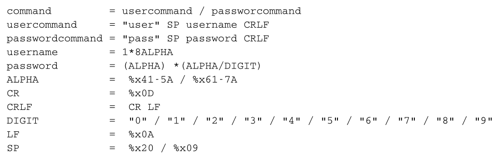
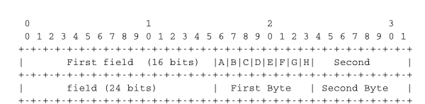
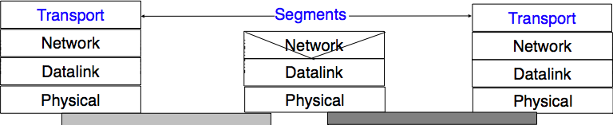

.. Copyright |copy| 2013 by Olivier Bonaventure
.. Some portions of this text come from the first edition of this ebook
.. This file is licensed under a `creative commons licence <http://creativecommons.org/licenses/by-sa/3.0/>`_

.. warning:: 

   This is an unpolished draft of the second edition of this ebook. If you find any error or have suggestions to improve the text, please create an issue via https://github.com/obonaventure/cnp3/issues?milestone=3

Applications
============

The are two important models used to organise a networked application. The first and oldest model is the client-server model. In this model, a server provides services to clients that exchange information with it. This model is highly asymmetrical : clients send requests and servers perform actions and return responses. It is illustrated in the figure below.

.. figure:: ../../book/application/png/app-fig-001-c.png
   :align: center
   :scale: 50 

   The client-server model

The client-server model was the first model to be used to develop networked applications. This model comes naturally from the mainframes and minicomputers that were the only networked computers used until the 1980s. A minicomputer_ is a multi-user system that is used by tens or more users at the same time. Each user interacts with the minicomputer by using a terminal. Those terminals, were mainly a screen, a keyboard and a cable directly connected to the minicomputer.

There are various types of servers as well as various types of clients. A web server provides information in response to the query sent by its clients. A print server prints documents sent as queries by the client. An email server will forward towards their recipient the email messages sent as queries while a music server will deliver the music requested by the client. From the viewpoint of the application developer, the client and the server applications directly exchange messages (the horizontal arrows labelled `Queries` and `Responses` in the above figure), but in practice these messages are exchanged thanks to the underlying layers (the vertical arrows in the above figure). In this chapter, we focus on these horizontal exchanges of messages. 

Networked applications do not exchange random messages. In order to ensure that the server is able to understand the queries sent by a client, and also that the client is able to understand the responses sent by the server, they must both agree on a set of syntactical and semantic rules. These rules define the format of the messages exchanged as well as their ordering. This set of rules is called an application-level `protocol`.

An `application-level protocol` is similar to a structured conversation between humans. Assume that Alice wants to know the current time but does not have a watch. If Bob passes close by, the following conversation could take place :

 - Alice : `Hello`
 - Bob : `Hello`
 - Alice : `What time is it ?`
 - Bob : `11:55`
 - Alice : `Thank you`
 - Bob : `You're welcome`  

Such a conversation succeeds if both Alice and Bob speak the same language. If Alice meets Tchang who only speaks Chinese, she won't be able to ask him the current time. A conversation between humans can be more complex. For example, assume that Bob is a security guard whose duty is to only allow trusted secret agents to enter a meeting room. If all agents know a secret password, the conversation between Bob and Trudy could be as follows :

 - Bob : `What is the secret password ?`
 - Trudy : `1234`
 - Bob : `This is the correct password, you're welcome`
 
If Alice wants to enter the meeting room but does not know the password, her conversation could be as follows :

 - Bob : `What is the secret password ?`
 - Alice : `3.1415`
 - Bob : `This is not the correct password.`

Human conversations can be very formal, e.g. when soldiers communicate with their hierarchy, or informal such as when friends discuss. Computers that communicate are more akin to soldiers and require well-defined rules to ensure an successful exchange of information.  There are two types of rules that define how information can be exchanged between computers :

 - syntactical rules that precisely define the format of the messages that are exchanged. As computers only process bits, the syntactical rules specify how information is encoded as bit strings 
 - organisation of the information flow. For many applications, the flow of information must be structured and there are precedence relationships between the different types of information. In the time example above, Alice must greet Bob before asking for the current time. Alice would not ask for the current time first and greet Bob afterwards. Such precedence relationships exist in networked applications as well. For example, a server must receive a username and a valid password before accepting more complex commands from its clients.

Let us first discuss the syntactical rules. We will later explain how the information flow can be organised by analysing real networked applications.

Application-layer protocols exchange two types of messages. Some protocols such as those used to support electronic mail exchange messages expressed as strings or lines of characters. As the transport layer allows hosts to exchange bytes, they need to agree on a common representation of the characters. The first and simplest method to encode characters is to use the :term:`ASCII` table. :rfc:`20` provides the ASCII table that is used by many protocols on the Internet. For example, the table defines the following binary representations :

 - `A` : `1000011b` 
 - `0` : `0110000b`
 - `z` : `1111010b`
 - `@` : `1000000b`
 - `space` : `0100000b`

In addition, the :term:`ASCII` table also defines several non-printable or control characters. These characters were designed to allow an application to control a printer or a terminal. These control characters include `CR` and `LF`, that are used to terminate a line, and the `Bell` character which causes the terminal to emit a sound.

 - `carriage return` (`CR`) : `0001101b`
 - `line feed` (`LF`) : `0001010b`
 - `Bell`: `0000111b`

The :term:`ASCII` characters are encoded as a seven bits field, but transmitted as an eight-bits byte whose high order bit is usually set to `0`. Bytes are always transmitted starting from the high order or most significant bit.

Most applications exchange strings that are composed of fixed or variable numbers of characters. A common solution to define the character strings that are acceptable is to define them as a grammar using a Backus-Naur Form (:term:`BNF`) such as the Augmented BNF defined in :rfc:`5234`. A BNF is a set of production rules that generate all valid character strings. For example, consider a networked application that uses two commands, where the user can supply a username and a password. The BNF for this application could be defined as shown in the figure below.

   A simple BNF specification

The example above defines several terminals and two commands : `usercommand` and `passwordcommand`. The `ALPHA` terminal contains all letters in upper and lower case. In the `ALPHA` rule, `%x41` corresponds to ASCII character code 41 in hexadecimal, i.e. capital `A`.  The `CR` and `LF` terminals correspond to the carriage return and linefeed control characters. The `CRLF` rule concatenates these two terminals to match the standard end of line termination. The `DIGIT` terminal contains all digits. The `SP` terminal corresponds to the white space characters. The `usercommand` is composed of two strings separated by white space. In the ABNF rules that define the messages used by Internet applications, the commands are case-insensitive. The rule `"user"` corresponds to all possible cases of the letters that compose the word between brackets, e.g. `user`, `uSeR`, `USER`, `usER`, ... A `username` contains at least one letter and up to 8 letters. User names are case-sensitive as they are not defined as a string between brackets. The `password` rule indicates that a password starts with a letter and can contain any number of letters or digits. The white space and the control characters cannot appear in a `password` defined by the above rule.

Besides character strings, some applications also need to exchange 16 bits and 32 bits fields such as integers. A naive solution would have been to send the 16- or 32-bits field as it is encoded in the host's memory. Unfortunately, there are different methods to store 16- or 32-bits fields in memory. Some CPUs store the most significant byte of a 16-bits field in the first address of the field while others store the least significant byte at this location. When networked applications running on different CPUs exchange 16 bits fields, there are two possibilities to transfer them over the transport service :

  - send the most significant byte followed by the least significant byte
  - send the least significant byte followed by the most significant byte

The first possibility was named  `big-endian` in a note written by Cohen [Cohen1980]_ while the second was named `little-endian`. Vendors of CPUs that used `big-endian` in memory insisted on using `big-endian` encoding in networked applications while vendors of CPUs that used `little-endian` recommended the opposite. Several studies were written on the relative merits of each type of encoding, but the discussion became almost a religious issue [Cohen1980]_. Eventually, the Internet chose the `big-endian` encoding, i.e. multi-byte fields are always transmitted by sending the most significant byte first, :rfc:`791` refers to this encoding as the :term:`network-byte order`. Most libraries [#fhtonl]_ used to write networked applications contain functions to convert multi-byte fields from memory to the network byte order and vice versa. 

Besides 16 and 32 bit words, some applications need to exchange data structures containing bit fields of various lengths. For example, a message may be composed of a 16 bits field followed by eight, one bit flags, a 24 bits field and two 8 bits bytes. Internet protocol specifications will define such a message by using a representation such as the one below. In this representation, each line corresponds to 32 bits and the vertical lines are used to delineate fields. The numbers above the lines indicate the bit positions in the 32-bits word, with the high order bit at position `0`. 

   Message format

The message mentioned above will be transmitted starting from the upper 32-bits word in network byte order. The first field is encoded in 16 bits. It is followed by eight one bit flags (`A-H`), a 24 bits field whose high order byte is shown in the first line and the two low order bytes appear in the second line followed by two one byte fields. This ASCII representation is frequently used when defining binary protocols. We will use it for all the binary protocols that are discussed in this book.

.. todo:: JSON, XDR

.. index:: peer-to-peer

The peer-to-peer model emerged during the last ten years as another possible architecture for networked applications. In the traditional client-server model, hosts act either as servers or as clients and a server serves a large number of clients. In the peer-to-peer model, all hosts act as both servers and clients and they play both roles. The peer-to-peer model has been used to develop various networked applications, ranging from Internet telephony to file sharing or Internet-wide filesystems. A detailed description of peer-to-peer applications may be found in [BYL2008]_. Surveys of peer-to-peer protocols and applications may be found in [AS2004]_ and [LCP2005]_.

.. principle distinction between server and client does not exist anymore
.. focus will be on file distribution, but there are various other usages
.. centralised p2p, like napster
.. unstructured p2P like gnutella or freenet
.. structured like chord as example

.. Surveys : 

.. Chord : [SMKKB2001]_

.. The peer-to-peer model 

The transport layer
===================

A network is always designed and built to enable applications running on hosts to exchange information. In the previous chapter, we have explained the principles of the `network layer` that enables hosts connected to different types of datalink layers to exchange information through routers. These routers act as relays in the network layer and ensure the delivery of packets between any pair of hosts attached to the network.

.. index:: connectionless service

The network layer ensures the delivery of packets on a hop-by-hop basis through intermediate nodes. As such, it provides a service to the upper layer. In practice, this layer is usually the `transport layer` that improves the service provided by the `network layer` to make it useable by applications. 

.. figure:: ../../book/intro/svg/intro-figures-030-c.png
   :align: center
   :scale: 80 

   The transport layer

Most networks use a datagram organisation and provide a simple service which is called the `connectionless service`. 

The figure below provides a representation of the connectionless service as a `time-sequence diagram`. The user on the left, having address `S`, issues a `Data.request` primitive containing Service Data Unit (SDU) `M` that must be delivered by the service provider to destination `D`. The dashed line between the two primitives indicates that the `Data.indication` primitive that is delivered to the user on the right corresponds to the `Data.request` primitive sent by the user on the left.

.. figure:: ../../book/intro/svg/intro-figures-017-c.png
   :align: center
   :scale: 80 

   A simple connectionless service

.. index:: reliable connectionless service, unreliable connectionless service

There are several possible implementations of the connectionless service. Before studying these realisations, it is useful to discuss the possible characteristics of the connectionless service. A `reliable connectionless service` is a service where the service provider guarantees that all SDUs submitted in `Data.requests` by a user will eventually be delivered to their destination. Such a service would be very useful for users, but guaranteeing perfect delivery is difficult in practice. For this reason, network layers usually support an `unreliable connectionless service`.

An `unreliable connectionless` service may suffer from various types of problems compared to a `reliable connectionless service`. First of all, an `unreliable connectionless service` does not guarantee the delivery of all SDUs. This can be expressed graphically by using the time-sequence diagram below.

.. figure:: ../../book/intro/svg/intro-figures-034-c.png
   :align: center
   :scale: 80 

   An unreliable connectionless service may loose SDUs

In practice, an `unreliable connectionless service` will usually deliver a large fraction of the SDUs. However, since the delivery of SDUs is not guaranteed, the user must be able to recover from the loss of any SDU. 

A second imperfection that may affect an `unreliable connectionless service` is that it may duplicate SDUs. Some packets may be duplicated in a network and be delivered twice to their destination. This is illustrated by the time-sequence diagram below.

.. figure:: ../../book/intro/svg/intro-figures-033-c.png
   :align: center
   :scale: 80 

   An unreliable connectionless service may duplicate SDUs

Finally, some unreliable connectionless service providers may deliver to a destination a different SDU than the one that was supplied in the `Data.request`. This is illustrated in the figure below. 

.. figure:: ../../book/intro/svg/intro-figures-035-c.png
   :align: center
   :scale: 80 

   An unreliable connectionless service may deliver erroneous SDUs

As the transport layer is built on top of the network layer, it is important to know the key features of the network layer service. In this book, we only consider the `connectionless network layer service` which is the most widespread. Its main characteristics are :

 - the `connectionless network layer service` can only transfer SDUs of *limited size* 
 - the `connectionless network layer service` may discard SDUs
 - the `connectionless network layer service` may corrupt SDUs
 - the `connectionless network layer service` may delay, reorder or even duplicate SDUs

   The transport layer 

These imperfections of the `connectionless network layer service` are caused by the operations of the `network layer`. This `layer` is able to deliver packets to their intended destination, but it cannot guarantee this delivery. The main cause of packet losses and errors are the buffers used on the network nodes. If the buffers of one of these nodes becomes full, all arriving packets must be discarded. This situation happens frequently in practice. Transmission errors can also affect packet transmissions on links where reliable transmission techniques are not enabled or because of errors in the buffers of the network nodes.

Transport layer services
------------------------

When two applications need to communicate, they need to structure their exchange of information. Structuring this exchange of information requires solving two different problems. The first problem is how to represent the information being exchanged knowing that the two applications may be running on hosts that use different operating systems, different processors and have different conventions to store information. This requires a common syntax to transfer the information between the two applications. For this chapter, let us assume that this syntax exists and that the two applications simply need to exchange bytes. We will discuss later how more complex data can be encoded as sequences of bytes to be exchanged. The second problem is how to organise the interactions between the application and the underlying network. From the application's viewpoint, the `network` will appear as the `transport layer` service. This `transport layer` can provide three types of services to the applications :

 - the `connectionless service`
 - the `connection oriented service`
 - the `request-response service`

The connectionless service
^^^^^^^^^^^^^^^^^^^^^^^^^^

The `connectionless service` that we have described earlier is frequently used by users who need to exchange small SDUs. It can be easily built on top of the connectionless network layer service that we have described earlier. Users needing to either send or receive several different and potentially large SDUs, or who need structured exchanges often prefer the `connection-oriented service`. 

The connection-oriented service
^^^^^^^^^^^^^^^^^^^^^^^^^^^^^^^

.. index:: connection establishment

An invocation of the `connection-oriented service` is divided into three phases. The first phase is the establishment of a `connection`. A `connection` is a temporary association between two users through a service provider. Several connections may exist at the same time between any pair of users. Once established, the connection is used to transfer SDUs. `Connections` usually provide one bidirectional stream supporting the exchange of SDUs between the two users that are associated through the `connection`. This stream is used to transfer data during the second phase of the connection called the `data transfer` phase. The third phase is the termination of the connection. Once the users have finished exchanging SDUs, they request to the service provider to terminate the connection. As we will see later, there are also some cases where the service provider may need to terminate a connection itself.

The establishment of a connection can be modelled by using four primitives : `Connect.request`, `Connect.indication`, `Connect.response` and `Connect.confirm`. The `Connect.request` primitive is used to request the establishment of a connection. The main parameter of this primitive is the `address` of the destination user. The service provider delivers a `Connect.indication` primitive to inform the destination user of the connection attempt. If it accepts to establish a connection, it responds with a `Connect.response` primitive. At this point, the connection is considered to be established and the destination user can start sending SDUs over the connection. The service provider processes the `Connect.response` and will deliver a `Connect.confirm` to the user who initiated the connection. The delivery of this primitive terminates the connection establishment phase. At this point, the connection is considered to be open and both users can send SDUs. A successful connection establishment is illustrated below.

.. figure:: ../../book/intro/svg/intro-figures-019-c.png
   :align: center
   :scale: 80 

   Connection establishment

The example above shows a successful connection establishment. However, in practice not all connections are successfully established. One reason is that the destination user may not agree, for policy or performance reasons, to establish a connection with the initiating user at this time. In this case, the destination user responds to the `Connect.indication` primitive by a `Disconnect.request` primitive that contains a parameter to indicate why the connection has been refused. The service provider will then deliver a `Disconnect.indication` primitive to inform the initiating user. A second reason is when the service provider is unable to reach the destination user. This might happen because the destination user is not currently attached to the network or due to congestion. In these cases, the service provider responds to the `Connect.request` with a `Disconnect.indication` primitive whose `reason` parameter contains additional information about the failure of the connection.

.. figure:: ../../book/intro/svg/intro-figures-020-c.png
   :align: center
   :scale: 80 

   Two types of rejection for a connection establishment attempt

.. index:: message-mode data transfer

Once the connection has been established, the service provider supplies two data streams to the communicating users. The first data stream can be used by the initiating user to send SDUs. The second data stream allows the responding user to send SDUs to the initiating user. The data streams can be organised in different ways. A first organisation is the `message-mode` transfer. With the `message-mode` transfer, the service provider guarantees that one and only one `Data.indication` will be delivered to the endpoint of the data stream for each `Data.request` primitive issued by the other endpoint. The `message-mode` transfer is illustrated in the figure below. The main advantage of the `message-transfer` mode is that the recipient receives exactly the SDUs that were sent by the other user. If each SDU contains a command, the receiving user can process each command as soon as it receives a SDU.

.. figure:: ../../book/intro/svg/intro-figures-021-c.png
   :align: center
   :scale: 80 

   Message-mode transfer in a connection oriented service

.. index:: stream-mode data transfer

Unfortunately, the `message-mode` transfer is not widely used on the Internet. On the Internet, the most popular connection-oriented service transfers SDUs in `stream-mode`. With the `stream-mode`, the service provider supplies a byte stream that links the two communicating users. The sending user sends bytes by using `Data.request` primitives that contain sequences of bytes as SDUs. The service provider delivers SDUs containing consecutive bytes to the receiving user by using `Data.indication` primitives. The service provider ensures that all the bytes sent at one end of the stream are delivered correctly in the same order at the other endpoint. However, the service provider does not attempt to preserve the boundaries of the SDUs. There is no relation enforced by the service provider between the number of `Data.request` and the number of `Data.indication` primitives. The `stream-mode` is illustrated in the figure below. In practice, a consequence of the utilisation of the `stream-mode` is that if the users want to exchange structured SDUs, they will need to provide the mechanisms that allow the receiving user to separate successive SDUs in the byte stream that it receives. Application layer protocols often use specific delimiters such as the end of line character to delineate SDUs in a bytestream.

.. figure:: ../../book/intro/svg/intro-figures-022-c.png
   :align: center
   :scale: 80 

   Stream-mode transfer in a connection oriented service

.. index:: abrupt connection release

The third phase of a connection is when it needs to be released. As a connection involves three parties (two users and one service provider), any of them can request the termination of the connection. Usually, connections are terminated upon request of one user once the data transfer is finished. However, sometimes the service provider may be forced to terminate a connection. This can be due to lack of resources inside the service provider or because one of the users is not reachable anymore through the network. In this case, the service provider will issue `Disconnect.indication` primitives to both users. These primitives will contain, as parameter, some information about the reason for the termination of the connection. Unfortunately, as illustrated in the figure below, when a service provider is forced to terminate a connection it cannot guarantee that all SDUs sent by each user have been delivered to the other user. This connection release is said to be abrupt as it can cause losses of data.

.. figure:: ../../book/intro/svg/intro-figures-038-c.png
   :align: center
   :scale: 80 

   Abrupt connection release initiated by the service provider

An abrupt connection release can also be triggered by one of the users. If a user needs, for any reason, to terminate a connection quickly, it can issue a `Disconnect.request` primitive and to request an abrupt release. The service provider will process the request, stop the two data streams and deliver the `Disconnect.indication` primitive to the remote user as soon as possible. As illustrated in the figure below, this abrupt connection release may cause losses of SDUs.

.. figure:: ../../book/intro/svg/intro-figures-023-c.png
   :align: center
   :scale: 80 

   Abrupt connection release initiated by a user

.. index:: graceful connection release

To ensure a reliable delivery of the SDUs sent by each user over a connection, we need to consider the two streams that compose a connection as independent. A user should be able to release the stream that it uses to send SDUs once it has sent all the SDUs that it planned to send over this connection, but still continue to receive SDUs over the opposite stream. This `graceful` connection release is usually performed as shown in the figure below. One user issues a `Disconnect.request` primitive to its provider once it has issued all its `Data.request` primitives. The service provider will wait until all `Data.indication` primitives have been delivered to the receiving user before issuing the `Disconnnect.indication` primitive. This primitive informs the receiving user that it will no longer receive SDUs over this connection, but it is still able to issue `Data.request` primitives on the stream in the opposite direction. Once the user has issued all of its `Data.request` primitives, it issues a `Disconnnect.request` primitive to request the termination of the remaining stream. The service provider will process the request and deliver the corresponding `Disconnect.indication` to the other user once it has delivered all the pending `Data.indication` primitives. At this point, all data has been delivered, the two streams have been released successfully and the connection is completely closed.

.. figure:: ../../book/intro/svg/intro-figures-024-c.png
   :align: center
   :scale: 80 

   Graceful connection release

.. note:: Reliability of the connection-oriented service

 An important point to note about the connection-oriented service is its reliability. A `connection-oriented` service can only guarantee the correct delivery of all SDUs provided that the connection has been released gracefully. This implies that while the connection is active, there is no guarantee for the actual delivery of the SDUs exchanged as the connection may need to be released abruptly at any time. 

.. index:: request-response service

The request-response service
^^^^^^^^^^^^^^^^^^^^^^^^^^^^

.. index:: Remote Procedure Call, RPC

The `request-response service` is a compromise between the `connectionless service` and the `connection-oriented service`. Many applications need to send a small amount of data and receive a small amount of information back. This is similar to procedure calls in programming languages. A call to a procedure takes a few arguments and returns a simple answer. In a network, it is sometimes useful to execute a procedure on a different host and receive the result of the computation. Executing a procedure on another host is often called Remote Procedure Call. It is possible to use the `connectionless service` for this application. However, since this service is usually unreliable, this would force the application to deal with any type of error that could occur. Using the `connection oriented service` is another alternative. This service ensures the reliable delivery of the data, but a connection must be created before the beginning of the data transfert. This overhead can be important for applications that only exchange a small amount of data. 

The `request-response service` allows to efficiently exchange small amounts of information in a request and associate it with the corresponding response. This service can be depicted by using the time-sequence diagram below.

  .. msc::

      a [label="", linecolour=white],
      b [label="Host A", linecolour=black],
      z [label="Service", linecolour=white],
      c [label="Host B", linecolour=black],
      d [label="", linecolour=white];

      a=>b [ label = "DATA.req(request)" ] ,
      b>>c [ arcskip="1"];
      c=>d [ label = "DATA.ind(request)" ];

      d=>c [ label = "DATA.resp(response)" ] ,
      c>>b [ arcskip="1"];
      b=>a [ label = "DATA.confirm(response)" ];

.. note:: Services and layers

 In the previous sections, we have described services that are provided by the transport layer. However, it is important to note that the notion of service is more general than in the transport layer. As explained earlier, the network layer also provides a service, which in most networks is an unreliable connectionless service. There are network layers that provide a connection-oriented service. Similarly, the datalink layer also provides services. Some datalink layers will provide a connectionless service. This will be the case in Local Area Networks for examples. Other datalink layers, e.g. in public networks, provide a connection oriented service.

The transport layer
-------------------

The transport layer entity interacts with both a user in the application layer and the network layer. It improves the network layer service to make it useable by applications. From the application's viewpoint, the main limitations of the network layer service that its service is unreliable: 

 - the network layer may corrupt data
 - the network layer may loose data
 - the network layer may not deliver data in-order
 - the network layer has an upper bound on maximum length of the data
 - the network layer may duplicate data

To deal with these issues, the transport layer includes several mechanisms that depend on the service that it provides. It interacts with both the applications and the underlying network layer. 

.. figure:: ../../book/transport/svg/transport-fig-007-c.png
   :align: center
   :scale: 80 

   Interactions between the transport layer, its user, and its network layer provider

We have already described in the datalink layers mechanisms to deal with data losses and transmission errors. These techniques are also used in the transport layer.

Connectionless transport
^^^^^^^^^^^^^^^^^^^^^^^^

The simplest service that can be provided in the transport layer is the connectionless transport service. Compared to the connectionless network layer service, this transport service includes two additional features :
 
 - an `error detection` mechanism that allows to detect corrupted data
 - a `multiplexing technique` that enables several applications running on one host to exchange information with another host

.. index:: segment

To exchange data, the transport protocol encapsulates the SDU produced by its user inside a `segment`. The `segment` is the unit of transfert of information in the transport layer. Transport layer entities always exchange segments. When a transport layer entity creates a segment, this segment is encapsulated by the network layer into a packet which contains the segment as its payload and a network header. The packet is then encapsulated in a frame to be transmitted in the datalink layer.

A `segment` also contains control information, usually stored inside a `header` and the payload that comes from the application. To detect transmission errors, transport protocols rely on checksums or CRCs like the datalink layer protocols. 

Compared to the connectionless network layer service, the transport layer service allows several applications running on a host to exchange SDUs with several other applications running on remote hosts. Let us consider two hosts, e.g. a client and a server. The network layer service allows the client to send information to the server, but if an application running on the client wants to contact a particular application running on the server, then an additional addressing mechanism is required other than the network layer address that identifies a host, in order to differentiate the application running on a host. This additional addressing can be provided by using `port numbers`. When a server application is launched on a host, it registers a `port number`. This `port number` will be used by the clients to contact the server process. 

The figure below shows a typical usage of port numbers. The client process uses port number `1234` while the server process uses port number `5678`. When the client sends a request, it is identified as originating from port number `1234` on the client host and destined to port number `5678` on the server host. When the server process replies to this request, the server's transport layer returns the reply as originating from port  `5678` on the server host and destined to port `1234` on the client host.

 .. figure:: ../../book/transport/svg/udp-ports.png
    :align: center
    :scale: 70 

    Utilisation of port numbers 

To support the connection-oriented service, the transport layer needs to include several mechanisms to enrich the connectionless network-layer service. We discuss these mechanisms in the following sections.

Connection establishment
^^^^^^^^^^^^^^^^^^^^^^^^

Like the connectionless service, the connection-oriented service allows several applications running on a given host to exchange data with other hosts. The port numbers described above for the connectionless service are also used by the connection-oriented service to multiplex several applications. Similarly, connection-oriented protocols used checksums/CRCs to detect transmission errors and discard segments containing an invalid checksum/CRC.

An important difference between the connectionless service and the connection-oriented one is that the transport entities in the latter maintain some state during lifetime of the connection. This state is created when a connection is established and is removed when it is released. 

The simplest approach to establish a transport connection would be to define two special control segments : `CR` and `CA`. The `CR` segment is sent by the transport entity that wishes to initiate a connection. If the remote entity wishes to accept the connection, it replies by sending a `CA` segment. The `CR` and `CA` segments contain `port numbers` that allow to identify the communicating applications. The transport connection is considered to be established once the `CA` segment has been received. At that point, data segments can be sent in both directions.
 
.. figure:: ../../book/transport/png/transport-fig-045-c.png
   :align: center
   :scale: 70 

   Naive transport connection establishment 

Unfortunately, this scheme is not sufficient given the unreliable network layer. Since the network layer is imperfect, the `CR` or `CA` segments can be lost, delayed, or suffer from transmission errors. To deal with these problems, the control segments must be protected by using a CRC or checksum to detect transmission errors. Furthermore, since the `CA` segment acknowledges the reception of the `CR` segment, the `CR` segment can be protected by using a retransmission timer. 

Unfortunately, this scheme is not sufficient to ensure the reliability of the transport service. Consider for example a short-lived transport connection where a single, but important transfer (e.g. money transfer from a bank account) is sent. Such a short-lived connection starts with a `CR` segment acknowledged by a `CA` segment, then the data segment is sent, acknowledged and the connection terminates. Unfortunately, as the network layer service is unreliable, delays combined to retransmissions may lead to the situation depicted in the figure below, where a delayed `CR` and data segments from a former connection are accepted by the receiving entity as valid segments, and the corresponding data is delivered to the user. Duplicating SDUs is not acceptable, and the transport protocol must solve this problem. 

.. figure:: ../../book/transport/png/transport-fig-047-c.png
   :align: center
   :scale: 70 

   Duplicate transport connections ?

.. index:: Maximum Segment Lifetime (MSL), transport clock

To avoid these duplicates, transport protocols require the network layer to bound the `Maximum Segment Lifetime (MSL)`. The organisation of the network must guarantee that no segment remains in the network for longer than `MSL` seconds. For example, on today's Internet, `MSL` is expected to be 2 minutes. To avoid duplicate transport connections, transport protocol entities must be able to safely distinguish between a duplicate `CR` segment and a new `CR` segment, without forcing each transport entity to remember all the transport connections that it has established in the past. 

A classical solution to avoid remembering the previous transport connections to detect duplicates is to use a clock inside each transport entity. This `transport clock` has the following characteristics :

 - the `transport clock` is implemented as a `k` bits counter and its clock cycle is such that :math:`2^k \times cycle >> MSL`. Furthermore, the `transport clock` counter is incremented every clock cycle and after each connection establishment. This clock is illustrated in the figure below.
 - the `transport clock` must continue to be incremented even if the transport entity stops or reboots

.. figure:: ../../book/transport/png/transport-fig-048-c.png
   :align: center
   :scale: 70 

   Transport clock

It should be noted that `transport clocks` do not need and usually are not synchronised to the real-time clock. Precisely synchronising real-time clocks is an interesting problem, but it is outside the scope of this document. See [Mills2006]_ for a detailed discussion on synchronizing the real-time clock.

This `transport clock` can now be combined with an exchange of three segments, called the `three way handshake`, to detect duplicates. This `three way handshake` occurs as follows :

 #. The initiating transport entity sends a `CR` segment. This segment requests the establishment of a transport connection. It contains a port number (not shown in the figure) and a sequence number (`seq=x` in the figure below) whose value is extracted from the `transport clock`. The transmission of the `CR` segment is protected by a retransmission timer.

 #. The remote transport entity processes the `CR` segment and creates state for the connection attempt. At this stage, the remote entity does not yet know whether this is a new connection attempt or a duplicate segment. It returns a `CA` segment that contains an acknowledgement number to confirm the reception of the `CR` segment (`ack=x` in the figure below) and a sequence number (`seq=y` in the figure below) whose value is extracted from its transport clock. At this stage, the connection is not yet established.

 #. The initiating entity receives the `CA` segment. The acknowledgement number of this segment confirms that the remote entity has correctly received the `CR` segment. The transport connection is considered to be established by the initiating entity and the numbering of the data segments starts at sequence number `x`. Before sending data segments, the initiating entity must acknowledge the received `CA` segments by sending another `CA` segment.

 #. The remote entity considers the transport connection to be established after having received the segment that acknowledges its `CA` segment. The numbering of the data segments sent by the remote entity starts at sequence number `y`.

 The three way handshake is illustrated in the figure below.

.. figure:: ../../book/transport/png/transport-fig-049-c.png
   :align: center
   :scale: 70 

   Three-way handshake

Thanks to the three way handshake, transport entities avoid duplicate transport connections. This is illustrated by considering the three scenarios below.

The first scenario is when the remote entity receives an old `CR` segment. It considers this `CR` segment as a connection establishment attempt and replies by sending a `CA` segment. However, the initiating host cannot match the received `CA` segment with a previous connection attempt. It sends a control segment (`REJECT` in the figure below) to cancel the spurious connection attempt. The remote entity cancels the connection attempt upon reception of this control segment. 

.. figure:: ../../book/transport/png/transport-fig-050-c.png
   :align: center
   :scale: 70 

   Three-way handshake : recovery from a duplicate `CR`

A second scenario is when the initiating entity sends a `CR` segment that does not reach the remote entity and receives a duplicate `CA` segment from a previous connection attempt. This duplicate `CA` segment cannot contain a valid acknowledgement for the `CR` segment as the sequence number of the `CR` segment was extracted from the transport clock of the initiating entity. The `CA` segment is thus rejected and the `CR` segment is retransmitted upon expiration of the retransmission timer.

.. figure:: ../../book/transport/png/transport-fig-051-c.png
   :align: center
   :scale: 70 

   Three-way handshake : recovery from a duplicate `CA`

The last scenario is less likely, but it it important to consider it as well. The remote entity receives an old `CR` segment. It notes the connection attempt and acknowledges it by sending a `CA` segment. The initiating entity does not have a matching connection attempt and replies by sending a `REJECT`. Unfortunately, this segment never reaches the remote entity. Instead, the remote entity receives a retransmission of an older `CA` segment that contains the same sequence number as the first `CR` segment. This `CA` segment cannot be accepted by the remote entity as a confirmation of the transport connection as its acknowledgement number cannot have the same value as the sequence number of the first `CA` segment. 

.. figure:: ../../book/transport/png/transport-fig-052-c.png
   :align: center
   :scale: 70 

   Three-way handshake : recovery from duplicates `CR` and `CA`

Data transfer
^^^^^^^^^^^^^

Now that the transport connection has been established, it can be used to transfer data. To ensure a reliable delivery of the data, the transport protocol will include sliding windows, retransmission timers and `go-back-n` or `selective repeat`. However, we cannot simply reuse the techniques from the datalink because a transport protocol needs to deal with more types of errors than a reliable protocol in datalink layer. The first difference between the two layers is the transport layer must face with more variable delays. In the datalink layer, when two hosts are connected by a link, the transmission delay or the round-trip-time over the link is almost fixed. In a network that can span the globe, the delays and the round-trip-times can vary significantly on a per packet basis. This variability can be caused by two factors. First, packets sent through a network do not necessarily follow the same path to reach their destination. Second, some packets may be queued in the buffers of routers when the load is high and these queueing delays can lead to increased end-to-end delays. A second difference between the datalink layer and the transport layer is that a network does not always deliver packets in sequence. This implies that packets may be reordered by the network. Furthermore, the network may sometimes duplicate packets. The last issue that needs to be dealt with in the transport layer is the transmission of large SDUs. In the datalink layer, reliable protocols transmit small frames. Applications could generate SDUs that are much larger than the maximum size of a packet in the network layer. The transport layer needs to include mechanisms to fragment and reassemble these large SDUs.

To deal with all these characteristics of the network layer, we need to adapt the techniques that we have introduced in the datalink layer.

The first point which is common between the two layers is that both use CRCs or checksum to detect transmission errors. Each segment contains a CRC/checksum which is computed over the entire segment (header and payload) by the sender and inserted in the header. The receiver recomputes the CRC/checksum for each received segment and discards all segments with an invalid CRC.

Reliable transport protocols also use sequence numbers and acknowledgement numbers. While reliable protocols in the datalink layer use one sequence number per frame, reliable transport protocols consider all the data transmitted as a stream of bytes. In these protocols, the sequence number placed in the segment header corresponds to the position of the first byte of the payload in the bytestream. This sequence number allows to detect losses but also enables the receiver to reorder the out-of-sequence segments. This is illustrated in the figure below.

  .. msc::

      a [label="", linecolour=white],
      b [label="Host A", linecolour=black],
      z [label="", linecolour=white],
      c [label="Host B", linecolour=black],
      d [label="", linecolour=white];

      a=>b [ label = "DATA.req(abcde)" ] ,
      b>>c [ arcskip="1", label="1:abcd"],
      c=>d [label="DATA.ind(abcde)"];
      |||;
      a=>b [ label = "DATA.req(fghijkl)" ] ,
      b>>c [ arcskip="1", label="5:fghijkl"],
      c=>d [label="DATA.ind(fghijkl)"];

Using sequence numbers to count bytes has also one advantage when the transport layer needs to fragment SDUs in several segments. The figure below shows the fragmentation of a large SDU in two segments. Upon reception of the segments, the receiver will use the sequence numbers to correctly reorder the data.

  .. msc::

      a [label="", linecolour=white],
      b [label="Host A", linecolour=black],
      z [label="", linecolour=white],
      c [label="Host B", linecolour=black],
      d [label="", linecolour=white];

      a=>b [ label = "DATA.req(abcdefghijkl)" ] ,
      b>>c [ arcskip="1", label="1:abcde"];
      |||;
      b>>c [ arcskip="1", label="6:fghijkl"],
      c=>d [label="DATA.ind(abcdefghijkl)"];

Compared to reliable protocols in the datalink layer, reliable transport protocols encode their sequence numbers in more bits. 32 bits and 64 bits sequence numbers are frequent in the transport layer while some datalink layer protocols encode their sequence numbers in an 8 bits field. This large sequence number space is motivated by two reasons. First, since the sequence number is incremented for each transmitted byte, a single segment may consume one or several thousands of sequence numbers. Second, a reliable transport protocol must be able to detect delayed segments. This can only be done if the number of bytes transmitted during the MSL period is smaller than the sequence number space. Otherwise, there is a risk of accepting duplicate segments.

`Go-back-n` and `selective repeat` can be used in the transport layer as in the datalink layer. Since the network layer does not guarantee an in-order delivery of the packets, a transport entity should always store the segments that it receives out-of-sequence. For this reason, most transport protocols will opt for some form of selective repeat mechanism. 

In the datalink layer, the sliding window has usually a fixed size which depends on the amount of buffers allocated to the datalink layer entity. Such a datalink layer entity usually serves one or a few network layer entities. In the transport layer, the situation is different. A single transport layer entity serves a large and varying number of application processes. Each transport layer entity manages a pool of buffers that needs to be shared between all these processes. Transport entity are usually implemented inside the operating system kernel and shares memory with other parts of the system. Furthermore, a transport layer entity must support several (possibly hundreds or thousands) of transport connections at the same time. This implies that the memory which can be used to support the sending or the receiving buffer of a transport connection may change during the lifetime of the connection [#fautotune]_ . Thus, a transport protocol must allow the sender and the receiver to adjust their window sizes.

To deal with this issue, transport protocols allow the receiver to advertise the current size of its receiving window in all the acknowledgements that it sends. The receiving window advertised by the receiver bounds the size of the sending buffer used by the sender. In practice, the sender maintains two state variables : `swin`, the size of its sending window (that may be adjusted by the system) and `rwin`, the size of the receiving window advertised by the receiver. At any time, the number of unacknowledged segments cannot be larger than `min(swin,rwin)` [#facklost]_ . The utilisation of dynamic windows is illustrated in the figure below.

.. figure:: ../../book/transport/svg/transport-fig-039.png
   :align: center
   :scale: 90 

   Dynamic receiving window

The receiver may adjust its advertised receive window based on its current memory consumption, but also to limit the bandwidth used by the sender. In practice, the receive buffer can also shrink as the application may not able to process the received data quickly enough. In this case, the receive buffer may be completely full and the advertised receive window may shrink to `0`. When the sender receives an acknowledgement with a receive window set to `0`, it is blocked until it receives an acknowledgement with a positive receive window. Unfortunately, as shown in the figure below, the loss of this acknowledgement could cause a deadlock as the sender waits for an acknowledgement while the receiver is waiting for a data segment.

.. figure:: ../../book/transport/png/transport-fig-040-c.png
   :align: center
   :scale: 70 

   Risk of deadlock with dynamic windows

.. index:: persistence timer

To solve this problem, transport protocols rely on a special timer : the `persistence timer`. This timer is started by the sender whenever it receives an acknowledgement advertising a receive window set to `0`. When the timer expires, the sender retransmits an old segment in order to force the receiver to send a new acknowledgement, and hence send the current receive window size.

To conclude our description of the basic mechanisms found in transport protocols, we still need to discuss the impact of segments arriving in the wrong order. If two consecutive segments are reordered, the receiver relies on their sequence numbers to reorder them in its receive buffer. Unfortunately, as transport protocols reuse the same sequence number for different segments, if a segment is delayed for a prolonged period of time, it might still be accepted by the receiver. This is illustrated in the figure below where segment `D(1,b)` is delayed.

.. figure:: ../../book/transport/png/transport-fig-041-c.png
    :align: center
    :scale: 70 

    Ambiguities caused by excessive delays

.. index:: maximum segment lifetime (MSL)

To deal with this problem, transport protocols combine two solutions. First, they use 32 bits or more to encode the sequence number in the segment header. This increases the overhead, but also increases the delay between the transmission of two different segments having the same sequence number. Second, transport protocols require the network layer to enforce a `Maximum Segment Lifetime (MSL)`. The network layer must ensure that no packet remains in the network for more than MSL seconds. In the Internet the MSL is assumed [#fmsl]_ to be 2 minutes :rfc:`793`. Note that this limits the maximum bandwidth of a transport protocol. If it uses `n` bits to encode its sequence numbers, then it cannot send more than :math:`2^n` segments every MSL seconds.

Connection release
^^^^^^^^^^^^^^^^^^

.. index:: abrupt connection release

When we discussed the connection-oriented service, we mentioned that there are two types of connection releases : `abrupt release` and `graceful release`. 

The first solution to release a transport connection is to define a new control segment (e.g. the `DR` segment) and consider the connection to be released once this segment has been sent or received. This is illustrated in the figure below.

.. figure:: ../../book/transport/png/transport-fig-053-c.png
   :align: center
   :scale: 70 

   Abrupt connection release

As the entity that sends the `DR` segment cannot know whether the other entity has already sent all its data on the connection, SDUs can be lost during such an `abrupt connection release`. 

.. index:: graceful connection release

The second method to release a transport connection is to release independently the two directions of data transfer. Once a user of the transport service has sent all its SDUs, it performs a `DISCONNECT.req` for its direction of data transfer. The transport entity sends a control segment to request the release of the connection *after* the delivery of all previous SDUs to the remote user. This is usually done by placing in the `DR` the next sequence number and by delivering the `DISCONNECT.ind` only after all previous `DATA.ind`. The remote entity confirms the reception of the `DR` segment and the release of the corresponding direction of data transfer by returning an acknowledgement. This is illustrated in the figure below.

.. figure:: ../../book/transport/png/transport-fig-054-c.png
   :align: center
   :scale: 70 

   Graceful connection release

.. rubric:: Footnotes

.. [#fhtonl] For example, the :manpage:`htonl(3)` (resp. :manpage:`ntohl(3)`) function the standard C library converts a 32-bits unsigned integer from the byte order used by the CPU to the network byte order (resp. from the network byte order to the CPU byte order). Similar functions exist in other programming languages.

.. [#fqueuesize] In the application layer, most servers are implemented as processes. The network and transport layer on the other hand are usually implemented inside the operating system and the amount of memory that they can use is limited by the amount of memory allocated to the entire kernel.

.. [#fsizesliding] The size of the sliding window can be either fixed for a given protocol or negotiated during the connection establishment phase. We'll see later that it is also possible to change the size of the sliding window during the connection's lifetime.

.. [#fautotune] For a discussion on how the sending buffer can change, see e.g. [SMM1998]_

.. [#facklost] Note that if the receive window shrinks, it might happen that the sender has already sent a segment that is not anymore inside its window. This segment will be discarded by the receiver and the sender will retransmit it later.

.. [#fmsl] In reality, the Internet does not strictly enforce this MSL. However, it is reasonable to expect that most packets on the Internet will not remain in the network during more than 2 minutes. There are a few exceptions to this rule, such as :rfc:`1149` whose implementation is described in http://www.blug.linux.no/rfc1149/ but there are few real links supporting :rfc:`1149` in the Internet.

.. include:: /links.rst

