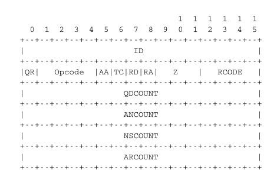

.. Copyright |copy| 2010 by Olivier Bonaventure
.. This file is licensed under a `creative commons licence <http://creativecommons.org/licenses/by/3.0/>`_

.. _DNS:

.. The Domain Name System

El Sistema de Nombres de Dominio
================================

.. In the early days of the Internet, there were only a few number of hosts (mainly minicomputers) connected to the network. The most popular applications were remote login and file transfer. By 1983, there were already five hundred hosts attached to the Internet. Each of these hosts were identified by a unique IPv4 address. Forcing human users to remember the IPv4 addresses of the remote hosts that they want to use was not user-friendly. Human users prefer to remember names, and use them when needed. Using names as aliases for addresses is a common technique in Computer Science. It simplifies the development of applications and allows the developer to ignore the low level details. For example, by using a programming language instead of writing machine code, a developer can write software without knowing whether the variables that it uses are stored in memory or inside registers. 

En los primeros días de la Internet, no había más que un pequeño número de nodos, o `hosts` (principalmente, minicomputadoras), conectados a la red. Las aplicaciones más populares fueron las de sesión remota (`remote login`) y transferencia de archivos (`file transfer`). En 1983 ya había unos quinientos hosts conectados. Cada uno de éstos se identificaba por una dirección IPv4 única. Forzar a los humanos a recordar las direcciones IPv4 de los hosts remotos que deseaban usar no era algo aceptable. Los humanos prefieren recordar nombres y usarlos cuando los necesitan. Usar nombres como pseudónimos, o `alias`, para direcciones, es una técnica usual en Ciencias de la Computación. Simplifica el desarrollo de aplicaciones y permite al desarrollador ignorar los detalles de bajo nivel. Por ejemplo, usando un lenguaje de programación en lugar de escribir código de máquina, el desarrollador puede escribir software sin saber si las variables usadas se almacenan en memoria o en registros de máquina.

.. Because names are at a higher level than addresses, they allow (both in the example of programming above, and on the Internet) to treat addresses as mere technical identifiers, which can change at will. Only the names are stable. On today's Internet, where switching to another ISP means changing your IP addresses, the user-friendliness of domain names is less important (they are not often typed by users) but their stability remains a very important, may be their most important property.

Como los nombres se encuentran a un nivel más alto que las direcciones, permiten tratar a las direcciones (tanto en el ejemplo de programación recién dado, como en la Internet) como meros identificadores técnicos que pueden cambiar a voluntad. Sólo los nombres son estables. En la Internet de hoy, donde cambiar de ISP implica cambiar de dirección IP, la amigabilidad de los nombres de dominio es menos importante (ya que los usuarios no los tipean con frecuencia) pero su estabilidad sigue siendo quizás su propiedad más importante.

.. index:: Network Information Center, hosts.txt

.. The first solution that allowed applications to use names was the :term:`hosts.txt` file. This file is similar to the symbol table found in compiled code. It contains the mapping between the name of each Internet host and its associated IP address [#fhosts]_. It was maintained by SRI International that coordinated the Network Information Center (NIC). When a new host was connected to the network, the system administrator had to register its name and IP address at the NIC. The NIC updated the :term:`hosts.txt` file on its server. All Internet hosts regularly retrieved the updated :term:`hosts.txt` file from the server maintained by SRI_. This file was stored at a well-known location on each Internet host (see :rfc:`952`) and networked applications could use it to find the IP address corresponding to a name. 

La primera solución que permitió a las aplicaciones usar nombres fue el archivo :term:`hosts.txt`. Este archivo es similar a la tabla de símbolos que se encuentra en el código compilado. Contiene el mapeo entre el nombre de cada host de Internet y su dirección IP asociada [#fhosts]_. Era mantenido por la organización SRI International (SRI_), que coordinaba el centro de información de la red (`Network Information Center`, NIC). Cuando se conectaba un nuevo host a la red, el administrador del sistema tenía que registrar su nombre y dirección IP en el NIC. El NIC actualizaba el archivo :term:`hosts.txt` en su servidor. Todos los hosts de Internet periódicamente extraían una copia del archivo :term:`hosts.txt` actualizado del servidor mantenido por SRI_. Este archivo era almacenado en una ubicación bien conocida en cada host de Internet (ver :rfc:`952`) y las aplicaciones de red podían usarlo para hallar la dirección IP correspondiente a un nombre.

.. A :term:`hosts.txt` file can be used when there are up to a few hundred hosts on the network. However, it is clearly not suitable for a network containing thousands or millions of hosts. A key issue in a large network is to define a suitable naming scheme. The ARPANet initially used a flat naming space, i.e. each host was assigned a unique name. To limit collisions between names, these names usually contained the name of the institution and a suffix to identify the host inside the institution (a kind of poor man's hierarchical naming scheme). On the ARPANet few institutions had several hosts connected to the network. 

Puede usarse un archivo :term:`hosts` cuando no hay más que unos pocos centenares de hosts en la red. Sin embargo, es claramente no recomendable para una red que contiene miles o millones de hosts. Un asunto clave en una red grande es cómo definir un esquema de nombres apropiado. ARPANet inicialmente usaba un espacio de nombres plano, es decir, a cada host se le asignaba un nombre único. Para limitar las colisiones entre nombres, estos nombres solían contener la denominación de la institución y un sufijo para identificar el host dentro de la institución (una suerte de esquema de nombres jerárquico precario). En ARPANet, pocas instituciones tenían varios hosts conectados a la red.

.. However, the limitations of a flat naming scheme became clear before the end of the ARPANet and :rfc:`819` proposed a hierarchical naming scheme. While :rfc:`819` discussed the possibility of organising the names as a directed graph, the Internet opted eventually for a tree structure capable of containing all names. In this tree, the top-level domains are those that are directly attached to the root. The first top-level domain was `.arpa` [#fdnstimeline]_. This top-level name was initially added as a suffix to the names of the hosts attached to the ARPANet and listed in the `hosts.txt` file. In 1984, the `.gov`, `.edu`, `.com`, `.mil` and `.org` generic top-level domain names were added and :rfc:`1032` proposed the utilisation of the two letter :term:`ISO-3166` country codes as top-level domain names. Since :term:`ISO-3166` defines a two letter code for each country recognised by the United Nations, this allowed all countries to automatically have a top-level domain. These domains include `.be` for Belgium, `.fr` for France, `.us` for the USA, `.ie` for Ireland or `.tv` for Tuvalu, a group of small islands in the Pacific and `.tm` for Turkmenistan. Today, the set of top-level domain-names is managed by the Internet Corporation for Assigned Names and Numbers (:term:`ICANN`). Recently, :term:`ICANN` added a dozen of generic top-level domains that are not related to a country and the `.cat` top-level domain has been registered for the Catalan language. There are ongoing discussions within :term:`ICANN` to increase the number of top-level domains.

Sin embargo, las limitaciones de un esquema plano de nombres se hicieron evidentes antes del fin del proyecto ARPANet, y el documento :rfc:`819` propuso un esquema de nombres jerárquico. Mientras que :rfc:`819` discutía la posibilidad de organizar los nombres como grafo dirigido, Internet eventualmente optó por una estructura de árbol capaz de contener todos los nombres. En este árbol, los dominios de más alto nivel (`top-level domains`, TLDs) son aquéllos que están directamente vinculados con la raíz. El primer `top-level domain` fue `.arpa`  [#fdnstimeline]_. Este TLD fue agregado inicialmente como sufijo a los nombres de los hosts conectados a ARPANet, y listados en el archivo `hosts.txt`. En 1984 se agregaron los TLD genéricos `.gov`, `.edu`, `.com`, `.mil` y `.org`; y :rfc:`1032` propuso la utilización de los códigos de país de dos letras :term:`ISO-3166` como TLDs. Como :term:`ISO-3166` define un código de dos letras para cada país reconocido por las Naciones Unidas, esto permitió a todos los países tener automáticamente un dominio top-level. Estos dominios incluyen `.ar` para Argentina, `.be` para Bélgica, `.fr` para Francia, `.us` para Estados Unidos, `.ie` para Irlanda y `.tv` para Tuvalu, un grupo de pequeñas islas en el Pacífico; y `.tm` para Turkmenistán. Hoy, el conjunto de TLDs es administrado por la organización :term:`ICANN` (`Internet Corporation for Assigned Names and Numbers`). Recientemente, :term:`ICANN` agregó una docena de TLD genéricos, que no tienen relación con un país, y se ha registrado el TLD `.cat` para el idioma catalán. Existen continuas discusiones en el seno de :term:`ICANN` para incrementar el número de TLDs.

.. Each top-level domain is managed by an organisation that decides how sub-domain names can be registered. Most top-level domain names use a first-come first served system, and allow anyone to register domain names, but there are some exceptions. For example, `.gov` is reserved for the US government, `.int` is reserved for international organisations and names in the `.ca` are mainly `reserved <http://en.wikipedia.org/wiki/.ca>`_ for companies or users who are present in Canada.

Cada dominio top-level está administrado por una organización que decide cómo se deben registrar los nombres de subdominios. La mayoría de los TLDs usan un esquema FCFS, y permiten que cualquiera registre nombres de dominio; pero hay algunas excepciones. Por ejemplo, `.gov` está reservado para el gobierno de los Estados Unidos, `.int` para organizaciones internacionales, y los nombres en `.ca` están principalmente `reservados <http://en.wikipedia.org/wiki/.ca>`_ para organizaciones o usuarios con presencia en Canadá.

.. figure:: png/app-fig-007-c.png
   :align: center
   :scale: 50 

   El árbol de nombres de dominio
..   The tree of domain names

.. :rfc:`1035` recommended the following :term:`BNF` for fully qualified
.. domain names, to allow host names with a syntax which works with all
.. applications (the domain names themselves have a much richer syntax).

:rfc:`1035` recomendó la siguiente :term:`BNF` para nombres de dominio plenamente calificados (`fully qualified domain names`, FQDN), para permitir nombres de host con una sintaxis que funcione con todas las aplicaciones (los nombres de dominio en sí tienen una sintaxis mucho más rica).

.. figure:: pkt/dns-bnf.png
   :align: center

   BNF de los nombres de host plenamente calificados
..   BNF of the fully qualified host names

.. This grammar specifies that a host name is an ordered list of labels separated by the dot (`.`) character. Each label can contain letters, numbers and the hyphen character (`-`) [#fidn]_. Fully qualified domain names are read from left to right. The first label is a hostname or a domain name followed by the hierarchy of domains and ending with the root implicitly at the right. The top-level domain name must be one of the registered TLDs [#ftld]_. For example, in the above figure, `www.whitehouse.gov` corresponds to a host named `www` inside the `whitehouse` domain that belongs to the `gov` top-level domain. `info.ucl.ac.be` corresponds to the `info` domain inside the `ucl` domain that is included in the `ac` sub-domain of the `be` top-level domain.

Esta gramática especifica que un nombre de host es una lista ordenada de rótulos separados por el carácter punto (`.`). Cada rótulo puede contener letras, números y el carácter guión (`-`) [#fidn]_. Los FQDN se leen de izquierda a derecha. El primer rótulo es un nombre de host o nombre de dominio, seguido por la jerarquía de dominios, y terminando con la raíz a la derecha. El TLD correspondiente debe ser uno de los TLDs registrados [#ftld]_. Por ejemplo, en la figura anterior, `www.whitehouse.gov` corresponde a un host llamado `www` dentro del dominio `whitehouse` que pertenece al TLD `gov`. Similarmente, `info.ucl.ac.be` corresponde al dominio `info` dentro de `ucl`, que a su vez está incluido en el subdominio `ac` del TLD `be`.

.. This hierarchical naming scheme is a key component of the Domain Name System (DNS). The DNS is a distributed database that contains mappings between fully qualified domain names and IP addresses. The DNS uses the client-server model. The clients are hosts that need to retrieve the mapping for a given name. Each :term:`nameserver` stores part of the distributed database and answers the queries sent by clients. There is at least one :term:`nameserver` that is responsible for each domain. In the figure below, domains are represented by circles and there are three hosts inside domain `dom` (`h1`, `h2` and `h3`) and three hosts inside domain `a.sdom1.dom`. As shown in the figure below, a sub-domain may contain both host names and sub-domains.

Este sistema de nombres jerárquico es un componente clave del `Sistema de Nombres de Dominio` (`Domain Name System`, DNS). El DNS es una base de datos distribuida que contiene mapeos entre FQDNs y direcciones IP. El DNS utiliza el modelo cliente-servidor. Los clientes son hosts que necesitan recuperar el mapeo para un nombre dado. Cada servidor de nombres (:term:`nameserver`) almacena parte de la base de datos distribuida, y responde las consultas enviadas por los clientes. Hay al menos un :term:`nameserver` que es responsable por cada dominio. En la figura siguiente, los dominios se representan como círculos; hay tres hosts dentro del dominio `dom` (`h1`, `h2` y `h3`) y tres hosts dentro del dominio `a.sdom1.dom`. Como se muestra en la figura, un subdominio puede contener a la vez nombres de hosts y otros subdominios.

.. figure:: png/app-fig-006-c.png
   :align: center
   :scale: 50 

   Un árbol simple de nombres de dominio
..   A simple tree of domain names

.. A :term:`nameserver` that is responsible for domain `dom` can directly answer the following queries :
 
..  - the IP address of any host residing directly inside domain `dom` (e.g. `h2.dom` in the figure above)
..  - the nameserver(s) that are responsible for any direct sub-domain of domain `dom` (i.e. `sdom1.dom` and `sdom2.dom` in the figure above, but not `z.sdom1.dom`)

Un :term:`nameserver` que es responsable por el dominio `dom` puede responder directamente las siguientes consultas:
 
 - La dirección IP de cualquier host que resida directamente dentro del dominio `dom` (por ejemplo, `h2.dom` en la figura anterior)
 - El o los servidores de nombres que son responsables por cualquier subdominio directo del dominio `dom` (es decir, `sdom1.dom` y `sdom2.dom` en la figura anterior, pero no `z.sdom1.dom`)

.. To retrieve the mapping for host `h2.dom`, a client sends its query to the name server that is responsible for domain `.dom`. The name server directly answers the query. To retrieve a mapping for `h3.a.sdom1.dom` a DNS client first sends a query to the name server that is responsible for the `.dom` domain. This nameserver returns the nameserver that is responsible for the `sdom1.dom` domain. This nameserver can now be contacted to obtain the nameserver that is responsible for the `a.sdom1.dom` domain. This nameserver can be contacted to retrieve the mapping for the `h3.a.sdom1.dom` name. Thanks to this organisation of the nameservers, it is possible for a DNS client to obtain the mapping of any host inside the `.dom` domain or any of its subdomains. To ensure that any DNS client will be able to resolve any fully qualified domain name, there are special nameservers that are responsible for the root of the domain name hierarchy. These nameservers are called :term:`root nameserver`. There are currently about a dozen root nameservers [#fdozen]_.   

Para obtener el mapeo para el host `h2.dom`, un cliente envía su consulta al servidor de nombres que es responsable por el dominio `.dom`. El servidor de nombres responde directamente la consulta. Para obtener un mapeo para `h3.a.sdom1.dom`, un cliente DNS primero envía una consulta al servidor de nombres responsable por el dominio `.dom`. Éste devuelve la dirección del servidor de nombres que es responsable por el dominio `sdom1.dom`. Este servidor ahora puede ser contactado para obtener la dirección del servidor que es responsable por el dominio `a.sdom1.dom`. Éste puede ser ahora contactado para obtener el mapeo de cualquier host dentro de `.dom` o cualquiera de sus subdominios. Para asegurar que cualquier cliente DNS sea capaz de resolver cualquier nombre plenamente calificado, hay servidores de nombres especiales que son responsables por la raíz de la jerarquía de nombres de dominio. Estos nameservers se llaman :term:`root nameserver` o servidores raíz. Existe actualmente alrededor de una docena de servidores de nombres raíz [#fdozen]_.   

.. Each root nameserver maintains the list [#froot]_ of all the nameservers that are responsible for each of the top-level domain names and their IP addresses [#frootv6]_. All root nameservers are synchronised and provide the same answers. By querying any of the root nameservers, a DNS client can obtain the nameserver that is responsible for any top-level-domain name. From this nameserver, it is possible to resolve any domain name. 

Cada servidor raíz mantiene la lista [#froot]_ de todos los nameservers que son responsables por cada uno de los TLDs y sus direcciones IP [#frootv6]_. Todos los servidores raíz están sincronizados y proveen las mismas respuestas. Consultando a cualquiera de los servidores raíz, un cliente DNS puede obtener la dirección del nameserver que es responsable por cualquier TLD. Desde este nameserver es posible resolver cualquier nombre de dominio.

.. To be able to contact the root nameservers, each DNS client must know their IP addresses. This implies, that DNS clients must maintain an up-to-date list of the IP addresses of the root nameservers [#fnamed.root]_. Without this list, it is impossible to contact the root nameservers. Forcing all Internet hosts to maintain the most recent version of this list would be difficult from an operational point of view. To solve this problem, the designers of the DNS introduced a special type of DNS server : the DNS resolvers. A :term:`resolver` is a server that provides the name resolution service for a set of clients. A network usually contains a few resolvers. Each host in these networks is configured to send all its DNS queries via one of its local resolvers. These queries are called `recursive queries` as the :term:`resolver` must recurse through the hierarchy of nameservers to obtain the `answer`. 

Para ser capaz de contactar a los nameservers raíz, cada cliente DNS debe conocer sus direcciones IP. Esto implica que los clientes DNS deben mantener una lista actualizada de las direcciones IP de los nameservers raíz [#fnamed.root]_. Sin esta lista, es imposible contactar a los nameservers raíz. Forzar a que todos los hosts mantengan la versión más reciente de esta lista sería difícil desde el punto de vista operativo. Para resolver este problema, los diseñadores de DNS introdujeron un tipo especial de servidor DNS: los `resolvers`. Un :term:`resolver` es un servidor que provee el servicio de resolución de nombres para un conjunto de clientes. Una red normalmente contiene unos pocos resolvers. Cada host en estas redes se configura para enviar todas sus consultas DNS a través de uno de sus resolvers locales. Estas consultas se llaman `consultas recursivas`, ya que el resolver debe recorrer recursivamente la jerarquía de nameservers para obtener la respuesta.

.. DNS resolvers have several advantages over letting each Internet host query directly nameservers. Firstly, regular Internet hosts do not need to maintain the up-to-date list of the IP addresses of the root servers. Secondly, regular Internet hosts do not need to send queries to nameservers all over the Internet. Furthermore, as a DNS resolver serves a large number of hosts, it can cache the received answers. This allows the resolver to quickly return answers for popular DNS queries and reduces the load on all DNS servers [JSBM2002]_.  

El uso de resolvers DNS presenta varias ventajas frente a la alternativa de permitir que cada host de Internet consulte directamente a los nameservers. En primer lugar, los hosts de Internet regulares no necesitan mantener actualizada la lista de direcciones IP de los servidores raíz. En segundo lugar, no necesitan enviar consultas a los nameservers atravesando toda la Internet. Finalmente, como un DNS resolver sirve a un gran número de hosts, puede colocar en cache las respuestas recibidas. Esto permite, al resolver, devolver rápidamente las respuestas a consultas DNS muy frecuentes, y reduce la carga sobre el conjunto de los servidores DNS [JSBM2002]_.  

.. The last component of the Domain Name System is the DNS protocol. The DNS protocol runs above both the datagram service and the bytestream services. In practice, the datagram service is used when short queries and responses are exchanged, and the bytestream service is used when longer responses are expected. In this section, we will only discuss the utilisation of the DNS protocol above the datagram service. This is the most frequent utilisation of the DNS.

El último componente del Sistema de Nombres de Dominio es el protocolo DNS. El protocolo DNS corre sobre ambos servicios, el de datagramas y el de flujo de bytes. En la práctica, el servicio de datagramas se usa cuando se intercambian consultas y respuestas cortas; y el de flujo de bytes, cuando se esperan respuestas más voluminosas. En esta sección discutiremos únicamente la utilización del protocolo DNS sobre el servicio de datagramas. Ésta es la forma de utilización más frecuente del DNS.

.. index:: DNS message format, formato de mensajes DNS

.. DNS messages are composed of five parts that are named sections in :rfc:`1035`. The first three sections are mandatory and the last two sections are optional. The first section of a DNS message is its `Header`. It contains information about the type of message and the content of the other sections. The second section contains the `Question` sent to the name server or resolver. The third section contains the `Answer` to the `Question`. When a client sends a DNS query, the `Answer` section is empty. The fourth section, named `Authority`, contains information about the servers that can provide an authoritative answer if required. The last section contains additional information that is supplied by the resolver or server but was not requested in the question.

Los mensajes DNS se componen de cinco partes, llamadas secciones (`Section`) en :rfc:`1035`. Las primeras tres secciones son obligatorias y las últimas dos opcionales. La primera sección de un mensaje DNS es su cabecera (`Header`). Contiene información sobre el tipo de mensaje y el contenido de las otras secciones. La segunda sección contiene la consulta (`Question`) enviada al servidor de nombres o resolver. La tercera sección contiene la respuesta (`Answer`) a la consulta. Cuando un cliente envía una consulta DNS, la sección `Answer` queda vacía. La cuarta sección, llamada autoridad (`Authority`), contiene información sobre los servidores que pueden proveer una respuesta autorizada (`authoritative`) si se requiere. La última sección contiene información adicional que es ofrecida por el resolver o servidor pero que no ha sido requerida en la consulta. 

.. The header of DNS messages is composed of 12 bytes and its structure is shown in the figure below.
La cabecera del mensaje DNS se compone de 12 bytes, y su estructura se muestra en la figura siguiente.

   Cabecera DNS
..   DNS header

.. The `ID` (identifier) is a 16-bits random value chosen by the client. When a client sends a question to a DNS server, it remembers the question and its identifier. When a server returns an answer, it returns in the `ID` field the identifier chosen by the client. Thanks to this identifier, the client can match the received answer with the question that it sent. 

El `ID` (identificador) es un valor aleatorio de 16 bits elegido por el cliente. Cuando un cliente envía una consulta a un servidor DNS, memoriza la consulta y su identificador. Cuando un servidor devuelve una respuesta, coloca en el campo `ID` el identificador elegido por el cliente. Gracias a este identificador el cliente puede aparear la respuesta recibida con la consulta que envió. 

.. dns attacks http://www.cs.columbia.edu/~smb/papers/dnshack.ps
.. http://unixwiz.net/techtips/iguide-kaminsky-dns-vuln.html
.. http://www.secureworks.com/research/articles/dns-cache-poisoning

.. The `QR` flag is set to `0` in DNS queries and `1` in DNS answers. The
.. `Opcode` is used to specify the type of query. For instance, a :term:`standard query` is when a client sends a `name` and the server returns the corresponding `data` and an update request is when the client sends a `name` and new `data` and the server then updates its database.

El flag `QR` se coloca a `0` en las consultas DNS y a `1` en las respuestas. El código de operación (`Opcode`) se usa para especificar el tipo de consulta. Por ejemplo, en una `consulta estándar` (:term:`standard query`), un cliente envía un nombre y el servidor devuelve los correspondientes datos; y en un `requerimiento de actualización` (`update request`), el cliente envía un nombre y nuevos datos, y el servidor entonces actualiza su base de datos.

.. The `AA` bit is set when the server that sent the response has `authority` for the domain name found in the question section. In the original DNS deployments, two types of servers were considered : `authoritative` servers and `non-authoritative` servers. The `authoritative` servers are managed by the system administrators responsible for a given domain. They always store the most recent information about a domain. `Non-authoritative` servers are servers or resolvers that store DNS information about external domains without being managed by the owners of a domain. They may thus provide answers that are out of date. From a security point of view, the `authoritative` bit is not an absolute indication about the validity of an answer. Securing the Domain Name System is a complex problem that was only addressed satisfactorily recently by the utilisation of cryptographic signatures in the DNSSEC extensions to DNS described in :rfc:`4033`. However, these extensions are outside the scope of this chapter. 

El bit `AA` se activa cuando el servidor que ha enviado la respuesta es `autorizado` para el nombre de dominio hallado en la sección de consulta. En las implantaciones DNS originales, se consideraban dos tipos de servidores: los autorizados (`authoritative`) y no autorizados (`non-authoritative`). Los servidores autorizados son gestionados por administradores de sistemas responsables por un dominio dado. Siempre almacenan la información más reciente sobre un dominio. Los no autorizados son servidores o resolvers que almacenan información de DNS sobre dominios externos, sin ser administrados por los propietarios del dominio. Así, pueden ofrecer respuestas que estén desactualizadas. Desde un punto de vista de la seguridad, el bit de `authoritative` no es una indicación absoluta sobre la validez de una respuesta. Segurizar el DNS es un problema complejo, que ha sido abordado satisfactoriamente sólo recientemente, con la utilización de signaturas criptográficas en las extensiones DNSSEC al DNS, según se describe en :rfc:`4033`. Sin embargo, estas extensiones quedan fuera del alcance de este capítulo.

.. The `RD` (recursion desired) bit is set by a client when it sends a query to a resolver. Such a query is said to be `recursive` because the resolver will recurse through the DNS hierarchy to retrieve the answer on behalf of the client. In the past, all resolvers were configured to perform recursive queries on behalf of any Internet host. However, this exposes the resolvers to several security risks. The simplest one is that the resolver could become overloaded by having too many recursive queries to process. As of this writing, most resolvers [#f8888]_ only allow recursive queries from clients belonging to their company or network and discard all other recursive queries. The `RA` bit indicates whether the server supports recursion. The `RCODE` is used to distinguish between different types of errors. See :rfc:`1035` for additional details. The last four fields indicate the size of the `Question`, `Answer`, `Authority` and `Additional` sections of the DNS message.

El bit `RD` o `recursion desired` ("se desea recursividad") es activado por un cliente cuando envía una consulta a un resolver. Esta consulta se llama recursiva porque el resolver recorrerá recursivamente la jerarquía DNS para obtener la respuesta en representación del cliente. En el pasado, todos los resolvers se configuraban para ejecutar consultas recursivas de parte de cualquier host de Internet. Sin embargo, esto expone a los resolvers a varios riesgos de seguridad. El más simple es que el resolver podría verse sobrecargado al tener demasiadas consultas recursivas para procesar. Actualmente, la mayoría de los resolvers [#f8888]_ sólo permiten consultas recursivas de clientes que pertenezcan a su organización o a su red, y descartan todas las demás consultas recursivas. El bit `RA` indica si el servidor soporta recursión. El código `RCODE` se usa para distinguir entre diferentes tipos de error. Ver :rfc:`1035` para más detalles. Los últimos cuatro campos indican el tamaño de las secciones `Question`, `Answer`, `Authority` y `Additional` en el mensaje DNS.

.. The last four sections of the DNS message contain `Resource Records` (RR).  All RRs have the same top level format shown in the figure below. 
Las cuatro últimas secciones del mensaje DNS contienen registros de recursos (`Resource Records`, RR).  Todos los RRs tienen el mismo formato de alto nivel que se muestra en la figura siguiente. 

.. figure:: pkt/dnsrr.png
   :align: center
   :scale: 100

   Registros de recursos DNS (RR)
..   DNS Resource Records

.. In a `Resource Record` (`RR`), the `Name` indicates the name of the node to which this resource record pertains. The two bytes `Type` field indicate the type of resource record. The `Class` field was used to support the utilisation of the DNS in other environments than the Internet. 

En un `Resource Record` (`RR`), el `nombre` (`Name`) indica el nombre del nodo al cual pertenece este registro de recurso. Los dos bytes del campo `tipo` (`Type`) indican el tipo de registro de recurso. El campo `clase` (`Class`) fue usado para soporta la utilización de DNS en otros ambientes que Internet.

.. The `TTL` field indicates the lifetime of the `Resource Record` in seconds. This field is set by the server that returns an answer and indicates for how long a client or a resolver can store the `Resource Record` inside its cache. A long `TTL` indicates a stable `RR`. Some companies use short `TTL` values for mobile hosts and also for popular servers. For example, a web hosting company that wants to spread the load over a pool of hundred servers can configure its nameservers to return different answers to different clients. If each answer has a small `TTL`, the clients will be forced to send DNS queries regularly. The nameserver will reply to these queries by supplying the address of the less loaded server.

El campo `TTL` indica el tiempo de vida del registro de recurso en segundos. Este campo es activado por el servidor que devuelve una respuesta, e indica por cuánto tiempo puede un cliente o un resolver almacenar el registro de recurso dentro de su cache. Un `TTL` largo indica un registro de recurso estable. Algunas organizaciones emplean valores `TTL` cortos para hosts móviles, y también para servers populares. Por ejemplo, una compañía de `hosting` que desea distribuir la carga sobre un `pool` de cien servidores puede configurar sus servidores de nombres para devolver diferentes respuestas a diferentes clientes. Si cada respuesta tiene un `TTL` pequeño, los clientes se verán forzados a enviar nuevas consultas DNS periódicamente. El nameserver responderá a estas consultas con la dirección del servidor que se halle menos cargado.

.. The `RDLength` field is the length of the `RData` field that contains the information of the type specified in the `Type` field.
El campo `RDLength` es la longitud del campo `RData` que contiene la información del tipo especificada en el campo `Type`.

.. Several types of DNS RR are used in practice. The `A` type is used to encode the IPv4 address that corresponds to the specified name. The `AAAA` type is used to encode the IPv6 address that corresponds to the specified name. A `NS` record contains the name of the DNS server that is responsible for a given domain. For example, a query for the `A` record associated to the `www.ietf.org` name returns the following answer.

En la práctica se usan varios tipos de RR. El tipo `A` se usa para codificar la dirección IPv4 que corresponde al nombre especificado. El tipo `AAAA` se usa para codificar la dirección IPv6 que corresponde al nombre especificado. Un registro `NS` contiene el nombre del servidor DNS que es responsable por un dominio dado. Por ejemplo, una consulta por el registro `A` asociado al nombre `www.ietf.org` devuelve la siguiente respuesta.

.. figure:: pkt/www-ietf-org.png
   :align: center

   Consulta por el registro `A` de `www.ietf.org` 
..   Query for the `A` record of `www.ietf.org` 

.. This answer contains several pieces of information. First, the name `www.ietf.org` is associated to IP address `64.170.98.32`. Second, the `ietf.org` domain is managed by six different nameservers. Three of these nameservers are reachable via IPv4 and IPv6. Two of them are not reachable via IPv6 and `ns0.ietf.org` is only reachable via IPv6. A query for the `AAAA` record associated to `www.ietf.org` returns `2001:1890:1112:1::20` and the same authority and additional sections.

Esta respuesta contiene varias piezas de información. Primero, el nombre `www.ietf.org` se asocia a la dirección IP `64.170.98.32`. Segundo, el dominio `ietf.org` está administrado por seis diferentes nameservers. Tres de estos son alcanzables mediante IPv4 y IPv6. Dos de ellos no son alcanzables mediante IPv6, y `ns0.ietf.org` sólo es alcanzable mediante IPv6. Una consulta por el registro `AAAA` asociado a `www.ietf.org` devuelve `2001:1890:1112:1::20` y las mismas secciones autoridad y adicionales.

.. `CNAME` (or canonical names) are used to define aliases. For example `www.example.com` could be a `CNAME` for `pc12.example.com` that is the actual name of the server on which the web server for `www.example.com` runs. 

Los nombres canónicos (`canonical names`, `CNAMEs`) se usan para definir pseudónimos, o `alias`. Por ejemplo, `www.example.com` podría ser un `CNAME` para `pc12.example.com`, que es el nombre real del host en el cual corre el servidor de web para `www.example.com`. 

.. .. note:: Reverse DNS and in-addr.arpa

.. The DNS is mainly used to find the IP address that correspond to a given name. However, it is sometimes useful to obtain the name that corresponds to an IP address. This done by using the `PTR` (`pointer`) `RR`. The `RData` part of a `PTR` `RR` contains the name while the `Name` part of the `RR` contains the IP address encoded in the `in-addr.arpa` domain. IPv4 addresses are encoded in the `in-addr.arpa` by reversing the four digits that compose the dotted decimal representation of the address. For example, consider IPv4 address `192.0.2.11`. The hostname associated to this address can be found by requesting the `PTR` `RR` that corresponds to `11.2.0.192.in-addr.arpa`. A similar solution is used to support IPv6 addresses, see :rfc:`3596`.

.. note:: DNS reverso e in-addr.arpa

 El DNS se usa principalmente para encontrar la dirección IP que corresponde a un nombre dado. Sin embargo, a veces es útil obtener el nombre que corresponde a una dirección IP. Esto se hace usando el registro de recurso `PTR`. La parte `RData` de un RR de tipo PTR contiene el nombre, mientras que la parte `Name` del `RR` contiene la dirección IP codificada en el dominio `in-addr.arpa`. Las direcciones IPv4 están codificadas en `in-addr.arpa` invirtiendo los cuatro números que componen la notación decimal con punto de la dirección. Por ejemplo, consideremos la dirección IPv4 `192.0.2.11`. El nombre de host asociado con esta dirección puede hallarse consultando el `RR` `PTR` que corresponde a `11.2.0.192.in-addr.arpa`. Existe una solución similar para soportar direcciones IPv6; véase :rfc:`3596`.

.. An important point to note regarding the Domain Name System is its extensibility. Thanks to the `Type` and `RDLength` fields, the format of the Resource Records can easily be extended. Furthermore, a DNS implementation that receives a new Resource Record that it does not understand can ignore the record while still being able to process the other parts of the message. This allows, for example, a DNS server that only supports IPv4 to ignore the IPv6 addresses listed in the DNS reply for `www.ietf.org` while still being able to correctly parse the Resource Records that it understands. This extensibility allowed the Domain Name System to evolve over the years while still preserving the backward compatibility with already deployed DNS implementations.

Un punto importante a notar respecto del DNS es su extensibilidad. Gracias a los campos `Type` y `RDLength`, el formato de los registros de recursos puede ser fácilmente extendido. Más aún, una implementación que reciba un nuevo registro de recurso que no comprenda, puede ignorarlo y todavía ser capaz de procesar las demás partes del mensaje. Esto permite, por ejemplo, que un servidor DNS que sólo soporta IPv4, ignore las direcciones IPv6 listadas en la respuesta DNS a la consulta `www.ietf.org`, al tiempo que sigue siendo capaz de analizar correctamente los registros de recursos que comprende. Esta extensibilidad ha permitido al Sistema de Nombres de Dominio evolucionar a través de los años y a la vez preservar la compatibilidad hacia atrás con implementaciones DNS ya implantadas. 

.. rubric:: Footnotes

.. .. [#fhosts] The :term:`hosts.txt` file is not maintained anymore. A historical snapshot retrieved on April 15th, 1984 is available from http://ftp.univie.ac.at/netinfo/netinfo/hosts.txt
.. [#fhosts] El archivo :term:`hosts.txt` ya no es mantenido. Se puede ver una imagen histórica obtenida el 15 de Abril de 1984 en http://ftp.univie.ac.at/netinfo/netinfo/hosts.txt.

.. .. [#fdnstimeline] See http://www.donelan.com/dnstimeline.html for a time line of DNS related developments. 
.. [#fdnstimeline] Véase en http://www.donelan.com/dnstimeline.html una historia de los desarrollos relacionados con DNS. 

.. .. [#fidn] This specification evolved later to support domain names written by using other character sets than us-ASCII :rfc:`5890`. This extension is important to support languages other than English, but a detailed discussion is outside the scope of this document.
.. [#fidn] Esta especificación evolucionó luego hasta soportar nombres de dominio escritos usando otros caracteres que los del conjunto us-ASCII :rfc:`5890`. Esta extensión es importante para soportar otros idiomas que el inglés, pero su discusión detallada escapa al alcance de este documento.

.. .. [#ftld] The official list of top-level domain names is maintained by :term:`IANA at http://data.iana.org/TLD/tlds-alpha-by-domain.txt Additional information about these domains may be found at http://en.wikipedia.org/wiki/List_of_Internet_top-level_domains
.. [#ftld] La lista oficial de TLDs es mantenida por  :term:`IANA` en http://data.iana.org/TLD/tlds-alpha-by-domain.txt. Puede hallarse información adicional sobre estos dominios en http://en.wikipedia.org/wiki/List_of_Internet_top-level_domains.

.. .. [#froot] A copy of the information maintained by each root nameserver is available at http://www.internic.net/zones/root.zone
.. [#froot] Existe una copia de la información mantenida por cada servidor de nombres raíz disponible en http://www.internic.net/zones/root.zone.

.. .. [#frootv6] Until February 2008, the root DNS servers only had IPv4 addresses. IPv6 addresses were added to the root DNS servers slowly to avoid creating problems as discussed in http://www.icann.org/en/committees/security/sac018.pdf In 2010, several DNS root servers are still not reachable by using IPv6. 
.. [#frootv6] Hasta Febrero de 2008, los servidores DNS raíz sólo tenían direcciones IPv4. Las direcciones IPv6 fueron agregadas lentamente para evitar crear problemas, como se menciona en http://www.icann.org/en/committees/security/sac018.pdf . En 2010, varios servidores DNS raíz aún no son alcanzables usando IPv6.

.. .. [#fnamed.root] The current list of the IP addresses of the root nameservers is maintained at http://www.internic.net/zones/named.root . These IP addresses are stable and root nameservers seldom change their IP addresses. DNS resolvers must however maintain an up-to-date copy of this file. 
.. [#fnamed.root] La lista actual de direcciones IP de los nameservers raíz se mantiene en http://www.internic.net/zones/named.root . Estas direcciones IP son estables, y los nameservers raíz raramente cambian sus direcciones. Los resolvers DNS, sin embargo, deben mantener una copia actualizada de este archivo.

.. .. [#fdozen] There are currently 13 root servers. In practice, some of these root servers are themselves implemented as a set of distinct physical servers. See http://www.root-servers.org/ for more information about the physical location of these servers. 
.. [#fdozen] Hay actualmente trece servidores raíz. En la práctica, algunos de estos están implementados como un conjunto de distintos servidores físicos. Véase http://www.root-servers.org/ para mayor información sobre la ubicación física de estos servidores. 

.. .. [#f8888] Some DNS resolvers allow any host to send queries. OpenDNS_ and GoogleDNS_ are example of open resolvers.
.. [#f8888] Algunos resolvers DNS permiten enviar consultas a cualquier host. OpenDNS_ y GoogleDNS_ son ejemplos de resolvers abiertos.

.. include:: /links.rst
