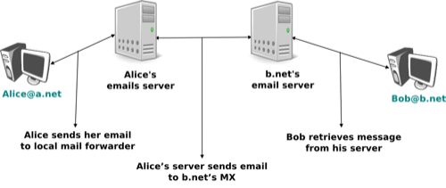
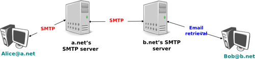

.. Copyright |copy| 2010 by Olivier Bonaventure
.. This file is licensed under a `creative commons licence <http://creativecommons.org/licenses/by-sa/3.0/>`_

.. _Email:

Correo Electrónico
==================

.. Electronic mail, or email, is a very popular application in computer networks such as the Internet. Email `appeared <http://openmap.bbn.com/~tomlinso/ray/firstemailframe.html>`_ in the early 1970s and allows users to exchange text based messages. Initially, it was mainly used to exchange short messages, but over the years its usage has grown. It is now not only used to exchange small, but also long messages that can be composed of several parts as we will see later. 
El correo electrónico, o email, es una aplicación muy popular en las redes de computadoras como la Internet. El email `apareció <http://openmap.bbn.com/~tomlinso/ray/firstemailframe.html>`_ a principios de los 70, permitiendo a los usuarios intercambiar mensajes de texto. Al principio se usó principalmente para intercambiar mensajes cortos, pero como veremos luego, también es posible tratar con mensajes largos, que pueden estar compuestos por varias partes.

.. Before looking at the details of Internet email, let us consider a simple scenario illustrated in the figure below, where Alice sends an email to Bob. Alice prepares her email by using an `email clients`_ and sends it to her email server. Alice's `email server <http://en.wikipedia.org/wiki/Comparison_of_mail_servers>`_ extracts Bob's address from the email and delivers the message to Bob's server. Bob retrieves Alice's message on his server and reads it by using his favourite email client or through his webmail interface. 

Antes de analizar los detalles del email en Internet, consideremos un escenario simple como el ilustrado en la figura siguiente, donde Alice envía un email a Bob. Alice prepara su email usando un `cliente de email`_ y lo envía a su servidor de email. El `servidor de email <http://en.wikipedia.org/wiki/Comparison_of_mail_servers>`_ de Alice extrae del email la dirección de Bob, y lo envía al servidor de Bob. Éste recupera el mensaje de Alice de su servidor, y lo lee usando su cliente de email favorito, o a través de una interfaz de webmail.

   Arquitectura simplificada del email en Internet
..   Simplified architecture of the Internet email 

.. The email system that we consider in this book is composed of four components :

.. - a message format, that defines how valid email messages are encoded 
.. - protocols, that allow hosts and servers to exchange email messages
.. - client software, that allows users to easily create and read email messages
.. - software, that allows servers to efficiently exchange email messages

El sistema de email que consideramos en este libro consta de cuatro componentes:

 - Un formato de mensajes, que define cómo se codifican los mensajes de email válidos
 - Protocolos que permiten a los hosts y a los servidores intercambiar mensajes de email
 - Software cliente, que permite a los usuarios fácilmente crear y leer mensajes de email
 - Software que permite a los servidores intercambiar eficientemente mensajes de email

.. We will first discuss the format of email messages followed by the protocols that are used on today's Internet to exchange and retrieve emails. Other email systems have been developed in the past [Bush1993]_ [Genilloud1990]_ [GC2000]_, but today most email solutions have migrated to the Internet email. Information about the software that is used to compose and deliver emails may be found on wikipedia_ among others, for both `email clients`_ and `email servers <http://en.wikipedia.org/wiki/Comparison_of_mail_servers>`_. More detailed information about the full Internet Mail Architecture may be found in :rfc:`5598`.

Discutiremos primero el formato de los mensajes de email, seguido de los protocolos que se usan hoy en Internet para intercambiar y recuperar emails. Han sido desarrollados otros sistemas en el pasado [Bush1993]_ [Genilloud1990]_ [GC2000]_, pero hoy la mayoría de las soluciones de email han sido migradas al email de Internet. Puede hallarse información sobre el software que se usa para componer y entregar email en wikipedia_, entre otros, para `clientes de email`_ y `servidores de email <http://en.wikipedia.org/wiki/Comparison_of_mail_servers>`_. Se puede encontrar más información sobre la arquitectura del correo electrónico en Internet en :rfc:`5598`.

.. index:: email message format, formato de mensajes de email

.. Email messages, like postal mail, are composed of two parts :

..  - a `header` that plays the same role as the letterhead in regular mail. It contains metadata about the message.
.. - the `body` that contains the message itself.  

Los mensajes de email, como el correo postal, se componen de dos partes:

 - Una `cabecera` que juega el mismo rol que el membrete en el correo regular. Contiene metadatos acerca del mensaje.
 - El `cuerpo` que contiene el mensaje en sí mismo.

.. Email messages are entirely composed of lines of ASCII characters. Each line can contain up to 998 characters and is terminated by the `CR` and `LF` control characters :rfc:`5322`. The lines that compose the `header` appear before the message `body`. An empty line, containing only the `CR` and `LF` characters, marks the end of the `header`. This is illustrated in the figure below.

Los mensajes de email se componen enteramente de líneas de caracteres ASCII. Cada línea puede contener hasta 998 caracteres y está terminada por los caracteres de control `CR` y `LF` (:rfc:`5322`). Las líneas que componen la `cabecera` aparecen antes del `cuerpo` del mensaje. El fin de la cabecera se marca con una línea vacía, conteniendo únicamente caracteres `CR` y `LF`. Esto queda ilustrado en la figura siguiente.

.. abnf crocker : :rfc:`5234`

.. figure:: png/app-fig-010-c.png
   :align: center
   :scale: 50 

   La estructura de los mensajes de email
..   The structure of email messages

.. The email header contains several lines that all begin with a keyword followed by a colon and additional information. The format of email messages and the different types of header lines are defined in :rfc:`5322`. Two of these header lines are mandatory and must appear in all email messages :

La cabecera del email contiene varias líneas que comienzan con una palabra seguida de dos puntos, con información adicional. El formato de los mensajes de email y de los diferentes tipos de líneas de cabecera se definen en :rfc:`5322`. Dos de estas líneas de cabecera son obligatorias, y deben aparecer en todos los mensajes de email:

.. - The sender address. This header line starts with `From:`. This contains the (optional) name of the sender followed by its email address between `<` and `>`. Email addresses are always composed of a username followed by the `@` sign and a domain name.
.. - The date. This header line starts with `Date:`. :rfc:`5322` precisely defines the format used to encode a date.

 - La dirección del emisor. Esta línea de cabecera comienza con `From:`. Ésta contiene, opcionalmente, el nombre del emisor seguido de su dirección de email entre símbolos `<` y `>`. Las direcciones de email siempre se componen de un nombre de usuario seguido del signo `@` y un nombre de dominio. 
 - La fecha. Esta línea de cabecera comienza con `Date:`. :rfc:`5322` define con precisión el formato utilizado para codificar una fecha.

.. Other header lines appear in most email messages. The `Subject:` header line allows the sender to indicate the topic discussed in the email. Three types of header lines can be used to specify the recipients of a message :

.. - the `To:` header line contains the email addresses of the primary recipients of the message [#fto]_ . Several addresses can be separated by using commas.
.. - the `cc:` header line is used by the sender to provide a list of email addresses that must receive a carbon copy of the message. Several addresses can be listed in this header line, separated by commas. All recipients of the email message receive the `To:` and `cc:` header lines. 
.. - the `bcc:` header line is used by the sender to provide a list of comma separated email addresses that must receive a blind carbon copy of the message. The `bcc:` header line is not delivered to the recipients of the email message. 

Hay otras líneas de cabecera que aparecen en la mayoría de los mensajes de email. La línea `Subject:` permite que el emisor indique el asunto que se discute en el email. Hay tres tipos de líneas de cabecera que se pueden usar para especificar los destinatarios de un mensaje:

 - La línea `To:` contiene la dirección de email de los destinatarios primarios del mensaje [#ftoline]_. Se pueden separar varias direcciones usando comas.
 - La línea `cc:` es usada por el emisor para proveer una lista de direcciones de email que deben recibir una copia en carbónico del mensaje. Se pueden listar varias direcciones en esta línea, separadas por comas. Todos los destinatarios del mensaje de email reciben las líneas `To:` y `cc:`. 
 - La línea `cc:` es usada por el emisor para proveer una lista de direcciones de email que deben recibir una copia carbónico oculta del mensaje. La línea `bcc:` no es enviada a los destinatarios del mensaje de email.

.. A simple email message containing the `From:`, `To:`, `Subject:` and `Date:` header lines and two lines of body is shown below.

A continuación se muestra un mensaje de email simple conteniendo las líneas de cabecera `From:`, `To:`, `Subject:` y `Date:`.

.. .. code-block:: text
.. 
.. From: Bob Smith <Bob@machine.example>
.. To: Alice Doe <alice@example.net>, Alice Smith <Alice@machine.example>
.. Subject: Hello
.. Date: Mon, 8 Mar 2010 19:55:06 -0600
.. 
.. This is the "Hello world" of email messages.
.. This is the second line of the body
.. 
.. code-block:: text

 From: Bob Smith <Bob@machine.example>
 To: Alice Doe <alice@example.net>, Alice Smith <Alice@machine.example>
 Subject: Hola
 Date: Mon, 8 Mar 2010 19:55:06 -0600
 
 Este es el "Hola Mundo" de los mensajes de email.
 Esta es la segunda linea del cuerpo.

.. Note the empty line after the `Date:` header line; this empty line contains only the `CR` and `LF` characters, and marks the boundary between the header and the body of the message.

Nótese la línea vacía luego de la línea `Date:`; esta línea vacía contiene únicamente los caracteres `CR` y `LF`, y marca la frontera entre la cabecera y el cuerpo del mensaje.

.. Several other optional header lines are defined in :rfc:`5322` and elsewhere [#femailheaders]_. Furthermore, many email clients and servers define their own header lines starting from `X-`. Several of the optional header lines defined in :rfc:`5322` are worth being discussed here :

.. - the `Message-Id:` header line is used to associate a "unique" identifier to each email. Email identifiers are usually structured like `string@domain` where `string` is a unique character string or sequence number chosen by the sender of the email and `domain` the domain name of the sender. Since domain names are unique, a host can generate globally unique message identifiers concatenating a locally unique identifier with its domain name.
.. - the `In-reply-to:` is used when a message was created in reply to a previous message. In this case, the end of the `In-reply-to:` line contains the identifier of the original message.
.. - the `Received:` header line is used when an email message is processed by several servers before reaching its destination. Each intermediate email server adds a `Received:` header line. These header lines are useful to debug problems in delivering email messages.

Se definen varias otras líneas de cabecera en :rfc:`5322` y en otros lugares [#femailheaders]_. Además, muchos clientes y servidores de email definen sus propias líneas de cabecera comenzando con `X-`. Vale la pena aquí discutir algunas de las líneas de cabecera opcionales definidas en :rfc:`5322`.

 - La línea `Message-Id:` se usa para asociar un identificador único con cada email. Los identificadores se estructuran generalmente en la forma `cadena@dominio`, donde `cadena` es una secuencia única de caracteres, o un número de secuencia, elegido por el emisor del email, y `dominio` es el nombre de dominio del emisor. Como los nombres de dominio son únicos, un host puede generar identificadores de mensajes globalmente únicos, concatenando un identificador localmente único con su propio nombre de dominio.
 - La línea `In-reply-to:` se usa cuando un mensaje ha sido creado en respuesta a un mensaje previo. En este caso, el final de la línea `In-reply-to:` contiene el identificador del mensaje original.
 - La línea `Received:` se usa cuando un mensaje de email es procesado por varios servidores antes de alcanzar su destino final. Cada servidor intermedio agrega una línea de cabecera `Received:`. Estas líneas son útiles para depurar problemas en la entrega de mensajes de email.

.. The figure below shows the header lines of one email message. The message originated at a host named `wira.firstpr.com.au` and was received by `smtp3.sgsi.ucl.ac.be`. The `Received:` lines have been wrapped for readability.

La figura siguiente muestra las líneas de cabecera de un mensaje de email. El mensaje fue originado en un host llamado `wira.firstpr.com.au` y fue recibido por `smtp3.sgsi.ucl.ac.be`. Las líneas `Received:` se han plegado para mayor legibilidad.

.. code-block:: text

 Received: from smtp3.sgsi.ucl.ac.be (Unknown [10.1.5.3])
     by mmp.sipr-dc.ucl.ac.be
     (Sun Java(tm) System Messaging Server 7u3-15.01 64bit (built Feb 12 2010))
     with ESMTP id <0KYY00L85LI5JLE0@mmp.sipr-dc.ucl.ac.be>; Mon,
     08 Mar 2010 11:37:17 +0100 (CET)
 Received: from mail.ietf.org (mail.ietf.org [64.170.98.32])
     by smtp3.sgsi.ucl.ac.be (Postfix) with ESMTP id B92351C60D7; Mon,
     08 Mar 2010 11:36:51 +0100 (CET)
 Received: from [127.0.0.1] (localhost [127.0.0.1])	by core3.amsl.com (Postfix)
     with ESMTP id F066A3A68B9; Mon, 08 Mar 2010 02:36:38 -0800 (PST)
 Received: from localhost (localhost [127.0.0.1])	by core3.amsl.com (Postfix)
     with ESMTP id A1E6C3A681B	for <rrg@core3.amsl.com>; Mon,
     08 Mar 2010 02:36:37 -0800 (PST)
 Received: from mail.ietf.org ([64.170.98.32])
     by localhost (core3.amsl.com [127.0.0.1]) (amavisd-new, port 10024)
     with ESMTP id erw8ih2v8VQa for <rrg@core3.amsl.com>; Mon,
     08 Mar 2010 02:36:36 -0800 (PST)
 Received: from gair.firstpr.com.au (gair.firstpr.com.au [150.101.162.123])
     by core3.amsl.com (Postfix) with ESMTP id 03E893A67ED	for <rrg@irtf.org>; Mon,
     08 Mar 2010 02:36:35 -0800 (PST)
 Received: from [10.0.0.6] (wira.firstpr.com.au [10.0.0.6])
     by gair.firstpr.com.au (Postfix) with ESMTP id D0A49175B63; Mon,
     08 Mar 2010 21:36:37 +1100 (EST)
 Date: Mon, 08 Mar 2010 21:36:38 +1100
 From: Robin Whittle <rw@firstpr.com.au>
 Subject: Re: [rrg] Recommendation and what happens next
 In-reply-to: <C7B9C21A.4FAB%tony.li@tony.li>
 To: RRG <rrg@irtf.org>
 Message-id: <4B94D336.7030504@firstpr.com.au>
 
 Message content removed

.. Initially, email was used to exchange small messages of ASCII text between computer scientists. However, with the growth of the Internet, supporting only ASCII text became a severe limitation for two reasons. First of all, non-English speakers wanted to write emails in their native language that often required more characters than those of the ASCII character table. Second, many users wanted to send other content than just ASCII text by email such as binary files, images or sound. 

En sus comienzos, el email sólo era usado por los informáticos para intercambiar pequeños mensajes de texto ASCII. Sin embargo, con el crecimiento de Internet, soportar únicamente texto ASCII se volvió una limitación severa, por dos razones. Primero, los hablantes nativos de otros idiomas que el inglés querían escribir emails en su lengua, que a veces requería más caracteres que los presentes en la tabla ASCII. Segundo, muchos usuarios querían enviar otros contenidos además de texto ASCII, por email, tales como archivos binarios, imágenes o sonido.

.. index Multipurpose Internet Mail Extensions, MIME

.. To solve this problem, the IETF_ developed the Multipurpose Internet Mail Extensions (:term:`MIME`). These extensions were carefully designed to allow Internet email to carry non-ASCII characters and binary files without breaking the email servers that were deployed at that time. This requirement for backward compatibility forced the MIME designers to develop extensions to the existing email message format :rfc:`822` instead of defining a completely new format that would have been better suited to support the new types of emails. 

Para resolver este problema, IETF_ desarrolló el estándar :term:`MIME` (`Multipurpose Internet Mail Extensions`). Estas extensiones fueron diseñadas para permitir que el email en Internet transportara caracteres no ASCII y archivos binarios, sin alterar el funcionamiento de los servidores de email que estaban implantados por aquel momento. Este requerimiento de compatibilidad hacia atrás forzó a los diseñadores de MIME a desarrollar extensiones al formato de mensajes de email existente, :rfc:`822`, en lugar de definir un formato completamente nuevo que se hubiera prestado mejor a soportar los nuevos tipos de email.

.. :rfc:`2045` defines three new types of header lines to support MIME :
.. - The `MIME-Version:` header indicates the version of the MIME specification that was used to encode the email message. The current version of MIME is 1.0. Other versions of MIME may be defined in the future. Thanks to this header line, the software that processes email messages will be able to adapt to the MIME version used to encode the message. Messages that do not contain this header are supposed to be formatted according to the original :rfc:`822` specification.
.. - The `Content-Type:` header line indicates the type of data that is carried inside the message (see below)
.. - The `Content-Transfer-Encoding:` header line is used to specify how the message has been encoded. When MIME was designed, some email servers were only able to process messages containing characters encoded using the 7 bits ASCII character set. MIME allows the utilisation of other character encodings. 
:rfc:`2045` define tres nuevos tipos de líneas de cabecera para soportar el estándar MIME:  

 - La cabecera `MIME-Version:` indica la versión de la especificación MIME que fue usada para codificar el mensaje de email. La versión actual de MIME es 1.0. Pueden definirse otras versiones en un futuro. Gracias a esta línea de cabecera, el software que procesa los mensajes de email será capaz de adaptarse a la versión MIME que se use para codificar el mensaje. Los mensajes que no contengan esta cabecera se suponen acordes a la especificación :rfc:`822` original. 
 - La línea `Content-Type:` indica el tipo de datos que se transporta dentro del mensaje (ver más abajo).
 - La línea `Content-Transfer-Encoding:` se usa para especificar cómo ha sido codificado el mensaje. Cuando se diseñó MIME, algunos servidores sólo eran capaces de procesar mensajes conteniendo caracteres codificados usando los siete bits del conjunto de caracteres ASCII. MIME permite la utilización de otras codificaciones de caracteres.

.. Inside the email header, the `Content-Type:` header line indicates how the MIME email message is structured. :rfc:`2046` defines the utilisation of this header line. The two most common structures for MIME messages are :

.. - `Content-Type: multipart/mixed`. This header line indicates that the MIME message contains several independent parts. For example, such a message may contain a part in plain text and a binary file.
.. - `Content-Type: multipart/alternative`. This header line indicates that the MIME message contains several representations of the same information. For example, a `multipart/alternative` message may contain both a plain text and an HTML version of the same text. 
Dentro de la cabecera de email, la línea `Content-Type:` indica cómo se estructura el mensaje de email MIME. La utilización de esta línea se define en :rfc:`2046`. Las dos estructuras más comunes para los mensajes MIME son:

 - `Content-Type: multipart/mixed`. Esta línea indica que el mensaje MIME contiene varias partes, independientes. Por ejemplo, un mensaje así puede contener una parte en texto plano y un archivo binario.
 - `Content-Type: multipart/alternative`. Esta línea indica que el mensaje MIME contiene varias representaciones de la misma información. Por ejemplo, un texto plano y una versión HTML del mismo texto. 

.. To support these two types of MIME messages, the recipient of a message must be able to extract the different parts from the message. In :rfc:`822`, an empty line was used to separate the header lines from the body. Using an empty line to separate the different parts of an email body would be difficult as the body of email messages often contains one or more empty lines. Another possible option would be to define a special line, e.g. `*-LAST_LINE-*` to mark the boundary between two parts of a MIME message. Unfortunately, this is not possible as some emails may contain this string in their body (e.g. emails sent to students to explain the format of MIME messages). To solve this problem, the `Content-Type:` header line contains a second parameter that specifies the string that has been used by the sender of the MIME message to delineate the different parts. In practice, this string is often chosen randomly by the mail client.

Para soportar estos dos tipos de mensajes MIME, el receptor de un mensaje debe ser capaz de extraer sus diferentes partes. En :rfc:`822`, se usaba una línea vacía para separar la cabecera del cuerpo. Usar la misma técnica para separar las diferentes partes del cuerpo de un email resultaría difícil, ya que el cuerpo de los mensajes de email con frecuencia contiene una o más líneas en blanco. Otra opción podría ser definir una línea con un contenido especial, como por ejemplo, `*-LAST_LINE-*`, para marcar los límites entre dos partes de un mensaje MIME. Desafortunadamente, esto no es posible ya que algunos emails pueden contener esta cadena en su cuerpo (por ejemplo, un email enviado a un estudiante explicando el formato de los mensajes MIME). Para resolver este problema, la línea de cabecera `Content-Type:` contiene un segundo parámetro que especifica la cadena que ha sido usada por el emisor del mensaje MIME para delimitar las diferentes partes. En la práctica, esta cadena suele ser elegida aleatoriamente por el cliente de email.

.. The email message below, copied from :rfc:`2046` shows a MIME message containing two parts that are both in plain text and encoded using the ASCII character set. The string `simple boundary` is defined in the `Content-Type:` header as the marker for the boundary between two successive parts. Another example of MIME messages may be found in :rfc:`2046`.

El mensaje de email siguiente, tomado de :rfc:`2046`, muestra un mensaje MIME conteniendo dos partes, que están en texto plano y codificados usando el conjunto de caracteres ASCII. En la cabecera `Content-Type:` se define la cadena `frontera` como el marcador del límite entre dos partes sucesivas. En el mismo documento se hallan otros ejemplos de mensajes MIME.

.. code-block:: text

 Date: Mon, 20 Sep 1999 16:33:16 +0200
 From: Nathaniel Borenstein <nsb@bellcore.com>
 To: Ned Freed <ned@innosoft.com>
 Subject: Prueba
 MIME-Version: 1.0
 Content-Type: multipart/mixed; boundary="frontera"
 
 Preambulo, puede ignorarse
 
 --frontera
 Content-Type: text/plain; charset=us-ascii
 
 Primera parte
 
 --frontera
 Content-Type: text/plain; charset=us-ascii
 
 Segunda parte
 --frontera

.. The `Content-Type:` header can also be used inside a MIME part. In this case, it indicates the type of data placed in this part. Each data type is specified as a type followed by a subtype. A detailed description may be found in :rfc:`2046`. Some of the most popular `Content-Type:` header lines are :

.. - `text`. The message part contains information in textual format. There are several subtypes : `text/plain` for regular ASCII text, `text/html` defined in :rfc:`2854` for documents in :term:`HTML` format or the `text/enriched` format defined in :rfc:`1896`. The `Content-Type:` header line may contain a second parameter that specifies the character set used to encode the text. `charset=us-ascii` is the standard ASCII character table.  Other frequent character sets include `charset=UTF8` or `charset=iso-8859-1`. The `list of standard character sets <http://www.iana.org/assignments/character-sets>`_ is maintained by :term:`IANA`
.. - `image`. The message part contains a binary representation of an image. The subtype indicates the format of the image such as `gif <http://en.wikipedia.org/wiki/Graphics_Interchange_Format>`_, `jpg <http://en.wikipedia.org/wiki/Jpeg>`_ or `png <http://en.wikipedia.org/wiki/Portable_Network_Graphics>`_. 
.. - `audio`. The message part contains an audio clip. The subtype indicates the format of the audio clip like `wav <http://en.wikipedia.org/wiki/Wav>`_ or `mp3 <http://en.wikipedia.org/wiki/Mp3>`_
.. - `video`. The message part contains a video clip. The subtype indicates the format of the video clip like `avi <http://en.wikipedia.org/wiki/Audio_Video_Interleave>`_ or `mp4 <http://en.wikipedia.org/wiki/Mp4>`_
.. - `application`. The message part contains binary information that was produced by the particular application listed as the subtype. Email clients use the subtype to launch the application that is able to decode the received binary information. 

La cabecera `Content-Type:` también puede ser usada dentro de una parte MIME. En este caso, indica el tipo de datos que se encuentra en esta parte. Cada tipo de datos se especifica como un tipo, seguido de un subtipo. Se puede encontrar una descripción detallada en :rfc:`2046`. Algunas de las líneas `Content-Type:` más populares son:

 - `text`. La parte del mensaje contiene información en formato textual. Existen varios subtipos: `text/plain` para texto ASCII regular, `text/html`, definido en :rfc:`2854` para documentos en formato :term:`HTML`, o el formato `text/enriched` definido en :rfc:`1896`. La línea de cabecera `Content-Type:` puede contener un segundo parámetro que especifica el conjunto de caracteres usado para codificar el texto. La tabla de caracteres ASCII estándar se denota como `charset=us-ascii`.  Otros conjuntos de caracteres frecuentes son `charset=UTF8` o `charset=iso-8859-1`. La organización :term:`IANA` mantiene la `lista de conjuntos de caracteres estándar <http://www.iana.org/assignments/character-sets>`_.
 - `image`. La parte del mensaje contiene la representación binaria de una imagen. El subtipo indica el formato de la imagen, tal como `gif <http://en.wikipedia.org/wiki/Graphics_Interchange_Format>`_, `jpg <http://en.wikipedia.org/wiki/Jpeg>`_ o `png <http://en.wikipedia.org/wiki/Portable_Network_Graphics>`_. 
 - `audio`. La parte del mensaje contiene un `clip` de audio. El subtipo indica el formato del audio, tal como `wav <http://en.wikipedia.org/wiki/Wav>`_ o `mp3 <http://en.wikipedia.org/wiki/Mp3>`_.
 - `video`. La parte del mensaje contiene un `clip` de video. El subtipo indica el formato del video, tal como `avi <http://en.wikipedia.org/wiki/Audio_Video_Interleave>`_ o `mp4 <http://en.wikipedia.org/wiki/Mp4>`_.
 - `application`. La parte del mensaje contiene información binaria que fue producida por una aplicación, que es la que aparece como subtipo. Los clientes de email usan el dato de subtipo para lanzar la aplicación que es capaz de decodificar la información binaria recibida.

.. .. note:: From ASCII to Unicode

.. The first computers used different techniques to represent characters in memory and on disk. During the 1960s, computers began to exchange information via tape or telephone lines. Unfortunately, each vendor had its own proprietary character set and exchanging data between computers from different vendors was often difficult. The 7 bits ASCII character table :rfc:`20` set was adopted by several vendors and by many Internet protocols. However, ASCII became a problem with the internationalisation of the Internet and the desire of more and more users to use character sets that support their own written language. A first attempt at solving this problem was the definition of the ISO-8859_ character sets by :term:`ISO`. This family of standards specified various character sets that allowed the representation of many European written languages by using 8 bits characters. Unfortunately, an 8-bits character set is not sufficient to support some widely used languages, such as those used in Asian countries. Fortunately, at the end of the 1980s, several computer scientists proposed to develop a standard that supports all written languages used on Earth today. The Unicode standard [Unicode]_ has now been adopted by most computer and software vendors. For example, Java uses Unicode natively to manipulate characters, Python can handle both ASCII and Unicode characters. Internet applications are slowly moving towards complete support for the Unicode character sets, but moving from ASCII to Unicode is an important change that can have a huge impact on current deployed implementations. See for example, the work to completely internationalise email :rfc:`4952` and domain names :rfc:`5890`. 
 

.. note:: Del ASCII al Unicode

 Las primeras computadoras usaban diferentes técnicas para representar caracteres en memoria y en disco. Durante los años 60, las computadoras comenzaron a intercambiar información a través de cinta o líneas telefónicas. Desafortunadamente, cada fabricante tenía su propio conjunto de caracteres propietario, y frecuentemente resultaba difícil intercambiar datos entre computadoras de diferentes marcas. La tabla de caracteres ASCII de 7 bits :rfc:`20` fue adoptada por varios fabricantes y por muchos protocolos de Internet. Sin embargo, ASCII se convirtió en un problema con la internacionalización de Internet, y con el deseo, de cada vez más usuarios, de utilizar conjuntos de caracteres que soportaran su propio lenguaje escrito. Un primer intento de solución de este problema fue la definición publicada por :term:`ISO` del conjunto de caracteres ISO-8859_. Esta familia de estándares especificaba varios conjuntos de caracteres que permitían la representación escrita de muchas lenguas europeas usando caracteres de 8 bits. Lamentablemente, un conjunto de caracteres de 8 bits no es suficiente para soportar algunos idiomas ampliamente usados, como los de algunos países asiáticos. Afortunadamente, a fines de los años 80, varios informáticos propusieron desarrollar un estándar que soportara todas las lenguas escritas usadas en el planeta. El estándar [Unicode]_ ha sido adoptado por la mayoría de los fabricantes de hardware y software. Por ejemplo, Java usa Unicode en forma nativa para manipular caracteres. Python puede manipular tanto caracteres ASCII como Unicode. Las aplicaciones de Internet se dirigen, aunque con lentitud, a dar soporte completo a los caracteres Unicode, pero desplazarse de ASCII a Unicode es un cambio importante que puede tener enorme impacto sobre las implantaciones actuales. Ver, por ejemplo, el trabajo para internacionalizar completamente el email :rfc:`4952` y el sistema de nombres de dominio :rfc:`5890`. 

.. The last MIME header line is `Content-Transfer-Encoding:`. This header line is used after the `Content-Type:` header line, within a message part, and specifies how the message part has been encoded. The default encoding is to use 7 bits ASCII. The most frequent encodings are `quoted-printable` and `Base64`. Both support encoding a sequence of bytes into a set of ASCII lines that can be safely transmitted by email servers. `quoted-printable` is defined in :rfc:`2045`. We briefly describe `base64` which is defined in :rfc:`2045` and :rfc:`4648`. 
La última línea de cabecera MIME es `Content-Transfer-Encoding:`. Esta línea se usa después de `Content-Type:`, dentro de una parte de mensaje, y especifica cómo ha sido codificada la parte. La codificación por defecto es usar ASCII de 7 bits. Las codificaciones más frecuentes son `quoted-printable` y `Base64`. Ambas soportan la codificación de una secuencia de bytes en un conjunto de líneas ASCII que pueden ser transmitidas con seguridad entre servidores de email. La codificación `quoted-printable` se define en :rfc:`2045`. Describiremos brevemente `Base64`, que se define en :rfc:`2045` y :rfc:`4648`. 

.. index:: Base64 encoding, codificación Base64

.. `Base64` divides the sequence of bytes to be encoded into groups of three bytes (with the last group possibly being partially filled). Each group of three bytes is then divided into four six-bit fields and each six bit field is encoded as a character from the table below. 
`Base64` divide la secuencia de bytes a codificar en grupos de tres bytes (con el último grupo posiblemente incompleto). Cada grupo de tres bytes se divide además en cuatro campos de seis bits, y cada uno de estos campos se codifica como un carácter de la tabla siguiente.

 +-------+----------+-------+----------+-------+----------+-------+----------+
 | Valor |  Código  | Valor |  Código  | Valor |  Código  | Valor |  Código  |
 +-------+----------+-------+----------+-------+----------+-------+----------+
 |   0   |    A     |  17   |    R     |  34   |    i     |  51   |     z    |
 +-------+----------+-------+----------+-------+----------+-------+----------+
 |   1   |    B     |  18   |    S     |  35   |    j     |  52   |     0    |
 +-------+----------+-------+----------+-------+----------+-------+----------+
 |   2   |    C     |  19   |    T     |  36   |    k     |  53   |     1    |
 +-------+----------+-------+----------+-------+----------+-------+----------+
 |   3   |    D     |  20   |    U     |  37   |    l     |  54   |     2    |
 +-------+----------+-------+----------+-------+----------+-------+----------+
 |   4   |    E     |  21   |    V     |  38   |    m     |  55   |     3    |
 +-------+----------+-------+----------+-------+----------+-------+----------+
 |   5   |    F     |  22   |    W     |  39   |    n     |  56   |     4    |
 +-------+----------+-------+----------+-------+----------+-------+----------+
 |   6   |    G     |  23   |    X     |  40   |    o     |  57   |     5    |
 +-------+----------+-------+----------+-------+----------+-------+----------+
 |   7   |    H     |  24   |    Y     |  41   |    p     |  58   |     6    |
 +-------+----------+-------+----------+-------+----------+-------+----------+
 |   8   |    I     |  25   |    Z     |  42   |    q     |  59   |     7    |
 +-------+----------+-------+----------+-------+----------+-------+----------+
 |   9   |    J     |  26   |    a     |  43   |    r     |  60   |     8    |
 +-------+----------+-------+----------+-------+----------+-------+----------+
 |  10   |    K     |  27   |    b     |  44   |    s     |  61   |     9    |
 +-------+----------+-------+----------+-------+----------+-------+----------+
 |  11   |    L     |  28   |    c     |  45   |    t     |  62   |     \+   |
 +-------+----------+-------+----------+-------+----------+-------+----------+
 |  12   |    M     |  29   |    d     |  46   |    u     |  63   |     /    |
 +-------+----------+-------+----------+-------+----------+-------+----------+
 |  13   |    N     |  30   |    e     |  47   |    v     |       |          |
 +-------+----------+-------+----------+-------+----------+-------+----------+
 |  14   |    O     |  31   |    f     |  48   |    w     |       |          |
 +-------+----------+-------+----------+-------+----------+-------+----------+
 |  15   |    P     |  32   |    g     |  49   |    x     |       |          |
 +-------+----------+-------+----------+-------+----------+-------+----------+
 |  16   |    Q     |  33   |    h     |  50   |    y     |       |          |
 +-------+----------+-------+----------+-------+----------+-------+----------+

.. The example below, from :rfc:`4648`, illustrates the `Base64` encoding.
El ejemplo siguiente, tomado de :rfc:`4648`, ilustra la codificación `Base64`.

 +----------------+----------------------------------------------------------+
 |  Entrada       | 0x14fb9c03d97e                                           |
 +----------------+----------------------------------------------------------+
 |  8 bits        | 00010100 11111011 10011100   00000011 11011001 01111110  |
 +----------------+----------------------------------------------------------+
 |  6 bits        | 000101 001111 101110 011100  000000 111101 100101 111110 |
 +----------------+----------------------------------------------------------+
 |  Decimal       |    5      15     46     28      0     61     37     62   |
 +----------------+----------------------------------------------------------+
 |  Código        |    F      P      u      c       A      9      l      \+  |
 +----------------+----------------------------------------------------------+
   

.. The last point to be discussed about `base64` is what happens when the length of the sequence of bytes to be encoded is not a multiple of three. In this case, the last group of bytes may contain one or two bytes instead of three. `Base64` reserves the `=` character as a padding character. This character is used twice when the last group contains two bytes and once when it contains one byte as illustrated by the two examples below. 

El último punto a discutir acerca de `Base64` es lo que ocurre cuando la longitud de la secuencia de bytes a ser codificada no es un múltiplo de tres. En este caso, el último grupo de bytes puede contener uno o dos bytes en lugar de tres. `Base64` reserva el carácter `=` como carácter de relleno. Este carácter se usa dos veces cuando el último grupo contiene dos bytes, y una sola vez cuando contiene un byte, como se ve en los ejemplos siguientes.

 +----------------+-----------------------+-----------------------------+
 |  Entrada       | 0x14                  | 0x14b9                      |
 +----------------+-----------------------+-----------------------------+
 |  8 bits        | 00010100              | 00010100  11111011          |
 +----------------+-----------------------+-----------------------------+
 |  6 bits        | 000101 000000         | 000101 001111 101100        |
 +----------------+-----------------------+-----------------------------+
 |  Decimal       |    5     0            |   5    15      44           |
 +----------------+-----------------------+-----------------------------+
 |  Código        |    F     A    \=  \=  |   F     P       s     \=    |
 +----------------+-----------------------+-----------------------------+

.. -

 +----------------+-----------------------------+
 |  Entrada       | 0x14b9                      |
 +----------------+-----------------------------+
 |  8 bits        | 00010100  11111011          |
 +----------------+-----------------------------+
 |  6 bits        | 000101 001111 101100        |
 +----------------+-----------------------------+
 |  Decimal       |    5    15      44          |
 +----------------+-----------------------------+
 |  Código        |    F     P       s     \=   |
 +----------------+-----------------------------+

.. Now that we have explained the format of the email messages, we can discuss how these messages can be exchanged through the Internet. The figure below illustrates the protocols that are used when `Alice` sends an email message to `Bob`. `Alice` prepares her email with an email client or on a webmail interface. To send her email to `Bob`, `Alice`'s client will use the Simple Mail Transfer Protocol (:term:`SMTP`) to deliver her message to her SMTP server. `Alice`'s email client is configured with the name of the default SMTP server for her domain. There is usually at least one SMTP server per domain. To deliver the message, `Alice`'s SMTP server must find the SMTP server that contains `Bob`'s mailbox. This can be done by using the Mail eXchange (MX) records of the DNS. A set of MX records can be associated to each domain. Each MX record contains a numerical preference and the fully qualified domain name of a SMTP server that is able to deliver email messages destined to all valid email addresses of this domain. The DNS can return several MX records for a given domain. In this case, the server with the lowest preference is used first. If this server is not reachable, the second most preferred server is used etc. `Bob`'s SMTP server will store the message sent by `Alice` until `Bob` retrieves it using a webmail interface or protocols such as the Post Office Protocol (:term:`POP`) or the Internet Message Access Protocol (:term:`IMAP`). 

Ahora que hemos explicado el formato de los mensajes de email, podemos discutir cómo se intercambian estos mensajes a través de Internet. La figura siguiente ilustra los protocolos usados cuando `Alice` envía un mensaje de email a `Bob`. `Alice` prepara su email con un cliente de email o con una interfaz de webmail. Para enviar su email a `Bob`, el cliente de `Alice` usará el protocolo `SMTP` (`Simple Mail Transfer Protocol`). El cliente de email de `Alice` está configurado con el nombre del servidor SMTP por defecto para su domino. Generalmente existe al menos un servidor SMTP por dominio. Para enviar el mensaje, el servidor SMTP de `Alice` debe encontrar al servidor SMTP que contiene el buzón de `Bob`. Esto puede hacerse usando los registros `Mail Exchange` (`MX`) del DNS. Cada dominio tiene asociado un conjunto de registros MX. Cada registro MX contiene el nombre plenamente calificado de un servidor SMTP que es capaz de entregar mensajes de email destinados a todas las direcciones de email válidas de ese dominio. Además del servidor, el registro MX indica un dato numérico de preferencia; como el DNS puede devolver varios registros MX para un dominio dado, se usará primero el servidor con número de preferencia más bajo; si este servidor no es alcanzable, se usará el servidor segundo en preferencia, etc. El servidor SMTP de `Bob` almacenará el mensaje enviado por `Alice` hasta que `Bob` lo recupere usando una interfaz webmail, o bien, protocolos tales como :term:`POP` (`Post Office Protocol`), o :term:`IMAP` (`Internet Message Access Protocol`).
 

   Protocolos de entrega de mail
..   Email delivery protocols

.. _SMTP:

.. The Simple Mail Transfer Protocol

Simple Mail Transfer Protocol
-----------------------------

.. The Simple Mail Transfer Protocol (:term:`SMTP`) defined in :rfc:`5321` is a client-server protocol. The SMTP specification distinguishes between five types of processes involved in the delivery of email messages. Email messages are composed on a Mail User Agent (MUA). The MUA is usually either an email client or a webmail. The MUA sends the email message to a Mail Submission Agent (MSA). The MSA processes the received email and forwards it to the Mail Transmission Agent (MTA). The MTA is responsible for the transmission of the email, directly or via intermediate MTAs to the MTA of the destination domain. This destination MTA will then forward the message to the Mail Delivery Agent (MDA) where it will be accessed by the recipient's MUA. SMTP is used for the interactions between MUA and MSA [#fsmtpauth]_, MSA-MTA and MTA-MTA.

El Protocolo Simple de Transferencia de Correo (`Simple Mail Transfer Protocol`, :term:`SMTP`), definido en :rfc:`5321`, es un protocolo cliente-servidor. La especificación de SMTP distingue entre cinco tipos de procesos involucrados en la entrega de mensajes de email. Los mensajes se componen utilizando un Agente de Usuario (`Mail User Agent`, MUA). El MUA es generalmente, o bien un cliente de email, o una interfaz webmail. El MUA envía el mensaje de email a un Agente de Envío (`Mail Submission Agent`, MSA). El MSA procesa el email recibido y lo reexpide al Agente de Transmisión (`Mail Transmission Agent`, MTA). El MTA es responsable por la transmisión del email, en forma directa o a través de MTAs intermedios, hasta el MTA del dominio destino. Este MTA destino entonces reenviará el mensaje al Agente de Entrega (`Mail Delivery Agent`, MDA) donde será accedido por el MUA del destinatario. SMTP se usa para las interacciones entre MUA y MSA [#fsmtpauth]_, MSA-MTA y MTA-MTA.

.. SMTP is a text-based protocol like many other application-layer protocols on the Internet. It relies on the byte-stream service. Servers listen on port `25`. Clients send commands that are each composed of one line of ASCII text terminated by `CR+LF`. Servers reply by sending ASCII lines that contain a three digit numerical error/success code and optional comments.
SMTP es un protocolo basado en texto, como muchos otros protocolos de Capa de Aplicación de Internet. Descansa sobre el servicio de flujo de bytes. Los servidores escuchan sobre el puerto `25`. Los clientes envían comandos que están compuestos por una línea de texto ASCII terminada por `CR+LF`. Los servidores responden enviando líneas ASCII que contienen un código numérico de tres dígitos, de error o éxito, y comentarios opcionales.

.. The SMTP protocol, like most text-based protocols, is specified as a :term:`BNF`. The full BNF is defined in :rfc:`5321`. The main SMTP commands are defined by the BNF rules shown in the figure below.

El protocolo SMTP, como la mayoría de los protocolos basados en texto, se especifica por una gramática en :term:`BNF`. La forma BNF completa se define en :rfc:`5321`. Los principales comandos  SMTP están definidos por las reglas BNF que se muestran en la figura siguiente.

.. figure:: pkt/smtp-bnf.png
   :align: center

   Especificación BNF de los comandos SMTP
..   BNF specification of the SMTP commands

.. In this BNF, `atext` corresponds to printable ASCII characters. This BNF rule is defined in :rfc:`5322`. The five main commands are `EHLO`, `MAIL FROM:`, `RCPT TO:`, `DATA` and `QUIT` [#fehlo]_. `Postmaster` is the alias of the system administrator who is responsible for a given domain or SMTP server. All domains must have a `Postmaster` alias.

En esta forma BNF, `atext` corresponde a caracteres ASCII imprimibles. Esta regla BNF se define en :rfc:`5322`. Los cinco comandos principales son `EHLO`, `MAIL FROM:`, `RCPT TO:`, `DATA` y `QUIT` [#fehlo]_. `Postmaster` es el alias del administrador del sistema, quien es el responsable por un dominio o servidor SMTP dado. Todos los dominios deben tener un alias `Postmaster`.

.. The SMTP responses are defined by the BNF shown in the figure below.
Las respuestas SMTP se definen por la BNF mostrada en la figura siguiente.  

.. figure:: pkt/smtp-responses.png
   :align: center

   Especificación BNF de las respuestas SMTP
..   BNF specification of the SMTP responses

.. SMTP servers use structured reply codes containing three digits and an optional comment. The first digit of the reply code indicates whether the command was successful or not. A reply code of `2xy` indicates that the command has been accepted. A reply code of `3xy` indicates that the command has been accepted, but additional information from the client is expected. A reply code of `4xy` indicates a transient negative reply. This means that for some reason, which is indicated by either the other digits or the comment, the command cannot be processed immediately, but there is some hope that the problem will only be transient. This is basically telling the client to try the same command again later. In contrast, a reply code of `5xy` indicates a permanent failure or error. In this case, it is useless for the client to retry the same command later. Other application layer protocols such as FTP :rfc:`959`  or HTTP :rfc:`2616` use a similar structure for their reply codes. Additional details about the other reply codes may be found in :rfc:`5321`.

Los servidores SMTP usan códigos de respuestas estructurados, conteniendo tres dígitos y un comentario opcional. El primer dígito del código de la respuesta indica si el comando fue exitoso o no. Un código de respuesta de `2xy` indica que el comando ha sido aceptado. Una respuesta `3xy`, que el comando ha sido aceptado, pero se espera información adicional del cliente. `4xy` indica una respuesta negativa transitoria. Esto quiere decir que por alguna razón (indicada por los demás dígitos o por el comentario), el comando no puede ser procesado inmediatamente, pero hay alguna esperanza de que el problema sea sólo transitorio. Esto básicamente le sugiere al cliente que reintente el mismo comando más tarde. Por el contrario, un código de respuesta de `5xy` indica una falla o error permanente.  En este caso, es inútil que el cliente reintente el mismo comando. Otros protocolos de Capa de Aplicación, como  FTP :rfc:`959`  o HTTP :rfc:`2616`, usan una estructura similar para sus códigos de respuesta. Pueden hallarse detalles adicionales sobre los demás códigos de respuesta en :rfc:`5321`.

.. Examples of SMTP reply codes include the following :
Ejemplos de códigos de respuesta SMTP son, entre otros, los siguientes:

.. code-block:: text

   500  Syntax error, command unrecognized 
   501  Syntax error in parameters or arguments
   502  Command not implemented 
   503  Bad sequence of commands
   220  <domain> Service ready
   221  <domain> Service closing transmission channel
   421  <domain> Service not available, closing transmission channel
   250  Requested mail action okay, completed
   450  Requested mail action not taken: mailbox unavailable 
   452  Requested action not taken: insufficient system storage
   550  Requested action not taken: mailbox unavailable 
   354  Start mail input; end with <CRLF>.<CRLF>

.. The first four reply codes correspond to errors in the commands sent by the client. The fourth reply code would be sent by the server when the client sends commands in an incorrect order (e.g. the client tries to send an email before providing the destination address of the message). Reply code `220` is used by the server as the first message when it agrees to interact with the client. Reply code `221` is sent by the server before closing the underlying transport connection. Reply code `421` is returned when there is a problem (e.g. lack of memory/disk resources) that prevents the server from accepting the transport connection. Reply code `250` is the standard positive reply that indicates the success of the previous command. Reply codes `450` and `452` indicate that the destination mailbox is temporarily unavailable, for various reasons, while reply code `550` indicates that the mailbox does not exist or cannot be used for policy reasons. Reply code `354` indicates that the client can start transmitting its email message.

Los primeros cuatro códigos de respuesta corresponden a errores en los comandos enviados por el cliente. El cuarto código de respuesta sería enviado por el servidor cuando el cliente enviara comandos en un orden incorrecto (por ejemplo, si el cliente trata de enviar un email antes de proveer la dirección destino del mensaje). El código de respuesta `220` es usado por el sevidor como primer mensaje cuando está de acuerdo en interactuar con el cliente. El código `221` es enviado por el servidor antes de cerrar la conexión de transporte subyacente. El código `421` es devuelto cuando hay un problema (como falta de recursos de memoria o disco) que impide al servidor aceptar la conexión de transporte. El código `250` es la respuesta positiva estándar que indica el éxito del comando anterior. Los códigos `450` y `452` indican que el buzón destino está temporariamente no disponible, por varias razones; mientras que el código de respuesta `550` indica que el buzón no existe o no puede ser usado por razones de políticas. El código `354` indica que el cliente puede comenzar a transmitir su mensaje de email.

.. The transfer of an email message is performed in three phases. During the first phase, the client opens a transport connection with the server. Once the connection has been established, the client and the server exchange greetings messages (`EHLO` command). Most servers insist on receiving valid greeting messages and some of them drop the underlying transport connection if they do not receive a valid greeting. Once the greetings have been exchanged, the email transfer phase can start. During this phase, the client transfers one or more email messages by indicating the email address of the sender (`MAIL FROM:` command), the email address of the recipient (`RCPT TO:` command) followed by the headers and the body of the email message (`DATA` command). Once the client has finished sending all its queued email messages to the SMTP server, it terminates the SMTP association (`QUIT` command).

La transferencia de un mensaje de email se ejecuta en tres fases. Durante la primera, el cliente abre una conexión de transporte con el servidor. Una vez que se ha establecido la conexión, el cliente y el servidor intercambian mensajes de saludo (comando `EHLO`). La mayoría de los servidores insisten en recibir mensajes de saludo válidos, y algunos cortan la conexión de transporte si no ocurre así. Una vez que los saludos han sido intercambiados, puede comenzar la fase de transferencia de email. Durante esta fase, el cliente transfiere uno o más mensajes de email indicando la dirección del emisor (comando `MAIL FROM:`), la dirección del destinatario (comando `RCPT TO:`), seguida por las cabeceras y el cuerpo del mensaje de email (comando `DATA`). Una vez que el cliente ha terminado de enviar todos sus mensajes de email encolados al servidor SMTP, termina la asociación SMTP (comando `QUIT`).

.. A successful transfer of an email message is shown below 
Más abajo se muestra una transferencia exitosa de un mensaje de email.

.. code-block:: text

 S: 220 smtp.example.com ESMTP MTA information
 C: EHLO mta.example.org
 S: 250 Hello mta.example.org, glad to meet you
 C: MAIL FROM:<alice@example.org>
 S: 250 Ok
 C: RCPT TO:<bob@example.com>
 S: 250 Ok
 C: DATA
 S: 354 End data with <CR><LF>.<CR><LF>
 C: From: "Alice Doe" <alice@example.org>
 C: To: Bob Smith <bob@example.com>
 C: Date: Mon, 9 Mar 2010 18:22:32 +0100
 C: Subject: Hola
 C:
 C: Hola Bob
 C: Este mensaje contiene 4 lineas de texto
 C: Saludos,
 C: Alice
 C: .
 S: 250 Ok: queued as 12345
 C: QUIT
 S: 221 Bye

.. In the example above, the MTA running on `mta.example.org` opens a TCP connection to the SMTP server on host `smtp.example.com`. The lines prefixed with `S:` (resp. `C:`) are the responses sent by the server (resp. the commands sent by the client). The server sends its greetings as soon as the TCP connection has been established. The client then sends the `EHLO` command with its fully qualified domain name. The server replies with reply-code `250` and sends its greetings. The SMTP association can now be used to exchange an email.

En el ejemplo anterior, el MTA ejecutándose en `mta.example.org` abre una conexión TCP al servidor SMTP en el host `smtp.example.com`. Las líneas precedidas por `S:` (resp. `C:`) son las respuestas emitidas por el servidor (resp. los comandos enviados por el cliente). El servidor envía sus saludos tan pronto como se ha establecido la conexión TCP. Luego el cliente envía el comando `EHLO` con su nombre de dominio plenamente calificado. El servidor responde con el código `250` y envía sus saludos. La asociación SMTP ya puede usarse para intercambiar un email.

.. To send an email, the client must first provide the address of the recipient with `RCPT TO:`. Then it uses the `MAIL FROM:` with the address of the sender. Both the recipient and the sender are accepted by the server. The client can now issue the `DATA` command to start the transfer of the email message. After having received the `354` reply code, the client sends the headers and the body of its email message. The client indicates the end of the message by sending a line containing only the `.` (dot) character [#fdot]_. The server confirms that the email message has been queued for delivery or transmission with a reply code of `250`. The client issues the `QUIT` command to close the session and the server confirms with reply-code `221`, before closing the TCP connection.

Para enviar un email, el cliente primero debe proveer la dirección del destinatario con  `RCPT TO:`. Luego emite  `MAIL FROM:` con la dirección del emisor. Destinatario y emisor son aceptados por el servidor. El cliente ahora puede emitir el comando `DATA` para comenzar la transferencia del mensaje de email. Luego de haber recibido el código de respuesta `354`, el cliente envía las cabeceras y el cuerpo de su mensaje de email. El cliente indica el fin del mensaje enviando una línea conteniendo únicamente el carácter `punto` (.) [#fdot]_. El servidor confirma que el mensaje de email ha sido encolado para entrega o transmisión con un código de respuesta `250`. El cliente emite el comando `QUIT` para cerrar la sesión y el servidor confirma conel código de respuesta `221` antes de cerrar la conexión TCP.

.. .. note:: Open SMTP relays and spam 

.. Since its creation in 1971, email has been a very useful tool that is used by many users to exchange lots of information. In the early days, all SMTP servers were open and anyone could use them to forward emails towards their final destination. Unfortunately, over the years, some unscrupulous users have found ways to use email for marketing purposes or to send malware. The first documented abuse of email for marketing purposes occurred in 1978 when a marketer who worked for a computer vendor sent a `marketing email <http://www.templetons.com/brad/spamreact.html#msg>`_ to many ARPANET users. At that time, the ARPANET could only be used for research purposes and this was an abuse of the acceptable use policy. Unfortunately, given the extremely low cost of sending emails, the problem of unsolicited emails has not stopped. Unsolicited emails are now called spam and a `study <http://www.enisa.europa.eu/act/res/other-areas/anti-spam-measures>`_ carried out by ENISA_ in 2009 reveals that 95% of email was spam and this number seems to continue to grow. This places a burden on the email infrastructure of Internet Service Providers and large companies that need to process many useless messages. 
.. Given the amount of spam messages, SMTP servers are no longer open :rfc:`5068`. Several extensions to SMTP have been developed in recent years to deal with this problem. For example, the SMTP authentication scheme defined in :rfc:`4954` can be used by an SMTP server to authenticate a client. Several techniques have also been proposed to allow SMTP servers to `authenticate` the messages sent by their users :rfc:`4870` :rfc:`4871` .

.. note:: Los relays SMTP abiertos y el spam

 Desde su creación en 1971, el email ha sido una muy útil herramienta, aplicada por muchos usuarios para intercambiar montones de información. En aquellos primeros días, todos los servidores SMTP eran abiertos, y cualquiera podía usarlos para reenviar emails hacia su destinatario final. Por desgracia, con los años, usuarios inescrupulosos han encontrado formas de usar email para propósitos de marketing o para enviar software maligno. El primer abuso de email documentado para propósitos de marketing ocurrió en 1978 cuando un vendedor que trabajaba para un fabricante de computadoras envió un `email de marketing <http://www.templetons.com/brad/spamreact.html#msg>`_ a muchos usuarios de ARPANET. En ese momento, ARPANET sólo podía usarse para propósitos de investigación, y éste constituía un abuso de una política de uso aceptable. Lamentablemente, dado el costo extremadamente bajo de enviar emails, el problema de los mails no solicitados no ha disminuido. Los emails no solicitados son ahora llamados `spam`, y un `estudio <http://www.enisa.europa.eu/act/res/other-areas/anti-spam-measures>`_ llevado a cabo por ENISA_ en 2009 revela que el 95% del email ha sido spam, y que este número sigue creciendo. Esto coloca una carga sobre la infraestructura de email de los Proveedores de Servicio de Internet y de las grandes empresas, que necesitan procesar muchos mensajes inútiles. 

 Dada la cantidad de mensajes de spam, los servidores SMTP ya no están abiertos :rfc:`5068`. En los años recientes se han desarrollado varias extensiones a SMTP para tratar con este problema. Por ejemplo, el esquema de autenticación de SMTP definido en :rfc:`4954` puede ser usado por un servidor SMTP para autenticar a un cliente. Se han propuesto varias técnicas para permitir a los servidores SMTP `autenticar` los mensajes enviados por sus usuarios :rfc:`4870` :rfc:`4871` .

.. _POP:
.. index:: Post Office Protocol

Post Office Protocol
--------------------

.. When the first versions of SMTP were designed, the Internet was composed of minicomputers that were used by an entire university department or research lab. These minicomputers were used by many users at the same time. Email was mainly used to send messages from a user on a given host to another user on a remote host. At that time, SMTP was the only protocol involved in the delivery of the emails as all hosts attached to the network were running an SMTP server. On such hosts, an email destined to local users was delivered by placing the email in a special directory or file owned by the user. However, the introduction of personal computers in the 1980s, changed this environment. Initially, users of these personal computers used applications such as :term:`telnet` to open a remote session on the local :term:`minicomputer` to read their email. This was not user-friendly. A better solution appeared with the development of user friendly email client applications on personal computers. Several protocols were designed to allow these client applications to retrieve the email messages destined to a user from his/her server. Two of these protocols became popular and are still used today. The Post Office Protocol (POP), defined in :rfc:`1939`, is the simplest one. It allows a client to download all the messages destined to a given user from his/her email server. We describe POP briefly in this section. The second protocol is the Internet Message Access Protocol (IMAP), defined in :rfc:`3501`. IMAP is more powerful, but also more complex than POP. IMAP was designed to allow client applications to efficiently access in real-time to messages stored in various folders on servers. IMAP assumes that all the messages of a given user are stored on a server and provides the functions that are necessary to search, download, delete or filter messages.

Cuando se diseñaron las primeras versiones de SMTP, la Internet estaba compuesta por minicomputadoras que eran usadas por todo un departamento, o un laboratorio, de una universidad. Estas minicomputadoras eran usadas por muchos usuarios al mismo tiempo. El email se usaba principalmente para enviar mensajes de un usuario en un host dado a otro usuario en un host remoto. En ese momento, el único protocolo involucrado en el envío de email era SMTP, ya que todos los hosts conectados a la red ejecutaban un servidor SMTP. En esos hosts, un email destinado a los usuarios locales se entregaba colocando el email en un directorio o archivo especial, de propiedad del usuario. Sin embargo, con la introducción de las computadoras personales en los años 80, este ambiente se modificó. Inicialmente, los usuarios de estas computadoras personales usaban aplicaciones tales como :term:`telnet` para abrir una sesión remota en la :term:`minicomputadora` local para leer su email. Este procedimiento no era práctico para el usuario. Una mejor solución apareció con el desarrollo de aplicaciones clientes de email amigables al usuario, para computadoras personales. Para permitir a estas aplicaciones cliente recuperar los mensajes de email destinados a un usuario desde su servidor, se diseñaron varios protocolos. Dos de estos protocolos se volvieron populares, y aún hoy se usan.  El más simple es el Protocolo de Oficina de Correo (`Post Office Protocol`, POP), definido en :rfc:`1939`. Permite a un cliente descargar todos los mensajes destinados a un usuario desde un servidor de email. Describiremos brevemente a POP en esta sección. El segundo protocolo es el Procolo de Acceso a Mensajes de Internet (`Internet Message Access Protocol` IMAP), definido en :rfc:`3501`. IMAP es más poderoso, pero tambien más complejo, que POP. IMAP fue diseñado para permitir a las aplicaciones cliente acceder eficientemente en tiempo real los mensajes almacenados en varias carpetas en los servidores. IMAP asume que todos los mensajes de un usuario están almacenados en un servidor, y ofrece las funciones necesarias para buscar, descargar, borrar o filtrar mensajes.

.. POP is another example of a simple line-based protocol. POP runs above the bytestream service. A POP server usually listens to port 110. A POP session is composed of three parts : an `authorisation` phase during which the server verifies the client's credential, a `transaction` phase during which the client downloads messages and an `update` phase that concludes the session. The client sends commands and the server replies are prefixed by `+OK` to indicate a successful command or by `-ERR` to indicate errors.

POP es otro ejemplo de un protocolo simple basado en líneas, y corre sobre el servicio de flujo de bytes. Un servidor POP normalmente escucha por el puerto 110. Una sesión POP se compone de tres partes: una fase de `autorización` durante la cual el servidor verifica las credenciales del cliente; una fase de `transacción` durante la cual el cliente descarga mensajes; y una fase de `actualización` que concluye la sesión. El cliente envía comandos, y las respuestas del servidor están precedidas por `+OK` para indicar un comando exitoso, o `-ERR` para indicar errores. 

.. When a client opens a transport connection with the POP server, the latter sends as banner an ASCII-line starting with `+OK`. The POP session is at that time in the `authorisation` phase. In this phase, the client can send its username (resp. password) with the `USER` (resp. `PASS`) command. The server replies with `+OK` if the username (resp. password) is valid and `-ERR` otherwise. 

Cuando un cliente abre una conexión de transporte con el servidor POP, éste último envía como presentación una línea ASCII comenzando con `+OK`. En este momento, la sesión POP está en la fase de `autorización`. En esta fase, el cliente puede enviar su nombre de usuario (resp. password) con el comando `USER` (resp. `PASS`). El servidor responde con `+OK` si el nombre de usuario es válido, y `-ERR` en otro caso.

.. Once the username and password have been validated, the POP session enters in the `transaction` phase. In this phase, the client can issue several commands. The `STAT` command is used to retrieve the status of the server. Upon reception of this command, the server replies with a line that contains `+OK` followed by the number of messages in the mailbox and the total size of the mailbox in bytes. The `RETR` command, followed by a space and an integer, is used to retrieve the nth message of the mailbox. The `DELE` command is used to mark for deletion the nth message of the mailbox.

Una vez que el nombre de usuario y password han sido validados, la sesión POP ingresa en la fase de `transacción`. En esta fase, el cliente puede emitir varios comandos. El comando `STAT` se usa para recuperar el status de un servidor. Al recibir este comando, el servidor responde con una línea que contiene `+OK` seguido de la cantidad de mensajes en el buzón, y el tamaño total del buzón en bytes. El comando `RETR`, seguido por un espacio y un entero, se usa para recuperar el enésimo mensaje del buzón. El comando `DELE` se usa para marcar el enésimo mensaje del buzón para ser borrado. 

.. Once the client has retrieved and possibly deleted the emails contained in the mailbox, it must issue the `QUIT` command. This command terminates the POP session and allows the server to delete all the messages that have been marked for deletion by using the `DELE` command. 

Luego de haber recuperado, y posiblemente borrado, emails contenidos en el buzón, el cliente debe emitir el comando `QUIT`. Este comando termina la sesión POP, y permite que el servidor elimine todos los mensajes que hayan sido marcados para ser borrados usando el comando `DELE`. 

.. The figure below provides a simple POP session. All lines prefixed with `C:` (resp. `S:`) are sent by the client (resp. server). 

La figura siguiente presenta una sesión POP sencilla. Todas las líneas con prefijo `C:` (resp. `S:`) son enviadas por el cliente (resp. servidor). 

.. code-block:: text

      S:    +OK POP3 server ready 
      C:    USER alice
      S:    +OK
      C	    PASS 12345pass
      S:    +OK alice's maildrop has 2 messages (620 octets)
      C:    STAT
      S:    +OK 2 620
      C:    LIST
      S:    +OK 2 messages (620 octets)
      S:    1 120
      S:    2 500
      S:    .
      C:    RETR 1
      S:    +OK 120 octets
      S:    <the POP3 server sends message 1>
      S:    .
      C:    DELE 1
      S:    +OK message 1 deleted
      C:    QUIT
      S:    +OK POP3 server signing off (1 message left)

.. In this example, a POP client contacts a POP server on behalf of the user named `alice`. Note that in this example, Alice's password is sent in clear by the client. This implies that if someone is able to capture the packets sent by Alice, he will know Alice's password [#fapop]_. Then Alice's client issues the `STAT` command to know the number of messages that are stored in her mailbox. It then retrieves and deletes the first message of the mailbox.

En este ejemplo, un cliente POP contacta a un servidor POP en nombre del usuario llamado `alice`. Nótese que en este ejemplo, la contraseña de Alice es enviada en texto claro por el cliente. Esto implica que si alguien es capaz de capturar los paquetes enviados por Alice, conocerá la contraseña [#fapop]_. Después el cliente emite el comando `STAT` para conocer la cantidad de mensajes almacenados en su buzón. Finalmente recupera y borra el primer mensaje existente en dicho buzón. 

.. .. note:: SMTP versus POP
.. Both SMTP and POP are involved in the delivery of email messages. They are thus complimentary protocols. However, there are two important differences between these two protocols. First, POP forces the client to be authenticated, usually by providing a username and a password. SMTP was designed without any authentication. Second, the POP client downloads email messages from the server, while the SMTP client sends email messages. 

.. .. note:: Names and passwords
.. The simplest authentication
.. APOP mrose c4c9334bac560ecc979e58001b3e22fb

.. rubric:: Footnotes

.. .. [#femailheaders] The list of all standard email header lines may be found at http://www.iana.org/assignments/message-headers/message-header-index.html
.. [#femailheaders] La lista completa de todas las líneas de cabecera estándar se halla en http://www.iana.org/assignments/message-headers/message-header-index.html

.. .. [#ftoline] It could be surprising that the `To:` is not mandatory inside an email message. While most email messages will contain this header line an email that does not contain a `To:` header line and that relies on the `bcc:` to specify the recipient is valid as well.
.. [#ftoline] Podría resultar sorprendente que `To:` no sea obligatorio dentro de un mensaje de email. Aunque la mayoría de los mensajes contienen esta línea, un email que no contenga una cabecera `To:` y que descanse en la línea `bcc:` para especificar el destinatario  también es válido.

.. .. [#fsmtpauth] During the last years, many Internet Service Providers, campus and enterprise networks have deployed SMTP extensions :rfc:`4954` on their MSAs. These extensions force the MUAs to be authenticated before the MSA accepts an email message from the MUA. 
.. [#fsmtpauth] En los últimos años, muchas redes de proveedores de servicio de Internet, redes de campus, y de organizaciones, han implantado extensiones de SMTP :rfc:`4954` en sus MSAs. Estas extensiones fuerzan al MUA a ser autenticado antes de que el MSA acepte un mensaje de email.

.. .. [#fehlo] The first versions of SMTP used `HELO` as the first command sent by a client to a SMTP server. When SMTP was extended to support newer features such as 8 bits characters, it was necessary to allow a server to recognise whether it was interacting with a client that supported the extensions or not. `EHLO` became mandatory with the publication of :rfc:`2821`.
.. [#fehlo] Las primeras versiones de SMTP usaban `HELO` como primer comando enviado por el cliente. Cuando se extendió SMTP para soportar nuevas características, como caracteres de 8 bits, fue necesario permitir a un servidor reconocer si estaba interactuando con un cliente que soportaba esas extensiones o no. El saludo `EHLO` se volvió obligatorio con la publicación de :rfc:`2821`.

.. .. [#fdot] This implies that a valid email message cannot contain a line with one dot followed by `CR` and `LF`. If a user types such a line in an email, his email client will automatically add a space character before or after the dot when sending the message over SMTP.
.. [#fdot] Esto implica que un mensaje de email válido no puede contener una línea con un punto seguido de `CR` y `LF`. Si un usuario tipea dicha línea dentro de un email, su cliente automáticamente agregará un espacio antes o después del punto al enviar el mensaje sobre SMTP.

.. .. [#fapop] :rfc:`1939` defines the APOP authentication scheme that is not vulnerable to such attacks.
.. [#fapop] El documento :rfc:`1939` define el esquema de autenticación APOP, que no es vulnerable a estos ataques.

.. include:: /links.rst
