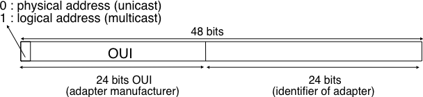
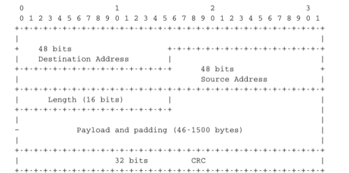
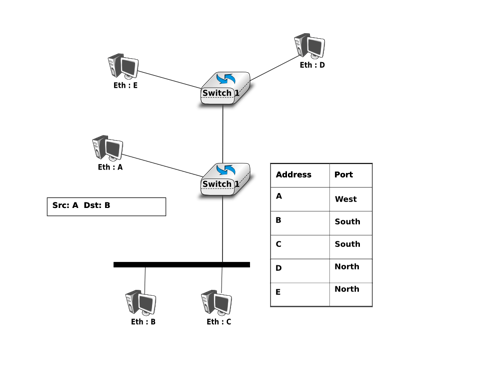

.. Copyright |copy| 2010 by Olivier Bonaventure
.. This file is licensed under a `creative commons licence <http://creativecommons.org/licenses/by/3.0/>`_

Ethernet
========

.. Ethernet was designed in the 1970s at the Palo Alto Research Center [Metcalfe1976]_. The first prototype [#fethernethistory]_ used a coaxial cable as the shared medium and 3 Mbps of bandwidth. Ethernet was improved during the late 1970s and in the 1980s, Digital Equipment, Intel and Xerox published the first official Ethernet specification [DIX]_. This specification defines several important parameters for Ethernet networks. The first decision was to standardise the commercial Ethernet at 10 Mbps. The second decision was the duration of the `slot time`. In Ethernet, a long `slot time` enables networks to span a long distance but forces the host to use a larger minimum frame size. The compromise was a `slot time` of 51.2 microseconds, which corresponds to a minimum frame size of 64 bytes. 

Ethernet fue diseñada en los 70 en el Centro de Investigaciones Palo Alto (Palo Alto Research Center) [Metcalfe1976]_. El primer prototipo [#fethernethistory]_ usaba un cable coaxil como medio compartido, y ofrecía 3 Mbps de ancho de banda. Ethernet fue mejorada durante fines de los 70, y en los 80, Digital Equipment, Intel y Xerox publicaron la primera especificación oficial de Ethernet [DIX]_. Esta especificación define varios importantes parámetros para las redes Ethernet. La primera decisión fue estandarizar la Ethernet comercial a 10 Mbps. La segunda fue la duración del `slot time` o tiempo de ranura. En Ethernet, un tiempo de ranura largo hace posible que las redes se extiendan por distancias largas, pero fuerza a los nodos a usar un tamaño mínimo de trama más grande. El compromiso final fue un tiempo de ranura de 51.2 microsegundos, lo que corresponde a un tamaño mínimo de trama de 64 bytes.

.. The third decision was the frame format. The experimental 3 Mbps Ethernet network built at Xerox used short frames containing 8 bit source and destination addresses fields, a 16 bit type indication, up to 554 bytes of payload and a 16 bit CRC. Using 8 bit addresses was suitable for an experimental network, but it was clearly too small for commercial deployments. Although the initial Ethernet specification [DIX]_ only allowed up to 1024 hosts on an Ethernet network, it also recommended three important changes compared to the networking technologies that were available at that time. The first change was to require each host attached to an Ethernet network to have a globally unique datalink layer address. Until then, datalink layer addresses were manually configured on each host. [DP1981]_ went against that state of the art and noted "`Suitable installation-specific administrative procedures are also needed for assigning numbers to hosts on a network. If a host is moved from one network to another it may be necessary to change its host  number if its former number is in use on the new network. This is easier said than done, as each network must have an administrator who must record the continuously changing state of the system (often on a piece of paper tacked to the wall !). It is anticipated that in future office environments, hosts locations will change as often as telephones are changed in present-day offices.`" The second change introduced by Ethernet was to encode each address as a 48 bits field [DP1981]_. 48 bit addresses were huge compared to the networking technologies available in the 1980s, but the huge address space had several advantages [DP1981]_ including the ability to allocate large blocks of addresses to manufacturers. Eventually, other LAN technologies opted for 48 bits addresses as well [IEEE802]_ . The third change introduced by Ethernet was the definition of `broadcast` and `multicast` addresses. The need for `multicast` Ethernet was foreseen in [DP1981]_ and thanks to the size of the addressing space it was possible to reserve a large block of multicast addresses for each manufacturer.

La tercera decisión fue el formato de tramas. La red experimental Ethernet de 3 Mbps construida en Xerox usaba tramas cortas conteniendo campos de dirección origen y destino de 8 bits; una indicación de tipo, de 16 bits; hasta 554 bytes de carga útil, y un CRC de 16 bits. El uso de direcciones de 8 bits era adecuado para fines experimentales, pero eran claramente demasiado pequeñas para instalaciones comerciales. Aunque la especificación inicial de Ethernet [DIX]_ sólo permitía hasta 1024 nodos sobre una red, también recomendaba tres importantes cambios comparada con las tecnologías de redes que había disponibles en ese momento. El primer cambio era requerir que cada nodo conectado a una red Ethernet tuviera una dirección de capa de Enlace de Datos globalmente única. Hasta entonces, las direcciones de capa de enlace eran manualmente configuradas en cada nodo. [DP1981]_ fue en contra de ese estado del arte y destacó: "`Se necesitan también procedimientos administrativos adecuados, específicos de cada instalación, para asignar números a nodos sobre una red. Si un nodo se mueve de una red a otra, puede ser necesario cambiar su numeración si su número anterior ya está en uso sobre la nueva red. Esto es más fácil de decir que de hacer, ya que cada red debe tener un administrador que debe registrar el estado, continuamente cambiante, del sistema (frecuentemente ¡sobre una hoja de papel fija a la pared!). Puede anticiparse que en los ambientes de oficina futuros, los nodos cambiarán de ubicación tan a menudo como cambian los teléfonos en las oficinas del presente`". El segundo cambio introducido por Ethernet fue codificar cada dirección como un campo de 48 bits [DP1981]_. Las direcciones de 48 bits eran enormes comparadas con las tecnologías de redes disponibles en los 80, pero el inmenso espacio de direcciones tenía varias ventajas [DP1981]_ incluyendo la capacidad de asignar grandes bloques de direcciones a los fabricantes. Eventualmente, otras tecnologías de LAN optaron por las direcciones de 48 bits también [IEEE802]_. El tercer cambio introducido por Ethernet fue la definición de direcciones de `broadcast` o `difusión`, y `multicast`. La necesidad de direcciones Ethernet `multicast` fue anticipada en [DP1981]_ y gracias al tamaño del espacio de direccionamiento fue posible reservar un gran bloque de direcciones multicast para cada fabricante.

.. index:: Organisation Unique Identifier, OUI

.. The datalink layer addresses used in Ethernet networks are often called MAC addresses. They are structured as shown in the figure below. The first bit of the address indicates whether the address identifies a network adapter or a multicast group. The upper 24 bits are used to encode an Organisation Unique Identifier (OUI). This OUI identifies a block of addresses that has been allocated by the secretariat [#foui]_ who is responsible for the uniqueness of Ethernet addresses to a manufacturer. Once a manufacturer has received an OUI, it can build and sell products with one of the 16 million addresses in this block.

Las direcciones de capa de Enlace de Datos usadas en Ethernet son frecuentemente llamadas direcciones MAC. Están estructuradas de la forma que se muestra en la figura más abajo. El primer bit indica si la dirección identifica a un adaptador de red o a un grupo de multicast. Los 24 bits superiores se usan para codificar un Identificador Único de Organización (`Organisation Unique Identifier`, OUI). Este OUI identifica un bloque de direcciones que ha sido asignado a un fabricante por el secretariado [#foui]_ responsable de la unicidad de las direcciones Ethernet. Una vez que un fabricante ha recibido un OUI, puede construir y vender productos con uno de los 16 millones de direcciones en su bloque.

  
   Formato de direcciones Ethernet de 48 bits 
..   48 bits Ethernet address format

.. index:: EtherType, Ethernet Type field

.. The original 10 Mbps Ethernet specification [DIX]_ defined a simple frame format where each frame is composed of five fields. The Ethernet frame starts with a preamble (not shown in the figure below) that is used by the physical layer of the receiver to synchronise its clock with the sender's clock. The first field of the frame is the destination address. As this address is placed at the beginning of the frame, an Ethernet interface can quickly verify whether it is the frame recipient and if not, cancel the processing of the arriving frame. The second field is the source address. While the destination address can be either a unicast or a multicast/broadcast address, the source address must always be a unicast address. The third field is a 16 bits integer that indicates which type of network layer packet is carried inside the frame. This field is often called the `EtherType`. Frequently used `EtherType` values [#fethertype]_ include `0x0800` for IPv4, `0x86DD` for IPv6 [#fipv6ether]_ and `0x806` for the Address Resolution Protocol (ARP). 

La especificación Ethernet original de 10 Mbps [DIX]_ definía un formato simple, donde cada trama se componía de cinco campos. La trama Ethernet comienza con un preámbulo (que no se muestra en la figura siguiente) usado por la capa Física del receptor para sincronizar su reloj con el del emisor. El primer campo de la trama es la dirección destino. Como esta dirección se ubica al principio de la trama, una interfaz Ethernet puede rápidamente verificar si ella es la destinataria de la trama, y si no, cancelar el procesamiento de la trama que llega. El segundo campo es la dirección origen. Mientras que la dirección destino puede ser una dirección unicast, multicast o broadcast, la dirección origen siempre debe ser unicast. El tercer campo es un entero de 16 bits que indica qué tipo de paquete de capa de Red está siendo transportado dentro de la trama. Este campo suele llamarse el `EtherType`. Valores frecuentes de `EtherType` [#fethertype]_ son `0x0800` para IPv4, `0x86DD` para IPv6 [#fipv6ether]_ y `0x806` para el Protocolo de Resolución de Direcciones (`Address Resolution Protocol`, ARP). 

.. The fourth part of the Ethernet frame is the payload. The minimum length of the payload is 46 bytes to ensure a minimum frame size, including the header of 512 bits. The Ethernet payload cannot be longer than 1500 bytes. This size was found reasonable when the first Ethernet specification was written. At that time, Xerox had been using its experimental 3 Mbps Ethernet that offered 554 bytes of payload and :rfc:`1122` required a minimum MTU of 572 bytes for IPv4. 1500 bytes was large enough to support these needs without forcing the network adapters to contain overly large memories. Furthermore, simulations and measurement studies performed in Ethernet networks revealed that CSMA/CD was able to achieve a very high utilization. This is illustrated in the figure below based on [SH1980]_, which shows the channel utilization achieved in Ethernet networks containing different numbers of hosts that are sending frames of different sizes.

El cuarto elemento de la trama Ethernet es la carga útil. La longitud mínima de la carga útil es de 46 bytes para asegurar un tamaño mínimo de trama, incluyendo la cabecera de 512 bits. La carga Ethernet no puede superar los 1500 bytes. Este tamaño se encontró razonable cuando se escribió la primera especificación Ethernet. En ese momento, Xerox había estado usando su Ethernet experimental de 3 Mbps que ofrecía 554 bytes de carga útil, y :rfc:`1122` requería un MTU mínimo de 572 bytes para IPv4. Un tamaño de 1500 bytes era bastante grande para soportar estas necesidades sin forzar a que los adaptadores de red contuvieran memorias excesivamente grandes. Además, estudios de simulación y mediciones ejecutadas en redes Ethernet revelaron que el CSMA/CD era capaz de alcanzar muy alta utilización. Esto se ilustra en la figura siguiente, basada en [SH1980]_, que muestra la utilización del canal lograda en redes Ethernet conteniendo diferente número de nodos que están enviando tramas de diferentes tamaños.

.. figure:: png/lan-fig-102-c.png
   :align: center
   :scale: 70
  
   Impacto de la longitud de trama sobre la utilización máxima del canal [SH1980]
..   Impact of the frame length on the maximum channel utilisation [SH1980]

.. The last field of the Ethernet frame is a 32 bit Cyclical Redundancy Check (CRC). This CRC is able to catch a much larger number of transmission errors than the Internet checksum used by IP, UDP and TCP [SGP98]_. The format of the Ethernet frame is shown below.

El último campo de la trama Ethernet es un verificador de redundancia cíclico (`Cyclical Redundancy Check`, CRC). Este CRC es capaz de detectar un número de errores de transmisión mucho mayor que la suma de control de Internet usada por IP, UDP y TCP [SGP98]_. A continuación se muestra el formato de la trama Ethernet. 

.. Ethernet evolution http://www.networkworld.com/slideshows/2009/042009-terabit-ethernet.html?ts0hb#slide14

.. index:: Ethernet DIX frame format

.. figure:: pkt/dix.png
   :align: center
   :scale: 100

   Formato de trama Ethernet DIX
..   Ethernet DIX frame format

.. .. note:: Where should the CRC be located in a frame ?

..  The transport and datalink layers usually chose different strategies to place their CRCs or checksums. Transport layer protocols usually place their CRCs or checksums in the segment header. Datalink layer protocols sometimes place their CRC in the frame header, but often in a trailer at the end of the frame. This choice reflects implementation assumptions, but also influences performance :rfc:`893`. When the CRC is placed in the trailer, as in Ethernet, the datalink layer can compute it while transmitting the frame and insert it at the end of the transmission. All Ethernet interfaces use this optimisation today. When the checksum is placed in the header, as in a TCP segment, it is impossible for the network interface to compute it while transmitting the segment. Some network interfaces provide hardware assistance to compute the TCP checksum, but this is more complex than if the TCP checksum were placed in the trailer [#ftso]_. 

.. note:: ¿Dónde debería estar ubicado el CRC en una trama?

 Las capas de Transporte y de Enlace de Datos usualmente eligen diferentes estrategias para ubicar su CRC o su `checksum`. Los protocolos de capa de Transporte ponen su CRC o checksum en la cabecera del segmento. Los protocolos de capa de Enlace de Datos a veces ponen su CRC en la cabecera de la trama, pero frecuentemente en un `trailer` al final de la trama. Esta elección refleja suposiciones de implementación, pero también tiene influencia sobre el rendimiento :rfc:`893`. Cuando el CRC se coloca al final, como en Ethernet, la capa de Enlace de Datos puede computarlo mientras transmite la trama e insertarlo al final de la transmisión. Todas las interfaces Ethernet de hoy usan esta optimización. Cuando el checksum se ubica en la cabecera, como en los segmentos TCP, es imposible para la interfaz computarlo mientras transmite el segmento. Algunas interfaces de red proveen asistencia por hardware para computar el checksum TCP, pero esto es más complejo que si el checksum se ubicara en el trailer [#ftso]_. 

.. index:: Logical Link Control (LLC), LLC

.. The Ethernet frame format shown above is specified in [DIX]_. This is the format used to send both IPv4 :rfc:`894` and IPv6 packets :rfc:`2464`. After the publication of [DIX]_, the Institute of Electrical and Electronic Engineers (IEEE) began to standardise several Local Area Network technologies. IEEE worked on several LAN technologies, starting with Ethernet, Token Ring and Token Bus. These three technologies were completely different, but they all agreed to use the 48 bits MAC addresses specified initially for Ethernet [IEEE802]_ . While developing its Ethernet standard [802.3]_, the IEEE 802.3 working group was confronted with a problem. Ethernet mandated a minimum payload size of 46 bytes, while some companies were looking for a LAN technology that could transparently transport short frames containing only a few bytes of payload. Such a frame can be sent by an Ethernet host by padding it to ensure that the payload is at least 46 bytes long. However since the Ethernet header [DIX]_ does not contain a length field, it is impossible for the receiver to determine how many useful bytes were placed inside the payload field. To solve this problem, the IEEE decided to replace the `Type` field of the Ethernet [DIX]_ header with a length field [#ftypelen]_. This `Length` field contains the number of useful bytes in the frame payload. The payload must still contain at least 46 bytes, but padding bytes are added by the sender and removed by the receiver. In order to add the `Length` field without significantly changing the frame format, IEEE had to remove the `Type` field. Without this field, it is impossible for a receiving host to identify the type of network layer packet inside a received frame. To solve this new problem, IEEE developed a completely new sublayer called the Logical Link Control [802.2]_. Several protocols were defined in this sublayer. One of them provided a slightly different version of the `Type` field of the original Ethernet frame format. Another contained acknowledgements and retransmissions to provide a reliable service... In practice, [802.2]_ is never used to support IP in Ethernet networks. The figure below shows the official [802.3]_ frame format.

El formato de trama Ethernet mostrado anteriormente está especificado en [DIX]_. Éste es el formato usado para enviar paquetes IPv4 :rfc:`894` e IPv6 :rfc:`2464`. Luego de la publicación de [DIX]_, el IEEE (`Institute of Electrical and Electronic Engineers`) comenzó a estandarizar varias tecnologías de LAN. IEEE trabajó sobre varias tecnologías de LAN, comenzando por Ethernet, Token Ring y Token Bus. Estas tres tecnologías eran completamente diferentes, pero todas se pusieron de acuerdo en el uso de las direcciones MAC de 48 bits inicialmente especificadas por Ethernet [IEEE802]_. Mientras desarrollaba su estándar Ethernet [802.3]_, el grupo de trabajo IEEE 802.3 se enfrentó a un problema. Ethernet exigía una carga útil mínima de 46 bytes, mientras que algunas empresas buscaban una tecnología LAN que pudiera transportar transparentemente tramas cortas, conteniendo sólo unos pocos bytes de carga. Una trama semejante puede ser enviada por un nodo Ethernet aplicándole `padding`, o relleno con bytes extra, para asegurar que la carga sea al menos de 46 bytes de longitud. Sin embargo, como la cabecera Ethernet [DIX]_ no contiene un campo longitud, es imposible para el receptor determinar cuántos bytes útiles fueron colocados dentro del campo de carga útil. Para resolver este problema, IEEE decidió reemplazar el campo `Type` de la cabecera Ethernet con un campo de longitud [#ftypelen]_. Este campo `Length` contiene la cantidad de bytes útiles en la carga de la trama. La carga debe seguir conteniendo al menos 46 bytes, pero los bytes de `padding` son agregados por el emisor y retirados por el receptor. Para agregar el campo `Length` sin cambiar significativamente el formato de trama, IEEE tuvo que retirar el campo `Type`. Ahora bien, sin este campo, es imposible para un nodo receptor identificar el tipo de paquete de capa de Red dentro de la trama recibida. Para resolver este nuevo problema, IEEE desarrolló una subcapa completamente nueva, llamada `Control de Enlace Lógico` (`Logical Link Control`, LLC) [802.2]_. Dentro de esta subcapa se definieron varios protocolos. Uno de ellos proveyó una versión ligeramente diferente del campo `Type` del formato original de trama Ethernet. Otro contenía reconocimientos y retransmisiones para ofrecer un servicio confiable. En la práctica, [802.2]_ nunca se usa para soportar IP en redes Ethernet. La figura siguiente muestra el formato oficial de trama [802.3]_.

   Formato de trama Ethernet 802.3
..   Ethernet 802.3 frame format

.. .. note:: What is the Ethernet service ?

..  An Ethernet network provides an unreliable connectionless service. It supports three different transmission modes : `unicast`, `multicast` and `broadcast`. While the Ethernet service is unreliable in theory, a good Ethernet network should, in practice, provide a service that :
..  - delivers frames to their destination with a very high probability of successful delivery
..  - does not reorder the transmitted frames
.. The first property is a consequence of the utilisation of CSMA/CD. The second property is a consequence of the physical organisation of the Ethernet network as a shared bus. These two properties are important and all evolutions of the Ethernet technology have preserved them.

.. note:: ¿En qué consiste el servicio Ethernet?

  Una red Ethernet ofrece un servicio sin conexión, no confiable. Soporta tres tipos de modos de transmisión: `unicast`, `multicast` y `broadcast`. Aunque el servicio Ethernet en teoría es no confiable, una buena red Ethernet debe, en la práctica, proveer un servicio que:

  - Entregue tramas a sus destinos con muy alta probabilidad de entrega exitosa.
  - No reordene las tramas transmitidas.

  La primera propiedad es una consecuencia de la utilización de CSMA/CD. La segunda propiedad es consecuencia de la organización física de la red Ethernet como un bus compartido. Estas dos propiedades son importantes y todas las evoluciones de la tecnología Ethernet las han preservado. 

.. index:: 10Base5

.. Several physical layers have been defined for Ethernet networks. The first physical layer, usually called 10Base5, provided 10 Mbps over a thick coaxial cable. The characteristics of the cable and the transceivers that were used then enabled the utilisation of 500 meter long segments. A 10Base5 network can also include repeaters between segments. 

Varias capas físicas han sido definidas para las redes Ethernet. La primera capa física, usualmente llamada 10Base5, ofrecía 10 Mbps sobre un cable coaxil grueso. Las características del cable y de los transceptores (o `transceivers`) que eran usados posibilitaban la utilización de segmentos de 500 m de longitud. Una red 10Base5 puede también incluir repetidores entre segmentos. 

.. index:: 10Base2

.. The second physical layer was 10Base2. This physical layer used a thin coaxial cable that was easier to install than the 10Base5 cable, but could not be longer than 185 meters. A 10BaseF physical layer was also defined to transport Ethernet over point-to-point optical links. The major change to the physical layer was the support of twisted pairs in the 10BaseT specification. Twisted pair cables are traditionally used to support the telephone service in office buildings. Most office buildings today are equipped with structured cabling. Several twisted pair cables are installed between any room and a central telecom closet per building or per floor in large buildings. These telecom closets act as concentration points for the telephone service but also for LANs. 

La segunda capa física fue 10Base2. Esta capa física usaba un cable coaxil delgado que era más fácil de instalar que el cable 10Base5, pero no podía tener longitud mayor que 185 m. También se definió una capa física 10BaseF para transportar Ethernet sobre enlaces ópticos punto a punto. El mayor cambio en la capa física fue el soporte de pares retorcidos (`twisted pair`) en la especificación 10BaseT. Los pares de cables retorcidos se usan tradicionalmente para soportar el servicio telefónico en edificios de oficinas. La mayoría de los edificios de oficinas hoy están equipados con cableado estructurado. En cada edificio cableado existe un recinto central de telecomunicaciones, o, si el edificio es muy grande, uno por piso. Entre estos recintos y cualquier sala del edificio se tienen varios cables de par retorcido. Estos recintos de cableado actúan como puntos de concentración para el servicio telefónico, pero también para las LANs.

.. index:: Ethernet hub, 10BaseT

.. The introduction of the twisted pairs led to two major changes to Ethernet. The first change concerns the physical topology of the network. 10Base2 and 10Base5 networks are shared buses, the coaxial cable typically passes through each room that contains a connected computer. A 10BaseT network is a star-shaped network. All the devices connected to the network are attached to a twisted pair cable that ends in the telecom closet. From a maintenance perspective, this is a major improvement. The cable is a weak point in 10Base2 and 10Base5 networks. Any physical damage on the cable broke the entire network and when such a failure occurred, the network administrator had to manually check the entire cable to detect where it was damaged. With 10BaseT, when one twisted pair is damaged, only the device connected to this twisted pair is affected and this does not affect the other devices. The second major change introduced by 10BaseT was that is was impossible to build a 10BaseT network by simply connecting all the twisted pairs together. All the twisted pairs must be connected to a relay that operates in the physical layer. This relay is called an `Ethernet hub`. A `hub` is thus a physical layer relay that receives an electrical signal on one of its interfaces, regenerates the signal and transmits it over all its other interfaces. Some `hubs` are also able to convert the electrical signal from one physical layer to another (e.g. 10BaseT to 10Base2 conversion).

La introducción de los pares retorcidos llevó a dos cambios importantes en Ethernet. El primer cambio tiene que ver con la topología física de la red. Las redes 10Base2 y 10Base5 son buses compartidos. El cable coaxil, típicamente, atraviesa cada sala que contenga una computadora conectada. Una red 10BaseT, en cambio, es una red en forma de estrella. Todos los dispositivos conectados a la red se conectan a un cable de par retorcido que termina en el recinto de telecomunicaciones. Desde el punto de vista del mantenimiento, se trata de una mejora enorme. El cable era un punto débil en las redes 10Base2 y 10Base5. Cualquier daño físico en el cable descomponía la red completa, y cuando ocurría una falla así, el administrador de la red tenía que verificar manualmente el cable entero para detectar dónde estaba dañado. Con 10BaseT, cuando un par retorcido está dañado, sólo el dispositivo conectado a este par retorcido es afectado, y no los demás dispositivos. El segundo gran cambio introducido por 10BaseT fue que era imposible construir una red 10BaseT simplemente conectando todos los pares juntos. Todos los pares deben ser interconectados mediante un `relay` que opera en capa Física. Este relay se llama `hub Ethernet`. Un `hub` es entonces un repetidor de capa física que recibe una señal eléctrica en una de sus interfaces, regenera la señal y la transmite sobre todas sus otras interfaces. Algunos hubs también son capaces de convertir la señal eléctrica de una capa física en otra (por ejemplo, convirtiendo de 10BaseT a 10Base2).

.. figure:: png/lan-fig-060-c.png
   :align: center
   :scale: 70
  
   Hubs Ethernet en el modelo de referencia 
..   Ethernet hubs in the reference model

.. index:: collision domain

.. Computers can directly be attached to Ethernet hubs. Ethernet hubs themselves can be attached to other Ethernet hubs to build a larger network. However, some important guidelines must be followed when building a complex network with hubs. First, the network topology must be a tree. As hubs are relays in the physical layer, adding a link between `Hub2` and `Hub3` in the network below would create an electrical shortcut that would completely disrupt the network. This implies that there cannot be any redundancy in a hub-based network. A failure of a hub or of a link between two hubs would partition the network into two isolated networks. Second, as hubs are relays in the physical layer, collisions can happen and must be handled by CSMA/CD as in a 10Base5 network. This implies that the maximum delay between any pair of devices in the network cannot be longer than the 51.2 microseconds `slot time`. If the delay is longer, collisions between short frames may not be correctly detected. This constraint limits the geographical spread of 10BaseT networks containing hubs.

Las computadoras pueden conectarse directamente a los hubs Ethernet. Éstos a su vez pueden estar conectados a otros hubs Ethernet para construir una red mayor. Sin embargo, al construir una red compleja con hubs hay que seguir ciertas importantes reglas. En primer lugar, la topología de la red debe ser un árbol, es decir, no debe contener ciclos. Como los hubs son repetidores en la capa física, agregar un enlace entre Hub2 y Hub3 en la red de la figura siguiente crearía un cortocircuito eléctrico que descompondría totalmente la red. Esto indica que no puede haber redundancia en una red construida en base a hubs. Una falla de un hub o de un enlace entre dos hubs particionaría la red en dos redes aisladas. Segundo, como los hubs son repetidores en la capa física, las colisiones puede ocurrir y deben ser manejadas por CSMA/CD como en una red 10Base5. Esto implica que el retardo máximo entre cualquier par de dispositivos de la red debe ser igual o menor que el tiempo de ranura de 51.2 microsegundos. Si el retardo es mayor, las colisiones entre tramas cortas pueden no ser correctamente detectadas. Esta restricción limita el alcance geográico de las redes 10BaseT que contienen hubs.

.. figure:: svg/datalink-fig-012-c.png
   :align: center
   :scale: 70

   Una red Ethernet jerárquica compuesta por hubs   
.. A hierarchical Ethernet network composed of hubs

.. index:: 100BaseTX, Fast Ethernet

.. In the late 1980s, 10 Mbps became too slow for some applications and network manufacturers developed several LAN technologies that offered higher bandwidth, such as the 100 Mbps FDDI LAN that used optical fibers. As the development of 10Base5, 10Base2 and 10BaseT had shown that Ethernet could be adapted to different physical layers, several manufacturers started to work on 100 Mbps Ethernet and convinced IEEE to standardise this new technology that was initially called `Fast Ethernet`. `Fast Ethernet` was designed under two constraints. First, `Fast Ethernet` had to support twisted pairs. Although it was easier from a physical layer perspective to support higher bandwidth on coaxial cables than on twisted pairs, coaxial cables were a nightmare from deployment and maintenance perspectives. Second, `Fast Ethernet` had to be perfectly compatible with the existing 10 Mbps Ethernets to allow `Fast Ethernet` technology to be used initially as a backbone technology to interconnect 10 Mbps Ethernet networks. This forced `Fast Ethernet` to use exactly the same frame format as 10 Mbps Ethernet. This implied that the minimum `Fast Ethernet` frame size remained at 512 bits. To preserve CSMA/CD with this minimum frame size and 100 Mbps instead of 10 Mbps, the duration of the `slot time` was decreased to 5.12 microseconds.

A fines de los 80, el ancho de banda de 10 Mbps se volvió demasiado lento para algunas aplicaciones, y los fabricantes de red desarrollaron varias tecnologías de LAN que ofrecían anchos de banda mayores, como la LAN de 100 Mbps FDDI, que usaba fibras ópticas. Como el desarrollo de 10Base5, 10Base2 y 10BaseT había mostrado que Ethernet podía adaptarse a diferentes capas físicas, varios fabricantes comenzaron a trabajar en Ethernet de 100 Mbps y convencieron a IEEE de estandarizar esta nueva tecnología que fue inicialmente llamada `Fast Ethernet`. Esta red se diseñó bajo dos restricciones. Primero, `Fast Ethernet` debía soportar pares retorcidos. Aunque, desde el punto de vista de la capa Física, era más fácil soportar altos anchos de banda con cables coaxiles que con pares retorcidos, los cables coaxiles eran una pesadilla desde el punto de vista de instalación y mantenimiento. Segundo, `Fast Ethernet` debía ser perfectamente compatible con las redes Ethernet de 10 Mbps existentes, para permitir que la nueva tecnología fuera usada inicialmente como una tecnología de `backbone` para interconectar redes Ethernet a 10 Mbps. Esto obligó a que Fast Ethernet usara exactamente el mismo formato de trama que Ethernet 10 Mbps. Lo cual implicó que el mínimo tamaño de trama de `Fast Ethernet` se mantuviera en 512 bits. Para preservar CSMA/CD con este tamaño mínimo de trama, y 100 Mbps en lugar de 10 Mbps, la duración del tiempo de ranura fue disminuida a 5.12 microsegundos.

.. The evolution of Ethernet did not stop. In 1998, the IEEE published a first standard to provide Gigabit Ethernet over optical fibers. Several other types of physical layers were added afterwards. The `10 Gigabit Ethernet <http://en.wikipedia.org/wiki/10_gigabit_Ethernet>`_ standard appeared in 2002. Work is ongoing to develop `standards <http://www.ieee802.org/3/ba/public/index.html>`_ for 40 Gigabit and 100 Gigabit Ethernet and some are thinking about `Terabit Ethernet <http://www.networkworld.com/news/2009/042009-terabit-ethernet.html>`_. The table below lists the main Ethernet standards. A more detailed list may be found at http://en.wikipedia.org/wiki/Ethernet_physical_layer

La evolución de Ethernet no se detuvo. En 1998, IEEE publicó un primer estándar para proveer Gigabit Ethernet sobre fibras ópticas. Varios otros tipos de capas físicas se agregaron después. El estándar `10 Gigabit Ethernet <http://en.wikipedia.org/wiki/10_gigabit_Ethernet>`_ apareció en 2002. Actualmente se trabaja para desarrollar `estándares <http://www.ieee802.org/3/ba/public/index.html>`_ para 40 Gbps y 100 Gigabit Ethernet; y hay quienes están pensando en  `Terabit Ethernet <http://www.networkworld.com/news/2009/042009-terabit-ethernet.html>`_. La tabla siguiente lista los principales estándares de Ethernet. Puede verse una lista más detallada en http://en.wikipedia.org/wiki/Ethernet_physical_layer.

 ============   ==============================================================
 Estándar       Comentario
 ============   ==============================================================
 10Base5	Cable coaxil grueso, 500 m
 10Base2	Cable coaxil fino, 185 m
 10BaseT	Dos pares UTP (Unshielded Twisted Pair) categoría 3 o superior
 10Base-F       10 Mbps sobre fibra óptica
 100Base-Tx     UTP categoría 5 o STP (Shielded Twisted Pair), 100 m máximo
 100Base-FX     Dos fibras ópticas multimodo, máximo 2 Km
 1000Base-CX    Dos pares STP (Shielded Twisted Pair), 25 m máximo
 1000Base-SX    Dos fibras ópticas multimodo o monomodo con lasers
 10 Gbps	Fibra óptica, también UTP Categoría 6
 40-100 Gbps    Fibra óptica (experimentalmente cobre)
 ============   ==============================================================

.. In the late 1990s, the first Gigabit Ethernet interfaces had difficulties transmitting and receiving at 1000 Mbps given the performance limitations of the hosts on which they were running. One of the issues was the 1500 bytes maximum Ethernet frame size, as it forces hosts to send relatively small packets. This increases the number of interruptions that a host needs to process. To improve the usability of Gigabit Ethernet without requiring CPU and bus upgrades, several vendors proposed to increase the.... Experience with other networking technologies that support large frames showed limits performed with other networking technologies showed that a larger frame 

.. ============   ========================================================
.. Standard       Comments
.. ============   ========================================================
.. 10Base5	       Thick coaxial cable, 500m
.. 10Base2	       Thin coaxial cable, 185m
.. 10BaseT	       Two pairs of category 3+ UTP
.. 10Base-F       10 Mb/s over optical fiber
.. 100Base-Tx     Category 5 UTP or STP, 100 m maximum 
.. 100Base-FX     Two multimode optical fiber, 2 km maximum
.. 1000Base-CX    Two pairs shielded twisted pair, 25m maximum
.. 1000Base-SX    Two multimode or single mode optical fibers with lasers
.. 10 Gbps	       Optical fiber but also Category 6 UTP
.. 40-100 Gbps    Optical fiber (experiences are performed with copper)
.. ============   ========================================================
   
.. .. rubric:: Footnotes

.. .. [#ftso] These network interfaces compute the TCP checksum while a segment is transferred from the host memory to the network interface [SH2004]_.

.. .. [#fethernethistory] Additional information about the history of the Ethernet technology may be found at http://ethernethistory.typepad.com/

.. .. [#foui] Initially, the OUIs were allocated by Xerox [DP1981]_. However, once Ethernet became an IEEE and later an ISO standard, the allocation of the OUIs moved to IEEE. The list of all OUI allocations may be found at http://standards.ieee.org/regauth/oui/index.shtml

.. .. [#fethertype] The official list of all assigned Ethernet type values is available from http://standards.ieee.org/regauth/ethertype/eth.txt

.. .. [#fipv6ether] The attentive reader may question the need for different `EtherTypes` for IPv4 and IPv6 while the IP header already contains a version field that can be used to distinguish between IPv4 and IPv6 packets. Theoretically, IPv4 and IPv6 could have used the same `EtherType`. Unfortunately, developers of the early IPv6 implementations found that some devices did not check the version field of the IPv4 packets that they received and parsed frames whose `EtherType` was set to `0x0800` as IPv4 packets. Sending IPv6 packets to such devices would have caused disruptions. To avoid this problem, the IETF decided to apply for a distinct `EtherType` value for IPv6. Such a choice is now mandated by :rfc:`6274` (section 3.1), although we can find a funny counter-example in :rfc:`6214`.

.. .. [#ftypelen] Fortunately, IEEE was able to define the [802.3]_ frame format while maintaining backward compatibility with the Ethernet [DIX]_ frame format. The trick was to only assign values above 1500 as `EtherType` values. When a host receives a frame, it can determine whether the frame's format by checking its `EtherType/Length` field. A value lower smaller than `1501` is clearly a length indicator and thus an [802.3]_ frame. A value larger than `1501` can only be type and thus a [DIX]_ frame.

.. rubric:: Footnotes

.. [#ftso] Estas interfaces de red computan el checksum de TCP mientras un segmento es transferido de la memoria del nodo a la interfaz de red [SH2004]_.

.. [#fethernethistory] Información adicional sobre la historia de la tecnología Ethernet en http://ethernethistory.typepad.com/

.. [#foui] Inicialmente, los OUIs fueron asignados por Xerox [DP1981]_. Sin embargo, una vez que Ethernet se convirtió en estándar de IEEE, y más tarde de ISO, la asignación de los OUIs se trasladó a IEEE. La lista de todas las asignaciones de OUI puede verse en http://standards.ieee.org/regauth/oui/index.shtml

.. [#fethertype] La lista oficial de todos los valores de tipo Ethernet está disponible en http://standards.ieee.org/regauth/ethertype/eth.txt

.. [#fipv6ether] El lector atento puede preguntarse la necesidad de diferentes valores `EtherType` para IPv4 e IPv6 siendo que la cabecera IP ya contiene un campo `versión` que puede usarse para distinguir entre paquetes IPv4 e IPv6. Teóricamente, IPv4 e IPv6 podrían haber tenido el mismo `EtherType`. Lamentablemente, los desarrolladores de las primeras implementaciones de IPv6 hallaron que algunos dispositivos no verificaban el campo versión de los paquetes IPv4 que recibían, y directamente analizaban las tramas cuyo `EtherType` estaba puesto en `0x0800` como paquetes IPv4. Enviar paquetes IPv6 a estos dispositivos habría causado inconvenientes. Para evitar este problema, IETF decidió solicitar un valor distinto de `EtherType` para IPv6. Esta elección ahora está impuesta por :rfc:`6274` (sección 3.1), aunque puede encontrarse un contraejemplo curioso en :rfc:`6214`.

.. [#ftypelen] Afortunadamente, IEEE pudo definir el formato de trama [802.3]_ a la vez que mantenía la compatibilidad hacia atrás con el formato Ethernet [DIX]_. El truco fue asignar sólo los valores superiores a 1500 como valores `EtherType`. Cuando un nodo recibe una trama, puede determinar el formato examinando el campo `EtherType/Length`. Un valor más bajo que `1501` es claramente un indicador de longitud, y por lo tanto se trata de una trama [802.3]_. Un valor mayor que `1501` sólo puede ser de un campo tipo, y el formato de la trama será [DIX]_.

Switches Ethernet
-----------------

.. index:: Ethernet switch, Ethernet bridge, bridge, switch

.. Increasing the physical layer bandwidth as in `Fast Ethernet` was only one of the solutions to improve the performance of Ethernet LANs. A second solution was to replace the hubs with more intelligent devices. As `Ethernet hubs` operate in the physical layer, they can only regenerate the electrical signal to extend the geographical reach of the network. From a performance perspective, it would be more interesting to have devices that operate in the datalink layer and can analyse the destination address of each frame and forward the frames selectively on the link that leads to the destination. Such devices are usually called `Ethernet switches` [#fbridges]_.  An `Ethernet switch` is a relay that operates in the datalink layer as is illustrated in the figure below.

Incrementar el ancho de banda de la capa física, como en `Fast Ethernet`, no fue más que una de las soluciones para mejorar las prestaciones de las LANs Ethernet. Una segunda solución fue reemplazar los hubs con dispositivos más inteligentes. Como los hubs Ethernet operan en la capa Física, sólo pueden regenerar la señal eléctrica, para extender el alcance geográfico de la red. Desde el punto de vista del rendimiento, era más interesante tener dispositivos que operaran en la capa de Enlace de Datos, que pudieran analizar la dirección destino de cada trama, y reenviar las tramas selectivamente sobre el enlace que lleva al destino. Estos dispositivos se llaman en general `switches Ethernet` o `conmutadores Ethernet` [#fbridges]_. Un `switch Ethernet` es un relay que opera en la capa de Enlace de Datos como se ilustra en la figura más abajo.

.. figure:: png/lan-fig-060-c.png
   :align: center
   :scale: 70
  
   Los Switches Ethernet y el modelo de referencia 
..   Ethernet switches and the reference model 

.. index:: MAC address table (Ethernet switch), tabla de direcciones MAC

.. An `Ethernet switch` understands the format of the Ethernet frames and can selectively forward frames over each interface. For this, each `Ethernet switch` maintains a `MAC address table`. This table contains, for each MAC address known by the switch, the identifier of the switch's port over which a frame sent towards this address must be forwarded to reach its destination. This is illustrated below with the `MAC address table` of the bottom switch. When the switch receives a frame destined to address `B`, it forwards the frame on its South port. If it receives a frame destined to address `D`, it forwards it only on its North port.

Un `switch Ethernet` comprende el formato de las tramas Ethernet y puede selectivamente reenviar las tramas por cada interfaz. Para esto, cada `switch Ethernet` mantiene una `tabla de direcciones MAC`. Esta tabla contiene, por cada dirección MAC conocida por el switch, el identificador del puerto del switch por el cual debe ser enviada una trama para alcanzar su destino. Esto se ilustra más abajo con la tabla de direcciones MAC del switch inferior. Cuando el switch recibe una trama destinada a la dirección `B`, reenvía la trama por su puerto Sur. Si recibe una trama destinada a la dirección `D`, la reenvía sólo por su puerto Norte.

  
   Operación de switches Ethernet 
..   Operation of Ethernet switches 

.. index:: address learning, MAC address learning, aprendizaje de direcciones, aprendizaje de direcciones MAC

.. One of the selling points of Ethernet networks is that, thanks to the utilisation of 48 bits MAC addresses, an Ethernet LAN is plug and play at the datalink layer. When two hosts are attached to the same Ethernet segment or hub, they can immediately exchange Ethernet frames without requiring any configuration. It is important to retain this plug and play capability for Ethernet switches as well. This implies that Ethernet switches must be able to build their MAC address table automatically without requiring any manual configuration. This automatic configuration is performed by the `MAC address learning` algorithm that runs on each Ethernet switch. This algorithm extracts the source address of the received frames and remembers the port over which a frame from each source Ethernet address has been received. This information is inserted into the MAC address table that the switch uses to forward frames. This allows the switch to automatically learn the ports that it can use to reach each destination address, provided that this host has previously sent at least one frame. This is not a problem since most upper layer protocols use acknowledgements at some layer and thus even an Ethernet printer sends Ethernet frames as well.

Uno de los argumentos de venta de las redes Ethernet es que, gracias a la utilización de direcciones MAC de 48 bits, una LAN Ethernet es `plug and play` a nivel de capa de Enlace de Datos. Cuando dos nodos son conectados al mismo segmento o hub Ethernet, inmediatamente pueden comenzar a intercambiar tramas Ethernet sin requerir ninguna configuración. Resulta importante conservar esta capacidad `plug and play` para los switches Ethernet también. Esto implica que los switches Ethernet deben ser capaces de construir su tabla de direcciones MAC automáticamente sin requerir configuración manual. Esta configuración automática es ejecutada por el algoritmo de `aprendizaje de direcciones MAC` que corre en cada switch Ethernet. Este algoritmo extrae la dirección origen de las tramas recibidas y recuerda el puerto por el cual se recibieron tramas de cada dirección origen. Esta información se inserta en la tabla de direcciones MAC que usa el switch para reenviar las tramas. Esto permite que el switch automáticamente aprenda los puertos que puede utilizar para alcanzar cada dirección destino, siempre que dicho nodo destino haya previamente enviado al menos una trama a la red. Esto no es un problema, ya que la mayoría de los protocolos de capa superior usan reconocimientos en alguna capa, y así, hasta una impresora Ethernet envía a la red sus propias tramas Ethernet.

.. The pseudo-code below details how an Ethernet switch forwards Ethernet frames. It first updates its `MAC address table` with the source address of the frame. The `MAC address table` used by some switches also contains a timestamp that is updated each time a frame is received from each known source address. This timestamp is used to remove from the `MAC address table` entries that have not been active during the last `n` minutes. This limits the growth of the `MAC address table`, but also allows hosts to move from one port to another. The switch uses its `MAC address table` to forward the received unicast frame. If there is an entry for the frame's destination address in the `MAC address table`, the frame is forwarded selectively on the port listed in this entry. Otherwise, the switch does not know how to reach the destination address and it must forward the frame on all its ports except the port from which the frame has been received. This ensures that the frame will reach its destination, at the expense of some unnecessary transmissions. These unnecessary transmissions will only last until the destination has sent its first frame. Multicast and Broadcast frames are also forwarded in a similar way.

El pseudocódigo más abajo detalla cómo reenvía las tramas un switch Ethernet. Primero actualiza su `tabla de direcciones MAC` con la dirección origen de la trama. La `tabla de direcciones MAC` usada por algunos switches contiene también un `timestamp`, o dato horario, que se actualiza cada vez que se recibe una trama desde cada dirección origen conocida. Este dato horario se usa para retirar de la `tabla de direcciones MAC` las entradas que no han mostrado actividad durante los últimos `n` minutos. Esto limita el crecimiento de la `tabla de direcciones MAC`, pero también permite que los nodos se muevan de un puerto a otro. El switch utiliza su `tabla de direcciones MAC` para reenviar las tramas unicast recibidas. Si hay una entrada para la dirección destino de la trama en la `tabla de direcciones MAC`, la trama se reenvía selectivamente al puerto que aparece en esa entrada. Si no, el switch no sabe cómo alcanzar la dirección destino, y así debe reenviar la trama por todos los puertos, excepto aquel por donde se recibió la trama. Esta acción se llama `inundación` (`flooding`), y asegura que la trama alcanzará su destino, aunque a costa de algunas transmisiones innecesarias. Estas transmisiones innecesarias sólo durarán hasta que la estación destino haya enviado su primera trama. Las tramas multicast y broadcast también se reenvían en forma similar, por `inundación`.

.. .. code-block:: python
.. 
.. # Arrival of frame F on port P
.. # Table : MAC address table dictionary : addr->port 
.. # Ports : list of all ports on the switch
.. src=F.SourceAddress
.. dst=F.DestinationAddress
.. Table[src]=P  #src heard on port P
.. if isUnicast(dst) :
..    if dst in Table: 
..      ForwardFrame(F,Table[dst])
..    else:
..      for o in Ports :
..       	  if o!= P :  ForwardFrame(F,o)
.. else:
..   # multicast or broadcast destination
..   for o in Ports :
..       if o!= P :  ForwardFrame(F,o)

.. code-block:: python

 # Llegada de trama T por el puerto P
 # Tabla: tabla de direcciones MAC, diccionario: dir -> puerto 
 # Puertos: lista de todos los puertos en el switch
 orig = T.DireccionOrigen
 dest = T.DireccionDestino
 Tabla[orig] = P  # se escucha orig sobre el puerto P
 if esUnicast(dest):
    if dest in Tabla: 
      ReenviarTrama(T, Tabla[dest])
    else: # inundar
      for o in Puertos:
       	  if o != P : ReenviarTrama(T, o)
 else:
   # destino multicast o broadcast
   for o in Puertos:
       if o != P : ReenviarTrama(T,o)

.. .. note:: Security issues with Ethernet hubs and switches

.. From a security perspective, Ethernet hubs have the same drawbacks as the older coaxial cable. A host attached to a hub will be able to capture all the frames exchanged between any pair of hosts attached to the same hub. 
.. Ethernet switches are much better from this perspective thanks to the selective forwarding, a host will usually only receive the frames destined to itself as well as the multicast, broadcast and unknown frames. However, this does not imply that switches are completely secure. There are, unfortunately, attacks against Ethernet switches. From a security perspective, the `MAC address table` is one of the fragile elements of an Ethernet switch. This table has a fixed size. Some low-end switches can store a few tens or a few hundreds of addresses while higher-end switches can store tens of thousands of addresses or more. From a security point of view, a limited resource can be the target of Denial of Service attacks. Unfortunately, such attacks are also possible on Ethernet switches. A malicious host could overflow the `MAC address table` of the switch by generating thousands of frames with random source addresses. Once the `MAC address table` is full, the switch needs to broadcast all the frames that it receives. At this point, an attacker will receive unicast frames that are not destined to its address. The ARP attack discussed in the previous chapter could also occur with Ethernet switches [Vyncke2007]_. Recent switches implement several types of defences against these attacks, but they need to be carefully configured by the network administrator. See [Vyncke2007]_ for a detailed discussion on security issues with Ethernet switches.

.. note:: Aspectos de seguridad con hubs y switches Ethernet

 Desde el punto de vista de la seguridad, los hubs Ethernet tienen las mismas desventajas que el antiguo cable coaxil. Un nodo conectado a un hub será capaz de capturar todas las tramas intercambiadas entre cualquier par de nodos conectados al mismo hub. 

 Los switches Ethernet son mucho mejores desde esta perspectiva, gracias al reenvío selectivo. Normalmente un nodo recibirá sólo las tramas destinadas a él, además de las destinadas a multicast, broadcast y direcciones desconocidas. Sin embargo, esto no implica que los switches sean completamente seguros. Desafortunadamente, existen ataques contra los switches Ethernet. Siempre desde el punto de vista de la seguridad, la `tabla de direcciones MAC` es uno de los elementos frágiles en un switch Ethernet. Esta tabla tiene un tamaño fijo. Algunos switches de bajo precio pueden almacenar unas pocas decenas o centenas de direcciones, mientras que los de gama alta podrán almacenar decenas de miles de direcciones o más. Así, la `tabla de direcciones MAC`, como todo recurso limitado, puede ser objeto de un ataque de `denegación de servicio` (`Denial of Service`). 

 Por desgracia, estos ataques resultan posibles en los switches Ethernet. Un nodo malicioso podría sobrecargar la `tabla de direcciones MAC` del switch, generando miles de tramas con direcciones origen aleatorias y distintas. Una vez que su `tabla de direcciones MAC` se llene, el switch deberá inundar todas las siguientes tramas que reciba. En este punto, un atacante conectado al switch recibirá las tramas unicast que no sean destinadas a su dirección. Esta técnica de ataque se denomina `sobrecarga de tabla de direcciones MAC` (`MAC address table overflow`). El ataque ARP discutido en el capítulo anterior podría también ocurrir con switches Ethernet [Vyncke2007]_. Los switches más recientes implementan varios tipos de defensas contra estos ataques, pero necesitan ser cuidadosamente configurados por el administrador de la red. Véase en [Vyncke2007]_ una discusión detallada de aspectos de seguridad con switches Ethernet.

.. The `MAC address learning` algorithm combined with the forwarding algorithm work well in a tree-shaped network such as the one shown above. However, to deal with link and switch failures, network administrators often add redundant links to ensure that their network remains connected even after a failure. Let us consider what happens in the Ethernet network shown in the figure below.

El algoritmo de `aprendizaje de direcciones MAC` combinado con el algoritmo de reenvío funciona bien en una red con topología de árbol, como la mostrada más arriba. Sin embargo, para tratar los problemas de fallas de enlaces y switches, los administradores de redes suelen agregar enlaces redundantes para asegurar que su red siga conectada aun ante una falla. Consideremos lo que ocurre en la red Ethernet mostrada en la figura siguiente.

.. figure:: svg/datalink-fig-014-c.png
   :align: center
   :scale: 100
   
   Switches Ethernet en un ciclo
..   Ethernet switches in a loop

.. When all switches boot, their `MAC address table` is empty. Assume that host `A` sends a frame towards host `C`. Upon reception of this frame, switch1 updates its `MAC address table` to remember that address `A` is reachable via its West port. As there is no entry for address `C` in switch1's `MAC address table`, the frame is forwarded to both switch2 and switch3. When switch2 receives the frame, its updates its `MAC address table` for address `A` and forwards the frame to host `C` as well as to switch3. switch3 has thus received two copies of the same frame. As switch3 does not know how to reach the destination address, it forwards the frame received from switch1 to switch2 and the frame received from switch2 to switch1... The single frame sent by host `A` will be continuously duplicated by the switches until their `MAC address table` contains an entry for address `C`. Quickly, all the available link bandwidth will be used to forward all the copies of this frame. As Ethernet does not contain any `TTL` or `HopLimit`, this loop will never stop. 

Cuando todos los switches arrancan, su |tdMAC| está vacía. Supongamos que el nodo `A` envía una trama hacia el nodo `C`. Al recibir esta trama, `switch1` actualiza su |tdMAC| para recordar que la dirección `A` es alcanzable a través de su puerto Oeste. Como no hay entrada para la dirección `C` en su |tdMAC|, reenvía la trama a los switches `switch2` y `switch3`. Cuando `switch2` recibe la trama, actualiza su |tdMAC| con la dirección de `A` y reenvía la trama al nodo `C` además de al `switch3`. Éste último ha recibido así `dos` copias de la misma trama. Como no sabe cómo alcanzar la dirección destino, reenvía la trama recibida del `switch1` al `switch2`, y la trama recibida del `switch2` al `switch1`. La trama enviada por el nodo `A` será continuamente replicada por los switches hasta que en su |tdMAC| aparezca una entrada para la dirección `C`. Rápidamente se consumirá todo el ancho de banda disponible de los enlaces para reenviar todas las copias de la trama. Como Ethernet no contiene conceptos de `tiempo de vida` (`Time to Live` o TTL) ni de `límite de saltos` (`hop limit`), este ciclo no se detendrá nunca.

.. |tdMAC| replace:: `tabla de direcciones MAC`

.. The `MAC address learning` algorithm allows switches to be plug-and-play. Unfortunately, the loops that arise when the network topology is not a tree are a severe problem. Forcing the switches to only be used in tree-shaped networks as hubs would be a severe limitation. To solve this problem, the inventors of Ethernet switches have developed the `Spanning Tree Protocol`. This protocol allows switches to automatically disable ports on Ethernet switches to ensure that the network does not contain any cycle that could cause frames to loop forever. 

El algoritmo de `aprendizaje de direcciones MAC` da a los switches la capacidad `plug and play`. Desafortunadamente, los ciclos que surgen cuando la topología no es un árbol son un problema serio. Forzar los switches a ser usados sólo en redes de árbol como los hubs sería una limitación severa. Para resolver este problema, los inventores de switches Ethernet han desarrollado el `Protocolo de Árbol de Expansión` (`Spanning Tree Protocol`, STP). Este protocolo permite a los switches deshabilitar automáticamente algunos puertos, para asegurar que la red no contenga ciclos que pudieran causar la circulación eterna de las tramas.

.. .. rubric:: Footnotes

.. .. [#fbridges] The first Ethernet relays that operated in the datalink layers were called `bridges`. In practice, the main difference between switches and bridges is that bridges were usually implemented in software while switches are hardware-based devices. Throughout this text, we always use `switch` when referring to a relay in the datalink layer, but you might still see the word `bridge`.

.. rubric:: Notas

.. [#fbridges] Los primeros relays Ethernet que operaron en la capa de Enlace de Datos fueron llamados `puentes` (`bridges`). En la práctica, la principal diferencia entre switches y bridges es que los bridges eran normalmente implementados en software mientras que los switches son dispositivos basados en hardware. En este texto usaremos el término `switch` para referirnos a un relay en la capa de Enlace de Datos, aunque podrá también aparecer el término `bridge`.

El Protocolo de Árbol de Expansión (802.1d) 
-------------------------------------------

.. The `Spanning Tree Protocol` (STP), proposed in [Perlman1985]_, is a distributed protocol that is used by switches to reduce the network topology to a spanning tree, so that there are no cycles in the topology. For example, consider the network shown in the figure below. In this figure, each bold line corresponds to an Ethernet to which two Ethernet switches are attached. This network contains several cycles that must be broken to allow Ethernet switches that are using the MAC address learning algorithm to exchange frames. 

El Protocolo de Árbol de Expansión (o `Spanning Tree Protocol`, STP), propuesto en [Perlman1985]_, es un protocolo distribuido usado por los switches para reducir la topología de una red con ciclos a un árbol de expansión, de manera que no queden ciclos en la topología. Por ejemplo, consideremos la red mostrada en la figura siguiente. Cada línea gruesa coresponde a una Ethernet a la cual se conectan dos switches. Esta red contiene varios ciclos que deben ser rotos para permitir que los switches Ethernet, usando el algoritmo de aprendizaje de direcciones MAC, intercambien tramas. 

.. figure:: svg/datalink-fig-015-c.png
   :align: center
   :scale: 70
  
   Árbol de expansión computado en una red Ethernet conmutada 
..   Spanning tree computed in a switched Ethernet network

.. In this network, the STP will compute the following spanning tree. `Switch1` will be the root of the tree. All the interfaces of `Switch1`, `Switch2` and `Switch7` are part of the spanning tree. Only the interface connected to `LANB` will be active on `Switch9`. `LANH` will only be served by `Switch7` and the port of `Switch44` on `LANG` will be disabled. A frame originating on `LANB` and destined for `LANA` will be forwarded by `Switch7` on `LANC`, then by `Switch1` on `LANE`, then by `Switch44` on `LANF` and eventually by `Switch2` on `LANA`. 

En esta red, el STP computará el siguiente árbol de expansión. `Switch1` será la raíz del árbol. Todas las interfaces de `Switch1`, `Switch2` y `Switch7` son parte del árbol de expansión. Sólo la interfaz conectada a `LAN B` quedará activa en `Switch9`. `LAN H` será servida únicamente por `Switch7`, y el puerto de `Switch44` en `LAN G` será deshabilitado. Una trama originada en `LAN B` y destinada a `LAN A` será reenviada por `Switch7` sobre `LAN C`, luego por `Switch1` sobre `LAN E`, luego por `Switch44` sobre `LAN F` y eventualmente por `Switch2` sobre `LAN A`.

.. Switches running the `Spanning Tree Protocol` exchange `BPDUs`. These `BPDUs` are always sent as frames with destination MAC address as the `ALL_BRIDGES` reserved multicast MAC address. Each switch has a unique 64 bit `identifier`. To ensure uniqueness, the lower 48 bits of the identifier are set to the unique MAC address allocated to the switch by its manufacturer. The high order 16 bits of the switch identifier can be configured by the network administrator to influence the topology of the spanning tree. The default value for these high order bits is 32768.

Los switches corriendo STP intercambian `unidades de datos de protocolo de bridge` (`BPDUs`). Estas `BPDUs` son enviadas como tramas con dirección MAC destino igual a una dirección MAC multicast reservada, llamada `ALL_BRIDGES`. Cada switch tiene un `identificador` de 64 bits. Para asegurar unicidad, los 48 bits inferiores del identificador se fijan a la dirección MAC única asignada al switch por su fabricante. Los 16 bits superiores del identificador del switch pueden ser configuradas por el administrador de la red para influir en la topología del árbol de expansión. El valor por defecto de estos bits de orden alto es `32768`.

.. The switches exchange `BPDUs` to build the spanning tree. Intuitively, the spanning tree is built by first selecting the switch with the smallest `identifier` as the root of the tree. The branches of the spanning tree are then composed of the shortest paths that allow all of the switches that compose the network to be reached. 

Intercambiando `BPDUs`, los switches construyen el árbol de expansión. Intuitivamente, el árbol se construye seleccionando primero el switch con el identificador más bajo como raíz del árbol. Las ramas del árbol de expansión se componen, luego, con los caminos más cortos que permitan alcanzar, desde el raíz, a todos los switches de la red.

.. The `BPDUs` exchanged by the switches contain the following information :
.. 
..  - the `identifier` of the root switch (`R`)
..  - the `cost` of the shortest path between the switch that sent the `BPDU` and the root switch (`c`)
..  - the `identifier` of the switch that sent the `BPDU` (`T`)
..  - the number of the switch port over which the `BPDU` was sent (`p`)

Las `BPDUs` intercambiadas por los switches contienen la siguiente información:

  - El `identificador` del switch raíz (`R`)
  - El `costo` del camino más corto entre el switch que envió la `BPDU` y el switch raíz (`c`)
  - El `identificador` del switch que envió la `BPDU` (`T`)
  - El número del puerto del switch sobre el cual se envió la `BPDU` (`p`)

.. We will use the notation `<R,c,T,p>` to represent a `BPDU` whose `root identifier` is `R`, `cost` is `c` and that was sent on the port `p` of switch `T`.  The construction of the spanning tree depends on an ordering relationship among the `BPDUs`. This ordering relationship could be implemented by the python function below. 

Usaremos la notación  `<R,c,T,p>` para representar una `BPDU` cuyo `identificador del raíz` es `R`, cuyo `costo` es `c` y que fue enviada por el puerto `p` del switch `T`. La construcción del árbol de expansión depende de una relación de orden entre las `BPDUs`. Esta relación de orden podría implementarse con la función que se muestra abajo.

.. code-block:: python

 # devuelve True si bpdu b1 es 'mejor' que bpdu b2
 def mejor (b1, b2) :
     return ( (b1.R < b2.R) or
     	      ( (b1.R==b2.R) and (b1.c<b2.c) ) or
	      ( (b1.R==b2.R) and (b1.c==b2.c) and (b1.T<b2.T) ) or
	      ( (b1.R==b2.R) and (b1.c==b2.c) and (b1.T==b2.T) and (b1.p<b2.p) ) )

.. .. code-block:: python

.. # returns True if bpdu b1 is better than bpdu b2
.. def better( b1, b2) :
..     return ( (b1.R < b2.R) or
..     	      ( (b1.R==b2.R) and (b1.c<b2.c) ) or
.. 	      ( (b1.R==b2.R) and (b1.c==b2.c) and (b1.T<b2.T) ) or
.. 	      ( (b1.R==b2.R) and (b1.c==b2.c) and (b1.T==b2.T) and (b1.p<b2.p) ) )

.. In addition to the `identifier` discussed above, the network administrator can also configure a `cost` to be associated to each switch port. Usually, the `cost` of a port depends on its bandwidth and the [802.1d]_ standard recommends the values below. Of course, the network administrator may choose other values. We will use the notation `cost[p]` to indicate the cost associated to port `p` in this section.

Además del identificador discutido anteriormente, el administrador de la red puede configurar un `costo` que será asociado a cada puerto de un switch. Normalmente, el `costo` de un puerto depende de su ancho de banda, y el estándar [802.1d]_ recomienda los valores siguientes. Por supuesto, el administrador puede elegir otros valores. Usaremos en esta sección la notación `costo[p]` para indicar el costo asociado al puerto `p`.

==============    =======
Ancho de banda    Costo
==============    =======
10 Mbps           2000000
100 Mbps          200000
1 Gbps 	          20000
10 Gbps           2000
100 Gbps          200
==============    =======

.. The `Spanning Tree Protocol` uses its own terminology that we illustrate in the figure above. A switch port can be in three different states : `Root`, `Designated` and `Blocked`. All the ports of the `root` switch are in the `Designated` state. The state of the ports on the other switches is determined based on the `BPDU` received on each port.

El `Protocolo de Árbol de Expansión` usa su propia terminología. Un puerto de un switch puede estar en uno de tres diferentes estados: `raíz` (`Root`), `designado` (`Designated`) y `bloqueado` (`Blocked`). Todos los puertos del switch `raíz` están en estado `designado`. El estado de los puertos en los otros switches se determina de acuerdo a las `BPDUs` recibidas por cada puerto.

.. The `Spanning Tree Protocol` uses the ordering relationship to build the spanning tree. Each switch listens to `BPDUs` on its ports. When `BPDU=<R,c,T,p>` is received on port `q`, the switch computes the port's `priority vector`: `V[q]=<R,c+cost[q],T,p,q>` , where `cost[q]` is the cost associated to the port over which the `BPDU` was received. The switch stores in a table the last `priority vector` received on each port. The switch then compares its own `identifier` with the smallest `root identifier` stored in this table. If its own `identifier` is smaller, then the switch is the root of the spanning tree and is, by definition, at a distance `0` of the root. The `BPDU` of the switch is then `<R,0,R,p>`, where `R` is the switch `identifier` and `p` will be set to the port number over which the `BPDU` is sent. Otherwise, the switch chooses the best priority vector from its table, `bv=<R,c,T,p>`. The port over which this best priority vector was learned is the switch port that is closest to the `root` switch. This port becomes the `Root` port of the switch. There is only one `Root` port per switch. The switch can then compute its `BPDU` as `BPDU=<R,c,S,p>` , where `R` is the `root identifier`, `c` the cost of the best priority vector, `S` the identifier of the switch and `p` will be replaced by the number of the port over which the `BPDU` will be sent. The switch can then determine the state of all its ports by comparing its own `BPDU` with the priority vector received on each port. If the switch's `BPDU` is better than the priority vector of this port, the port becomes a `Designated` port. Otherwise, the port becomes a `Blocked` port. 

Para construir el árbol de expansión se usa la relación de orden. Cada switch escucha las `BPDUs` sobre sus puertos. Cuando se recibe `BPDU=<R,c,T,p>` sobre el puerto `q`, el switch computa el `vector de prioridad` del puerto: `V[q]=<R,c+costo[q],T,p,q>`, donde `costo[q]` es el costo asociado al puerto sobre el cual se recibió la `BPDU`. El switch almacena el `vector de prioridad` de cada puerto en una tabla. Luego compara su propio identificador con el identificador de `root` más pequeño que se halle en la tabla. Si el propio es más pequeño, entonces el switch debe ser el `root` del árbol de expansión, y, por definición, está a una distancia `0` del raíz; la `BPDU` que genera entonces el switch es `<R,0,R,p>`, donde `R` es el `identifier` del switch y `p` se fijará al número de puerto por donde se va a enviar la `BPDU`. Si no, el switch elige el mejor vector de prioridad de la tabla, `bv=<R,c,T,p>`. El puerto por donde se aprendió este mejor vector de prioridad es el puerto más cercano al switch raíz. Este puerto se convierte en el puerto raíz del switch. Sólo hay un puerto raíz por cada switch. El switch puede entonces computar su nueva `BPDU` con valor `BPDU=<R,c,S,p>`, donde donde `R` es el `identifier` del raíz, `c` es el costo del mejor vector de prioridad, `S` el identificador del switch of the switch, y `p` será el número del puerto por el cual se enviará la `BPDU`. Ahora el switch puede determinar el estado de todos sus puertos comparando su propia `BPDU` con el vector de prioridad recibido por cada puerto. Si la `BPDU` del switch es mejor que el vector de prioridad almacenado para un puerto, el puerto pasa a estado `designado`. Si no, pasa a estado `bloqueado`. 

.. The state of each port is important when considering the transmission of `BPDUs`. The root switch regularly sends its own `BPDU` over all of its (`Designated`) ports. This `BPDU` is received on the `Root` port of all the switches that are directly connected to the `root switch`. Each of these switches computes its own `BPDU` and sends this `BPDU` over all its `Designated` ports. These `BPDUs` are then received on the `Root` port of downstream switches, which then compute their own `BPDU`, etc. When the network topology is stable, switches send their own `BPDU` on all their `Designated` ports, once they receive a `BPDU` on their `Root` port. No `BPDU` is sent on a `Blocked` port. Switches listen for `BPDUs` on their `Blocked` and `Designated` ports, but no `BPDU` should be received over these ports when the topology is stable. The utilisation of the ports for both `BPDUs` and data frames is summarised in the table below. 

El estado de cada puerto es importante al considerar la transmisión de `BPDUs`. El switch raíz envía regularmente su propia `BPDU` sobre todos sus puertos designados. Esta `BPDU` es recibida sobre el puerto raíz de todos los switches que estén directamente conectados al switch raíz. Cada uno de estos switches computa su propia `BPDU` y la envía por todos sus puertos `designados`. Estas `BPDUs` luego son recibidas por el puerto raíz de los switches inferiores, que a su vez computan su propia `BPDU`, etc. Una vez que la topología de la red está estable, y una vez que los switches reciban una `BPDU` por su puerto raíz, éstos envían su propia `BPDU` sobre todos sus puertos designados. Nunca se envía una `BPDU` por un puerto `bloqueado`. Los switches escuchan por sus puertos en estado `designado` y `bloqueado`; pero no debería volver a recibirse una `BPDU` por estos puertos una vez que la topología quede estable. La utilización de los puertos para `BPDUs` y para tramas de datos se resume en la tabla siguiente. 

 
.. ==========   ==============   ==========  ===================
.. Port state   Receives BPDUs   Sends BPDU  Handles data frames
.. ==========   ==============   ==========  ===================
.. Blocked	     yes              no          no
.. Root	     yes	      no          yes
.. Designated   yes              yes         yes
.. ==========   ==============   ==========  ===================

==========   ============   ===========   ===================
Estado del   Recibe BPDUs   Envía BPDUs   Trafica tramas de
puerto                                    datos
==========   ============   ===========   ===================
Blocked	     sí             no            no
Root	     sí 	    no            sí 
Designated   sí             sí            sí 
==========   ============   ===========   ===================

..  No `BPDU` should be received on a `Designated` or `Blocked` port when the topology is stable. The reception of a `BPDU` on such a port usually indicates a change in the topology.

.. COMENTADO EN EL ORIG No debe recibirse ninguna `BPDU` sobre un puerto `designado` o `bloqueado` una vez que la topología se ha estabilizado. La recepción de una `BPDU` sobre un puerto en esos estados indica, normalmente, un cambio en la topología.

.. To illustrate the operation of the `Spanning Tree Protocol`, let us consider the simple network topology in the figure below. 

Para ilustrar la operación del STP, consideremos la topología simple de la figura siguiente. 

.. figure:: svg/datalink-fig-016-c.png
   :Align: center
   :scale: 60
   
   Un cómputo de Árbol de Expansión simple en una red Ethernet conmutada
..   A simple Spanning tree computed in a switched Ethernet network

.. Assume that `Switch4` is the first to boot. It sends its own `BPDU=<4,0,4,?>` on its two ports. When `Switch1` boots, it sends `BPDU=<1,0,1,1>`. This `BPDU` is received by `Switch4`, which updates its table and computes a new `BPDU=<1,3,4,?>`. Port 1 of `Switch4` becomes the `Root` port while its second port is still in the `Designated` state. 

Supongamos que `Switch4` es el primero en arrancar. Envía su propia `BPDU=<4,0,4,?>` sobre sus dos puertos. Cuando `Switch1` arranque, enviará `BPDU=<1,0,1,1>`. Esta `BPDU` es recibida por `Switch4`, quien actualiza su tabla y computa una nueva `BPDU=<1,3,4,?>`. El puerto 1 de `Switch4` se vuelve el puerto `Root` mientras que su segundo puerto está todavía en estado `designado`.

.. Assume now that `Switch9` boots and immediately receives `Switch1` 's BPDU on port 1. `Switch9` computes its own `BPDU=<1,1,9,?>` and port 1 becomes the `Root` port of this switch. This `BPDU` is sent on port 2 of `Switch9` and reaches `Switch4`. `Switch4` compares the priority vector built from this `BPDU` (i.e. `<1,2,9,2>`) and notices that it is better than `Switch4` 's `BPDU=<1,3,4,2>`. Thus, port 2 becomes a `Blocked` port on `Switch4`. 

Supongamos ahora que el `Switch9` arranca e inmediatamente recibe BPDU de `Switch1` sobre el puerto 1. El `Switch9` computa su propia `BPDU=<1,1,9,?>` y el puerto 1 se convierte en el puerto  `raíz` de este switch. Esta `BPDU` se envía sobre el puerto 2 del `Switch9` y alcanza el `Switch4`. Éste compara el vector de prioridad construido a partir de esta `BPDU` (es decir, `<1,2,9,2>`) y advierte que es mejor que la de `Switch4`, `BPDU=<1,3,4,2>`. Entonces, el puerto 2 de `Switch4` queda en estado `bloqueado`. 

.. error ? `Switch9` received `BPDU=<1,1,9,2>` on both ports 2 and 3. In this case, the priority vector on port 2 will be better than the priority vector on port 3. Port 2 will become a `Designated` port while port `3` will be blocked. 

.. During the computation of the spanning tree, switches discard all received data frames, as at that time the network topology is not guaranteed to be loop-free. Once that topology has been stable for some time, the switches again start to use the MAC learning algorithm to forward data frames. Only the `Root` and `Designated` ports are used to forward data frames. Switches discard all the data frames received on their `Blocked` ports and never forward frames on these ports.

Durante el cómputo del árbol de expansión, los switches descartan todas las tramas de datos recibidas, ya que en ese momento la topología de la red no está garantizada y puede contener ciclos. Una vez que la topología se ha estabilizado por un cierto tiempo, los switches nuevamente comienzan a usar el algoritmo de aprendizaje de direcciones MAC para reenviar las tramas de datos. Sólo los puertos `raíz` y `designados` se usan para el reenvío de tramas. Los switches descartan toda trama que reciban por puertos `bloqueados`, y nunca reenviarán tramas por esos puertos.

.. Switches, ports and links can fail in a switched Ethernet network. When a failure occurs, the switches must be able to recompute the spanning tree to recover from the failure. The `Spanning Tree Protocol` relies on regular transmissions of the `BPDUs` to detect these failures. A `BPDU` contains two additional fields : the `Age` of the `BPDU` and the `Maximum Age`. The `Age` contains the amount of time that has passed since the root switch initially originated the `BPDU`. The root switch sends its `BPDU` with an `Age` of zero and each switch that computes its own `BPDU` increments its `Age` by one. The `Age` of the `BPDUs` stored on a switch's table is also incremented every second. A `BPDU` expires when its `Age` reaches the `Maximum Age`. When the network is stable, this does not happen as `BPDU` s are regularly sent by the `root` switch and downstream switches. However, if the `root` fails or the network becomes partitioned, `BPDU` will expire and switches will recompute their own `BPDU` and restart the `Spanning Tree Protocol`. Once a topology change has been detected, the forwarding of the data frames stops as the topology is not guaranteed to be loop-free. Additional details about the reaction to failures may be found in [802.1d]_

En una red Ethernet pueden fallar tanto los switches, como sus puertos individualmente, como los enlaces. Cuando ocurre una falla, los switches deben ser capaces de recomputar el árbol de expansión para recuperarse de la falla. El `Protocolo de Árbol de Expansión` descansa en la transmisión regular de las `BPDUs` para detectar estas fallas. Una `BPDU` contiene dos campos adicionales: la `edad` (`Age`) de la `BPDU` y la `edad máxima` (`Maximum Age`). La `edad` contiene la cantidad de tiempo transcurrido desde que el switch raíz originó inicialmente la `BPDU`. El switch raíz envía su `BPDU` con una `edad` de cero, y cada switch que computa su propia `BPDU` incrementa su `edad` en uno. La `edad` de las `BPDUs` almacenadas en la tabla de un switch también se incrementa a cada segundo. Una `BPDU` expira cuando su `edad` alcanza la `edad máxima`. Cuando la red está estabilizada, esto no ocurre, ya que las `BPDUs` son emitidas regularmente por el switch raíz y los switches inferiores en la jerarquía. Sin embargo, si el raíz falla o si la red queda particionada, la `BPDU` expirará, y los switches recomputarán su propia `BPDU` y reiniciarán el protocolo. Una vez que se ha detectado un cambio de topología, el reenvío de las tramas de datos se detiene porque ya no hay garantías de que la topología no contenga ciclos. Pueden verse detalles adicionales acerca de la reacción a las fallas en [802.1d]_.

.. index:: VLAN, Virtual LAN

LAN Virtuales (VLAN)
--------------------

.. Another important advantage of Ethernet switches is the ability to create Virtual Local Area Networks (VLANs). A virtual LAN can be defined as a `set of ports attached to one or more Ethernet switches`. A switch can support several VLANs and it runs one MAC learning algorithm for each Virtual LAN. When a switch receives a frame with an unknown or a multicast destination, it forwards it over all the ports that belong to the same Virtual LAN but not over the ports that belong to other Virtual LANs. Similarly, when a switch learns a source address on a port, it associates it to the Virtual LAN of this port and uses this information only when forwarding frames on this Virtual LAN.

Una ventaja importante de los switches Ethernet es la capacidad de crear `redes de área local virtuales` (`Virtual Local Area Networks`, VLANs). Una VLAN puede ser definida como `un conjunto de puertos conectados a uno o más switches Ethernet`. Un switch puede soportar varias VLANs, y corre un algoritmo de aprendizaje de direciones MAC por cada VLAN. Cuando un switch recibe una trama con una dirección destino desconocida o multicast, la reenvía por todos los puertos que pertenezcan a la misma VLAN, y no sobre los puertos pertenecientes a las demás. Del mismo modo, cuando un switch aprende una dirección origen sobre un puerto, la asocia con la VLAN de ese puerto, y usa esta información únicamente cuando reenvía tramas sobre esta VLAN.

.. The figure below illustrates a switched Ethernet network with three Virtual LANs. `VLAN2` and `VLAN3` only require a local configuration of switch `S1`. Host `C` can exchange frames with host `D`, but not with hosts that are outside of its VLAN. `VLAN1` is more complex as there are ports of this VLAN on several switches. To support such VLANs, local configuration is not sufficient anymore. When a switch receives a frame from another switch, it must be able to determine the VLAN in which the frame originated to use the correct MAC table to forward the frame. This is done by assigning an identifier to each Virtual LAN and placing this identifier inside the headers of the frames that are exchanged between switches. 

La figura siguiente ilustra una red Ethernet conmutada con tres VLANs. `VLAN2` y `VLAN3` sólo requieren una configuración local del switch `S1`. El nodo `C` puede intercambiar tramas con el nodo `D`, pero no con nodos que estén fuera de su VLAN. La `VLAN1` es más compleja, ya que hay puertos pertenecientes a esta VLAN en varios switches. Para soportar esas VLANs, la configuración local ya no es suficiente. Cuando un switch recibe una trama desde otro switch, debe ser capaz de determinar la VLAN en la cual se originó la trama, para así usar la tabla MAC correcta para reenviar la trama. Esto se hace asignando un identificador a cada VLAN y colocando este identificador dentro de las cabeceras de las tramas que se intercambian entre los switches.

.. figure:: svg/datalink-fig-017-c.png
   :align: center
   :scale: 70
   
   Redes de Área Local Virtuales (VLAN) en una red Ethernet conmutada
..  Virtual Local Area Networks in a switched Ethernet network 

.. IEEE defined in the [802.1q]_ standard a special header to encode the VLAN identifiers. This 32 bit header includes a 20 bit VLAN field that contains the VLAN identifier of each frame. The format of the [802.1q]_ header is described below.

IEEE definió en el estándar [802.1q]_  una cabecera especial para codificar los identificadores VLAN. Esta cabecera de 32 bits incluye un campo VLAN de 20 bits que contiene el identificador de cada trama.  Más abajo se describe el formato de la cabecera [802.1q]_.

.. figure:: pkt/8021q.png
   :align: center
   :scale: 100
  
   Formato de la cabecera 802.1q										
..   Format of the 802.1q header

..  The [802.1q]_ header is inserted immediately after the source MAC address in the Ethernet frame (i.e. before the EtherType field). The maximum frame size is increased by 4 bytes. It is encoded in 32 bits and contains four fields. The Tag Protocol Identifier is set to `0x8100` to allow the receiver to detect the presence of this additional header. The `Priority Code Point` (PCP) is a three bit field that is used to support different transmission priorities for the frame. Value `0` is the lowest priority and value `7` the highest. Frames with a higher priority can expect to be forwarded earlier than frames having a lower priority. The `C` bit is used for compatibility between Ethernet and Token Ring networks. The last 12 bits of the 802.1q header contain the VLAN identifier. Value `0` indicates that the frame does not belong to any VLAN while value `0xFFF` is reserved. This implies that 4094 different VLAN identifiers can be used in an Ethernet network. 

La cabecera [802.1q]_ se inserta inmediatamente después de la dirección MAC origen en la trama Ethernet (es decir, antes del campo EtherType). El tamaño máximo de trama se incrementa en 4 bytes. Se codifica en 32 bits y contiene cuatro campos. El identificador de protocolo de rotulado (`Tag Protocol Identifier`) se fija a `0x8100` para que el receptor detecte la presencia de esta cabecera adicional. El `punto de código de prioridad` (`Priority Code Point`, PCP) es un campo de tres bits que soporta diferentes prioridades de transmisión para la trama. El valor `0` es el de más baja prioridad, y el valor `7` el de la más alta. Las tramas con más alta prioridad pueden esperar ser reenviadas antes que las tramas con baja prioridad. El bit `C` se usa por compatibilidad entre las redes Eternet y Token Ring. Los últimos 12 bits de la cabecera 802.1q contienen el identificador VLAN. El valor `0` indica que la trama no pertenece a ninguna VLAN, mientras que el valor `0xFFF` está reservado. Esto implica que en una red Ethernet se pueden usar 4094 diferentes identificadores de VLAN.

.. include:: ../links.rst
