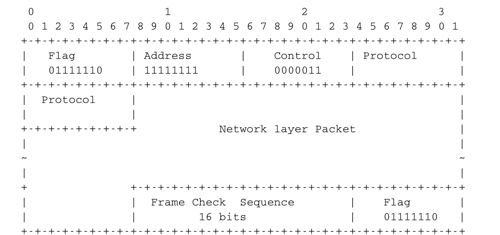

.. Copyright |copy| 2010 by Olivier Bonaventure
.. This file is licensed under a `creative commons licence <http://creativecommons.org/licenses/by/3.0/>`_

.. index:: Point-to-Point Protocol, PPP

El Protocolo Punto a Punto
==========================

.. Many point-to-point datalink layers [#flapb]_ have been developed, starting in the 1960s [McFadyen1976]_. In this section, we focus on the protocols that are often used to transport IP packets between hosts or routers that are directly connected by a point-to-point link. This link can be a dedicated physical cable, a leased line through the telephone network or a dial-up connection with modems on the two communicating hosts.

Muchas capas de enlace de datos [#flapb]_ fueron desarrolladas a partir de los 60 [McFadyen1976]_. En esta sección, nos enfocaremos en los protocolos que se usan frecuentemente para transportar paquetes IP entre nodos o routers que están directamente conectados a un vínculo punto a punto. Este vínculo puede ser un cable físico dedicado, una línea arrendada a través de la red telefónica, o una conexión discada con modems en ambos nodos que se comunican.

.. index:: Serial Line IP

.. The first solution to transport IP packets over a serial line was proposed in :rfc:`1055` and is known as `Serial Line IP` (SLIP). SLIP is a simple character stuffing technique applied to IP packets. SLIP defines two special characters : `END` (decimal 192) and `ESC` (decimal 219). `END` appears at the beginning and at the end of each transmitted IP packet and the sender adds `ESC` before each `END` character inside each transmitted IP packet. SLIP only supports the transmission of IP packets and it assumes that the two communicating hosts/routers have been manually configured with each other's IP address. SLIP was mainly used over links offering bandwidth of often less than 20 Kbps.  On such a low bandwidth link, sending 20 bytes of IP header followed by 20 bytes of TCP header for each TCP segment takes a lot of time. This initiated the development of a family of compression techniques to efficiently compress the TCP/IP headers. The first header compression technique proposed in :rfc:`1144` was designed to exploit the redundancy between several consecutive segments that belong to the same TCP connection. In all these segments, the IP addresses and port numbers are always the same. Furthermore, fields such as the sequence and acknowledgement numbers do not change in a random way. :rfc:`1144` defined simple techniques to reduce the redundancy found in successive segments. The development of header compression techniques continued and there are still improvements being developed now :rfc:`5795`.

La primera solución para transportar paquetes IP a través de una línea serial fue propuesta en :rfc:`1055`, y se conoce como `Serial Line IP` (SLIP). SLIP es una técnica simple de relleno de caracteres, aplicada a los paquetes IP. SLIP define dos caracteres especiales: `END` (decimal 192) y `ESC` (decimal 219). `END` aparece al comienzo y al final de cada paquete IP transmitido, y el emisor agrega `ESC` antes de cada carácter `END`, dentro de cada paquete IP transmitido. SLIP sólo soporta la transmisión de paquetes IP, y asume que los dos nodos o routers que se comunican han sido manualmente configurados con la dirección IP del otro. SLIP se usaba principalmente sobre enlaces que frecuentemente ofrecían anchos de banda de menos de 20 Kbps. En vínculos de tan bajo ancho de banda, enviar 20 bytes de cabecera IP, seguidos de 20 bytes de cabecera TCP, por cada segmento TCP, toma mucho tiempo. Esto inició el desarrollo de una familia de técnicas para comprimir eficientemente las cabeceras TCP/IP. La primera técnica de compresión de cabeceras propuesta en :rfc:`1144` fue diseñada para explotar la redundancia entre varios segmentos consecutivos que pertenecen a la misma conexión TCP. En todos esos segmentos, las direcciones IP y números de port son siempre los mismos. Además, campos como los números de secuencia y de reconocimiento cambian en formas predecibles. :rfc:`1144` definió técnicas simples para reducir la redundancia hallada en segmentos sucesivos. El desarrollo de técnicas de compresión de cabeceras continuó, y aún hoy sigue habiendo mejoras (:rfc:`5795`).

.. While SLIP was implemented and used in some environments, it had several limitations discussed in :rfc:`1055`. The `Point-to-Point Protocol` (PPP) was designed shortly after and is specified in :rfc:`1548`. PPP aims to support IP and other network layer protocols over various types of serial lines. PPP is in fact a family of three protocols that are used together :

Aunque SLIP fue implementado y usado en algunos ambientes, tenía varias limitaciones, discutidas en :rfc:`1055`. El `Protocolo Punto a Punto` (`Point-to-Point Protocol`, PPP) fue diseñado poco tiempo después, y está especificado en :rfc:`1548`. PPP apunta a soportar IP y otros protocolos de capa de Red, sobre varios tipos de líneas seriales. PPP es, de hecho, una familia de tres protocolos que se usan juntos:
 
 #. El `Protocolo Punto a Punto` (PPP) que define la técnica de `framing` para transportar paquetes de capa de Red. 
 #. El `Protocolo de Control de Línea` (`Link Control Protocol`, LCP) que se usa para negociar opciones y autenticar la sesión usando nombres de usuario y password, u otros tipos de credenciales.
 #. El `Protocolo de Control de Red` (`Network Control Protocol`, NCP) que es específico para cada protocolo de capa de Red. Se usa para negociar opciones específicas de cada protocolo.  Por ejemplo, el NCP de IPv4 :rfc:`1548` puede negociar las direcciones IPv4 que van a ser usadas, y la dirección IPv4 del `resolver` DNS. El NCP de IPv6 se define en  :rfc:`5072`.

.. #. The `Point-to-Point Protocol` defines the framing technique to transport network layer packets.
.. #. The `Link Control Protocol` that is used to negotiate options and authenticate the session by using username and password or other types of credentials
.. #. The `Network Control Protocol` that is specific for each network layer protocol. It is used to negotiate options that are specific for each protocol. For example, IPv4's NCP :rfc:`1548` can negotiate the IPv4 address to be used, the IPv4 address of the DNS resolver. IPv6's NCP is defined in :rfc:`5072`.

.. The PPP framing :rfc:`1662` was inspired by the datalink layer protocols standardised by ITU-T and ISO. A typical PPP frame is composed of the fields shown in the figure below. A PPP frame starts with a one byte flag containing `01111110`. PPP can use bit stuffing or character stuffing depending on the environment where the protocol is used. The address and control fields are present for backward compatibility reasons. The 16 bit Protocol field contains the identifier [#fpppid]_ of the network layer protocol that is carried in the PPP frame. `0x002d` is used for an IPv4 packet compressed with :rfc:`1144` while `0x002f` is used for an uncompressed IPv4 packet. `0xc021` is used by the Link Control Protocol, `0xc023` is used by the Password Authentication Protocol (PAP). `0x0057` is used for IPv6 packets. PPP supports variable length packets, but LCP can negotiate a maximum packet length. The PPP frame ends with a Frame Check Sequence. The default is a 16 bits CRC, but some implementations can negotiate a 32 bits CRC. The frame ends with the `01111110` flag.
  
El `framing` de PPP :rfc:`1662` se inspiró en los protocolos de la Capa de Enlace estandarizados por ITU-T e ISO. Una trama PPP típica se compone de los campos mostrados en la figura más abajo. Una trama PPP comienza con un byte de señal con el valor `01111110`. PPP puede usar rellenado de bit o de carácter, dependiendo del ambiente donde se use el protocolo. Los campos de direcciones y de control están presentes por razones de compatibilidad hacia atrás. El campo Protocolo, de 16 bits, contiene el identificador [#fpppid]_ del protocolo de la capa de Red que se transporta en la trama PPP. El valor `0x002d` se usa para un paquete IPv4 comprimido según :rfc:`1144`, mientras que para los paquetes IPv4 sin comprimir se usa  `0x002f`. Para el Protocolo de Control de Línea se usa `0xc021`; para el Protocolo de Autenticación por Password (PAP), se usa `0xc023`. Para paquetes IPv6 se usa `0x0057`. PPP soporta paquetes de longitud variable, pero LCP puede negociar un tamaño máximo de paquete. La trama PPP termina con un campo de `Secuencia de Verificación de Trama` (`Frame Check Sequence`. FCS). El valor por defecto es un CRC de 16 bits, pero algunas implementaciones pueden negociar un CRC de 32 bits. La trama termina con el byte señal `01111110`.

   Formato de trama PPP

.. index:: Extensible Authentication Protocol, EAP

.. PPP played a key role in allowing Internet Service Providers to provide dial-up access over modems in the late 1990s and early 2000s. ISPs operated modem banks connected to the telephone network. For these ISPs, a key issue was to authenticate each user connected through the telephone network. This authentication was performed by using the `Extensible Authentication Protocol` (EAP) defined in :rfc:`3748`. EAP is a simple, but extensible protocol that was initially used by access routers to authenticate the users connected through dialup lines. Several authentication methods, starting from the simple username/password pairs to more complex schemes have been defined and implemented. When ISPs started to upgrade their physical infrastructure to provide Internet access over `Asymmetric Digital Subscriber Lines` (ADSL), they tried to reuse their existing authentication (and billing) systems. To meet these requirements, the IETF developed specifications to allow PPP frames to be transported over other networks than the point-to-point links for which PPP was designed. Nowadays, most ADSL deployments use PPP over either ATM :rfc:`2364` or Ethernet :rfc:`2516`. 

PPP jugó un rol clave al permitir a los ISP proveer acceso discado sobre modems a fines de los 90 y comienzos del nuevo siglo. Los ISP operaban bancos de modems conectados a la red telefónica. Para estos ISPs, un tema crucial era cómo autenticar cada usuario que se conectaba por la red telefónica. Esta autenticación se ejecutaba usando el `Protocolo de Autenticación Extensible` (`Extensible Authentication Protocol`, EAP) definido en :rfc:`3748`. EAP es un protocolo simple, pero extensible, que fue inicialmente usado por routers de acceso para autenticar a sus usuarios conectados por líneas discadas. Se han definido e implementado varios métodos de autenticación, comenzando por los simples pares (nombre de usuario, password), hasta esquemas más complejos. Cuando los ISPs comenzaron a actualizar su infraestructura física para ofrecer acceso a Internet a través de ADSL, `Asymmetric Digital Subscriber Lines`, trataron de reutilizar sus sistemas existentes de autenticación y facturación. Para alcanzar estos requerimientos, IETF desarrolló especificaciones para permitir que las tramas PPP pudieran ser transportadas sobre otras redes que las punto a punto, para las cuales se había diseñado PPP. Hoy, la mayoría de las instalaciones ADSL utilizan PPP sobre ATM (`PPPoA`) :rfc:`2364` o sobre Ethernet (`PPPoE`) :rfc:`2516`. 

.. .. [#flapb] `LAPB <http://en.wikipedia.org/wiki/LAPB>`_ and `HDLC <http://en.wikipedia.org/wiki/HDLC>`_ were widely used datalink layer protocols. 

.. .. [#fpppid] The IANA maintains the registry of all assigned PPP protocol fields at : http://www.iana.org/assignments/ppp-numbers

.. [#flapb] `LAPB <http://en.wikipedia.org/wiki/LAPB>`_ y `HDLC <http://en.wikipedia.org/wiki/HDLC>`_ eran protocolos de capa de Enlace de Datos ampliamente usados. 

.. [#fpppid] El IANA mantiene el registro de todos los campos de protocolo PPP asignados en http://www.iana.org/assignments/ppp-numbers.
