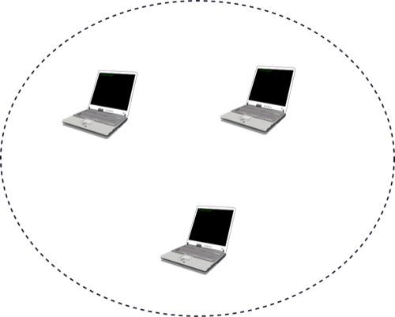
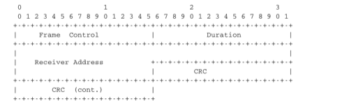
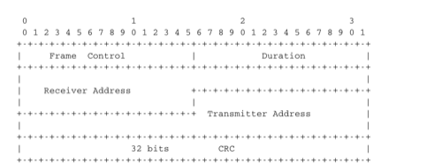

.. Copyright |copy| 2010 by Olivier Bonaventure
.. This file is licensed under a `creative commons licence <http://creativecommons.org/licenses/by/3.0/>`_

Redes inalámbricas 802.11
=========================

.. The radio spectrum is a limited resource that must be shared by everyone. During most of the twentieth century, governments and international organisations have regulated most of the radio spectrum. This regulation controls the utilisation of the radio spectrum, in order to ensure that there are no interferences between different users. A company that wants to use a frequency range in a given region must apply for a license from the regulator. Most regulators charge a fee for the utilisation of the radio spectrum and some governments have encouraged competition among companies bidding for the same frequency to increase the license fees. 

El espectro de radio es un recurso limitado que debe ser compartido por todos. Durante la mayor parte del siglo XX, los gobiernos y las organizaciones internacionales han regulado el uso del espectro. Esta regulación controla la utilización del espectro electromagnético, para asegurar que no haya interferencias entre diferentes usuarios. Una empresa que desea usar un rango de frecuencia en una región dada debe solicitar una licencia del ente regulador. La mayoría de los reguladores cobran una tarifa por la utilización del espectro de radio, y algunos gobiernos han estimulado la competencia entre las empresas que pujan por la misma frecuencia, para aumentar las tarifas de las licencias. 

En los 70, luego de los primeros experimentos con ALOHANet, el interés en las redes inalámbricas fue en aumento. Muchos experimentos se llevaron a cabo dentro y fuera de ARPANet. Uno de estos experimentos fue el `primer teléfono móvil <http://news.bbc.co.uk/2/hi/programmes/click_online/8639590.stm>`_, que fue desarrollado y probado en 1973. Este teléfono móvil experimental fue el punto de partida para la primera generación de teléfonos móviles analógicos. Dada la creciente demanda de teléfonos móviles, resultaba claro que la tecnología telefónica analógica móvil no era suficiente para soportar un gran número de usuarios. Para soportar más usuarios y más servicios, los investigadores de varios países trabajaron en el desarrollo de teléfonos digitales móviles. En 1987, varios países europeos decidieron desarrollar los estándares para un sistema telefónico celular común a toda Europa: el sistema GSM (`Global System for Mobile Communications`). Desde entonces, los estándares han evolucionado de manera que hoy existen más tres mil millones de usuarios conectados a redes GSM.

.. In the 1970s, after the first experiments with ALOHANet, interest in wireless networks grew. Many experiments were done on and outside the ARPANet. One of these experiments was the `first mobile phone <http://news.bbc.co.uk/2/hi/programmes/click_online/8639590.stm>`_ , which was developed and tested in 1973. This experimental mobile phone was the starting point for the first generation analog mobile phones. Given the growing demand for mobile phones, it was clear that the analog mobile phone technology was not sufficient to support a large number of users.  To support more users and new services, researchers in several countries worked on the development of digital mobile telephones. In 1987, several European countries decided to develop the standards for a common cellular telephone system across Europe : the `Global System for Mobile Communications` (GSM). Since then, the standards have evolved and more than three billion users are connected to GSM networks today.

.. index:: WiFi

.. comment:: OSO I suggest clarifing that WiFi is a commercial denomination vs. IEEE 802.11 as the name of a standard.

Aunque la mayoría de los rangos de frecuencias del espectro de radio están reservados para aplicaciones específicas y requieren una licencia especial, hay algunas excepciones. Estas excepciones son las bandas de radio ISM (`Industrial, Scientific and Medical bands <http://en.wikipedia.org/wiki/ISM_band>`_). Estas bandas pueden ser usadas para aplicaciones industriales, científicas y médicas sin requerir una licencia del regulador. Por ejemplo, algunos modelos radiocontrolados usan la banda ISM de 27 MHz, y algunos teléfonos inalámbricos operan en la banda ISM de 915 MHz. En 1985 se agregó la banda de 2.400 a 2.500 MHz a la lista de bandas ISM. Este rango corresponde a las frecuencias que emiten los hornos microondas. Compartir esta banda con aplicaciones licenciadas probablemente hubiera causado interferencias, debido al gran número de hornos microonda que se utilizan. A pesar del riesgo de interferencia con hornos microonda, la apertura de la banda de 2.4-2.5 GHz permitió a la industria de redes desarrollar varias técnicas inalámbricas para intercambiar datos entre computadoras sin uso de cables. En esta sección discutiremos en más detalle la más popular, la familia WiFi [802.11]_ de redes inalámbricas. Otras técnicas inalámbricas como `BlueTooth <http://en.wikipedia.org/wiki/BlueTooth>`_ o `HiperLAN <http://en.wikipedia.org/wiki/HiperLAN>`_ usan el mismo rango de frecuencias.

.. While most of the frequency ranges of the radio spectrum are reserved for specific applications and require a special licence, there are a few exceptions. These exceptions are known as the `Industrial, Scientific and Medical <http://en.wikipedia.org/wiki/ISM_band>`_ (ISM) radio bands. These bands can be used for industrial, scientific and medical applications without requiring a licence from the regulator. For example, some radio-controlled models use the 27 MHz ISM band and some cordless telephones operate in the 915 MHz ISM. In 1985, the 2.400-2.500 GHz band was added to the list of ISM bands. This frequency range corresponds to the frequencies that are emitted by microwave ovens. Sharing this band with licensed applications would have likely caused interferences, given the large number of microwave ovens that are used. Despite the risk of interferences with microwave ovens, the opening of the 2.400-2.500 GHz allowed the networking industry to develop several wireless network techniques to allow computers to exchange data without using cables. In this section, we discuss in more detail the most popular one, i.e. the WiFi [802.11]_ family of wireless networks. Other wireless networking techniques such as `BlueTooth <http://en.wikipedia.org/wiki/BlueTooth>`_ or `HiperLAN <http://en.wikipedia.org/wiki/HiperLAN>`_ use the same frequency range.

Hoy, la tecnología WiFi es muy popular. Hay varios cientos de millones de dispositivos WiFi en el mundo. El desarrollo de esta tecnología comenzó en los 80 con la red inalámbrica propietaria `WaveLAN <http://en.wikipedia.org/wiki/WaveLAN>`_. WaveLAN operaba a 2 Mbps y usaba diferentes bandas de frecuencia en diferentes regiones del mundo. A principios de los 90, IEEE_ creó el `grupo de trabajo 802.11 <http://www.ieee802.org/11/>`_ para estandarizar una familia de tecnologías de redes inalámbricas. Este grupo de trabajo fue muy prolífico y produjo varios estándares de redes inalámbricas que usan diferentes rangos de frecuencia y diferentes capas físicas. La tabla siguiente ofrece un resumen de los principales estándares 802.11.

.. Today, WiFi is a very popular wireless networking technology. There are more than several hundreds of millions of WiFi devices. The development of this technology started in the late 1980s with the `WaveLAN <http://en.wikipedia.org/wiki/WaveLAN>`_ proprietary wireless network. WaveLAN operated at 2 Mbps and used different frequency bands in different regions of the world. In the early 1990s, the IEEE_ created the `802.11 working group <http://www.ieee802.org/11/>`_ to standardise a family of wireless network technologies. This working group was very prolific and produced several wireless networking standards that use different frequency ranges and different physical layers. The table below provides a summary of the main 802.11 standards.

..
 ========        =========       ==========      ===========     ==============
 Standard	Frequency	Typical		Max		Range (m)
				throughput	bandwidth	indoor/outdoor
 ========        =========       ==========      ===========     ==============
 802.11		2.4 GHz		0.9 Mbps	2 Mbps		20/100
 802.11a		5 GHz		23 Mbps		54 Mbps		35/120
 802.11b		2.4 GHz		4.3 Mbps	11 Mbps		38/140
 802.11g		2.4 GHz		19 Mbps		54 Mbps		38/140
 802.11n		2.4/5 GHz	74 Mbps		150 Mbps	70/250
 ========        =========       ==========      ===========     ==============

========        ==========      ==========      ============== 	=================
Estándar	Frecuencia	Throughput	Ancho de banda	Rango
				típico		máx.		interior/exterior
========        ==========      ==========      ==============  =================
802.11		2.4 GHz		0.9 Mbps	2 Mbps		20/100 m
802.11a		5 GHz		23 Mbps		54 Mbps		35/120 m
802.11b		2.4 GHz		4.3 Mbps	11 Mbps		38/140 m
802.11g		2.4 GHz		19 Mbps		54 Mbps		38/140 m
802.11n		2.4/5 GHz	74 Mbps		150 Mbps	70/250 m
========        ==========      ==========      ============== 	=================
.. table:: 

.. When developing its family of standards, the `IEEE 802.11 working group <http://www.ieee802.org/11/>`_ took a similar approach as the `IEEE 802.3 working group <http://www.ieee802.org/3/>`_ that developed various types of physical layers for Ethernet networks. 802.11 networks use the CSMA/CA Medium Access Control technique described earlier and they all assume the same architecture and use the same frame format.

Al desarrollar su familia de estándares, el `grupo de trabajo 802.11 <http://www.ieee802.org/11/>`_ tomó una actitud similar a la del `grupo de trabajo IEEE 802.3 <http://www.ieee802.org/3/>`_ que desarrolló varios tipos de entidades de capa Física para redes Ethernet. Las redes 802.11 usan la técnica de control de acceso al medio (MAC) CSMA/CA que se ha descrito antes, y todos asumen la misma arquitectura y usan el mismo formato.

.. index:: Basic Service Set (BSS), BSS, adhoc network, independent network, red adhoc, red independiente

.. The architecture of WiFi networks is slightly different from the Local Area Networks that we have discussed until now. There are, in practice, two main types of WiFi networks : `independent` or `adhoc` networks  and `infrastructure` networks [#fBSS]_. An `independent` or `adhoc` network is composed of a set of devices that communicate with each other. These devices play the same role and the `adhoc` network is usually not connected to the global Internet. `Adhoc` networks are used when for example a few laptops need to exchange information or to connect a computer with a WiFi printer.

La arquitectura de redes WiFi es ligeramente diferente de las redes de área local que hemos discutido hasta ahora. En la práctica existen dos tipos de redes WiFi: redes `independientes` (o `ad hoc`) y redes `de infraestructura` (o `infrastructure`) [#fBSS]_. Una red `ad hoc` se compone de un conjunto de dispositivos que se comunican entre sí. Estos dispositivos juegan todos el mismo rol, y la red `ad hoc` normalmente no se conecta a la Internet global. Las redes `ad hoc` se usan, por ejemplo, cuando unas pocas laptops necesitan intercambiar información, o conectar una computadora con una impresora WiFi.

   Una red 802.11 independiente o ad hoc   
..   An 802.11 independent or adhoc network

.. index:: infrastructure network, red de infraestructura

.. Most WiFi networks are `infrastructure` networks. An `infrastructure` network contains one or more `access points` that are attached to a fixed Local Area Network (usually an Ethernet network) that is connected to other networks such as the Internet. The figure below shows such a network with two access points and four WiFi devices. Each WiFi device is associated to one access point and uses this access point as a relay to exchange frames with the devices that are associated to another access point or reachable through the LAN.

La mayoría de las redes WiFi son redes de infraestructura. Una red de infraestructura contiene uno o más `puntos de acceso` (AP) conectados a una LAN fija, normalmente una red Ethernet, la que a su vez se conecta con otras redes como Internet. La figura siguiente muestra una red de infraestructura con dos puntos de acceso y cuatro dispositivos WiFi. Cada dispositivo WiFi se asocia a un punto de acceso y usa a este AP como `relay` para intercambiar tramas con los dispositivos que están asociados a otro AP o que son alcanzables a través de la LAN.

.. figure:: svg/datalink-fig-019-c.png
   :align: center
   :scale: 70
   
   Una red de infraestructura 802.11
..   An 802.11 infrastructure network

.. An 802.11 access point is a relay that operates in the datalink layer like switches. The figure below represents the layers of the reference model that are involved when a WiFi host communicates with a host attached to an Ethernet network through an access point.
Un punto de acceso es un `relay` que opera en la capa de enlace, como los switches. La figura siguiente representa las capas del modelo de referencia que se ven involucradas cuando un host WiFi se comunica con un host conectado a una red Ethernet a través de un AP.

.. figure:: png/lan-fig-103-c.png
   :align: center
   :scale: 70
   
   Un punto de acceso 802.11
..   An 802.11 access point

.. index:: 802.11 frame format, formato de tramas 802.11

.. 802.11 devices exchange variable length frames, which have a slightly different structure than the simple frame format used in Ethernet LANs. We review the key parts of the 802.11 frames. Additional details may be found in [802.11]_ and [Gast2002]_ . An 802.11 frame contains a fixed length header, a variable length payload that may contain up 2324 bytes of user data and a 32 bits CRC. Although the payload can contain up to 2324 bytes, most 802.11 deployments use a maximum payload size of 1500 bytes as they are used in `infrastructure` networks attached to Ethernet LANs. An 802.11 data frame is shown below.

Los dispositivos 802.11 intercambian tramas de longitud variable, que tienen una estructura levemente diferente del formato simple usado en las LANs Ethernet. Revisaremos las porciones clave de las tramas 802.11. Se pueden encontrar más detalles en [802.11]_ y [Gast2002]_. Una trama 802.11 contiene una cabecera de longitud fija, una carga útil de longitud variable que puede contener hasta 2324 bytes de datos del usuario, y un CRC de 32 bits. Aunque la carga útil puede contener hasta 2324 bytes, la mayoría de las redes 802.11 usan un tamaño máximo de 1500 bytes porque éste es el de las redes infraestructura conectadas a LANs Ethernet. Una trama 802.11 de datos es como se muestra a continuación.

.. figure:: pkt/80211.png
   :align: center
   :scale: 100

   Formato de trama de datos 802.11
..   802.11 data frame format
 

.. The first part of the 802.11 header is the 16 bit `Frame Control` field. This field contains flags that indicate the type of frame (data frame, RTS/CTS, acknowledgement, management frames, etc), whether the frame is sent to or from a fixed LAN, etc [802.11]_. The `Duration` is a 16 bit field that is used to reserve the transmission channel. In data frames, the `Duration` field is usually set to the time required to transmit one acknowledgement frame after a SIFS delay. Note that the `Duration` field must be set to zero in multicast and broadcast frames. As these frames are not acknowledged, there is no need to reserve the transmission channel after their transmission. The `Sequence control` field contains a 12 bits sequence number that is incremented for each data frame.

La primera parte de la cabecera 802.11 es el campo de 16 bits `Frame Control`. Este campo contiene señales que indican el tipo de trama (trama de datos, RTS/CTS, reconocimiento, tramas de administración...), si la trama se envía a o desde una LAN fija, etc. [802.11]_. El campo `Duration` es un campo de 16 bits que se usa para reservar el canal de transmisión. En las tramas de datos, el valor del campo `Duration` generalmente se fija al tiempo requerido para transmitir una trama de reconocimiento luego de una demora SIFS. Nótese que el campo `Duration` debe ser puesto a cero en las tramas multicast y broadcast. Como estas tramas no son reconocidas, no hay necesidad de reservar el canal de transmisión luego de que sean transmitidas. El campo `Sequence control` contiene un número de secuencia de 12 bits que se incrementa a cada trama de datos.

.. The astute reader may have noticed that the 802.11 data frames contain three 48-bits address fields [#f4addresses]_ . This is surprising compared to other protocols in the network and datalink layers whose headers only contain a source and a destination address. The need for a third address in the 802.11 header comes from the `infrastructure` networks. In such a network, frames are usually exchanged between routers and servers attached to the LAN and WiFi devices attached to one of the access points. The role of the three address fields is specified by bit flags in the field. 

El lector alerta puede haber notado que las tramas de datos 802.11 contienen `tres` campos de direcciones de 48 bits [#f4addresses]_. La necesidad de una tercera dirección en la cabecera 802.11 viene de las redes de infraestructura. En estas redes, las tramas normalmente son intercambiadas entre routers y servers conectados a la LAN y dispositivos WiFi conectados a uno de los puntos de acceso. El rol de los tres campos de direcciones es especificado por señales de bits en el campo `Frame Control`.

.. When a frame is sent from a WiFi device to a server attached to the same LAN as the access point, the first address of the frame is set to the MAC address of the access point, the second address is set to the MAC address of the source WiFi device and the third address is the address of the final destination on the LAN. When the server replies, it sends an Ethernet frame whose source address is its MAC address and the destination address is the MAC address of the WiFi device. This frame is captured by the access point that converts the Ethernet header into an 802.11 frame header. The 802.11 frame sent by the access point contains three addresses : the first address is the MAC address of the destination WiFi device, the second address is the MAC address of the access point and the third address the MAC address of the server that sent the frame.

Cuando se envía una trama desde un dispositivo WiFi a un server conectado a la misma LAN que el punto de acceso, la primera dirección en la trama se hace igual a la dirección MAC del punto de acceso; la segunda, igual a la dirección MAC del dispositivo WiFi origen; y la tercera es la dirección del destino ubicado sobre la LAN. Cuando el server responde, envía una trama Ethernet cuya dirección origen es su propia dirección MAC, y cuya dirección destino es la dirección MAC del dispositivo WiFi. Esta trama es capturada por el punto de acceso, que convierte la cabecera Ethernet en una cabecera de trama 802.11. La trama 802.11 enviada por el punto de acceso contiene tres direcciones: la dirección MAC del dispositivo WiFi destino, la del punto de acceso y la del server que envió la trama.

.. 802.11 control frames are simpler than data frames. They contain a `Frame Control`, a `Duration` field and one or two addresses. The acknowledgement frames are very small. They only contain the address of the destination of the acknowledgement. There is no source address and no `Sequence Control` field in the acknowledgement frames. This is because the acknowledgement frame can easily be associated to the previous frame that it acknowledges. Indeed, each unicast data frame contains a `Duration` field that is used to reserve the transmission channel to ensure that no collision will affect the acknowledgement frame. The `Sequence Control` field is mainly used by the receiver to remove duplicate frames. Duplicate frames are detected as follows. Each data frame contains a 12 bits `Sequence Control` field and the `Frame Control` field contains the `Retry` bit flag that is set when a frame is transmitted.  Each 802.11 receiver stores the most recent sequence number received from each source address in frames whose `Retry` bit is reset. Upon reception of a frame with the `Retry` bit set, the receiver verifies its sequence number to determine whether it is a duplicated frame or not. 

Las tramas de control 802.11 son más simples que las tramas de datos. Contienen un campo `Frame Control`, un campo `Duration` y una o dos direcciones. Las tramas de reconocimiento son muy pequeñas. Contienen únicamente la dirección destino del reconocimiento. En las tramas de reconocimiento no hay dirección origen ni existe campo `Sequence Control`. Esto se debe a que la trama de reconocimiento puede ser asociada fácilmente con la trama anterior a la cual reconoce. En verdad, cada trama de datos `unicast` contiene un campo `Duration` que se usa para reservar el canal de transmisión, de manera de asegurar que la trama de reconocimiento no será afectada por colisiones. El campo `Sequence Control` es usado principalmente por el receptor para eliminar tramas duplicadas. Las tramas duplicadas se detectan como sigue. Cada trama de datos contiene un campo `Sequence Control` de 12 bits, y el campo `Frame Control` contiene la señal de bit `Retry` que se enciende cuando se transmite una trama. Cada receptor 802.11 almacena el número de secuencia más reciente recibido de cada dirección origen en aquellas tramas cuyo bit `Retry` está activo. Al recibir una trama con el bit `Retry` activo, el receptor verifica su número de secuencia para determinar si es una trama duplicada o no.

   Tramas ACK y CTS IEEE 802.11 

.. index:: RTS frame (802.11), CTS frame (802.11), Trama RTS (802.11), Trama CTS (802.11)

.. 802.11 RTS/CTS frames are used to reserve the transmission channel, in order to transmit one data frame and its acknowledgement. The RTS frames contain a `Duration` and the transmitter and receiver addresses. The `Duration` field of the RTS frame indicates the duration of the entire reservation (i.e. the time required to transmit the CTS, the data frame, the acknowledgements and the required SIFS delays). The CTS frame has the same format as the acknowledgement frame.

Las tramas RTS/CTS se usan para reservar el canal de transmisión, de modo de poder transmitir una trama de datos y su reconocimiento. Las tramas RTS contienen un campo `Duration` y las direcciones del transmisor y del receptor. El campo `Duration` de la trama RTS indica la duración de la reservación entera (es decir, el tiempo requerido para transmitir el CTS, la trama de datos, los reconocimientos y la demora SIFS requerida). La trama CTS tiene el mismo formato que la trama de reconocimiento. 

   Formato de trama RTS IEEE 802.11

.. .. note:: The 802.11 service
.. note:: El servicio 802.11

   Pese a la utilización de reconocimientos, la capa 802.11 sólo provee un servicio sin conexión, no confiable, como las redes Ethernet que no usan reconocimientos. Los reconocimientos en 802.11 se usan para minimizar la probabilidad de duplicación de tramas. No garantizan que todas las tramas vayan a ser recibidas por sus receptores. Como Ethernet, las redes 802.11 ofrecen una alta probabilidad de entrega exitosa de las tramas, no una garantía. Más aún, debe notarse que las redes 802.11 no usan reconocimientos para las tramas multicast y broadcast. Esto implica que, en la práctica, estas tramas son más propensas a sufrir errores de transmisión que las tramas unicast. 
.. Despite the utilization of acknowledgements, the 802.11 layer only provides an unreliable connectionless service like Ethernet networks that do not use acknowledgements. The 802.11 acknowledgements are used to minimize the probability of frame duplication. They do not guarantee that all frames will be correctly received by their recipients. Like Ethernet, 802.11 networks provide a high probability of successful delivery of the frames, not a guarantee. Furthermore, it should be noted that 802.11 networks do not use acknowledgements for multicast and broadcast frames. This implies that in practice such frames are more likely to suffer from transmission errors than unicast frames.

.. .. index:: beacon frame (802.11), Service Set Identity (SSID), SSID
.. index:: beacon frame (802.11), Service Set Identity (SSID), SSID, trama baliza (802.11)

.. In addition to the data and control frames that we have briefly described above, 802.11 networks use several types of management frames. These management frames are used for various purposes. We briefly describe some of these frames below. A detailed discussion may be found in [802.11]_ and [Gast2002]_. 
 
Además de las tramas de datos y control que hemos descripto brevemente más arriba, las redes 802.11 usan varios tipos de tramas de administración. Estas tramas de administración son usadas para varios prpósitos. Más abajo se describen algunas de estas tramas. Se puede ver una discusión detallada en [802.11]_ y en [Gast2002]_. 

.. A first type of management frames are the `beacon` frames. These frames are broadcasted regularly by access points. Each `beacon frame` contains information about the capabilities of the access point (e.g. the supported 802.11 transmission rates) and a `Service Set Identity` (SSID). The SSID is a null-terminated ASCII string that can contain up to 32 characters. An access point may support several SSIDs and announce them in beacon frames. An access point may also choose to remain silent and not advertise beacon frames. In this case, WiFi stations may send `Probe request` frames to force the available access points to return a `Probe response` frame.

Un primer tipo de tramas de administración son las llamadas `tramas baliza` (`beacon`). Estas tramas son difundidas regularmente por los puntos de acceso. Cada trama baliza contiene información sobre las capacidades del punto de acceso (por ejemplo, las velocidades de transmisión 802.11 soportadas) y un identificador del conjunto de servicio o SSID (`Service Set Identity`). El SSID es una cadena ASCII terminada en 0 que puede contener hasta 32 caracteres. Un punto de acceso puede soportar varios SSIDs y anunciarlos en tramas baliza. Además un punto de acceso puede decidir permanecer en silencio y no avisar sus tramas baliza. En este caso, las estaciones WiFi pueden enviar mensajes `Probe request` para forzar a que el punto de acceso devuelva una trama `Probe response`.

.. .. note:: IP over 802.11
.. note:: IP sobre 802.11

   Dos tipos de esquemas de encapsulamiento fueron definidos para soportar IP en redes Ethernet: el esquema original de encapsulamiento, construido sobre el formato DIX, definido en :rfc:`894`, y un segundo esquema de encapsulamiento :rfc:`1042`, construido sobre el protocolo LLC/SNAP [802.2]_. En redes 802.11, la situación es más simple, y únicamente se usa el encapsulamiento de :rfc:`1042`. En la práctica, este encapsulamiento agrega seis bytes a la cabecera 802.11. Los primeros cuatro corresponden a la cabecera LLC/SNAP. A éstos les siguen los dos bytes del campo `Type` de Ethernet (`0x800` para IP y `0x806` para ARP). La figura más abajo muestra un paquete IP encapsulado en una trama 802.11.

.. Two types of encapsulation schemes were defined to support IP in Ethernet networks : the original encapsulation scheme, built above the Ethernet DIX format is defined in :rfc:`894` and a second encapsulation :rfc:`1042` scheme, built above the LLC/SNAP protocol [802.2]_. In 802.11 networks, the situation is simpler and only the :rfc:`1042` encapsulation is used. In practice, this encapsulation adds 6 bytes to the 802.11 header. The first four bytes correspond to the LLC/SNAP header. They are followed by the two bytes Ethernet Type field (`0x800` for IP and `0x806` for ARP). The figure below shows an IP packet encapsulated in an 802.11 frame.

.. figure:: pkt/ip-80211.png
   :align: center
   :scale: 100

   IP sobre IEEE 802.11
..   IP over IEEE 802.11
 
.. The second important utilisation of the management frames is to allow a WiFi station to be associated with an access point. When a WiFi station starts, it listens to beacon frames to find the available SSIDs. To be allowed to send and receive frames via an access point, a WiFi station must be associated to this access point. If the access point does not use any security mechanism to secure the wireless transmission, the WiFi station simply sends an `Association request` frame to its preferred access point (usually the access point that it receives with the strongest radio signal). This frame contains some parameters chosen by the WiFi station and the SSID that it requests to join. The access point replies with an `Association response frame` if it accepts the WiFI station. 

El segundo empleo importante de las tramas de administración es permitir que una estación WiFi sea asociada con un punto de acceso. Cuando arranca una estación WiFi, escucha tramas baliza para encontrar los SSIDs disponibles. Para que se le permita enviar y recibir tramas por un punto de acceso, cada estación WiFi debe ser asociada a este punto de acceso. Si éste no usa mecanismos de seguridad para asegurar la transmisión inalámbrica, la estación simplemente envía una trama `Association request` a su punto de acceso preferido (normalmente, el punto de acceso que recibe con la señal de radio más fuerte). Esta trama contiene algunos parámetros elegidos por la estación WiFi y el SSID al que solicita asociarse. El punto de acceso responde con una trama `Association response` si acepta a la estación. 

.. rubric:: Footnotes

.. .. [#fBSS] The 802.11 working group defined the `basic service set (BSS)` as a group of devices that communicate with each other. We continue to use `network` when referring to a set of devices that communicate.

.. [#fBSS] El grupo de trabajo 802.11 definió el conjunto básico de servicios (`basic service set, BSS`) como un grupo de dispositivos que se comunican entre sí. Seguimos usando el término `red` cuando nos referimos a un conjunto de dispositivos que se comunican. 

.. .. [#f4addresses] In fact, the [802.11]_ frame format contains a fourth optional address field. This fourth address is only used when an 802.11 wireless network is used to interconnect bridges attached to two classical LAN networks.

.. [#f4addresses] En realidad, el formato de tramas [802.11]_ contiene un cuarto campo de dirección opcional. Esta cuarta dirección sólo se usa cuando un red inalámbrica 802.11 se usa para interconectar bridges conectados a dos redes LAN clásicas. 

.. include:: ../links.rst
