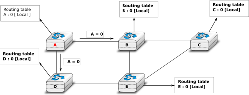

.. Copyright |copy| 2010 by Olivier Bonaventure
.. This file is licensed under a `creative commons licence <http://creativecommons.org/licenses/by/3.0/>`_

.. index:: Distance vector

.. Distance vector routing
Ruteo de vector de distancias
-----------------------------

.. Distance vector routing is a simple distributed routing protocol. Distance vector routing allows routers to automatically discover the destinations reachable inside the network as well as the shortest path to reach each of these destinations. The shortest path is computed based on `metrics` or `costs` that are associated to each link. We use `l.cost` to represent the metric that has been configured for link `l` on a router. 

El ruteo de vector de distancias es un protocolo de ruteo distribuido. Permite a los routers descubrir automáticamente los destinos alcanzables dentro de la red, así como el camino más corto para alcanzar cada uno de estos destinos. El camino más corto se computa basándose en `métricas` o `costos` que se asocian a cada enlace. Usaremos `l.cost` para representar la métrica que ha sido configurada para el enlace `l` en un router.

.. Each router maintains a routing table. The routing table `R` can be modelled as a data structure that stores, for each known destination address `d`, the following attributes :

..  - `R[d].link` is the outgoing link that the router uses to forward packets towards destination `d`
..  - `R[d].cost` is the sum of the metrics of the links that compose the shortest path to reach destination `d`
..  - `R[d].time` is the timestamp of the last distance vector containing destination `d`

Cada router mantiene una tabla de ruteo. La tabla de ruteo `R` puede ser modelada como una estructura de datos que almacena, por cada destino conocido `d`, los siguientes atributos:

  - `R[d].link` es el enlace de salida que el router usará para reenviar paquetes hacia el destino `d`.
  - `R[d].cost` es la suma de las métricas de los enlaces que componen el camino más corto hasta el destino `d`.
  - `R[d].time` es la marca de tiempo (`timestamp`) del último vector de distancias conteniendo el destino `d`.

.. A router that uses distance vector routing regularly sends its distance vector over all its interfaces. The distance vector is a summary of the router's routing table that indicates the distance towards each known destination. This distance vector can be computed from the routing table by using the pseudo-code below.

Un router que usa ruteo por vector de distancias enviará periódicamente su propio vector de distancias por todas sus interfaces. El vector de distancias es un resumen de la tabla de ruteo del router que indica la distancia hacia cada destino. Este vector de distancias puede computarse a partir de la tabla de ruteo usando el pseudocódigo siguiente.

.. code-block:: python

 cada N segundos: 
  v=Vector()
  for d in R[]:
     # agregar el destino d al vector
     v.add(Pair(d,R[d].cost))
  for i in interfaces
     # enviar el vector v por esta interfaz
     send(v,i)  

.. When a router boots, it does not know any destination in the network and its routing table only contains itself. It thus sends to all its neighbours a distance vector that contains only its address at a distance of `0`. When a router receives a distance vector on link `l`, it processes it as follows.

Cuando un router arranca, no conoce ningún destino en la red, y en su tabla de ruteo sólo figura él mismo. Envía entonces a todos sus vecinos un vector distancia que contiene sólo su propia dirección a una distancia de `0`. Cuando un router recibe un vector de distancias por el enlace `l`, lo procesa de la forma siguiente.

.. code-block:: python

 # V : Vector recibido
 # l : Enlace por el cual se recibió el vector
 def recibido(V,l):
    # Vector recibido por el enlace l
    for d in V[]
      if not (d in R[]) :
         # nueva ruta
      	 R[d].cost=V[d].cost+l.cost
      	 R[d].link=l
      	 R[d].time=now
      else :
         # la ruta existe; ¿la nueva es mejor?
	 if ( ((V[d].cost+l.cost) < R[d].cost) or ( R[d].link == l) )  :
	      # ruta mejor, o cambio a la ruta actual
       	      R[d].cost=V[d].cost+l.cost
       	      R[d].link=l
       	      R[d].time=now

.. The router iterates over all addresses included in the distance vector. If the distance vector contains an address that the router does not know, it inserts the destination inside its routing table via link `l` and at a distance which is the sum between the distance indicated in the distance vector and the cost associated to link `l`. If the destination was already known by the router, it only updates the corresponding entry in its routing table if either : 
 
.. - the cost of the new route is smaller than the cost of the already known route `( (V[d].cost+l.cost) < R[d].cost)`
.. - the new route was learned over the same link as the current best route towards this destination `( R[d].link == l)`

El router itera sobre todas las direcciones incluidas en el vector de distancias. Si el vector de distancias contiene una dirección que el router no conoce, la inserta en su tabla de ruteo vía el enlace `l` y a una distancia igual a la suma entre la distancia indicada en el vector de distancias y el costo asociado al enlace `l`. Si el destino ya era conocido por el router, entoces sólo actualiza la entrada correspondiente en su tabla de ruteo si:
 
 - el costo de la nueva ruta es menor que el de la ya conocida `((V[d].cost+l.cost) < R[d].cost)`, o bien
 - la nueva ruta fue aprendida por el mismo enlace que la mejor ruta actual hacia este destino `(R[d].link == l)`.

.. The first condition ensures that the router discovers the shortest path towards each destination. The second condition is used to take into account the changes of routes that may occur after a link failure or a change of the metric associated to a link.

La primera condición asegura que el router descubra el camino más corto hacia cada destino.  La segunda condición es usada para dar cuenta de los cambios de rutas que pueden ocurrir luego de un fallo de un enlace o de un cambio de métrica asociada a un enlace. 

.. To understand the operation of a distance vector protocol, let us consider the network of five routers shown below.
Para comprender la operación de un protocolo de vector de distancias, consideremos la red de cinco routers que se muestra a continuación. 

   Operación del ruteo de vector de distancias en una red simple
..   Operation of distance vector routing in a simple network

.. Assume that `A` is the first to send its distance vector `[A=0]`.

.. - `B` and `D` process the received distance vector and update their routing table with a route towards `A`. 
.. - `D` sends its distance vector `[D=0,A=1]` to `A` and `E`. `E` can now reach `A` and `D`.
.. - `C` sends its distance vector `[C=0]` to `B` and `E`
.. - `E` sends its distance vector `[E=0,D=1,A=2,C=2]` to `D`, `B` and `C`. `B` can now reach `A`, `C`, `D` and `E`
.. - `B` sends its distance vector `[B=0,A=1,C=1,D=2,E=1]` to `A`, `C` and `E`. `A`, `B`, `C` and `E` can now reach all destinations.
.. - `A` sends its distance vector `[A=0,B=1,C=2,D=1,E=2]` to `B` and `D`. 

Supongamos que `A` es el primero en enviar su vector de distancias `[A=0]`.

 - `B` y `D` procesan el vector de distancias recibido y actualizan su tabla de ruteo con una ruta hacia `A`. 
 - `D` envía su vector de distancias `[D=0,A=1]` hacia `A` y `E`. `E` ahora puede alcanzar `A` y `D`.
 - `C` envía su vector de distancias `[C=0]` hacia `B` y `E`
 - `E` envía su vector de distancias `[E=0,D=1,A=2,C=2]` a `D`, `B` y `C`. `B` ahora puede alcanzar `A`, `C`, `D` y `E`
 - `B` envía su vector de distancias `[B=0,A=1,C=1,D=2,E=1]` a `A`, `C` y `E`. `A`, `B`, `C` y `E` ahora pueden alcanzar todos los destinos.
 - `A` envía su vector de distancias `[A=0,B=1,C=2,D=1,E=2]` a `B` y `D`. 

.. At this point, all routers can reach all other routers in the network thanks to the routing tables shown in the figure below.

En este punto, todos los routers pueden alcanzar a todos los demás en la red, gracias a las tablas de ruteo mostradas en la figura a continuación. 

.. figure:: svg/dv-full.png
   :align: center
   :scale: 100   

   Tablas de ruteo computadas por vectores de distancias en una red simple
..   Routing tables computed by distance vector in a simple network

.. To deal with link and router failures, routers use the timestamp stored in their routing table. As all routers send their distance vector every `N` seconds, the timestamp of each route should be regularly refreshed. Thus no route should have a timestamp older than `N` seconds, unless the route is not reachable anymore. In practice, to cope with the possible loss of a distance vector due to transmission errors, routers check the timestamp of the routes stored in their routing table every `N` seconds and remove the routes that are older than :math:`3 \times N` seconds. When a router notices that a route towards a destination has expired, it must first associate an :math:`\infty` cost to this route and send its distance vector to its neighbours to inform them. The route can then be removed from the routing table after some time (e.g. :math:`3 \times N` seconds), to ensure that the neighbouring routers have received the bad news, even if some distance vectors do not reach them due to transmission errors. 

Para tratar el problema de los fallos de enlaces y de routers, los routers usan la marca de tiempo almacenada en su tabla de ruteo. Como todos los routers envían su vector cada `N` segundos, la marca de tiempo de cada ruta será refrescada periódicamente. Así, ninguna ruta deberá tener una marca de tiempo mayor que `N` segundos, a menos que la ruta ya no sea más alcanzable. En la práctica, para enfrentar la posible pérdida de un vector de distancias debido a errores de transmisión, los routers verifican la marca de tiempo de las rutas almacenadas en su tabla de ruteo cada `N` segundos, y eliminan las rutas de más de :math:`3 \times N` segundos de antigüedad. Cuando un router advierte que una ruta hacia un destino ha expirado, primeramente debe asociar a esta ruta un costo :math:`\infty` y enviar su vector de distancias a los vecinos a fin de informarles. Luego la ruta puede ser retirada de la tabla de ruteo luego de algún tiempo (por ejemplo, :math:`3 \times N` segundos), para asegurar que los routers vecinos hayan recibido las malas noticias, aun cuando algunos vectores de distancias no les hayan llegado debido a errores de trasmisión. 

.. Consider the example above and assume that the link between routers `A` and `B` fails. Before the failure, `A` used `B` to reach destinations `B`, `C` and `E` while `B` only used the `A-B` link to reach `A`. The affected entries timeout on routers `A` and `B` and they both send their distance vector.

..  - `A` sends its distance vector :math:`[A=0,D=\infty,C=\infty,D=1,E=\infty]`. `D` knows that it cannot reach `B` anymore via `A`
..  - `D` sends its distance vector :math:`[D=0,B=\infty,A=1,C=2,E=1]` to `A` and `E`. `A` recovers routes towards `C` and `E` via `D`.
.. - `B` sends its distance vector :math:`[B=0,A=\infty,C=1,D=2,E=1]` to `E` and `C`. `D` learns that there is no route anymore to reach `A` via `B`.
.. - `E` sends its distance vector :math:`[E=0,A=2,C=1,D=1,B=1]` to `D`, `B` and `C`. `D` learns a route towards `B`. `C` and `B` learn a route towards `A`. 
 
Consideremos el ejemplo anterior y supongamos que el enlace entre los routers `A` y `B` falla. Antes del fallo, `A` usaba a `B` para alcanzar los destinos `B`, `C` y `E`, mientras que `B` sólo usaba el enlace `A-B` para llegar a `A`. Los elementos afectados en las tablas de ruteo de los router `A` y `B` expiran, y ambos envían su vector de distancias.

 - `A` envía su vector de distancias :math:`[A=0,D=\infty,C=\infty,D=1,E=\infty]`. `D` sabe que ya no puede llegar a `B` a través de `A`
 - `D` envía su vector de distancias :math:`[D=0,B=\infty,A=1,C=2,E=1]` a `A` y `E`. `A` recupera las rutas hacia `C` y `E` a través de `D`.
 - `B` envía su vector de distancias :math:`[B=0,A=\infty,C=1,D=2,E=1]` a `E` y `C`. `D` aprende que ya no hay ruta para llegar a `A` a través de `B`.
 - `E` envía su vector de distancias :math:`[E=0,A=2,C=1,D=1,B=1]` a `D`, `B` y `C`. `D` aprende una ruta hacia `B`. `C` y `B` aprenden una ruta hacia `A`. 

.. At this point, all routers have a routing table allowing them to reach all another routers, except router `A`, which cannot yet reach router `B`. `A` recovers the route towards `B` once router `D` sends its updated distance vector :math:`[A=1,B=2,C=2,D=1,E=1]`. This last step is illustrated in figure :ref:`fig-afterfailure`, which shows the routing tables on all routers.

Llegados a este punto, todos los routers tienen una tabla de ruteo que les permite alcanzar a todos los demás routers, excepto por el router `A`, que aún no puede alcanzar al router `B`. `A` recuperará la ruta hacia `B` una vez que  `D` envíe su vector de distancias actualizado :math:`[A=1,B=2,C=2,D=1,E=1]`. Este último paso se ilustra en la figura siguiente, que muestra las tablas de ruteo en todos los routers. 

.. _fig-afterfailure:

.. figure:: svg/dv-failure-2.png
   :align: center
   :scale: 100   

   Tablas de ruteo computadas por vectores de distancia luego de un fallo
..   Routing tables computed by distance vector after a failure

.. index:: count to infinity

.. Consider now that the link between `D` and `E` fails. The network is now partitioned into two disjoint parts : (`A` , `D`)  and (`B`, `E`, `C`). The routes towards `B`, `C` and `E` expire first on router `D`. At this time, router `D` updates its routing table.
Consideremos ahora qué ocurre si el enlace entre `D` y `E` falla. La red queda particionada en dos regiones disjuntas: (`A` , `D`) y (`B`, `E`, `C`). Las rutas entre `B`, `C` y `E` expiran primero en el router `D`. En este momento, el router `D` actualiza su tabla de ruteo.

.. If `D` sends :math:`[D=0, A=1, B=\infty, C=\infty, E=\infty]`, `A` learns that `B`, `C` and `E` are unreachable and updates its routing table.

Si `D` envía :math:`[D=0, A=1, B=\infty, C=\infty, E=\infty]`, `A` aprende que `B`, `C` y `E` son inalcanzables y actualiza su tabla de ruteo.

.. Unfortunately, if the distance vector sent to `A` is lost or if `A` sends its own distance vector ( :math:`[A=0,D=1,B=3,C=3,E=2]` ) at the same time as `D` sends its distance vector, `D` updates its routing table to use the shorter routes advertised by `A` towards `B`, `C` and `E`. After some time `D` sends a new distance vector : :math:`[D=0,A=1,E=3,C=4,B=4]`. `A` updates its routing table and after some time sends its own distance vector :math:`[A=0,D=1,B=5,C=5,E=4]`, etc. This problem is known as the `count to infinity problem` in networking literature. Routers `A` and `D` exchange distance vectors with increasing costs until these costs reach :math:`\infty`. This problem may occur in other scenarios than the one depicted in the above figure. In fact, distance vector routing may suffer from count to infinity problems as soon as there is a cycle in the network. Cycles are necessary to have enough redundancy to deal with link and router failures. To mitigate the impact of counting to infinity, some distance vector protocols consider that :math:`16=\infty`. Unfortunately, this limits the metrics that network operators can use and the diameter of the networks using distance vectors.

Desafortunadamente, si el vector de distancias enviado a `A` se pierde, o si `A` envía su propio vector de distancias :math:`[A=0,D=1,B=3,C=3,E=2]` al mismo tiempo que `D` envía su vector de distancias, `D` actualiza su tabla de ruteo para usar las rutas más cortas anunciadas por `A` hacia `B`, `C` y `E`. Luego de algún tiempo `D` envía un nuevo vector de distancias: :math:`[D=0,A=1,E=3,C=4,B=4]`. `A` actualiza su tabla de ruteo y luego de algún tiempo envía su propio vector de distancias :math:`[A=0,D=1,B=5,C=5,E=4]`, etc. Este problema se conoce como el `problema de cuenta al infinito` en la literatura de redes. Los routers `A` y `D` intercambian vectores de distancia con costos que se incrementan hasta que alcanzan :math:`\infty`. Este problema puede ocurrir en otros escenarios que los propuestos en la figura anterior. De hecho, el ruteo de vector de distancias puede sufrir el problema de cuenta al infinito apenas existe un ciclo en la red. Los ciclos son necesarios a fin de tener bastante redundancia para tratar los fallos de enlaces y de routers. Para mitigar el impacto de la cuenta al infinito, algunos protocolos de vector de distancias consideran que :math:`16=\infty`. Desafortunadamente, esto limita las métricas que pueden usar los operadores de las redes, así como el diámetro de las redes que usan vector de distancia.

.. index:: split horizon, split horizon with poison reverse

.. This count to infinity problem occurs because router `A` advertises to router `D` a route that it has learned via router `D`. A possible solution to avoid this problem could be to change how a router creates its distance vector. Instead of computing one distance vector and sending it to all its neighbors, a router could create a distance vector that is specific to each neighbour and only contains the routes that have not been learned via this neighbour. This could be implemented by the following pseudocode.

Este problema de la cuenta al infinito ocurre porque el router `A` anuncia al router `D` una ruta que ha aprendido a través de `D`. Una posible solución para evitar este problema es modificar la manera como se crean los vectores de distancia. En lugar de computar un vector de distancias y enviarlo a todos los vecinos, un router podría crear un vector de distancias que sea específico de cada vecino, y sólo contener las rutas que no hayan sido aprendidas a través de este vecino. Esto podría ser implementado con el siguiente pseudocódigo.

.. code-block:: python

 cada N segundos: 
  # un vector por cada interfaz
  for l in interfaces:
    v=Vector()
    for d in R[]:
      if (R[d].link != l) :
      	 v=v+Pair(d,R[d.cost])
    send(v,l)
    # end for d in R[]
  #end for l in interfaces  

.. This technique is called `split-horizon`. With this technique, the count to infinity problem would not have happened in the above scenario, as router `A` would have advertised :math:`[A=0]`, since it learned all its other routes via router `D`. Another variant called `split-horizon with poison reverse` is also possible.  Routers using this variant advertise a cost of :math:`\infty` for the destinations that they reach via the router to which they send the distance vector. This can be implemented by using the pseudo-code below.

Esta técnica se llama `horizonte dividido` (`split-horizon`). Con esta técnica, el problema de la cuenta al infinito no habría ocurrido en el escenario anterior, porque el router `A` habría anunciado :math:`[A=0]`, ya que aprendió todas las demás rutas a través del router `D`. También es posible otra variante llamada `horizonte dividido con inversa envenenada` (`split-horizon with poison reverse`).  Los routers que usan esta variante anuncian un costo de :math:`\infty` para los destinos que alcanzan a través del router al cual envían el vector de distancias. Una implementación es como muestra el pseudocódigo siguiente.

.. code-block:: python

 cada N segundos: 
  for l in interfaces:
    # un vector por cada interfaz
    v=Vector()
    for d in R[]:
      if (R[d].link != l) :
      	 v=v+Pair(d,R[d.cost])
      else:
         v=v+Pair(d,infinity);
    send(v,l)
    # end for d in R[]
  #end for l in interfaces  

.. Unfortunately, split-horizon, is not sufficient to avoid all count to infinity problems with distance vector routing. Consider the failure of link `A-B` in the network of four routers below.

Desafortunadamente, la técnica de horizonte dividido no es suficiente para evitar todos los problemas de cuenta al infinito con el ruteo de vectores distancia. Consideremos el fallo del enlace `A-B` en la red de cuatro routers que sigue.

.. figure:: svg/dv-infinity.png
   :align: center
   :scale: 100   

   Problema de cuenta al infinito
..   Count to infinity problem

.. After having detected the failure, router `A` sends its distance vectors :

Tras haber detectado el fallo, el router `A` envía sus vectores de distancias:

 - :math:`[A=\infty,B=0,C=\infty,E=1]` al router `C`
 - :math:`[A=\infty,B=0,C=1,E=\infty]` al router `E`

.. If, unfortunately, the distance vector sent to router `C` is lost due to a transmission error or because router `C` is overloaded, a new count to infinity problem can occur. If router `C` sends its distance vector :math:`[A=2,B=1,C=0,E=\infty]` to router `E`, this router installs a route of distance `3` to reach `A` via `C`. Router `E` sends its distance vectors :math:`[A=3,B=\infty,C=1,E=1]` to router `B` and :math:`[A=\infty,B=1,C=\infty,E=0]` to router `C`. This distance vector allows `B` to recover a route of distance `4` to reach `A`.

Si, por desgracia, el vector de distancias enviado al router `C` se pierde debido a errores de transmisión o porque el router `C` se encuentra sobrecargado, puede ocurrir un nuevo problema de cuenta al infinito. Si el router `C` envía su vector de distancias :math:`[A=2,B=1,C=0,E=\infty]` al router `E`, este router instalará una ruta de distancia `3` para llegar a `A` a través de `C`. El router `E` envía sus vectores de distancias :math:`[A=3,B=\infty,C=1,E=1]` al router `B` y :math:`[A=\infty,B=1,C=\infty,E=0]` al router `C`. Este vector de distancias permite a `B` recuperar una ruta de distancia `4` para llegar a `A`.

