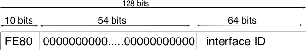
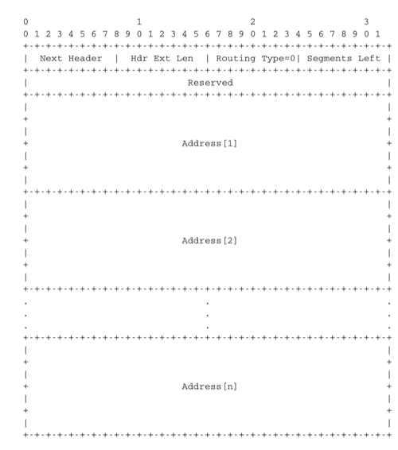

.. Copyright |copy| 2010 by Olivier Bonaventure
.. This file is licensed under a `creative commons licence <http://creativecommons.org/licenses/by/3.0/>`_

IP versión 6
============

.. In the late 1980s and early 1990s the growth of the Internet was causing several operational problems on routers. Many of these routers had a single CPU and up to 1 MByte of RAM to store their operating system, packet buffers and routing tables. Given the rate of allocation of IPv4 prefixes to companies and universities willing to join the Internet, the routing tables where growing very quickly and some feared that all IPv4 prefixes would quickly be allocated. In 1987, a study cited in :rfc:`1752`, estimated that there would be 100,000 networks in the near future. In August 1990, estimates indicated that the class B space would be exhausted by March 1994.

A fines de los años 80 y principios de los 90, el crecimiento de Internet causaba varios problemas operativos en los routers. Muchos de estos routers tenían una única CPU y hasta 1 MB de RAM para almacenar su sistema operativo, buffers de paquetes y tablas de ruteo. Dada la velocidad con que se asignaban los prefijos IPv4 a organizaciones y universidades deseosas de unirse a Internet, las tablas de ruteo crecían muy rápidamente, y se temía que todos los prefijos IPv4 se agotaran. En 1987, un estudio citado en :rfc:`1752` estimaba que en un futuro cercano habría 100.000 redes. En Agosto de 1990, las estimaciones indicaban que el espacio de clase B quedaría agotado hacia 1994.

.. Two types of solution were developed to solve this problem. The first short term solution was the introduction of Classless Inter Domain Routing (:term:`CIDR`). A second short term solution was the Network Address Translation (:term:`NAT`) mechanism, defined in :rfc:`1631`. NAT allowed multiple hosts to share a single public IP address, it is explained in section :ref:`Middleboxes`.

Se desarrollaron dos tipos de soluciones para resolver este problema. La primera solución, de corto plazo, fue la introducción del Ruteo Interdominios Sin Clases (`Classless Inter Domain Routing`, :term:`CIDR`). Una segunda solución de corto plazo fue el mecanismo de Traducción de Direcciones de Red (`Network Address Translation`, :term:`NAT`), definido en :rfc:`1631`. NAT permitió a múltiples hosts compartir una dirección IP pública y única, como se explica en la sección :ref:`Middleboxes`.

.. However, in parallel with these short-term solutions, which have allowed the IPv4 Internet to continue to be usable until now, the Internet Engineering Task Force started to work on developing a replacement for IPv4. This work started with an open call for proposals, outlined in :rfc:`1550`. Several groups responded to this call with proposals for a next generation Internet Protocol (IPng) :
.. * TUBA proposed in :rfc:`1347` and :rfc:`1561`
..  * PIP proposed in :rfc:`1621`
..  * SIPP proposed in :rfc:`1710`

Sin embargo, paralelamente a estas soluciones de corto plazo, que han permitido a la Internet IPv4 continuar siendo usable hasta ahora, IETF comenzó a trabajar en un reemplazo para IPv4. Este trabajo comenzó con un llamado abierto a propuestas, delineado en :rfc:`1550`. Varios grupos respondieron a este llamado con propuestas para un Protocolo de Internet de Próxima Generación (`IPng`):

 * TUBA, propuesto en :rfc:`1347` and :rfc:`1561`
 * PIP, propuesto en :rfc:`1621`
 * SIPP, propuesto en :rfc:`1710`

.. The IETF decided to pursue the development of IPng based on the SIPP proposal. As IP version `5` was already used by the experimental ST-2 protocol defined in :rfc:`1819`, the successor of IP version 4 is IP version 6. The initial IP version 6 defined in :rfc:`1752` was designed based on the following assumptions :

.. * IPv6 addresses are encoded as a 128 bits field
.. * The IPv6 header has a simple format that can easily be parsed by hardware devices
.. * A host should be able to configure its IPv6 address automatically
.. * Security must be part of IPv6

IETF decidió abordar el desarrollo de IPng basándose en la propuesta SIPP. Como la versión `5` de IP ya estaba siendo usada por el protocolo experimental ST-2, definido en :rfc:`1819`, el sucesor de IP versión 4 es IP versión 6. La versión 6 de IP definida en :rfc:`1752` fue diseñada con base en las siguientes premisas:

 * Codificar las direcciones IPv6 sobre campos de 128 bits
 * Dotar a la cabecera IPv6 de un formato simple, fácilmente procesable por dispositivos de hardware
 * Un host debe ser capaz de configurar su dirección IPv6 automáticamente
 * La seguridad debe estar integrada en IPv6

.. .. note:: The IPng address size

.. When the work on IPng started, it was clear that 32 bits was too small to encode an IPng address and all proposals used longer addresses. However, there were many discussions about the most suitable address length. A first approach, proposed by SIP in :rfc:`1710`, was to use 64 bit addresses. A 64 bits address space was 4 billion times larger than the IPv4 address space and, furthermore, from an implementation perspective, 64 bit CPUs were being considered and 64 bit addresses would naturally fit inside their registers. Another approach was to use an existing address format. This was the TUBA proposal (:rfc:`1347`) that reuses the ISO CLNP 20 bytes addresses. The 20 bytes addresses provided room for growth, but using ISO CLNP was not favored by the IETF partially due to political reasons, despite the fact that mature CLNP implementations were already available. 128 bits appeared to be a reasonable compromise at that time.

.. note:: Tamaño de las direcciones IPng

 Al comenzar el trabajo sobre IPng, era claro que 32 bits eran demasiado pocos para codificar una dirección IPng, y todas las propuestas usaban direcciones mayores. Sin embargo, hubo mucha discusión sobre la longitud de direcciones más adecuada. Un primer abordaje, propuesto por SIPP en :rfc:`1710`, fue usar direcciones de 64 bits. Un espacio de direcciones de este tamaño era cuatro mil millones de veces mayor que el de IPv4, y además, desde un punto de vista de implementación, estaban siendo consideradas las CPUs de 64 bits, y las direcciones del mismo tamaño se amoldarían naturalmente a sus registros. Otra propuesta consistía en usar un formato de direcciones existente. Ésta era la propuesta TUBA (:rfc:`1347`) que reutiliza las direcciones de 20 bytes del formato ISO CLNP. Las direcciones de 20 bytes ofrecían espacio para el crecimiento; pero el uso de ISO CLNP no fue aprobado por IETF, en parte debido a razones políticas, y a pesar del hecho de que ya existían implementaciones CLNP maduras y disponibles. Los 128 bits parecieron un compromiso razonable en ese momento.

Arquitectura del direccionamiento IPv6
--------------------------------------

.. The experience of IPv4 revealed that the scalability of a network layer protocol heavily depends on its addressing architecture. The designers of IPv6 spent a lot of effort defining its addressing architecture :rfc:`3513`. All IPv6 addresses are 128 bits wide. This implies that there are :math:`340,282,366,920,938,463,463,374,607,431,768,211,456 (3.4 \times 10^{38})` different IPv6 addresses. As the surface of the Earth is about 510,072,000 :math:`km^2`, this implies that there are about :math:`6.67 \times 10^{23}` IPv6 addresses per square meter on Earth. Compared to IPv4, which offers only 8 addresses per square kilometer, this is a significant improvement on paper. 

La experiencia de IPv4 reveló que la escalabilidad de un protocolo de Capa de Red depende fuertemente de su arquitectura de direccionamiento. Los diseñadores de IPv6 dedicaron muchos esfuerzos a definir dicha arquitectura de direccionamiento :rfc:`3513`. Todas las direcciones IPv6 son de 128 bits de acho. Esto implica que hay :math:`340,282,366,920,938,463,463,374,607,431,768,211,456 (3.4 \times 10^{38})` diferentes direcciones IPv6. Como la superficie de la Tierra es de alrededor de 510,072,000 :math:`km^2`, esto quiere decir que hay alredededor de :math:`6.67 \times 10^{23}` direcciones IPv6 por metro cuadrado en la Tierra. Comparado con IPv4, que ofrece sólo 8 direcciones por kilómetro cuadrado, ésta es una mejora importante.

.. IPv6 supports unicast, multicast and anycast addresses. As with IPv4, an IPv6 unicast address is used to identify one datalink-layer interface on a host. If a host has several datalink layer interfaces (e.g. an Ethernet interface and a WiFi interface), then it needs several IPv6 addresses. In general, an IPv6 unicast address is structured as shown in the figure below.

IPv6 soporta direcciones `unicast`, `multicast` y `anycast`. Como ocurre con IPv4, para identificar una interfaz de capa de Enlace de Datos en un host se utiliza una dirección unicast IPv6. Si un host tiene varias interfaces de nivel de Capa de Enlace (por ejemplo, una interfaz Ethernet y una WiFi), entonces necesita varias direcciones IPv6. En general, una dirección unicast IPv6 tiene la estructura que se muestra en la figura siguiente.

.. figure:: png/network-fig-073-c.png
   :align: center
   :scale: 70
   
   Estructura de direcciones unicast IPv6
..   Structure of IPv6 unicast addresses

.. An IPv6 unicast address is composed of three parts :

.. #. A global routing prefix that is assigned to the Internet Service Provider that owns this block of addresses
.. #. A subnet identifier that identifies a customer of the ISP
.. #. An interface identifier that identifies a particular interface on an endsystem 

Una dirección unicast IPv6 se compone de tres partes:

 #. Un prefijo de ruteo global, que es asignado al Proveedor de Servicio de Internet que posee este bloque de direcciones
 #. Un identificador de subred, que identifica un cliente del ISP
 #. Un identificador de interfaz, que identifica una interfaz particular en un sistema final

.. In today's deployments, interface identifiers are always 64 bits wide. This implies that while there are :math:`2^{128}` different IPv6 addresses, they must be grouped in :math:`2^{64}` subnets. This could appear as a waste of resources, however using 64 bits for the host identifier allows IPv6 addresses to be auto-configured and also provides some benefits from a security point of view, as explained in section ICMPv6_

En las implantaciones actuales, los identificadores de interfaz siempre son de 64 bits de ancho. Esto implica que, mientras que existen :math:`2^{128}` diferentes direcciones IPv6, deben ser agrupadas en :math:`2^{64}` subredes. Esto podría parecer un desperdicio de recursos; sin embargo, usar 64 bits para el identificador del host permite que las direcciones IPv6 sean autoconfiguradas, y también ofrece algunos beneficios desde el punto de vista de la seguridad, como se explica en la sección ICMPv6_.

.. .. note:: Textual representation of IPv6 addresses

.. It is sometimes necessary to write IPv6 addresses in text format, e.g. when manually configuring addresses or for documentation purposes. The preferred format for writing IPv6 addresses is `x:x:x:x:x:x:x:x`, where the `x` 's are hexadecimal digits representing the eight 16-bit parts of the address. Here are a few examples of IPv6 addresses :

..  - abcd:Eef01:2345:6789:abcd:ef01:2345:6789
..  - 2001:db8:0:0:8:800:200c:417a
..  - fe80:0:0:0:219:e3ff:fed7:1204

..  IPv6 addresses often contain a long sequence of bits set to `0`. In this case, a compact notation has been defined. With this notation, `::` is used to indicate one or more groups of 16 bits blocks containing only bits set to `0`. For example, 
 
..  - 2001:db8:0:0:8:800:200c:417a  is represented as  `2001:db8::8:800:200c:417a`
..  - ff01:0:0:0:0:0:0:101   is represented as `ff01::101` 
..  - 0:0:0:0:0:0:0:1 is represented as `::1`
..  - 0:0:0:0:0:0:0:0 is represented as `\:\:`

.. An IPv6 prefix can be represented as `address/length`, where `length` is the length of the prefix in bits. For example, the three notations below correspond to the same IPv6 prefix :

..  - 2001:0db8:0000:cd30:0000:0000:0000:0000/60
..  - 2001:0db8::cd30:0:0:0:0/60
..  - 2001:0db8:0:cd30::/60

.. note:: Representación textual de direcciones IPv6

 A veces es necesario escribir direcciones IPv6 en formato de texto, por ejemplo cuando se configuran manualmente las direcciones, o a los fines de documentación. El formato preferido para escribir direcciones IPv6 es `x:x:x:x:x:x:x:x`, donde las `x` son dígitos hexadecimales representando las ocho porciones de 16 bits de la dirección. He aquí algunos ejemplos de direcciones IPv6:

  - abcd:Eef01:2345:6789:abcd:ef01:2345:6789
  - 2001:db8:0:0:8:800:200c:417a
  - fe80:0:0:0:219:e3ff:fed7:1204

 Las direcciones IPv6 suelen contener una larga secuencia de bits puestos a `0`. Para este caso se ha definido una notación compacta. Con esta notación, el símbolo `::` se usa para indicar uno o más grupos de bloques de 16 bits que contienen solamente bits a `0`. Por ejemplo, 
 
  - 2001:db8:0:0:8:800:200c:417a  se representa como  `2001:db8::8:800:200c:417a`
  - ff01:0:0:0:0:0:0:101   se representa como `ff01::101` 
  - 0:0:0:0:0:0:0:1 se representa como `::1`
  - 0:0:0:0:0:0:0:0 se representa como `\:\:`

 Un prefijo IPv6 puede ser representado como `dirección/longitud`, donde `longitud` es la cantidad de bits del prefijo. Por ejemplo, las tres notaciones siguientes corresponden al mismo prefijo IPv6:

  - 2001:0db8:0000:cd30:0000:0000:0000:0000/60
  - 2001:0db8::cd30:0:0:0:0/60
  - 2001:0db8:0:cd30::/60

.. index:: Provider Independent address
.. index:: Provider Aggregatable address

.. In practice, there are several types of IPv6 unicast address. Most of the `IPv6 unicast addresses <http://www.iana.org/assignments/ipv6-address-space/ipv6-address-space.xhtml>`_ are allocated in blocks under the responsibility of IANA_. The current IPv6 allocations are part of the `2000::/3` address block. Regional Internet Registries (RIR) such as RIPE_ in Europe,  ARIN_ in North-America or AfriNIC in Africa have each received a `block of IPv6 addresses <http://www.iana.org/assignments/ipv6-unicast-address-assignments/ipv6-unicast-address-assignments.xhtml>`_ that they sub-allocate to Internet Service Providers in their region.  The ISPs then sub-allocate addresses to their customers. 

En la práctica, existen varios tipos de direcciones unicast IPv6. La mayor parte de las `direcciones unicast IPv6 <http://www.iana.org/assignments/ipv6-address-space/ipv6-address-space.xhtml>`_ son asignadas en bloques bajo la responsabilidad del IANA_. Las asignaciones de IPv6 europeas actuales son parte del bloque de direcciones `2000::/3`. Los Registros Regionales de Internet (`Regional Internet Registries`, RIR) tales como RIPE_ en Europa, ARIN_ en Norteamérica, o AfriNIC en África, han recibido cada uno un `bloque de direcciones IPv6  <http://www.iana.org/assignments/ipv6-unicast-address-assignments/ipv6-unicast-address-assignments.xhtml>`_, los cuales sub-asignan a ISPs en su región. Los ISPs luego sub-asignan direcciones a sus clientes.

.. When considering the allocation of IPv6 addresses, two types of address allocations are often distinguished. The RIRs allocate `provider-independent (PI)` addresses. PI addresses are usually allocated to Internet Service Providers and large companies that are connected to at least two different ISPs [CSP2009]_. Once a PI address block has been allocated to a company, this company can use its address block with the provider of its choice and change its provider at will. Internet Service Providers allocate `provider-aggregatable (PA)` address blocks from their own PI address block to their customers. A company that is connected to only one ISP should only use PA addresses. The drawback of PA addresses is that when a company using a PA address block changes its provider, it needs to change all the addresses that it uses. This can be a nightmare from an operational perspective and many companies are lobbying to obtain `PI` address blocks even if they are small and connected to a single provider. The typical size of the IPv6 address blocks are :
.. - /32 for an Internet Service Provider
.. - /48 for a single company
.. - /64 for a single user (e.g. a home user connected via ADSL) 
.. - /128 in the rare case when it is known that no more than one endhost will be attached

Al considerar la asignación de direcciones IPv6, hay dos tipos de asignaciones que frecuentemente se distinguen. Los RIRs asignan direcciones `independientes del proveedor` (`provider-independent`, PI). Las direcciones PI generalmente se asignan a ISPs y grandes organizaciones que están conectadas al menos a dos ISPs diferentes [CSP2009]_. Una vez que se ha asignado un bloque de direcciones PI a una organización, ésta puede usar su bloque de direcciones con el proveedor que elija, y puede cambiarlo a voluntad. Los ISPs asignan a sus clientes bloques de direcciones `agregables por proveedor` (`provider-aggregatable`, PA) de sus propios bloques PI. Un organización que sólo esté conectada a un ISP usará sólo direcciones PA. La desventaja de las direcciones PA es que cuando una organización que usa estas direcciones cambia de proveedor, necesita cambiar todas sus direcciones. Esto puede ser una pesadilla desde el punto de vista operativo, y muchas organizaciones buscan influir para obtener bloques de direcciones PI aunque sean pequeñas y conectadas a un solo proveedor. El tamaño típico de los bloques de direcciones IPv6 es: 

 - /32 para un Proveedor de Servicio de Internet
 - /48 para una organización única
 - /64 para un usuario único (por ejemplo, un usuario doméstico conectado por ADSL) 
 - /128 en el caso -raro- en que se sabe que no se conectará más que un único sistema final

.. index:: Unique Local Unicast IPv6

.. For the companies that want to use IPv6 without being connected to the IPv6 Internet, :rfc:`4193` defines the `Unique Local Unicast (ULA)` addresses (`fc00::/7`). These ULA addresses play a similar role as the private IPv4 addresses defined in :rfc:`1918`. However, the size of the `fc00::/7` address block allows ULA to be much more flexible than private IPv4 addresses.

Para las organizaciones que quieran usar IPv6 sin estar conectadas al backbone IPv6 de Internet, :rfc:`4193` define las direcciones `unicast local únicas` (`Unique Local Unicast`, ULA) (`fc00::/7`). Estas direcciones ULA juegan un rol similar al de las direcciones privadas IPv4 definidas en :rfc:`1918`. Sin embargo, el tamaño del bloque de direcciones `fc00::/7` permite a las ULA mucha más flexibilidad que las direcciones privadas IPv4.

.. index:: ::1, ::

.. Furthermore, the IETF has reserved some IPv6 addresses for a special usage. The two most important ones are :

.. - `0:0:0:0:0:0:0:1` (`::1` in compact form) is the IPv6 loopback address. This is the address of a logical interface that is always up and running on IPv6 enabled hosts. This is the equivalent of `127.0.0.1` in IPv4.
.. - `0:0:0:0:0:0:0:0` (`\:\:` in compact form) is the unspecified IPv6 address. This is the IPv6 address that a host can use as source address when trying to acquire an official address.

Además, IETF ha reservado algunas direcciones IPv6 para uso especial. Las dos más importantes son:

 - `0:0:0:0:0:0:0:1` (`::1` en forma compacta) es la dirección IPv6 de loopback. Ésta es la dirección de una interfaz lógica que siempre está habilitada y activa en los hosts IPv6. Éste es el equivalente de `127.0.0.1` en IPv4.
 - `0:0:0:0:0:0:0:0` (`\:\:` en forma compacta) es la dirección IPv6 no especificada. Ésta es la dirección IPv6 que un host puede usar como dirección origen cuando intenta adquirir una dirección oficial.

.. index:: Link Local address

.. The last type of unicast IPv6 addresses are the `Link Local Unicast` addresses. These addresses are part of the `fe80::/10` address block and are defined in :rfc:`4291`. Each host can compute its own link local address by concatenating the `fe80::/64` prefix with the 64 bits identifier of its interface. Link local addresses can be used when hosts that are attached to the same link (or local area network) need to exchange packets. They are used notably for address discovery and auto-configuration purposes. Their usage is restricted to each link and a router cannot forward a packet whose source or destination address is a link local address. Link local addresses have also been defined for IPv4 :rfc:`3927`. However, the IPv4 link local addresses are only used when a host cannot obtain a regular IPv4 address, e.g. on an isolated LAN.

El último tipo de direcciones IPv6 unicast son las direcciones `unicast de enlace local` (`Link Local Unicast`). Estas direcciones son parte del bloque de direcciones `fe80::/10` y se definen en :rfc:`4291`. Cada host puede computar su propia dirección de enlace local concatenando el prefijo `fe80::/64` con el identificador de 64 bits de su interfaz. Las direcciones de enlace local pueden usarse cuando los hosts que están conectados al mismo enlace (o red de área local) necesitan intercambiar paquetes. Se usan para propósitos de descubrimiento de direcciones y autoconfiguración. Su uso está restringido a cada enlace; y un router no puede reenviar un paquete cuyo origen o cuyo destino sea una dirección de enlace local. Las direcciones de enlace local también han sido definidas para IPv4, en :rfc:`3927`. Sin embargo, las direcciones de enlace local para IPv4 sólo se usan cuando un host no puede obtener una dirección regular IPv4, por ejemplo, sobre una LAN aislada.

   Estructura de direcciones de enlace local IPv6   
..   IPv6 link local address structure

.. An important consequence of the IPv6 unicast addressing architecture and the utilisation of link-local addresses is that an IPv6 host has several IPv6 addresses. This implies that an IPv6 stack must be able to handle multiple IPv6 addresses. This was not always the case with IPv4.

Una consecuencia importante de la arquitectura de direccionamiento unicast IPv6 y de la utilización de direcciones de enlace local es que un host IPv6 tiene varias direcciones IPv6. Esto implica que una pila de protocolo IPv6 debe ser capaz de manejar múltiples direcciones IPv6. Éste no era siempre el caso con IPv4.

.. :rfc:`4291` defines a special type of IPv6 anycast address. On a subnetwork having prefix `p/n`, the IPv6 address whose `128-n` low-order bits are set to `0` is the anycast address that corresponds to all routers inside this subnetwork. This anycast address can be used by hosts to quickly send a packet to any of the routers inside their own subnetwork.

El documento :rfc:`4291` define un tipo especial de dirección anycast IPv6. En una subred que tiene prefijo `p/n`, la dirección IPv6 cuyos `128-n` bits inferiores están a `0` es la dirección que corresponde a todos los routers dentro de esta subred. Esta dirección anycast puede ser usada por los hosts para enviar rápidamente un paquete a cualquiera de los routers dentro de su propia subred.

.. Finally, :rfc:`4291` defines the structure of the IPv6 multicast addresses [#fmultiiana]_. This structure is depicted in the figure below
Finalmente, :rfc:`4291` también define la estructura de las direcciones multicast IPv6 [#fmultiiana]_. Esta estructura se muestra en la figura siguiente.

.. figure:: png/network-fig-075-c.png
   :align: center
   :scale: 70
   
   Estructura de direcciones multicast IPv6
..   IPv6 multicast address structure

.. The low order 112 bits of an IPv6 multicast address are the group's identifier. The high order bits are used as a marker to distinguish multicast addresses from unicast addresses. Notably, the 4 bits flag field indicates whether the address is temporary or permanent. Finally, the scope field indicates the boundaries of the forwarding of packets destined to a particular address. A link-local scope indicates that a router should not forward a packet destined to such a multicast address. An organisation local-scope indicates that a packet sent to such a multicast destination address should not leave the organisation. Finally the global scope is intended for multicast groups spanning the global Internet.

Los 112 bits inferiores de una dirección multicast IPv6 son el identificador del grupo. Los bits de orden superior se usan como un marcador para distinguir direcciones multicast de direcciones unicast. Notablemente, el campo de 4 bits `flags`, o señales, indica si la dirección es temporal o permanente. El campo `scope`, o ámbito, indica los límites del reenvío de paquetes destinados a una dirección en particular. Un ámbito de enlace local (`link-local scope`) indica que un router no debe reenviar un paquete destinado a esa dirección multicast. Un ámbito de organización (`organisation local-scope`) indica que un paquete enviado a esa dirección multicast no debe abandoar la organización. Finalmente, el ámbito global (`global scope`) se reserva para grupos de multicast que abarcan la Internet global.

.. Among these addresses, some are well known. For example, all endsystem automatically belong to the `ff02::1` multicast group while all routers automatically belong to the `ff02::2` multicast group. We discuss IPv6 multicast later.

Entre estas direcciones, algunas son bien conocidas. Por ejemplo, todos los sistemas finales automáticamente pertenecen al grupo de multicast `ff02::1`, mientras que todos los routers automáticamente pertenecen al grupo de multicast `ff02::2`. Discutiremos más adelante el multicast de IPv6.

.. _IPv6Packet:

.. IPv6 packet format
Formato de paquetes IPv6
------------------------

.. The IPv6 packet format was heavily inspired by the packet format proposed for the SIPP protocol in :rfc:`1710`. The standard IPv6 header defined in :rfc:`2460` occupies 40 bytes and contains 8 different fields, as shown in the figure below.
El formato del paquete IPv6 fue grandemente inspirado por el formato de paquete propuesto para el protocolo SIPP en :rfc:`1710`. La cabecera estándar IPv6  definida en :rfc:`2460` ocupa 40 bytes y contiene 8 diferentes campos, como se muestra en la figura siguiente.

.. figure:: pkt/ipv6.png
   :align: center
   :scale: 100

   La cabecera IPv6 (:rfc:`2460`)
..   The IP version 6 header (:rfc:`2460`)

.. Apart from the source and destination addresses, the IPv6 header contains the following fields :

.. - `version` : a 4 bits field set to `6` and intended to allow IP to evolve in the future if needed
.. - `Traffic class` : this 8 bits field plays a similar role as the `DS` byte in the IPv4 header
.. - `Flow label` : this field was initially intended to be used to tag packets belonging to the same `flow`. However, as of this writing, there is no clear guideline on how this field should be used by hosts and routers
.. - `Payload length` : this is the size of the packet payload in bytes. As the length is encoded as a 16 bits field, an IPv6 packet can contain up to 65535 bytes of payload.
.. - `Next Header` : this 8 bits field indicates the type [#fianaprotocol]_ of header that follows the IPv6 header. It can be a transport layer header (e.g. `6` for TCP or `17` for UDP) or an IPv6 option. Handling options as a next header allows simplifying the processing of IPv6 packets compared to IPv4.
.. - `Hop Limit` : this 8 bits field indicates the number of routers that can forward the packet. It is decremented by one by each router and has the same purpose as the TTL field of the IPv4 header.

Aparte de las direcciones origen y destino, la cabecera IPv6 contiene los siguientes campos:

 - `Version`: campo de 4 bits con valor `6` y destinado a permitir la evolución futura de IPv6 si es necesario.
 - `Traffic class`: campo de 8 bits que juega un rol similar al del byte `DS` en la cabecera IPv4.
 - `Flow label`: destinado inicialmente a ser usado para rotular paquetes pertenecientes al mismo `flujo`; sin embargo, al momento de escribirse este documento, aún no hay pautas claras sobre cómo debe ser usado este campo por routers y hosts.
 - `Payload length`: tamaño de la carga útil del paquete, en bytes. Como está codificado en un campo de 16 bits, un paquete IPv6 puede contener hasta 65535 bytes de carga útil.
 - `Next Header`: campo de 8 bits que indica el tipo de cabecera [#fianaprotocol]_ que sigue a la cabecera IPv6. Puede ser una cabecera de Capa de Transporte (por ejemplo, `6` para TCP o `17` para UDP), o una opción de IPv6. El manejo de opciones como cabeceras siguientes simplifica el procesamiento de paquetes IPv6, en comparación con IPv4.
 - `Hop Limit`: campo de 8 bits que indica el número de routers que pueden reenviar el paquete. Es decrementado en uno por cada router, y tiene el mismo propósito que el campo TTL de la cabecera IPv4.

.. In comparison with IPv4, the IPv6 packets are much simpler and easier to process by routers. A first important difference is that there is no checksum inside the IPv6 header. This is mainly because all datalink layers and transport protocols include a checksum or a CRC to protect their frames/segments against transmission errors. Adding a checksum in the IPv6 header would have forced each router to recompute the checksum of all packets, with limited benefit in detecting errors. In practice, an IP checksum allows for catching errors that occur inside routers (e.g. due to memory corruption) before the packet reaches its destination. However, this benefit was found to be too small given the reliability of current memories and the cost of computing the checksum on each router.

En comparación con IPv4, los paquetes IPv6 son mucho más simples y fáciles de ser procesados por los routers. Una primera diferencia importante es que no hay `checksum` dentro de la cabecera IPv6. Esto es principalmente porque todos los protocolos de las capas de enlace y de transporte incluyen un checksum o un CRC para proteger sus tramas/segmentos contra errores de transmisión. Agregar un checksum en la cabecera IPv6 habría obligado a cada router a recomputar el checksum de todos los paquetes, con beneficios limitados en la detección de errores. En la práctica, un checksum IP permite detectar errores que ocurren dentro de los routers (por ejemplo, debido a corrupción de memoria) antes de que el paquete alcance su destino. Sin embargo, este beneficio fue considerado demasiado pequeño dada la confiabilidad de las memorias actuales y el costo de computar el checksum en cada router.

.. A second difference with IPv4 is that the IPv6 header does not support fragmentation and reassembly. Experience with IPv4 has shown that fragmenting packets in routers was costly [KM1995]_ and the developers of IPv6 have decided that routers would not fragment packets anymore. If a router receives a packet that is too long to be forwarded, the packet is dropped and the router returns an ICMPv6 messages to inform the sender of the problem. The sender can then either fragment the packet or perform Path MTU discovery. In IPv6, packet fragmentation is performed only by the source by using IPv6 options.

Una segunda diferencia con IPv4 es que la cabecera IPv6 no soporta fragmentación y reensamblado. La experiencia con IPv4 ha demostrado que la fragmentación de paquetes en los routers es costosa [KM1995]_ y los desarrolladores de IPv6 decidieron que los routers ya no fragmentaran paquetes. Si un router recibe un paquete que es demasiado largo para ser reenviado, es descartado, y el router devuelve un mensaje ICMPv6 para informar del problema al emisor. Éste puede, entonces, o bien fragmentar el paquete, o ejecutar descubrimiento de MTU del camino (`Path MTU Discovery`). En IPv6, la fragmentación de paquetes es ejecutada únicamente por el origen, usando opciones IPv6.

.. The third difference are the IPv6 options, which are simpler and easier to process than the IPv4 options.
La tercera diferencia son las opciones IPv6, que son más simples y fáciles de procesar que las opciones de IPv4.

.. .. note:: Header compression on low bandwidth links

.. Given the size of the IPv6 header, it can cause huge overhead on low bandwidth links, especially when small packets are exchanged such as for Voice over IP applications. In such environments, several techniques can be used to reduce the overhead. A first solution is to use data compression in the datalink layer to compress all the information exchanged [Thomborson1992]_. These techniques are similar to the data compression algorithms used in tools such as :manpage:`compress(1)` or :manpage:`gzip(1)` :rfc:`1951`. They compress streams of bits without taking advantage of the fact that these streams contain IP packets with a known structure. A second solution is to compress the IP and TCP header. These header compression techniques, such as the one defined in :rfc:`5795` take advantage of the redundancy found in successive packets from the same flow to significantly reduce the size of the protocol headers. Another solution is to define a compressed encoding of the IPv6 header that matches the capabilities of the underlying datalink layer :rfc:`4944`. 

 .. note:: Compresión de cabeceras en enlaces de bajo ancho de banda

 Dado el tamaño de la cabecera IPv6, puede causar alta sobrecarga en enlaces de bajo ancho de banda, especialmente cuando se intercambian paquetes pequeños, como los de aplicaciones de voz sobre IP (`VoIP`). En tales ambientes, se pueden usar varias técnicas para reducir la sobrecarga.  Una primera solución es usar compresión en la Capa de Enlace de Datos, para comprimir toda la información intercambiada [Thomborson1992]_. Estas técnicas son similares alos algoritmos de compresión de datos usados en herramientas como :manpage:`compress(1)` o :manpage:`gzip(1)` :rfc:`1951`. Éstas comprimen flujos de bits sin sacar ventaja del hecho de que estos flujos contienen paquetes IP con una estructura conocida. Una segunda solución es comprimir las cabeceras IP y TCP. Estas técnicas de compresión de cabeceras, como la definida en :rfc:`5795`, aprovechan la redundancia hallada en paquetes sucesivos del mismo flujo para reducir significativamente el tamaño de las cabeceras de los protocolos. Otra solución es definir una codificación comprimida de la cabecera IPv6 que acompañe las capacidades de la capa de enlace de datos subyacente :rfc:`4944`. 

.. _IPv6Options:

Opciones IPv6 
-------------

.. In IPv6, each option is considered as one header containing a multiple of 8 bytes to ensure that IPv6 options in a packet are aligned on 64 bit boundaries. IPv6 defines several type of options :

..  - the hop-by-hop options are options that must be processed by the routers on the packet's path 
..  - the type 0 routing header, which is similar to the IPv4 loose source routing option
..  - the fragmentation option, which is used when fragmenting an IPv6 packet
..  - the destination options 
..  - the security options that allow IPv6 hosts to exchange packets with cryptographic authentication (AH header) or encryption and authentication (ESP header)

En IPv6, cada opción se considera como una cabecera de un tamaño múltiplo de 8 bytes, para asegurar que las opciones en un paquete se alineen con los límites de 64 bits. IPv6 define varios tipos de opciones:

  - Las opciones `hop-by-hop` (de salto en salto), que son opciones que deben ser procesadas por los routers durante el camino del paquete.
  - La cabecera de ruteo `tipo 0`, que es similar a la opción de IPv4 de ruteo por origen.
  - La opción de fragmentación, que se usa al fragmentar un paquete IPv6.
  - Las opciones de destino.
  - Las opciones de seguridad, que permiten a los hosts IPv6 intercambiar paquetes con autenticación criptográfica (cabecera AH) o encriptación y autenticación (cabecera ESP).

.. :rfc:`2460` provides lots of detail on the encodings of the different types of options. In this section, we only discus some of them. The reader may consult :rfc:`2460` for more information about the other options. The first point to note is that each option contains a `Next Header` field, which indicates the type of header that follows the option. A second point to note is that in order to allow routers to efficiently parse IPv6 packets, the options that must be processed by routers (hop-by-hop options and type 0 routing header) must appear first in the packet. This allows the router to process a packet without being forced to analyse all the packet's options. A third point to note is that hop-by-hop and destination options are encoded using a `type length value` format. Furthermore, the `type` field contains bits that indicate whether a router that does not understand this option should ignore the option or discard the packet. This allows the introduction of new options into the network without forcing all devices to be upgraded to support them at the same time.

:rfc:`2460` ofrece gran cantidad de detalle sobre la codificación de los diferentes tipos de opciones. En esta sección, sólo discutiremos algunas de ellas. El lector puede consultar :rfc:`2460` para más información sobre las demás opciones. El primer punto a notar es que cada opción contiene un campo `Next Header`, que indica el tipo de cabecera siguiente a la opción. Un segundo punto notable es que, para permitir a los routers analizar eficientemente los paquetes IPv6, las opciones que deben ser procesadas por routers (opciones `hop-by-hop` y cabecera de ruteo `tipo 0`) deben aparecer primero en el paquete. Esto permite que el router procese un paquete sin verse forzado a analizar todas las opciones presentes. Un tercer punto a notar es que las opciones `hop-by-hop` y de destino son codificadas usando un formato `(tipo, longitud, valor)`; el campo `tipo` contiene bits que indican si un router que no comprende esta opción debe ignorarla o descartar el paquete. Esto permite la introducción de nuevas opciones en la red, sin forzar a que todos los dispositivos deban ser actualizados para soportar esas opciones al mismo tiempo.

.. index:: jumbogram

.. Two `hop-by-hop` options have been defined. :rfc:`2675` specifies the jumbogram that enables IPv6 to support packets containing a payload larger than 65535 bytes. These jumbo packets have their `payload length` set to `0` and the jumbogram option contains the packet length as a 32 bits field. Such packets can only be sent from a source to a destination if all the routers on the path support this option. However, as of this writing it does not seem that the jumbogram option has been implemented. The router alert option defined in :rfc:`2711` is the second example of a `hop-by-hop` option. The packets that contain this option should be processed in a special way by intermediate routers. This option is used for IP packets that carry Resource Reservation Protocol (RSVP) messages. Its usage is explained later.

Se han definido dos opciones `hop-by-hop`. :rfc:`2675` especifica la opción `jumbogram` que habilita a IPv6 a soportar paquetes que contienen una carga útil de tamaño mayor que 65535 bytes. Estos datagramas `jumbo` tienen su campo `payload length` con valor `0`, y la opción `jumbogram` contiene la longitud del paquete como campo de 32 bits. Dichos paquetes sólo pueden ser enviados, desde un origen a un destino, si todos los routers a lo largo del camino soportan esta opción. Sin embargo, al escribirse este documento, no parece que la opción `jumbogram` haya sido implementada. La opción de alerta de router definida en :rfc:`2711` es el segundo ejemplo de opción `hop-by-hop`. Los paquetes que contienen esta opción deben ser procesados en una manera especial por los routers intermedios. Esta opción es usada para paquetes IP que transportan mensajes del Protocolo de Reservación de Recursos (`Resource Reservation Protocol`, RSVP). Su uso se explicará más adelante.

.. The type 0 routing header defined in :rfc:`2460` is an example of an IPv6 option that must be processed by some routers. This option is encoded as shown below.

La cabecera de ruteo tipo 0 definida en :rfc:`2460` es un ejemplo de opción IPv6 que debe ser procesada por algunos routers. Esta opción se codifica como se muestra más abajo.

   Cabecera de ruteo tipo 0  (:rfc:`2460`)
..  The Type 0 routing header (:rfc:`2460`)

.. The type 0 routing option was intended to allow a host to indicate a loose source route that should be followed by a packet by specifying the addresses of some of the routers that must forward this packet. Unfortunately, further work with this routing header, including an entertaining demonstration with scapy_ [BE2007]_ , revealed some severe security problems with this routing header. For this reason, loose source routing with the type 0 routing header has been removed from the IPv6 specification :rfc:`5095`.

La opción de ruteo tipo 0 fue pensada para permitir a un host indicar una ruta aproximada que debe ser seguida por un paquete, especificando las direcciones de algunos de los routers que deben reenviarlo. Desafortunadamente, trabajos posteriores con esta cabecera de ruteo (incluyendo una entretenida demostración con scapy_ [BE2007]_), revelaron algunos serios problemas de seguridad con esta cabecera de ruteo. Por este motivo, el ruteo de origen con la cabecera de ruteo tipo 0 ha sido eliminado de la especificación de IPv6 :rfc:`5095`.

.. index:: IPv6 fragmentation, fragmentación IPv6

.. In IPv6, fragmentation is performed exclusively by the source host and relies on the fragmentation header. This 64 bits header is composed of six fields :

..  - a `Next Header` field that indicates the type of the header that follows the fragmentation header
..  - a `reserved` field set to `0`. 
..  - the `Fragment Offset` is a 13-bit unsigned integer that contains the offset, in 8 bytes units, of the data following this header, relative to the start of the original packet. 
..  - the `More` flag, which is set to `0` in the last fragment of a packet and to `1` in all other fragments. 
..  - the 32 bits `Identification` field indicates to which original packet a fragment belongs. When a host sends fragmented packets, it should ensure that it does not reuse the same `identification` field for packets sent to the same destination during a period of `MSL` seconds. This is easier with the 32 bits `identification` used in the IPv6 fragmentation header, than with the 16 bits `identification` field of the IPv4 header.

En IPv6, la fragmentación se ejecuta exclusivamente en el host origen, y descansa sobre la cabecera de fragmentación. Esta cabecera de 64 bits se compone de seis campos:

  - Un campo `Next Header` que indica el tipo de cabecera que sigue a la cabecera de fragmentación.
  - Un campo `reserved` con valor `0`. 
  - El campo `Fragment Offset` es un entero de 13 bits sin signo, que contiene el desplazamiento u `offset`, en unidades de 8 bytes, de los datos que siguen a esta cabecera, con respecto al comienzo del paquete original. 
  - El campo señal `More`, que vale `0` en el último fragmento de un paquete y `1` en todos los demás fragmentos. 
  - El campo de 32 bits `Identification` que indica a qué paquete original pertenece un fragmento. Cuando un host envía paquetes fragmentados, debe asegurarse de no reutilizar el mismo campo `Identification` para paquetes enviados al mismo destino durante un período de `MSL` segundos. Esto resulta más fácil con el campo `Identification` de 32 bits usado en la cabecera de fragmentación IPv6, que con el campo `identification` de 16 bits, de la cabecera IPv4.

.. Some IPv6 implementations send the fragments of a packet in increasing fragment offset order, starting from the first fragment. Others send the fragments in reverse order, starting from the last fragment. The latter solution can be advantageous for the host that needs to reassemble the fragments, as it can easily allocate the buffer required to reassemble all fragments of the packet upon reception of the last fragment. When a host receives the first fragment of an IPv6 packet, it cannot know a priori the length of the entire IPv6 packet. 

Algunas implementaciones de IPv6 envían los fragmentos de un paquete en orden creciente de desplazamientos comenzando por el primer fragmento. Otras, envían los fragmentos en orden inverso. comenzando por el último fragmento. La última solución puede ser ventajosa para el host que necesita reensamblar los fragmentos, ya que puede fácilmente asignar el buffer requerido para rearmar el paquete al recibir el último fragmento. Cuando un host recibe el primer fragmento de un paquete IPv6, no puede saber a priori la longitud del paquete IPv6 completo. La figura siguiente ofrece un ejemplo de un paquete IPv6 fragmentado, conteniendo un segmento UDP. El tipo `Next Header` reservado para la opción de fragmentación IPv6 es `44`.

.. figure:: png/network-fig-087-c.png
   :align: center
   :scale: 70
   
   Ejemplo de fragmentación IPv6
..   IPv6 fragmentation example

.. Finally, the last type of IPv6 options is the Encaspulating Security Payload (ESP) defined in :rfc:`4303` and the Authentication Header (AH) defined in :rfc:`4302`. These two headers are used by IPSec :rfc:`4301`. They are discussed in another chapter.
Finalmente, el último tipo de opciones IPv6 incluye a ESP (`Encapsulating Security Payload`), definida en :rfc:`4303`, y a AH (`Authentication Header`), definida en :rfc:`4302`. Estas dos cabeceras son usadas por IPSec :rfc:`4301`. Se discuten en otro capítulo.

.. _ICMPv6:

ICMP versión 6
==============

.. ICMPv6 defined in :rfc:`4443` is the companion protocol for IPv6 as ICMPv4 is the companion protocol for IPv4. ICMPv6 is used by routers and hosts to report problems when processing IPv6 packets. However, as we will see in chapter :doc:`../lan/lan`, ICMPv6 is also used when auto-configuring addresses.
ICMPv6, definido en :rfc:`4443`, es el protocolo complementario de IPv6 del mismo modo que ICMPv4 es el complemento de IPv4. ICMPv6 es usado por routers y hosts para informar de problemas al procesar paquetes IPv6. Sin embargo, como veremos en el capítulo :doc:`../lan/lan`, ICMPv6 también se usa al auto-configurar direcciones.

.. The traditional utilisation of ICMPv6 is similar to ICMPv4. ICMPv6 messages are carried inside IPv6 packets (the `Next Header` field for ICMPv6 is 58). Each ICMP message contains an 8 bits header with a `type` field, a `code` field and a 16 bits checksum computed over the entire ICMPv6 message. The message body contains a copy of the IPv6 packet in error.
La utilización tradicional de ICMPv6 es similar a la de ICMPv4. Los mensajes ICMPv6 son transportados dentro de paquetes  IPv6 (el campo `Next Header` para ICMPv6 es 58). Cada mensaje ICMP contiene una cabecera de 8 bits con un campo `tipo`, un campo `código` y un checksum de 16 bits computado sobre todo el mensaje ICMPv6. El cuerpo del mensaje contiene una copia del paquete IPv6 que causó el error.

.. figure:: pkt/icmpv6.png
   :align: center
   :scale: 100
  
   Formato de paquetes ICMP versión 6
..   ICMP version 6 packet format

.. ICMPv6 specifies two classes of messages : error messages that indicate a problem in handling a packet and informational messages. Four types of error messages are defined in :rfc:`4443` :

.. - 1 : Destination Unreachable. Such an ICMPv6 message is sent when the destination address of a packet is unreachable. The `code` field of the ICMP header contains additional information about the type of unreachability. The following codes are specified in :rfc:`4443` 
..     - 0 : No route to destination. This indicates that the router that sent the ICMPv6 message did not have a route towards the packet's destination
..     - 1 : Communication with destination administratively prohibited. This indicates that a firewall has refused to forward the packet towards its destination. 
..     - 2 : Beyond scope of source address. This message can be sent if the source is using link-local addresses to reach a global unicast address outside its subnet.
..     - 3 : Address unreachable. This message indicates that the packet reached the subnet of the destination, but the host that owns this destination address cannot be reached.
..     - 4 : Port unreachable. This message indicates that the IPv6 packet was received by the destination, but there was no application listening to the specified port.
.. - 2 : Packet Too Big. The router that was to send the ICMPv6 message received an IPv6 packet that is larger than the MTU of the outgoing link. The ICMPv6 message contains the MTU of this link in bytes. This allows the sending host to implement Path MTU discovery :rfc:`1981`
.. - 3 : Time Exceeded. This error message can be sent either by a router or by a host. A router would set `code` to `0` to report the reception of a packet whose `Hop Limit` reached `0`. A host would set `code` to `1` to report that it was unable to reassemble received IPv6 fragments.
.. - 4 : Parameter Problem. This ICMPv6 message is used to report either the reception of an IPv6 packet with an erroneous header field (type `0`) or an unknown `Next Header` or IP option (types `1` and `2`). In this case, the message body contains the erroneous IPv6 packet and the first 32 bits of the message body contain a pointer to the error.

ICMPv6 especifica dos clases de mensajes: mensajes de error, que indican un problema en el tratamiento de un paquete, y mensajes de información. En :rfc:`4443` se definen cuatro tipos de mensajes de error:

 - 1: Destination Unreachable (`Destino inalcanzable`). Este mensaje ICMPv6 se envía cuando la dirección destino de un paquete es inalcanzable. El campo `code` de la cabecera ICMP contiene información adicional sobre el tipo de no alcanzabilidad. En :rfc:`4443` están especificados los siguientes códigos:
     - 0: No route to destination (`No existe ruta al destino`). Esto indica que el router que envió el ensaje ICMPv6 no disponía de una ruta hacia el destino del paquete.
     - 1: Communication with destination administratively prohibited (`Comunicación con destino prohibida administrativamente`). Esto indica que un firewall se ha rehusado a reenviar el paquete hacia su destino. 
     - 2: Beyond scope of source address (`Más allá del ámbito de la dirección origen`). Este mensaje puede ser enviado si el origen esta usando una dirección de enlace local para alcanzar una dirección unicast global fuera de su subred.
     - 3: Address unreachable (`Dirección inalcanzable`). Este mensaje indica que el paquete alcanzó la subred del destino, pero el host que detenta esta dirección destino no pudo ser alcanzado.
     - 4: Port unreachable (`Puerto inalcanzable`). Este mensaje indica que el paquete IPv6 fue recibido por el destino, pero no había aplicación alguna escuchando en el puerto especificado.
 - 2: Packet Too Big (`Paquete demasiado grande`). El router que envió el mensaje ICMPv6 recibió un paquete  IPv6 que es mayor que el MTU del enlace de salida. El mensaje ICMPv6 contiene el MTU de este enlace, en bytes. Esto permite al host que envía implementar descubrimiento de MTU del camino (`Path MTU discovery`, :rfc:`1981`).
 - 3: Time Exceeded (`Tiempo excedido`). Este mensaje de error puede ser enviado por un router o por un host. Un router pondrá el campo `code` a `0` para informar la recepción de un paquete cuyo `Hop Limit` ha alcanzado a `0`. Un host pondrá el campo  `code` a `1` para informar que fue incapaz de reensamblar un conjunto de fragmentos IPv6 recibidos.
 - 4: Parameter Problem (`Problema de parámetro`). Este mensaje ICMPv6 se usa para informar la recepción de un paquete  IPv6 con un campo de cabecera erróneo (type `0`) o un campo  `Next Header` desconocido, o una opción IP desconocida (tipos `1` y `2`). En este caso, el cuerpo del mensaje contiene el paquete IPv6 erróneo y los primeros 32 bits del cuerpo del mensaje contienen un puntero al error.

.. index:: ping6

.. Two types of informational ICMPv6 messages are defined in :rfc:`4443` : `echo request` and `echo reply`, which are used to test the reachability of a destination by using :manpage:`ping6(8)`.
En :rfc:`4443` se definen dos tipos de mensajes ICMPv6 informativos: `echo request` y `echo reply` (`solicitud de eco` y `respuesta de eco`), los cuales se usan para verificar la alcanzabilidad de un destino usando :manpage:`ping6(8)`.

.. index:: traceroute6

.. ICMPv6 also allows the discovery of the path between a source and a destination by using :manpage:`traceroute6(8)`. The output below shows a traceroute between a host at UCLouvain and one of the main IETF servers. Note that this IPv6 path is different than the IPv4 path that was described earlier although the two traceroutes were performed at the same time.
ICMPv6 también permite el descubrimiento del camino entre origen y destino usando :manpage:`traceroute6(8)`. La salida que se muestra a continuación muestra una traza de ruta entre un host en la U. C. de Lovaina y uno de los servidores principales de IETF. Nótese que este camino IPv6 es diferente que el camino IPv4 que se describió anteriormente, aunque las dos trazas fueron ejecutadas al mismo tiempo.

.. code-block:: text
 
 traceroute6 www.ietf.org
 traceroute6 to www.ietf.org (2001:1890:1112:1::20) from 2001:6a8:3080:2:217:f2ff:fed6:65c0, 30 hops max, 12 byte packets
  1  2001:6a8:3080:2::1  13.821 ms  0.301 ms  0.324 ms
  2  2001:6a8:3000:8000::1  0.651 ms  0.51 ms  0.495 ms
  3  10ge.cr2.bruvil.belnet.net  3.402 ms  3.34 ms  3.33 ms
  4  10ge.cr2.brueve.belnet.net  3.668 ms 10ge.cr2.brueve.belnet.net  3.988 ms 10ge.cr2.brueve.belnet.net  3.699 ms
  5  belnet.rt1.ams.nl.geant2.net  10.598 ms  7.214 ms  10.082 ms
  6  so-7-0-0.rt2.cop.dk.geant2.net  20.19 ms  20.002 ms  20.064 ms
  7  kbn-ipv6-b1.ipv6.telia.net  21.078 ms  20.868 ms  20.864 ms
  8  s-ipv6-b1-link.ipv6.telia.net  31.312 ms  31.113 ms  31.411 ms
  9  s-ipv6-b1-link.ipv6.telia.net  61.986 ms  61.988 ms  61.994 ms
  10  2001:1890:61:8909::1  121.716 ms  121.779 ms  121.177 ms
  11  2001:1890:61:9117::2  203.709 ms  203.305 ms  203.07 ms
  12  mail.ietf.org  204.172 ms  203.755 ms  203.748 ms

.. send after Ethernet

.. .. note:: Rate limitation of ICMP messages

..  High-end hardware based routers use special purpose chips on their interfaces to forward IPv6 packets at line rate. These chips are optimised to process `correct` IP packets. They are not able to create ICMP messages at line rate. When such a chip receives an IP packet that triggers an ICMP message, it interrupts the main CPU of the router and the software running on this CPU processes the packet. This CPU is much slower than the hardware acceleration found on the interfaces [Gill2004]_. It would be overloaded if it had to process IP packets at line rate and generate one ICMP message for each received packet. To protect this CPU, high-end routers limit the rate at which the hardware can interrupt the main CPU and thus the rate at which ICMP messages can be generated. This implies that not all erroneous IP packets cause the transmission of an ICMP message. The risk of overloading the main CPU of the router is also the reason why using hop-by-hop IPv6 options, including the router alter option is discouraged [#falert]_. 

.. note:: Límite de velocidad para mensajes ICMP

 Los routers de alta gama basados en hardware usan chips de propósitos específicos para reenviar los paquetes IPv6 a la máxima velocidad permitida por los enlaces (`line rate`). Estos chips están optimizados para procesar paquetes IP `correctos`. No son capaces de crear mensajes ICMP a velocidad de enlace. Cuando estos chips reciben un paquete IP que dispara un mensaje ICMP, se interrumpe a la CPU principal del router, y el software que corre en esta CPU procesa el paquete. Esta CPU es mucho más lenta que el acelerador de hardware que se encuentra en las interfaces [Gill2004]_. Se vería sobrecargada si tuviera que procesar paquetes IP a velocidad de línea y generar un mensaje ICMP por cada paquete recibido. Para proteger esta CPU, los routers de alta gama limitan la tasa a la cual el hardware puede interrumpir a la CPU principal, limitando así al mismo tiempo la velocidad con la cual pueden generarse mensajes ICMP. Esto quiere decir que no todos los paquetes IP erróneos causan la transmisión de un mensaje ICMP. El riesgo de sobrecargar la CPU principal del router es también la razón por la cual se desaconseja el uso de las opciones `hop-by-hop` IPv6, incluyendo la opción de alerta de router [#falert]_. 

.. Interactions between IPv6 and the datalink layer
Interacciones entre IPv6 y Capa de Enlace de Datos
--------------------------------------------------

.. index:: Neighbour Discovery Protocol, NDP

.. There are several differences between IPv6 and IPv4 when considering their interactions with the datalink layer. In IPv6, the interactions between the network and the datalink layer is performed using ICMPv6. 
Hay varias diferencias entre IPv6 e IPv4 si consideramos sus interacciones con la capa de enlace. En IPv6, las interacciones entre las capas de red y de enlace se ejecutan usando ICMPv6. 

.. First ICMPv6 is used to resolve the datalink layer address that corresponds to a given IPv6 address. This part of ICMPv6 is the Neighbour Discovery Protocol (NDP) defined in :rfc:`4861`. NDP is similar to ARP, but there are two important differences. First, NDP messages are exchanged in ICMPv6 messages while ARP messages are sent as datalink layer frames. Second, an ARP request is sent as a broadcast frame while an NDP solicitation message is sent as a multicast ICMPv6 packet that is transported inside a multicast frame. The operation of the NDP protocol is similar to ARP. To obtain an address mapping, a host sends a Neighbour Solicitation message. This message is sent inside an ICMPv6 message that is placed in an IPv6 packet whose source address is the IPv6 address of the requesting host and the destination address is the all-hosts IPv6 multicast address (`FF02::1`) to which all IPv6 hosts listen. The Neighbour Solicitation contains the requested IPv6 address. The owner of the requested address replies by sending a unicast Neighbour Advertisement message to the requesting host. NDP suffers from similar security issues as the ARP protocol. However, it is possible to secure NDP by using the `Cryptographically Generated IPv6 Addresses` (CGA) defined in :rfc:`3972`. The Secure Neighbour Discovery Protocol is defined in :rfc:`3971`, but a detailed description of this protocol is outside the scope of this chapter.

Se utiliza ICMPv6 para resolver la dirección de Capa de Enlace de Datos que corresponde a una dirección IPv6 dada. Esta parte de ICMPv6 es el Protocolo de Descubrimiento de Vecinos (`Neighbour Discovery Protocol`, NDP) definido en  :rfc:`4861`. NDP es similar a ARP, pero con dos importantes diferencias. Primero, los mensajes NDP se intercambian en mensajes ICMPv6, mientras que los mensajes ARP se envían como tramas de la capa de Enlace de Datos. Segundo, un requerimiento ARP es enviado como una trama en broadcast, mientras que un mensaje de solicitud NDP se envía como un paquete ICMPv6 multicast que se transporta dentro de una trama multicast. La operación del protocolo NDP es similar a ARP. Para obtener el mapeo de una dirección, un host envía un mensaje `Neighbour Solicitation` (de solicitud de vecino). Este mensaje se envía dentro de un mensaje ICMPv6 que se coloca dentro de un paquete IP6 cuya dirección origen es la dirección IPv6 del host que hace el requerimiento; y el destino es la dirección multicast IPv6 `all-hosts` (`FF02::1`), por la cual responden todos los hosts. La solicitud de vecino contiene la dirección IPv6 requerida. El propietario de la dirección requerida responde enviando un mensaje unicast `Neighbour Advertisement` (aviso de vecino) al host que hace el requerimiento. NDP sufre de problemas de seguridad similares al protocolo ARP. Sin embargo, es posible asegurar NDP utilizando las direcciones criptográficamente generadas (`Cryptographically Generated IPv6 Addresses`, CGA) definidas en :rfc:`3972`. El Protocolo de Descubrimiento de Vecinos Seguro (`Secure Neighbour Discovery Protocol`) se define en :rfc:`3971`; pero una descripción detallada de este protocolo queda fuera del alcance de este capítulo.

.. index:: DHCPv6, SLAC, Stateless Address Configuration

.. IPv6 networks also support the Dynamic Host Configuration Protocol. The IPv6 extensions to DHCP are defined in :rfc:`3315`. The operation of DHCPv6 is similar to DHCP that was described earlier. In addition to DHCPv6, IPv6 networks support another mechanism to assign IPv6 addresses to hosts. This is the Stateless Address Configuration (SLAC) defined in :rfc:`4862`. When a host boots, it derives its identifier from its datalink layer address [#fprivacy]_ and concatenates this 64 bits identifier to the `FE80::/64` prefix to obtain its link-local IPv6 address. It then sends a Neighbour Solicitation with its link-local address as a target to verify whether another host is using the same link-local address on this subnet. If it receives a Neighbour Advertisement indicating that the link-local address is used by another host, it generates another 64 bits identifier and sends again a Neighbour Solicitation. If there is no answer, the host considers its link-local address to be valid. This address will be used as the source address for all NDP messages sent on the subnet. To automatically configure its global IPv6 address, the host must know the globally routable IPv6 prefix that is used on the local subnet. IPv6 routers regularly send ICMPv6 Router Advertisement messages that indicate the IPv6 prefix assigned to each subnet. Upon reception of this message, the host can derive its global IPv6 address by concatenating its 64 bits identifier with the received prefix. It concludes the SLAC by sending a Neighbour Solicitation message targeted at its global IPv6 address to ensure that another host is not using the same IPv6 address.

Las redes IPv6 también soportan el protocolo de Configuración Dinámica de Host (`Dynamic Host Configuration Protocol`, DHCP). Las extensiones IPv6 al DHCP están definidas en :rfc:`3315`. La operación de DHCPv6 es similar a DHCP que se ha descrito anteriormente. Además de DHCPv6, las redes IPv6 soportan otro mecanismo de asignación de direcciones IPv6. Éste es el mecanismo de Configuración de Direcciones Sin Estado (`Stateless Address Configuration`, SLAC) definido en :rfc:`4862`. 
Cuando un host arranca, deriva su identificador de su dirección de capa de enlace de datos [#fprivacy]_ y concatena este identificador de 64 bits al prefijo `FE80::/64` para obtener su dirección IPv6 de enlace local. Luego envía un mensaje `Neighbour Solicitation` (solicitud de vecino) con su dirección de enlace local como objetivo, para verificar si no hay otro host usando la misma dirección de enlace local en la misma subred. Si recibe un mensaje `Neighbour Advertisement` (aviso de vecino) indicando que la dirección de enlace local está siendo usada por otro host, genera otro identificador de 64 bits y envía nuevamente una solicitud de vecino. Si no hay respuesta, el host considera que su dirección de enlace local es válida. Esta dirección será usada como dirección origen para todos los mensajes NDP que envíe a la subred. Para configurar automáticamente su dirección IPv6 global, el host debe conocer el prefijo IPv6 globalmente ruteable que se usa en la subred local. Los routers IPv6 periódicamente envían mensajes ICMPv6 `Router Advertisement` (aviso de router) que indican el prefijo IPv6 asignado a cada subred. Al recibir este mensaje, el host puede derivar su dirección IPv6 global concatenando su identificador de 64 bits con el prefijo recibido. Finaliza el SLAC enviando un mensaje de solicitud de vecino dirigida a su dirección global IPv6 para asegurarse de que no haya otro host usando la misma dirección IPv6.

.. :rfc:`5072` ipv6 ppp

.. rubric:: Footnotes

.. .. [#fmultiiana] The full list of allocated IPv6 multicast addresses is available at http://www.iana.org/assignments/ipv6-multicast-addresses
.. [#fmultiiana] La lista completa de direcciones multicast IPv6 asignadas está disponible en http://www.iana.org/assignments/ipv6-multicast-addresses.

.. .. [#fianaprotocol] The IANA_ maintains the list of all allocated Next Header types at http://www.iana.org/assignments/protocol-numbers/ The same registry is used for the IPv4 protocol field and for the IPv6 Next Header.
.. [#fianaprotocol] El IANA_ mantiene la lista de todos los tipos asignados de `Next Header` en http://www.iana.org/assignments/protocol-numbers/. El mismo registro es usado para el campo Next Header del protocolo IPv4 y de IPv6.

..  .. [#falert] For a discussion of the issues with the router alert IP option, see http://tools.ietf.org/html/draft-rahman-rtg-router-alert-dangerous-00 or http://tools.ietf.org/html/draft-rahman-rtg-router-alert-considerations-03
.. [#falert] Véase una discusión de los problemas con la opción de alerta de router IP en  http://tools.ietf.org/html/draft-rahman-rtg-router-alert-dangerous-00 o en http://tools.ietf.org/html/draft-rahman-rtg-router-alert-considerations-03.

.. .. [#fprivacy] Using a datalink layer address to derive a 64 bits identifier for each host raises privacy concerns as the host will always use the same identifier. Attackers could use this to track hosts on the Internet. An extension to the Stateless Address Configuration mechanism that does not raise privacy concerns is defined in :rfc:`4941`. These privacy extensions allow a host to generate its 64 bits identifier randomly every time it attaches to a subnet. It then becomes impossible for an attacker to use the 64-bits identifier to track a host.
.. [#fprivacy] Usar una dirección de enlace de datos para derivar un identificador de 64 bits para cada host, motiva preocupaciones de privacidad, ya que el host usará siempre el mismo identificador. Los atacantes podrían usar este hecho para seguir la pista de los hosts por Internet. Una extensión al mecanismo de Configuración de Direcciones sin Estado (`Stateless Address Configuration`) que no impacta en la privacidad está definida en :rfc:`4941`. Estas extensiones de privacidad permiten que un host genere su identificador de 64 bits aleatoriamente cada vez que se conecta a una subred. Entonces resulta imposible para un atacante usar el identificador para rastrearlo.

