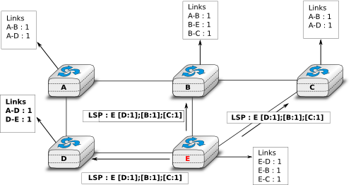

.. Copyright |copy| 2010 by Olivier Bonaventure
.. This file is licensed under a `creative commons licence <http://creativecommons.org/licenses/by/3.0/>`_

.. index:: link-state routing

.. _linkstate:

.. Link state routing
Ruteo de estado de enlace
-------------------------

.. Link state routing is the second family of routing protocols. While distance vector routers use a distributed algorithm to compute their routing tables, link-state routers exchange messages to allow each router to learn the entire network topology. Based on this learned topology, each router is then able to compute its routing table by using a shortest path computation [Dijkstra1959]_.

El ruteo de estado de enlace es la segunda familia de protocolos de ruteo. Mientras que los routers de vector de distancias usan un algoritmo distribuido para computar sus tablas de ruteo, los de estado de enlace intercambian mensajes para permitir que cada router aprenda la topología de la red entera. Basándose en esta topología aprendida, cada router puede así computar su propia tabla de ruteo usando el cómputo del camino más corto [Dijkstra1959]_.  

.. For link-state routing, a network is modelled as a `directed weighted graph`. Each router is a node, and the links between routers are the edges in the graph.  A positive weight is associated to each directed edge and routers use the shortest path to reach each destination. In practice, different types of weight can be associated to each directed edge :

..  - unit weight. If all links have a unit weight, shortest path routing prefers the paths with the least number of intermediate routers.
..  - weight proportional to the propagation delay on the link. If all link weights are configured this way, shortest path routing uses the paths with the smallest propagation delay. 
..  - :math:`weight=\frac{C}{bandwidth}` where `C` is a constant larger than the highest link bandwidth in the network. If all link weights are configured this way, shortest path routing prefers higher bandwidth paths over lower bandwidth paths

En el ruteo de estado de enlace, una red se modela como un grafo dirigido con pesos. Cada router es un nodo, y los enlaces entre los routers son los arcos del grafo. A cada arco dirigido se asocia un peso positivo, y los routers usan el camino más corto para alcanzar cada destino. En la práctica, cada arco dirigido puede tener asociados diferentes tipos de pesos:

  - Peso unidad. Si todos los enlaces tienen un peso unitario, el ruteo de camino más corto preferirá los caminos con el menor número de routers intermedios.
  - Peso proporcional al retardo de propagación por el enlace. Si todos los pesos de los enlaces son configurados de esta forma, el ruteo de camino más corto usará los caminos con el retardo de propagación más pequeño.
  - :math:`Peso=\frac{C}{ancho de banda}` donde `C` es una constante mayor que el ancho de banda más grande de los enlaces de la red. Si todos los pesos de los enlaces se configuran de esta forma, el ruteo de camino más corto preferirá los caminos de mayores anchos de banda sobre los de menor ancho de banda.
 
.. Usually, the same weight is associated to the two directed edges that correspond to a physical link (i.e. :math:`R1 \rightarrow R2` and :math:`R2 \rightarrow R1`). However, nothing in the link state protocols requires this. For example, if the weight is set in function of the link bandwidth, then an asymmetric ADSL link could have a different weight for the upstream and downstream directions. Other variants are possible. Some networks use optimisation algorithms to find the best set of weights to minimize congestion inside the network for a given traffic demand [FRT2002]_. 

Por lo común, se asocia el mismo peso a los dos arcos dirigidos que corresponden a un mismo enlace físico (es decir,  :math:`R1 \rightarrow R2` y :math:`R2 \rightarrow R1`). Sin embargo, nada en los protocolos de estado de enlace obliga a esto. Por ejemplo, si el peso se fija en función del ancho de banda del enlace, entonces un enlace asimétrico ADSL podría tener un peso diferente para la direcciones upstream y downstream. Hay otras variantes posibles. Algunas redes usan algoritmos de optimización para encontrar el mejor conjunto de pesos para minimizar la congestión dentro de la red para una demanda de tráfico dada [FRT2002]_. 

.. index:: Hello message

.. When a link-state router boots, it first needs to discover to which routers it is directly connected. For this, each router sends a HELLO message every `N` seconds on all of its interfaces. This message contains the router's address. Each router has a unique address. As its neighbouring routers also send HELLO messages, the router automatically discovers to which neighbours it is connected. These HELLO messages are only sent to neighbours who are directly connected to a router, and a router never forwards the HELLO messages that they receive. HELLO messages are also used to detect link and router failures. A link is considered to have failed if no HELLO message has been received from the neighbouring router for a period of :math:`k \times N` seconds.

Al arrancar, un router de estado de enlace necesita antes que nada descubrir con qué routers se encuentra directamente conectado. Para esto, cada router envía un mensaje HELLO cada `N` segundos, por todas sus interfaces. Este mensaje contiene la dirección del router. Cada router tiene una dirección única. A medida que sus routers vecinos envían también mensajes HELLO, el router descubre automáticamente a qué vecinos se halla conectado. Estos mensajes HELLO solamente son enviados a vecinos directamente conectados; y un router nunca reenvía los mensajes HELLO que recibe. Los mensajes HELLO también se usan para detectar fallos de routers o de enlaces. Se considera que un enlace ha fallado cuando no se ha recibido ningún mensaje HELLO del router vecino por un período de :math:`k \times N` segundos.

.. figure:: svg/ls-hello.png
   :align: center
   :scale: 100   

   Intercambio de mensajes HELLO
..   The exchange of HELLO messages

.. Once a router has discovered its neighbours, it must reliably distribute its local links to all routers in the network to allow them to compute their local view of the network topology. For this, each router builds a `link-state packet` (LSP) containing the following information :

.. - LSP.Router : identification (address) of the sender of the LSP
.. - LSP.age : age or remaining lifetime of the LSP
.. - LSP.seq : sequence number of the LSP
.. - LSP.Links[] : links advertised in the LSP. Each directed link is represented with the following information :  
..   - LSP.Links[i].Id : identification of the neighbour
..   - LSP.Links[i].cost : cost of the link

Una vez que un router ha descubierto a sus vecinos, debe distribuir en forma confiable sus enlaces locales a todos los routers en la red, para permitirles computar su vista local de la topología de la red. Para esto, cada router construye un paquete de estado de enlace (`link-state packet`, LSP) que contiene la siguiente información:

 - LSP.Router: identificación (dirección) del emisor del LSP
 - LSP.age: edad o tiempo de vida remanente del LSP
 - LSP.seq: número de secuencia del LSP
 - LSP.Links[]: enlaces anunciados en el LSP. Cada enlace dirigido se representa con la siguiente información:
   - LSP.Links[i].Id: identificación del vecino
   - LSP.Links[i].cost: costo del enlace

.. These LSPs must be reliably distributed inside the network without using the router's routing table since these tables can only be computed once the LSPs have been received. The `Flooding` algorithm is used to efficiently distribute the LSPs of all routers.  Each router that implements `flooding` maintains a `link state database` (LSDB) containing the most recent LSP sent by each router. When a router receives an LSP, it first verifies whether this LSP is already stored inside its LSDB. If so, the router has already distributed the LSP earlier and it does not need to forward it. Otherwise, the router forwards the LSP on all links except the link over which the LSP was received. Reliable flooding can be implemented by using the following pseudo-code.

Estos LSPs deben ser distribuidos en forma confiable dentro de la red, sin usar la tabla de ruteo del router ya que estas tablas sólo pueden ser computadas una vez que se hayan recibido los LSPs. El algoritmo de `inundación` (`flooding`) es el que se usa para distribuir eficientemente los LSPs de todos los routers. Cada router que implementa el algoritmo de `flooding` mantiene una base de datos de estado de enlaces (`link state database`, LSDB) conteniendo el LSP más reciente enviado por cada router. Cuando un router recibe un LSP, primeramente verifica si este LSP ya ha sido almacenado dentro de su LSDB. Si es así, el router ya ha distribuido el LSP anteriormente, y no necesita reenviarlo. En otro caso, el router reenvía el LSP por todos los enlaces, excepto aquel por el cual fue recibido el LSP. La inundación confiable puede implementarse usando el siguiente pseudocódigo.

.. code-block:: python

  # ENLACES es el conjunto de todos los enlaces en el router
  # Llegada de LSP del router R por el enlace l
  if masReciente(LSP, LSDB(LSP.Router)) :
    LSDB.add(LSP)
    for i in ENLACES :
      if i!=l :
      	 send(LSP,i)
  else:
  # LSP ya ha sido inundado

.. In this pseudo-code, `LSDB(r)` returns the most recent `LSP` originating from router `r` that is stored in the `LSDB`. `newer(lsp1,lsp2)` returns true if `lsp1` is more recent than `lsp2`. See the note below for a discussion on how `newer` can be implemented.

En este pseudocódigo, `LSDB(r)` devuelve el LSP más reciente originado en el router `r` que haya sido almacenado en el LSDB. La función `masReciente(lsp1,lsp2)` devuelve TRUE si `lsp1` es más reciente que `lsp2`. Véase la nota más abajo para una discusión de cómo es posible implementar la función `masReciente()`.

.. .. note:: Which is the most recent LSP ?

.. A router that implements flooding must be able to detect whether a received LSP is newer than the stored LSP. This requires a comparison between the sequence number of the received LSP and the sequence number of the LSP stored in the link state database. The ARPANET routing protocol [MRR1979]_ used a 6 bits sequence number and implemented the comparison as follows :rfc:`789`

.. note:: ¿Cuál es el LSP más reciente?

Un router que implementa flooding debe ser capaz de detectar si un LSP recibido es más reciente que el LSP almacenado. Esto requiere una comparación entre el número de secuencia del LSP recibido y el del LSP almacenado en la LSDB. El protocolo de ruteo de ARPANET [MRR1979]_ usaba un número de secuencia de 6 bits e implementaba la comparación de la manera siguiente (:rfc:`789`).

 .. code-block:: python

   def masReciente( lsp1, lsp2 ):
     return ( ( ( lsp1.seq > lsp2.seq) and ( (lsp1.seq-lsp2.seq)<=32) ) or
     	     ( ( lsp1.seq < lsp2.seq) and ( (lsp2.seq-lsp1.seq)> 32) )    )

.. This comparison takes into account the modulo :math:`2^{6}` arithmetic used to increment the sequence numbers. Intuitively, the comparison divides the circle of all sequence numbers into two halves. Usually, the sequence number of the received LSP is equal to the sequence number of the stored LSP incremented by one, but sometimes the sequence numbers of two successive LSPs may differ, e.g. if one router has been disconnected from the network for some time. The comparison above worked well until October 27, 1980. On this day, the ARPANET crashed completely. The crash was complex and involved several routers. At one point, LSP `40` and LSP `44` from one of the routers were stored in the LSDB of some routers in the ARPANET. As LSP `44` was the newest, it should have replaced by LSP `40` on all routers. Unfortunately, one of the ARPANET routers suffered from a memory problem and sequence number `40` (`101000` in binary) was replaced by `8` (`001000` in binary) in the buggy router and flooded. Three LSPs were present in the network and `44` was newer than `40` which is newer than `8`, but unfortunately `8` was considered to be newer than `44`... All routers started to exchange these three link state packets for ever and the only solution to recover from this problem was to shutdown the entire network :rfc:`789`.

 Esta comparación tiene en cuenta la aritmética módulo :math:`2^{6}` usada para incrementar los números de secuencia. Intuitivamente, la comparación divide el círculo de todos los números de secuencia en dos mitades. Normalmente, el número de secuencia del LSP recibido es igual al del LSP almacenado incrementado en uno; pero, a veces, los números de secuencia de dos LSP sucesivos pueden diferir; por ejemplo, si el router ha sido desconectado de la red durante algún tiempo. La comparación mostrada arriba funcionó correctamente hasta el 27 de Octubre de 1980. En ese día, ARPANET cayó por completo. La caída fue compleja e involucró a varios routers. En un determinado momento, los LSP `40` y `44` de uno de los routers estaban almacenados en la LSDB de algunos routers de ARPANET. Como el LSP `44` era el más reciente, debió haber reemplazado al LSP `40` en todos los routers. Desafortunadamente, uno de los routers de ARPANET sufrió un problema de memoria; y el número de secuencia `40` (`101000` en binario) fue sustituido por `8` (`001000` en binario) en el router descompuesto e inundado. Había tres LSPs presentes en la red y `44` era más reciente que `40` que a su vez es más reciente que `8`, pero por desgracia `8` fue considerado más reciente que `44`... Todos los routers comenzaron a intercambiar estos tres paquetes de estado de enlace en forma perpetua, y la única solución para recuperarse de este problema fue apagar la red completa :rfc:`789`.

.. Current link state routing protocols usually use 32 bits sequence numbers and include a special mechanism in the unlikely case that a sequence number reaches the maximum value (using a 32 bits sequence number space takes 136 years if a link state packet is generated every second).

 Los protocolos de estado de enlace actuales usan normalmente números de secuencia de 32 bits, e incluyen un mecanismo especial para el caso improbable de que un número de secuencia alcance el valor máximo (usando un espacio de números de secuencia de 32 bits, tomaría 136 años si se generara un LSP por segundo).

.. To deal with the memory corruption problem, link state packets contain a checksum. This checksum is computed by the router that generates the LSP. Each router must verify the checksum when it receives or floods an LSP. Furthermore, each router must periodically verify the checksums of the LSPs stored in its LSDB.

 Para hacer frente al problema de la corrupción de memoria, los paquetes de estado de enlace contienen un checksum o suma de control. Este checksum es computado por el router que genera el LSP. Cada router debe verificar el checksum cuando recibe o inunda un LSP. Más aún, cada router debe verificar periódicamente los checksums de los LSPs almacenados en su LSDB.

.. Flooding is illustrated in the figure below. By exchanging HELLO messages, each router learns its direct neighbours. For example, router `E` learns that it is directly connected to routers `D`, `B` and `C`. Its first LSP has sequence number `0` and contains the directed links `E->D`, `E->B` and `E->C`. Router `E` sends its LSP on all its links and routers `D`, `B` and `C` insert the LSP in their LSDB and forward it over their other links.

En la figura siguiente se ilustra el mecanismo de flooding. Intercambiando mensajes HELLO, cada router aprende sus vecinos directos. Por ejemplo, el router `E` aprende que está directamente conectado a los routers `D`, `B` y `C`. Su primer  LSP tiene número de secuencia `0` y contiene los arcos dirigidos `E->D`, `E->B` y `E->C`. El router `E` envía su LSP por todos sus enlaces, y los routers `D`, `B` y `C` insertan el LSP en su LSDB y lo reenvían sobre los demás enlaces.  

   Ejemplo de inundación (`flooding`)
..   Flooding : example 

.. Flooding allows LSPs to be distributed to all routers inside the network without relying on routing tables. In the example above, the LSP sent by router `E` is likely to be sent twice on some links in the network. For example, routers `B` and `C` receive `E`'s LSP at almost the same time and forward it over the `B-C` link. To avoid sending the same LSP twice on each link, a possible solution is to slightly change the pseudo-code above so that a router waits for some random time before forwarding a LSP on each link. The drawback of this solution is that the delay to flood an LSP to all routers in the network increases. In practice, routers immediately flood the LSPs that contain new information (e.g. addition or removal of a link) and delay the flooding of refresh LSPs (i.e. LSPs that contain exactly the same information as the previous LSP originating from this router) [FFEB2005]_.

La inundación permite que los LSPs sean distribuidos a todos los routers dentro de la red sin usar tablas de ruteo. En el ejemplo anterior, el LSP enviado por el router `E` es propenso a ser enviado dos veces por algunos enlaces de la red. Por ejemplo, los routers `B` y `C` reciben el LSP de `E` casi al mismo tiempo, y lo reenvían por el enlace `B-C`. Para evitar enviar el mismo LSP dos veces por cada enlace, una posible solución es cambiar ligeramente el pseudocódigo anterior de forma que un router aguarde algún tiempo aleatorio antes de enviar un LSP por cada enlace. La desventaja de esta solución es que la demora para inundar un LSP a todos los routers en la red se incrementa. En la práctica, los routers inundan inmediatamente los LSPs que contienen información nueva (como adición o retiro de un enlace) y demoran la inundación de LSPs de refresco (es decir, LSPs que contienen exactamente la misma información que el LSP anterior originado en este router) [FFEB2005]_.

.. To ensure that all routers receive all LSPs, even when there are transmissions errors, link state routing protocols use `reliable flooding`. With `reliable flooding`, routers use acknowledgements and if necessary retransmissions to ensure that all link state packets are successfully transferred to all neighbouring routers.  Thanks to reliable flooding, all routers store in their LSDB the most recent LSP sent by each router in the network. By combining the received LSPs with its own LSP, each router can compute the entire network topology.

Para asegurar que todos los routers reciban todos los LSPs, aun cuando haya errores de transmisión, los protocolos de estado de enlace usan `inundación confiable` (`reliable flooding`). Con inundación confiable, los routers usan reconocimientos, y si es necesario, retransmisiones, para asegurar que todos los paquetes de estado de enlace sean exitosamente transferidos a todos los routers vecinos. Gracias a la inundación confiable, todos los routers almacenan en su LSDB el LSP más reciente enviado por cada router en la red. Combinando los LSPs recibidos con su propio LSP, cada router puede computar la topología completa de la red.

.. figure:: svg/ls-lsdb.png
   :align: center
   :scale: 100   

   Bases de datos de estados de enlace recibidos por todos los routers
..   Link state databases received by all routers 

.. .. note:: Static or dynamic link metrics ?

.. As link state packets are flooded regularly, routers are able to measure the quality (e.g. delay or load) of their links and adjust the metric of each link according to its current quality. Such dynamic adjustments were included in the ARPANET routing protocol [MRR1979]_ . However, experience showed that it was difficult to tune the dynamic adjustments and ensure that no forwarding loops occur in the network [KZ1989]_. Today's link state routing protocols use metrics that are manually configured on the routers and are only changed by the network operators or network management tools [FRT2002]_.

.. note:: ¿Métricas de enlaces dinámicas o estáticas?

 Como los paquetes de estado de enlace son inundados periódicamente, los routers pueden medir la calidad (por ejemplo, el retardo, o la carga) de sus enlaces, y ajustar la métrica de cada enlace de acuerdo a su calidad en cada momento. Dichos ajustes dinámicos se incluyeron en el protocolo de ruteo ARPANET [MRR1979]_. Sin embargo, la experiencia mostró que era difícil afinar los ajustes dinámicos y asegurar que no se formaran ciclos de reenvío en la red [KZ1989]_. Los protocolos de estado de enlace de hoy usan métricas que se configuran manualmente en los routers, y sólo son modificados por los operadores de red o por herramientas de administración de red [FRT2002]_.

.. index:: two-way connectivity

.. When a link fails, the two routers attached to the link detect the failure by the lack of HELLO messages received in the last :math:`k \times N` seconds. Once a router has detected a local link failure, it generates and floods a new LSP that no longer contains the failed link and the new LSP replaces the previous LSP in the network. As the two routers attached to a link do not detect this failure exactly at the same time, some links may be announced in only one direction. This is illustrated in the figure below. Router `E` has detected the failures of link `E-B` and flooded a new LSP, but router `B` has not yet detected the failure.

Cuando falla un enlace, los dos routers conectados al mismo detectan el fallo por la ausencia de mensajes HELLO recibidos en los últimos :math:`k \times N` segundos. Una vez que un router ha detectado un fallo de un enlace local, genera e inunda un nuevo LSP que ya no contiene el enlace fallido, y el nuevo LSP reemplaza al LSP anterior en la red. Como los dos routers conectados a un enlace no detectan el fallo exactamente al mismo tiempo, algunos enlaces serán anunciados en sólo una dirección. Esto se ilustra en la figura siguiente. El router `E` ha detectado el fallo del enlace `E-B` y ha inundado un nuevo LSP, pero el router `B` aún no ha detectado el fallo.

.. figure:: svg/ls-twoway.png
   :align: center
   :scale: 100   

   Verificación de conectividad de dos vías
..   The two-way connectivity check

.. When a link is reported in the LSP of only one of the attached routers, routers consider the link as having failed and they remove it from the directed graph that they compute from their LSDB. This is called the `two-way connectivity check`. This check allows link failures to be flooded quickly as a single LSP is sufficient to announce such bad news. However, when a link comes up, it can only be used once the two attached routers have sent their LSPs. The `two-way connectivity check` also allows for dealing with router failures. When a router fails, all its links fail by definition. Unfortunately, it does not, of course, send a new LSP to announce its failure. The `two-way connectivity check` ensures that the failed router is removed from the graph.

Cuando un enlace es reportado en el LSP de uno solo de los routers conectados, ambos routers consideran que el enlace ha fallado, y lo retiran del grafo dirigido que computan a partir de su LSDB. Esto se llama `verificación de conectividad de dos vías` (`two-way connectivity check`). Esta verificación permite que los fallos de enlaces inunden rápidamente, ya que un único LSP es suficiente para anunciar tales malas noticias. Sin embargo, cuando un enlace vuelve a la actividad, sólo puede ser usado una vez que ambos routers conectados hayan enviado sus LSPs. La verificación de dos vías sirve también para tratar el caso de fallos de routers. Cuando falla un router, por definición fallan todos sus enlaces. Desafortunadamente, claro, el router no envía un nuevo LSP para informar de su fallo. La verificación de conectividad de dos vías asegura que el router fallido sea retirado del grafo.

.. When a router has failed, its LSP must be removed from the LSDB of all routers [#foverload]_. This can be done by using the `age` field that is included in each LSP. The `age` field is used to bound the maximum lifetime of a link state packet in the network. When a router generates a LSP, it sets its lifetime (usually measured in seconds) in the `age` field. All routers regularly decrement the `age` of the LSPs in their LSDB and a LSP is discarded once its `age` reaches `0`. Thanks to the `age` field, the LSP from a failed router does not remain in the LSDBs forever.

Al fallar un router, su LSP debe ser retirado de la LSDB de todos los routers [#foverload]_. Esto puede hacerse usando el campo `age` (`edad`) que se incluye en todos los LSPs. El campo `age` se usa para acotar el tiempo máximo de vida en la red de un paquete de estado de enlace. Cuando un router genera un LSP, fija su tiempo de vida (normalmente, medido en segundos) en el campo `age`. Todos los routers periódicamente decrementan el dato `age` de los LSPs en sus LSDBs; y un LSP es descartado cuando su `age` llega a `0`. Gracias al campo `age`, el LSP de un router fallido no permanece por siempre en las LSDBs.

.. To compute its routing table, each router computes the spanning tree rooted at itself by using Dijkstra's shortest path algorithm [Dijkstra1959]_. The routing table can be derived automatically from the spanning as shown in the figure below.

Para computar su tabla de ruteo, cada router calcula el árbol de expansión con raíz en sí mismo, usando el algoritmo del camino más corto de Dijkstra [Dijkstra1959]_. La tabla de ruteo puede ser derivada automáticamente del árbol de expansión  como se muestra en la figura siguiente.

.. figure:: svg/ls-computation.png
   :align: center
   :scale: 100   

   Cómputo de la tabla de ruteo
..   Computation of the routing table

.. rubric:: Footnotes

.. .. [#foverload] It should be noted that link state routing assumes that all routers in the network have enough memory to store the entire LSDB. The routers that do not have enough memory to store the entire LSDB cannot participate in link state routing. Some link state routing protocols allow routers to report that they do not have enough memory and must be removed from the graph by the other routers in the network.

.. [#foverload] Debe notarse que el ruteo de estado de enlace asume que todos los routers en la red tienen suficiente memoria para almacenar la LSDB completa. Los routers que no cumplan esta condición no pueden participar en el ruteo de estado de enlace. Algunos protocolos de estado de enlace permiten que los routers reporten que no tienen bastante memoria, y que deben ser retirados del grafo por los demás routers de la red.
