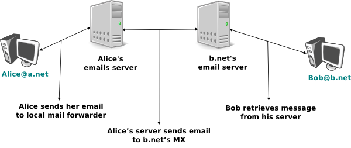
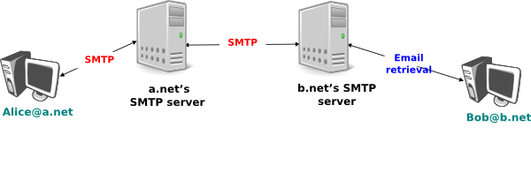

.. Copyright |copy| 2010 by Olivier Bonaventure
.. This file is licensed under a `creative commons licence <http://creativecommons.org/licenses/by-sa/3.0/>`_

.. _Email:

Electronic mail
===============

Electronic mail or email is a very popular application in computer networks such as the Internet. Email `appeared <http://openmap.bbn.com/~tomlinso/ray/firstemailframe.html>`_ in the early 1970s. It allows users to exchange text messages. Initially, Email was mainly used to exchange short messages, but over the years its usage has grown. Email is now used to exchange small and also long messages that can be composed of several parts as we will see later. 

Before looking at the details of Internet email, let us consider a simple scenario illustrated in the figure below where Alice sends an email to Bob. Alice prepares her email by using an `email clients`_ and sends it to her email server. Alice's `email server <http://en.wikipedia.org/wiki/Comparison_of_mail_servers>`_ extracts Bob's address from the email and delivers the message to Bob's server. Bob retrieves Alice's message on his server and reads it by using his favourite email client or through his webmail interface. 

   Architecture of the Internet email 

An email system is always composed of four components :

 - a message format that defines how valid email messages are encoded 
 - protocols that allow hosts and servers to exchange email messages
 - client software that allows users to easily create and read email messages
 - software that allows servers to efficiently exchange email messages

We first discuss the format of email messages and then the protocols that are used on today's Internet to exchange and retrieve emails. Other email systems have been developed in the past [Bush1993]_ [Genilloud1990]_ [GC2000]_, but today most email solutions have migrated to the Internet email. Information about the software that is used to compose and deliver emails may be found on wikipedia_ among others for both `email clients`_ and `email servers <http://en.wikipedia.org/wiki/Comparison_of_mail_servers>`_.

.. index:: email message format

Email messages, like postal mail, are composed of two parts :

 - a `header` that plays the same role as an enveloppe in regular mail. It contains control information that is used by the email servers to deliver the email message to its recipient
 - the `body` that contains the message itself.  

Email messages are entirely composed of lines of ASCII characters. Each line can contain up to 998 characters and is terminated by the `CR` and `LF` control characters :rfc:`5322`. The lines that compose the `header` appear before the message `body`. An empty line, containing only the `CR` and `LF` characters, marks the end of the `header`. This is illustrated in the figure below.

.. abnf crocker : :rfc:`5234`

.. figure:: png/app-fig-010-c.png
   :align: center
   :scale: 50 

   The structure of email messages

The email header contains several lines that all begin by a keyword followed by colon and additional information. The format of email messages and the different types of header lines are defined in :rfc:`5322`. Two of these header lines are mandatory and must appear in all email messages :

 - The sender address. This header line starts with `From:`. It contains the (optional) name of the sender followed by its email address between `<` and `>`. Email addresses are always composed of a username followed by the `@` sign and a domain name.
 - The date. This header line starts with `Date:`. :rfc:`5322` precisely defines the format used to encode a date.

Other header lines appear in most email messages. The `Subject:` header line allows the sender to indicate the topic discussed in the email. Three types of header lines can be used to specify the recipients of a message :

 - the `To:` header line contains the email addresses of the primary recipients of the message. Several addresses are separated by using commas.
 - the `cc:` header line is used by the sender to provide a list of email addresses that must receive a carbon copy of the message. Several addresses can be listed in this header line, separated by commas. All recipients of the email message receive the `To:` and `cc:` header lines. 
 - the `bcc:` header line is used by the sender to provide a list of comma separated email addresses that must receive a blind carbon copy of the message. The `bcc:` header line is not delivered to the recipients of the email message. 

A simple email message containing the `From:`, `To:`, `Subject:` and `Date:` header lines and two lines of body is shown below.

::

 From: Bob Smith <Bob@machine.example>
 To: Alice Doe <alice@example.net>, Alice Smith <Alice@machine.example>
 Subject: Hello
 Date: Mon, 8 Mar 2010 19:55:06 -0600
 
 This is the "Hello world" of email messages.
 This is the second line of the body

Note the empty line after the `Date:` header line. This empty line contains only the `CR` and `LF` characters. It marks the boundary between the header and the body of the message.

Several other optionnal header lines are defined in :rfc:`5322` and other optional header lines have been defined elsewhere [#femailheaders]_. Furthermore, many email clients and servers define their own header lines starting from `X-`. Several of the optionnal header lines defined in :rfc:`5322` are worth being discussed here :

 - the `Message-Id:` header line is used to associate a "unique" identifier to each email. Email identifiers are usually structured as `string@domain` where `string` is a unique character string or sequence number chosen by the sender of the email and `domain` the domain name of the sender. Since domain names are unique, a host can generate globally unique message identifiers concatenating a locally unique identifier with its domain name.
 - the `In-reply-to:` is used when a message was created in reply to a previous message. In this case, the end of the `In-reply-to:` line contains the identifier of the original message.
 - the `Received:` header line is used when an email message is processed by several servers before reaching its destination. Each intermediate email server adds a `Received:` header line. These header lines are useful to debug problems in delivering email messages.

The figure below shows the header lines of one email message. The message was originated at a host named `wira.firstpr.com.au` and was received by `smtp3.sgsi.ucl.ac.be`. The `Received:` lines have been wrapped for readability.

::

 Received: from smtp3.sgsi.ucl.ac.be (Unknown [10.1.5.3])
     by mmp.sipr-dc.ucl.ac.be
     (Sun Java(tm) System Messaging Server 7u3-15.01 64bit (built Feb 12 2010))
     with ESMTP id <0KYY00L85LI5JLE0@mmp.sipr-dc.ucl.ac.be>; Mon,
     08 Mar 2010 11:37:17 +0100 (CET)
 Received: from mail.ietf.org (mail.ietf.org [64.170.98.32])
     by smtp3.sgsi.ucl.ac.be (Postfix) with ESMTP id B92351C60D7; Mon,
     08 Mar 2010 11:36:51 +0100 (CET)
 Received: from [127.0.0.1] (localhost [127.0.0.1])	by core3.amsl.com (Postfix)
     with ESMTP id F066A3A68B9; Mon, 08 Mar 2010 02:36:38 -0800 (PST)
 Received: from localhost (localhost [127.0.0.1])	by core3.amsl.com (Postfix)
     with ESMTP id A1E6C3A681B	for <rrg@core3.amsl.com>; Mon,
     08 Mar 2010 02:36:37 -0800 (PST)
 Received: from mail.ietf.org ([64.170.98.32])
     by localhost (core3.amsl.com [127.0.0.1]) (amavisd-new, port 10024)
     with ESMTP id erw8ih2v8VQa for <rrg@core3.amsl.com>; Mon,
     08 Mar 2010 02:36:36 -0800 (PST)
 Received: from gair.firstpr.com.au (gair.firstpr.com.au [150.101.162.123])
     by core3.amsl.com (Postfix) with ESMTP id 03E893A67ED	for <rrg@irtf.org>; Mon,
     08 Mar 2010 02:36:35 -0800 (PST)
 Received: from [10.0.0.6] (wira.firstpr.com.au [10.0.0.6])
     by gair.firstpr.com.au (Postfix) with ESMTP id D0A49175B63; Mon,
     08 Mar 2010 21:36:37 +1100 (EST)
 Date: Mon, 08 Mar 2010 21:36:38 +1100
 From: Robin Whittle <rw@firstpr.com.au>
 Subject: Re: [rrg] Recommendation and what happens next
 In-reply-to: <C7B9C21A.4FAB%tony.li@tony.li>
 To: RRG <rrg@irtf.org>
 Message-id: <4B94D336.7030504@firstpr.com.au>
 
 Message content removed

Initially, email was used to exchange small messages of ASCII text between computer scientists. However, with the growth of the Internet, supporting only ASCII text became a severe limitation for two reasons. First, non-English speakers wanted to write emails in their mother language that often requires more characters than those of the ASCII character table. Second, many users wanted to send other content than ASCII text by email such as binary files, images or sound. 

.. index Multipurpose Internet Mail Extensions, MIME

To solve this problem, the IETF_ developed the Multipurpose Internet Mail Extensions (:term:`MIME`). These extensions were carefully designed to allow Internet email to carry non-ASCII characters and binary files without breaking the email servers that were deployed at that time. This requirement for backward compatibility forced the MIME designers to develop extensions to the existing email message format :rfc:`822` instead of defining a completely new format that would have been better suited to support the new types of emails. 

:rfc:`2045` defines three new types of header lines to support MIME : 

 - The `MIME-Version:` header indicates the version of the MIME specification that was used to encode the email message. The current version of MIME is 1.0. Other versions of MIME might be defined in the future. Thanks to this header line, software that processes email messages will be able to adapt to the MIME version used to encode the message. Messages that do not contain this header are supposed to be formatted according to the original :rfc:`822` specification.
 - The `Content-Type:` header line indicates the type of data that is carried inside the message (see below)
 - The `Content-Transfer-Encoding:` header line is used to specify how the message has been encoded. When MIME was designed, some email servers were only able to process messages containing characters encoded using the 7 bits ASCII character set. MIME allows the utilisation of other character encodings. 

Inside the email header, the `Content-Type:` header line indicates how the MIME email message is structured. :rfc:`2046` defines the utilisation of this header line. The two most common structures for MIME messages are :

 - `Content-Type: multipart/mixed`. This header line indicates that the MIME message contains several independent parts. For example, such a message may contain a part in plain text and a binary file.
 - `Content-Type: multipart/alternative`. This header line indicates that the MIME message contains several representations of the same information. For example, a `multipart/alternative` message may contain both a plain text and an HTML version of the same text. 

To support these two types of MIME messages, the recipient of a message must be able to extract the different parts from the message. In :rfc:`822`, an empty line was used to separate the header lines from the body. Using an empty line to separate the different parts of an email body would be difficult as the body of email messages often contains one or more empty lines. Another possible option would be to define a special line, e.g. `*-*-*-*-*-*-*-*-*-*` to mark the boundary between two parts of a MIME message. Unfortunately, this is not possible as some emails may contain this string in their body (e.g. emails sent to students to explain the format of MIME messages). To solve this problem, the `Content-Type:` header line contains a second parameter that specifies the string that has been used by the sender of the MIME message to delineate the different parts. In practice, this string is often chosen randomly by the mail client.

The email message below, copied from :rfc:`2046` shows a MIME message that contains two parts that are both in plain text and encoded by using the ASCII character set. Note that the string `simple boundary` is defined in the `Content-Type:` header as the string that marks the boundary between the header and the first part and also between the first and the second part and at the end of the message. Other example of MIME messages may be found in :rfc:`2046`.

::

 Date: Mon, 20 Sep 1999 16:33:16 +0200
 From: Nathaniel Borenstein <nsb@bellcore.com>
 To: Ned Freed <ned@innosoft.com>
 Subject: Test
 MIME-Version: 1.0
 Content-Type: multipart/mixed; boundary="simple boundary"

 preamble, to be ignored

 --simple boundary
 Content-Type: text/plain; charset=us-ascii

 First part

 --simple boundary
 Content-Type: text/plain; charset=us-ascii

 Second part
 --simple boundary

The `Content-Type:` header can also be used inside a MIME part. In this case, it indicates the type of data placed in this part. Each data type is specified as a type followed by a subtype. A detailed description may be found in :rfc:`2046`. Some of the most popular `Content-Type:` header lines are :

 - `text`. The message part contains information in textual format. There are several subtypes : `text/plain` for regular ASCII text, `text/html` defined in :rfc:`2854` for documents in :term:`HTML` format or the `text/enriched` format defined in :rfc:`1896`. The `Content-Type:` header line may contain a second parameter that specifies the character set used to encode the text. `charset=us-ascii` is the standard ASCII character table.  Other frequent character sets include `charset=UTF8` or `charset=iso-8859-1`. The `list of standard character sets <http://www.iana.org/assignments/character-sets>`_ is maintained by :term:`IANA`
 - `image`. The message part contains a binary representation of an image. The subtype indicates the format of the image such as `gif`, `jpg` or `png`. 
 - `audio`. The message part contains an audio clip. The subtype indicates the format of the audio clip like `wav` or `mp3`
 - `video`. The message part contains a video clip. The subtype indicates the format of the video clip like `avi` or `mp4`
 - `application`. The message part contains binary information that was produced by a particular application that is listed as the subtype. Email clients use the subtype to launch the application that is able to decode the received binary information. 

.. note:: From ASCII to Unicode

 The first computers used different techniques to represent characters in memory and on disk. During the 1960s, computers began to exchange information via tape or telephone lines. Unfortunately, each vendor had its own proprietary character set and exchanging data between computers from different vendors was sometimes difficult. The 7 bits ASCII character table :rfc:`20` set was adopted by several vendors and by many Internet protocols. However, ASCII became a problem with the internationalisation of the Internet and the desire of more and more users to use character sets that support their own written language. A first move was the definition of the ISO-8859_ character sets by :term:`ISO`. This family of standards specified various character sets that allow to represent many European written languages by using 8 bits characters. Unfortunately, an 8-bits character set is not sufficient to support some widely used languages such as those used in Asian countries. Fortunately, at the end of the 1980s, several computer scientists proposed to develop a standard that allows to support all written languages that are used on Earth today. The Unicode standard [Unicode]_ has now been adopted by most computer and software vendors. For example, Java uses Unicode natively to manipulat characters, python can handle both ASCII and Unicode characters. Internet applications are slowly moving to completely support the Unicode character sets, but moving from ASCII to Unicode is an important change that can have a huge impact on the deployed implementations. See for example, the work to completely internationalize email :rfc:`4952` and domain names :rfc:`3490`.
 
The last MIME header line is `Content-Transfer-Encoding:`. This header line is used after the `Content-Type:` header line in a message part. It specifies how the message part has been encoded. The default encoding is to use 7 bits ASCII. The most frequent encodings are `quoted-printable` and `Base64`. They both allow to encode a sequence of bytes in a set of ASCII lines that can be safely transmitted by email servers. `quoted-printable` is defined in :rfc:`2045`. We briefly describe `base64` which is defined in :rfc:`2045` and :rfc:`4648`. 

.. index:: Base64 encoding

`Base64` divides the sequence of bytes to be encoded in groups of three bytes (with the last group being possibly partially filled). Each group of three bytes is divided in four six-bits fields and each six bits field is encoded as a character from the table below. 

+-------+----------+-------+----------+-------+----------+-------+----------+
| Value | Encoding | Value | Encoding | Value | Encoding | Value | Encoding |
+-------+----------+-------+----------+-------+----------+-------+----------+
|   0   |    A     |  17   |    R     |  34   |    i     |  51   |     z    |
+-------+----------+-------+----------+-------+----------+-------+----------+
|   1   |    B     |  18   |    S     |  35   |    j     |  52   |     0    |
+-------+----------+-------+----------+-------+----------+-------+----------+
|   2   |    C     |  19   |    T     |  36   |    k     |  53   |     1    |
+-------+----------+-------+----------+-------+----------+-------+----------+
|   3   |    D     |  20   |    U     |  37   |    l     |  54   |     2    |
+-------+----------+-------+----------+-------+----------+-------+----------+
|   4   |    E     |  21   |    V     |  38   |    m     |  55   |     3    |
+-------+----------+-------+----------+-------+----------+-------+----------+
|   5   |    F     |  22   |    W     |  39   |    n     |  56   |     4    |
+-------+----------+-------+----------+-------+----------+-------+----------+
|   6   |    G     |  23   |    X     |  40   |    o     |  57   |     5    |
+-------+----------+-------+----------+-------+----------+-------+----------+
|   7   |    H     |  24   |    Y     |  41   |    p     |  58   |     6    |
+-------+----------+-------+----------+-------+----------+-------+----------+
|   8   |    I     |  25   |    Z     |  42   |    q     |  59   |     7    |
+-------+----------+-------+----------+-------+----------+-------+----------+
|   9   |    J     |  26   |    a     |  43   |    r     |  60   |     8    |
+-------+----------+-------+----------+-------+----------+-------+----------+
|  10   |    K     |  27   |    b     |  44   |    s     |  61   |     9    |
+-------+----------+-------+----------+-------+----------+-------+----------+
|  11   |    L     |  28   |    c     |  45   |    t     |  62   |     \+   |
+-------+----------+-------+----------+-------+----------+-------+----------+
|  12   |    M     |  29   |    d     |  46   |    u     |  63   |     /    |
+-------+----------+-------+----------+-------+----------+-------+----------+
|  13   |    N     |  30   |    e     |  47   |    v     |       |          |
+-------+----------+-------+----------+-------+----------+-------+----------+
|  14   |    O     |  31   |    f     |  48   |    w     |       |          |
+-------+----------+-------+----------+-------+----------+-------+----------+
|  15   |    P     |  32   |    g     |  49   |    x     |       |          |
+-------+----------+-------+----------+-------+----------+-------+----------+
|  16   |    Q     |  33   |    h     |  50   |    y     |       |          |
+-------+----------+-------+----------+-------+----------+-------+----------+

The example below, from :rfc:`4648`, illustrates the `Base64` encoding.

 +----------------+----------------------------------------------------------+
 |  Input data    | 0x14fb9c03d97e                                           |
 +----------------+----------------------------------------------------------+
 |  8-bit         | 00010100 11111011 10011100   00000011 11011001 01111110  |
 +----------------+----------------------------------------------------------+
 |  6-bit         | 000101 001111 101110 011100  000000 111101 100101 111110 |
 +----------------+----------------------------------------------------------+
 |  Decimal       |    5      15     46     28      0     61     37     62   |
 +----------------+----------------------------------------------------------+
 |  Encoding      |    F      P      u      c       A      9      l      \+  |
 +----------------+----------------------------------------------------------+
   
The last point to be discussed about `base64` is what happens when the length of sequence of bytes to be encoded are not a multiple of three. In this case, the last group of bytes may contain one or two bytes instead of three. `Base64` reserves the `=` character as a padding character. This character is used twice when the last group contains two bytes and once when it contains one byte as illustrated by the two examples below. 

 +----------------+-----------------------+
 |  Input data    | 0x14                  |
 +----------------+-----------------------+
 |  8-bit         | 00010100              |
 +----------------+-----------------------+
 |  6-bit         | 000101 000000         |
 +----------------+-----------------------+
 |  Decimal       |    5     0            |
 +----------------+-----------------------+
 |  Encoding      |    F     A    \=  \=  |
 +----------------+-----------------------+

 +----------------+-----------------------------+
 |  Input data    | 0x14b9                      |
 +----------------+-----------------------------+
 |  8-bit         | 00010100  11111011          |
 +----------------+-----------------------------+
 |  6-bit         | 000101 001111 101100        |
 +----------------+-----------------------------+
 |  Decimal       |    5    15      44          |
 +----------------+-----------------------------+
 |  Encoding      |    F     P       s     \=   |
 +----------------+-----------------------------+

Now that we have explained the format of the email messages, we can discuss how these messages can be exchanged through the Internet. The figure below illustrates the protocols that are used when `Alice` sends an email message to `Bob`. `Alice` prepares her email with an email client or on a webmail interface. To send her email to `Bob`, `Alice`'s client will use the Simple Mail Transfer Protocol (:term:`SMTP`) to deliver her message to her SMTP server. `Alice`'s email client is configured with the name of the default SMTP server for her domain. There is usually at least one SMTP server per domain. To deliver the message, `Alice`'s SMTP server must find the SMTP server that contains `Bob`'s mailbox. This can be done by using the Mail eXchange (MX) records of the DNS. A set of MX records can be associated to each domain. Each MX record contains a numerical preference and the fully qualified domain name of a SMTP server that is able to deliver email messages destined to all valid email addresses of this domain. The DNS can return several MX records for a given domain. In this case, the server with the lowest preference is used first. If this server is not reachable, the second most preferred server is used ... `Bob`'s SMTP server will store the message sent by `Alice` until `Bob` retrieves it by using a webmail interface or protocols such as the Post Office Protocol (:term:`POP`) or the Internet Message Access Protocol (:term:`IMAP`). 
 

   Email delivery protocols

.. _SMTP:

The Simple Mail Transfer Protocol
----------------------------------

The Simple Mail Transfer Protocol (:term:`SMTP`) defined in :rfc:`5321` is a client-server protocol. The SMTP specification distinguishes five types of processes that are involved in the delivery of email messages. Email messages are composed on a Mail User Agent (MUA). The MUA is usually either an email client or a webmail. The MUA sends the email message to a Mail Submission Agent (MSA). The MSA processes the received email and forwards it to the Mail Transmission Agent (MTA). The MTA is responsible for the transmission of the email, directly or via intermediate MTAs to the MTA of the destination domain. This destination MTA will then forward the message to the Mail Delivery Agent (MDA) where it will be accessed by the recipient's MUA. SMTP is used for the interactions between MUA and MSA [#fsmtpauth]_, MSA-MTA and MTA-MTA.

SMTP is a text-based protocol like many other application-layer protocols on the Internet. SMTP uses the byte-stream service and SMTP servers listen on port `21`. SMTP clients sends commands that are each composed of one line of ASCII text terminated by `CR+LF`. SMTP servers reply by sending ASCII lines that contain a three digits numerical error/success code and optionnal comments.

The SMTP protocol, like most text-based protocols, is specified as a :term:`BNF`. The full BNF is defined in :rfc:`5321`. The main SMTP commands are defined by the following BNF rules : ::

 helo = "HELO" SP Domain CRLF
 mail = "MAIL FROM:" Path CRLF
 rcpt = "RCPT TO:" ( "<Postmaster@" Domain ">" / "<Postmaster>" / Path ) CRLF
 data = "DATA" CRLF
 quit = "QUIT" CRLF
 Path           = "<" Mailbox ">"
 Domain         = sub-domain *("." sub-domain)
 sub-domain     = Let-dig [Ldh-str]
 Let-dig        = ALPHA / DIGIT
 Ldh-str        = *( ALPHA / DIGIT / "-" ) Let-dig
 Mailbox        = Local-part "@" Domain 
 Local-part     = Dot-string 
 Dot-string     = Atom *("."  Atom)
 Atom           = 1*atext

In this BNF, `atext` corresponds to the printable ASCII characters. This BNF rule is defined in :rfc:`5322`. The five main commands are `HELO`, `MAIL FROM:`, `RCPT TO:`, `DATA` and `QUIT`. `Postmaster` is the alias of the system administrator who is responsible for a given domain or SMTP server. All domains must have a `Postmaster` alias.

The SMTP responses are defined by the following BNF rules ::

   Greeting       = "220 " Domain [ SP textstring ] CRLF
   textstring     = 1*atext
   Reply-line     = *( Reply-code "-" [ textstring ] CRLF )
                    Reply-code [ SP textstring ] CRLF
   Reply-code     = %x32-35 %x30-35 %x30-39 

SMTP servers use structured reply codes containing three digits and an optionnal comment. The first digit of the reply code indicates whether the command was successful or not. A reply code of `2xy` indicates that the command has been accepted. A reply code of `3xy` indicates that the command has been accepted, but additional information from the client is expected. A reply code of `4xy` indicates a transient negative reply. For some reasons, indicated by the other digits or the comment, the command cannot be processed immediately, but there is some hope that the problem will be transient. This is a hint to the client that it should try again the same command later. In contrast, a reply code of `5xy` indicates a permanent failure or error. In this case, it is useless for the client to retry the same command later. Other application layer protocols such as FTP :rfc:`959`  or HTTP :rfc:`2616` use a similar structure for their reply codes. Additional details about the other reply codes may be found in :rfc:`5321`.

Example of SMTP reply codes include the following : ::

   500  Syntax error, command unrecognized 
   501  Syntax error in parameters or arguments
   502  Command not implemented 
   503  Bad sequence of commands
   220  <domain> Service ready
   221  <domain> Service closing transmission channel
   421  <domain> Service not available, closing transmission channel
   250  Requested mail action okay, completed
   450  Requested mail action not taken: mailbox unavailable 
   452  Requested action not taken: insufficient system storage
   550  Requested action not taken: mailbox unavailable 
   354  Start mail input; end with <CRLF>.<CRLF>

The first four reply codes correspond to errors in the commands sent by the client. The fourth reply code would be sent by the server when the client sends command in an incorrect order (e.g. the client tries to send an email before providing the destination address of the message). Reply code `220` is used by the server as the first message when it agrees to interact with the client. Reply code `221` is sent by the server before closing the underlying transport connection. Reply code `421` is returned when there is a problem (e.g. lack of memory/disk resources) that prevents the server from accepting the transport connection. Reply code `250` is the standard positive reply that indicates the success of the previous command. Reply codes `450` and `452` indicate that the destination mailbox is temporarily unavailable, for different reasons while reply code `550` indicates that the mailbox does not exist or cannot be used for policy reasons. Reply code `354` indicates that the client can start transmit its email message.

The transfer of an email message is performed in three phases. During the first phase, the client opens a transport connection with the server. Once the connection has been established, the client and the server exchange greetings messages (`HELO` command). Most servers insist on receiving valid greeting messages and some of them drop the underlying transport connection if they do not receive valid greetings. Once the greetings have been exchanged, the email transfer phase can start. During this phase, the client transfers one or more email messages by indicating the email address of the sender (`MAIL FROM:` command), the email address of the recipient (`RCPT TO:` command) followed by the headers and the body of the email message (`DATA` command). Once the client has sent all the email messages to the SMTP server, it terminates the SMTP association (`QUIT` command).

A successful transfer of an email message is shown below ::

 S: 220 smtp.example.com ESMTP MTA information
 C: HELO mta.example.org
 S: 250 Hello mta.example.org, glad to meet you
 C: MAIL FROM:<alice@example.org>
 S: 250 Ok
 C: RCPT TO:<bob@example.com>
 S: 250 Ok
 C: DATA
 S: 354 End data with <CR><LF>.<CR><LF>
 C: From: "Alice Doe" <alice@example.org>
 C: To: Bob Smith <bob@example.com>
 C: Date: Mon, 9 Mar 2010 18:22:32 +0100
 C: Subject: Hello
 C:
 C: Hello Bob
 C: This is a small message containing 4 lines of text. 
 C: Best regards,
 C: Alice
 C: .
 S: 250 Ok: queued as 12345
 C: QUIT
 S: 221 Bye

In this example, the MTA running on `mta.example.org` opens a TCP connection to the SMTP server on host `smtp.example.com`. The lines prefixed with `S:` (resp. `C:`) are the responses sent by the server (resp. the commands sent by the client). The server sends its greetings as soon as the TCP connection has been established. The client then sends the `HELO` command with its fully qualified domain name. The server replies with reply-code `250` and sends its greetings. To send an email, the client must issue three commands : `RCPT TO:` that provides the address of the recipient of the email, `MAIL FROM:` that indicates the address of the sender of the email and `DATA` that starts the actual transfer of the email message. The `MAIL FROM:` and `RCPT TO:` must be issued before the `DATA` command, but the latter does not need to be sent before the former. After having received the `354` reply code, the client sends the headers and the body of its email message. The client indicates the end of the message by sending a line containing only the `.` (dot) character [#fdot]_. The server confirms that the email message has been queued for delivery or transmission with a reply code of `250`. The client issues the `QUIT` command to close the session and the server confirms with reply-code `221` before closing the TCP connection.

.. note:: Open SMTP relays and spam 

 Since its creation in 1971, email has been a very useful tool that is used my many users to exchange lots of information. In the early days, all SMTP servers were open and anyone could use them to forward emails towards their final destination. Unfortunately, over the years, some unscrupulous users have found ways to use email for marketing purposes or to send malware. The first documented abuse of email for marketing purposes occured in 1978 when a marketer who worked for a computer vendor sent a `marketing email <http://www.templetons.com/brad/spamreact.html#msg>`_ to many ARPANET users. At that time, the ARPANET could only be used for research purposes and this was an abuse of the acceptable use policy. Unfortunately, given the extremely low cost of sending emails, the problem of unsollicitated emails has not stopped. Unsollicitated emails are now called `spam` and a `study <http://www.enisa.europa.eu/act/res/other-areas/anti-spam-measures>`_ carried out by ENISA_ in 2009 reveals that 95% of email was spam and this number seems to continue to grow. This places a burden on the email infrastructure of Internet Service Providers and large companies that need to process many useless messages. 
 Given the amount of spam messages, SMTP servers are not anymore open :rfc:`5068`. Several extensions to SMTP have been developed during the recent years to deal with this problem. For example, the SMTP authentication scheme defined in :rfc:`4954` can be used by an SMTP server to authenticate a client. Several techniques have also been proposed to allow SMTP servers to `authenticate` the messages sent by their users :rfc:`4870` :rfc:`4871` .

.. _POP:
.. index:: Post Office Protocol

The Post Office Protocol
------------------------

When the first versions of SMTP were designed, the Internet was composed of :term:`minicomputers` that were used by an entire university department or research lab. These :term:`minicomputers were used by many users at the same time. Email was mainly used to send messages from a user on a given host to another user on a remote host. At that time, SMTP was the only protocol involved in the delivery of the emails as all hosts attached to the network were running a SMTP server. On such hosts, email destined to local users was delivered by placing the email in a special directory or file owned by the user. However, the introduction of the personal computers in the 1980s, changed the environment. Initially, users of these personal computers used applications such as `:term:`telnet` to open a remote session on the local minicomputer to read their email. This was not user-friendly. A better solution appeared with the development of user friendl email client applications on personal computers. Several protocols were designed to allow these client applications to retrieve the email messages destined to a user from his/her server. Two of these protocols became popular and are still used today. The Post Office Protocol (POP), defined in :rfc:`1939`, is the simplest one. It allows a client to download all the messages destined to a given user from his/her email server. We describe POP briefly in this section. The second protocol is the Internet Message Access Protocol (IMAP), defined in :rfc:`3501`. IMAP is more powerful, but also more complex than POP. IMAP was designed to allow client applications to efficiently access in real-time to messages stored in various folders on servers. IMAP assumes that all the messages of a given user are stored on a server and provides the functions that are necessary to search, download, delete or filter messages. 

POP is another example of a simple line-based protocol. POP runs above the bytestream service. A POP server usually listens to port 110. A POP session is composed of three parts : an `authorisation` phase during which the server verifies the client's credential, a `transaction` phase during which the client downloads messages and an `update` phase that concludes the session. The client sends commands and the server replies are prefixed by `+OK` to indicate a successful command or by `-ERR` to indicate errors.

When a client opens a transport connection with the POP server, the latter sends as banner an ASCII-line starting with `+OK`. The POP session is at that time in the `authorisation` phase. In this phase, the client can send its username (resp. password) with the `USER` (resp. `PASS`) command. The server replies with `+OK` if the username (resp. password) is valid and `-ERR` otherwise. 

Once the username and password have been validated, the POP session enters in the `transaction` phase. In this phase, the client can issue several commands. The `STAT` command is used to retrieve the status of the server. Upon reception of this command, the server replies with a line that contains `+OK` followed by the number of messages in the mailbox and the total size of the mailbox in bytes. The `RETR` command, followed by a space and an integer, is used to retrieve the nth message of the mailbox. The `DELE` command is used to mark for deletion the nth message of the mailbox.

Once the client has retrieved and possibly deleted the emails contained in the mailbox, it must issue the `QUIT` command. This command terminates the POP session and allows the server to delete all the messages that have been marked for deletion by using the `DELE` command. 

The figure below provides a simple POP session. All lines prefixed with `C:` (resp. `S:`) are sent by the client (resp. server). ::

      S:    +OK POP3 server ready 
      C:    USER alice
      S:    +OK
      C	    PASS 12345pass
      S:    +OK alice's maildrop has 2 messages (620 octets)
      C:    STAT
      S:    +OK 2 620
      C:    LIST
      S:    +OK 2 messages (620 octets)
      S:    1 120
      S:    2 500
      S:    .
      C:    RETR 1
      S:    +OK 120 octets
      S:    <the POP3 server sends message 1>
      S:    .
      C:    DELE 1
      S:    +OK message 1 deleted
      C:    QUIT
      S:    +OK POP3 server signing off (1 message left)

In this example, a POP client contacts a POP server on behalf of the user named `alice`. Note that in this example, Alice's password is sent in clear by the client. This implies that if someone is able to capture the packets sent by Alice, he will know Alice's password [#fapop]_. Then Alice's client issues the `STAT` command to know the number of messages that are stored in her mailbox. It then retrieves and deletes the first message of the mailbox.

.. .. note:: SMTP versus POP
.. Both SMTP and POP are involved in the delivery of email messages. They are thus complimentary protocols. However, there are two important differences between these two protocols. First, POP forces the client to be authenticated, usually by providing a username and a password. SMTP was designed without any authentication. Second, the POP client downloads email messages from the server, while the SMTP client sends email messages. 

.. .. note:: Names and passwords
.. The simplest authentication
.. APOP mrose c4c9334bac560ecc979e58001b3e22fb

.. rubric:: Footnotes

.. [#femailheaders] The list of all standard email header lines may be found at http://www.iana.org/assignments/message-headers/message-header-index.html

.. [#fsmtpauth] During the last years, many Internet Service Providers, campus and enterprise networks have deployed SMTP extensions :rfc:`4954` on their MSAs. These extensions force the MUAs to be authenticated before the MSA accepts an email message from the MUA. 

.. [#fdot] This implies that a valid email message cannot contain a line with one dot followed by `CR` and `LF`. If a user types such a line in an email, his email client will automatically add a space character before or after the dot when sending the message over SMTP.

.. [#fapop] :rfc:`1939` defines another authentication scheme that is not vulnerable to such attackers.

.. include:: ../links.rst
