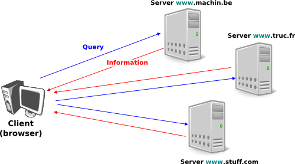
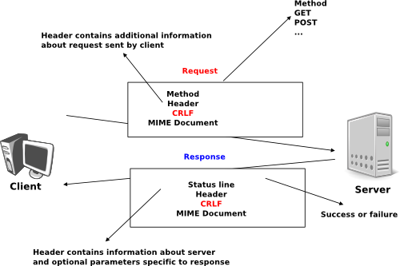
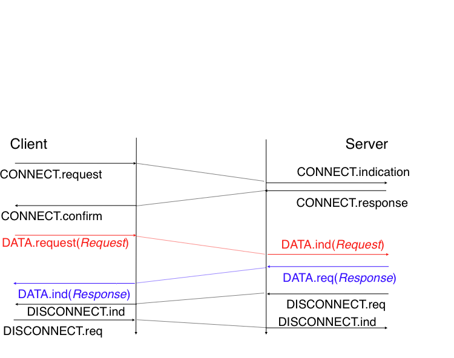
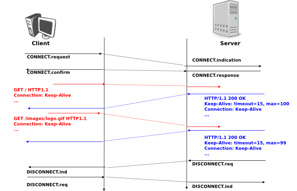
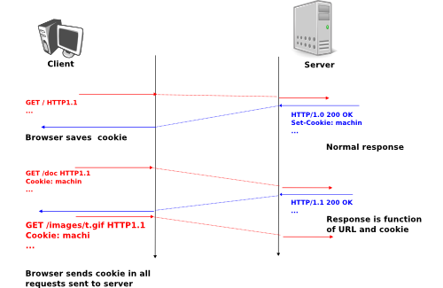

.. Copyright |copy| 2010 by Olivier Bonaventure
.. This file is licensed under a `creative commons licence <http://creativecommons.org/licenses/by-sa/3.0/>`_

.. _HTTP:

The HyperText Transfer Protocol
================================

In the early days of the Internet, the network was mainly used for remote terminal access with telnet_, email and file transfer. The default file transfer protocol, `ftp`, defined in :rfc:`959` was widely used and `ftp` clients and servers are still included in most operating systems.

Many `ftp` clients offer a user interface similar to a Unix shell and allow the client to browse the file system on the server and send and retrieve files. `ftp` servers can be configured in two modes :

 - authenticated : in this mode, the ftp server only accepts users with a valid username and password. Once authenticated, they can access the files and directories according to their permissions
 - anonymous : in this mode, clients supply the `anonymous` userid and their email address as password. These clients are granted access to a special zone of the file system that only contains public files. 

ftp was very popular in the 1990s and early 2000s, but today it has mostly been superseded by more recent protocols. Authenticated access to files is mainly done by using the Secure Shell (ssh) protocol defined in :rfc:`4251` and supported by clients such as scp_ or sftp_. Anonymous access is nowadays mainly provided by web protocols.

In the late 1980s, high energy physicists working at CERN_ had to efficiently exchange documents about their ongoing and planned experiments. `Tim Berners-Lee`_ evaluated several of the documents sharing techniques that were available at that time [B1989]_. As none of the existing solutions met CERN's requirements, they choose to develop a completely new document sharing system. This system was initially called the `mesh`, but was quickly renamed the `world wide web`. The starting point for the `world wide web` is the hypertext. An hypertext is a text that contains references (hyperlinks) to other documents that the reader can immediately access. Hypertext was not invented for the world wide web. The idea of hypertext documents was proposed in 1945 [Bush1945]_ and the first experiments were done during the 1960s [Nelson1965]_ [Myers1998]_ . Compared to the hypertexts that were used in the late 1980s, the main innovation introduced by the `world wide web` was to allow hyperlinks to reference documents stored on remote machines. 

   World-wide web clients and servers 

A document sharing system such as the `world wide web` is composed of three important parts.

 1. A standardised addressing scheme that allows to unambiguously identify documents 
 2. A standard document format : the `HyperText Markup Langage <http://www.w3.org/MarkUp>`_
 3. A standardised protocol that allows to efficiently retrieve documents stored on a server

.. note:: Open standards and open implementations

 Open standards have and are still playing a key role in the success of the `world wide web` as we know it today. Without open standards, the world wide web would have never reached its current size. In addition to open standards, another important factor for the success of the web was the availability of open and efficient implementations of these standards. When CERN started to work on the `web`, their objective was to build a running system that could be used by physicists. They developed open-source implementations of the `first web servers <http://www.w3.org/Daemon/>`_ and `web clients <http://www.w3.org/Library/Activity.html>`_. These open-source implementations were powerful and could be used as is by institutions willing to share information on the web. They were also extended by other developers who contributed to new features. For example, NCSA_ added support for images in their `Mosaic browser <http://en.wikipedia.org/wiki/Mosaic_(web_browser)>`_ that was eventually used to create `Netscape Communications <http://en.wikipedia.org/wiki/Netscape>`_. 

The first component of the `world wide web` are the Uniform Resource Identifiers (URI) defined in :rfc:`3986`. A URI is a character string that unambiguously identifies a resource on the world wide web. Here is a subset of the BNF for the URIs ::

   URI         = scheme ":" "//" authority path [ "?" query ] [ "#" fragment ]
   scheme      = ALPHA *( ALPHA / DIGIT / "+" / "-" / "." )
   authority   = [ userinfo "@" ] host [ ":" port ]
   query       = *( pchar / "/" / "?" )
   fragment    = *( pchar / "/" / "?" )
   pchar         = unreserved / pct-encoded / sub-delims / ":" / "@"
   query         = *( pchar / "/" / "?" )
   fragment      = *( pchar / "/" / "?" )
   pct-encoded   = "%" HEXDIG HEXDIG
   unreserved    = ALPHA / DIGIT / "-" / "." / "_" / "~"
   reserved      = gen-delims / sub-delims
   gen-delims    = ":" / "/" / "?" / "#" / "[" / "]" / "@"
   sub-delims    = "!" / "$" / "&" / "'" / "(" / ")" / "*" / "+" / "," / ";" / "="

The first component of a URI is its `scheme`. In practice, the `scheme` identifies the application-layer protocol that must used by the client to retrieve the document. The most frequent scheme is `http` that will be described later. A URI scheme can be defined for almost any application layer protocol [#furilist]_. The characters `:` and `//` follow the `scheme` of any URI.

The second part of the URI  is the `authority`. It includes the DNS name or the IP address of the server where the document can be retrieved by using the protocol specified in the `scheme`. This name can be preceded by some information about the user (e.g. a username) who is requesting the information. Earlier definitions of the URI allowed to specify a username and a password before the `@` character (:rfc:`1738`), but this is now deprecated as placing a password inside a URI is insecure. The host name can be followed by the semicolon character and a port number. A default port number is defined for each `scheme` and the port number should only be included in the URI if a non-default port number is used.

The third part of the URI is the path to the document. This path is structured as filenames on a Unix host. If the path is not specified, the server will returna default document. The last two optional parts of the URI are used to provide a query and indicate a specific part (e.g. a section in an article) of the requested document. Sample URIs are shown below ::

   http://tools.ietf.org/html/rfc3986.html
   mailto:infobot@example.com?subject=current-issue   
   http://docs.python.org/library/basehttpserver.html?highlight=http#BaseHTTPServer.BaseHTTPRequestHandler
   ftp://cnn.example.com&story=breaking_news@10.0.0.1/top_story.htm

The first URI corresponds to a document named `rfc3986.html` that is stored on the server named `tools.ietf.org` and can be accessed by using the `http` protocol on its default port. The second URI corresponds to an email message with subject `current-issue` that will be sent to user `infobot` in domain `example.com`. The `mailto:` URI scheme is defined in :rfc:`2368`. The third URI references the portion `BaseHTTPServer.BaseHTTPRequestHandler` of the document `basehttpserver.html` that is stored in the `library` directory on server `docs.python.org`. This document can be retrieved by using the `http` protocol. The query `highlight=http` is associated to this URI. The last URI is somewhat special. Most users will assume that it corresponds to a document stored on the `cnn.example.com` server. However, to parse this URI, it is important to remember that the `@` character is used to separate the username from the host name in the authorisation part of a URI. This implies that the URI points to a document named `top_story.htm` on host having IPv4 address `10.0.0.1`. The document will be retrieved by using the `ftp` protocol with the username set to `cnn.example.com&story=breaking_news`. 

The second component of the `word wide web` is the HyperText Markup Language (HTML). HTML defines the format of the documents that are exchanged on the `web`. The `first version of HTML <http://www.w3.org/History/19921103-hypertext/hypertext/WWW/MarkUp/Tags.html>`_ was derived from the Standard Generalized Markup Language (SGML) that was standardised in 1986 by :term:`ISO`. SGML_ was designed to allow large project documents in industries such as government, law or aerospace to be shared efficiently in a machine-readable manner. These industries require documents that remain readable and editable for tens of years and insisted on a standardised format supported by multiple vendors. Today, SGML_ is not widely used anymore besides specific applications, but its descendants including like :term:`HTML` and :term:`XML` are now widespread.

A markup language is structured way of adding annotations about the formatting of the document in the document itself. Example markup langages include troff that is used to write the Unix man pages or Latex. HTML uses markers to annotate text. An HTML document is composed of `HTML elements`. An element is usually composed of three elements : a start tag that potentially includes some specific attributes, some text and an end tag. An HTML tag is a keyword enclosed in angle brackets. The generic form of an HTML element is ::

 <tag>Some text to be displayed</tag>

More complex HTML elements can also include optionnal attributes in the start tag ::
 
 <tag attribute1="value1" attribute2="value2">some text to be displayed</tag>

The HTML document shown below is composed of two parts : a header delineated by the `<HEAD>` and `</HEAD>` markers and a body (between the `<BODY>` and `</BODY>` markers). In the example below, the header only contains a title, but other types of information can be included in the header. The body contains an image, some text and a list with three hyperlinks. The image is included in the web page by indicating its URI between brackets inside the `` marker. The image can, of course, reside on any server and the client will automatically download it when rendering the web page. The `<H1>...</H1>` marker is used to specify the first level of headings. The `<UL>` indicates an unnumbered list while the `<LI>` marker indicates a list item. The `<A HREF="URI">text</A>` indicates an hyperlink. The `text` will be underlines in the rendered web page and client will fetch the specified URI when the user clicks on the link.

.. figure:: svg/app-fig-015-c.png
   :align: center
   :scale: 50 

   A simple HTML page 

Additional details about the various extensions to HTML may be found in the `official specifications <http://www.w3.org/MarkUp/>`_ maintained by W3C_.

The third component of the `world wide web` is the HyperText Transport Protocol (HTTP). HTTP is a text-based protocol in which the client sends one request and the server returns one response. HTTP runs above the bytestream service and HTTP servers listen by default on port `80`. The design of HTTP has been largely inspired by the Internet email protocols. Each HTTP request contains three parts :

 - a `method` that indicates the type of request, a URI and the version of the HTTP protocol used by the client 
 - a `header` that is used by the client to specify optional parameters for the request. An empty line is used to mark the end of the header
 - an optional MIME document attached to the request

The response sent by the server also contains three parts :

 - a `status line` that indicates whether the request was successful or not
 - a `header` that contains additional information about the response. The response header ends with an empty line.
 - a MIME document 

   HTTP requests and responses

Three types of methods can be used in HTTP requests :

 - the `GET` method is the most popular one. It is used to retrieve a document from a server. The `GET` method is encoded as `GET` followed by the path of URI of the requested document and the version of HTTP used by the client. For example, to retrieve the http://www.w3.org/MarkUp/ URI, a client must open a TCP on port `80` with host `www.w3.org` and send a HTTP request that contains the following line ::
  GET /MarkUp/ HTTP/1.0

 - the `HEAD` method is a variant of the `GET` method that allows to retrieve the header lines for a given URI without retrieving the entire document. It can be used by a client that wants to verify whether a document has changed compared to the copy that the client already has
 - the `POST` method is less popular. It can be used by a client to send a document to a server. The sent document is attached to the HTTP request as a MIME document.

HTTP clients and servers can include many different HTTP headers in HTTP requests and responses. Each HTTP header is encoded as a single ASCII-line terminated by `CR` and `LF`. Several of these headers are briefly described below. A detailed discussion of all standard headers may be found in :rfc:`1945`. The MIME headers can appear in both HTTP requests and HTTP responses.

 - the `Content-Length:` header is the :term:`MIME` header that indicates the length of the MIME document in bytes.
 - the `Content-Type:` header is the :term:`MIME` header that indicates the type of the attached MIME document. HTML pages use the `text/html` type.
 - the `Content-Encoding:` header indicates how the :term:`MIME document has been encoded. For example, this header would be set to `x-gzip` for a document compressed by using the gzip_ software. 

:rfc:`1945` and :rfc:`2616` define headers that are specific to HTTP responses. These server headers include :

 - the `Server:` header indicates the version of the web server that has generated the HTTP response. Some servers provide information about their software release and optional modules that they use. For security reasons, some system administrators disable these headers to avoid revealing too much information about their server to potential attackers.
 - the `Date:` header indicates when the HTTP response has been produced by the server.
 - the `Last-Modified:` header indicates the date and time of the last modification of the document attached to the HTTP response. 
 
Similarly, the following header lines can only appear inside HTTP requests sent by a client :

 - the `User-Agent:` header provides information about the client that has generated the HTTP request. Some servers analyse this header line and return different headers and sometimes different documents for different user agents.
 - the `If-Modified-Since:` header is followed by a date. It enables the clients to cache in memory or on disk the recent or most frequently used documents. When a client needs to request a URI from a server, it first checks whether the document is already inside its cache. If yes, it sends an HTTP request with the `If-Modified-Since:` header indicating the date of the cached document. The server will only return the document attached to the HTTP response if it is newer than the version stored in the client's cache. 
 - the `Referrer:` header is followed by a URI. It indicates the URI of the document that the client visited before sending this HTTP request. Thanks to this header, the server can know the URI of the document containing the hyperlink followed by the client, if any. This information is very useful to measure the impact of advertisements containing hyperlinks placed on websites. 
 - the `Host:` header contains the fully qualified domain name of the URI being requested. 

.. note:: The importance of the `Host:` header line

 The first version of HTTP did not include the `Host:` header line. This was a severe limitation for web hosting companies. For example consider a web hosting company that wants to serve both `web.example.com` and `www.dummy.net` on the same physical server. Both web sites contain a `/index.html` document. When a client sends a request for either `http://web.example.com/index.html` or `http://www.dummy.net/index.html`, the HTTP 1.0 request contains the following line : ::

  GET /index.html HTTP/1.0

 By parsing this line, a server cannot determine which `index.html` file is requested. Thanks to the `Host:` header line, the server knows whether the request is for `http://web.example.com/index.html` or `http://www.dummy.net/index.html`. Without the `Host:` header, this is impossible. The `Host:` header line allowed web hosting companies to develop their business by supporting a large number of independent web servers on the same physical server. 

The status line of the HTTP response begins with the version of HTTP used by the server (usually `HTTP/1.0` defined in :rfc:`1945` or `HTTP/1.1` defined in :rfc:`2616`) followed by a three digits status code and additional information in English. The HTTP status codes have a similar structure as the reply codes used by SMTP. 

 - All status codes starting with digit `2` indicate a valid response. `200 Ok` indicates that the HTTP request was successfully processed by the server and that the response is valid.
 - All status codes starting with digit `3` indicate that the requested document is not available anymore on the server. `301 Moved Permanently` indicates that the requested document is not anymore available on this server. A `Location:` header containing the new URI of the requested document is inserted in the HTTP response. `304 Not Modified` is used in response to an HTTP request containing the `If-Modified-Since:` header. This status line is used by the server if the document stored on the server is not more recent than the date indicated in the `If-Modified-Since:` header.
 - All status codes starting with digit `4` indicate that the server has detected an error in the HTTP request sent by the client. `400 Bad Request` indicates a syntax error in the HTTP request. `404 Not Found` indicates that the requested document does not exist on the server.
 - All status codes starting with digit `5` indicate an error on the server. `500 Internal Server Error` indicates that the server could not process the request due to an error on the server itself.

In both the HTTP request and the HTTP response, the MIME document refers to a representation of the document with the MIME headers that indicate the type of document and its size.

As an illustration of HTTP/1.0, here are an HTTP request for http://www.ietf.org and the corresponding HTTP response. The HTTP request was sent by the curl_ command line tool. The `User-Agent:` header line contains more information about this client software. There is no MIME document attached to this HTTP request, it ends with a blank line. ::
  GET / HTTP/1.0
  User-Agent: curl/7.19.4 (universal-apple-darwin10.0) libcurl/7.19.4 OpenSSL/0.9.8l zlib/1.2.3
  Host: www.ietf.org
  

The HTTP response indicates the version of the server software used with the included modules. The `Last-Modified:` header indicates that the requested document was modified about one week before the request. An HTML document (not shown) is attached to the response. Note the blank line between the header of the HTTP response and the attached MIME document. ::

  HTTP/1.1 200 OK
  Date: Mon, 15 Mar 2010 13:40:38 GMT
  Server: Apache/2.2.4 (Linux/SUSE) mod_ssl/2.2.4 OpenSSL/0.9.8e PHP/5.2.6 with Suhosin-Patch mod_python/3.3.1 Python/2.5.1 mod_perl/2.0.3 Perl/v5.8.8
  Last-Modified: Tue, 09 Mar 2010 21:26:53 GMT
  Content-Length: 17019
  Content-Type: text/html
  
  <!DOCTYPE HTML PUBLIC .../HTML>

HTTP was initially designed to share text documents that were self-contained. For this reason, and to ease the implementation of clients and servers, the designers of HTTP choose to open a TCP connection for each HTTP request. This implies that a client must open one TCP connection for each URI that it wants to retrieve from a server as illustrated on the figure below. On a web containing only text documents this was a reasonable design choice as the client remains usually idle while the (human) user is reading the retrieved document. 

   HTTP 1.0 and the underlying TCP connection

However, as the web evolved to support richer documents containing images, opening a TCP connection for each URI became a performance problem [Mogul1995]_. Indeed, besides its HTML part, a web page may include dozens of images or more. Forcing the client to open a TCP connection for each component of a web page has two important drawbacks. First, the client and the server must exchange packets to open and close a TCP connection as we will see later. This increases the network overhead and the total delay to completely retrieve all the components of a web page. Second, a large number of established TCP connections may be a performance bottleneck on servers. 

This problem was solved by extending HTTP to support persistent TCP connections :rfc:`2616`. A persistent connection is a TCP connection over which a client may send several HTTP requests. This is illustrated in the figure below.  

   HTTP 1.1 persistent connections

To allow the clients and servers to control the utilisation of these persistent TCP connections, HTTP 1.1 :rfc:`2616` defines several new HTTP headers :

 - The `Connection:` header is used with the `Keep-Alive` argument by the client to indicate that it expects the underlying TCP connection to be persistent. When this header is used with the `Close` argument, it indicates that the entity that sent it will close the underlying TCP connection at the end of the HTTP response.
 - The `Keep-Alive:` header is used by the server to inform the client about how it agrees to use the persistent connection. A typical `Keep-Alive:` contains two parameters : the maximum number of requests that the server agrees to serve on the underlying TCP connection and the timeout (in seconds) after which the server will close an idle connection

The example below shows the operation of HTTP/1.1 over a persistent TCP connection to retrieve three URIs stored on the same server. Once the connection has been established, the client sends its first request with the `Connection: keep-alive` header to request a persistent connection. ::

 GET / HTTP/1.1
 Host: www.kame.net
 User-Agent: Mozilla/5.0 (Macintosh; U; Intel Mac OS X 10_6_2; en-us) AppleWebKit/531.22.7 (KHTML, like Gecko) Version/4.0.5 Safari/531.22.7 
 Connection: keep-alive

The server replies with the `Connection: Keep-Alive` header and indicates that it accepts a maximum of 100 HTTP requests over this connection and the it will close the connection if it remains idle for 15 seconds. ::

 HTTP/1.1 200 OK
 Date: Fri, 19 Mar 2010 09:23:37 GMT
 Server: Apache/2.0.63 (FreeBSD) PHP/5.2.12 with Suhosin-Patch
 Keep-Alive: timeout=15, max=100
 Connection: Keep-Alive
 Content-Length: 3462
 Content-Type: text/html

 <html...   </html>

The client sends a second request for the style sheet of the retrieved web page. ::

 GET /style.css HTTP/1.1
 Host: www.kame.net
 Referer: http://www.kame.net/
 User-Agent: Mozilla/5.0 (Macintosh; U; Intel Mac OS X 10_6_2; en-us) AppleWebKit/531.22.7 (KHTML, like Gecko) Version/4.0.5 Safari/531.22.7
 Connection: keep-alive

The server replies with the requested style sheet and maintains the persistent connection. Note that the server only accepts 99 remaining HTTP requests over this persistent connection. ::

 HTTP/1.1 200 OK
 Date: Fri, 19 Mar 2010 09:23:37 GMT
 Server: Apache/2.0.63 (FreeBSD) PHP/5.2.12 with Suhosin-Patch
 Last-Modified: Mon, 10 Apr 2006 05:06:39 GMT
 Content-Length: 2235
 Keep-Alive: timeout=15, max=99
 Connection: Keep-Alive
 Content-Type: text/css

 ...

The last request sent by the client is for the webserver's icon [#ffavicon]_ that could be displayed by the browser. This server does not contain such URI and thus replies with a `404` HTTP status. However, the underlying TCP connection is not immediately closed. ::

 GET /favicon.ico HTTP/1.1
 Host: www.kame.net
 Referer: http://www.kame.net/
 User-Agent: Mozilla/5.0 (Macintosh; U; Intel Mac OS X 10_6_2; en-us) AppleWebKit/531.22.7 (KHTML, like Gecko) Version/4.0.5 Safari/531.22.7
 Connection: keep-alive

 HTTP/1.1 404 Not Found
 Date: Fri, 19 Mar 2010 09:23:40 GMT
 Server: Apache/2.0.63 (FreeBSD) PHP/5.2.12 with Suhosin-Patch
 Content-Length: 318
 Keep-Alive: timeout=15, max=98
 Connection: Keep-Alive
 Content-Type: text/html; charset=iso-8859-1

 <!DOCTYPE HTML PUBLIC "-//IETF//DTD HTML 2.0//EN"> ...

As illustrated above, a client can send several HTTP requests over the same persistent TCP connection. However, it is important to note that all these HTTP requests are considered to be independent by the server. Each HTTP request must be self-contained and must include all the header that are required by the server to understand the request. The independence of the requests is one of the important design choices of HTTP. A consequence of this design choice is that when a serer processes an HTTP request, it does not use other information that the one contained in the request itself. This explains why the client adds its `User-Agent:` header in all the HTTP requests that it sends over the persistent TCP connection.

However, in practice, some servers want to provide content that is tuned for each user. For example, some servers can provide information in several languages or other servers want to provide advertisements that are targeted to different types of users. For this, servers need to maintain some information about the preferences of each user and use to information to produce the content that matches their user's preferences. Several solutions have been tested in HTTP to solve this problem and it is interesting to discuss their advantages and drawbacks.

A first solution is to force the users to be authenticated. This was the solution used by ftp to control the files that each user could access. Initially, usernames and password could be included inside URIs :rfc:`1738`. However, placing passwords in clear in a potentially publicly visible URI is completely insecure and this usage is now deprecated :rfc:`3986`. HTTP supports several extension headers :rfc:`2617` that can be used by a server to request the client to be authenticated and by the client to provide his/her credentials. However, usernames and passwords have not been popular on web servers because they force the human users to remember one username and one password per server. Remembering a password is acceptable when a user needs to access protected content, but users will not accept to pick a username and password to receive targeted advertisements from the web sites that they visit.

A second solution to allow servers to tune that content to the needs and capabilities of the user is to rely on the different types of `Accept-*` HTTP headers. For example, the `Accept-Language:` can be used by the client to indicate its preferred languages. Unfortunately, in practice this header is usually set based on the default language of the browser and it is not possible for a user to indicate that language that it prefers to use by selecting options on each visited web server.

The third, and widely adopted, solution are the HTTP cookies. HTTP cookies were initially developed as a private extension by Netscape_. They are now part of the standard :rfc:`2965`. In a nutshell, a cookie is a short string that is chosen by a server to represent a given client. Two HTTP headers are used : `Cookie:` and `Set-Cookie:`. When a server receives an HTTP request from a new client (i.e. an HTTP request that does not contain the `Cookie:` header), it generates a cookie for the client and includes it in the `Set-Cookie:` header of the returned HTTP response. The `Set-Cookie:` header contains several additional parameters including the domain names for which the cookie is valid. The client stores all received cookies on disk and every time it sends an HTTP request, it verifies whether it already knows a cookie for this domain. If so, it attaches the `Cookie:` header to the HTTP request. This is illustrated in the figure below with HTTP 1.1, but cookies also work with HTTP 1.0.

   HTTP cookies

.. note:: Privacy issues with HTTP cookies

 The HTTP cookies introduced by Netscape_ are key for large e-commerce websites. However, they have also raised many discussions concerning their `potential misuses <http://www.nytimes.com/2001/09/04/technology/04COOK.html>`_. Consider `ad.com`, a company that delivers lots of advertisements on web sites. A web site that wishes to include `ad.com`'s advertisements next to its content will add links to `ad.com` inside its HTML pages. If `ad.com` is used by many web sites, `ad.com` could be able to track the interests of all the users that visit its client websites and use this information to provide targeted advertisements. Privacy advocates have even `sued <http://epic.org/privacy/internet/cookies/>`_ online advertisement companies to force them to comply with the privacy regulations. More recent related technologies also raise `privacy concerns <http://www.eff.org/deeplinks/2009/09/new-cookie-technologies-harder-see-and-remove-wide>`_ 
 
.. rubric:: Footnotes

.. [#furilist] The list of standard URI schemes is maintained by IANA_ at http://www.iana.org/assignments/uri-schemes.html

.. [#ffavicon] Favorite icons are small icons that are used to represent web servers in the toolbar of Internet browsers. Microsoft added this feature in their browsers without taking into account the W3C standards. See http://www.w3.org/2005/10/howto-favicon for a discussion on how to cleanly support such favorite icons.

