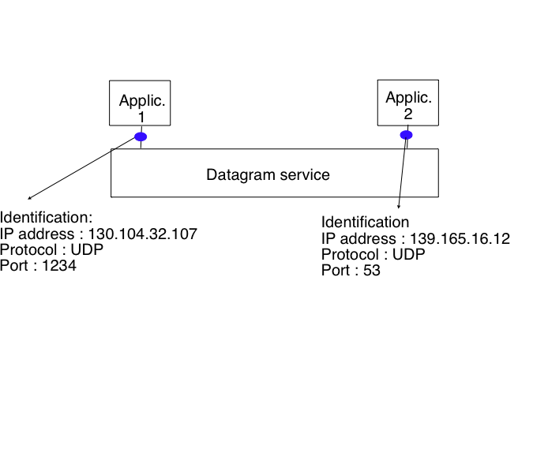
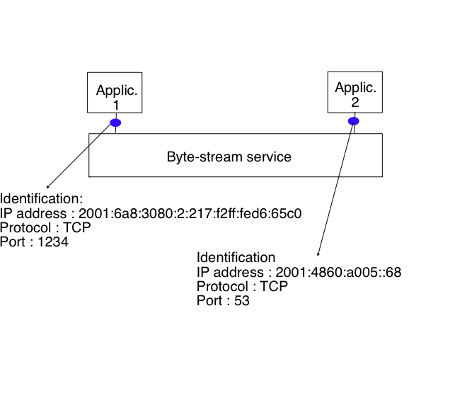

.. Copyright |copy| 2010 by Olivier Bonaventure
.. This file is licensed under a `creative commons licence <http://creativecommons.org/licenses/by-sa/3.0/>`_

The transport services
======================

Networked applications are built on top of the transport service. As explained in the previous chapter, there are two main types of transport services :

 - the `connectionless` or `datagram` service
 - the `connection-oriented` or `byte-stream` service

The connectionless service allows applications to easily exchange messages or Service Data Units. On the Internet, this service is provided by the UDP protocol that will be explained in the next chapter. The connectionless transport service on the Internet is unreliable, but is able to detect transmission errors. This implies that an application will not receive an SDU that has been corrupted due to transmission errors. 

The connectionless transport service allows networked application to exchange messages. Several networked applications may be running at the same time on a single host. Each of these applications must be able to exchange SDUs with remote applications. To enable these exchanges of SDUs, each networked application running on a host is identified by the following information :

 - the `host` on which the application is running
 - the `port number` on which the application `listens` for SDUs

On the Internet, the `port number` is an integer and the `host` is identified by its network address. As we will see in chapter :ref:`chapter-network` there are two types of Internet Addresses :

 - `IP version 4` addresses that are 32 bits wide
 - `IP version 6` addresses that are 128 bits wide

IPv4 addresses are usually represented by using a dotted decimal representation where each decimal number corresponds to one byte of the address, e.g. 130.104.32.107. IPv6 addresses are usually represented as a set of hexadecimal numbers separated by by semicolons, e.g. 2001:6a8:3080:2:217:f2ff:fed6:65c0. Today, most Internet hosts have one IPv4 address. A small fraction of them also have an IPv6 address. In the future, we can expect that more and more hosts will have IPv6 addresses and that some of them will not have an IPv4 address anymore. A host that only has an IPv4 address cannot communicate with a host having only an IPv6 address. The figure below illustrates two that are using the datagram service provided by UDP on hosts that are using IPv4 addresses.

   The connectionless or datagram service 

The second transport service is the connection-oriented service. On the Internet, this service is often called the `byte-stream service` as it creates a reliable byte stream between the two applications that are linked by a transport connection. Like the datagram service, the networked applications that use the byte-stream service are identified by the host on which they run and a port number. These hosts can be identified by an IPv4 address, an IPv6 address or a name. The figure below illustrates two applications that are using the byte-stream service provided by the TCP protocol on IPv6 hosts. The byte stream service provided by TCP is reliable and bidirectional. 

   The connection-oriented or byte-stream service 
