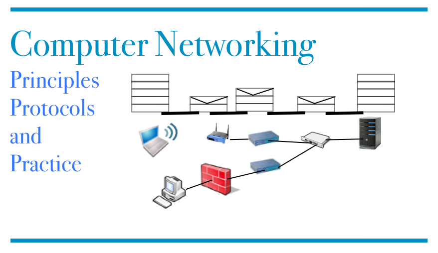

.. Copyright |copy| 2010 by `Olivier Bonaventure <http://inl.info.ucl.ac.be/obo>`_
.. This file is licensed under a `creative commons licence <http://creativecommons.org/licenses/by-sa/3.0/>`_

.. Computer Networking : Principles, Protocols and Practice, created by
   sphinx-quickstart on Tue Sep  8 22:48:38 2009.
   You can adapt this file completely to your liking, but it should at least
   contain the root `toctree` directive.

########################################################
Computer Networking : Principles, Protocols and Practice
########################################################

.. toctree:: 
   :maxdepth: 4
   :numbered:

   preface
   intro/introduction
   application/application
   transport/transport
   network/network
   lan/lan
   bibliography
   glossary

==================
Indices and tables
==================

* :ref:`genindex`
* :ref:`search`

