============
Introduction
============

When the first computers were built during the second world war, they were expensive and isolated. However, after about twenty years, as their prices were decreasing and the first experiments were started to connect computers together. In 1964, `Paul Baran`_ and `Donald Davies`_ published independently the first papers describing the idea of building computer networks. Given the cost of computers, sharing them over a long distance was an interesting idea. In the US, the :term:`ARPANET` started in 1969 and continued until the mid 1980s. In France, `Louis Pouzin`_ developed the Cyclades network. During the 1970s, the telecommunication and the computer industry became interested in computer networks. The telecommunication industry bet on the X25_. Many local area networks such as Ethernet or Token Ring were designed at that time. During the 1980s, the need to interconnect more and more computers lead most computer vendors to develop their own suite of networking protocols. Xerox developed XNS, DEC chose DECNet, IBM developed SNA, Microsoft introduced NetBIOS, Apple bet on Appletalk, ... In the research community, ARPANET was decommissioned and replaced by TCP/IP and the reference implementation was developed inside BSD Unix. Universities who were already running Unix could thus adopt TCP/IP easily and vendors of Unix workstations such as Sun or Silicon Graphics included TCP/IP in their variant of Unix. In parallel, the :term:`ISO`, with support from the governements, worked on developing an open [#open]_ suite of networking protocols. In the end, TCP/IP became the de facto standard that is used not only within the research community. During the 1990s and the early 2000s, the growth of the usage of TCP/IP continued and today proprietary protocols are seldom used. As shown by the figure below that provides the estimation of the number of hosts attached to the Internet, the Internet sustained a huge growth during the last 20+ years.

Recent estimations of the number of hosts attached to the Internet show a continuing growth since 20+ years. However, although the number of hosts attached to the Internet is high, it should be compared to the number of mobile phones that are in use today. More and more of these mobile phones will be connected to the Internet. Furthermore, thanks to the availability of TCP/IP implementations requiring limited resources such as uIP_ , we can expect to see a growth of the TCP/IP enabled embedded devices.  

.. figure:: png/intro-figures-006-c.png
   :align: center
   :scale: 50 

   Estimation of the number of hosts on the Internet

.. figure:: png/intro-figures-007-c.png
   :align: center
   :scale: 50 

   Estimation of the number of mobile phones

Before looking at the services that are provided by computer networks, it is useful to agree on some terminology that is widely used in the networking literature. First, computer networks are often classified as function of the geographical area that they cover

- :term:`LAN` : a local area network typically interconnects hosts that are up to a few or maybe a few tens of kilometers apart. 
- :term:`MAN` : a metropolitan area network typically interconnects devices that are up to a few hundred kilometers apart
- :term:`WAN` : a wide area network interconnect hosts that can be located anywhere on Earth

Another classification of computer networks is based on their physical topology. In the following figures, physical links are represented as lines while boxes show computers or other types of networking equipment.

Computer networks are used to allow several hosts to exchange information between themselves. In order to allow any host to send messages to any other host in the network, the easiest solution is to organise them as a full-mesh with a direct and dedicated link between each pair of hosts. Such a physical topology is sometimes used, especially when high performance and high redundancy is required for a small number of hosts. However, it has two major drawbacks :

- for a network containing `n` hosts, each host must have `n-1` physical interfaces. Thus, in practice the number of physical interfaces on a node will limit the size of a full-mesh network that can be built
- for a network containing `n` hosts, `n*(n-1)/2` links are required. This is possible when there are a few nodes in the same room, but rarely when they are located several kilometers apart

.. figure:: png/intro-figures-001-c.png
   :align: center
   :scale: 50 

   A Full mesh network

The second possible physical organisation, which is used inside computers to connect different extension cards, is the bus. In a bus network, all hosts are attached to a shared medium, usually a cable through a single interface. When one hosts sends a signal on the bus, the signal is received by all hosts attached to the bus. A drawback of bus-based networks is that if the bus is physicaly cut, then the network is splitted in two different networks.  For this reason, bus-based networks are sometimes considered to be difficult to manage especially when the cable is long and there are many places where it can break. Such as bus-based topology is used for example by Ethernet networks.

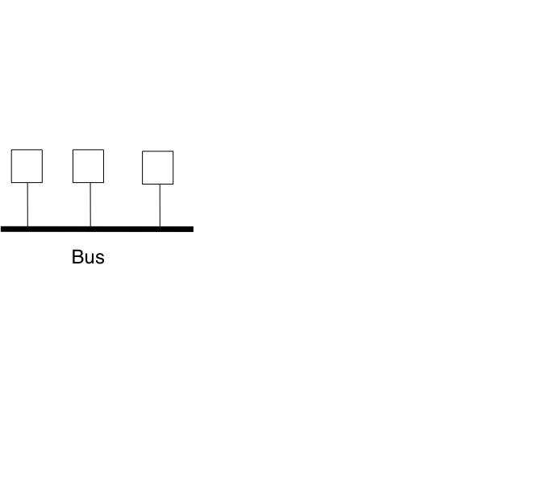

   A network organised as a Bus

A third organisation of a computer network is a star topology. In such topologies, the hosts have a single physical interface and there is one physical link between each host and the center of the star. The node at the center of the star can be either a passive device such as an equipment that amplifies electrical signal or an active device such as an equipment that understands the format of the messages exchanged through the network. Of course, the failure of the central node implies the failure of the network. However, if one physical link fails (e.g. because the cable has been cut), then only one node is disconnected from the network. In practice, star-shaped networks are easier to manage than bus-shaped networks.

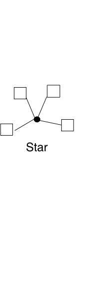

   A network organised as a Star

A fourth physical organisation is the Ring. As with the bus, each host has a single physical interface that connects it to the ring. Any signal sent by a host on the ring will be received by all hosts attached to the ring. From a redundancy viewpoint, a single ring is not the best solution as the signal travels only in one direction on the ring. If one of the links that compose the ring is cut, then the entire network fails. This makes failure easier to detect than in bus-based networks. In practice, such rings have been used in local area networks, but nowadays they are often replaced by star-shaped networks. In metropolitan are networks, rings are often used to interconnect multiple locations. In this case, two parallel links composed of different cables are often used for redundancy. With such a dual ring, when one ring fails all the traffic can be switched quickly to the other ring.

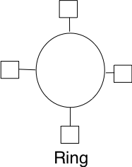

   A network organised as a Ring

A fifth physical organisation of a network is the tree. Such networks are typically used when a large number of customers must be connected in a very cost-effective manner. Cable TV networks are often organised as trees.

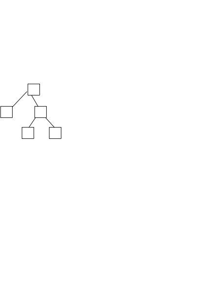

   A network organised as a Tree
   
In practice, most real networks combine part of these topologies. For example, a campus network can be organised as a ring between the key buildings while smaller buildings are attached as a tree or a star to important buildings. Or an ISP network may have a full mesh of devices in the core of its network and trees to connect remote users.

Throughout this book, our objective will be to understand the protocols and mechanisms that are necessary for a network such as the one shown below.

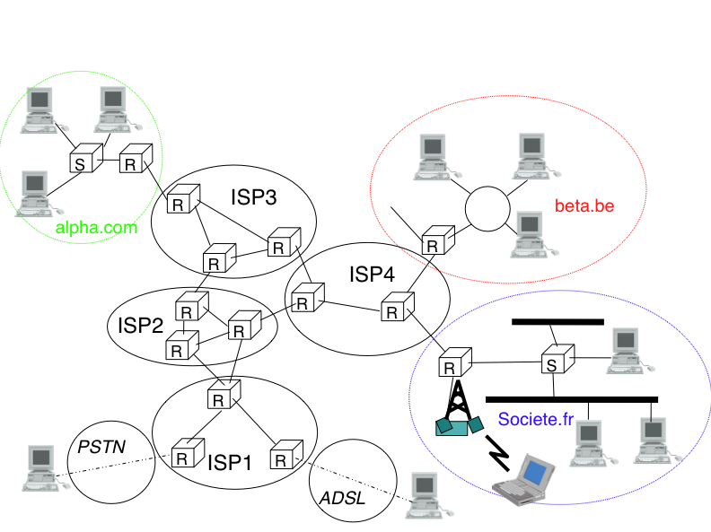

   A simple internetwork

The last point of terminology that we need to discuss are the transmission modes. When exchanging information through a network, we often distinguish three transmission modes. In TV and radio transmission, :term:`broadcast` is often used to indicate a technology that send a video or radio signal to all receivers in a given geographical area. Broadcast is sometimes used in computer networks, but only in local area networks where the number of recipients is limited.

The first and most widespread transmission mode is called :term:`unicast` . In the unicast transmission mode, information is sent by one sender to one receiver. Most of today's Internet applications rely on the unicast transmission mode.

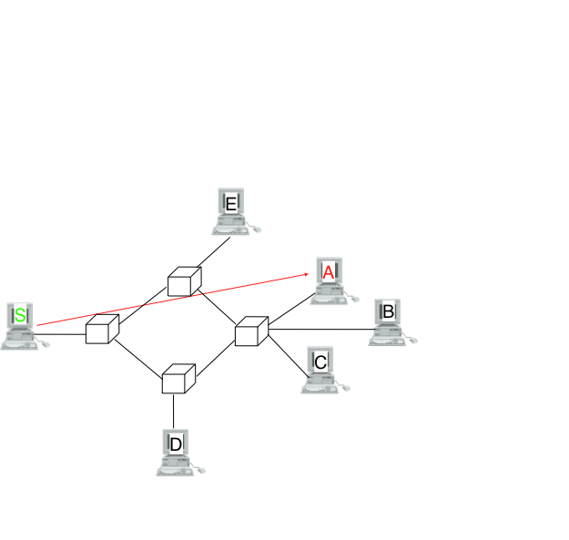

   Unicast transmission

A second mode of transmission is the :term:`multicast` transmission mode. This mode is used when the same information must be sent to a set of recipients. It was first used in LANs but became later supported in wide area networks. When a sender uses multicast to send information to `N`receivers, the sender sends a single copy of the information and the network nodes duplicate the information whenever necessary so that it can reach all the recipients that belong to the destination group.  

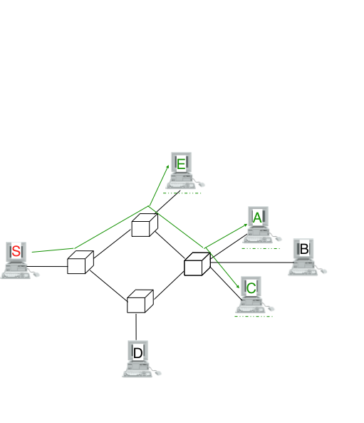

   Multicast transmission

The last transmission mode is the :term:`anycast` transmission mode. It was intially defined in :rfc:`1542`. In this transmission mode, a set of receivers is identified. When a source sends information towards this set of receivers, the network ensures that the information is delivered to `one` receiver that belongs to this set. Usually the receiver that is closest to the source is the one that receives the information sent by this particular source. The anycast transmission mode is useful to ensure redundancy as when one of the receivers fails, the network will ensure that information will be delivered to another receiver belonging to the same group. However, in practice supporting the anycast transmission mode can be difficult.

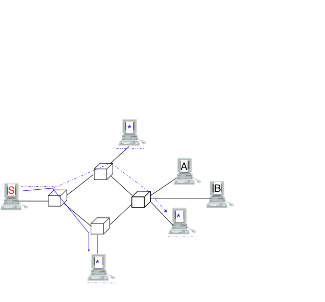

   Anycast transmission

Services and protocols
######################

An important point to understand before studying computer networks is the different between a *service* and a *protocol*. 

To understand the difference between the two, it is useful to start from the real world. The tradionnal Post provides a service which is to deliver letters to recipients. The service can be more precisely 

In computer networks, the notion of service is more formally defined in [X200]_ . It can be better understood by considering a computer networks, what ever its size or complexity as a black box that provides a service to ` users`  as shown in the figure below. These users could be human users or processes running on a computer system. 

.. _fig-users:

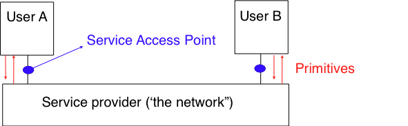

   Users and service provider

Throughout this book, we will define a service as a set of capabilities provided by a system (and its underlying elements) to its user. A user interacts with a service through a `service access point` Note that as shown in the figure above, the users interact with one service provider. In practice, the service provider is distributed over several hosts, but these are implementation details that are not important at this stage. These interactions between a user an a service provider are expressed in [X200]_ by using primitives as show in the figure below. These primitives are an abstract representation of the interactions between a user and a service providier. In practice, these interactions could be implemented as system calls for example.

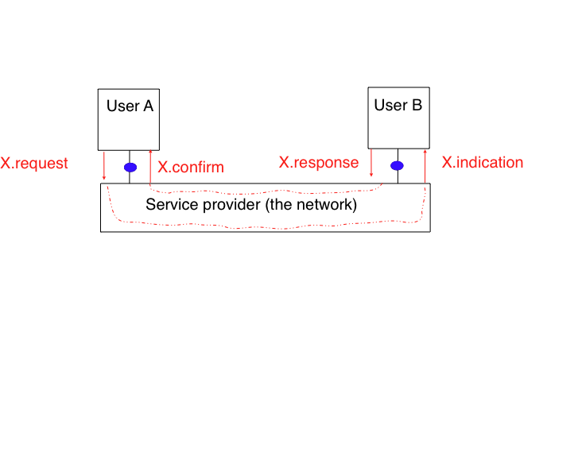

   The four types of primitives

Four types of primitives are defined :

 - `X.request` : This type of primitive corresponds to a request issued by a user to a service provider
 - `X.indication` : primitive generated by the network provider to a user (often related to an earlier and remote X.request primitive)
 - `X.response` primitive used to answer to an earlier X.indication primitive 
 - `X.confirm` : a 

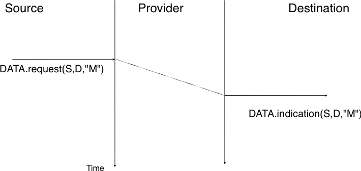

   A simple connectionless service

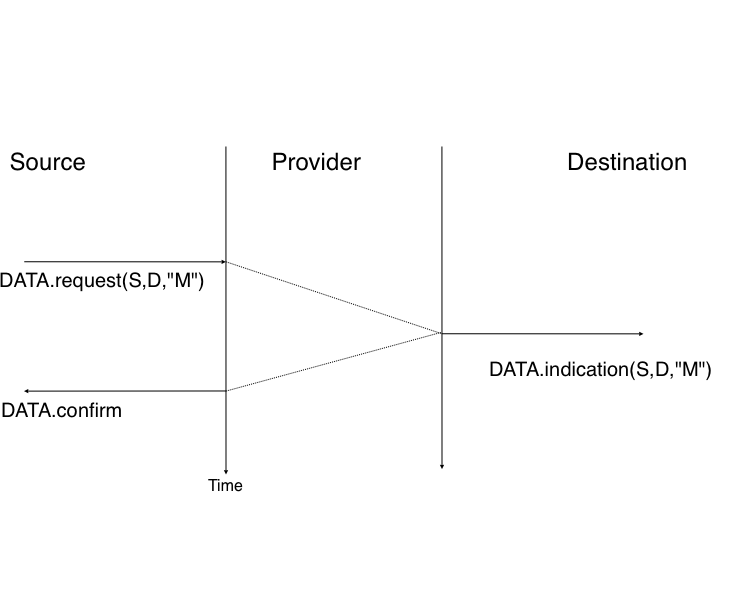

   A confirmed connectionless service

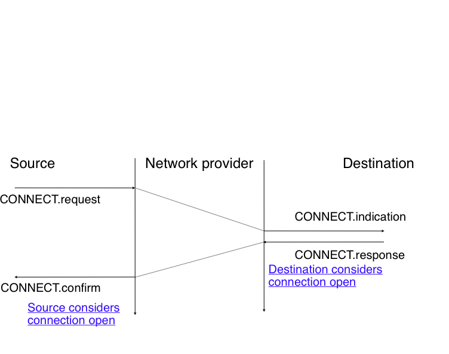

   Connection establishement

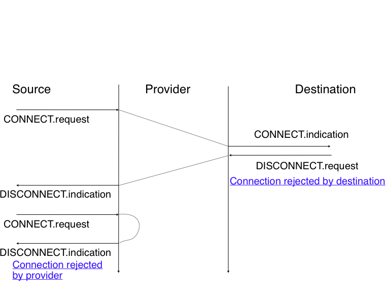

   The two types of connection release

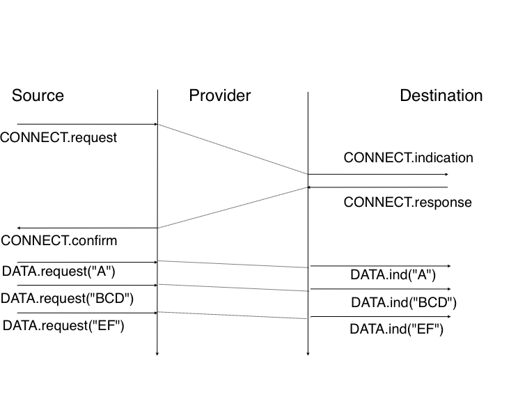

   Message-mode transfert in a connection oriented service

.. figure:: png/intro-figures-022-c.png
   :align: center
   :scale: 50 

   Stream-mode transfert in a connection oriented service

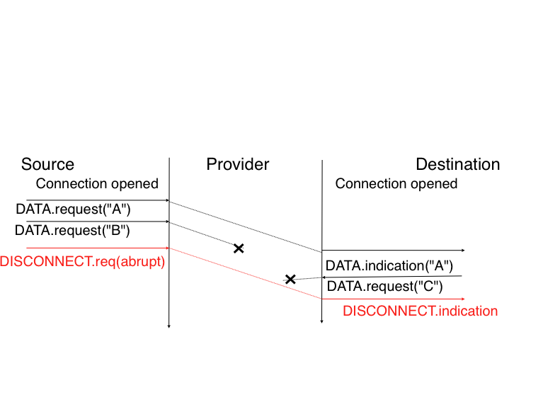

   Possible loss of data during an abrupt connection release

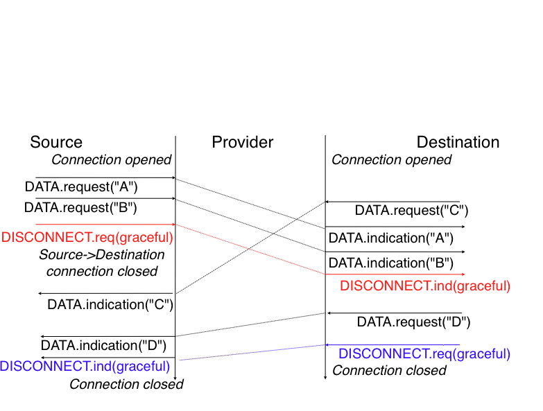

   Graceful connection release

The reference models
####################

Given the growing complexity of computer networks, network researchers proposed during the 1970s reference models that allow to describe network protocols and services. The Open Systems Interconnection (OSI) model [Zimmermann80] was probably the most influencial one. It was the basis for the standardisation work performed within the :term:`ISO` to develop global computer network standards. The  reference model that we use in this book can be considered as a simplified version of the OSI reference model [#fiso-tcp]_.

The five layers reference model
-------------------------------

Our reference model is divided in five layers as shown in the figure below.

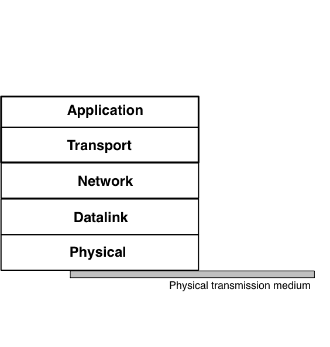

   The five layers of the reference model

Starting from the bottom, the first layer is the Physical layer. Two communicating devices are  linked through a physical medium. The physical medium is used to transfer and electrical or optical signal between the two devices. Different types of physical meidums are used in practice : 

 - electrical cable. Information can be transmitted over different types of electrical cables. The most common ones are twisted pairs that are used in the telephone network, but also in enterprise networks and coaxial cables. Coaxial cables are still used in cable TV networks, but not anymore in enterprise networks. 
 - optical fiber. Optical fibers are frequently used in public and entreprise networks with the distance is larger than one kilometer. 
 - wireless. In this case, a radio signal is used to encode the information being exchanged between the communicating devices. 

.. note:: Additional information about the physical layer will be added later.

An important point to note about the Physical layer is the service that it provides. This service is usually an unreliable connection-oriented service that allows the users of the Physical layer to exchange bits. The unit of information transfert in the Physical layer is the bit. The Physical layer service is unreliable because :

 - the Physical layer may change, e.g. due to electromagnetical interferences, the value of a bit being transmitted
 - the Physical layer may deliver `more` bits to the receiver than the bits sent by the sender
 - the Physical layer may deliver `fewer` bits to the receiver than the bits sent by the sender

The last two points may seem strange at first glance. When two devices are attached through a cable, how is it possible for bits to be created or lost on such a cable ? 

This is mainly due to the fact that the communicating devices use their own clock to transmit bits at a given bandwidth. Consider a sender having a clock that ticks one million times per second and sends one bit every tick. Every microsecond, the sender sends an electrical or optical signal that encodes one bit. The sender's bandwidth is thus 1 Mbps. If the receiver clock ticks exactly [#fsynchro]_ every microsecond, it will also deliver 1 Mbps to its user. However, if the receiver's clock is slightly faster (resp. slower), than it will deliver slightly more (resp. less) than one million bits every seconde.

.. sidebar:: Bandwidth

 In computer networks, the bandwidth achievable through the physical layer is always expressed in bits per second. A Mega bps is one million bits per second and a Giga bps is one billion bits per second. This is in contrast with memory specifications that are usually expressed in bytes (8 bits), KiloBytes ( 1024 bytes) or MegaBytes (1048576 bytes). Thus transferring one MByte through a 1 Mbps link lasts 1.048 seconds.

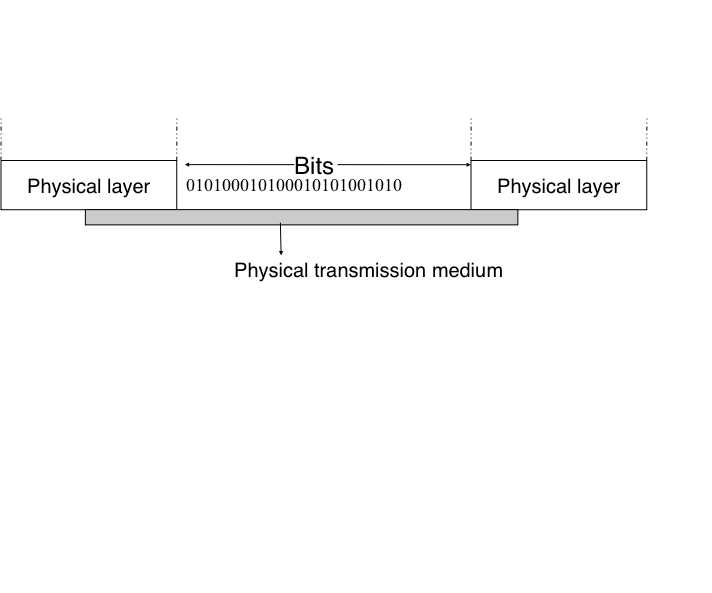

   The Physical layer

different types of medium

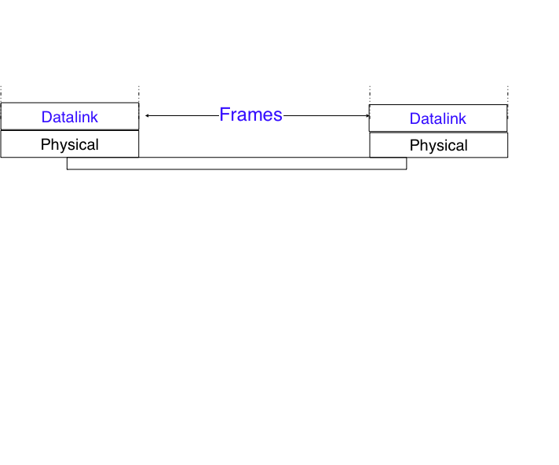

   The Datalink layer

connection-oriented versus connectionless

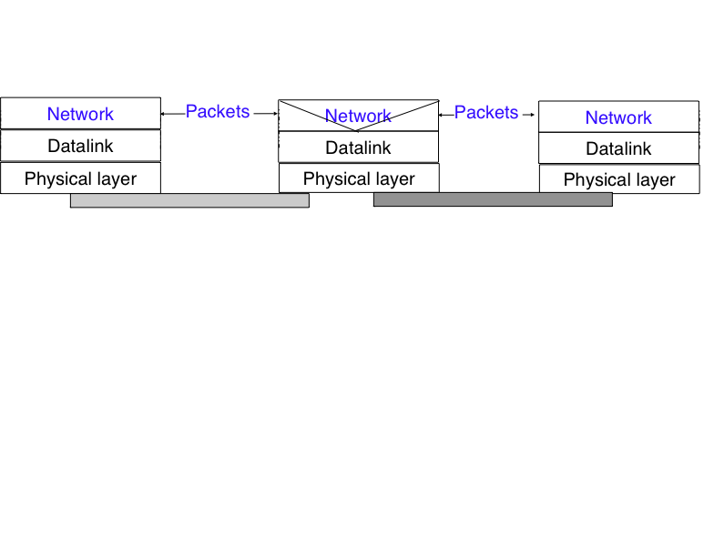

   The network layer

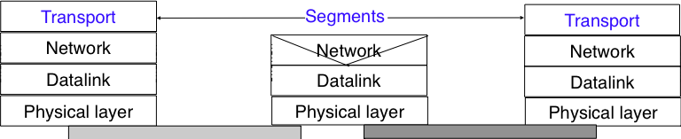

   The transport layer

.. figure:: png/intro-figures-031-c.png
   :align: center
   :scale: 50 

   The Application layer

The TCP/IP reference model
--------------------------

In contrast with OSI, the TCP/IP community did not spend a lot of effort at defining a detailed reference model and in fact the goals of the Internet architecture were only documented after TCP/IP had been deployed [Clark88]_. :rfc:`1122` that defines the requirements for Internet hosts mentions four different layers. Starting from the top, these are :

- the application layer
- the transport layer
- the internet layer which is equivalent to the network layer of our reference model
- the link layer which combines the functionnalities of the physical and datalink layers.

The OSI reference model
-----------------------

Compared to the five layers reference model explained above, the :term:`OSI` reference model defined in [X200]_ is divided in seven layers. The four lower layers are similar to the four lower layers described above. The OSI reference model refined the application layer by dividing it in three layers :

 - the Session layer. The Session layer contains the protocols and mechanisms that are necessary to organize and to synchronize the dialogue and manage the data exchange of presentation layer entities. While one of the main functions of the transport layer is to cope with the unreliability of the network layer, the session's layer objective is to hide the failure of transport-level connections to the upper layer higher. For this, the Session Layer provides services that allow to establish a session-connection, to support orderly data exchange (including mechanisms that allow to recover from the abrupt release of an underlying transport connection), and to release the connection in an orderly manner. 
 - the Presentation layer was designed to cope with the different ways of representing information on computers. There are many differences in the way computer store information. Some computers store integers as 32 bits field, others use 64 bits field and the same problem arises with floating point number. For textual information, this is even more complex with the many different character codes that have been used [#funicode]. The situation is even more complex when considering the exchange of structured information such as records. To solve this problem, the Presentation layer contains provides for common representation of the data transferred. The :term:`ASN.1` notation was designed for the Presentation layer. 
 - the Application layers that contains the mechanisms that do not fit in neither the Presentation nor the Session layer. The OSI Application layer was itself further divided in several generic service elements. 

.. sidebar:: Where are the missing layers in TCP/IP reference model ?

 The TCP/IP reference places the Presentation and the Session layers implictly in the Application layer. The main motivations for simplifying the upper layers in the TCP/IP reference model were pragmatic. Most Internet applications started as prototypes that evolved and were standardised later. Many of these applications assumed that they would be used to exchange information written in American English and for which the 7 bits US-ASCII character code was sufficient. This was the case for email, but as we'll see in the next chapter email was able to evolve to support different characters encodings. Some applications considered the different data representations explicitely. For example, :term:`ftp` contained mechanisms to convert a file from one format to another. On the other hand, many ISO specifications were developed by committees composed of people who did not all participate in actual implementations. ISO spent a lot of effort at analysing the requirements and defining a solution that meets all these requirements. Sometimes, the specification was so complex that it was difficult to implement it completely... 

 The work within ISO and ITU on protocols and services was 

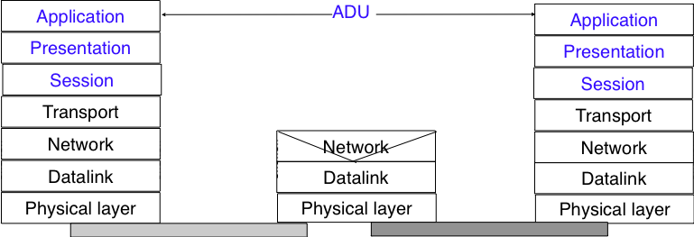

   The seven layers of the OSI reference model

Organisation of the document
----------------------------

This document is organised according to the :term:`TCP/IP` reference model and follows a top-down approach. Most of the first networking textbooks chose a bottom-up approach, i.e. they first explained all the electrical and optical details of the physical layer then moved to the datalink layer, ... This approach worked well during the infancy of computer networks and until the late 1990s. At that time, most students were not users of computer networks and it was useful to explain computer networks by building the corresponding protocols from the simplest in the physical layer up to the application layer. Today, all students are active users of Internet applications and starting to learn computer networking by looking at bits is not very motivating. Starting from [KuroseRoss09], many textbooks and teachers have chosen a top-down approach. This approach starts from the applications such as email and web that students already know and explores the different layers starting from the application layer. This approach works pretty well with today's students.

.. sidebar:: Top-down versus bottom-up

   The traditionnal bottom-up approach could be in fact considered as an engineering approach since it starts from the simple network that allows to exchange bits and explains how to combine different protocols and mechanisms to build the most complex applications. The top-down approach could on the other hand be considered as a scientific approach. Like biologists, it starts from an existing (man-built) system and explores it layer by layer.

Besides the top-down versus bottom-up organisation, computer networking books can aim at having an in-depth coverage of a small number of topics or at having a limited coverage of a wide range of topics. Covering a wide range of topics is interesting for introductory courses or for students who do not need a detailed knowledge of computer networks. It allows the students to learn a `little about everything` and then start from this basic knowledge later if they need to understand computer networking in more details. This books chose to cover in details a smaller number of topics than other textbooks. This is motivated by the fact that computer networks are often pushed to their limits and understanding the details of the main networking protocols is important to be able to fully grasp how a network behaves or extend it to provide innovative services. As the popular quote says, `the devil is in the details` and this quote is even more important in computer networking where the chane of a single bit may have huge consequences. In computer networks, understanding *all* the details is, unfortunately for some students, sometimes necessary.

The overall objective of the book is to explain the principles and the protocols used in computer networks and also provide the students with some intuition about the important practical issues that arise often. The course follows a hybrid problem-based learning (:term:`PBL`) approach. During each week, the students follow a 2 hours theoretical course that describes the principles and some of the protocols. They also receive a set of small problems that they need to solve in groups. These problems are designed to reinforce the student's knowledge but also to explore the practical problems that arise in real networks by allowing the students to perform experiments by writing prototype networking code. Most of the prototype code will be written in python_ by using the scapy_ packet injection/manipulation framework that will be described later.

.. sidebar:: Why opensource ?

   This book is being developed as an open-source book under a creative commons licence. This choice an an open-source license is motivated by two reasons. The first is that we hope that this will allow many students to use the book to learn computer networks and maybe other teachers will reuse, adapt and improve it. The second reason is that that the computer networking community heavily relies on open source implementations. In fact, there are high-quality and widely used open-source implementations for most of the protocols described in this book. This includes the TCP/IP implementations that are part of linux_, freebsd_ or the uIP_ stack running on 8bits controllers, but also servers such as bind_, unbound_, apache_ or sendmail_ and implementations of routing protocols such as xorp_ or quagga_ . Furthermore, the official specifications of most of the protocols that are described in this book have been developed within the IETF_ in an almost open-source manner. The IETF publishes its protocols specifications in the publicly available RFC_ and new proposals are described in `Internet drafts`_.  

The book is organised as follows. We first describe the application layer. Given the large number of Internet-based applications, it is of course impossible to cover them all in details. Instead we focus on three types of Internet-based applications. We first study the Domain Name System (DNS) and then explain some of the protocols involved in the exchange of electronic mail. The discussion of the application layer ends with a description of the key protocols of the world wide web and a brief explanation of peer-to-peer applications. All these applications rely on the transport layer. This is a key layer in today's networks as it contains all the mechanisms that are necessary to provide a reliable delivery of data over an unreliable network. We cover the transport layer by first developping a simple reliable transport layer protocol and then explain the details of the TCP, UDP and briefly SCTP protocols used in TCP/IP networks. After the transport layer, we focus on the network layer. This is also a very important layer as it is responsible for the delivery of packets from any source to any destination through intermediate routers. In the network layer, we describe the two possible organisations of the network layer and the routing protocols based on link-state and distance vectors. Then we explain in details the IPv4, IPv6, RIP, OSPF and BGP protocols that are actually used in today's Internet. The last part of the course is devoted to the datalink layer. More precisely, our focus in this part is on the Local area networks. We first describe the Medium Access Control mechanisms that allow multiple hosts to share a given transmission medium. We consider both opportunistic and deterministic techniques. We explain in details two types of LANs that are important from a deployment viewpoint today : Ethernet and WiFi. 

.. rubric:: Footnotes

.. [#open] open in ISO terms was in contrast with the proprietary protocol suites whose specification was not always available. The US government even mandated the usage of the OSI protocols (see :rfc:`1169`), but this was not sufficient to encourage all users to switch to the OSI protocol suite that was considered by many as too complex compared to other protocol suites.

.. [#unicode] There is now a rough consensus on using more and more the Unicode_ character format. Unicode can represent more than 100,000 different characters from the known written langages on Earth. Maybe one day all computers will only use Unicode to represent all their stored characters and Unicode could become the standard format to exchange characters, but we are not yet at this stage today. Even then, it would be necessary to decide which version of Unicode to use.

.. [#fiso-tcp] An interesting historical discussion of the OSI-TCP/IP debate may be found in [Russel06]_

.. [#fsynchro] Having perfectly synchronised clocks running at a high frequency is very difficult in practice. However, some physical layers introduce a feedback loop that allows the receiver's clock to synchronise itself automatically to the sender's clock. However, not all physical layers include this kind of synchronisation. 

.. include:: ../links.rst

