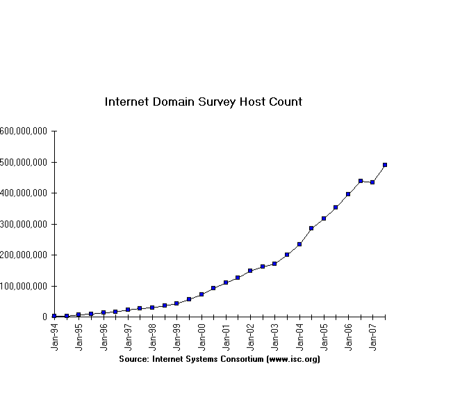
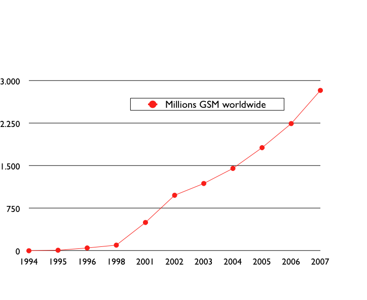
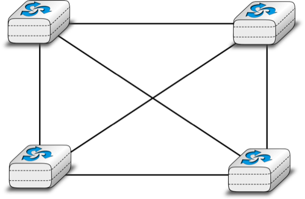
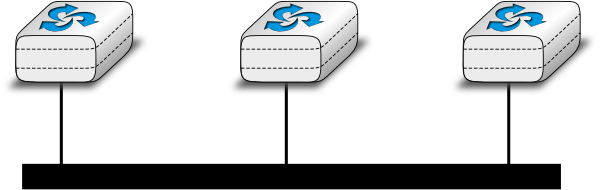
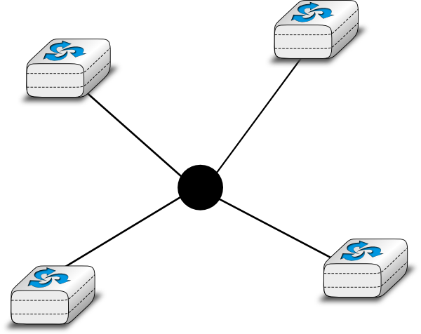
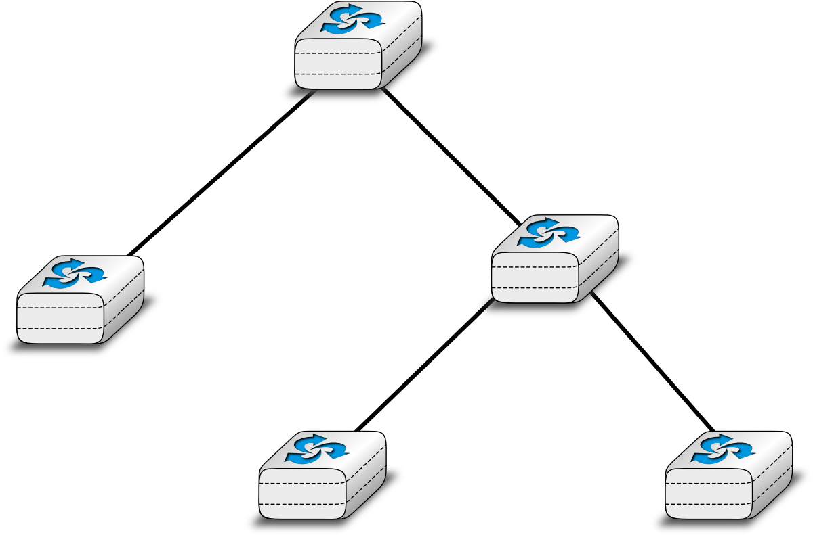
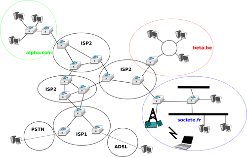
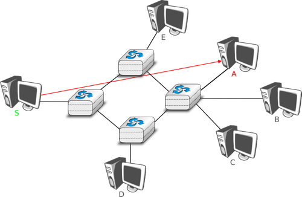
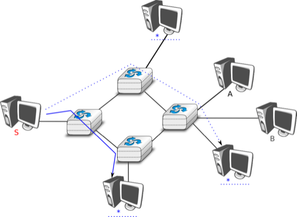

.. Copyright |copy| 2010 by Olivier Bonaventure
.. This file is licensed under a `creative commons licence <http://creativecommons.org/licenses/by-sa/3.0/>`_

============
Introduction
============

When the first computers were built during the second world war, they were expensive and isolated. However, after about twenty years, as their prices were decreasing, the first experiments began to connect computers together. In the early 1960s researchers including `Paul Baran`_, `Donald Davies`_ or `Joseph Licklider`_ published independently the first papers describing the idea of building computer networks [Baran]_ [Licklider1963]_ . Given the cost of computers, sharing them over a long distance was an interesting idea. In the US, the :term:`ARPANET` started in 1969 and continued until the mid 1980s [LCCD09]_. In France, `Louis Pouzin`_ developed the Cyclades network [Pouzin1975]_. More other research networks were built during the 1970s [Moore]_. At the same time, the telecommunication and the computer industry became interested in computer networks. The telecommunication industry bet on the X25_. The computer industry took a completely different approach by designing Local Area Networks (LAN). Many LAN technologies such as Ethernet or Token Ring were designed at that time. During the 1980s, the need to interconnect more and more computers lead most computer vendors to develop their own suite of networking protocols. Xerox developed XNS, DEC chose DECNet, IBM developed SNA, Microsoft introduced NetBIOS, Apple bet on Appletalk, ... In the research community, ARPANET was decommissioned and replaced by TCP/IP [LCCD09]_ and the reference implementation was developed inside BSD Unix [McKusick1999]_. Universities who were already running Unix could thus adopt TCP/IP easily and vendors of Unix workstations such as Sun or Silicon Graphics included TCP/IP in their variant of Unix. In parallel, the :term:`ISO`, with support from the governments, worked on developing an open [#fopen]_ suite of networking protocols. In the end, TCP/IP became the de facto standard that is used not only within the research community. During the 1990s and the early 2000s, the growth of the usage of TCP/IP continued and today proprietary protocols are seldom used. As shown by the figure below that provides the estimation of the number of hosts attached to the Internet, the Internet sustained a huge growth during the last 20+ years.

   Estimation of the number of hosts on the Internet

Recent estimations of the number of hosts attached to the Internet show a continuing growth since 20+ years. However, although the number of hosts attached to the Internet is high, it should be compared to the number of mobile phones that are in use today. More and more of these mobile phones will be connected to the Internet. Furthermore, thanks to the availability of TCP/IP implementations requiring limited resources such as uIP_ [Dunkels2003]_, we can expect to see a growth of TCP/IP enabled embedded devices.  

   Estimation of the number of mobile phones

Before looking at the services that are provided by computer networks, it is useful to agree on some terminology that is widely used in the networking literature. First, computer networks are often classified in function of the geographical area that they cover

- :term:`LAN` : a local area network typically interconnects hosts that are up to a few or maybe a few tens of kilometers apart. 
- :term:`MAN` : a metropolitan area network typically interconnects devices that are up to a few hundred kilometers apart
- :term:`WAN` : a wide area network interconnect hosts that can be located anywhere on Earth [#finterplanetary]_

Another classification of computer networks is based on their physical topology. In the following figures, physical links are represented as lines while boxes show computers or other types of networking equipment.

Computer networks are used to allow several hosts to exchange information between themselves. In order to allow any host to send messages to any other host in the network, the easiest solution is to organise them as a full-mesh with a direct and dedicated link between each pair of hosts. Such a physical topology is sometimes used, especially when high performance and high redundancy is required for a small number of hosts. However, it has two major drawbacks :

- for a network containing `n` hosts, each host must have `n-1` physical interfaces. In practice the number of physical interfaces on a node will limit the size of a full-mesh network that can be built
- for a network containing `n` hosts, :math:`\frac{n \times (n-1)}{2}` links are required. This is possible when there are a few nodes in the same room, but rarely when they are located several kilometers apart

   A Full mesh network

The second possible physical organisation, which is also used inside computers to connect different extension cards, is the bus. In a bus network, all hosts are attached to a shared medium, usually a cable through a single interface. When one host sends an electrical signal on the bus, the signal is received by all hosts attached to the bus. A drawback of bus-based networks is that if the bus is physically cut, then the network is split in two isolated networks.  For this reason, bus-based networks are sometimes considered to be difficult to operate and maintain especially when the cable is long and there are many places where it can break. Such as bus-based topology was used in the early Ethernet networks. 

   A network organised as a Bus

A third organisation of a computer network is a star topology. In such topologies, the hosts have a single physical interface and there is one physical link between each host and the center of the star. The node at the center of the star can be either a passive device such as an equipment that amplifies electrical signal or an active device such as an equipment that understands the format of the messages exchanged through the network. Of course, the failure of the central node implies the failure of the network. However, if one physical link fails (e.g. because the cable has been cut), then only one node is disconnected from the network. In practice, star-shaped networks are easier to operate and maintain than bus-shaped networks.

   A network organised as a Star

A fourth physical organisation is the Ring. As with the bus, each host has a single physical interface that connects it to the ring. Any signal sent by a host on the ring will be received by all hosts attached to the ring. From a redundancy viewpoint, a single ring is not the best solution as the signal travels only in one direction on the ring. If one of the links that compose the ring is cut, then the entire network fails. In practice, such rings have been used in local area networks, but nowadays they are often replaced by star-shaped networks. In metropolitan are networks, rings are often used to interconnect multiple locations. In this case, two parallel links composed of different cables are often used for redundancy. With such a dual ring, when one ring fails all the traffic can be switched quickly to the other ring.

.. figure:: svg/intro-figures-004-c.png
   :align: center
   :scale: 50 

   A network organised as a Ring

A fifth physical organisation of a network is the tree. Such networks are typically used when a large number of customers must be connected in a very cost-effective manner. Cable TV networks are often organised as trees.

   A network organised as a Tree
   
In practice, most real networks combine part of these topologies. For example, a campus network can be organised .. as a ring between the key buildings while smaller buildings are attached as a tree or a star to important buildings. Or an ISP network may have a full mesh of devices in the core of its network and trees to connect remote users.

Throughout this book, our objective will be to understand the protocols and mechanisms that are necessary for a network such as the one shown below.

   A simple internetwork

The figure above illustrates an internetwork, i.e. a network that interconnects other networks. Each network is illustrated as an ellipse containing a few devices. We will explain throughout the book the different types of devices and their respective role to enable all hosts to exchange information. We will also discuss how networks are interconnected together and the rules that guide these interconnections. We will also analyse how the bus, ring and mesh topologies are used to build real networks.

The last point of terminology that we need to discuss are the transmission modes. When exchanging information through a network, we often distinguish three transmission modes. In TV and radio transmission, :term:`broadcast` is often used to indicate a technology that sends a video or radio signal to all receivers in a given geographical area. Broadcast is sometimes used in computer networks, but only in local area networks where the number of recipients is limited.

The first and most widespread transmission mode is called :term:`unicast` . In the unicast transmission mode, information is sent by one sender to one receiver. Most of today's Internet applications rely on the unicast transmission mode. The example below shows a network with two types of devices : hosts (drawn as computers) and intermediate nodes (drawn as cubes). Hosts exchange information via the intermediate nodes. In the example below, when host `S` uses unicast to send information, its sends it via three intermediate nodes. Each of these nodes receives from its upstream node or host and, processes and forwards to its downstream node or host the information. This is called `store and forward` and we will see later that this concept is key in computer networks.

   Unicast transmission

A second transmission mode is :term:`multicast` transmission mode. This mode is used when the same information must be sent to a set of recipients. It was first used in LANs but became later supported in wide area networks. When a sender uses multicast to send information to `N` receivers, the sender sends a single copy of the information and the network nodes duplicate the information whenever necessary so that it can reach all the recipients that belong to the destination group.  

.. figure:: svg/intro-figures-008-c.png
   :align: center
   :scale: 10 

   Multicast transmission

To understand the importance of multicast transmission, consider source `S` that sends the same information to destinations `A`, `C` and `E`. With unicast, the same information passes three times on intermediate nodes `1` and `2` and twice on node `4`. This is a waste of resources on the intermediate nodes and on the links between them. With multicast transmission, host `S` sends the information to node `1` that forwards it downstream to node `2`. This node creates a copy of the receive information and sends one copy directly to host `E` and the other downstream to node `4`. Upon reception of the information, node `4` produces a copy and forwards one to node `A` and another to node `C`. Thanks to multicast, the same information can reach a large number of receivers while being sent only once on each link.

The last transmission mode is the :term:`anycast` transmission mode. It was initially defined in :rfc:`1542`. In this transmission mode, a set of receivers is identified. When a source sends information towards this set of receivers, the network ensures that the information is delivered to `one` receiver that belongs to this set. Usually the receiver that is closest to the source is the one that receives the information sent by this particular source. The anycast transmission mode is useful to ensure redundancy as when one of the receivers fails, the network will ensure that information will be delivered to another receiver belonging to the same group. However, in practice supporting the anycast transmission mode can be difficult.

   Anycast transmission

In the example above, the three hosts marked with `*` are part of the same anycast group. When host `S` sends information to this anycast group, the network ensures that it will reach one of the members of the anycast group. The dashed lines show a possible delivery via nodes `1`, `2` and `4`. A subsequent anycast transmission from host `S` to the same anycast group could reach the host attached to intermediate node `3` as shown by the plain line. An anycast transmission reaches a member of the anycast group that is chosen by the network in function of the current network conditions. 

.. rubric:: Footnotes

.. [#fopen] Open in ISO terms was in contrast with the proprietary protocol suites whose specification was not always publically available. The US government even mandated the usage of the OSI protocols (see :rfc:`1169`), but this was not sufficient to encourage all users to switch to the OSI protocol suite that was considered by many as too complex compared to other protocol suites.

.. [#finterplanetary] In this book, we focus on networks that are used on Earth. These networks sometimes include satellite links. Besides the network technologies that are used on Earth, researchers develop networking techniques that could be used between nodes located on different planets. Such an InterPlanetary Internet requires different techniques than the ones discussed in this book. See :rfc:`4838` and the references therein for information about these techniques. 

.. include:: services-protocols.rst
.. include:: referencemodels.rst
.. include:: organisation.rst

.. include:: ../links.rst

