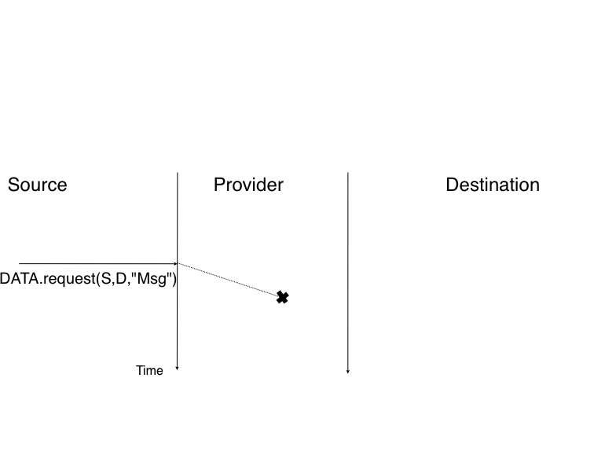
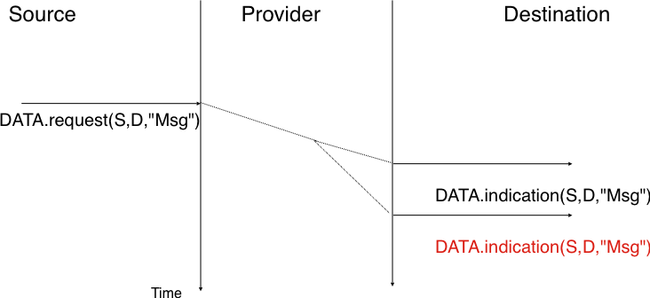
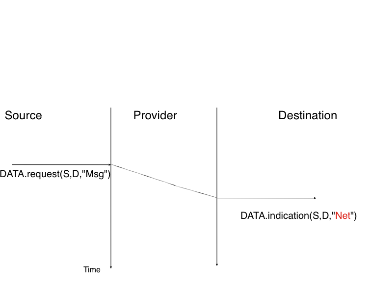
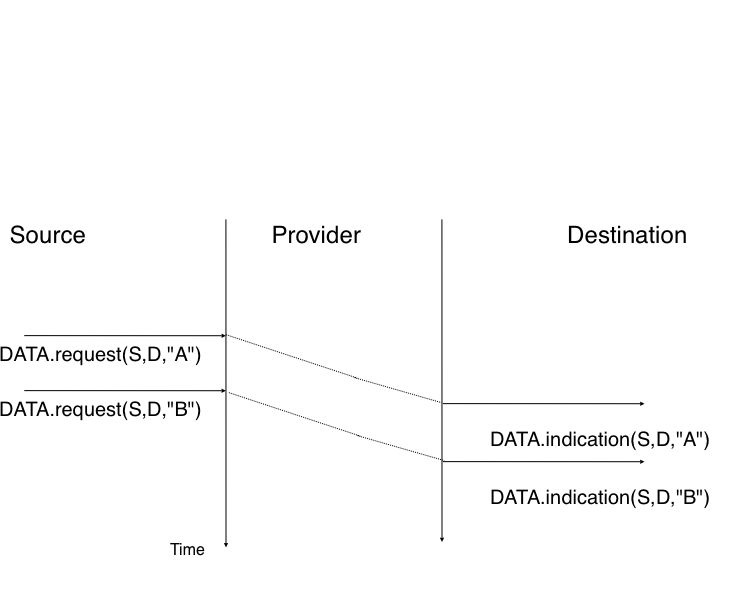
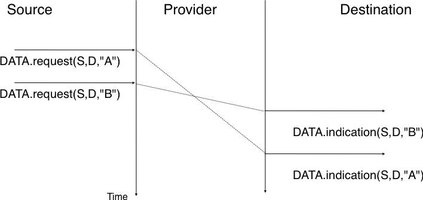
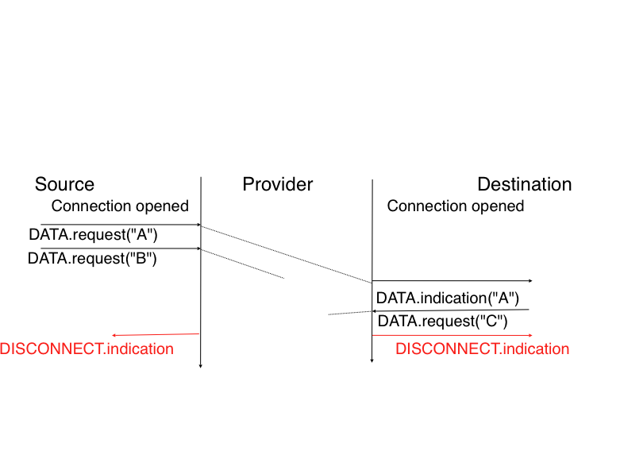

Services and protocols
######################

An important point to understand before studying computer networks is the different between a *service* and a *protocol*. 

To understand the difference between the two, it is useful to start from the real world. The traditional Post provides a service which is to deliver letters to recipients. The service can be more precisely 

In computer networks, the notion of service is more formally defined in [X200]_ . It can be better understood by considering a computer networks, what ever its size or complexity as a black box that provides a service to ` users`  as shown in the figure below. These users could be human users or processes running on a computer system. 

.. _fig-users:

.. figure:: png/intro-figures-014-c.png
   :align: center
   :scale: 50 

   Users and service provider

.. index:: address

Many users can be attached to the same service provider. Through this provider, each user must be able to exchange messages with any other user. To be able to deliver these messages, the service provider must be able to unambiguously identify each user. In computer networks, each user is identified by a unique `address`. We will discuss later how these addresses are built and used. At this point, and when considering unicast transmission, the important characteristics of these `addresses` is that they are unique. Two different users attached to the network cannot have the same address. 

.. index:: service access point

Throughout this book, we will define a service as a set of capabilities provided by a system (and its underlying elements) to its user. A user interacts with a service through a `service access point`. Note that as shown in the figure above, the users interact with one service provider. In practice, the service provider is distributed over several hosts, but these are implementation details that are not important at this stage. These interactions between a user an a service provider are expressed in [X200]_ by using primitives as show in the figure below. These primitives are an abstract representation of the interactions between a user and a service provider. In practice, these interactions could be implemented as system calls for example.

.. figure:: png/intro-figures-016-c.png
   :align: center
   :scale: 50 

   The four types of primitives

.. index:: service primitives

Four types of primitives are defined :

 - `X.request`. This type of primitive corresponds to a request issued by a user to a service provider
 - `X.indication`. This type of primitive is generated by the network provider and delivered to a user (often related to an earlier and remote `X.request` primitive)
 - `X.response`. This type of primitive is generated by a user to answer to an earlier `X.indication` primitive 
 - `X.confirm`. This type of primitive is delivered by the service provide to confirm to a user that a previous `X.request` has been successfully processed.

.. index: Connectionless service
.. index: Service Data Unit, SDU

Primitives can be combined to model different types of services. The simplest service in computer networks is the connectionless service. This service can be modelled by using two primitives :

 - `Data.request(source,destination,SDU)`. This primitive is issued by a user that specifies as parameters its (source) address, the address of the recipient of the message and the message itself. We will use `Service Data Unit` (SDU) to name the message that is exchanged transparently between two users of a service.
 - `Data.indication(source,destination,SDU)`. This primitive is delivered by a service provider to a user. It contains as parameters a `Service Data Unit` as well as the addresses of the sender and the destination users. 

.. index:: time-sequence diagram

When discussing about the service provided in a computer network, it is often useful to be able to describe the interactions between the users and the provider graphically. A frequently used representation is the time-sequence diagram. In this chapter and later throughout the book, we will often use diagrams such as the figure below. A time-sequence diagram describes the interactions between two users and a service provider. By convention, the users are represented in the left and right parts of the diagram while the service provider occupies the middle of the diagram. In such a time-sequence diagram, time flows from the top of the bottom of the diagram. Each primitive is represented by a plain horizontal arrow to which the name of the primitive is attached. The dashed lines are used to represent the possible relationship between two (or more) primitives. Such a diagram provides information about the ordering of the different primitives, but the distance between two primitives does not represent a precise amount of time.

.. index:: connectionless service

The figure below provides a representation of the connectionless service. The user on the left, having address `S`, issues a `Data.request` primitive containing SDU `M` that must be delivered by the service provider to destination `D`. The dashed line between the two primitives indicates that the `Data.indication` primitive that is delivered to the user on the right corresponds to the `Data.request` primitive sent by the user on the left.

.. figure:: png/intro-figures-017-c.png
   :align: center
   :scale: 50 

   A simple connectionless service

.. index:: reliable connectionless service, unreliable connectionless service

There are several possible implementations of the connectionless service that we will discuss later in this book. Before studying these realisations, it is useful to discuss the possible characteristics of the connectionless service. A `reliable connectionless service` is a service where the service provider guarantees that all SDUs submitted in `Data.requests` by a user will be eventually delivered to their destination. Such a service would be very useful for users, but guaranteeing perfect delivery is difficult in practice. For this reason, computer networks usually support an `unreliable connectionless service`.

An `unreliable connectionless` service may suffer from various types of problems compared to a `reliable connectionless service`. First, an `unreliable connectionless service` does not guarantee the delivery of all SDUs. This can be expressed graphically by using the time-sequence diagram below.

   An unreliable connectionless service may loose SDUs

In practice, an `unreliable connectionless service` will usually deliver a large fraction of the SDUs. However, since the delivery of SDUs is not guaranteed, the user must be able to recover from the loss of any SDU. A second imperfection that may affect an `unreliable connectionless service` is that it may duplicate SDUs. Some unreliable connectionless service providers may deliver twice or even more a SDU sent by a user. This is illustrated by the time-sequence diagram below.

   An unreliable connectionless service may duplicate SDUs

Finally, some unreliable connectionless service providers may deliver to a destination a different SDU than the one that was provided in the `Data.request`. This is illustrated in the figure below. 

   An unreliable connectionless service may deliver erroneous SDUs

When a user interacts with a service provider, it must know precisely the limitations of the underlying service to be able to overcome any problem that may arise. This requires a precise definition of the characteristics of the underlying service.

.. index:: ordering of SDUs

Another important characteristic of the connectionless service is whether it preserves the ordering of the SDUs sent by one user. From the user's viewpoint, this is often a desirable characteristic. This is illustrated in the figure below.

   A connectionless service that preserves the ordering of SDUs sent by a given user

However, many connectionless services, and in particular the unreliable connection services do not guarantee that they will always preserve the ordering of the SDUs sent by each user. This is illustrated in the figure below.

   An connectionless service that does not preserve the ordering of SDUs sent by a given user

.. index:: confirmed connectionless service

The `connectionless service` is widely used in computer networks as we will see in the next chapter. Several variations to this basic service have been proposed. One of these is the `confirmed connectionless service`. This service uses a `Data.confirm` primitive in addition to the classical `Data.request` and `Data.indication` primitives. This primitive is issued by the service provider to confirm to a user the delivery of a previously sent SDU to its recipient. Note that, like the registered service of the post office, the `Data.confirm` only indicates that the SDU has been delivered to the destination user. The `Data.confirm` primitive does not indicate whether the SDU has been processed by the destination user. This `confirmed connectionless service` is illustrated in the figure below.

.. figure:: png/intro-figures-018-c.png
   :align: center
   :scale: 50 

   A confirmed connectionless service

.. index:: connection-oriented service

The `connectionless service` that we have described earlier is frequently used by users who need to exchange small SDUs. Users who need to either send or receive several different and potentially large SDUs or who need structured exchanges often prefer the `connection-oriented service`. 

.. index:: connection establishment

An invocation of the `connection-oriented service` is divided in three phases. The first phase is the establishment of a `connection`. A `connection` is a temporary association between two users through a service provider. Several connections may exist at the same time between any pair of users. Once established, the connection is used to transfer SDUs. `Connections` usually provide one bidirectional stream that supports the exchange of SDUs between the two users that are associated through the `connection`. This `data transfer` phase is the second phase of a connection. The third phase is the termination of the connection. Once the users have finished to exchange SDUs, they request the service provider to terminate the connection. As we'll see later, there are also some cases where the service provider may need to terminate itself a connection.

The establishment of a connection can be modelled by using four primitives : `Connect.request`, `Connect.indication`, `Connect.response` and `Connect.confirm`. The `Connect.request` primitive is used to request the establishment of a connection. The main parameter of this primitive is the `address` of the destination user. The service provider delivers a `Connect.indication` primitive to inform the destination user of the connection attempt. If it accepts to establish a connection, it responds with a `Connect.response` primitive. At this point, the connection is considered to be open and the destination user can start to send SDUs over the connection. The service provider processes the `Connect.response` and will deliver a `Connect.confirm` to the user who initiated the connection. The delivery of this primitive terminates the connection establishment phase. At this point, the connection is considered to be open and both users can send SDUs. A successful connection establishment is illustrated below.

.. figure:: png/intro-figures-019-c.png
   :align: center
   :scale: 50 

   Connection establishment

The example above shows a successful connection establishment. However, in practice not all connections are successfully established. A first reason is that the destination user may not agree, for policy or performance reasons, to establish a connection with the initiating user at this time. In this case, the destination user responds to the `Connect.indication` primitive by a `Disconnect.request` primitive that contains a parameter to indicate why the connection has been refused. The service provider will then deliver a `Disconnect.indication` primitive to inform the initiating user. A second reason is when the service provider is unable to reach the destination user. This might happen because the destination user is not currently attached to the network or due to congestion. In these cases, the service provider responds to the `Connect.request` with a `Disconnect.indication` primitive whose `reason` parameter contains additional information about the failure of the connection.

.. figure:: png/intro-figures-020-c.png
   :align: center
   :scale: 50 

   Two types of rejection for a connection establishment attempt

.. index:: message-mode data transfer

Once the connection has been established, the service provider supplies two data streams to the communicating users. The first data stream can be used by the initiating user to send SDUs. The second data stream allows the responding user to send SDUs to the initiating user. The data streams can be organised in different ways. A first organisation is the `message-mode` transfer. With the `message-mode` transfer, the service provider guarantees that one and only one `Data.indication` will be delivered to the endpoint of the data stream for each `Data.request` primitive issued by the other endpoint. The `message-mode` transfer is illustrated in the figure below. The main advantage of the `message-transfer` mode is that the recipient receives exactly the SDUs that were sent by the other user. If each SDU contains a command, the receiving user can process each command as soon as it receives a SDU.

.. figure:: png/intro-figures-021-c.png
   :align: center
   :scale: 50 

   Message-mode transfer in a connection oriented service

.. index:: stream-mode data transfer

Unfortunately, the `message-mode` transfer is not widely used on the Internet. On the Internet, the most popular connection-oriented service transfers SDUs in `stream-mode`. With the `stream-mode`, the service provider supplies a byte stream that links the two communicating user. The sending user sends bytes by using `Data.request` primitives that contain groups of bytes as SDUs. The service provider delivers SDUs containing consecutive bytes to the receiving user by using `Data.indication` primitives. The service provider ensures that all the bytes sent at one end of the stream are delivered correctly in the same ordering at the other endpoint. However, the service provider does not attempt to preserve the boundaries of the SDUs. There is no relation enforced by the service provider between the number of `Data.request` and the number of `Data.indication` primitives. The `stream-mode` is illustrated in the figure below. In practice, a competence of the utilisation of the `stream-mode` is that if the users want to exchange structured SDUs, they will need to provide the mechanisms that allow the receiving user to delineate these SDUs in the byte stream that it receives.

.. figure:: png/intro-figures-022-c.png
   :align: center
   :scale: 50 

   Stream-mode transfer in a connection oriented service

.. index:: abrupt connection release

The third phase of a connection is when it needs to be released. As a connection involves three parties (two users and a service provider), any of them can request the termination of the connection. Usually, connections are terminated upon request of one user. However, sometimes the service provider may be forced to terminate a connection. This can be due to lack of resources inside the service provider or because one of the users is not reachable anymore through the network. In this case, the service provider will issue `Disconnect.indication` primitives to both users. These primitives will contain as parameter some information about the reason for the termination of the connection. As illustrated in the figure below, when a service provider is forced to terminate a connection it cannot guarantee that all SDUs sent by each user have been delivered to the other user. This connection release is said to be abrupt as it can cause losses of data.

   Abrupt connection release initiated by the service provider

An abrupt connection release can also be triggered by one of the users. If a user needs, for any reason, to terminate a connection quickly, it issues a `Disconnect.request` primitive and requests an abrupt release. The service provider will process the request, stop the two data streams and deliver the `Disconnect.indication` to the remote user as soon as possible. As illustrated in the figure below, this abrupt connection release may cause losses of SDUs.

.. figure:: png/intro-figures-023-c.png
   :align: center
   :scale: 50 

   Abrupt connection release initiated by a user

.. index:: graceful connection release

To ensure a reliable delivery of the SDUs sent by each user over a connection, we need to consider the two streams that compose a connection as independent. A user should be able to release the stream that it uses to send SDUs once it has sent all the SDUs that it planned over this connection, but still continue to receive SDUs over the other stream. This `graceful` connection release is usually performed as shown in the figure below. One user issues a `Disconnect.request` primitives to its provider once it has issued all its `Data.request` primitives. The service provider will wait until all `Data.indication` have been delivered to the receiving user before issuing the `Disconnnect.indication` primitive. This primitive informs the receiving user that he will not receive anymore SDUs over this connection, but he is still able to issue `Data.request` primitives on the stream in the opposite direction. Once the user has issued all his `Data.request` primitives, it issues a `Disconnnect.request` primitive to request the termination of the remaining stream. The service provider will process the request and deliver the corresponding `Data.indication` to the other user once it has delivered all the pending `Data.indication` primitives. At this point, the two streams have been released successfully and the connection is completely closed.

.. figure:: png/intro-figures-024-c.png
   :align: center
   :scale: 50 

   Graceful connection release

.. sidebar:: Reliability of the connection-oriented service

 An important point to discuss about the connection-oriented service is its reliability. In practice, a `connection-oriented` can only guarantee the correct delivery of all SDUs if the connection has been released gracefully. This implies that while the connection is active, there is no guarantee for the actual delivery of the SDUs exchanged as the connection may need to be released abruptly at any time.

.. include:: ../links.rst
