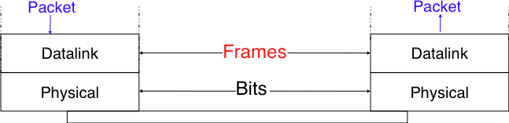
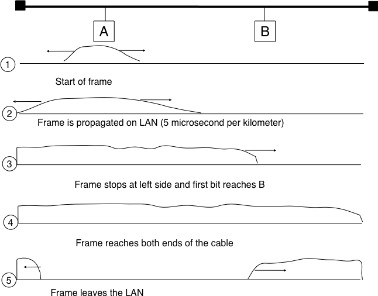
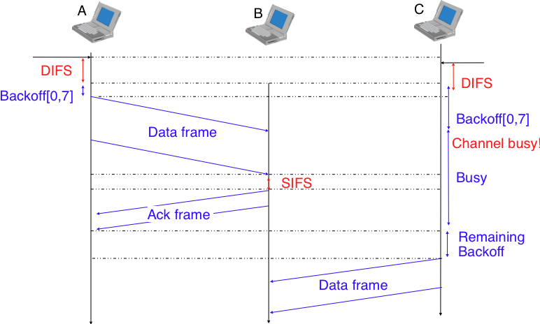
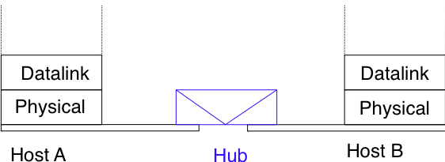
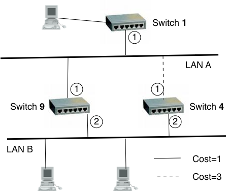

==============================================
The datalink layer and the Local Area Networks
==============================================

The datalink layer is the lowest layer of the reference model that we discuss in details. As mentioned previously, there are two type of datalink layers. The first datalink layers that appeared are the ones that are used on point-to-point links between endsystems that are directly connected by a physical link. We will briefly discuss one of these datalink layers in this chapter. The second type of datalink layers are the ones used in Local Area Networks. The main difference between the point-to-point and the LAN datalink layers is that the latter need to regulate the access to the Local Area Network which is usually a shared medium. 
This chapter is organised as follows. We first discuss the principles and of datalink layer and the service that it uses from the physical layer. Then we describe in more details several Medium Access Control algorithms that are used by Local Area Networks to regulate the access to the shared medium. Finally we discuss in details several important datalink layer technologies with an emphasis on Ethernet.

Principles
##########

The datalink resides above and uses the service provided by the physical layer. Although there are many different implementations of the physical layer from a technological viewpoint, they all provide a service that enables the datalink layer to send and receive bits to/from another directly connected endsystem. The datalink layer receives packets from the network layer. Two datalink layer entities exchange `frames`. As explained in the previous chapter, most datalink layer technologies impose limitations on the size of the frames. Some technologies impose only a maximum frame size, others enforce both minimum and maximum frames sizes and finally some technologies only support a single frame size. In the latter case, the datalink layer will usually include an adaptation sublayer to allow the network layer to send and receive variable-length packets. This adaptation layer may include fragmentation and reassembly mechanisms.

   
   The datalink layer and the reference model

The physical layer service allows to send and receive bits. Compared to the requirements of the applications, it is usually far from imperfect as explained in the introduction :

 - The Physical layer may change, e.g. due to electromagnetic interferences, the value of a bit being transmitted
 - the Physical layer may deliver `more` bits to the receiver than the bits sent by the sender
 - the Physical layer may deliver `fewer` bits to the receiver than the bits sent by the sender

The datalink layer must be able to allow endsystems to exchange frames containing packets despite of these limitations. On point-to-point links and Local Area Networks, the first problem to be solved is how to encode a frame as a sequence of bits so that the receiver can easily recover the received frame despite the limitations of the physical layer.

.. index:: framing

If the physical layer was perfect, the problem would be very simple. The datalink layer would simply need to define how to encode each frame as a sequence of consecutive bits. The receiver would then be able to easily extract the frames from the received bits. Unfortunately, the imperfections of the physical layer make this framing problem slightly more complex. Several solutions have been proposed and are used in practice in different datalink layer technologies.

Framing
=======

The `framing` problem can be phrased as : "`How does a sender encodes frames so that the receiver can efficiently extract them from the stream of bits that it receives from the physical layer`". 

A first solution to solve the framing problem is to require the physical layer to remain idle for some time after the transmission of each frame. These idle periods can be detected by the receiver and server as a marker to delineate frame boundaries. Unfortunately, this solution is not sufficient for two reasons. First, some datalink layers cannot remain idle and need to always transmit bits. Second, inserting an idle period between frames decrease the maximum bandwidth that can be achieved by the datalink layer.

.. index:: Manchester encoding

Some physical layers provide an alternative to this idle period. All physical layers are able to send and receive physical symbols that represent values `0` and `1`. However, tor various reasons that are outside the scope of this chapter, several physical layers are able to exchange other physical symbols as well. For example, the Manchester encoding used in several physical layers allows to send four different symbols. The Manchester encoding is a differential encoding scheme in which time is divided in fixed-length periods. Each period is divided in two halves and two different voltage levels can  be applied. To send a symbol, the sender must set one of these two voltage levels during each half period. To send a `1` (resp. `0`), the sender must set a high (resp. low) voltage during the first half of the period and a low (resp. high) voltage during the second half. This encoding ensures that there will be a transition at the middle of each period and allows the receiver to synchronise its clock to the sender's clock. Besides, the encodings for `0` and `1`, the Manchester encoding also supports two additional symbols : `InvH` and `InvB`  where the same voltage level is used during the two half periods. By definition, these two symbols cannot appear in the content of a frame which is only composed of `0` and `1`. Some technologies use these special symbols as markers at the beginning or end of frames.

.. figure:: png/lan-fig-006-c.png
   :align: center
   :scale: 70
   
   Manchester encoding

.. index:: bit stuffing, stuffing (bit)

Multi-symbol encodings cannot be used by all physical layers and a generic solution that can be used with any physical layer that is able to transmit and receive only `0` and `1` is required. This generic solution is called `stuffing` and two variants exist : `bit stuffing` and `character stuffing`. To enable a receiver to easily delineate the frame boundaries, these two techniques reserve special bit strings as frame boundary markers and encode the frames so that these special bit strings do not appear inside the frames.

`Bit stuffing` reserves the `01111110` bit string as the frame boundary marker and ensures that there will never be six consecutive `1` bits transmitted inside a frame. With bit stuffing, a frame is sent as follows. First, the sender transmits the marker, i.e. `01111110`. Then, the sender sends all the bits of the frame and inserts an additional bit set to `0` after each sequence of five consecutive `1` bits. This ensures that the sent frame never contains a sequence six consecutive bits set to `1`. As a consequence, the marker pattern does not appear inside the frame sent. The marker is also sent at the end of the frame. The receiver performs the opposite to decode the received frame. It first detects the beginning of the frame with the `01111110` marker. Then, it processes the received bits and counts the number of consecutive bits set to `1`. If a `0` follows five consecutive bits set to `1`, this bit is removed as it was inserted by the sender. If a `1` follows five consecutive bits sets to `1`, it indicates a marker if it is followed by a bit set to `0`.

For example, consider the transmission of packet `0110111111111111111110010`. Then sender will first send the `01111110` marker followed by `011011111`. After these five consecutive bits set to `1`, it inserts a bit set to `0` followed by `11111`. A new `0` is inserted, followed by `11111`. A new `0` is inserted followed by the end of the frame `110010` and the `01111110` marker.

`Bit stuffing` increases the number of bits required to transmit a given frame. The worst case for bit stuffing is of course a long sequence of bits set to `1` inside the frame. If transmission errors occur, stuffed bits or markers can be in error. In these cases, the frame affected by the error and possibly the next frame will be wrongly decoded by the receiver, but it will be able to resynchronise itself at the next valid marker. 

.. index:: character stuffing, stuffing (character)

`Bit stuffing` can be easily implemented in hardware. However, implementing it in software is more complex. As software implementations prefer to process characters than bits, software-based datalink layers usually use `character stuffing`. This technique operates on frames that contain an integer number of characters. Some characters are used as markers to delineate the frame boundaries. Many `character stuffing` techniques use the `DLE`, `STX` and `ETX` characters of the ASCII character set. `DLE STX` (resp. `DLE ETX`) is used to mark the beginning (end) of a frame. When transmitting a frame, the sender adds a `DLE` character after each transmitted `DLE` character. This ensures that none of the markers can appear inside the transmitted frame. The receiver detects the frame boundaries and remove the second `DLE` when it receives two consecutive `DLE` characters. For example, to transmit frame `1 2 3 DLE STX 4`, a sender will first send `DLE STX` as a marker, followed by `1 2 3 DLE`. Then, the sender transmits an additional `DLE` character followed by `STX 4` and the `DLE ETX` marker.

`Character stuffing` like bit stuffing increases the length of the transmitted frames. For `character stuffing`, the worst frame is a frame containing many `DLE` characters. When transmission errors occur, the receiver may incorrectly decode one or two frames (e.g. if the errors occur in the markers). However, it will be able to resynchronise itself with the next correctly received markers.

In practice, datalink layer protocols combine one of these techniques with a length indication in the frame header and a checksum or CRC. The checksum/CRC is computed by the sender and placed in the frame before applying bit/character stuffing.

Medium Access Control
=====================

Point-to-point datalink layers need to select one of the framing techniques described above and optionally add retransmission algorithms such as those explained for the transport layer to provide a reliable service. Datalink layers for Local Area Networks face two additional problems. A LAN is composed of several hosts that are attached to the same shared physical medium. From a physical layer viewpoint, a LAN can be organised in four different ways :

 - a bus-shaped network where all hosts are attached to the same physical cable
 - a ring-shaped where all hosts are attached to an upstream and a downstream node so that the entire network forms a ring
 - a star-shaped network where all hosts are attached to the same device
 - a wireless network where all hosts can send and receive frames by using radio signals

These four basic physical organisations of Local Area Networks are shown graphically in the figure below. We will first focus on one physical organisation at a time and will discuss later in the next section how to build networks combining several of these building blocks.

.. figure:: png/lan-fig-007-c.png
   :align: center
   :scale: 70
   
   Bus, ring and star-shaped Local Area Network 

.. index:: collision

The common problem among all these network organisations is how to efficiently share the access to the Local Area Network. If two devices send a frame at the same time, the two electrical, optical or radio signals that corresponds to these frames will appear at the same time on the transmission medium and a receiver will not be able to decode either frame. Such simultaneous transmissions are called `collisions`. A `collision` may involve frames transmitted by two or more devices attached to the Local Area Network. Collisions are the main cause of errors in wired Local Area Networks. All Local Area Network technologies rely on a `Medum Access Control` algorithm to regulate the transmissions to either minimise or avoid collisions. There are two broad families of `Meidum Access Control` algorithms :

 #. `Deterministic` or `pessimistic` MAC algorithms. These algorithms assume that collisions are a very severe problem and that they must be completely avoided. These algorithms ensure that at any time at most one device is allowed to send a frame on the LAN. This is usually achieved by using a distributed protocol that allows devices to agree on which device can transmit at any time. A deterministic MAC algorithm ensures that no collision will happen, but there is some overhead in regulating the transmission of all the devices attached to the LAN.
 #. `Stochastic` or `optimistic` MAC algorithms. These algorithm assume that collisions are part of the normal operation of a Local Area Network. They aim at minimising the number of collisions, but they do not try to avoid all collisions. Stochastic algorithms are usually easier to implement than deterministic ones.

We'll first discuss a simple deterministic MAC algorithm and then we'll describe several important optimistic algorithms before coming back to a distributed and deterministic MAC algorithm.

Static allocation methods
-------------------------

A first solution to share the available resources among all the devices attached to one Local Area Network is to define, `a priori`, the distribution of the transmission resources to the different devices. If `N` devices need to share the transmission capacities of a LAN operating at `b` Mbps, each device could be allocated a bandwidth of :math:`\frac{b}{N}` Mbps. 

.. index:: Frequency Division Multiplexing, FDM

Limited resources need to be shared in other environments than Local Area Networks. Since the first radio transmissions by `Marconi <http://en.wikipedia.org/wiki/Guglielmo_Marconi>` more than one century ago, many applications that exchange information through radio signals have been developed. Each radio signal is an electromagntic wave whose power is centered around a given frequency. The radio spectrum corresponds to frequencies ranging between roughly 3 KHz and 300 GHz. Frequency allocation plans negotiate between governements reserve most frequency ranges for specific applications such as broadcast radio, broadcast television, mobile communications, aeronautical radio navigation, amateur radio, satellite, ... Each frequency range is then subdivided in channels and each channel can be reserved for a given application, e.g. a radio broadcaster in a given region.

.. index:: Wavelength Division Multiplexing, WDM

`Frequency Division Multiplexing` (FDM) is an allocation scheme where a frequency is allocated to each device attached to the shared medium. As each device uses a different transmission frequency, collisions cannot occur. In optical networks, a variant of FDM called `Wavelength Division Multiplexing` (WDM) is used. An optical fiber can transport light at different wavelengths without interference. With WDM, a different wavelength is allocated to each of the devices that share the same optical fiber.

.. index:: Time Division Multiplexing

`Time Division Multiplexing` (TDM) Is a static bandwidth allocation method that was initially defined for the telephone network. In the fixed telephone network, a voice conversation is usually transmitted as a 64 Kbps signal. Thus, a telephone conservation generates 8 KBytes per second or one byte every 125 microsecond. Telephone conversations often need to be multiplexed together on a single line. For example, in Europe, thirty 64 Kbps voice signals are multiplexed over a single 2 Mbps (E1) line. This is done by using  `Time Division Multiplexing` (TDM). TDM divides the transmission opportunities in slots. In the telephone network, a slot corresponds to 125 microsecond. A position inside each slot is reserved for each voice signal. The figure below illustrates TDM on a link used to carry four voice conversations. The vertical lines represent the slot boundaries and the letters the different voice conversations. One byte from each voice conversation is sent during each 125 microsecond slot. The byte corresponding to a given conversation is always sent at the same position in each slot.

.. figure:: png/lan-fig-012-c.png
   :align: center
   :scale: 70
   
   Time-division multiplexing 

TDM as shown above can be completely static, i.e. the same conversations always share the link, or dynamic. In the latter case, the two endpoints of the link will exchange signalling messages that specify which conversation uses which byte inside each slot. Thanks to these signalling messages, it is possible to dynamically add and remove voice conversations from a given link. 

TDM and FDM are widely used in telephone networks to support fixed bandwidth conversations. Using them in Local Area Networks that support computers would probably be inefficient. Computers usually do not send information at a fixed rate. Instead, they often have a on-off behaviour. During the on period, the computer tries to send at the highest possible rate, e.g. to transfer a file. During the off period, which is often much longer than the on period, the computer does not transmit any packet. Using a static allocation for computers would lead to huge inefficiencies as they would only be able to transmit at :math:`\frac{1}{N}` of the total bandwidth during their on period despite the fact that the other computers are in their off period and thus do not need to transmit any information. The dynamic MAC algorithms discussed in the remainder of this chapter aim at solving this problem.

ALOHANet
--------

.. index:: packet radio

In the 1960s computers were mainly mainframes with a few dozens of terminals attached to them. These terminals were usually in the same building as the mainframe and were directly connected to it. In some cases, the terminals were installed in remote locations and connected through modems over dial-up lines. At the university of Hawaii¯, this organisation was not possible. Instead of using telephone lines to connect the distant terminals, they developed the first `packet radio` technology [Abramson1970]_. Until then, computer networks were built on top of either the telephone network or physical cables. AlohaNet showed that it was possible to use radio signals to interconnect computers.

.. index:: ALOHA

The first version of ALOHAnet, described in [Abramson1970]_, operated as follows. First, the terminals and the mainframe exchanged fixed-length frames composed of 704 bits. Each frame contained 80 8-bits characters, some control bits and parity information to detect transmission errors. Two channels in the 400 MHz range were reserved for the operation of ALOHANet. The first channel was used by the mainframe to send frames to all terminals. The second channel was shared among all terminals to send frames to the mainframe. As all terminals share the same transmission channel, there is a risk of collision. To deal with this problem and also transmission errors the mainframe verified the parity bits of the received frame and sent an acknowledgement on its channel for each correctly received frame. The terminals on the other hand had to retransmit the unacknowledged frames. As for TCP, retransmitting these frames immediately upon expiration of a fixed timeout is not a good approach as several terminals may retransmit their frames at the same time leading to a network collapse. A better approach, but still far from perfect, is for each terminal to wait a random amount of time after the expiration of its retransmission timeout. This avoids synchronisation among multiple retransmitting terminals. 

The pseudo-code below show the operation of an ALOHANet terminal. We use this python syntax for all Medium Access Control algorithms described in this chapter. The algorithm is run for each new frame that needs to be transmitted. It attempts to transmit a frame at most `max` times (`while loop`). Each transmission attempt is performed as follows. First, the frame is sent. Each frame is protected by a timeout. Then the terminal waits for either a valid acknowledgement frame or the expiration of its timeout. If the terminal receives an acknowledgement, the frame has been delivered correctly and the algorithm terminates. Otherwise, the terminal waits for a random time and attempts to retransmit the frame. 

::
 
 N=1
 while N<= max :
    send(frame)
    wait(ack on return channel or timeout)
    if ack on return channel:
       	break  # transmission was successful
    else:
	# timeout 
	wait(random time)
	N=N+1
  else:		
    # Too many transmission attempts

[Abramson1970]_ analysed the performance of ALOHANet under particular assumptions and found that ALOHANet worked well when the channel was lightly loaded. In this case, the frames are rarely retransmitted and the `channel traffic`, i.e. the total number of (correct and retransmitted) frames transmitted per unit of time is close to the `channel utilization`, i.e. the number of correctly transmitted frames per unit of time. Unfortunately, the analysis also reveals that the `channel utilization` reaches its maximum at :math:`\frac{1}{2 \times e}=0.186` times the channel bandwidth. At higher utilization, ALOHANet becomes unstable and the network collapses due to collided retransmissions.

.. sidebar:: Amateur packet radio

 Packet radio technologies have evolved in various directions since the first experiments performed at the University of Hawaii. The Amateur packet radio service developed by amateur radio operators is of these descendants of ALOHANet. Many amateur radio operators are very interested in new technologies and they often spend countless hours to develop new antennas or transceivers. When the first personal computers appeared, several amateur radio operators designed radio modems and their own datalink layers protocols [KPD1985]_ [BNT1997]_ . This network grew and it was possible by using only packet radio relays to connect to servers in several European countries. Some amateur radio operators also developed TCP/IP protocol stacks that were used over the packet radio service. Some parts of the `amateur packet radio network <http://www.ampr.org/>`_ is connected to the global Internet and uses the `44.0.0.0/8`. 

.. index:: slotted ALOHA

Many improvements to ALOHANet were proposed since the publication of [Abramson1970]_ and this technique or some of its variants are still found in wireless networks today. The slotted technique proposed in [Roberts1975]_ is important because it shows that a simple modification can significantly improve the channel utilization. Instead of allowing all terminals to transmit at [Roberts1975]_ Proposed to divide time in slots and allow the terminals to transmit only at the beginning of each slot. Each slot corresponds to the time required to transmit one fixed size frame. In practice, these slots can be imposed by a single clock that is received by all terminals. In ALOHANet, it could have been located on the central mainframe. The analysis in [Roberts1975]_ reveals that this simple modification improved the channel utilization by a factor of two. 
	

.. index:: CSMA, Carrier Sense Multiple Access

Carrier Sense Multiple Access
-----------------------------

ALOHA and slotted ALOHA can be easily implemented. Unfortunately, they can only be used in networks that are very lightly loaded. Designing a network for a very low utilisation is possible, but it clearly increases the cost of the network. To overcome these problems, many Medium Access Control mechanisms have been proposed. These mechanisms improve the channel utilization. Carrier Sense Multiple Access (CSMA) is a significant improvement compared to ALOHA. CSMA requires all nodes to listen to the transmission channel to verify that it is free before transmitting a frame [KT1975]_. When a node sense the channel to be busy, it defers its transmission until the channel becomes free again. The pseudo-code below provides a more detailed description of the operation of CSMA. 

.. index:: persistent CSMA, CSMA (persistent)

::
 
 N=1
 while N<= max :
    wait(channel becomes free)
    send(frame)
    wait(ack or timeout)
    if ack :
       	break  # transmission was successful
    else :
	# timeout 
	N=N+1
  else:		
    # Too many transmission attempts

The above pseudo-code is often called `persistent CSMA` [KT1975]_ as the terminal will continuously listen to the channel and transmit its frame as soon as the channel becomes free. Another important variant of CSMA is the `non-persistent CSMA` [KT1975]_. The main difference between persistent and non-persistent CSMA described in the pseudo-code below is that a non-persistent CSMA node does not continuously listens to the channel to determine when it becomes free. When non-persistent CSMA terminal senses the transmission channel to be busy, it waits for a random time before sensing the channel idle. This improves the channel utilization compared to persistent CSMA. With persistent CSMA, when two terminals sense the channel to be busy, they will both transmit (and thus cause a collision) as soon as the channel becomes free. With non-persistent CSMA, this synchronisation does not occur as the terminals wait a random time after having sensed the transmission channel. The higher channel utilization achieved by non-persistent CSMA comes at the expense of a slightly higher waiting time in the terminals when the network is lightly loaded. 

.. index:: non-persistent CSMA, CSMA (non-persistent)

.. code-block:: python

 # Non persistent CSMA
 N=1
 while N<= max :
    listen(channel)
    if free(channel):
       send(frame)	
       wait(ack or timeout)
       if received(ack) :
       	  break  # transmission was successful
       else :
	  # timeout 
	  N=N+1
    else:
       wait(random time)
  else:		
    # Too many transmission attempts

[KT1975]_ analyzes in details the performance of several CSMA variants. Under some assumptions about the transmission channel and the traffic, the analysis compares ALOHA, slotted ALOHA, persistent and non-persistent CSMA. Under these assumptions, ALOHA achieves a channel utilization which is only 18.4% of the channel capacity. Slotted ALOHA is able to use 36.6% of this capacity. Persistent CSMA improves the utilization by reaching 52.9% of the capacity while non-persistent CSMA achieves 81.5% of the channel capacity. 

.. index:: Carrier Sense Multiple Access with Collision Detection, CSMA/CD

Carrier Sense Multiple Access with Collision Detection
------------------------------------------------------
.. index:: speed of light

CSMA improves the channel utilization compared to ALOHA. However, the performance can still be improved especially in wired networks. Consider the situation of two terminals that are connected to the same cable. This cable could for example be a coaxial cable as in the early days of Ethernet [Metcalfe1976]_. It could also be based on twisted pairs. Before extending CSMA, it is useful to understand more intuitively how frames are transmitted in such a network and how collisions can occur. The figure below illustrates the physical transmission of a frame on such a cable. To transmit its frame, host A must send an electrical signal on the shared medium. The first step is thus to begin the transmission of the electrical signal. This is point `(1)` in the figure below. This electrical signal will travel along the cable. Although electrical signals travel quickly, we know that information cannot travel faster than the speed of light (i.e. 300.000 kilometers/second). On a coaxial cable, an electrical signal is slightly slower than the speed of light and 200.000 kilometers per second is is reasonable estimation. This implies that if the cable has a length of one kilometer, the electrical signal will take 5 microseconds to travel from one end of the cable to the other. The ends of coaxial cables are equipped with termination points that ensure that the electrical signal is not reflected and returns to its source. This is illustrates at point `(3)` in the figure where the electrical signal has reach the left endpoint and host B. At this point, B starts to receive the frame being transmitted by A. Notice that there is a delay between the transmission of a bit on host A and its reception by host B. If there were other hosts attached to the cable, they would receive the first bit of the frame at slightly different times. As we will see later, this timing difference is key to understand the detailed operation. At point `(4)`, the electrical signal has reached both ends of the cable and occupies it completely. Host A continues to transmit the electrical signal until the of the the frame. As shown at point `(5)`, when the sending host stops its transmission, the electrical signal that corresponds to the end of the frame leaves the coaxial cable. The channel becomes empty again once all the electrical signal has been removed from the cable.

   
   Frame transmission on a shared bus 

Now that we have looked at how a frame is actually transmitted as an electrical signal on a shared bus, it is interesting to look in more details at what happens when two hosts transmit a frame almost at the same time. This is illustrated in the figure below where hosts A and B start their transmission at the same time (point `(1)`). At this time, if host C senses the channel, it will consider it to be free. This will not last a long time and at point `(2)` the electrical signals from both host A and host B reach host C. The combined electrical signal (shown graphically as the superposition of the two curves in the figure) cannot be decoded by host C. Host C detects a collision since its receives a signal that it cannot decode. Since host C cannot decode the frames, it cannot determine which hosts are sending the colliding frames. Note that host A (and host B) will detect the collision later than host C (point `(3)` in the figure below).

.. figure:: png/lan-fig-025-c.png
   :align: center
   :scale: 70
   
   Frame collision on a shared bus 

.. index:: collision detection, jamming

As shown above, hosts can detect collisions when they receive an electrical signal that they cannot decode. In a wired network, a host is able to detect such a collision both while it is listening (e.g. like host C in the figure above) and also while it is sending its own frame. When a host transmits a frame, it can compare the electrical signal that it transmits with the electrical signal that it sense on the wire. At points `(1)` and `(2)` in the figure above, host A senses only its own signal. At point `(3)`, it senses an electrical signal that differs from its own signal and can thus detect the collision. At this point, its frame is corrupted and it can stop its transmission. The ability to detect collisions is the starting point for the `Carrier Sense Multiple Access with Collision Detection (CSMA/CD)` Medium Access Control algorithm that is used in Ethernet networks [Metcalfe1976]_ [802.3]_ . When an Ethernet host detects a collision while it is transmitting it immediately stops its transmission. Compared with pure CSMA, CSMA/CD is an important improvement since when collision occurs, they only last until colliding hosts have detected it and stop their transmission. In practice, when a host detects a collision, it sends a special jamming signal on the cable to ensure that all hosts have detected the collision.

When considering these collisions, it is useful to analyse what would be the worst collision on a shared bus network. Let us consider a wire with two hosts attached at both ends as shown in the figure below. Host A starts to transmit its frame. Its electrical signal is propagated on the cable. This propagation time depends on the physical length of the cable and the speed of the electrical signal. Let us use :math:`\tau` to represent this delay in seconds. Slightly less than :math:`\tau` seconds after the beginning of the transmission of A's frame, B decides to start to transmit its own frame. After :math:`\epsilon` seconds, B senses A's frame, detects the collision and stops transmitting. The beginning of B's frame is propagated on the cable until it reaches host A. Host A is thus able to detect the collision at time :math:`\tau-\epsilon+\tau \approx 2\times\tau`. An important point to note is that a collision can only occur during the first :math:`2\times\tau` seconds of its transmission. If a collision did not occur during this period, it cannot occur afterwards since the transmission channel is busy after :math:`\tau` seconds and hosts sense the transmission channel before transmitting their frame. 

.. figure:: png/lan-fig-027-c.png
   :align: center
   :scale: 70
   
   The worst collision on a shared bus

Furthermore, on the wired networks where CSMA/CD is used collisions are almost the only cause of transmission errors that affect frames. Transmission errors that only affect a few bits inside a frame seldom occur in these wired networks. For this reason, the designers of CSMA/CD choose to completely remove the acknowledgement frames in the datalink layer. When a host transmits a frame, it verifies whether its transmission has been affected by a collision. If not, given the negligible Bit Error Ratio of the underlying network, it assumes that the frame was received correctly by its destination. Otherwise the frame is retransmitted after some delay.

Removing acknowledgements is an interesting optimisation since it reduces both the number of control frames exchanged on the network and the number of frames that need to be processed by the hosts. However, to use this optimisation, we must ensure that all hosts will be able to detect all the collisions that affect their frames. The problem is important for short frames. Let us consider two hosts, A and B, that are sending a small frame to host C as illustrated in the figure below. If the frames sent by A and B are very short, the situation illustrated below may occur. Hosts A and B send their frame and stop transmitting (point `(1)`). When the two short frames arrive at the location of host C, they collide and host C cannot decode them (point `(2)`). The two frames are absorbed by the ends of the wire. Neither host A nor host B have detected the collision. They both consider that their frame has been received correctly by its destination.

.. figure:: png/lan-fig-026-c.png
   :align: center
   :scale: 70
   
   The short-frame collision problem

.. index:: slot time (Ethernet)

To solve this problem, networks using CSMA/CD require hosts to transmit during at least :math:`2\times\tau` seconds. Since the network transmission speed is fixed for a given network technology, this implies that a technology that uses CSMA/CD enforces a minimum frame size. In the most popular CSMA/CD technology, Ethernet, :math:`2\times\tau` is called the `slot time` [#fslottime]_. 

.. index:: binary exponential back-off (CSMA/CD)

The last innovation introduced for CSMA/CD is the computation of the timeout between the detection of a collision and the retransmission of the collided frame. As for ALOHA, this timeout cannot be fixed, otherwise hosts could become synchronised and always retransmit at the same time that would lead to synchronised collisions. Setting such a timeout is always a compromise between the network access delay and the amount of collisions. A short timeout would lead to a low network access delay but with a higher risk of collisions. On the other hand, a long timeout would cause a long network access delay but a lower risk of collisions. The `binary exponential back-off` algorithm was introduced in CSMA/CD networks to solve this problem.

To understand `binary exponential back-off`, let us consider a collision that was caused by exactly two hosts. Once it has detected the collision, a host can either retransmit its frame immediately or defer its transmission for some time. If each colliding host flips a coin to decide whether to retransmit immediately or to defer its retransmission, four cases are possible :

 1. Both hosts retransmit immediately and a new collision occurs
 2. The first host retransmits immediately and the second defers its retransmission
 3. The second host retransmits immediately and the first defers its retransmission
 4. Both hosts defer their retransmission and a new collision will occur

In the second and third cases, both hosts have flipped different coins. The delay chosen by the host that defers its retransmission should be long enough to ensure that its retransmission will not collide with the immediate retransmission of the other host. However the delay should not be longer than necessary to avoid the collision since if both hosts decide to defer their transmission the network will be idle during this delay. The `slot time` is the optimal delay since it is the shortest delay that ensures that the first host will be able to retransmit its frame completely without any collision. 

If two hosts are competing, the algorithm above will avoid a second collision 50% of the time. However, if the network is heavily loaded, several hosts may be competing at the same time. In this case, the hosts should be able to automatically adapt their retransmission delay. The `binary exponential back-off` performs this adaptation based on the number of collisions that have affected a frame. After the first collision, the host flips a coin and waits 0 or 1 `slot time`. After the second collision, it generates a random number and waits 0, 1, 2 or 3 `slot times`... The duration of the waiting time is thus doubled after each collision. The complete pseudo-code for the CSMA/CD algorithm is shown in the figure below. 

.. code-block:: python

 # CSMA/CD pseudocode
 N=1
 while N<= max :
    wait(channel becomes free)
    send(frame)   
    wait until (end of frame) or (collision)	
    if collision detected:
	stop transmitting
	send(jamming)
	k = min (10, N)
	r = random(0, 2k - 1) * slotTime
	wait(r*slotTime)
	N=N+1
    else :	
        wait(inter-frame delay)
	break
  else:		
    # Too many transmission attempts
	

The inter-frame delay used in this pseudo-code is a short delay that corresponds to the time required by a network adapter to switch from transmit to receive mode. It is also used to prevent a host from sending a continuous stream of frames without leaving any transmission opportunities for other hosts on the network. Unfortunately, there are still conditions whether CSMA/CD is not completely fair [RY1994]_. Consider for example a network with two hosts : a server sending long frames and a client sending acknowledgments. Measurements reported in [RY1994]_ have shown that there situations where the client could suffer from repeated collisions that lead it to wait for long periods of time due to the exponential back-off algorithm. How

.. index:: Carrier Sense Multiple Access with Collision Avoidance, CSMA/CA

Carrier Sense Multiple Access with Collision Avoidance
------------------------------------------------------

The `Carrier Sence Multiple Access with Collision Avoidance` (CSMA/CA) Medium Access Control algorithm was designed for the popular WiFi wireless network technology [802.11]_. CSMA/CA also senses the transmission channel before transmitting a frame. Furthermore, CSMA/CA tries to avoid collisions by carefully tuning the timers used by CSMA/CA devices.

.. index:: Short InterFrame Spacing, SIFS

CSMA/CA uses acknowledgements like CSMA. Each frame contains a sequence number and a CRC. The CRC is used to detect transmission errors while the sequence number allows to avoid frame duplication. When a device receives a correct frame, it returns a special acknowledgement frame to the sender. CSMA/CA introduces a small delay, named `Short InterFrame Spacing`  (SIFS), Between the reception of a frame and the transmission of the acknowledgement frame. This delay corresponds to the time that is required to switch the radio of a device between the reception and transmission modes.

.. index:: Distributed Coordination Function Inter Frame Space, DIFS, Extended Inter Frame Space, EIFS

Compared to CSMA, CSMA/CA defines more precisely when a device is allowed to send a frame. First, CSMA/CA defines two delays : `DIFS` and `EIFS`. When a device wants to send a frame, it must first wait until the channel has been idle for at least the `Distributed Coordination Function Inter Frame Space` (DIFS) if the previous frame was received correctly. However, if the previously received frame was corrupted, this indicates that there are collisions and the device must sense the channel idle during at least the `Extended Inter Frame Space` (EIFS), with :math:`SIFS<DIFS<EIFS`. The exact values for SIFS, DIFS and EIFS depend on the underlying physical layer [802.11]_. 

The figure below shows the basic operation of CSMA/CA devices. Before transmitting, host `A` verifies that the channel is empty during a long enough period. Then, its sends its data frame. After having checked the validity of the received frame, the recipient sends an acknowledgement frame after a short SIFS delay. Hos `C`, which does not participate in the frame exchange, senses the channel to be busy at the beginning of the data frame. Protocols using CSMA/CA include an indication of the duration of each frame at the beginning of the frame. Host `C` can use this information to determine for how long the channel will be busy. If host `C` is battery-powered, it may choose to disable its WiFi interface during this period to spare its batteries. Note that as :math:`SIFS<DIFS<EIFS`, even a device that would start to sense the channel immediately after the last bit of the data frame could not decide to transmit its own frame during the transmission of the acknowledgement frame.

.. figure:: png/lan-fig-031-c.png
   :align: center
   :scale: 70
   
   Operation of a CSMA/CA device

.. index:: slotTime (CSMA/CA)

The main difficulty with CSMA/CA is when two or more devices transmit at the same time and create collisions. This is illustrated in the figure below, assuming a fixed timeout after the transmission of a data frame. With CSMA/CA, the timeout after the transmission of a data frame is very small since it corresponds to the SIFS plus the time required to transmit the acknowledgement frame.

.. figure:: png/lan-fig-032-c.png
   :align: center
   :scale: 70
   
   Collisions with CSMA/CA 

To deal with this problem, CSMA/CA relies on a backoff timer. This backoff timer is a random delay that is chosen by each device in a range that depends on the number of retransmissions for the current frame. The range grows exponentially with the retransmissions as in CSMA/CD. The minimum range for the backoff timer is :math:`[0,7*slotTime]` where the `slotTime` is a parameter that depends on the underlying physical layer. Compared to CSMA/CD's exponential backoff, there are two important differences to notice. First, the initial range for the backoff timer is seven times larger. This is because it is impossible in CSMA/CA to detect collissions while they happen. With CSMA/CA, a collision may affect the entire frame while with CSMA/CD it can only affect the beginning of the frame. Second, a CSMA/CA device must regularly sense the transmission channel during its back off timer. If the channel becomes busy (i.e. because another device is transmitting), then the back off timer must be frozen until the channel becomes free again. Once the channel becomes free, the back off timer is restarted. This is in contrast with CSMA/CD where the back off is recomputed after each collision. This is illustrated in the figure below.

   
   Detailed example with CSMA/CA

The pseudo-code below summarises the operation of a CSMA/CA device. The values of the SIFS, DIFS, EIFS and slotTimes depends on the underlying physical layer technology [802.11]_

.. code-block:: python
 
 # CSMA/CA simplified pseudocode
 N=1
 while N<= max :
    waitUntil(free(channel)) 
    if correct(last_frame) :
       wait(channel free during t>=DIFS)
    else:
       wait(channel free during t>=EIFS)
       	
    back-off_time = int(random[0,min(255,7*(2^(N-1)))])*slotTime
    wait(channel free during backoff_time)
    # backoff timer is frozen while channel is sensed to be busy
    send(frame) 
    wait(ack or timeout)
    if received(ack)
       # frame received correctly
       break
    else:
       # retransmission required
       N=N+1

.. index:: hidden station problem

Another problem faced by wireless networks is often called the `hidden station problem`. In a wireless networks, radio signals are not always propagated in the same way in all directions. For example, two devices separated by a wall may not be able to receive each other's signal while thy could both be receiving the signal produced by a third host. This is illustrated in the figure below, but it can happen in other environments. For example, two devices that are on different sides of a hill may not be able to receive each other's signal while they are both able to receive the signal sent by a station at the top of the hill. Furthermore, the radio propagation conditions may change with time. For example, a truck may block temporarily the communication between two nearby devices. 

.. figure:: png/lan-fig-035-c.png
   :align: center
   :scale: 70
   
   The hidden station problem 

.. index:: Request To Send, RTS, Clear To Send, CTS

To avoid collisions in these situations, CSMA/CA allows devices to reserve the transmission channel for some time. This is done by using two control frames : `Request To Send` (RTS) and `Clear To Send` (CTS). Both are very short frames to minimize the risk of collisions. To reserve the transmission channel, a device sends a RTS frame to the intended reciption of the data frame. The RTS frame contains the duration of the requested reservation. The recipient replies, after a SIFS delay, with a CTS frame that also contains the duration of the reservation. As the duration of the reservation has been sent in both RTS and CTS, all hosts that could collide with either the sender or the reciption of the data frame are informed of the reservation. They can compute the end of the acknowledgement frame and defer their access to the transmission channel until then. This is illustrated in the figure below where host `A` reserves the transmission channel to send a data frame to host `B`. Host `C` notices the reservation and defers its transmission.

.. figure:: png/lan-fig-036-c.png
   :align: center
   :scale: 70
   
   Reservations with CSMA/CA

The utilization of the reservations with CSMA/CA is an optimisation that is useful when collisions are frequent. If there are few collisions, the time required to transmit the RTS and CTS frames can become significant and in particular when short frames are exchanged. Some devices only turn on RTS/CTS after transmission errors.

	

Token Ring and FDDI
-------------------

.. figure:: png/lan-fig-096-c.png
   :align: center
   :scale: 70
   
   Token Ring

Datalink layer technologies
###########################

In this section, we review the key characteristics of the several datalink layer technologies. We discuss in more details the technologies that are widely used and briefly mention other interesting technologies. A detailed survey of all datalink layer technologies would be outside the scope of this book.

.. index:: Point-to-Point Protocol, PPP

The Point-to-Point Protocol
===========================

Many point-to-point datalink layers have been developed starting in the 1960s. In this section, we focus on the protocols that are often used to transport IP packets between hosts or routers that are directly connected by a point-to-point link. This link can be a dedicated physical cable, a leased line through the telephone network or a dialup connection with modems on the two communicating hosts.

.. index:: Serial Line IP

The first solution to transport IP packets over a serial line was proposed in :rfc:`1055` and is know as `Serial Line IP` (SLIP). SLIP is a simple character stuffing technique applied to IP packets. SLIP defines two special characters : `END` (decimal 192) and `ESC` is (decimal 219). `END` appears at the begining and at the end of each transmitted IP packet and the sender adds `ESC` before each `END` character inside each transmitted IP packet. SLIP only support the transmission of IP packets and it assumes that the two communicating hosts/routers have been manually configured with each other's IP address. SLIP was mainly used over links offering bandwidth of often less than 20 Kbps.  On such a low bandwidth link, sending 20 bytes of IP header followed by 20 bytes of TCP header for each TCP segment takes a lot of time. This initiated the development of a family of compression techniques that efficiently compress the TCP/IP headers. The first header compression technique proposed in :rfc:`1144` noticed that there is a lot of redundancy between several consecutive segments that belong to the same TCP connection. In all these segments, the IP addresses, the port numbers are always the same. Furthermore, fields such as the sequence and acknowledgement numbers do not change in a random way. :rfc:`1144` defined simple techniques to reduce the redundancy found in successive segments. The development of header compression techniques continued and there are still improvements being developed nowadays :rfc:`5795`.

While SLIP was implemented and used in some environments, it had several limitations discussed in :rfc:`1055`. The `Point-to-Point Protocol` (PPP) was designed shortly after :rfc:`1548`. PPP aims at supporting IP and other network layer protocols over various types of serial lines. PPP is in fact a family of three protocols that are used together :
 
 #. The `Point-to-Point Protocol` defines the framing technique that allows the transport network layer packets.
 #. The `Link Control Protocol` that is used to negotiate options and authenticate the session with username and password or other types of credentials
 #. The `Network Control Protocol` that is specific for each network layer protocol. It is used to negotiate options that are specific for each protocol. For example, IPv4's NCP :rfc:`1548` can negotiate the IPv4 address to be used, the IPv4 address of the DNS resolver, ... IPv6's NCP is defined in :rfc:`5072`.

The PPP framing was inspired from a family of datalink layer protocols standardised by ITU-T and ISO :rfc:`1331`. A typical PPP frame is composed of the fields shown in the figure below. A PPP frame starts with a one byte flag containing `01111110`. PPP can use bit stuffing or character stuffing depending on the environment where the protocol is used. LCP can be used to negotiate the type of framing used. The address and control fields are present for backward compatibility reasons. The 16 bits Protocol field contains the identifier of the network layer protocol that is carried in the PPP frame. `0x002d` is used for an IPv4 packet compressed with :rfc:`1144` while `0x002f` is used for an IPv4 packet compressed with :rfc:`1144`. `0xc021` is used by the Link Control Protocol, `0xc023` is used by the Password Authentication Protocol (PAP). `0x0057` is used for IPv6 packets. PPP supports variable length packets, but LCP can negotiate a maxium packet length. The PPP frame ends with a Frame Check Sequence. The default is a 16 bits CRC, but some implementations can negotiate a 32 bits CRC. The frame ends with the `01111110` flag.

::
  
    0                   1                   2                   3
    0 1 2 3 4 5 6 7 8 9 0 1 2 3 4 5 6 7 8 9 0 1 2 3 4 5 6 7 8 9 0 1
   +-+-+-+-+-+-+-+-+-+-+-+-+-+-+-+-+-+-+-+-+-+-+-+-+-+-+-+-+-+-+-+-+
   |   Flag	   | Address       |    Control    | Protocol      | 
   |   01111110    | 11111111      |    0000011    |               |
   +-+-+-+-+-+-+-+-+-+-+-+-+-+-+-+-+-+-+-+-+-+-+-+-+-+-+-+-+-+-+-+-+
   |  Protocol     |						   |
   |		   |                                               |
   +-+-+-+-+-+-+-+-+		Network layer Packet		   |	
   |					      			   |
   ~								   ~
   |								   |
   +               +-+-+-+-+-+-+-+-+-+-+-+-+-+-+-+-+-+-+-+-+-+-+-+-+
   |	           |  Frame Check  Sequence        |	Flag	   |
   |               |         16 bits               |    01111110   |
   +-+-+-+-+-+-+-+-+-+-+-+-+-+-+-+-+-+-+-+-+-+-+-+-+-+-+-+-+-+-+-+-+

   PPP frame format

Ethernet
========

Ethernet was designed in the 1970s at the Palo Alto Research Center [Metcalfe1976]_. The first prototype [#fethernethistory]_ used a coaxial cable as the shared medium and provided a 3 Mbps bandwidth. Ethernet was improved during the late 1970s and in 1980s, three companies : Digital Equipment, intel and Xerox published the first official Ethernet specification [DIX]_. This specification defines several important parameters for Ethernet networks. The first decision was to standardise the commercial Ethernet at 10 Mbps. The second decision was the duration of the `slot time`. In Ethernet, a long `slot time` enables networks spanning a long distance but forces the host to use a larger minimum frame size. The compromise was a `slot time` of 51.2 microseconds, which corresponds to a minimum frame size of 64 bytes. The third decision was the frame format.

The experimental 3 Mbps Ethernet network built at Xerox used short frames containing 8 bits source and destination addresses fields, a 16 bits type indication, up to 554 bytes of payload and a 16 bits CRC. Using 8 bits was suitable for an experimental network, but it was clearly too small for commercial deployments. Although the initial Ethernet specification [DIX]_ only allowed up to 1024 hosts on an Ethernet network, it also recommended three important changes compared to networking technologies available at that time. The first change was to require each host attached to an Ethernet network to have a unique datalink layer address. Until then, datalink layer addresses were configured manually on each hosts. [DP1981]_ went against that state of the art and noted "`Suitable installation-specific administrative procedures are also needed for assigning numbers to hosts on a network. If a host is moved from one network to another it may be necessary to change its host  number if its former number is in use on the new network. This is easier said than done, as each network must have an administrator who must record the continuously changing state of the system (often on a piece of paper tacked to the wall !). It is anticipated that in future office environments, hosts locations will change as often as telephones are changed in present-day offices.`" The second change introduced by Ethernet was to encode each address as a 48 bits field [DP1981]_. 48 bits addresses were huge compared to the networking technologies available in the 1980s, but the huge address space had several advantages [DP1981]_ including the ability to allocated large blocks of addresses to manufacturers. Eventually, other LAN technologies opted for 48 bits addresses as well [802]_. The third change introduced by Ethernet was the definition of `broadcast` and `multicast` addresses. The need for `multicast` Ethernet was foreseen in [DP1981]_ and thanks to the size of the addressing space it was possible to reserve a large block of multicast addresses for each manufacturer.

.. index:: Organisation Unique Identifier, OUI

The datalink layer addresses used in Ethernet networks are often called MAC addresses. They are structured as shown in the figure below. The first bit of the address indicates whether the address identifies a network adapter or a multicast group. The upper 24 bits are used to encode an Organisation Unique Identifier (OUI). This OUI identifies a block a addresses that has been allocated by the secretariat [#foui]_ that is responsible for the uniqueness of Ethernet addresses to a manufacturer. Once a manufacturer has received an OUI, it can build and sell products with one of the 16 millions addresses in this block.

.. figure:: png/lan-fig-039-c.png
   :align: center
   :scale: 70
   
   48 bits Ethernet address format

.. index:: EtherType, Ethernet Type field

The original 10 Mbps Ethernet specification [DIX]_ defined a simple frame format where each frame is composed of five fields. The Ethernet frame starts with a preamble (not shown in the figure below) that is used by the physical layer of the receiver to synchronise its clock to the sender's clock. The first field of the frame is the destination address. As this address is placed at the beginning of the frame, a host can quickly verify whether it is the frame recipient and if not cancel the processing of the arriving frame. The second field is the source address. While the destination address can be either a unicast or a multicast/broadcast address, the source address must always be a unicast address. The third field is a 16 bits integer that indicates which type of network layer packet is carried inside the frame. This field is often called the `EtherType`. Frequently used `EtherType` values [#fethertype]_ include `0x0800` for IPv4, `0x86DD` for IPv6 [#fipv6ether]_ and `0x806` for the Address Resolution Protocol (ARP). The fourth part of the Ethernet frame is the payload. The minimum length of the payload is 46 bytes to ensure a minimum frame size, including the header of 512 bits. The Ethernet payload cannot be longer than 1500 bytes. This size was found reasonable when the first Ethernet specification was written. At that time, Xerox had been using its experimental 3 Mbps Ethernet that offered 554 bytes of payload and :rfc:`1122` required a minimum MTU of 572 bytes. 1500 bytes was large enough to support these needs without forcing the network adapters to contain too large memories. Furthermore, simulations and measurements studies performed in Ethernet networks revealed that the CSMA/CD was able to achieve a very high utilization. This is illustrated in the figure below based on [SH1980]_ that shows the channel utilization achieved in Ethernet networks containing different number of hosts that are sending frames of different sizes.

.. figure:: png/lan-fig-102-c.png
   :align: center
   :scale: 70
   
   Impact of the frame length on the maximum channel utilisation [SH1980]_

The last field of the Ethernet frame is a 32 bits Cyclical Redundancy Check (CRC). This CRC is able to catch a much larger number of transmission errors than the Internet checksum used by IP, UDP and TCP [SGP98]_. The format of the Ethernet frame is shown below.

.. Ethernet evolution http://www.networkworld.com/slideshows/2009/042009-terabit-ethernet.html?ts0hb#slide14

.. index:: Ethernet DIX frame format

::

    0                   1                   2                   3
    0 1 2 3 4 5 6 7 8 9 0 1 2 3 4 5 6 7 8 9 0 1 2 3 4 5 6 7 8 9 0 1
   +-+-+-+-+-+-+-+-+-+-+-+-+-+-+-+-+-+-+-+-+-+-+-+-+-+-+-+-+-+-+-+-+
   |								   |	
   +    48 bits                    +-+-+-+-+-+-+-+-+-+-+-+-+-+-+-+-+    
   |    Destination Address	   |			           |
   +-+-+-+-+-+-+-+-+-+-+-+-+-+-+-+-+    48 bits   		   +
   |                    		  Source Address	   |
   +-+-+-+-+-+-+-+-+-+-+-+-+-+-+-+-+-+-+-+-+-+-+-+-+-+-+-+-+-+-+-+-+
   |		Type (16 bits)	   |				   |
   +-+-+-+-+-+-+-+-+-+-+-+-+-+-+-+-+				   |
   |								   |
   ~ 			Payload (46-1500 bytes)			   |
   |								   |
   +-+-+-+-+-+-+-+-+-+-+-+-+-+-+-+-+-+-+-+-+-+-+-+-+-+-+-+-+-+-+-+-+
   |			32 bits		CRC			   |	
   +-+-+-+-+-+-+-+-+-+-+-+-+-+-+-+-+-+-+-+-+-+-+-+-+-+-+-+-+-+-+-+-+

   Ethernet DIX frame format

.. Sidebar:: Where should CRCs be located ?

 Transport layer protocols usually place their CRCs or checksums in the segment header. Datalink layer protocols sometimes place their CRC in the frame header, but often in a trailer at the end of the frame. 

 - Datalink layers implemented in hardware, e.g. on network adapters, often place their checksum/CRC in the trailer to allow the sender can use hardware assistance on the interface card to compute the checksum/CRC while the segment is being sent. 
 - when the checksum/CRC is placed in the header, this implies, as segments are sent on the wire one byte after the other starting from the trailer, that the checksum/CRC must be computed before transmitting the segment. It is still possible to use hardware assistance to compute the CRC/checksum, but this is slightly more complex than when the checksum/CRC is placed inside a trailer [#ftso]_. 

.. index:: Logical Link Control (LLC), LLC

The Ethernet frame format shown above is specified in [DIX]_. This is the format used to send both IPv4 :rfc:`894` and IPv6 packets :rfc:`2464`. After the publication of [DIX]_, the Institute of Electrical and Electronics Engineers (IEEE) started to standardise several Local Area Network technologies. IEEE worked on several competing LAN technologies, starting with Ethernet, Token Ring and Token Bus. These three technologies were completely different, but they all agreed to use the 48 bits MAC addresses specified initially for Ethernet [802]_. While developing its Ethernet standard [802.3]_, the IEEE 802.3 working group was confronted with a problem. Ethernet mandated a minimum payload size of 46 bytes, while some companies were looking for a LAN technology that could easily transport short frames containing only a few bytes of payload. To send a five bytes payload, a host had to send a 46 bytes payload, but since the Ethernet header [DIX]_ does not contain a length field, it was impossible for the receiver to determine how many useful bytes were placed inside the payload field. To solve this problem, the IEEE decided to replace the `Type` field of the Ethernet [DIX]_ header with a length field [#ftypelen]_. This `Length` field contained the number of useful bytes in the frame payload. Unfortunately, when IEEE added the `Length` field, they also removed the `Type` field that indicated the payload type. Without this field, it became impossible for a receiving host to identify the type of packet received inside a frame. To solve this new problem, IEEE developed a completely new sublayer called the Logical Link Control [802.2]_. Several protocols were defined in this sublayer. One of them provided a slightly different version of the `Type` field of the original Ethernet frame format. Another contained acknowledgements and retransmissions to provide a reliable service...

.. sidebar:: The Ethernet service

 An Ethernet network provides an unreliable connectionless. It supports three different transmission modes : `unicast`, `multicast` and `broadcast`. While the Ethernet service is unreliable in theory, a good Ethernet network should in practice provide a service that :
  - delivers frames to their destination with a very high probability of succesful delivery
  - does not reorder the transmitted frames
 The first point is related to the utilisation of CSMA/CD that allows hosts to detect all collisions. The second point is due to the physical organisation of the network as a shared bus.

::

    0                   1                   2                   3
    0 1 2 3 4 5 6 7 8 9 0 1 2 3 4 5 6 7 8 9 0 1 2 3 4 5 6 7 8 9 0 1
   +-+-+-+-+-+-+-+-+-+-+-+-+-+-+-+-+-+-+-+-+-+-+-+-+-+-+-+-+-+-+-+-+
   |								   |	
   +    48 bits                    +-+-+-+-+-+-+-+-+-+-+-+-+-+-+-+-+    
   |    Destination Address	   |			           |
   +-+-+-+-+-+-+-+-+-+-+-+-+-+-+-+-+      48 bits   		   +
   |                    		  Source Address	   |
   +-+-+-+-+-+-+-+-+-+-+-+-+-+-+-+-+-+-+-+-+-+-+-+-+-+-+-+-+-+-+-+-+
   |	  Length (16 bits)	   |				   |
   +-+-+-+-+-+-+-+-+-+-+-+-+-+-+-+-+				   |
   |								   |
   ~ 		Payload and padding (46-1500 bytes)		   |
   |								   |
   +-+-+-+-+-+-+-+-+-+-+-+-+-+-+-+-+-+-+-+-+-+-+-+-+-+-+-+-+-+-+-+-+
   |			32 bits		CRC			   |	
   +-+-+-+-+-+-+-+-+-+-+-+-+-+-+-+-+-+-+-+-+-+-+-+-+-+-+-+-+-+-+-+-+

   Ethernet 802.3 frame format

.. index:: 10Base5, 10Base2, 10BaseT

Several different physical layers were defined for Ethernet networks. The first physical layer, usually called 10Base5, provided 10 Mbps over a thick coaxial cable. The characteristics of the cable and the transceivers used enabled the utilisation of 500 meters long segments. 10Base5 also allowed the utilisation of repeaters between segments. The segment physical layer was 10Base2. This physical layer used a thin coaxial cable that was easier to install than the 10Base5 cable, but could not be longer than 185 meters. A 10BaseF physical layer was also defined to transport Ethernet over point-to-point optical links. The major change to the physical layer was the support of twisted pairs in the 10BaseT specification. Twisted pair cables are traditionally used to support telephone service in office buildings. Most office buildings today are built with several twisted pairs cable installed between any room and a central room per building or per floor in large buildings. These central rooms serve as concentration points for the telephone service but also for LANs. 

.. index:: Ethernet hub

The introduction of the twisted pairs lead to two major changes to Ethernet. The first change concerns the physical topology of the network. 10Base2 and 10Base5 networks are shared buses, the coaxial cable typically enters each room that contains a connected computer. A 10BaseT network is a star-shaped network. All the devices connected to the network are attached via a twisted pair cable that ends in the central room. From a maintenance viewpoint, this is a major improvement. The physical cable was a weak point in 10Base2 and 10Base5 networks. Any physical dammage on the cable broke the entire network and when such a failure occured, the network administrator had to manually check the entire physical cable to detect where it was dammaged. With 10BaseT, when one twisted is dammaged, only the device connected to this twisted is affected and this does not affect the other devices. The second major change introduced by 10BaseT was that is was impossible to build a 10BaseT network by simply connected all the twisted pairs together. All the twisted pairs had to be connected to a relay that operates in the physical layer and was later called an `Ethernet hub`. A `hub` is thus a physical layer relay that receives an electrical signal on of al its interfaces, regenerates the signal and transmits it over its other interfaces. Some `hubs` are also able to convert the electrical signal from one physical layer to another (e.g. 10BaseT to 10Base2 conversion).

   
   Ethernet hubs in the reference model

.. index:: collision domain

Computers can be directly attached to Ethernet hubs. Ethernet hubs themselves can be attached to other Ethernet hubs to build a larger network. However, some important guidelines must be followed when building a complex network with hubs. First, the network topology must be a tree. As hubs are relays in the physical layer, adding a link between `Hub2` and `Hub3` in the network below would create an electrical shortcut that would completely dirsrupt the network. This implies that there cannot be any redundancy in a hub-based network. A failure of a hub or of a link between two hubs would split the network into two isolated networks. Second, as hubs are relays in the physical layer, collisions can happen and must be handled by CSMA/CD as in a 10Base5 network. This implies that the maximum delay between any pair of devices in the network cannot be longer than the 51.2 microseconds `slot time`. If the delay is longer, collisions between short frames may not be correctly detected. If practice, this constraint limits the geographical spread of 10BaseT networks containing hubs.

.. figure:: png/lan-fig-061-c.png
   :align: center
   :scale: 70
   
   A hierarchical Ethernet network composed of hubs

.. index:: 100BaseTX, Fast Ethernet

In the late 1980s, 10 Mbps became too slow for some applications and network manufacturers developed several LAN technologies that offered higher bandwidth such as the 100 Mbps FDDI LAN that used optical fibers. The development of 10Base5, 10Base2 and 10BaseT showed that Ethernet could be adapted to different physical layers. Several manufacturers started to work on 100 Mbps Ethernet and convinced IEEE to standardise this new technology that was initially called `Fast Ethernet`. `Fast Ethernet` was designed under the following constraints. First, `Fast Ethernet` had to use twisted pairs. Although it was easier from a physical layer viewpoint to support higher bandwidth on coaxial cables than on twisted pairs, coaxial cables had too many drawbacks from deployment and maintenance viewpoints. Second, `Fast Ethernet` had to be compatible with the existing 10 Mbps Ethernets to allow `Fast Ethernet` technology to be used initially as a backbone technology to interconnect. The second requirement forced `Fast Ethernet` to use the same frame format as 10 Mbps Ethernet. This implied that the minimum `Fast Ethernet` frame size remained at 512 bits. To preserve CSMA/CD with this minimum frame size and 100 Mbps instead of 10 Mbps, the duration of the `slot time` was decreased to 5.12 microseconds.

Ethernet Switches
-----------------

.. index:: Ethernet switch, Ethernet bridge, bridge, switch

Increasing the physical layer bandwidth as in `Fast Ethernet` was only of the solutions to improve the performance of Ethernet LANs. A second solution was to replace the hubs by more intelligent devices. As `Ethernet hubs` operate in the physical layer, they can only regenerate the electrical signal to extend the geographical reach of the network. From a performance viewpoint, it would be more interesting to have devices that operate in the datalink layer and can analyse the destination address of each frame and forward the frames selectively on each link. This selective forwarding would ensure that frames are only sent on the links that are required to reach their destination. Such devices are usually called `Ethernet switches` [#fbridges]_.  An `Ethernet switch` is a relay that operates in the datalink layer as illustrated in the figure below.

   
   Ethernet switches and the reference model 

.. index:: MAC address table (Ethernet switch)

An `Ethernet switch` understands the format of the Ethernet frames and can selectively decide to forward some frames over a given interface. For this, each `Ethernet switch` maintains a `MAC address table`. This table contains, for each MAC address known by the switch, the identifier of the switc's port over which a frame sent towards this address must be forwarded to reach its destination. This is illustrated below with the `MAC address table` of the bottom switch. When the switch receives a frame destined to address `B`, it forwards the frame on its South port. If it receives a frame destined to address `D`, it forwards it only on its North port.

.. figure:: png/lan-fig-062-c.png
   :align: center
   :scale: 70
   
   Operation of Ethernet switches 

.. index:: address learning, MAC address learning

One of the selling points of Ethernet networks is that, thanks to the utilisation of 48 bits MAC addresses, an Ethernet LAN is plug and play at the datalink layer. When two hosts are attached to the same Ethernet segment or hub, they can immediately exchange Ethernet frames without requiring any configuration. It was important to retain this plug and play capability for Ethernet switches as well. This implies that Ethernet switches must be able to build their MAC address table automatically without requiring any manual configuration. This automatic configuration is performed by the the `MAC address learning` algorithm that runs on al Ethernet switches. This algorithm extracts the source address of the received frames and remembers the port over which a frame from each source Ethernet address has been received. This information is inserted in the MAC address table that the switch uses to forward frames. This allows the switch to automatically learn the ports that they can use to reach each destination address, provided that each Ethernet host sends at least one frame. In practice, most upport layer protocols use acknowledgements at some layer and thus even an Ethernet printer sends Ethernet frames as well.

The pseudocode below details how an Ethernet switch forwards Ethernet frames. It first updates its `MAC address table` with the source of the frame. The `MAC address table` used by some switches also contains a timestamp that is updated each time a frame is received from each know source address. This timestamp is used to remove from the `MAC address table` entries that have not been active during the last `n` minutes. This limits the growth of the `MAC address table`, but also allows hosts to move from one port to another. Then, the switch uses its `MAC address table` to forward the received unicast frame. If there is an entry for the frame's destination in the `MAC address table`, the frame is forwarded selectively on the port listed in this entry. Otherwise, the switch does not know how to reach the destination and it must forward the frame on all its ports except the ports from which the frame has been received. This ensures that the frame will reach its destination at the expense of some unnecessary transmissions. These unnecessary transmissions will only last until the destination has sent its first frame. Multicast and Broadcast frames are also forwarded in a similar way.

::

 # Arrival of frame F on port P
 # Table : MAC address table dictionnary : addr->port 
 # Ports : list of all ports on the switch
 src=F.SourceAddress
 dst=F.DestinationAddress
 Table[src]=P  #src heard on port P
 if isUnicast(dst) :
    if dst in Table: 
      ForwardFrame(F,Table[dst])
    else:
      for o in Ports :
       	  if o!= P :  ForwardFrame(F,o)
 else:
   for o in Ports :
       if o!= P :  ForwardFrame(F,o)

.. sidebar:: Are switches more secure than hubs ?

 Ethernet hubs have the same drawbacks as the older coaxial cable from a security viewpoint. A host attached to a hub will be able to capture all the frames exchanged between any pair of hosts attached to the same hub. Ethernet switches are much better from this viewpoint as thanks to the selective forwarding, a host will usually only receive the frames destined to itself and the multicast, broadcast and unknown frames. However, this does not imply that switches are completely secure. There are unfortunately attacks against Ethernet switches. From a security viewpoint, the `MAC address table` is one of the fragile points of Ethernet switch. This table has a fixed size. Some low-end switches can store a few tens or a few hundreds of addresses while higher-end switches can store tens of thousands of addresses or more. From a security viewpoint, a limited resource can be the target of Denial of Service attacks. Such attacks are unfortunately also possible on Ethernet switches. A malicious host could overflow the `MAC address table` by generating thousands of frames with random source addresses. Once the `MAC address table` is full, the switch needs to broadcast all the frames that it receives... The ARP attack discussed in the previous chapter could also occur with Ethernet switches. Fortunately, recent switches implement several types of defences against these attacks, but they need to be carefully configured by the network administrator. See [Vyncke2007]_ for a detailed discussion on security issues with Ethernet switches.

The `MAC address learning` algorithm combined to the forwarding algorithm work well in a tree-shaped network such as the one shown above. However, to deal with link and switch failures, network administrators often add redundant links to ensure that their network remains connected even after a failure. Let us consider what happens in the Ethernet network shown in the figure below.

.. figure:: png/lan-fig-066-c.png
   :align: center
   :scale: 70
   
   Ethernet switches in a loop

When all switches boot, their `MAC address table` is empty. Assume that host `A` sends a frame towards host `C`. Upon reception of this frame, switch1 updates its `MAC address table` to remember that address `A` is reachable via its West port. As there is no entry for address `C` in switch1's `MAC address table`, the frame is forwarded to switch2 and switch3. When switch2 receives the frame, its updates its `MAC address table` for address `A` and forwards the frame to host `C` and also to switch3. switch3 has thus received two copies of the same frame. The frame received from switch1 will be forwarded to switch2 while the frame received from switch2 will be forwarde to switch1... The single frame sent by host `A` will be continuously duplicated by the switches until their `MAC address table` contains an entry for address `C`. Quickly, all the available link bandwidth will be used to forward all the copies of this frame. As Ethernet does not contain any `TTL` or `HopLimit`, this loop will never stop. 

The `MAC address learning` algorithm allows switches to be plug-and-play. Unfortunately, the loops that arise when the network topology is not a tree are a severe problem. Forcing the switches to be only used in tree-shaped networks as hubs would be a severe limitation. To solve this problem, the inventors of Ethernet switches have developed the `Spanning Tree Protocol`. This protocol allows switches to automatically disable ports on Ethernet switches to ensure that the network does not contain any cycle that could cause frames to loop forever. 

The Spanning Tree Protocol (802.1d) 
------------------------------------

The `Spanning Tree Protocol` (STP), proposed in [Perlman1985]_, is a distributed protocol that is used by switches to reduce the network topology to a spanning so that there are no cycles in the topology. For example, consider the network shown in the figure below. In this figure, each bold line corresponds to an Ethernet to which two Ethernet switches are attached. This network contains several cycles that must be broken to allow Ethernet switches that are using the MAC address learning algorithm to exchange frames. 

.. figure:: png/lan-fig-067-c.png
   :align: center
   :scale: 70
   
   Spanning tree computed in a switched Ethernet network

In this network, the STP will compute the following spanning tree. `Switch1` will be the root of the tree. All the interfaces of `Switch1`, `Switch2` and `Switch7` are part of the spanning tree. Only the interface connected to `LANB` will be active on `Switch9`. `LANH` will only be served by `Switch7` and the port of `Switch44` on `LANG` will be disabled. A frame originated on `LANB` and destined to `LANA` will be forwarded by `Switch7` on `LANC`, then by `Switch1` on `LANE`, then by `Switch44` on `LANF` and eventually by `Switch2` on `LANA`. 

Switches running the `Spanning Tree Protocol` exchange `BPDUs`. These `BPDUs` are always sent as frames whose destination MAC address is the `ALL_BRIDGES` reserved multicast MAC address. Each switch has a unique 64 bits `identifier`. To ensure unicity, the lower 48 bits of the identifier are set to the unique MAC address allocated to the switch by its manufacturer. The high order 16 bits of the switch identifier can be configured by the network administrator to influence the topology of the spanning tree. The default value for these high order bits is 32768.

The switches exchange `BPDUs` to build the spanning tree. Intuitively, the spanning tree is built by first selecting the switch with the smallest `identifier` as the root of the tree. The branches of the spanning tree are then composed of the shortest paths that allow to reach all the switches that compose the network. 
The `BPDUs` exchanged by the switches contain the following information :

 - the `identifier` of the root switch (`R`)
 - the `cost` of the shortest path between the switch that sent the `BPDU` and the root switch (`c`)
 - the `identifier` of the switch that sent the `BPDU` (`T`)
 - the number of the switch port over which the `BPDU` was sent (`p`)

We will use the notation `<R,c,T,p>` to represent a `BPDU` whose `root identifier` is `R`, `cost` is `c` and that was sent on port `p` of switch `T`.  The construction of the spanning depends on an ordering relationship among the `BPDUs`. This ordering relationship could be implemented by the python function below. 

.. code-block:: python
 
 # returns True if bpdu b1 is better than bpdu b2
 def better( b1, b2) :
     return ( (b1.R < b2.R) or
     	      ( (b1.R==b2.R) and (b1.c<b2.c) ) or
	      ( (b1.R==b2.R) and (b1.c==b2.c) and (b1.T<b2.T) ) or
	      ( (b1.R==b2.R) and (b1.c==b2.c) and (b1.T==b2.T) and (b1.p==b2.p) ) )

In addition to the `identifier` discussed above, the network admnistrator can also configure a `cost` associated to each switch port. Usually, the `cost` of a port depends on its bandwidth and the [8021.d]_ standard recommends the values below. Of course, the network administrator may choose other values. We will use the notation `cost[p]` to indicate the cost associated to port `p` in this section.

=========     =======
Bandwidth     Cost
=========     =======
10 Mbps       2000000
100 Mbps      200000
1 Gbps 	      20000
10 Gbps       2000
100 Gbps      200
=========     =======

The `Spanning Tree Protocol` uses its own terminology that we will illustrate on the figure above. A switch port can be in three different states : `Root` port, `Designated` port and `Blocked` port. All the ports of the `root` switch are in the `Designated` state. The state of the ports on the other switches is determined based on the `BPDU` received on each port.

The `Spanning Tree Protocol` uses the ordering relationship to build the spanning tree. Each switch listens to `BPDUs` on each port. When `BPDU=<R,c,T,p>` is received on port `q`, the switch computes the port's `priority vector`, `V[q]=<R,c+cost[q],T,p,q]` where `cost[q]` is the cost associated to the port over which the `BPDU` was received. The switch stores in a table the last `priority vector` received on each port. The switch then compares its own `identifier` with the smallest `root identifier` stored in this table. If its own `identifier` is smaller, then the switch is the root of the spanning tree and is by definition at a distance `0` of the root. The `BPDU` of the switch is then `<R,0,R,p>` where `R` is the switch `identifier` and `p` will be set to the port number over which the `BPDU` is sent. Otherwise, the switch chooses the best priority vector from its table, `bv=<R,c,T,p,x>`. The port over which this best priority vector was learned is the switch port that is closest to the `root` switch. This port becomes the `Root` port of the switch. There is only one `Root` port per switch. The switch can then compute its `BPDU` as `BPDU=<R,c,S,p>` when `R` is the `root identifier`, `c` the cost from the best priority vector, `S` the identifier of the switch and `p` will be replaced by the number of the port over which the `BPDU` will be sent. The switch can then determine the state of all its ports by comparing its own `BPDU` with the priority vector received on each port. If the switch's `BPDU` is better than the priority vector, the port becomes a `Designated` port. Otherwise, the port becomes a `Blocked` port. 

The states of the ports are important when considering the transmission of the `BPDUs`. The root switch sends regularly its own `BPDU` over all its (`Designated`) ports. This `BPDU` is received on the `Root` port of all the switches that are directly connected to the `root switch`. Each of these switches computes its own `BPDU` and sends this `BPDU` over all its `Designated` ports. These `BPDUs` are then received on the `Root` port of downstream switches that compute their own `BPDU` ... When the network topology is stable, switches send their own `BPDU` on all their `Designated` ports once they receive a `BPDU` on their `Root` port. No `BPDU` is sent on the `Blocked` port. Switches listen for `BPDUs` on their `Blocked` and `Designated` ports, but no `BPDU` should be received over these ports when the topology is stable.
 
==========   ==============   ==========  ===================
Port state   Receives BPDUs   Sends BPDU  Handles data frames
==========   ==============   ==========  ===================
Blocked	     yes [#fno]_      no          no
Root	     yes	      no          yes
Designated   yes [#fno]_      yes         yes
==========   ==============   ==========  ===================

.. [#fno] No `BPDU` should be received on a `Designated` or `Blocked` port when the topology is stable. The reception of a `BPDU` on such a port usually indicates a change in the topology.

To illustrate the operation of the `Spanning Tree Protocol`, let us consider the simple network topology in the figure below. 

   
   A simple Spanning tree computed in a switched Ethernet network

Assume that `Switch4` is the first to boot. It sends its own `BPDU=<4,0,4,?>` on its two ports. When `Switch1` boots, it sends `BPDU=<1,0,1,1>`. This `BPDU`is received by `Switch4` that updates its table and computes a new `BPDU=<1,3,4,?>'. Port 1 of `Switch4` becomes the `Root` port while its second port is still in the `Designated` state. Assume now that `Switch9` boots and immediately receives `Switch1`'s BPDU on port 1. `Switch9` computes its own `BPDU=<1,1,9,?>` and port 1 becomes the `Root` port of this switch. This `BPDU` is sent on port 2 of `Switch9` and reaches `Switch4`. `Switch4` compares the piority vector built from this `BPDU` (i.e. `<1,2,9,2>`) and notices that it is better than `Switch4`'s `BPDU=<1,3,4,2>`. Thus, port 2 becomes a `Blocked` port on `Switch4`. `Switch9` received `BPDU=<1,1,9,2>` on both ports 2 and 3. In this case, the priority vector on port 2  will be better than the priority vector on port 3. Port 2 will become a `Designated` port while port `3` will be blocked. 

During the computation of the spanning tree, switches discard all received data frames as at that time the network topology is not guaranteed to be loop-free. Once that topology has been stable for some time, the switches will restart to use the MAC learning algorithm to forward data frames. Only the `Root` and `Designated` ports are used to forward data frames. Switches discard all the data frames received on their `Blocked` ports and never forward frames on these ports.

Switches, ports and links can fail in a switched Ethernet network. When such an event occur, the switches must be able to recompute the spanning to adapt it to the failure. The `Spanning Tree Protocol` relies on regular transmissions of the `BPDUs` to detect these failures. The `BPDU` contains two additional fields : the `Age` of the `BPDU` and the `Maximum Age`. The `Age` contains the length of time that has passed since the root switch initially originated the `BPDU`. The root switch sends its `BPDU` with an `Age` of zero and each switch that computes its own `BPDU` increments its `Age` by one. The `Age` of the `BPDUs` stored on a switch's table is also incremented every second. A `BPDU` expires when its `Age` reaches the `Maximum Age`. When the network is stable, this does not happen as `BPDU` are sent regularly by the `root` switch and downstream switches. However, if the `root` fails or the network becomes partionned, `BPDU` will expire and switches will recompute their own `BPDU` and restart the `Spanning Tree Protocol`. Once a topology change has been detected, the forwarding of the data frames stops as the topology is not guaranteed to be loop-free. Additional details about the reaction to failures may be found in [802.1d]_

.. index:: VLAN, Virtual LAN

Virtual LANs
------------

Another important advantage of Ethernet switches is the ability to create Virtual Local Area Networks (VLANs). A virtual LAN can be defined as a `set of ports attached to one or more Ethernet switches`. A switch can support several VLANs and it runs one MAC learning algorithm for each Virtual LAN. This implies that when a frame with an unknown or a multicast destination, it is forwarded over all ports that belong to the same Virtual LAN but not to the ports that belong to other Virtual LANs. Similarly, when a switch learns a source address on a port, it associates it to the Virtual LAN of this port and uses this information only when forwarding frames on this Virtual LAN.

The figure below illustrates a switched Ethernet network with three Virtual LANs. `VLAN2` and `VLAN3` only require a local configuration of switch `S1`. Host `C` can exchange frames with host `D`, but not with hosts that are oustide of its VLAN. `VLAN1` is more complex as there are ports of this VLAN on several switches. To support such VLANs, local configuration is not sufficient anymore. When a switch receives a frame from another switch, it must be able to determine the VLAN in which the frame was originated to use the correct MAC table to forward the frame. This is done by assigning an identifier to each Virtual LAN in a switch Ethernet and placing these identifiers inside the frames that are exchanged between switches. 

.. figure:: png/lan-fig-081-c.png
   :align: center
   :scale: 70
   
   Virtual Local Area Networks in a switched Ethernet network 

Some proprietary protocols were initially proposed to allow switches to exchanged tagged frames, but quickly the IEEE defined an extension to the Ethernet frame format in [802.1q]_. This extension is a new 32 bits header than includes a 20 bits VLAN header that indicates the VLAN identifier of each frame. The format of the [802.1q]_ header is described below.

::

    0                   1                   2                   3
    0 1 2 3 4 5 6 7 8 9 0 1 2 3 4 5 6 7 8 9 0 1 2 3 4 5 6 7 8 9 0 1
   +-+-+-+-+-+-+-+-+-+-+-+-+-+-+-+-+-+-+-+-+-+-+-+-+-+-+-+-+-+-+-+-+
   | Tag Protocol Identifier       | PCP |C|   VLAN Identifier     |
   +-+-+-+-+-+-+-+-+-+-+-+-+-+-+-+-+-+-+-+-+-+-+-+-+-+-+-+-+-+-+-+-+		

   Format of the 802.1q header

The [802.1q]_ header is inserted immediately after the source MAC address in the Ethernet frame (i.e. before the EtherType field). The maximum frame size is increased by 4 bytes. It is encoded in 32 bits and contains four fields. The Tag Protocol Identifier is set to `0x8100` to allow the receiver to detect the presence of this additional header. The `Priority Code Point` (PCP) is a three bits field that is used to support different transmission priorities for the frame. Value `0` is the lowest priority and value `7` the highest. Frames with a higher priority can be expected to be forwarded earlier than frames having a lower priority. The `C` bit is used for compatibility between Ethernet and Token Ring networks. The last 12 bits of the 802.1q header contain the VLAN identifier. Value `0` indicates that the frame does not belong to any VLAN while value `0xFFF` is reserved. This implies that 4094 different VLAN identifiers can be used in an Ethernet network. 

802.11
======

========        =========       ==========      ===========     ==============
Standard	Frequency	Typical		Max		Range (m)
				throughput	bandwidth	indoor/outdoor
========        =========       ==========      ===========     ==============
802.11		2.4 GHz		0.9 Mbps	2 Mbps		20/100
802.11a		5 GHz		23 Mbps		54 Mbps		35/120
802.11b		2.4 GHz		4.3 Mbps	11 Mbps		38/140
802.11g		2.4 GHz		19 Mbps		54 Mbps		38/140
802.11n		2.4/5 GHz	74 Mbps		150 Mbps	70/250
========        =========       ==========      ===========     ==============

Todo

.. figure:: png/lan-fig-083-c.png
   :align: center
   :scale: 70
   
   802.11 adhoc

.. figure:: png/lan-fig-084-c.png
   :align: center
   :scale: 70
   
   802.11 infrastructure

::

    0                   1                   2                   3
    0 1 2 3 4 5 6 7 8 9 0 1 2 3 4 5 6 7 8 9 0 1 2 3 4 5 6 7 8 9 0 1
   +-+-+-+-+-+-+-+-+-+-+-+-+-+-+-+-+-+-+-+-+-+-+-+-+-+-+-+-+-+-+-+-+
   |	 Frame  Control            |		Duration	   |
   +-+-+-+-+-+-+-+-+-+-+-+-+-+-+-+-+-+-+-+-+-+-+-+-+-+-+-+-+-+-+-+-+		
   |								   |	 
   |    Address 1 (48 bits)        +-+-+-+-+-+-+-+-+-+-+-+-+-+-+-+-+    
   |      	        	   |			           |
   +-+-+-+-+-+-+-+-+-+-+-+-+-+-+-+-+  Address 2 (48 bits)	   |
   |                    		      	    		   |
   +-+-+-+-+-+-+-+-+-+-+-+-+-+-+-+-+-+-+-+-+-+-+-+-+-+-+-+-+-+-+-+-+
   |								   |	 
   |    Address 3 (48 bits)        +-+-+-+-+-+-+-+-+-+-+-+-+-+-+-+-+    
   |      	        	   |     Sequence control	   |
   +-+-+-+-+-+-+-+-+-+-+-+-+-+-+-+-+-+-+-+-+-+-+-+-+-+-+-+-+-+-+-+-+
   |								   |	 
   |    Address 4 (48 bits)        +-+-+-+-+-+-+-+-+-+-+-+-+-+-+-+-+    
   |      	        	   |          QoS control	   |
   +-+-+-+-+-+-+-+-+-+-+-+-+-+-+-+-+-+-+-+-+-+-+-+-+-+-+-+-+-+-+-+-+
   |								   |
   ~ 			Payload (0-2324 bytes)			   ~
   |								   |
   +-+-+-+-+-+-+-+-+-+-+-+-+-+-+-+-+-+-+-+-+-+-+-+-+-+-+-+-+-+-+-+-+
   |			32 bits		CRC			   |	
   +-+-+-+-+-+-+-+-+-+-+-+-+-+-+-+-+-+-+-+-+-+-+-+-+-+-+-+-+-+-+-+-+

   Ethernet 802.11 frame format

::

    0                   1                   2                   3
    0 1 2 3 4 5 6 7 8 9 0 1 2 3 4 5 6 7 8 9 0 1 2 3 4 5 6 7 8 9 0 1
   +-+-+-+-+-+-+-+-+-+-+-+-+-+-+-+-+-+-+-+-+-+-+-+-+-+-+-+-+-+-+-+-+
   |	 Frame  Control            |		Duration	   |
   +-+-+-+-+-+-+-+-+-+-+-+-+-+-+-+-+-+-+-+-+-+-+-+-+-+-+-+-+-+-+-+-+		
   |								   |	 
   |    Receiver Address           +-+-+-+-+-+-+-+-+-+-+-+-+-+-+-+-+    
   |      	        	   |			           |
   +-+-+-+-+-+-+-+-+-+-+-+-+-+-+-+-+  Transmitter Address	   |
   |                    		      	    		   |
   +-+-+-+-+-+-+-+-+-+-+-+-+-+-+-+-+-+-+-+-+-+-+-+-+-+-+-+-+-+-+-+-+
   |			32 bits		CRC			   |	
   +-+-+-+-+-+-+-+-+-+-+-+-+-+-+-+-+-+-+-+-+-+-+-+-+-+-+-+-+-+-+-+-+

   Ethernet 802.11 RTS frame format

::

    0                   1                   2                   3
    0 1 2 3 4 5 6 7 8 9 0 1 2 3 4 5 6 7 8 9 0 1 2 3 4 5 6 7 8 9 0 1
   +-+-+-+-+-+-+-+-+-+-+-+-+-+-+-+-+-+-+-+-+-+-+-+-+-+-+-+-+-+-+-+-+
   |	 Frame  Control            |		Duration	   |
   +-+-+-+-+-+-+-+-+-+-+-+-+-+-+-+-+-+-+-+-+-+-+-+-+-+-+-+-+-+-+-+-+		
   |								   |	 
   |    Receiver Address           +-+-+-+-+-+-+-+-+-+-+-+-+-+-+-+-+    
   |      	        	   |	     CRC	           |
   +-+-+-+-+-+-+-+-+-+-+-+-+-+-+-+-+-+-+-+-+-+-+-+-+-+-+-+-+-+-+-+-+		
   |        CRC  (cont.)           |
   +-+-+-+-+-+-+-+-+-+-+-+-+-+-+-+-+ 	

   Ethernet 802.11 ACK and CTS frames

Token Ring
==========

Todo

FDDI
====

Todo

Asynchronous Transfer Mode
==========================

Todo

.. rubric:: Footnotes

.. [#ftso] Although TCP places its checksum in the segment header, there are now network interfaces that are able to directly compute the TCP checksum while a segment is transferred from the host memory to the network interface [SH2004]_.

.. [#fslottime] This name should not be confused with the duration of a transmission slot in slotted ALOHA. In CSMA/CD networks, the slot time is the time during which a collision can occur at the beginning of the transmission of a frame. In slotted ALOHA, the duration of a slot is the transmission time of an entire frame.

.. [#fethernethistory] Additional information about the history of the Ethernet technology may be found at http://ethernethistory.typepad.com/

.. [#foui] Initially, the OUIs were allocated by Xerox [DP1981]_. However, once Ethernet became an IEEE and later an ISO standard, the allocation of the OUIs moved to IEEE. The list of all OUI allocations may be found at http://standards.ieee.org/regauth/oui/index.shtml

.. [#fethertype] The official list of all assigned Ethernet type values is available from http://standards.ieee.org/regauth/ethertype/eth.txt

.. [#fipv6ether] The attentive reader may question the need for different `EtherTypes` for IPv4 and IPv6 while the IP header already contains a version field that can be used to distinguish between IPv4 and IPv6 packets. Theoretically, IPv4 and IPv6 could have used the same `EtherType`. Unfortunately, developers of the early IPv6 implementations found that some devices did not check the version field of the IPv4 packets that they received and parsed frames whose `EtherType` was set to `0x0800` as IPv4 packets. Sending IPv6 packets to such devices would have caused disruptions. To avoid this problem, the IETF decided to apply for a distinct `EtherType` value for IPv6.

.. [#ftypelen] Fortunately, IEEE was able to define the [802.3]_ frame format while maintaining backward compatibility with the Ethernet [DIX]_ frame format. The trick was to only assign values above 1500 as `EtherType` values. When a host receives a frame, it can determine whether the frame's format by checking its `EtherType/Length` field. A value lower smaller than `1501` is clearly a length indicator and thus an [802.3]_ frame. A value larger than `1501` can only be type and thus a [DIX]_ frame.

.. [#fbridges] The first Ethernet relays that operated in the datalink layers were called `bridges`. In practice, the main difference between switches and bridges is that bridges were usually implemented in software while switches are hardware-based devices. Throughout this text, we always use `switch` when referring to a relay in the datalink layer, but you might still see the word `bridge`.

.. include:: ../links.rst
