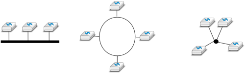
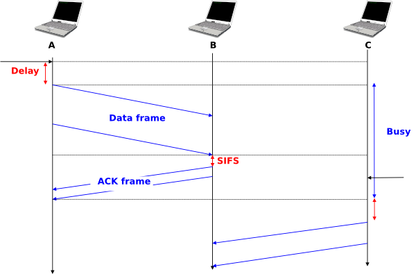
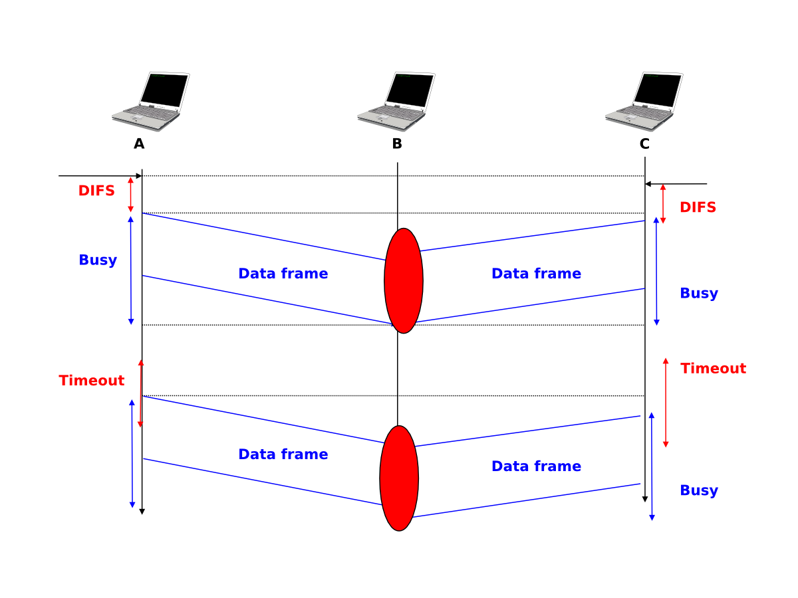
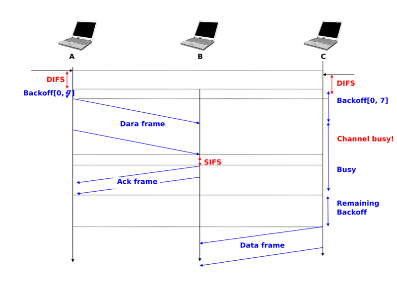
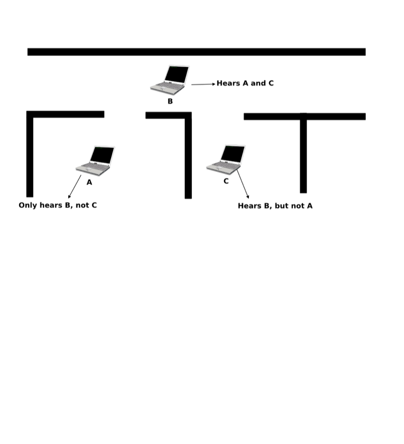
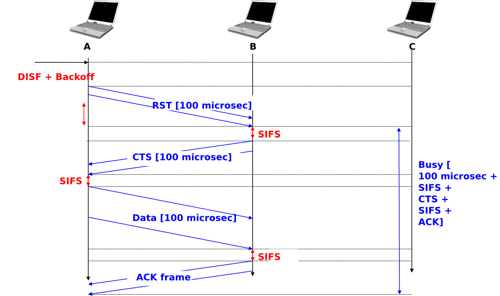
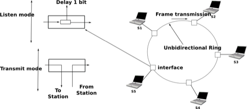
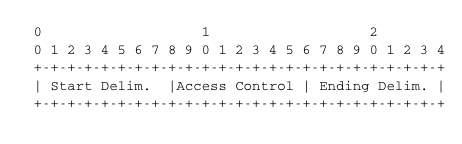
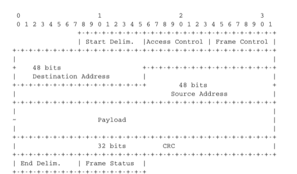

.. Copyright |copy| 2010 by Olivier Bonaventure
.. This file is licensed under a `creative commons licence <http://creativecommons.org/licenses/by-sa/3.0/>`_

Principles
##########

The datalink layer uses the service provided by the physical layer. Although there are many different implementations of the physical layer from a technological perspective, they all provide a service that enables the datalink layer to send and receive bits between directly connected devices. The datalink layer receives packets from the network layer. Two datalink layer entities exchange `frames`. As explained in the previous chapter, most datalink layer technologies impose limitations on the size of the frames. Some technologies only impose a maximum frame size, others enforce both minimum and maximum frames sizes and finally some technologies only support a single frame size. In the latter case, the datalink layer will usually include an adaptation sublayer to allow the network layer to send and receive variable-length packets. This adaptation layer may include fragmentation and reassembly mechanisms.

.. figure:: png/lan-fig-003-c.png
   :align: center
   :scale: 70
   
   The datalink layer and the reference model

The physical layer service facilitates the sending and receiving of bits. Furthermore, it is usually far from perfect as explained in the introduction :

 - the Physical layer may change, e.g. due to electromagnetic interferences, the value of a bit being transmitted
 - the Physical layer may deliver `more` bits to the receiver than the bits sent by the sender
 - the Physical layer may deliver `fewer` bits to the receiver than the bits sent by the sender

The datalink layer must allow endsystems to exchange frames containing packets despite all of these limitations. On point-to-point links and Local Area Networks, the first problem to be solved is how to encode a frame as a sequence of bits, so that the receiver can easily recover the received frame despite the limitations of the physical layer.

.. index:: framing

If the physical layer were perfect, the problem would be very simple. The datalink layer would simply need to define how to encode each frame as a sequence of consecutive bits. The receiver would then easily be able to extract the frames from the received bits. Unfortunately, the imperfections of the physical layer make this framing problem slightly more complex. Several solutions have been proposed and are used in practice in different datalink layer technologies.

Framing
=======

This is the `framing` problem. It can be defined as : "`How does a sender encode frames so that the receiver can efficiently extract them from the stream of bits that it receives from the physical layer`". 

A first solution to solve the framing problem is to require the physical layer to remain idle for some time after the transmission of each frame. These idle periods can be detected by the receiver and serve as a marker to delineate frame boundaries. Unfortunately, this solution is not sufficient for two reasons. First, some physical layers cannot remain idle and always need to transmit bits. Second, inserting an idle period between frames decreases the maximum bandwidth that can be achieved by the datalink layer.

.. index:: Manchester encoding

Some physical layers provide an alternative to this idle period. All physical layers are able to send and receive physical symbols that represent values `0` and `1`. However, for various reasons that are outside the scope of this chapter, several physical layers are able to exchange other physical symbols as well. For example, the Manchester encoding used in several physical layers can send four different symbols. The Manchester encoding is a differential encoding scheme in which time is divided into fixed-length periods. Each period is divided in two halves and two different voltage levels can  be applied. To send a symbol, the sender must set one of these two voltage levels during each half period. To send a `1` (resp. `0`), the sender must set a high (resp. low) voltage during the first half of the period and a low (resp. high) voltage during the second half. This encoding ensures that there will be a transition at the middle of each period and allows the receiver to synchronise its clock to the sender's clock. Apart from the encodings for `0` and `1`, the Manchester encoding also supports two additional symbols : `InvH` and `InvB`  where the same voltage level is used for the two half periods. By definition, these two symbols cannot appear inside a frame which is only composed of `0` and `1`. Some technologies use these special symbols as markers for the beginning or end of frames.

.. figure:: png/lan-fig-006-c.png
   :align: center
   :scale: 70
   
   Manchester encoding

.. index:: bit stuffing, stuffing (bit)

Unfortunately, multi-symbol encodings cannot be used by all physical layers and a generic solution which can be used with any physical layer that is able to transmit and receive only `0` and `1` is required. This generic solution is called `stuffing` and two variants exist : `bit stuffing` and `character stuffing`. To enable a receiver to easily delineate the frame boundaries, these two techniques reserve special bit strings as frame boundary markers and encode the frames so that these special bit strings do not appear inside the frames.

`Bit stuffing` reserves the `01111110` bit string as the frame boundary marker and ensures that there will never be six consecutive `1` symbols transmitted by the physical layer inside a frame. With bit stuffing, a frame is sent as follows. First, the sender transmits the marker, i.e. `01111110`. Then, it sends all the bits of the frame and inserts an additional bit set to `0` after each sequence of five consecutive `1` bits. This ensures that the sent frame never contains a sequence of six consecutive bits set to `1`. As a consequence, the marker pattern cannot appear inside the frame sent. The marker is also sent to mark the end of the frame. The receiver performs the opposite to decode a received frame. It first detects the beginning of the frame thanks to the `01111110` marker. Then, it processes the received bits and counts the number of consecutive bits set to `1`. If a `0` follows five consecutive bits set to `1`, this bit is removed since it was inserted by the sender. If a `1` follows five consecutive bits sets to `1`, it indicates a marker if it is followed by a bit set to `0`. The table below illustrates the application of bit stuffing to some frames.

 ===========================   =============================================
 Original frame	      	       Transmitted frame
 ===========================   =============================================
 0001001001001001001000011     01111110000100100100100100100001101111110
 0110111111111111111110010     01111110011011111011111011111011001001111110
 01111110		       0111111001111101001111110
 ===========================   =============================================
 

For example, consider the transmission of `0110111111111111111110010`. The sender will first send the `01111110` marker followed by `011011111`. After these five consecutive bits set to `1`, it inserts a bit set to `0` followed by `11111`. A new `0` is inserted, followed by `11111`. A new `0` is inserted followed by the end of the frame `110010` and the `01111110` marker.

`Bit stuffing` increases the number of bits required to transmit each frame. The worst case for bit stuffing is of course a long sequence of bits set to `1` inside the frame. If transmission errors occur, stuffed bits or markers can be in error. In these cases, the frame affected by the error and possibly the next frame will not be correctly decoded by the receiver, but it will be able to resynchronise itself at the next valid marker. 

.. index:: character stuffing, stuffing (character)

`Bit stuffing` can be easily implemented in hardware. However, implementing it in software is difficult given the higher overhead of bit manipulations in software. Software implementations prefer to process characters than bits, software-based datalink layers usually use `character stuffing`. This technique operates on frames that contain an integer number of 8-bit characters. Some characters are used as markers to delineate the frame boundaries. Many `character stuffing` techniques use the `DLE`, `STX` and `ETX` characters of the ASCII character set. `DLE STX` (resp. `DLE ETX`) is used to mark the beginning (end) of a frame. When transmitting a frame, the sender adds a `DLE` character after each transmitted `DLE` character. This ensures that none of the markers can appear inside the transmitted frame. The receiver detects the frame boundaries and removes the second `DLE` when it receives two consecutive `DLE` characters. For example, to transmit frame `1 2 3 DLE STX 4`, a sender will first send `DLE STX` as a marker, followed by `1 2 3 DLE`. Then, the sender transmits an additional `DLE` character followed by `STX 4` and the `DLE ETX` marker.

 ===========================   =============================================
 Original frame	      	       Transmitted frame
 ===========================   =============================================
 `1 2 3 4`		       `DLE STX 1 2 3 4 DLE ETX`
 `1 2 3 DLE STX 4`	       `DLE STX 1 2 3 DLE DLE STX 4 DLE ETX`
 `DLE STX DLE ETX`	       `DLE STX DLE DLE STX DLE DLE ETX DLE ETX`
 ===========================   =============================================

`Character stuffing` , like bit stuffing, increases the length of the transmitted frames. For `character stuffing`, the worst frame is a frame containing many `DLE` characters. When transmission errors occur, the receiver may incorrectly decode one or two frames (e.g. if the errors occur in the markers). However, it will be able to resynchronise itself with the next correctly received markers.

Error detection
===============

Besides framing, datalink layers also include mechanisms to detect and sometimes even recover from transmission error. To allow a receiver to detect transmission errors, a sender must add some redundant information as an `error detection` code to the frame sent. This `error detection` code is computed by the sender on the frame that it transmits. When the receiver receives a frame with an error detection code, it recomputes it and verifies whether the received `error detection code` matches the computer `error detection code`. If they match, the frame is considered to be valid. Many error detection schemes exist and entire books have been written on the subject. A detailed discussion of these techniques is outside the scope of this book, and we will only discuss some examples to illustrate the key principles.

To understand `error detection codes`, let us consider two devices that exchange bit strings containing `N` bits. To allow the receiver to detect a transmission error, the sender converts each string of `N` bits into a string of `N+r` bits. Usually, the `r` redundant bits are added at the beginning or the end of the transmitted bit string, but some techniques interleave redundant bits with the original bits. An `error detection code` can be defined as a function that computes the `r` redundant bits corresponding to each string of `N` bits. The simplest error detection code is the parity bit. There are two types of parity schemes : even and odd parity. With the `even` (resp. `odd`) parity scheme, the redundant bit is chosen so that an even (resp. odd) number of bits are set to `1` in the transmitted bit string of `N+r` bits. The receiver can easily recompute the parity of each received bit string and discard the strings with an invalid parity. The parity scheme is often used when 7-bit characters are exchanged. In this case, the eighth bit is often a parity bit. The table below shows the parity bits that are computed for bit strings containing three bits. 

  ====================    ==========   	   ===========
  3 bits string		  Odd parity	   Even parity	 
  ====================    ==========	   ===========
  000	     		  1		   0
  001			  0		   1
  010			  0		   1
  100			  0		   1
  111			  0		   1
  110			  1		   0
  101			  1		   0
  011			  1		   0
  ====================    ==========       ===========

The parity bit allows a receiver to detect transmission errors that have affected a single bit among the transmitted `N+r` bits. If there are two or more bits in error, the receiver may not necessarily be able to detect the transmission error. More powerful error detection schemes have been defined. The Cyclical Redundancy Checks (CRC) are widely used in datalink layer protocols. An N-bits CRC can detect all transmission errors affecting a burst of less than N bits in the transmitted frame and all transmission errors that affect an odd number of bits. Additional details about CRCs may be oufnd in [Williams1993]_.

It is also possible to design a code that allows the receiver to correct transmission errors. The simplest `error correction code` is the triple modular redundancy (TMR). To transmit a bit set to `1` (resp. `0`), the sender transmits `111` (resp. `000`). When there are no transmission errors, the receiver can decode `111` as `1`. If transmission errors have affected a single bit, the receiver performs majority voting as shown in the table below. This scheme allows the receiver to correct all transmission errors that affect a single bit. 

  ====================    =============
  Received bits           Decoded bit
  ====================    =============
	 000	     		0
	 001			0
	 010			0
	 100			0
	 111			1
	 110			1
	 101			1
	 011			1
  ====================    =============

Other more powerful error correction codes have been proposed and are used in some applications. The `Hamming Code <http://en.wikipedia.org/wiki/Hamming_code>`_ is a clever combination of parity bits that provides error detection and correction capabilities. 

In practice, datalink layer protocols combine bit stuffing or character stuffing with a length indication in the frame header and a checksum or CRC. The checksum/CRC is computed by the sender and placed in the frame before applying bit/character stuffing.

Medium Access Control
#####################

Point-to-point datalink layers need to select one of the framing techniques described above and optionally add retransmission algorithms such as those explained for the transport layer to provide a reliable service. Datalink layers for Local Area Networks face two additional problems. A LAN is composed of several hosts that are attached to the same shared physical medium. From a physical layer perspective, a LAN can be organised in four different ways :

 - a bus-shaped network where all hosts are attached to the same physical cable
 - a ring-shaped where all hosts are attached to an upstream and a downstream node so that the entire network forms a ring
 - a star-shaped network where all hosts are attached to the same device
 - a wireless network where all hosts can send and receive frames using radio signals

These four basic physical organisations of Local Area Networks are shown graphically in the figure below. We will first focus on one physical organisation at a time.

   
   Bus, ring and star-shaped Local Area Network 

.. index:: collision

The common problem among all of these network organisations is how to efficiently share the access to the Local Area Network. If two devices send a frame at the same time, the two electrical, optical or radio signals that correspond to these frames will appear at the same time on the transmission medium and a receiver will not be able to decode either frame. Such simultaneous transmissions are called `collisions`. A `collision` may involve frames transmitted by two or more devices attached to the Local Area Network. Collisions are the main cause of errors in wired Local Area Networks.

All Local Area Network technologies rely on a `Medium Access Control` algorithm to regulate the transmissions to either minimise or avoid collisions. There are two broad families of `Medium Access Control` algorithms :

 #. `Deterministic` or `pessimistic` MAC algorithms. These algorithms assume that collisions are a very severe problem and that they must be completely avoided. These algorithms ensure that at any time, at most one device is allowed to send a frame on the LAN. This is usually achieved by using a distributed protocol which elects one device that is allowed to transmit at each time. A deterministic MAC algorithm ensures that no collision will happen, but there is some overhead in regulating the transmission of all the devices attached to the LAN.
 #. `Stochastic` or `optimistic` MAC algorithms. These algorithms assume that collisions are part of the normal operation of a Local Area Network. They aim to minimise the number of collisions, but they do not try to avoid all collisions. Stochastic algorithms are usually easier to implement than deterministic ones.

We first discuss a simple deterministic MAC algorithm and then we describe several important optimistic algorithms, before coming back to a distributed and deterministic MAC algorithm.

Static allocation methods
=========================

A first solution to share the available resources among all the devices attached to one Local Area Network is to define, `a priori`, the distribution of the transmission resources among the different devices. If `N` devices need to share the transmission capacities of a LAN operating at `b` Mbps, each device could be allocated a bandwidth of :math:`\frac{b}{N}` Mbps. 

.. index:: Frequency Division Multiplexing, FDM

Limited resources need to be shared in other environments than Local Area Networks. Since the first radio transmissions by `Marconi <http://en.wikipedia.org/wiki/Guglielmo_Marconi>`_ more than one century ago, many applications that exchange information through radio signals have been developed. Each radio signal is an electromagnetic wave whose power is centered around a given frequency. The radio spectrum corresponds to frequencies ranging between roughly 3 KHz and 300 GHz. Frequency allocation plans negotiated among governments reserve most frequency ranges for specific applications such as broadcast radio, broadcast television, mobile communications, aeronautical radio navigation, amateur radio, satellite, etc. Each frequency range is then subdivided into channels and each channel can be reserved for a given application, e.g. a radio broadcaster in a given region.

.. index:: Wavelength Division Multiplexing, WDM

`Frequency Division Multiplexing` (FDM) is a static allocation scheme in which a frequency is allocated to each device attached to the shared medium. As each device uses a different transmission frequency, collisions cannot occur. In optical networks, a variant of FDM called `Wavelength Division Multiplexing` (WDM) can be used. An optical fiber can transport light at different wavelengths without interference. With WDM, a different wavelength is allocated to each of the devices that share the same optical fiber.

.. index:: Time Division Multiplexing

`Time Division Multiplexing` (TDM) is a static bandwidth allocation method that was initially defined for the telephone network. In the fixed telephone network, a voice conversation is usually transmitted as a 64 Kbps signal. Thus, a telephone conservation generates 8 KBytes per second or one byte every 125 microsecond. Telephone conversations often need to be multiplexed together on a single line. For example, in Europe, thirty 64 Kbps voice signals are multiplexed over a single 2 Mbps (E1) line. This is done by using  `Time Division Multiplexing` (TDM). TDM divides the transmission opportunities into slots. In the telephone network, a slot corresponds to 125 microseconds. A position inside each slot is reserved for each voice signal. The figure below illustrates TDM on a link that is used to carry four voice conversations. The vertical lines represent the slot boundaries and the letters the different voice conversations. One byte from each voice conversation is sent during each 125 microsecond slot. The byte corresponding to a given conversation is always sent at the same position in each slot.

.. figure:: png/lan-fig-012-c.png
   :align: center
   :scale: 70
   
   Time-division multiplexing 

TDM as shown above can be completely static, i.e. the same conversations always share the link, or dynamic. In the latter case, the two endpoints of the link must exchange messages specifying which conversation uses which byte inside each slot. Thanks to these signalling messages, it is possible to dynamically add and remove voice conversations from a given link. 

TDM and FDM are widely used in telephone networks to support fixed bandwidth conversations. Using them in Local Area Networks that support computers would probably be inefficient. Computers usually do not send information at a fixed rate. Instead, they often have an on-off behaviour. During the on period, the computer tries to send at the highest possible rate, e.g. to transfer a file. During the off period, which is often much longer than the on period, the computer does not transmit any packet. Using a static allocation scheme for computers attached to a LAN would lead to huge inefficiencies, as they would only be able to transmit at :math:`\frac{1}{N}` of the total bandwidth during their on period, despite the fact that the other computers are in their off period and thus do not need to transmit any information. The dynamic MAC algorithms discussed in the remainder of this chapter aim solve this problem.

ALOHA
=====

.. index:: packet radio

In the 1960s, computers were mainly mainframes with a few dozen terminals attached to them. These terminals were usually in the same building as the mainframe and were directly connected to it. In some cases, the terminals were installed in remote locations and connected through a :term:`modem` attached to a :term:`dial-up  line`. The university of Hawaii chose a different organisation. Instead of using telephone lines to connect the distant terminals, they developed the first `packet radio` technology [Abramson1970]_. Until then, computer networks were built on top of either the telephone network or physical cables. ALOHANet showed that it was possible to use radio signals to interconnect computers.

.. index:: ALOHA

The first version of ALOHANet, described in [Abramson1970]_, operated as follows: First, the terminals and the mainframe exchanged fixed-length frames composed of 704 bits. Each frame contained 80 8-bit characters, some control bits and parity information to detect transmission errors. Two channels in the 400 MHz range were reserved for the operation of ALOHANet. The first channel was used by the mainframe to send frames to all terminals. The second channel was shared among all terminals to send frames to the mainframe. As all terminals share the same transmission channel, there is a risk of collision. To deal with this problem as well as transmission errors, the mainframe verified the parity bits of the received frame and sent an acknowledgement on its channel for each correctly received frame. The terminals on the other hand had to retransmit the unacknowledged frames. As for TCP, retransmitting these frames immediately upon expiration of a fixed timeout is not a good approach as several terminals may retransmit their frames at the same time leading to a network collapse. A better approach, but still far from perfect, is for each terminal to wait a random amount of time after the expiration of its retransmission timeout. This avoids synchronisation among multiple retransmitting terminals. 

The pseudo-code below shows the operation of an ALOHANet terminal. We use this python syntax for all Medium Access Control algorithms described in this chapter. The algorithm is applied to each new frame that needs to be transmitted. It attempts to transmit a frame at most `max` times (`while loop`). Each transmission attempt is performed as follows: First, the frame is sent. Each frame is protected by a timeout. Then, the terminal waits for either a valid acknowledgement frame or the expiration of its timeout. If the terminal receives an acknowledgement, the frame has been delivered correctly and the algorithm terminates. Otherwise, the terminal waits for a random time and attempts to retransmit the frame. 

.. code-block:: text

 # ALOHA
 N=1
 while N<= max :
    send(frame)
    wait(ack_on_return_channel or timeout)
    if (ack_on_return_channel):
       	break  # transmission was successful
    else:
	# timeout 
	wait(random_time)
	N=N+1
  else:		
    # Too many transmission attempts

[Abramson1970]_ analysed the performance of ALOHANet under particular assumptions and found that ALOHANet worked well when the channel was lightly loaded. In this case, the frames are rarely retransmitted and the `channel traffic`, i.e. the total number of (correct and retransmitted) frames transmitted per unit of time is close to the `channel utilization`, i.e. the number of correctly transmitted frames per unit of time. Unfortunately, the analysis also reveals that the `channel utilization` reaches its maximum at :math:`\frac{1}{2 \times e}=0.186` times the channel bandwidth. At higher utilization, ALOHANet becomes unstable and the network collapses due to collided retransmissions.

.. note:: Amateur packet radio

 Packet radio technologies have evolved in various directions since the first experiments performed at the University of Hawaii. The Amateur packet radio service developed by amateur radio operators is one of the descendants ALOHANet. Many amateur radio operators are very interested in new technologies and they often spend countless hours developing new antennas or transceivers. When the first personal computers appeared, several amateur radio operators designed radio modems and their own datalink layer protocols [KPD1985]_ [BNT1997]_. This network grew and it was possible to connect to servers in several European countries by only using packet radio relays. Some amateur radio operators also developed TCP/IP protocol stacks that were used over the packet radio service. Some parts of the `amateur packet radio network <http://www.ampr.org/>`_ are connected to the global Internet and use the `44.0.0.0/8` prefix. 

.. index:: slotted ALOHA

Many improvements to ALOHANet have been proposed since the publication of [Abramson1970]_, and this technique, or some of its variants, are still found in wireless networks today. The slotted technique proposed in [Roberts1975]_ is important because it shows that a simple modification can significantly improve channel utilization. Instead of allowing all terminals to transmit at any time, [Roberts1975]_ proposed to divide time into slots and allow terminals to transmit only at the beginning of each slot. Each slot corresponds to the time required to transmit one fixed size frame. In practice, these slots can be imposed by a single clock that is received by all terminals. In ALOHANet, it could have been located on the central mainframe. The analysis in [Roberts1975]_ reveals that this simple modification improves the channel utilization by a factor of two. 
	
.. index:: CSMA, Carrier Sense Multiple Access

Carrier Sense Multiple Access
=============================

ALOHA and slotted ALOHA can easily be implemented, but unfortunately, they can only be used in networks that are very lightly loaded. Designing a network for a very low utilisation is possible, but it clearly increases the cost of the network. To overcome the problems of ALOHA, many Medium Access Control mechanisms have been proposed which improve channel utilization. Carrier Sense Multiple Access (CSMA) is a significant improvement compared to ALOHA. CSMA requires all nodes to listen to the transmission channel to verify that it is free before transmitting a frame [KT1975]_. When a node senses the channel to be busy, it defers its transmission until the channel becomes free again. The pseudo-code below provides a more detailed description of the operation of CSMA. 

.. index:: persistent CSMA, CSMA (persistent)

.. code-block:: text

  # persistent CSMA
  N=1
  while N<= max :
    wait(channel_becomes_free)
    send(frame)
    wait(ack or timeout)
    if ack :
       	break  # transmission was successful
    else :
	# timeout 
	N=N+1
  # end of while loop 
    # Too many transmission attempts

The above pseudo-code is often called `persistent CSMA` [KT1975]_ as the terminal will continuously listen to the channel and transmit its frame as soon as the channel becomes free. Another important variant of CSMA is the `non-persistent CSMA` [KT1975]_. The main difference between persistent and non-persistent CSMA described in the pseudo-code below is that a non-persistent CSMA node does not continuously listen to the channel to determine when it becomes free. When a non-persistent CSMA terminal senses the transmission channel to be busy, it waits for a random time before sensing the channel again. This improves channel utilization compared to persistent CSMA. With persistent CSMA, when two terminals sense the channel to be busy, they will both transmit (and thus cause a collision) as soon as the channel becomes free. With non-persistent CSMA, this synchronisation does not occur, as the terminals wait a random time after having sensed the transmission channel. However, the higher channel utilization achieved by non-persistent CSMA comes at the expense of a slightly higher waiting time in the terminals when the network is lightly loaded. 

.. index:: non-persistent CSMA, CSMA (non-persistent)

.. code-block:: text

 # Non persistent CSMA
 N=1
 while N<= max :
    listen(channel)
    if free(channel):
       send(frame)	
       wait(ack or timeout)
       if received(ack) :
       	  break  # transmission was successful
       else :
	  # timeout 
	  N=N+1
    else:
       wait(random_time)
  # end of while loop		
    # Too many transmission attempts

[KT1975]_ analyzes in detail the performance of several CSMA variants. Under some assumptions about the transmission channel and the traffic, the analysis compares ALOHA, slotted ALOHA, persistent and non-persistent CSMA. Under these assumptions, ALOHA achieves a channel utilization of only 18.4% of the channel capacity. Slotted ALOHA is able to use 36.6% of this capacity. Persistent CSMA improves the utilization by reaching 52.9% of the capacity while non-persistent CSMA achieves 81.5% of the channel capacity. 

.. index:: Carrier Sense Multiple Access with Collision Detection, CSMA/CD

Carrier Sense Multiple Access with Collision Detection
======================================================

.. index:: speed of light

CSMA improves channel utilization compared to ALOHA. However, the performance can still be improved, especially in wired networks. Consider the situation of two terminals that are connected to the same cable. This cable could, for example, be a coaxial cable as in the early days of Ethernet [Metcalfe1976]_. It could also be built with twisted pairs. Before extending CSMA, it is useful to understand more intuitively, how frames are transmitted in such a network and how collisions can occur. The figure below illustrates the physical transmission of a frame on such a cable. To transmit its frame, host A must send an electrical signal on the shared medium. The first step is thus to begin the transmission of the electrical signal. This is point `(1)` in the figure below. This electrical signal will travel along the cable. Although electrical signals travel fast, we know that information cannot travel faster than the speed of light (i.e. 300.000 kilometers/second). On a coaxial cable, an electrical signal is slightly slower than the speed of light and 200.000 kilometers per second is a reasonable estimation. This implies that if the cable has a length of one kilometer, the electrical signal will need 5 microseconds to travel from one end of the cable to the other. The ends of coaxial cables are equipped with termination points that ensure that the electrical signal is not reflected back to its source. This is illustrated at point `(3)` in the figure, where the electrical signal has reached the left endpoint and host B. At this point, B starts to receive the frame being transmitted by A. Notice that there is a delay between the transmission of a bit on host A and its reception by host B. If there were other hosts attached to the cable, they would receive the first bit of the frame at slightly different times. As we will see later, this timing difference is a key problem for MAC algorithms. At point `(4)`, the electrical signal has reached both ends of the cable and occupies it completely. Host A continues to transmit the electrical signal until the end of the frame. As shown at point `(5)`, when the sending host stops its transmission, the electrical signal corresponding to the end of the frame leaves the coaxial cable. The channel becomes empty again once the entire electrical signal has been removed from the cable.

.. figure:: png/lan-fig-024-c.png
   :align: center
   :scale: 70
   
   Frame transmission on a shared bus 

Now that we have looked at how a frame is actually transmitted as an electrical signal on a shared bus, it is interesting to look in more detail at what happens when two hosts transmit a frame at alomost the same time. This is illustrated in the figure below, where hosts A and B start their transmission at the same time (point `(1)`). At this time, if host C senses the channel, it will consider it to be free. This will not last a long time and at point `(2)` the electrical signals from both host A and host B reach host C. The combined electrical signal (shown graphically as the superposition of the two curves in the figure) cannot be decoded by host C. Host C detects a collision, as it receives a signal that it cannot decode. Since host C cannot decode the frames, it cannot determine which hosts are sending the colliding frames. Note that host A (and host B) will detect the collision after host C (point `(3)` in the figure below).

.. figure:: png/lan-fig-025-c.png
   :align: center
   :scale: 70
   
   Frame collision on a shared bus 

.. index:: collision detection, jamming

As shown above, hosts detect collisions when they receive an electrical signal that they cannot decode. In a wired network, a host is able to detect such a collision both while it is listening (e.g. like host C in the figure above) and also while it is sending its own frame. When a host transmits a frame, it can compare the electrical signal that it transmits with the electrical signal that it senses on the wire. At points `(1)` and `(2)` in the figure above, host A senses only its own signal. At point `(3)`, it senses an electrical signal that differs from its own signal and can thus detects the collision. At this point, its frame is corrupted and it can stop its transmission. The ability to detect collisions while transmitting is the starting point for the `Carrier Sense Multiple Access with Collision Detection (CSMA/CD)` Medium Access Control algorithm, which is used in Ethernet networks [Metcalfe1976]_ [802.3]_ . When an Ethernet host detects a collision while it is transmitting, it immediately stops its transmission. Compared with pure CSMA, CSMA/CD is an important improvement since when collisions occur, they only last until colliding hosts have detected it and stopped their transmission. In practice, when a host detects a collision, it sends a special jamming signal on the cable to ensure that all hosts have detected the collision.

To better understand these collisions, it is useful to analyse what would be the worst collision on a shared bus network. Let us consider a wire with two hosts attached at both ends, as shown in the figure below. Host A starts to transmit its frame and its electrical signal is propagated on the cable. Its propagation time depends on the physical length of the cable and the speed of the electrical signal. Let us use :math:`\tau` to represent this propagation delay in seconds. Slightly less than :math:`\tau` seconds after the beginning of the transmission of A's frame, B decides to start transmiting its own frame. After :math:`\epsilon` seconds, B senses A's frame, detects the collision and stops transmitting. The beginning of B's frame travels on the cable until it reaches host A. Host A can thus detect the collision at time :math:`\tau-\epsilon+\tau \approx 2\times\tau`. An important point to note is that a collision can only occur during the first :math:`2\times\tau` seconds of its transmission. If a collision did not occur during this period, it cannot occur afterwards since the transmission channel is busy after :math:`\tau` seconds and CSMA/CD hosts sense the transmission channel before transmitting their frame. 

.. figure:: png/lan-fig-027-c.png
   :align: center
   :scale: 70
   
   The worst collision on a shared bus

Furthermore, on the wired networks where CSMA/CD is used, collisions are almost the only cause of transmission errors that affect frames. Transmission errors that only affect a few bits inside a frame seldom occur in these wired networks. For this reason, the designers of CSMA/CD chose to completely remove the acknowledgement frames in the datalink layer. When a host transmits a frame, it verifies whether its transmission has been affected by a collision. If not, given the negligible Bit Error Ratio of the underlying network, it assumes that the frame was received correctly by its destination. Otherwise the frame is retransmitted after some delay.

Removing acknowledgements is an interesting optimisation as it reduces the number of frames that are exchanged on the network and the number of frames that need to be processed by the hosts. However, to use this optimisation, we must ensure that all hosts will be able to detect all the collisions that affect their frames. The problem is important for short frames. Let us consider two hosts, A and B, that are sending a small frame to host C as illustrated in the figure below. If the frames sent by A and B are very short, the situation illustrated below may occur. Hosts A and B send their frame and stop transmitting (point `(1)`). When the two short frames arrive at the location of host C, they collide and host C cannot decode them (point `(2)`). The two frames are absorbed by the ends of the wire. Neither host A nor host B have detected the collision. They both consider their frame to have been received correctly by its destination.

.. figure:: png/lan-fig-026-c.png
   :align: center
   :scale: 70
   
   The short-frame collision problem

.. index:: slot time (Ethernet)

To solve this problem, networks using CSMA/CD require hosts to transmit for at least :math:`2\times\tau` seconds. Since the network transmission speed is fixed for a given network technology, this implies that a technology that uses CSMA/CD enforces a minimum frame size. In the most popular CSMA/CD technology, Ethernet, :math:`2\times\tau` is called the `slot time` [#fslottime]_. 

.. index:: binary exponential back-off (CSMA/CD)

The last innovation introduced by CSMA/CD is the computation of the retransmission timeout. As for ALOHA, this timeout cannot be fixed, otherwise hosts could become synchronised and always retransmit at the same time. Setting such a timeout is always a compromise between the network access delay and the amount of collisions. A short timeout would lead to a low network access delay but with a higher risk of collisions. On the other hand, a long timeout would cause a long network access delay but a lower risk of collisions. The `binary exponential back-off` algorithm was introduced in CSMA/CD networks to solve this problem.

To understand `binary exponential back-off`, let us consider a collision caused by exactly two hosts. Once it has detected the collision, a host can either retransmit its frame immediately or defer its transmission for some time. If each colliding host flips a coin to decide whether to retransmit immediately or to defer its retransmission, four cases are possible :

 1. Both hosts retransmit immediately and a new collision occurs
 2. The first host retransmits immediately and the second defers its retransmission
 3. The second host retransmits immediately and the first defers its retransmission
 4. Both hosts defer their retransmission and a new collision occurs

In the second and third cases, both hosts have flipped different coins. The delay chosen by the host that defers its retransmission should be long enough to ensure that its retransmission will not collide with the immediate retransmission of the other host. However the delay should not be longer than the time necessary to avoid the collision, because if both hosts decide to defer their transmission, the network will be idle during this delay. The `slot time` is the optimal delay since it is the shortest delay that ensures that the first host will be able to retransmit its frame completely without any collision. 

If two hosts are competing, the algorithm above will avoid a second collision 50% of the time. However, if the network is heavily loaded, several hosts may be competing at the same time. In this case, the hosts should be able to automatically adapt their retransmission delay. The `binary exponential back-off` performs this adaptation based on the number of collisions that have affected a frame. After the first collision, the host flips a coin and waits 0 or 1 `slot time`. After the second collision, it generates a random number and waits 0, 1, 2 or 3 `slot times`, etc. The duration of the waiting time is doubled after each collision. The complete pseudo-code for the CSMA/CD algorithm is shown in the figure below. 

.. code-block:: text

 # CSMA/CD pseudo-code
 N=1
 while N<= max :
    wait(channel_becomes_free)
    send(frame)   
    wait_until (end_of_frame) or (collision)	
    if collision detected:
	stop transmitting
	send(jamming)
	k = min (10, N)
	r = random(0, 2k - 1) * slotTime
	wait(r*slotTime)
	N=N+1
    else :	
        wait(inter-frame_delay)
	break
  # end of while loop	
    # Too many transmission attempts
	

The inter-frame delay used in this pseudo-code is a short delay corresponding to the time required by a network adapter to switch from transmit to receive mode. It is also used to prevent a host from sending a continuous stream of frames without leaving any transmission opportunities for other hosts on the network. This contributes to the fairness of CSMA/CD. Despite this delay, there are still conditions where CSMA/CD is not completely fair [RY1994]_. Consider for example a network with two hosts : a server sending long frames and a client sending acknowledgments. Measurements reported in [RY1994]_ have shown that there are situations where the client could suffer from repeated collisions that lead it to wait for long periods of time due to the exponential back-off algorithm. 

.. [#fslottime] This name should not be confused with the duration of a transmission slot in slotted ALOHA. In CSMA/CD networks, the slot time is the time during which a collision can occur at the beginning of the transmission of a frame. In slotted ALOHA, the duration of a slot is the transmission time of an entire fixed-size frame.

.. index:: Carrier Sense Multiple Access with Collision Avoidance, CSMA/CA

Carrier Sense Multiple Access with Collision Avoidance
======================================================

The `Carrier Sense Multiple Access with Collision Avoidance` (CSMA/CA) Medium Access Control algorithm was designed for the popular WiFi wireless network technology [802.11]_. CSMA/CA also senses the transmission channel before transmitting a frame. Furthermore, CSMA/CA tries to avoid collisions by carefully tuning the timers used by CSMA/CA devices.

.. index:: Short Inter Frame Spacing, SIFS

CSMA/CA uses acknowledgements like CSMA. Each frame contains a sequence number and a CRC. The CRC is used to detect transmission errors while the sequence number is used to avoid frame duplication. When a device receives a correct frame, it returns a special acknowledgement frame to the sender. CSMA/CA introduces a small delay, named `Short Inter Frame Spacing`  (SIFS), between the reception of a frame and the transmission of the acknowledgement frame. This delay corresponds to the time that is required to switch the radio of a device between the reception and transmission modes.

.. index:: Distributed Coordination Function Inter Frame Space, DIFS, Extended Inter Frame Space, EIFS

Compared to CSMA, CSMA/CA defines more precisely when a device is allowed to send a frame. First, CSMA/CA defines two delays : `DIFS` and `EIFS`. To send a frame, a device must first wait until the channel has been idle for at least the `Distributed Coordination Function Inter Frame Space` (DIFS) if the previous frame was received correctly. However, if the previously received frame was corrupted, this indicates that there are collisions and the device must sense the channel idle for at least the `Extended Inter Frame Space` (EIFS), with :math:`SIFS<DIFS<EIFS`. The exact values for SIFS, DIFS and EIFS depend on the underlying physical layer [802.11]_. 

The figure below shows the basic operation of CSMA/CA devices. Before transmitting, host `A` verifies that the channel is empty for a long enough period. Then, its sends its data frame. After checking the validity of the received frame, the recipient sends an acknowledgement frame after a short SIFS delay. Host `C`, which does not participate in the frame exchange, senses the channel to be busy at the beginning of the data frame. Host `C` can use this information to determine how long the channel will be busy for. Note that as :math:`SIFS<DIFS<EIFS`, even a device that would start to sense the channel immediately after the last bit of the data frame could not decide to transmit its own frame during the transmission of the acknowledgement frame.

   
   Operation of a CSMA/CA device

.. index:: slotTime (CSMA/CA)

The main difficulty with CSMA/CA is when two or more devices transmit at the same time and cause collisions. This is illustrated in the figure below, assuming a fixed timeout after the transmission of a data frame. With CSMA/CA, the timeout after the transmission of a data frame is very small, since it corresponds to the SIFS plus the time required to transmit the acknowledgement frame.

   
   Collisions with CSMA/CA 

To deal with this problem, CSMA/CA relies on a backoff timer. This backoff timer is a random delay that is chosen by each device in a range that depends on the number of retransmissions for the current frame. The range grows exponentially with the retransmissions as in CSMA/CD. The minimum range for the backoff timer is :math:`[0,7*slotTime]` where the `slotTime` is a parameter that depends on the underlying physical layer. Compared to CSMA/CD's exponential backoff, there are two important differences to notice. First, the initial range for the backoff timer is seven times larger. This is because it is impossible in CSMA/CA to detect collisions as they happen. With CSMA/CA, a collision may affect the entire frame while with CSMA/CD it can only affect the beginning of the frame. Second, a CSMA/CA device must regularly sense the transmission channel during its back off timer. If the channel becomes busy (i.e. because another device is transmitting), then the back off timer must be frozen until the channel becomes free again. Once the channel becomes free, the back off timer is restarted. This is in contrast with CSMA/CD where the back off is recomputed after each collision. This is illustrated in the figure below. Host `A` chooses a smaller backoff than host `C`. When `C` senses the channel to be busy, it freezes its backoff timer and only restarts it once the channel is free again.

   
   Detailed example with CSMA/CA

The pseudo-code below summarises the operation of a CSMA/CA device. The values of the SIFS, DIFS, EIFS and slotTime depend on the underlying physical layer technology [802.11]_

.. code-block:: text

 # CSMA/CA simplified pseudo-code
 N=1
 while N<= max :
    waitUntil(free(channel)) 
    if correct(last_frame) :
       wait(channel_free_during_t >=DIFS)
    else:
       wait(channel_free_during_t >=EIFS)
       	
    back-off_time = int(random[0,min(255,7*(2^(N-1)))])*slotTime
    wait(channel free during backoff_time)
    # backoff timer is frozen while channel is sensed to be busy
    send(frame) 
    wait(ack or timeout)
    if received(ack)
       # frame received correctly
       break
    else:
       # retransmission required
       N=N+1

.. index:: hidden station problem

Another problem faced by wireless networks is often called the `hidden station problem`. In a wireless network, radio signals are not always propagated same way in all directions. For example, two devices separated by a wall may not be able to receive each other's signal while they could both be receiving the signal produced by a third host. This is illustrated in the figure below, but it can happen in other environments. For example, two devices that are on different sides of a hill may not be able to receive each other's signal while they are both able to receive the signal sent by a station at the top of the hill. Furthermore, the radio propagation conditions may change with time. For example, a truck may temporarily block the communication between two nearby devices. 

   
   The hidden station problem 

.. index:: Request To Send, RTS, Clear To Send, CTS

To avoid collisions in these situations, CSMA/CA allows devices to reserve the transmission channel for some time. This is done by using two control frames : `Request To Send` (RTS) and `Clear To Send` (CTS). Both are very short frames to minimize the risk of collisions. To reserve the transmission channel, a device sends a RTS frame to the intended recipient of the data frame. The RTS frame contains the duration of the requested reservation. The recipient replies, after a SIFS delay, with a CTS frame which also contains the duration of the reservation. As the duration of the reservation has been sent in both RTS and CTS, all hosts that could collide with either the sender or the reception of the data frame are informed of the reservation. They can compute the total duration of the transmission and defer their access to the transmission channel until then. This is illustrated in the figure below where host `A` reserves the transmission channel to send a data frame to host `B`. Host `C` notices the reservation and defers its transmission.

   
   Reservations with CSMA/CA

The utilization of the reservations with CSMA/CA is an optimisation that is useful when collisions are frequent. If there are few collisions, the time required to transmit the RTS and CTS frames can become significant and in particular when short frames are exchanged. Some devices only turn on RTS/CTS after transmission errors.

	
Deterministic Medium Access Control algorithms
==============================================

During the 1970s and 1980s, there were huge debates in the networking community about the best suited Medium Access Control algorithms for Local Area Networks. The optimistic algorithms that we have described until now were relatively easy to implement when they were designed. From a performance perspective, mathematical models and simulations showed the ability of these optimistic techniques to sustain load. However, none of the optimistic techniques are able to guarantee that a frame will be delivered within a given delay bound and some applications require predictable transmission delays. The deterministic MAC algorithms were considered by a fraction of the networking community as the best solution to fulfill the needs of Local Area Networks. 

Both the proponents of the deterministic and the opportunistic techniques lobbied to develop standards for Local Area networks that would incorporate their solution. Instead of trying to find an impossible compromise between these diverging views, the IEEE 802 committee that was chartered to develop Local Area Network standards chose to work in parallel on three different LAN technologies and created three working groups. The `IEEE 802.3 working group <http://www.ieee802.org/3/>`_ became responsible for CSMA/CD. The proponents of deterministic MAC algorithms agreed on the basic principle of exchanging special frames called tokens between devices to regulate the access to the transmission medium. However, they did not agree on the most suitable physical layout for the network. IBM argued in favor of Ring-shaped networks while the manufacturing industry, led by General Motors, argued in favor of a bus-shaped network. This led to the creation of the `IEEE 802.4 working group` to standardise Token Bus networks and the `IEEE 802.5 working group <http://www.ieee802.org/5/>`_ to standardise Token Ring networks. Although these techniques are not widely used anymore today, the principles behind a token-based protocol are still important.

The IEEE 802.5 Token Ring technology is defined in [802.5]_. We use Token Ring as an example to explain the principles of the token-based MAC algorithms in ring-shaped networks. Other ring-shaped networks include the almost defunct FDDI [Ross1989]_ or the more recent Resilient Pack Ring [DYGU2004]_ . A good survey of the token ring networks may be found in [Bux1989]_ .

A Token Ring network is composed of a set of stations that are attached to a unidirectional ring. The basic principle of the Token Ring MAC algorithm is that two types of frames travel on the ring : tokens and data frames. When the Token Ring starts, one of the stations sends the token. The token is a small frame that represents the authorization to transmit data frames on the ring. To transmit a data frame on the ring, a station must first capture the token by removing it from the ring. As only one station can capture the token at a time, the station that owns the token can safely transmit a data frame on the ring without risking collisions. After having transmitted its frame, the station must remove it from the ring and resend the token so that other stations can transmit their own frames.

.. _fig-tokenring:

   
   A Token Ring network

While the basic principles of the Token Ring are simple, there are several subtle implementation details that add complexity to Token Ring networks. To understand these details let us analyse the operation of a Token Ring interface on a station. A Token Ring interface serves three different purposes. Like other LAN interfaces, it must be able to send and receive frames. In addition, a Token Ring interface is part of the ring, and as such, it must be able to forward the electrical signal that passes on the ring even when its station is powered off.

When powered-on, Token Ring interfaces operate in two different modes : `listen` and `transmit`. When operating in `listen` mode, a Token Ring interface receives an electrical signal from its upstream neighbour on the ring, introduces a delay equal to the transmission time of one bit on the ring and regenerates the signal before sending it to its downstream neighbour on the ring.

The first problem faced by a Token Ring network is that as the token represents the authorization to transmit, it must continuously travel on the ring when no data frame is being transmitted. Let us assume that a token has been produced and sent on the ring by one station. In Token Ring networks, the token is a 24 bits frame whose structure is shown below.

.. index:: Token Ring token frame, 802.5 token frame

   802.5 token format

.. index:: Starting Delimiter (Token Ring), Ending Delimiter (Token Ring)

The token is composed of three fields. First, the `Starting Delimiter` is the marker that indicates the beginning of a frame. The first Token Ring networks used Manchester coding and the `Starting Delimiter` contained both symbols representing `0` and symbols that do not represent bits. The last field is the `Ending Delimiter` which marks the end of the token. The `Access Control` field is present in all frames, and contains several flags. The most important is the `Token` bit that is set in token frames and reset in other frames.

.. index:: Token Ring Monitor

Let us consider the five station network depicted in figure :ref:`fig-tokenring` above and assume that station `S1` sends a token. If we neglect the propagation delay on the inter-station links, as each station introduces a one bit delay, the first bit of the frame would return to `S1` while it sends the fifth bit of the token. If station `S1` is powered off at that time, only the first five bits of the token will travel on the ring. To avoid this problem, there is a special station called the `Monitor` on each Token Ring. To ensure that the token can travel forever on the ring, this `Monitor` inserts a delay that is equal to at least 24 bit transmission times. If station `S3` was the `Monitor` in figure :ref:`fig-tokenring`, `S1` would have been able to transmit the entire token before receiving the first bit of the token from its upstream neighbour.

Now that we have explained how the token can be forwarded on the ring, let us analyse how a station can capture a token to transmit a data frame. For this, we need some information about the format of the data frames. An 802.5 data frame begins with the `Starting Delimiter` followed by the `Access Control` field whose `Token` bit is reset, a `Frame Control` field that allows for the definition of several types of frames, destination and source address, a payload, a CRC, the `Ending Delimiter` and a `Frame Status` field. The format of the Token Ring data frames is illustrated below.

.. index:: Token Ring data frame, 802.5 data frame

   802.5 data frame format

To capture a token, a station must operate in `Listen` mode. In this mode, the station receives bits from its upstream neighbour. If the bits correspond to a data frame, they must be forwarded to the downstream neighbour. If they correspond to a token, the station can capture it and transmit its data frame. Both the data frame and the token are encoded as a bit string begining with the `Starting Delimiter` followed by the `Access Control` field. When the station receives the first bit of a `Starting Delimiter`, it cannot know whether this is a data frame or a token and must forward the entire delimiter to its downstream neighbour. It is only when it receives the fourth bit of the `Access Control` field (i.e. the `Token` bit) that the station knows whether the frame is a data frame or a token. If the `Token` bit is reset, it indicates a data frame and the remaining bits of the data frame must be forwarded to the downstream station. Otherwise (`Token` bit is set), this is a token and the station can capture it by resetting the bit that is currently in its buffer. Thanks to this modification, the beginning of the token is now the beginning of a data frame and the station can switch to `Transmit` mode and send its data frame starting at the fifth bit of the `Access Control` field. Thus, the one-bit delay introduced by each Token Ring station plays a key role in enabling the stations to efficiently capture the token. 

After having transmitted its data frame, the station must remain in `Transmit` mode until it has received the last bit of its own data frame. This ensures that the bits sent by a station do not remain in the network forever. A data frame sent by a station in a Token Ring network passes in front of all stations attached to the network. Each station can detect the data frame and analyse the destination address to possibly capture the frame. 

The `Frame Status` field that appears after the `Ending Delimiter` is used to provide acknowledgements without requiring special frames. The `Frame Status` contains two flags : `A` and `C`. Both flags are reset when a station sends a data frame. These flags can be modified by their recipients. When a station senses its address as the destination address of a frame, it can capture the frame, check its CRC and place it in its own buffers. The destination of a frame must set the `A` bit (resp. `C` bit) of the `Frame Status` field once it has seen (resp. copied) a data frame. By inspecting the `Frame Status` of the returning frame, the sender can verify whether its frame has been received correctly by its destination.

.. index:: Monitor station, Token Holding Time

The text above describes the basic operation of a Token Ring network when all stations work correctly. Unfortunately, a real Token Ring network must be able to handle various types of anomalies and this increases the complexity of Token Ring stations. We briefly list the problems and outline their solutions below. A detailed description of the operation of Token Ring stations may be found in [802.5]_. The first problem is when all the stations attached to the network start. One of them must bootstrap the network by sending the first token. For this, all stations implement a distributed election mechanism that is used to select the `Monitor`. Any station can become a `Monitor`. The `Monitor` manages the Token Ring network and ensures that it operates correctly. Its first role is to introduce a delay of 24 bit transmission times to ensure that the token can travel smoothly on the ring. Second, the `Monitor` sends the first token on the ring. It must also verify that the token passes regularly. According to the Token Ring standard [802.5]_, a station cannot retain the token to transmit data frames for a duration longer than the `Token Holding Time` (THT) (slightly less than 10 milliseconds). On a network containing `N` stations, the `Monitor` must receive the token at least every :math:`N \times THT` seconds. If the `Monitor` does not receive a token during such a period, it cuts the ring for some time and then reinitialises the ring and sends a token.

Several other anomalies may occur in a Token Ring network. For example, a station could capture a token and be powered off before having resent the token. Another station could have captured the token, sent its data frame and be powered off before receiving all of its data frame. In this case, the bit string corresponding to the end of a frame would remain in the ring without being removed by its sender. Several techniques are defined in [802.5]_ to allow the `Monitor` to handle all these problems. If unfortunately, the `Monitor` fails, another station will be elected to become the new `Monitor`.

