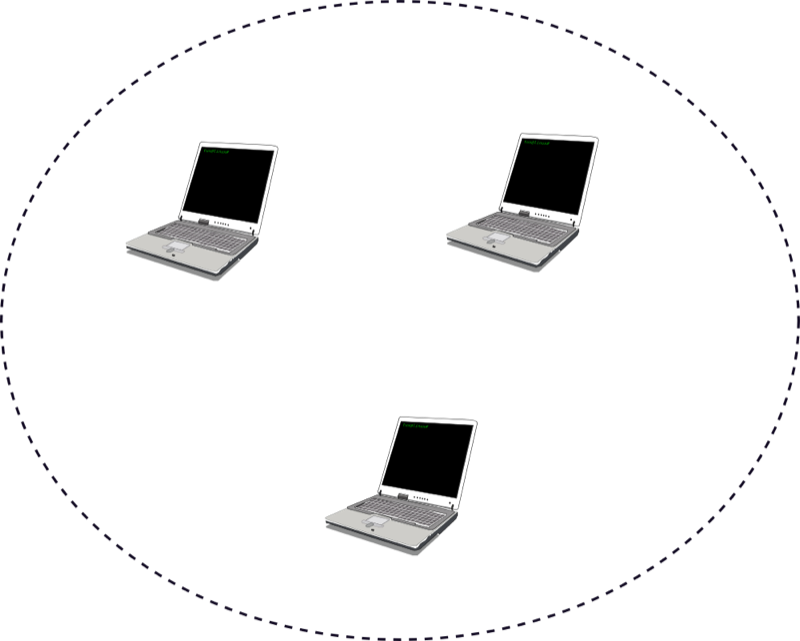
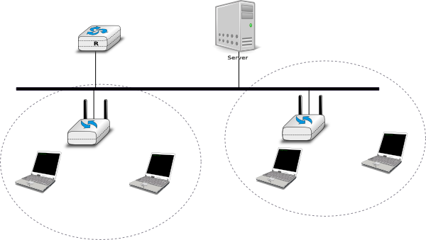
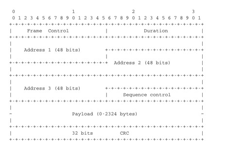
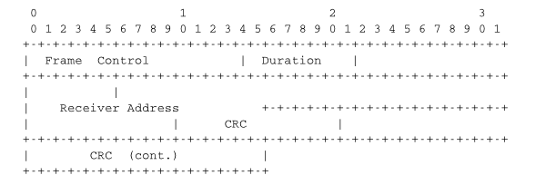
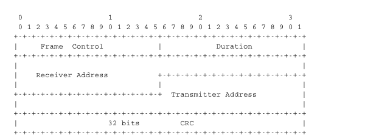
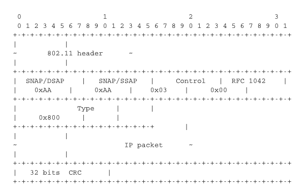

.. Copyright |copy| 2010 by Olivier Bonaventure
.. This file is licensed under a `creative commons licence <http://creativecommons.org/licenses/by/3.0/>`_

802.11 wireless networks
========================

The radio spectrum is a limited resource that must be shared by everyone. During most of the twentieth century, governments and international organisations have regulated most of the radio spectrum. This regulation controls the utilisation of the radio spectrum, in order to ensure that there are no interferences between different users. A company that wants to use a frequency range in a given region must apply for a license from the regulator. Most regulators charge a fee for the utilisation of the radio spectrum and some governments have encouraged competition among companies bidding for the same frequency to increase the license fees. 

In the 1970s, after the first experiments with ALOHANet, interest in wireless networks grew. Many experiments were done on and outside the ARPANet. One of these experiments was the `first mobile phone <http://news.bbc.co.uk/2/hi/programmes/click_online/8639590.stm>`_ , which was developed and tested in 1973. This experimental mobile phone was the starting point for the first generation analog mobile phones. Given the growing demand for mobile phones, it was clear that the analog mobile phone technology was not sufficient to support a large number of users.  To support more users and new services, researchers in several countries worked on the development of digital mobile telephones. In 1987, several European countries decided to develop the standards for a common cellular telephone system across Europe : the `Global System for Mobile Communications` (GSM). Since then, the standards have evolved and more than three billion users are connected to GSM networks today.

.. index:: WiFi

While most of the frequency ranges of the radio spectrum are reserved for specific applications and require a special licence, there are a few exceptions. These exceptions are known as the `Industrial, Scientific and Medical <http://en.wikipedia.org/wiki/ISM_band>`_ (ISM) radio bands. These bands can be used for industrial, scientific and medical applications without requiring a licence from the regulator. For example, some radio-controlled models use the 27 MHz ISM band and some cordless telephones operate in the 915 MHz ISM. In 1985, the 2.400-2.500 GHz band was added to the list of ISM bands. This frequency range corresponds to the frequencies that are emitted by microwave ovens. Sharing this band with licensed applications would have likely caused interferences, given the large number of microwave ovens that are used. Despite the risk of interferences with microwave ovens, the opening of the 2.400-2.500 GHz allowed the networking industry to develop several wireless network techniques to allow computers to exchange data without using cables. In this section, we discuss in more detail the most popular one, i.e. the WiFi [802.11]_ family of wireless networks. Other wireless networking techniques such as `BlueTooth <http://en.wikipedia.org/wiki/BlueTooth>`_ or `HiperLAN <http://en.wikipedia.org/wiki/HiperLAN>`_ use the same frequency range.

Today, WiFi is a very popular wireless networking technology. There are more than several hundreds of millions of WiFi devices. The development of this technology started in the late 1980s with the `WaveLAN <http://en.wikipedia.org/wiki/WaveLAN>`_ proprietary wireless network. WaveLAN operated at 2 Mbps and used different frequency bands in different regions of the world. In the early 1990s, the IEEE_ created the `802.11 working group <http://www.ieee802.org/11/>`_ to standardise a family of wireless network technologies. This working group was very prolific and produced several wireless networking standards that use different frequency ranges and different physical layers. The table below provides a summary of the main 802.11 standards.

========        =========       ==========      ===========     ==============
Standard	Frequency	Typical		Max		Range (m)
				throughput	bandwidth	indoor/outdoor
========        =========       ==========      ===========     ==============
802.11		2.4 GHz		0.9 Mbps	2 Mbps		20/100
802.11a		5 GHz		23 Mbps		54 Mbps		35/120
802.11b		2.4 GHz		4.3 Mbps	11 Mbps		38/140
802.11g		2.4 GHz		19 Mbps		54 Mbps		38/140
802.11n		2.4/5 GHz	74 Mbps		150 Mbps	70/250
========        =========       ==========      ===========     ==============

When developing its family of standards, the `IEEE 802.11 working group <http://www.ieee802.org/11/>`_ took a similar approach as the `IEEE 802.3 working group <http://www.ieee802.org/3/>`_ that developed various types of physical layers for Ethernet networks. 802.11 networks use the CSMA/CA Medium Access Control technique described earlier and they all assume the same architecture and use the same frame format.

.. index:: Basic Service Set (BSS), BSS, adhoc network, independent network

The architecture of WiFi networks is slightly different from the Local Area Networks that we have discussed until now. There are, in practice, two main types of WiFi networks : `independent` or `adhoc` networks  and `infrastructure` networks [#fBSS]_. An `independent` or `adhoc` network is composed of a set of devices that communicate with each other. These devices play the same role and the `adhoc` network is usually not connected to the global Internet. `Adhoc` networks are used when for example a few laptops need to exchange information or to connect a computer with a WiFi printer.

   
   An 802.11 independent or adhoc network

.. index:: infrastructure network

Most WiFi networks are `infrastructure` networks. An `infrastructure` network contains one or more `access points` that are attached to a fixed Local Area Network (usually an Ethernet network) that is connected to other networks such as the Internet. The figure below shows such a network with two access points and four WiFi devices. Each WiFi device is associated to one access point and uses this access point as a relay to exchange frames with the devices that are associated to another access point or reachable through the LAN.

   
   An 802.11 infrastructure network

An 802.11 access point is a relay that operates in the datalink layer like switches. The figure below represents the layers of the reference model that are involved when a WiFi host communicates with a host attached to an Ethernet network through an access point.

.. figure:: png/lan-fig-103-c.png
   :align: center
   :scale: 70
   
   An 802.11 access point

.. index:: 802.11 frame format

802.11 devices exchange variable length frames, which have a slightly different structure than the simple frame format used in Ethernet LANs. We review the key parts of the 802.11 frames. Additional details may be found in [802.11]_ and [Gast2002]_ . An 802.11 frame contains a fixed length header, a variable length payload that may contain up 2324 bytes of user data and a 32 bits CRC. Although the payload can contain up to 2324 bytes, most 802.11 deployments use a maximum payload size of 1500 bytes as they are used in `infrastructure` networks attached to Ethernet LANs. An 802.11 data frame is shown below.

   802.11 data frame format
 

The first part of the 802.11 header is the 16 bit `Frame Control` field. This field contains flags that indicate the type of frame (data frame, RTS/CTS, acknowledgement, management frames, etc), whether the frame is sent to or from a fixed LAN, etc [802.11]_. The `Duration` is a 16 bit field that is used to reserve the transmission channel. In data frames, the `Duration` field is usually set to the time required to transmit one acknowledgement frame after a SIFS delay. Note that the `Duration` field must be set to zero in multicast and broadcast frames. As these frames are not acknowledged, there is no need to reserve the transmission channel after their transmission. The `Sequence control` field contains a 12 bits sequence number that is incremented for each data frame.

The astute reader may have noticed that the 802.11 data frames contain three 48-bits address fields [#f4addresses]_ . This is surprising compared to other protocols in the network and datalink layers whose headers only contain a source and a destination address. The need for a third address in the 802.11 header comes from the `infrastructure` networks. In such a network, frames are usually exchanged between routers and servers attached to the LAN and WiFi devices attached to one of the access points. The role of the three address fields is specified by bit flags in the `Frame Control` field. 

When a frame is sent from a WiFi device to a server attached to the same LAN as the access point, the first address of the frame is set to the MAC address of the access point, the second address is set to the MAC address of the source WiFi device and the third address is the address of the final destination on the LAN. When the server replies, it sends an Ethernet frame whose source address is its MAC address and the destination address is the MAC address of the WiFi device. This frame is captured by the access point that converts the Ethernet header into an 802.11 frame header. The 802.11 frame sent by the access point contains three addresses : the first address is the MAC address of the destination WiFi device, the second address is the MAC address of the access point and the third address the MAC address of the server that sent the frame.

802.11 control frames are simpler than data frames. They contain a `Frame Control`, a `Duration` field and one or two addresses. The acknowledgement frames are very small. They only contain the address of the destination of the acknowledgement. There is no source address and no `Sequence Control` field in the acknowledgement frames. This is because the acknowledgement frame can easily be associated to the previous frame that it acknowledges. Indeed, each unicast data frame contains a `Duration` field that is used to reserve the transmission channel to ensure that no collision will affect the acknowledgement frame. The `Sequence Control` field is mainly used by the receiver to remove duplicate frames. Duplicate frames are detected as follows. Each data frame contains a 12 bits `Sequence Control` field and the `Frame Control` field contains the `Retry` bit flag that is set when a frame is transmitted.  Each 802.11 receiver stores the most recent sequence number received from each source address in frames whose `Retry` bit is reset. Upon reception of a frame with the `Retry` bit set, the receiver verifies its sequence number to determine whether it is a duplicated frame or not. 

   IEEE 802.11 ACK and CTS frames

.. index:: RTS frame (802.11), CTS frame (802.11)

802.11 RTS/CTS frames are used to reserve the transmission channel, in order to transmit one data frame and its acknowledgement. The RTS frames contain a `Duration` and the transmitter and receiver addresses. The `Duration` field of the RTS frame indicates the duration of the entire reservation (i.e. the time required to transmit the CTS, the data frame, the acknowledgements and the required SIFS delays). The CTS frame has the same format as the acknowledgement frame.

   IEEE 802.11 RTS frame format

.. note:: The 802.11 service

 Despite the utilization of acknowledgements, the 802.11 layer only provides an unreliable connectionless service like Ethernet networks that do not use acknowledgements. The 802.11 acknowledgements are used to minimize the probability of frame duplication. They do not guarantee that all frames will be correctly received by their recipients. Like Ethernet, 802.11 networks provide a high probability of successful delivery of the frames, not a guarantee. Furthermore, it should be noted that 802.11 networks do not use acknowledgements for multicast and broadcast frames. This implies that in practice such frames are more likely to suffer from transmission errors than unicast frames.

.. index:: beacon frame (802.11), Service Set Identity (SSID), SSID

In addition to the data and control frames that we have briefly described above, 802.11 networks use several types of management frames. These management frames are used for various purposes. We briefly describe some of these frames below. A detailed discussion may be found in [802.11]_ and [Gast2002]_. 
 

A first type of management frames are the `beacon` frames. These frames are broadcasted regularly by access points. Each `beacon frame` contains information about the capabilities of the access point (e.g. the supported 802.11 transmission rates) and a `Service Set Identity` (SSID). The SSID is a null-terminated ASCII string that can contain up to 32 characters. An access point may support several SSIDs and announce them in beacon frames. An access point may also choose to remain silent and not advertise beacon frames. In this case, WiFi stations may send `Probe request` frames to force the available access points to return a `Probe response` frame.

.. note:: IP over 802.11

 Two types of encapsulation schemes were defined to support IP in Ethernet networks : the original encapsulation scheme, built above the Ethernet DIX format is defined in :rfc:`894` and a second encapsulation :rfc:`1042` scheme, built above the LLC/SNAP protocol [802.2]_. In 802.11 networks, the situation is simpler and only the :rfc:`1042` encapsulation is used. In practice, this encapsulation adds 6 bytes to the 802.11 header. The first four bytes correspond to the LLC/SNAP header. They are followed by the two bytes Ethernet Type field (`0x800` for IP and `0x806` for ARP). The figure below shows an IP packet encapsulated in an 802.11 frame.

   IP over IEEE 802.11
 
The second important utilisation of the management frames is to allow a WiFi station to be associated with an access point. When a WiFi station starts, it listens to beacon frames to find the available SSIDs. To be allowed to send and receive frames via an access point, a WiFi station must be associated to this access point. If the access point does not use any security mechanism to secure the wireless transmission, the WiFi station simply sends an `Association request` frame to its preferred access point (usually the access point that it receives with the strongest radio signal). This frame contains some parameters chosen by the WiFi station and the SSID that it requests to join. The access point replies with an `Association response frame` if it accepts the WiFI station. 

.. rubric:: Footnotes

.. [#fBSS] The 802.11 working group defined the `basic service set (BSS)` as a group of devices that communicate with each other. We continue to use `network` when referring to a set of devices that communicate.

.. [#f4addresses] In fact, the [802.11]_ frame format contains a fourth optional address field. This fourth address is only used when an 802.11 wireless network is used to interconnect bridges attached to two classical LAN networks.

.. include:: ../links.rst

