.. Copyright |copy| 2010 by Olivier Bonaventure
.. This file is licensed under a `creative commons licence <http://creativecommons.org/licenses/by-sa/3.0/>`_

Interdomain routing
===================

As explained earlier, the Internet is composed of more than 30,000 different networks [#fasnum]_ called `domains`. Each domain is composed of a group of routers and hosts that are managed by the same organisation. Example domains include belnet_, sprint_, level3_, geant_, abilene_ cisco_, google_ ... 

.. index:: stub domain, transit domain

.. comment:: In the paragraph below it says: "As of this writing, there are about 85% of stub domains in the Internet". Does this mean: "About 85% of the Internet is made up of stub-domains" ??

Each domain contains a set of routers. From a routing point of view, these domains can be divided into two classes : the `transit` and the `stub` domains. A `stub` domain sends and receives packets whose source or destination are one of its own hosts. A `transit` domain is a domain that provides a transit service for other domains, i.e. the routers in this domain forward packets whose source and destination do not belong to the transit domain. As of this writing, there are about 85% of stub domains in the Internet [#fpotaroo]_. A `stub` domain that is connected to a single transit domain is called a `single-homed stub`. A `multihomed stub` is a `stub` domain connected to two or more transit providers.

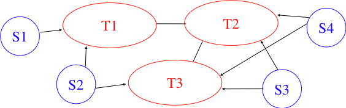
   
   Transit and stub domains 

The stub domains can be further classified by considering whether they mainly send or receive packets. An `access-rich` stub domain is a domain that contains hosts that mainly receive packets. Typical examples include small ADSL- or cable modem-based Internet Service Providers or enterprise networks. On the other hand, a `content-rich` stub domain is a domain that mainly produces packets. Examples of `content-rich` stub domains include google_, yahoo_, microsoft_, facebook_ or content distribution networks such as akamai_ or limelight_ For the last few years, we have seen a rapid growth of these `content-rich` stub domains. Recent measurements [ATLAS2009]_ indicate that a growing fraction of all the packets exchanged on the Internet are produced in the data centers managed by these content providers.

Domains need to be interconnected to allow a host inside a domain to exchange IP packets with hosts located in other domains. From a physical perspective, domains can be interconnected in two different ways. The first solution is to directly connect a router belonging to the first domain with a router inside the second domain. Such links between domains are called private interdomain links or `private peering links`. In practice, for redundancy or performance reasons, distinct physical links are usually established between different routers in the two domains that are interconnected.

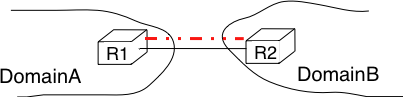
   
   Interconnection of two domains via a private peering link 

Such `private peering links` are useful when, for example, an enterprise or university network needs to be connected to its Internet Service Provider. However, some domains are connected to hundreds of other domains [#fasrank]_ . For some of these domains, using only private peering links would be too costly. A better solution to allow many domains to interconnect cheaply are the `Internet eXchange Points` (:term:`IXP`). An :term:`IXP` is usually some space in a data center that hosts routers belonging to different domains. A domain willing to exchange packets with other domains present at the :term:`IXP` installs one of its routers on the :term:`IXP` and connects it to other routers inside its own network. The IXP contains a Local Area Network to which all the participating routers are connected. When two domains that are present at the IXP wish [#fwish]_ to exchange packets, they simply use the Local Area Network. IXPs are very popular in Europe and many Internet Service Providers and Content providers are present in these IXPs.

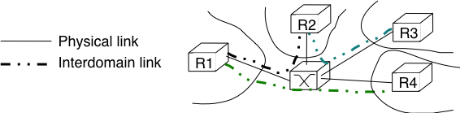
   
   Interconnection of two domains at an Internet eXchange Point

In the early days of the Internet, domains would simply exchange all the routes they know to allow a host inside one domain to reach any host in the global Internet. However, in today's highly commercial Internet, this is no longer true as interdomain routing mainly needs to take into account the economical relationships between the domains. Furthermore, while intradomain routing usually prefers some routes over others based on their technical merits (e.g. prefer route with the minimum number of hops, prefer route with the minimum delay, prefer high bandwidth routes over low bandwidth ones, etc) interdomain routing mainly deals with economical issues. For interdomain routing, the cost of using a route is often more important than the quality of the route measured by its delay or bandwidth.

There are different types of economical relationships that can exist between domains. Interdomain routing converts these relationships into peering relationships between domains that are connected via peering links. 

.. index:: customer-provider peering relationship

The first category of peering relationship is the `customer->provider` relationship. Such a relationship is used when a customer domain pays an Internet Service Provider to be able to exchange packets with the global Internet over an interdomain link. A similar relationship is used when a small Internet Service Provider pays a larger Internet Service Provider to exchange packets with the global Internet. 

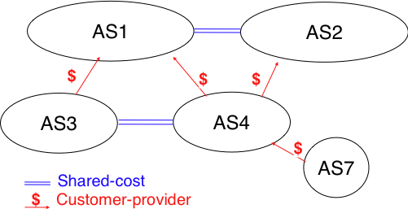
   
   A simple Internet with peering relationships

To understand the `customer->provider` relationship, let us consider the simple internetwork shown in the figure above. In this internetwork, `AS7` is a stub domain that is connected to one provider : `AS4`. The contract between `AS4` and `AS7` allows a host inside `AS7` to exchange packets with any host in the internetwork. To enable this exchange of packets, `AS7` must know a route towards any domain and all the domains of the internetwork must know a route via `AS4` that allows them to reach hosts inside `AS7`. From a routing perspective, the commercial contract between `AS7` and `AS4` leads to the following routes being exchanged :

 - over a `customer->provider` relationship, the `customer` domain advertises to its `provider`  all its routes and all the routes that it has learned from its own customers.
 - over a `provider->customer` relationship, the `provider` advertises all the routes that it knows to its `customer`

The second rule ensures that the customer domain receives a route towards all destinations that are reachable via its provider. The first rule allows the routes of the customer domain to be distributed throughout the Internet.

Coming back to the figure above, `AS4` advertises to its two providers `AS1` and `AS2` its own routes and the routes learned from its customer, `AS7`. On the other hand, `AS4` advertises to `AS7` all the routes that it knows. 

.. index:: shared-cost peering relationship

The second type of peering relationship is the `shared-cost` peering relationship. Such a relationship usually does not involve a payment from one domain to the other in contrast with the `customer->provider` relationship. A `shared-cost` peering relationship is usually established between domains having a similar size and geographic coverage. For example, consider the figure above. If `AS3` and `AS4` exchange many packets via `AS1`, they both need to pay `AS1`. A cheaper alternative for `AS3` and `AS4` would be to establish a `shared-cost` peering. Such a peering can be established at IXPs where both `AS3` and `AS4` are present or by using private peering links. This `shared-cost` peering should be used to exchange packets between hosts inside `AS3` and hosts inside `AS4`. However, `AS3` does not want to receive on the `AS3-AS4` `shared-cost` peering links packets whose destination belongs to `AS1` as `AS3` would have to pay to send these packets to `AS1`. 

From a routing perspective, over a `shared-cost` peering relationship a domain only advertises its internal routes and the routes that it has learned from its customers. This restriction ensures that only packets destined to the local domain or one of its customers is received over the `shared-cost` peering relationship. This implies that the routes that have been learned from a provider or from another `shared-cost` peer is not advertised over a `shared-cost` peering relationship. This is motivated by economical reasons. If a domain were to advertise the routes that it learned from a provider over a `shared-cost` peering relationship that does not bring revenue, it would have allowed its `shared-cost` peer to use the link with its provider without any payment. If a domain were to advertise the routes it learned over a `shared cost` peering over another `shared-cost` peering relationship, it would have allowed these `shared-cost` peers to use its own network (which may span one or more continents) freely to exchange packets.

.. index:: sibling peering relationship

Finally, the last type of peering relationship is the `sibling`. Such a relationship is used when two domains exchange all their routes in both directions. In practice, such a relationship is only used between domains that belong to the same company.

.. index:: interdomain routing policy

These different types of relationships are implemented in the `interdomain routing policies` defined by each domain. The `interdomain routing policy` of a domain is composed of three main parts :

 - the `import filter` that specifies, for each peering relationship, the routes that can be accepted from the neighbouring domain (the non-acceptable routes are ignored and the domain never uses them to forward packets)
 - the `export filter` that specifies, for each peering relationship, the routes that can be advertised to the neighbouring domain 
 - the `ranking` algorithm that is used to select the best route among all the routes that the domain has received towards the same destination prefix 

.. index:: import policy, export policy

A domain's import and export filters can be defined by using the Route Policy Specification Language (RPSL) specified in :rfc:`2622` [GAVE1999]_ . Some Internet Service Providers, notably in Europe, use RPSL to document [#fripedb]_ their import and export policies. Several tools help to easily convert a RPSL policy into router commands. 

The figure below provides a simple example of import and export filters for two domains in a simple internetwork. In RPSL, the keyword `ANY` is used to replace any route from any domain. It is typically used by a provider to indicate that it announces all its routes to a customer over a `provider->customer` relationship. This is the case for `AS4`'s export policy. The example below clearly shows the difference between a `provider->customer` and a `shared-cost` peering relationship. `AS4`'s export filter indicates that it announces only its internal routes (`AS4`) and the routes learned from its clients (`AS7`) over its `shared-cost` peering with `AS3`, while it advertises all the routes that it uses (including the routes learned from `AS3`) to `AS7`. 

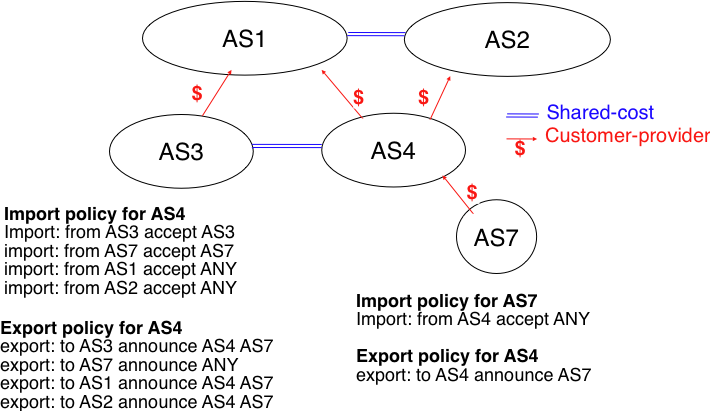
   
   Import and export policies 

.. index:: BGP, Border Gateway Protocol

The Border Gateway Protocol
---------------------------

The Internet uses a single interdomain routing protocol : the Border Gateway Protocol (BGP). The current version of BGP is defined in :rfc:`4271`. BGP differs from the intradomain routing protocols that we have already discussed in several ways. First, BGP is a `path-vector` protocol. When a BGP router advertises a route towards a prefix, it announces the IP prefix and the interdomain path used to reach this prefix. From BGP's point of view, each domain is identified by a unique `Autonomous System` (AS) number [#fasdomain]_ and the interdomain path contains the AS numbers of the transit domains that are used to reach the associated prefix. This interdomain path is called the `AS Path`. Thanks to these AS-Paths, BGP does not suffer from the count-to-infinity problems that affect distance vector routing protocols. Furthermore, the AS-Path can be used to implement some routing policies. Another difference between BGP and the intradomain routing protocols is that a BGP router does not send the entire contents of its routing table to its neighbours regularly. Given the size of the global Internet, routers would be overloaded by the number of BGP messages that they would need to process. BGP uses incremental updates, i.e. it only announces the routes that have changed to its neighbours.

The figure below shows a simple example of the BGP routes that are exchanged between domains. In this example, prefix `1.0.0.0/8` is announced by `AS1`. `AS1` advertises a BGP route towards this prefix to `AS2`. The AS-Path of this route indicates that `AS1` is the originator of the prefix. When `AS4` receives the BGP route from `AS1`, it re-announces it to `AS2` and adds its AS number to the AS-Path. `AS2` has learned two routes towards prefix `1.0.0.0/8`. It compares the two routes and prefers the route learned from `AS4` based on its own ranking algorithm. `AS2` advertises to `AS5` a route towards `1.0.0.0/8` with its AS-Path set to `AS2:AS4:AS1`. Thanks to the AS-Path, `AS5` knows that if it sends a packet towards `1.0.0.0/8` the packet first passes through `AS2`, then through `AS4` before reaching its destination inside `AS1`.

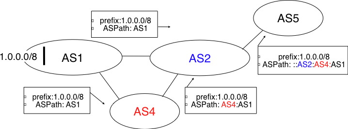
   
   Simple exchange of BGP routes 

.. index:: BGP peer

BGP routers exchange routes over BGP sessions. A BGP session is established between two routers belonging to two different domains that are directly connected. As explained earlier, the physical connection between the two routers can be implemented as a private peering link or over an Internet eXchange Point. A BGP session between two adjacent routers runs above a TCP connection (the default BGP port is 179). In contrast with intradomain routing protocols that exchange IP packets or UDP segments, BGP runs above TCP because TCP ensures a reliable delivery of the BGP messages sent by each router without forcing the routers to implement acknowledgements, checksums, etc. Furthermore, the two routers consider the peering link to be up as long as the BGP session and the underlying TCP connection remain up [#flifetimebgp]_. The two endpoints of a BGP session are called `BGP peers`.

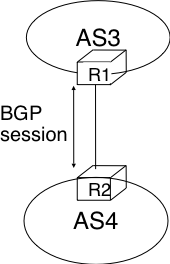
   
   A BGP peering session between two directly connected routers

In practice, to establish a BGP session between routers `R1` and `R2` in the figure above, the network administrator of `AS3` must first configure on `R1` the IP address of `R2` on the `R1-R2` link and the AS number of `R2`. Router `R1` then regularly tries to establish the BGP session with `R2`. `R2` only agrees to establish the BGP session with `R1` once it has been configured with the IP address of `R1` and its AS number. For security reasons, a router never establishes a BGP session that has not been manually configured on the router. 

.. index:: BGP OPEN, BGP NOTIFICATION, BGP KEEPALIVE, BGP UPDATE

The BGP protocol :rfc:`4271` defines several types of messages that can be exchanged over a BGP session :

 - `OPEN` : this message is sent as soon as the TCP connection between the two routers has been established. It initialises the BGP session and allows the negotiation of some options. Details about this message may be found in :rfc:`4271`
 - `NOTIFICATION` : this message is used to terminate a BGP session, usually because an error has been detected by the BGP peer. A router that sends or receives a `NOTIFICATION` message immediately shutdowns the corresponding BGP session.
 - `UPDATE`: this message is used to advertise new or modified routes or to withdraw previously advertised routes.
 - `KEEPALIVE` : this message is used to ensure a regular exchange of messages on the BGP session, even when no route changes. When a BGP router has not sent an `UPDATE` message during the last 30 seconds, it shall send a `KEEPALIVE` message to confirm to the other peer that it is still up. If a peer does not receive any BGP message during a period of 90 seconds [#fdefaultkeepalive]_, the BGP session is considered to be down and all the routes learned over this session are withdrawn. 

As explained earlier, BGP relies on incremental updates. This implies that when a BGP session starts, each router first sends BGP `UPDATE` messages to advertise to the other peer all the exportable routes that it knows. Once all these routes have been advertised, the BGP router only sends BGP `UPDATE` messages about a prefix if the route is new, one of its attributes has changed or the route became unreachable and must be withdrawn. The BGP `UPDATE` message allows BGP routers to efficiently exchange such information while minimising the number of bytes exchanged. Each `UPDATE` message contains :

 - a list of IP prefixes that are withdrawn
 - a list of IP prefixes that are (re-)advertised
 - the set of attributes (e.g. AS-Path) associated to the advertised prefixes

In the remainder of this chapter, and although all routing information is exchanged using BGP `UPDATE` messages, we assume for simplicity that a BGP message contains only information about one prefix and we use the words :

 - `Withdraw message` to indicate a BGP `UPDATE` message containing one route that is withdrawn 
 - `Update message` to indicate a BGP `UPDATE` containing a new or updated route towards one destination prefix with its attributes 

.. index:: BGP Adj-RIB-In, BGP Adj-RIB-Out, BGP RIB

From a conceptual point of view, a BGP router connected to `N` BGP peers, can be described as being composed of four parts as shown in the figure below.

.. _bgprouter:

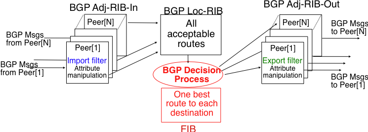
   
   Organisation of a BGP router 

In this figure, the router receives BGP messages on the left part of the figure, processes these messages and possibly sends BGP messages on the right part of the figure. A BGP router contains three important data structures :

 - the `Adj-RIB-In` contains the BGP routes that have been received from each BGP peer. The routes in the `Adj-RIB-In` are filtered by the `import filter` before being placed in the `BGP-Loc-RIB`. There is one `import filter` per BGP peer.
 - the `Local Routing Information Base` (`Loc-RIB`) contains all the routes that are considered as acceptable by the router. The `Loc-RIB` may contain several routes, learned from different BGP peers, towards the same destination prefix.
 - the `Forwarding Information Base` (`FIB`) is used by the dataplane to forward packets towards their destination. The `FIB` contains, for each destination, the best route that has been selected by the `BGP decision process`. This decision process is an algorithm that selects, for each destination prefix, the best route according to the router's ranking algorithm that is part of its policy.
 - the `Adj-RIB-Out` contains the BGP routes that have been advertised to each BGP peer. The `Adj-RIB-Out` for a given peer is built by applying the peer`s `export filter` on the routes that have been installed in the `FIB`. There is one `export filter` per BGP peer. For this reason, the Adj-RIB-Out of a peer may contain different routes than the Adj-RIB-Out of another peer.

When a BGP session starts, the routers first exchange `OPEN` messages to negotiate the options that apply throughout the entire session. Then, each router extracts from its FIB the routes to be advertised to the peer. It is important to note that, for each known destination prefix, a BGP router can only advertise to a peer the route that it has itself installed inside its `FIB`. The routes that are advertised to a peer must pass the peer's `export filter`. The `export filter` is a set of rules that define which routes can be advertised over the corresponding session, possibly after having modified some of its attributes. One `export filter` is associated to each BGP session. For example, on a `shared-cost peering`, the `export filter` only selects the internal routes and the routes that have been learned from a `customer`. The pseudo-code below shows the initialisation of a BGP session.

.. code-block:: c

 Initialize_BGP_Session(RemoteAS, RemoteIP)
 { 
  /* Initialize and start BGP session */
  /* Send BGP OPEN Message to RemoteIP on port 179 */
  /* Follow BGP state machine */ 
  /* advertise local routes and routes learned from peers*/
 foreach (destination=d inside BGP Loc-RIB)
 {
  B=build_BGP_UPDATE(d); // best path
  S=apply_export_filter(RemoteAS,B);
  if (S<>NULL)
	{  /* send UPDATE message */
	   send_UPDATE(S,RemoteAS, RemoteIP) 
        }
  }	
 /* entire RIB has been sent */
 /* new UPDATE will be sent only to reflect local or distant
   changes in routes */
 ...
 }

In the above pseudo-code, the `build\_BGP\_UPDATE(d)` procedure extracts from the `BGP Loc-RIB`

the best path towards destination `d` (i.e. the route installed in the FIB) and prepares the corresponding BGP `UPDATE` message. This message is then passed to the `export filter` that returns NULL if the route cannot be advertised to the peer or the (possibly modified) BGP `UPDATE` message to be advertised. BGP routers allow network administrators to specify very complex `export filters`, see e.g. [WMS2004]_. A simple `export filter` that implements the equivalent of `split horizon` is shown below.

.. code-block:: c

 BGPMsg Apply_export_filter(RemoteAS, BGPMsg)
 { /* check if Remote AS already received route */
 if (RemoteAS isin BGPMsg.ASPath)
   BGPMsg==NULL;
  /* Many additional export policies can be configured : */
  /* Accept or refuse the BGPMsg */
  /* Modify selected attributes inside BGPMsg */
 }

At this point, the remote router has received all the exportable BGP routes. After this initial exchange, the router only sends `BGP UPDATE` messages when there is a change (addition of a route, removal of a route or change in the attributes of a route) in one of these exportable routes. Such a change can happen when the router receives a BGP message. The pseudo-code below summarizes the processing of these BGP messages.

.. code-block:: c

 Recvd_BGPMsg(Msg, RemoteAS)
 { 
  B=apply_import_filer(Msg,RemoteAS);
  if (B==NULL) /* Msg not acceptable */
	exit();
  if IsUPDATE(Msg)
  { 
   Old_Route=BestRoute(Msg.prefix); 
   Insert_in_RIB(Msg);
   Run_Decision_Process(RIB);
   if (BestRoute(Msg.prefix)<>Old_Route)
   { /* best route changed */
    B=build_BGP_Message(Msg.prefix);
    S=apply_export_filter(RemoteAS,B);
    if (S<>NULL) /* announce best route */
	send_UPDATE(S,RemoteAS);     
    else if (Old_Route<>NULL) 
     send_WITHDRAW(Msg.prefix);
   } 
  if IsWITHDRAW(Msg)
  { 
   Old_Route=BestRoute(Msg.prefix); 
   Remove_from_RIB(Msg);
   Run_Decision_Process(RIB);
   if (Best_Route(Msg.prefix)<>Old_Route)
   { /* best route changed */
     B=build_BGP_Message(d);
     S=apply_export_filter(RemoteAS,B);
     if (S<>NULL) /* still one best route */
       send_UPDATE(S,RemoteAS, RemoteIP);
     else if(Old_Route<>NULL)/* no best route anymore */
       send_WITHDRAW(Msg.prefix,RemoteAS,RemoteIP);
   }
  }
 }     

When a BGP message is received, the router first applies the peer's `import filter` to verify whether the message is acceptable or not. If the message is not acceptable, the processing stops. The pseudo-code below shows a simple `import filter`. This `import filter` accepts all routes, except those that already contain the local AS in their AS-Path. If such a route was used, it would cause a routing loop. Another example of an `import filter` would be a filter used by an Internet Service Provider on a session with a customer to only accept routes towards the IP prefixes assigned to the customer by the provider. On real routers, `import filters` can be much more complex and some `import filters` modify the attributes of the received BGP `UPDATE` [WMS2004]_ .

.. code-block:: c

 BGPMsg apply_import_filter(RemoteAS, BGPMsg)
 { /* check that we are not already inside  ASPath */ 
  if (MyAS isin BGPMsg.ASPath)
   BGPMsg==NULL;
  /* Many additional import policies can be configured : */
  /* Accept or refuse the BGPMsg */
  /* Modify selected attributes inside BGPMsg */
 }

.. note:: The bogon filters

 Another example of frequently used `import filters` are the filters that Internet Service Providers use to ignore bogon routes. In the ISP community, a bogon route is a route that should not be advertised on the global Internet. Typical examples include the private IPv4 prefixes defined in :rfc:`1918`, the loopback prefixes (`127.0.0.1/8` and `::1/128`) or the IP prefixes that have not yet been allocated by IANA. A well managed BGP router should ensure that it never advertises bogons on the global Internet. Detailed information about these bogons may be found at http://www.team-cymru.org/Services/Bogons/

If the import filter accepts the BGP message, the pseudo-code distinguishes two cases. If this is an `Update message` for prefix `p`, this can be a new route for this prefix or a modification of the route's attributes. The router first retrieves from its `RIB` the best route towards prefix `p`. Then, the new route is inserted in the `RIB` and the `BGP decision process` is run to find whether the best route towards destination `p` changes. A BGP message only needs to be sent to the router's peers if the best route has changed. For each peer, the router applies the  `export filter` to verify whether the route can be advertised. If yes, the filtered BGP message is sent. Otherwise, a `Withdraw message` is sent. When the router receives a `Withdraw message`, it also verifies whether the removal of the route from its `RIB` caused its best route towards this prefix to change. It should be noted that, depending on the content of the `RIB` and the `export filters`, a BGP router may need to send a `Withdraw message` to a peer after having received an `Update message` from another peer and conversely.

Let us now discuss in more detail the operation of BGP in an IPv4 network. For this, let us consider the simple network composed of three routers located in three different ASes and shown in the figure below.

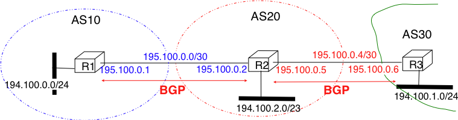
   
   Utilisation of the BGP nexthop attribute

This network contains three routers : `R1`, `R2` and `R3`. Each router is attached to a local IPv4 subnet that it advertises using BGP. There are two BGP sessions, one between `R1` and `R2` and the second between `R2` and `R3`. A `/30` subnet is used on each interdomain link (`195.100.0.0/30` on `R1-R2` and `195.100.0.4/30` on `R2-R3`). The BGP sessions run above TCP connections established between the neighbouring routers (e.g. `195.100.0.1 - 195.100.0.2` for the `R1-R2` session).

.. index:: BGP nexthop

Let us assume that the `R1-R2` BGP session is the first to be established. A `BGP Update` message sent on such a session contains three fields :

 - the advertised prefix
 - the `BGP nexthop`
 - the attributes including the AS-Path 

We use the notation `U(prefix, nexthop, attributes)` to represent such a `BGP Update` message in this section. Similarly, `W(prefix)` represents a `BGP withdraw` for the specified prefix. Once the `R1-R2` session has been established, `R1` sends `U(194.100.0.0/24,195.100.0.1,AS10)` to `R2` and `R2` sends `U(194.100.2.0/23,195.100.0.2,AS20)`. At this point, `R1` can reach `194.100.2.0/23` via `195.100.0.2` and `R2` can reach `194.100.0.0/24` via `195.100.0.1`.

Once the `R2-R3` has been established, `R3` sends `U(194.100.1.0/24,195.100.0.6,AS30)`. `R2` announces on the `R2-R3` session all the routes inside its RIB. It thus sends to `R3` : `U(194.100.0.0/24,195.100.0.5,AS20:AS10)` and `U(194.100.2.0/23,195.100.0.5,AS20)`. Note that when `R2` advertises the route that it learned from `R1`, it updates the BGP nexthop and adds its AS number to the AS-Path. `R2` also sends `U(194.100.1.0/24,195.100.0.2,AS20:AS30)` to `R1` on the `R1-R3` session. At this point, all BGP routes have been exchanged and all routers can reach `194.100.0.0/24`, `194.100.2.0/23` and `194.100.1.0/24`.

If the link between `R2` and `R3` fails, `R3` detects the failure as it did not receive `KEEPALIVE` messages recently from `R2`. At this time, `R3` removes from its RIB all the routes learned over the `R2-R3` BGP session. `R2` also removes from its RIB the routes learned from `R3`. `R2` also sends  `W(194.100.1.0/24)` to `R1` over the `R1-R3` BGP session since it does not have a route anymore towards this prefix.

.. note:: Origin of the routes advertised by a BGP router

 A frequent practical question about the operation of BGP is how a BGP router decides to originate or advertise a route for the first time. In practice, this occurs in two situations :

  - the router has been manually configured by the network operator to always advertise one or several routes on a BGP session. For example, on the BGP session between UCLouvain and its provider, belnet_ , UCLouvain's router always advertises the `130.104.0.0/16` IPv4 prefix assigned to the campus network
  - the router has been configured by the network operator to advertise over its BGP session some of the routes that it learns with its intradomain routing protocol. For example, an enterprise router may advertise over a BGP session with its provider the routes to remote sites when these routes are reachable and advertised by the intradomain routing protocol

 The first solution is the most frequent. Advertising routes learned from an intradomain routing protocol is not recommended, this is because if the route flaps [#fflap]_, this would cause a large number of BGP messages being exchanged in the global Internet.

Most networks that use BGP contain more than one router. For example, consider the network shown in the figure below where `AS20` contains two routers attached to interdomain links : `R2` and `R4`. In this network, two routing protocols are used by `R2` and `R4`. They use an intradomain routing protocol such as OSPF to distribute the routes towards the internal prefixes : `195.100.0.8/30`, `195.100.0.0/30`, ... `R2` and `R4` also use BGP. `R2` receives the routes advertised by `AS10` while `R4` receives the routes advertised by `AS30`. These two routers need to exchange the routes that they have respectively received over their BGP sessions. 

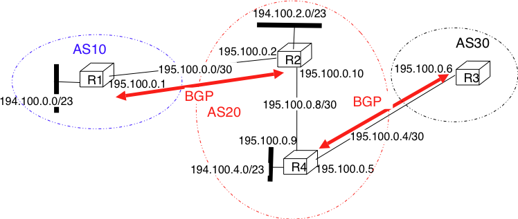
   
   A larger network using BGP

A first solution to allow `R2` and `R3` to exchange the interdomain routes that they have learned over their respective BGP sessions would be to configure the intradomain routing protocol to distribute inside `AS20` the routes learned over the BGP sessions. Although current routers support this feature, this is a bad solution for two reasons :

 1. Intradomain routing protocols cannot distribute the attributes that are attached to a BGP route. If `R4` received via the intradomain routing protocol a route towards `194.100.0.0/23` that `R2` learned via BGP, it would not know that the route was originated by `AS10` and the only advertisement that it could send to `R3` would contain an incorrect AS-Path
 2. Intradomain routing protocols have not been designed to support the hundreds of thousands of routes that a BGP router can receive on today's global Internet.

.. index:: eBGP, iBGP

The best solution to allow BGP routers to distribute, inside an AS, all the routes learned over BGP sessions is to establish BGP sessions among all the BGP routers inside the AS. In practice, there are two types of BGP sessions :

 - :term:`eBGP` session or `external BGP session`. Such a BGP session is established between two routers that are directly connected and belong to two different domains.
 - :term:`iBGP` session or `internal BGP session`. Such a BGP session is established between two routers belonging to the same domain. These two routers do not need to be directly connected.

In practice, each BGP router inside a domain maintains an `iBGP session` with every other BGP router in the domain [#frr]_. This creates a full-mesh of `iBGP sessions` among all BGP routers of the domain. `iBGP sessions`, like `eBGP sessions` run over TCP connections. Note that in contrast with `eBGP sessions` that are established between directly connected routers, `iBGP sessions` are often established between routers that are not directly connected.

An important point to note about `iBGP sessions` is that a BGP router only advertises a route over an `iBGP session` provided that :

 - the router uses this route to forward packets, and
 - the route was learned over one of the router's `eBGP sessions`

A BGP router does not advertise a route that it has learned over an `iBGP session` over another `iBGP session`. Note that a router can, of course, advertise over an `eBGP session` a route that it has learned over an `iBGP session`. This difference between the behaviour of a BGP router over `iBGP` and `eBGP` session is due to the utilisation of a full-mesh of `iBGP sessions`. Consider a network containing three BGP routers : `A`, `B` and `C` interconnected via a full-mesh of iBGP sessions. If router `A` learns a route towards prefix `p` from router `B`, router `A` does not need to advertise the received route to router `C` since router `C` also learns the same route over the `C-B` `iBGP session`.

To understand the utilisation of an `iBGP session`, let us consider what happens when router `R1` sends `U(194.100.0.0/23,195.100.0.1,AS10)` in the network shown below. This BGP message is processed by `R2` which advertises it over its `iBGP session` with `R4`. The `BGP Update` sent by `R2` contains the same nexthop and the same AS-Path as in the `BGP Update` received by `R2`. `R4` then sends `U(194.100.0.0/23,195.100.0.5,AS20:AS10)` to `R3`. Note that the BGP nexthop and the AS-Path are only updated [#fnexthopself]_ when a BGP route is advertised over an `eBGP session`.

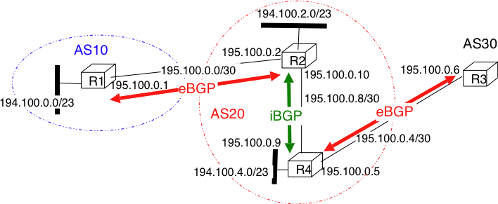
   
   iBGP and eBGP sessions

.. index:: loopback interface

.. comment:: For me, this note on the loopback isn't quite clear. I remember having trouble with it, when I first read this.

.. note:: Loopback interfaces and iBGP sessions

 In addition to their physical interfaces, routers can also be configured with a special loopback interface. A loopback interface is a software interface that is always up. When a loopback interface is configured on a router, the address associated to this interface is advertised by the intradomain routing protocol inside the domain. Thus, the IP address associated to a loopback interface is always reachable while an IP address associated to a physical interface becomes unreachable as soon as the corresponding physical interface fails. `iBGP sessions` are usually established using the router's loopback addresses as endpoints. This allows the `iBGP session` and its underlying TCP connection to remain up even if physical interfaces fail on the routers.

.. example route not selected ?

Now that routers can learn interdomain routes over iBGP and eBGP sessions, let us examine what happens when router `R3` sends a packet destined to `194.100.1.234`. `R3` forwards this packet to `R4`.  `R4` uses an intradomain routing protocol and BGP. Its BGP routing table contains the following longest prefix match : 

 - `194.100.0.0/23` via `195.100.0.1`

This routes indicates that to forward a packet towards `194.100.0.0/23`, `R4` needs to forward the packet along the route towards `195.100.0.1`. However, `R4` is not directly connected to `195.100.0.1`. `R4` learned a route that matches this address thanks to its intradomain routing protocol that distributed the following routes :

 - `195.100.0.0/30`  via `195.100.0.10`
 - `195.100.0.4/30`  East
 - `195.100.0.8/30`  North
 - `194.100.2.0/23`  via `195.100.0.10`
 - `194.100.0.4/23`  West

To build its forwarding table, `R4` must combine the routes learned from the intradomain routing protocol with the routes learned from BGP. Thanks to its intradomain routing table, for each interdomain route `R4` replaces the BGP nexthop with its shortest path computed by the intradomain routing protocol. In the figure above, `R4` forwards packets to `194.100.0.0/23` via `195.100.0.10` to which it is directly connected via its North interface. `R4` 's resulting forwarding table, which associates an outgoing interface for a directly connected prefix or a directly connected nexthop and an outgoing interface for prefixes learned via BGP, is shown below :

 - `194.100.0.0/23`  via `195.100.0.10` (North)
 - `195.100.0.0/30`  via `195.100.0.10` (North)
 - `195.100.0.4/30`  East
 - `195.100.0.8/30`  North
 - `194.100.2.0/23`  via `195.100.0.10` (North)
 - `194.100.4.0/23`  West

There is thus a coupling between the interdomain and the intradomain routing tables. If the intradomain routes change, e.g. due to link failures or changes in link metrics, then the forwarding table must be updated on each router as the shortest path towards a BGP nexthop may have changed.

The last point to be discussed before looking at the BGP decision process is that a network may contain routers that do not maintain any eBGP session. These routers can be stub routers attached to a single router in the network or core routers that reside on the path between two border routers that are using BGP as illustrated in the figure below.

.. figure:: png/network-fig-144-c.png
   :align: center
   :scale: 70
   
   How to deal with non-BGP routers ?

In the scenario above, router `R2` needs to be able to forward a packet towards any destination in the `12.0.0.0/8` prefix inside `AS30`. Such a packet would need to be forwarded by router `R5` since this router resides on the path between `R2` and its BGP nexthop attached to `R4`. Two solutions can be used to ensure that `R2` is able to forward such interdomain packets :

 - enable BGP on router `R5` and include this router in the `iBGP` full-mesh. Two iBGP sessions would be added in the figure above : `R2-R5` and `R4-R5`. This solution works and is used by many ASes. However, it forces all routers to have enough resources (CPU and memory) to run BGP and maintain a large forwarding table
 - encapsulate the interdomain packets sent through the AS so that router `R5` never needs to forward a packet whose destination is outside the local AS. Different encapsulation mechanisms exist. MultiProtocol Label Switching (MPLS) :rfc:`3031` and the Layer 2 Tunneling Protocol (L2TP) :rfc:`3931` are frequently used in large domains, but a detailed explanation of these techniques is outside the scope of this section. The simplest encapsulation scheme to understand is in IP in IP defined in :rfc:`2003`. This encapsulation scheme places an IP packet (called the inner packet), including its payload, as the payload of a larger IP packet (called the outer packet). It can be used by border routers to forward packets via routers that do not maintain a BGP routing table. For example, in the figure above, if router `R2` needs to forward a packet towards destination `12.0.0.1`, it can add at the front of this packet an IPv4 header whose source address is set to one of its IPv4 addresses and whose destination address is one of the IPv4 addresses of `R4`. The `Protocol` field of the IP header is set to `4` to indicate that it contains an IPv4 packet. The packet is forwarded by `R5` to `R4` based on the forwarding table that it built thanks to its intradomain routing table. Upon reception of the packet, `R4` removes the outer header and consults its (BGP) forwarding table to forward the packet towards `R3`. 

.. index:: BGP decision process

The BGP decision process
........................

Besides the import and export filters, a key difference between BGP and the intradomain routing protocols is that each domain can define is own ranking algorithm to determine which route is chosen to forward packets when several routes have been learned towards the same prefix. This ranking depends on several BGP attributes that can be attached to a BGP route.

.. index:: BGP local-preference

The first BGP attribute that is used to rank BGP routes is the `local-preference` (local-pref) attribute. This attribute is an unsigned integer that is attached to each BGP route received over an eBGP session by the associated import filter.

When comparing routes towards the same destination prefix, a BGP router always prefers the routes with the highest `local-pref`. If the BGP router knows several routes with the same `local-pref`, it prefers among the routes having this `local-pref` the ones with the shortest AS-Path.

The `local-pref` attribute is often used to prefer some routes over others. This attribute is always present inside `BGP Updates` exchanged over `iBGP sessions`, but never present in the messages exchanged over `eBGP sessions`. 

A common utilisation of `local-pref` is to support backup links. Consider the situation depicted in the figure below. `AS1` would always like to use the high bandwidth link to send and receive packets via `AS2` and only use the backup link upon failure of the primary one.

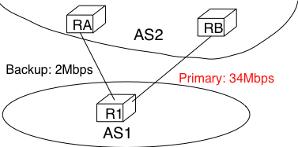
   
   How to create a backup link with BGP ?

As BGP routers always prefer the routes with the highest `local-pref` attribute, this policy can be implemented using the following import filter on `R1`

.. code-block:: text

 import: from  AS2 RA at R1 set localpref=100;
         from  AS2 RB at R1 set localpref=200;
         accept ANY

With this import filter, all the BGP routes learned from `RB` over the high bandwidth links are preferred over the routes learned over the backup link. If the primary link fails, the corresponding routes are removed from `R1`'s RIB and `R1` uses the route learned from `RA`. `R1` reuses the routes via `RB` as soon as they are advertised by `RB` once the `R1-RB` link comes back.

The import filter above modifies the selection of the BGP routes inside `AS1`. Thus, it influences the route followed by the packets forwarded by `AS1`. In addition to using the primary link to send packets, `AS1` would like to receive its packets via the high bandwidth link. For this, `AS2` also needs to set the `local-pref` attribute in its import filter.

.. code-block:: text

  import: from  AS1 R1 at RA set localpref=100;
          from  AS1 R1 at RB set localpref=200;
          accept AS1

Sometimes, the `local-pref` attribute is used to prefer a `cheap` link compared to a more expensive one. For example, in the network below, `AS1` could wish to send and receive packets mainly via its interdomain link with `AS4`.

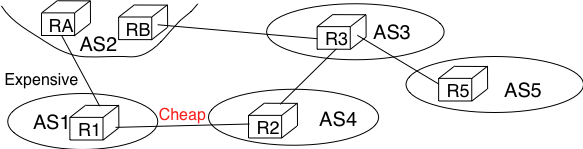
   
   How to prefer a cheap link over an more expensive one ? 

`AS1` can install the following import filter on `R1` to ensure that it always sends packets via `R2` when it has learned a route via `AS2` and another via `AS4`.

.. code-block:: text

 import: from  AS2 RA at R1 set localpref=100;
         from  AS4 R2 at R1 set localpref=200;
         accept ANY

However, this import filter does not influence how `AS3` , for example, prefers some routes over others. If the link between `AS3` and `AS2` is less expensive than the link between `AS3` and `AS4`, `AS3` could send all its packets via `AS2` and `AS1` would receive packets over its expensive link. An important point to remember about `local-pref` is that it can be used to prefer some routes over others to send packets, but it has no influence on the routes followed by received packets.

Another important utilisation of the `local-pref` attribute is to support the `customer->provider` and `shared-cost` peering relationships. From an economic point of view, there is an important difference between these three types of peering relationships. A domain usually earns money when it sends packets over a `provider->customer` relationship. On the other hand, it must pay its provider when it sends packets over a `customer->provider` relationship. Using a `shared-cost` peering to send packets is usually neutral from an economic perspective. To take into account these economic issues, domains usually configure the import filters on their routers as follows :

 - insert a high `local-pref` attribute in the routes learned from a customer
 - insert a medium `local-pref` attribute in the routes learned over a shared-cost peering
 - insert a low `local-pref` attribute in the routes learned from a provider

With such an import filter, the routers of a domain always prefer to reach destinations via their customers whenever such a route exists. Otherwise, they prefer to use `shared-cost` peering relationships and they only send packets via their providers when they do not know any alternate route. A consequence of setting the `local-pref` attribute like this is that Internet paths are often assymetrical. Consider for example the internetwork shown in the figure below.

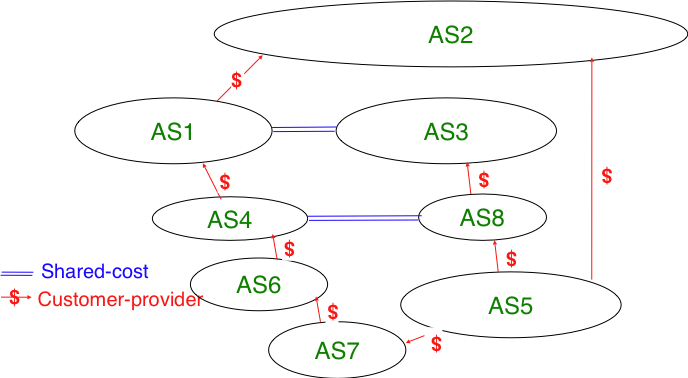
   
   Assymetry of Internet paths

Consider in this internetwork the routes available inside `AS1` to reach `AS5`. `AS1` learns the `AS4:AS6:AS7:AS5` path from `AS4`, the `AS3:AS8:AS5` path from `AS3` and the `AS2:AS5` path from `AS2`. The first path is chosen since it was from learned from a customer. `AS5` on the other hand receives three paths towards `AS1` via its providers. It may select any of these paths to reach `AS1` , depending on how it prefers one provider over the others.

Coming back to the organisation of a BGP router shown in figure :ref:`bgprouter`, the last part to be discussed is the BGP decision process. The `BGP Decision Process` is the algorithm used by routers to select the route to be installed in the FIB when there are multiple routes towards the same prefix. The BGP decision process receives a set of candidate routes towards the same prefix and uses seven steps. At each step, some routes are removed from the candidate set and the process stops when the set only contains one route [#fbgpmulti]_ :

 1. Ignore routes having an unreachable BGP nexthop
 2. Prefer routes having the highest local-pref
 3. Prefer routes having the shortest AS-Path
 4. Prefer routes having the smallest MED
 5. Prefer routes learned via eBGP sessions over routes learned via iBGP sessions
 6. Prefer routes having the closest next-hop 
 7. Tie breaking rules : prefer routes learned from the router with lowest router id

The first step of the BGP decision process ensures that a BGP router does not install in its FIB a route whose nexthop is considered to be unreachable by the intradomain routing protocol. This could happen, for example, when a router has crashed. The intradomain routing protocol usually advertises the failure of this router before the failure of the BGP sessions that it terminates. This rule implies that the BGP decision process must be re-run each time the intradomain routing protocol reports a change in the reachability of a prefix containing one of more BGP nexthops.

The second rule allows each domain to define its routing preferences. The `local-pref` attribute is set by the import filter of the router that learned a route over an eBGP session. 

In contrast with intradomain routing protocols, BGP does not contain an explicit metric. This is because in the global Internet it is impossible for all domains to agree on a common metric that meets the requirements of all domains. Despite this, BGP routers prefer routes having a short AS-Path attribute over routes with a long AS-Path. This step of the BGP decision process is motivated by the fact that operators expect that a route with a long AS-Path is lower quality than a route with a shorter AS-Path. However, studies have shown that there was not always a strong correlation between the quality of a route and the length of its AS-Path [HFPMC2002]_. 

.. index:: Hot potato routing

Before explaining the fourth step of the BGP decision process, let us first describe the fifth and the sixth steps of the BGP decision process. These two steps are used to implement `hot potato` routing. Intuitively, when a domain implements `hot potato routing`, it tries to forward packets that are destined to addresses outside of its domain, to other domains as quickly as possible. 

To understand `hot potato routing`, let us consider the two domains shown in the figure below. `AS2` advertises prefix `1.0.0.0/8` over the `R2-R6` and `R3-R7` peering links. The routers inside `AS1` learn two routes towards `1.0.0.0/8`: one via `R6-R2` and the second via `R7-R3`.

.. _fig-med:

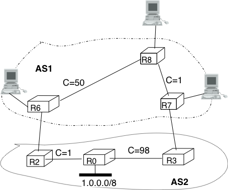
   
   Hot and cold potato routing

With the fifth step of the BGP decision process, a router always prefers to use a route learned over an `eBGP session` compared to a route learned over an `iBGP session`. Thus, router `R6` (resp. `R7`)  prefers to use the route via router `R2` (resp. `R3`) to reach prefix `1.0.0.0/8`. 

The sixth step of the BGP decision process takes into account the distance, measured as the length of the shortest intradomain path, between a BGP router and the BGP nexthop for routes learned over `iBGP sessions`. This rule is used on router `R8` in the example above. This router has received two routes towards `1.0.0.0/8`:
 
 - `1.0.0.0/8` via `R7` that is at a distance of `1` from `R8` 
 - `1.0.0.0/8` via `R6` that is at a distance of `50` from `R8`

The first route, via `R7` is the one that router `R8` prefers, as this is the route that minimises the cost of forwarding packets inside `AS1` before sending them to `AS2`.

`Hot potato routing` allows `AS1` to minimise the cost of forwarding packets towards `AS2`. However, there are situations where this is not desirable. For example, assume that `AS1` and `AS2` are domains with routers on both the East and the West coast of the US. In these two domains, the high metric associated to links `R6-R8` and `R0-R2` correspond to the cost of forwarding a packet across the USA. If `AS2` is a customer that pays `AS1`, it would prefer to receive the packets destined to `1.0.0.0/8` via the `R2-R6` link instead of the `R7-R3` link. This is the objective of `cold potato routing`.

.. index:: Multi-Exit Discriminator (MED), Cold potato routing

`Cold potato routing` is implemented using the `Multi-Exit Discriminator (MED)` attribute. This attribute is an optional BGP attribute that may be set [#fmed]_ by border routers when advertising a BGP route over an `eBGP session`. The MED attribute is usually used to indicate over an `eBGP session` the cost to reach the BGP nexthop for the advertised route. The `MED` attribute is set by the router that advertises a route over an `eBGP session`. In the example above, router `R2` sends `U(1.0.0.0/8,R2,AS2,MED=1)` while `R3` sends `U(1.0.0.0/8,R3,AS2,MED=98)`. 

Assume that the BGP session `R7-3` is the first to be established. `R7` sends `U(1.0.0.0/8,R3,AS2,MED=98)` to both `R8` and `R6`. At this point, all routers inside `AS1` send the packets towards `1.0.0.0/8` via `R7-R3`. Then, the `R6-R2` BGP session is established and router `R6` receives `U(1.0.0.0/8,R2,AS2,MED=1)`. Router `R6` runs its decision process for destination `1.0.0.0/8` and selects the route via `R2` as its chosen route to reach this prefix since this is the only route that it knows. `R6` sends `U(1.0.0.0/8,R2,AS2,MED=1)` to routers `R8` and `R7`. They both run their decision process and prefer the route advertised by `R6`, as it contains the smallest `MED`. Now, all routers inside `AS1` forward the packets to `1.0.0.0/8` via link `R6-R2` as expected by `AS2`. As router `R7` no longer uses the BGP route learned via `R3`, it must stop advertising it over `iBGP sessions` and sends `W(1.0.0.0/8)` over its `iBGP sessions` with `R6` and `R8`. However, router `R7` still keeps the route learned from `R3` inside its Adj-RIB-In. If the `R6-R2` link fails, `R6` sends `W(1.0.0.0/8)` over its iBGP sessions and router `R7` responds by sending `U(1.0.0.0/8,R3,AS2,MED=98)` over its iBGP sessions.

In practice, the fifth step of the BGP decision process is slightly more complex, as the routes towards a given prefix can be learned from different ASes. For example, assume that in figure :ref:`fig-med`, `1.0.0.0/8` is also advertised by `AS3` (not shown in the figure) that has peering links with routers `R6` and `R8`. If `AS3` advertises a route whose MED attribute is set to `2` and another with a MED set to `3`, how should `AS1`'s router compare the four BGP routes towards `1.0.0.0/8` ? Is a MED value of `1` from `AS2` better than a MED value of `2` from `AS3` ?  The fifth step of the BGP decision process solves this problem by only comparing the MED attribute of the routes learned from the same neighbour AS. Additional details about the MED attribute may be found in :rfc:`4451`. It should be noted that using the MED attribute may cause some problems in BGP networks as explained in [GW2002]_. In practice, the `MED` attribute is not used on `eBGP sessions` unless the two domains agree to enable it.

.. index: BGP router-id

The last step of the BGP decision allows the selection of a single route when a BGP router has received several routes that are considered as equal by the first six steps of the decision process. This can happen for example in a dual-homed stub attached to two different providers. As shown in the figure below, router `R1` receives two equally good BGP routes towards `1.0.0.0/8`. To break the ties, each router is identified by a unique `router-id` which in practice is one of the IP addresses assigned to the router. On some routers, the lowest router id step in the BGP decision process is replaced by the selection of the oldest route :rfc:`5004`. Preferring the oldest route when breaking ties is used to prefer stable paths over unstable paths. However, a drawback of this approach is that the selection of the BGP routes depends on the arrival times of the corresponding messages. This makes the BGP selection process non-deterministic and can lead to problems that are difficult to debug.

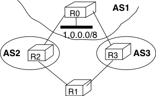
   
   A stub connected to two providers

BGP convergence
...............

In the previous sections, we have explained the operation of BGP routers. Compared to intradomain routing protocols, a key feature of BGP is its ability to support interdomain routing policies that are defined by each domain as its import and export filters and ranking process. A domain can define its own routing policies and router vendors have implemented many configuration tweaks to support complex routing policies. However, the routing policy chosen by a domain may interfere with the routing policy chosen by another domain. To understand this issue, let us first consider the simple internetwork shown below.

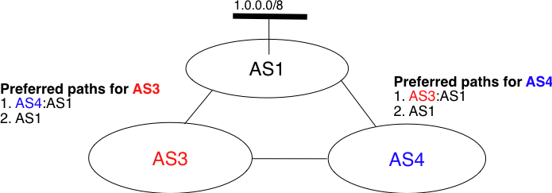
   
   The disagree internetwork 

In this internetwork, we focus on the route towards `1.0.0.0/8` which is advertised by `AS1`. Let us also assume that `AS3` (resp. `AS4`) prefers, e.g. for economic reasons, a route learned from `AS4` (`AS3`) over a route learned from `AS1`. When `AS1` sends `U(1.0.0.0/8,AS1)` to `AS3` and `AS4`, three sequences of exchanges of BGP messages are possible :

 #. `AS3` sends first `U(1.0.0.0/8,AS3:AS1)` to `AS4`. `AS4` has learned two routes towards `1.0.0.0/8`. It runs its BGP decision process and selects the route via `AS3` and does not advertise a route to `AS3`
 #. `AS4` first sends `U(1.0.0.0/8,AS3:AS1)` to `AS3`. `AS3` has learned two routes towards `1.0.0.0/8`. It runs its BGP decision process and selects the route via `AS4` and does not advertise a route to `AS4`
 #. `AS3` sends `U(1.0.0.0/8,AS3:AS1)` to `AS4` and, at the same time, `AS4` sends `U(1.0.0.0/8,AS4:AS1)`.  `AS3` prefers the route via `AS4` and thus sends `W(1.0.0.0/8)` to `AS4`. In the mean time, `AS4` prefers the route via `AS3` and thus sends `W(1.0.0.0/8)` to `AS3`. Upon reception of the `BGP Withdraws`, `AS3` and `AS4` only know the direct route towards `1.0.0.0/8`. `AS3` (resp. `AS4`) sends `U(1.0.0.0/8,AS3:AS1)` (resp. `U(1.0.0.0/8,AS4:AS1)`) to `AS4` (resp. `AS3`). `AS3` and `AS4` could in theory continue to exchange BGP messages for ever. In practice, one of them sends one message faster than the other and BGP converges. 

The example above has shown that the routes selected by BGP routers may sometimes depend on the ordering of the BGP messages that are exchanged. Other similar scenarios may be found in :rfc:`4264`. 

From an operational perspective, the above configuration is annoying since the network operators cannot easily predict which paths are chosen. Unfortunately, there are even more annoying BGP configurations. For example, let us consider the configuration below which is often named `Bad Gadget` [GW1999]_

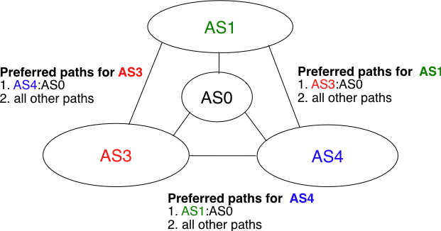
   
   The bad gadget internetwork

In this internetwork, there are four ASes. `AS0` advertises one route towards one prefix and we only analyse the routes towards this prefix. The routing preferences of `AS1`, `AS3` and `AS4` are the following :

 - `AS1` prefers the path `AS3:AS0` over all other paths
 - `AS3` prefers the path `AS4:AS0` over all other paths
 - `AS4` prefers the path `AS1:AS0` over all other paths

`AS0` sends `U(p,AS0)` to `AS1`, `AS3` and `AS4`. As this is the only route known by `AS1`, `AS3` and `AS4` towards `p`, they all select the direct path. Let us now consider one possible exchange of BGP messages :
 
 #. `AS1` sends `U(p, AS1:AS0)` to `AS3` and `AS4`. `AS4` selects the path via `AS1` since this is its preferred path. `AS3` still uses the direct path.
 #. `AS4` advertises `U(p,AS4:AS1:AS0)` to `AS3`.
 #. `AS3` sends `U(p, AS3:AS0)` to `AS1` and `AS4`. `AS1` selects the path via `AS3` since this is its preferred path. `AS4` still uses the path via `AS1`.
 #. As `AS1` has changed its path, it sends `U(p,AS1:AS3:AS0)` to `AS4` and `W(p)` to `AS3` since its new path is via `AS3`. `AS4` switches back to the direct path.
 #. `AS4` sends `U(p,AS4:AS0)` to `AS1` and `AS3`. `AS3` prefers the path via `AS4`.
 #. `AS3` sends `U(p,AS3:AS4:AS0)` to `AS1` and `W(p)` to `AS4`. `AS1` switches back to the direct path and we are back at the first step.

This example shows that the convergence of BGP is unfortunately not always guaranteed as some interdomain routing policies may interfere with each other in complex ways. [GW1999]_ have shown that checking for global convergence is either NP-complete or NP-hard. See [GSW2002]_ for a more detailed discussion.

Fortunately, there are some operational guidelines [GR2001]_ [GGR2001]_ that can guarantee BGP convergence in the global Internet. To ensure that BGP will converge, these guidelines consider that there are two types of peering relationships : `customer->provider` and `shared-cost`. In this case, BGP convergence is guaranteed provided that the following conditions are fulfilled :

 #. The topology composed of all the directed `customer->provider` peering links is an acyclic graph
 #. An AS always prefers a route received from a `customer` over a route received from a `shared-cost` peer or a `provider`.

The first guideline implies that the provider of the provider of `ASx` cannot be a customer of `ASx`. Such a relationship would not make sense from an economic perspective as it would imply circular payments. Furthermore, providers are usually larger than customers.

The second guideline also corresponds to economic preferences. Since a provider earns money when sending packets to one of its customers, it makes sense to prefer such customer learned routes over routes learned from providers. [GR2001]_ also shows that BGP convergence is guaranteed even if an AS associates the same preference to routes learned from a `shared-cost` peer and routes learned from a customer.

From a theoretical perspective, these guidelines should be verified automatically to ensure that BGP will always converge in the global Internet. However, such a verification cannot be performed in practice because this would force all domains to disclose their routing policies (and few are willing to do so) and furthermore the problem is known to be NP-hard [GW1999]. 

In practice, researchers and operators expect that these guidelines are verified [#fgranularity]_ in most domains. Thanks to the large amount of BGP data that has been collected by operators and researchers [#fbgpdata]_, several studies have analysed the AS-level topology of the Internet. [SARK2002]_ is one of the first analysis. More recent studies include [COZ2008]_ and [DKF+2007]_

Based on these studies and [ATLAS2009]_, the AS-level Internet topology can be summarised as shown in the figure below.

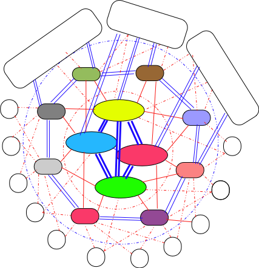
   
   The layered structure of the global Internet

.. index:: Tier-1 ISP

The domains on the Internet can be divided in about four categories according to their role and their position in the AS-level topology. 

 - the core of the Internet is composed of a dozen-twenty `Tier-1` ISPs. A `Tier-1` is a domain that has no `provider`. Such an ISP has `shared-cost` peering relationships with all other `Tier-1` ISPs and `provider->customer` relationships with smaller ISPs. Examples of `Tier-1` ISPs include sprint_, level3_ or opentransit_
 - the `Tier-2` ISPs are national or continental ISPs that are customers of `Tier-1` ISPs. These `Tier-2` ISPs have smaller customers and `shared-cost` peering relationships with other `Tier-2` ISPs. Example of `Tier-2` ISPs include France Telecom, Belgacom, British Telecom, ...
 - the `Tier-3` networks are either stub domains such as entreprise or campus networks networks and smaller ISPs. They are customers of Tier-1 and Tier-2 ISPs and have sometimes `shared-cost` peering relationships
 - the large content providers that are managing large datacenters. These content providers are producing a growing fraction of the packets exchanged on the global Internet [ATLAS2009]_. Some of these content providers are customers of Tier-1 or Tier-2 ISPs, but they often try to establish `shared-cost` peering relationships, e.g. at IXPs, with many Tier-1 and Tier-2 ISPs.

Due to this organisation of the Internet and due to the BGP decision process, most AS-level paths on the Internet have a length of 3-5 AS hops. 

.. no note:: BGP security

.. no   explain Youtube attack and briefly discuss the work in SIDR

.. rubric:: Footnotes

.. [#fasnum] An analysis of the evolution of the number of domains on the global Internet during the last ten years may be found in http://www.potaroo.net/tools/asn32/

.. [#fasrank] See http://as-rank.caida.org/ for an  analysis of the interconnections between domains based on measurements collected in the global Internet

.. [#fwish] Two routers that are attached to the same IXP only exchange packets when the owners of their domains have an economical incentive to exchange packets on this IXP. Usually, a router on an IXP is only able to exchange packets with a small fraction of the routers that are present on the same IXP.

.. [#fripedb] See ftp://ftp.ripe.net/ripe/dbase for the RIPE database that contains the import and export policies of many European ISPs

.. [#fasdomain] In this text, we consider Autonomous System and domain as synonyms. In practice, a domain may be  divided into several Autonomous Systems, but we ignore this detail. 

.. [#flifetimebgp] The BGP sessions and the underlying TCP connection are typically established by the routers when they boot based on information found in their configuration. The BGP sessions are rarely released, except if the corresponding peering link fails or one of the endpoints crashes or needs to be rebooted. 

.. [#fdefaultkeepalive] 90 seconds is the default delay recommended by :rfc:`4271`. However, two BGP peers can negotiate a different timer during the establishment of their BGP session. Using a too small interval to detect BGP session failures is not recommended. BFD [KW2009]_ can be used to replace BGP's KEEPALIVE mechanism if fast detection of interdomain link failures is required.

.. [#fflap] A link is said to be flapping if it switches several between an operationnal state and a disabled state within a short period of time. A router attached to such a link would need to frequently send routing messages.

.. [#fnexthopself] Some routers, when they receive a `BGP Update` over an `eBGP session`, set the nexthop of the received route to one of their own addresses. This is called `nexthop-self`. See e.g. [WMS2004]_ for additional details.

.. [#frr] Using a full-mesh of iBGP sessions is suitable in small networks. However, this solution does not scale in large networks containing hundreds or more routers since :math:`\frac{n \times (n-1)}{2}` iBGP sessions must be established in a domain containing :math:`n` BGP routers. Large domains use either Route Reflection :rfc:`4456` or confederations :rfc:`5065` to scale their iBGP, but this goes beyond this introduction.

.. [#fbgpmulti] Some BGP implementations can be configured to install several routes towards a single prefix in their FIB for load-balancing purposes. However, this goes beyond this introduction to BGP.

.. [#fmed] The MED attribute can be used on `customer->provider` peering relationships upon request of the customer. On `shared-cost` peering relationship, the MED attribute is only enabled when there is a explicit agreement between the two peers. 

.. [#fgranularity] Some researchers such as [MUF+2007]_ have shown that modelling the Internet topology at the AS-level requires more than the `shared-cost` and `customer->provider` peering relationships. However, there is no publically available model that goes beyond these classical peering relationships.

.. [#fbgpdata] BGP data is often collected by establishing BGP sessions between Unix hosts running a BGP daemon and BGP routers in different ASes. The Unix hosts stores all BGP messages received and regular dumps of its BGP routing table. See http://www.routeviews.org, http://www.ripe.net/ris, http://bgp.potaroo.net or http://irl.cs.ucla.edu/topology/

.. [#fpotaroo] Several web sites collect and analyse data about the evolution of BGP in the global Internet. http://bgp.potaroo.net provides lots of statistics and analyses that are updated daily.
