.. Copyright |copy| 2010 by Olivier Bonaventure
.. This file is licensed under a `creative commons licence <http://creativecommons.org/licenses/by-sa/3.0/>`_

IP version 4
============

IP version 4 is the data plane protocol of the network layer in the TCP/IP protocol suite. The design of IP version 4 was based on the following assumptions :

 - IP should provide an unreliable connectionless service (TCP provides reliability when required by the application)
 - IP operates with the datagram transmission mode
 - IP addresses have a fixed size of 32 bits 
 - IP must be useable above different types of datalink layers
 - IP hosts exchange variable length packets

The addresses are an important part of any network layer protocol. In the late 1970s, the developers of IPv4 designed IPv4 for a research network that would interconnect some research labs and universities. For this utilisation, 32 bits wide addresses were much larger than the expected number of hosts on the network. Furthermore, 32 bits was a nice address size for software-based routers. None of the developers of IPv4 were expecting that IPv4 would become as widely used as it is today.

IPv4 addresses are encoded as a 32 bits field. IPv4 addresses are often represented in `dotted-decimal` format as a sequence of four integers separated by a `dot`. The first integer is the decimal representation of the most significant byte of the 32 bits IPv4 address, ... For example, 

 * 1.2.3.4 corresponds to 00000001000000100000001100000100
 * 127.0.0.1 corresponds to 01111111000000000000000000000001
 * 255.255.255.255 corresponds to 11111111111111111111111111111111

.. index:: multihomed host

An IPv4 address is used to identify an interface on a router or a host. A router has thus as many IPv4 addresses as the number of interfaces that it has in the datalink layer. Most hosts have a single datalink layer interface and thus have a single IPv4 address. However, with the growth of wireless, more and more hosts have several datalink layer interfaces (e.g. an Ethernet interface and a WiFi interface). These hosts are said to be `multihomed`. A multihomed host with two interfaces has thus two IPv4 addresses.

An important point to be defined in a network layer protocol is the allocation of the network layer addresses. A naive allocation scheme would be to provide an IPv4 address to each host when the host is attached to the Internet on a first come first served basis. With this solution, a host in Belgium could have address 2.3.4.5 while another host located in Africa would use address 2.3.4.6. Unfortunately, this would force all routers to maintain a specific route towards each host. The figure below shows a simple enterprise network with two routers and three hosts and the associated routing tables if such isolated addresses were used.

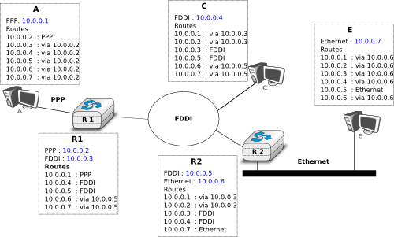
   
   Scalability issues when using isolated IP addresses 

.. index:: IP subnet, IP prefix, subnet mask

To preserve the scalability of the routing system, it is important to minimize the number of routes that are stored on each router. A router cannot store and maintain one route for each of the almost 1 billion hosts that are connected to today's Internet. Routers should only maintain routes towards blocks of addresses and not towards individual hosts. For this, hosts are grouped in `subnets` based on their location in the network. A typical subnet groups all the hosts that are part of the same enterprise. An enterprise network is usually composed of several LANs interconnected by routers. A small block of addresses from the Enterprise's block is usually assigned to each LAN. An IPv4 address is composed of two parts : a `subnetwork identifier` and  a `host identifier`. The `subnetwork identifier` is composed of the high order bits of the address and the host identifier is encoded in the low order bits of the address. This is illustrated in the figure below.

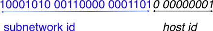
   
   The subnetwork and host identifiers inside an IPv4 address

.. index:: Class A IPv4 address, Class B IPv4 address, Class C IPv4 address

When a router needs to forward a packet, it must know the `subnet` of the destination address to be able to consult its forwarding table to forward the packet. :rfc:`791` proposed to use the high-order bits of the address to encode the length of the subnet identifier. This led to the definition of three `classes` of unicast addresses [#fclasses]_

=======  ==========  =========  =============	=============
Class    High-order  Length of  Number of	Addresses per
         bits        subnet id	networks   	network
=======  ==========  =========  =============	=============
Class A	 `0`	     8 bits	128 		16,777,216 (:math:`2^{24}`)	
Class B	 `10`        16 bits	16,384     	65,536 (:math:`2^{16}`)	
Class C	 `110`	     24 bits	2,097,152  	256 (:math:`2^8`)
=======  ==========  =========  =============	=============

However, these three classes of addresses were not flexible enough. A class `A` subnet was too large for most organisations and a class `C` subnet was too small. Flexibility was added by the introduction of `variable-length subnets` in :rfc:`1519`. With `variable-length` subnets, the subnet identifier can be any size, from `1` to `31` bits. `Variable-length` subnets allow the network operators to use a subnet that better matches the number of hosts that are placed inside the subnet. A subnet identifier or IPv4 prefix is usually [#fnetmask]_ represented as `A.B.C.D/p` where `A.B.C.D` is the network address obtained by concatenating the subnet identifier with a host identifier containing only `0` and `p` is the length of the subnet identifier in bits. The table below provides examples of IP subnets.

============== 	==========  ============  ===============
Subnet      	Number of   Smallest      Highest
	    	addresses   address	  address
============== 	==========  ============  ===============
10.0.0.0/8  	16,777,216  10.0.0.0      10.255.255.255	
192.168.0.0/16	65,536	    192.168.0.0   192.168.255.255
198.18.0.0/15	131,072	    198.18.0.0 	  198.19.255.255
192.0.2.0/24	256	    192.0.2.0 	  192.0.2.255
10.0.0.0/30	4	    10.0.0.0	  10.0.0.3
10.0.0.0/31	2	    10.0.0.0	  10.0.0.1
============== 	==========  ============  ===============

The figure below provides a simple example of the utilisation of IPv4 subnets in an enterprise network. The length of the subnet identifier assigned to a LAN usually depends on the expected number of hosts attached to the LAN. For point-to-point links, many deployments have used `/30` prefixes, but recent routers are now using `/31` subnets on point-to-point links :rfc:`3021` or do not even use IPv4 addresses on such links [#funumbered]_. 
 
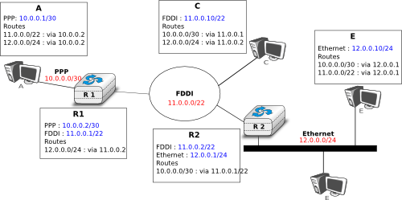
   
   IP subnets in a simple enterprise network

A second issue concerning the addresses of the network layer is the allocation scheme that is used to allocate blocks of addresses to organisations. The first allocation scheme was based on the different classes of addresses. The pool of IPv4 addresses was managed by a secretariat who allocated address blocks on a first-come first served basis. Large organisations such as IBM, BBN, as well as Stanford or the MIT were able to obtain a class `A` address block. Most organisations requested a class `B` address block containing 65536 addresses, which was suitable for most enterprises and universities. The table below provides examples of some IPv4 address blocks in the class `B` space. 

==============            ===========================================
Subnet	       		  Organisation
--------------            -------------------------------------------
130.100.0.0/16 		  Ericsson, Sweden
130.101.0.0/16		  University of Akron, USA
130.102.0.0/16		  The University of Queensland, Australia
130.103.0.0/16		  Lotus Development, USA
130.104.0.0/16 		  Universite catholique de Louvain, Belgium
130.104.0.0/16		  Open Software Foundation, USA
==============            ===========================================

However, the Internet was a victim of its own success and in the late 1980s, many organisations were requesting blocks of IPv4 addresses and started connecting to the Internet. Most of these organisations requested class `B` address blocks, as class `A` address blocks were too large and in limited supply while class `C` address blocks were considered to be too small. Unfortunately, there were only 16,384 different class `B` address blocks and this address space was being consumed quickly. As a consequence, the routing tables maintained by the routers were growing quickly and some routers had difficulties maintaining all these routes in their limited memory [#fciscoags]_.

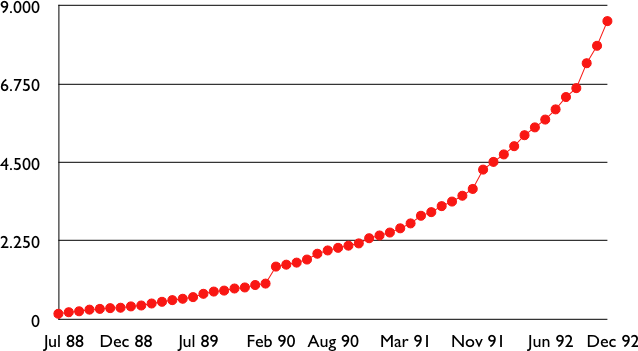
   
   Evolution of the size of the routing tables on the Internet (Jul 1988- Dec 1992 - source : :rfc:`1518`)

.. index:: Classless Interdomain Routing

Faced with these two problems, the Internet Engineering Task Force decided to develop the Classless Interdomain Routing (CIDR) architecture :rfc:`1518`. This architecture aims at allowing IP routing to scale better than the class-based architecture. CIDR contains three important modifications compared to :rfc:`791`.

      1. IP address classes are deprecated. All IP equipment must use and support variable-length subnets.
      2. IP address blocks are no longer allocated on a first-come-first-served basis. Instead, CIDR introduces a hierarchical address allocation scheme.
      3. IP routers must use longest-prefix match when they lookup a destination address in their forwarding table

The last two modifications were introduced to improve the scalability of the IP routing system. The main drawback of the first-come-first-served address block allocation scheme was that neighbouring address blocks were allocated to very different organisations and conversely, very different address blocks were allocated to similar organisations. With CIDR, address blocks are allocated by Regional IP Registries (RIR) in an aggregatable manner. A RIR is responsible for a large block of addresses and a region. For example, RIPE_ is the RIR that is responsible for Europe. A RIR allocates smaller address blocks from its large block to Internet Service Providers :rfc:`2050`. Internet Service Providers then allocate smaller address blocks to their customers. When an organisation requests an address block, it must prove that it already has or expects to have in the near future, a number of hosts or customers that is equivalent to the size of the requested address block. 

The main advantage of this hierarchical address block allocation scheme is that it allows the routers to maintain fewer routes. For example, consider the address blocks that were allocated to some of the Belgian universities as shown in the table below.

==============            =============================================
Address block   	  Organisation
==============            =============================================
130.104.0.0/16 		  Universite catholique de Louvain
134.58.0.0/16		  Katholiek Universiteit Leuven
138.48.0.0/16		  Facultes universitaires Notre-Dame de la Paix
139.165.0.0/16		  Universite de Liege
164.15.0.0/16		  Universite Libre de Bruxelles
==============            =============================================

These universities are all connected to the Internet exclusively via  `Belnet <http://www.belnet.be>`_. As each university has been allocated a different address block, the routers of `Belnet <http://www.belnet.be>`_ must announce one route for each university and all routers on the Internet must maintain a route towards each university. In contrast, consider all the high schools and the government institutions that are connected to the Internet via `Belnet <http://www.belnet.be>`_. An address block was assigned to these institutions after the introduction of CIDR in the `193.190.0.0/15` address block owned by `Belnet <http://www.belnet.be>`_. With CIDR, `Belnet <http://www.belnet.be>`_ can announce a single route towards `193.190.0.0/15` that covers all of these high schools. 

 
.. index:: multihomed network

However, there is one difficulty with the aggregatable variable length subnets used by CIDR. Consider for example `FEDICT <http://www.fedict.be>`_, a government institution that uses the `193.191.244.0/23` address block. Assume that in addition to being connected to the Internet via `Belnet <http://www.belnet.be>`_ , `FEDICT <http://www.fedict.be>`_ also wants to be connected to another Internet Service Provider. The FEDICT network is then said to be multihomed. This is shown in the figure below.

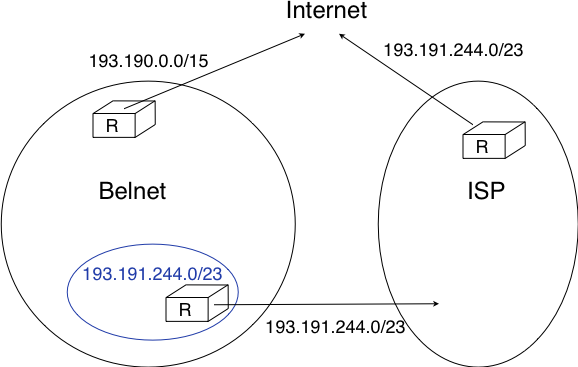
   
   Multihoming and CIDR

With such a multihomed network, routers `R1` and `R2` would have two routes towards IPv4 address `193.191.245.88` : one route via Belnet (`193.190.0.0/15`) and one direct route  (`193.191.244.0/23`). Both routes match IPv4 address `193.192.145.88`. Since :rfc:`1519` when a router knows several routes towards the same destination address, it must forward packets along the route having the longest prefix length. In the case of `193.191.245.88`, this is the route `193.191.244.0/23` that is used to forward the packet. This forwarding rule is called the `longest prefix match` or the `more specific match`. All IPv4 routers implement this forwarding rule.

To understand the `longest prefix match` forwarding, consider the figure below. With this rule, the route `0.0.0.0/0` plays a particular role. As this route has a prefix length of `0` bits, it matches all destination addresses. This route is often called the `default` route. 

 - a packet with destination `192.168.1.1` received by router `R` is destined to the router itself. It is delivered to the appropriate transport protocol.
 - a packet with destination `11.2.3.4` matches two routes : `11.0.0.0/8` and `0.0.0.0/0`. The packet is forwarded on the `West` interface.
 - a packet with destination `130.4.3.4` matches one route : `0.0.0.0/0`. The packet is forwarded on the `North` interface.
 - a packet with destination `4.4.5.6` matches two routes : `4.0.0.0/8` and `0.0.0.0/0`. The packet is forwarded on the `West` interface.
 - a packet with destination `4.10.11.254` matches three routes : `4.0.0.0/8`, `4.10.11.0/24 and `0.0.0.0/0`. The packet is forwarded on the `South` interface.

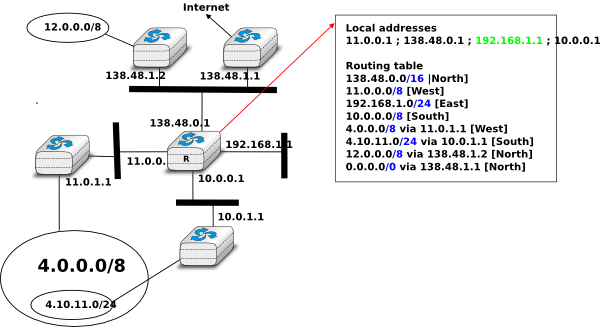
   
   Longest prefix match example 

The longest prefix match can be implemented by using different data structures. One possibility is to use a trie. The figure below shows a trie that encodes six routes having different outgoing interfaces.

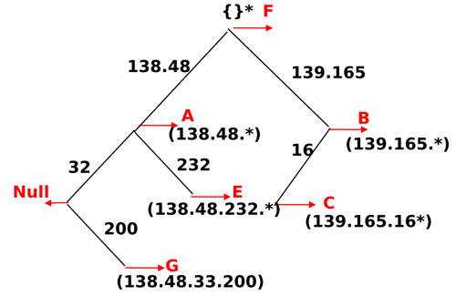
   
   A trie representing a routing table 

.. index :: 0.0.0.0, 127.0.0.1, private IPv4 addresses, link local IPv4 addresses

.. note:: Special IPv4 addresses

 Most unicast IPv4 addresses can appear as source and destination addresses in packets on the global Internet. However, it is worth noting that some blocks of IPv4 addresses have a special usage, as described in :rfc:`3330`. These include :

  - `0.0.0.0/8`, which is reserved for self-identification. A common address in this block is `0.0.0.0`, which is sometimes used when a host boots and does not yet know its IPv4 address.
  - `127.0.0.0/8`, which is reserved for loopback addresses. Each host implementing IPv4 must have a loopback interface (that is not attached to a datalink layer). By convention, IPv4 address `127.0.0.1` is assigned to this interface. This allows processes running on a host to use TCP/IP to contact other processes running on the same host. This can be very useful for testing purposes. 
  - `10.0.0.0/8`, `172.16.0.0/12` and `192.168.0.0/16` are reserved for private networks that are not directly attached to the Internet. These addresses are often called private addresses or :rfc:`1918` addresses. 
  - `169.254.0.0/16` is used for link-local addresses :rfc:`3927`. Some hosts use an address in this block when they are connected to a network that does not allocate addresses as expected. 

IPv4 packets
------------

Now that we have clarified the allocation of IPv4 addresses and the utilisation of the longest prefix match to forward IPv4 packets, we can have a more detailed look at IPv4 by starting with the format of the IPv4 packets. The IPv4 packet format was defined in :rfc:`791`. Apart from a few clarifications and some backward compatible changes, the IPv4 packet format did not change significantly since the publication of :rfc:`791`. All IPv4 packets use the 20 bytes header shown below. Some IPv4 packets contain an optional header extension that is described later. 

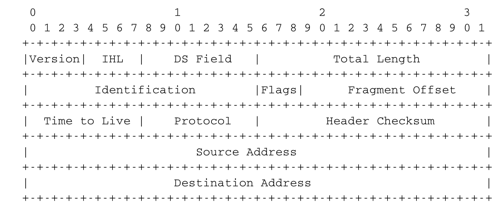
    
   The IP version 4 header

The main fields of the IPv4 header are :

 - a 4 bits `version` that indicates the version of IP used to build the header. Using a version field in the header allows the network layer protocol to evolve. 
 -  a 4 bits `IP Header Length (IHL)` that indicates the length of the IP header in 32 bits words. This field allows IPv4 to use options if required, but as it is encoded as a 4 bits field, the IPv4 header cannot be longer than 64 bytes. 
 - an 8 bits `DS` field that is used for Quality of Service and whose usage is described later.
 - an 8 bits `Protocol` field that indicates the transport layer protocol that must process the packet's payload at the destination. Common values for this field [#fprotocolnumber]_ are `6` for TCP and `17` for UDP
 - a 16 bits `length` field that indicates the total length of the entire IPv4 packet (header and payload) in bytes. This implies that an IPv4 packet cannot be longer than 65535 bytes.
 - a 32 bits `source address` field that contains the IPv4 address of the source host
 - a 32 bits `destination address` field that contains the IPv4 address of the destination host 
 - a 16 bits `checksum` that protects only the IPv4 header against transmission errors

.. index:: Time To Live (IP)

The other fields of the IPv4 header are used for specific purposes. The first is the 8 bits `Time To Live (TTL)` field. This field is used by IPv4 to avoid the risk of having an IPv4 packet caught in an infinite loop due to a transient or permanent error in routing tables [#fttl]_. Consider for example the situation depicted in the figure below where destination `D` uses address `11.0.0.56`. If `S` sends a packet towards this destination, the packet is forwarded to router `B` which forwards it to router `C` that forwards it back to router `A`, etc.

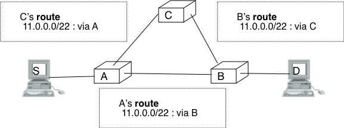
   
   Forwarding loops in an IP network

Unfortunately, such loops can occur for two reasons in IP networks. First, if the network uses static routing, the loop can be caused by a simple configuration error. Second, if the network uses dynamic routing, such a loop can occur transiently, for example during the convergence of the routing protocol after a link or router failure. The `TTL` field of the IPv4 header ensures that even if there are forwarding loops in the network, packets will not loop forever. Hosts send their IPv4 packets with a positive `TTL` (usually `64` or more [#finitialttl]_). When a router receives an IPv4 packet, it first decrements the `TTL` by one. If the `TTL` becomes `0`, the packet is discarded and a message is sent back to the packet's source (see section ICMP_). Otherwise, the router performs a lookup in its forwarding table to forward the packet.

.. index:: Maximum Transmission Unit, MTU

A second problem for IPv4 is the heterogeneity of the datalink layer. IPv4 is used above many very different datalink layers. Each datalink layer has its own characteristics and as indicated earlier, each datalink layer is characterised by a maximum frame size. From IP's point of view, a datalink layer interface is characterised by its `Maximum Transmission Unit (MTU)`. The MTU of an interface is the largest IPv4 packet (including header) that it can send. The table below provides some common MTU sizes [#f6lowpan]_. 

==============      ==================
Datalink layer      MTU
--------------      ------------------
Ethernet	    1500 bytes
WiFi		    2272 bytes
ATM (AAL5)	    9180 bytes
802.15.4	    102 or 81 bytes
Token Ring	    4464 bytes
FDDI  		    4352 bytes
==============      ==================

Although IPv4 can send 64 KBytes long packets, few datalink layer technologies that are used today are able to send a 64 KBytes IPv4 packet inside a frame. Furthermore, as illustrated in the figure below, another problem is that a host may send a packet that would be too large for one of the datalink layers used by the intermediate routers. 

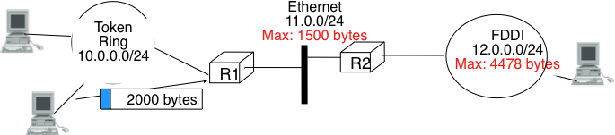
   
   The need for fragmentation and reassembly

.. Index:: IPv4 fragmentation and reassembly

To solve these problems, IPv4 includes a packet fragmentation and reassembly mechanism. Both hosts and intermediate routers may fragment an IPv4 packet if the packet is too long to be sent via the datalink layer. In IPv4, fragmentation is completely performed in the IP layer and a large IPv4 is fragmented into two or more IPv4 packets (called fragments). The IPv4 fragments of a large packet are normal IPv4 packets that are forwarded towards the destination of the large packet by intermediate routers. 

The IPv4 fragmentation mechanism relies on four fields of the IPv4 header : `Length`, `Identification`, the `flags` and the `Fragment Offset`. The IPv4 header contains two flags : `More` and `Don't Fragment (DF)`. When the `DF` flag is set, this indicates that the packet cannot be fragmented.

.. index:: Maximum Transmission Unit (MTU)

The basic operation of the IPv4 fragmentation is as follows. A large packet is fragmented into two or more fragments. The size of all fragments, except the last one, is equal to the Maximum Transmission Unit of the link used to forward the packet. Each IPv4 packet contains a 16 bits `Identification` field. When a packet is fragmented, the `Identification` of the large packet is copied in all fragments to allow the destination to reassemble the received fragments together. In each fragment, the `Fragment Offset` indicates, in units of 8 bytes, the position of the payload of the fragment in the payload of the original packet. The `Length` field in each fragment indicates the length of the payload of the fragment as in a normal IPv4 packet. Finally, the `More` flag is set only in the last fragment of a large packet.

.. 
  note:: IPv4 in scapy
  In the pseudo-code used in this section, we use the scapy_ notations for the fields of the IPv4 header. `ihl` is the `IP Header Length`, `tos` is the `DS` byte, `len` is the packet length, `id` the packet identifier, `flags` contains the `DF` and `More` flags, `proto` is the `Protocol` field, `chksum` contains the Internet checksum and `src` (resp. `dst`) the source (resp. destination) IPv4 address. 

The following pseudo-code details the IPv4 fragmentation, assuming that the packet does not contain options.

.. code-block:: python

 #mtu : maximum size of the packet (including header) of outgoing link
 if p.len <  mtu : 
    send(p)
 # packet is too large
 maxpayload=8*int((mtu-20)/8)  # must be n times 8 bytes
 if p.flags=='DF' :
    discard(p)
 # packet must be fragmented
 payload=p[IP].payload
 pos=0
 while len(payload) > 0 :
    if len(payload) > maxpayload :
       toSend=IP(dest=p.dest,src=p.src,
	         ttl=p.ttl, id=p.id, 
	         frag=p.frag+(pos/8),
		 len=mtu, proto=p.proto)/payload[0:maxpayload]
       pos=pos+maxpayload
       payload=payload[maxpayload+1:]	   
    else
       toSend=IP(dest=p.dest,src=p.src,
	         ttl=p.ttl, id=p.id, 
	         frag=p.frag+(pos/8),
		 flags=p.flags,
		 len=len(payload), proto=p.proto)/payload
    forward(toSend)   

The fragments of an IPv4 packet may arrive at the destination in any order, as each fragment is forwarded independently in the network and may follow different paths. Furthermore, some fragments may be lost and never reach the destination.

The reassembly algorithm used by the destination host is roughly as follows. First, the destination can verify whether a received IPv4 packet is a fragment or not by checking the value of the `More` flag and the `Fragment Offset`. If the `Fragment Offset` is set to `0` and the `More` flag is reset, the received packet has not been fragmented. Otherwise, the packet has been fragmented and must be reassembled. The reassembly algorithm relies on the `Identification` field of the received fragments to associate a fragment with the corresponding packet being reassembled. Furthermore, the `Fragment Offset` field indicates the position of the fragment payload in the original unfragmented packet. Finally, the packet with the `More` flag reset allows the destination to determine the total length of the original unfragmented packet.

Note that the reassembly algorithm must deal with the unreliability of the IP network. This implies that a fragment may be duplicated or a fragment may never reach the destination. The destination can easily detect fragment duplication thanks to the `Fragment Offset`. To deal with fragment losses, the reassembly algorithm must bound the time during which the fragments of a packet are stored in its buffer while the packet is being reassembled. This can be implemented by starting a timer when the first fragment of a packet is received. If the packet has not been reassembled upon expiration of the timer, all fragments are discarded and the packet is considered to be lost. 

.. index:: IP options

The original IP specification, in :rfc:`791`, defined several types of options that can be added to the IP header. Each option is encoded using a `type length value` format. They are not widely used today and are thus only briefly described. Additional details may be found in :rfc:`791`.

The most interesting options in IPv4 are the three options that are related to routing. The `Record route` option was defined to allow network managers to determine the path followed by a packet. When the `Record route` option was present, routers on the packet's path had to insert their IP address in the option. This option was implemented, but as the optional part of the IPv4 header can only contain 44 bytes, it is impossible to discover an entire path on the global Internet. :manpage:`traceroute(8)`, despite its limitations, is a better solution to record the path towards a destination.

The other routing options are the `Strict source route` and the `Loose source route` option. The main idea behind these options is that a host may want, for any reason, to specify the path to be followed by the packets that it sends. The `Strict source route` option allows a host to indicate inside each packet the exact path to be followed. The `Strict source route` option contains a list of IPv4 address and a pointer to indicate the next address in the list. When a router receives a packet containing this option, it does not lookup the destination address in its routing table but forwards the packet directly to the next router in the list and advances the pointer. This is illustrated in the figure below where `S` forces its packets to follow the `RA-RB-RD` path.

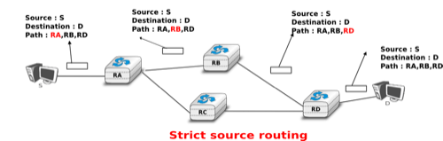
   
   Usage of the `Strict source route` option 

The maximum length of the optional part of the IPv4 header is a severe limitation for the `Strict source route` option as for the `Record Route` option. The `Loose source route` option does not suffer from this limitation. This option allows the sending host to indicate inside its packet `some` of the routers that must be traversed to reach the destination. This is shown in the figure below. `S` sends a packet containing a list of addresses and a pointer to the next router in the list. Initially, this pointer points to `RB`. When `RA` receives the packet sent by `S`, it looks up in its forwarding table the address pointed in the `Loose source route` option and not the destination address. The packet is then forwarded to router `RB` that recognises its address in the option and advances the pointer. As there is no address listed in the `Loose source route` option anymore, `RB` and other downstream routers forward the packet by performing a lookup for the destination address.

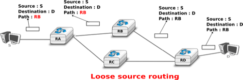
   
   Usage of the `Loose source route` option 

These two options are usually ignored by routers because they cause security problems.

.. index:: Internet Control Message Protocol, ICMP
.. _ICMP:

ICMP version 4
==============

It is sometimes necessary for intermediate routers or the destination host to inform the sender of the packet of a problem that occurred while processing a packet. In the TCP/IP protocol suite, this reporting is done by the Internet Control Message Protocol (ICMP). ICMP is defined in :rfc:`792`. ICMP messages are carried as the payload of IP packets (the protocol value reserved for ICMP is `1`). An ICMP message is composed of an 8 byte header and a variable length payload that usually contains the first bytes of the packet that triggered the transmission of the ICMP message.

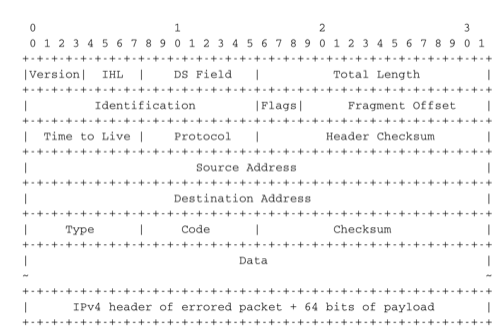
   
   ICMP version 4 (:rfc:`792`)

In the ICMP header, the `Type` and `Code` fields indicate the type of problem that was detected by the sender of the ICMP message. The `Checksum` protects the entire ICMP message against transmission errors and the `Data` field contains additional information for some ICMP messages.

The main types of ICMP messages are :

 - `Destination unreachable` : a `Destination unreachable` ICMP message is sent when a packet cannot be delivered to its destination due to routing problems. Different types of unreachability are distinguished :

   - `Network unreachable` : this ICMP message is sent by a router that does not have a route for the subnet containing the destination address of the packet 
   - `Host unreachable` : this ICMP message is sent by a router that is attached to the subnet that contains the destination address of the packet, but this destination address cannot be reached at this time
   - `Protocol unreachable` : this ICMP message is sent by a destination host that has received a packet, but does not support the transport protocol indicated in the packet's `Protocol` field
   - `Port unreachable` : this ICMP message is sent by a destination host that has received a packet destined to a port number, but no server process is bound to this port 

 - `Fragmentation needed` : this ICMP message is sent by a router that receives a packet with the `Don't Fragment` flag set that is larger than the MTU of the outgoing interface 

 - `Redirect` : this ICMP message can be sent when there are two routers on the same LAN. Consider a LAN with one host and two routers : `R1` and `R2`. Assume that `R1` is also connected to subnet `130.104.0.0/16` while `R2` is connected to subnet `138.48.0.0/16`. If a host on the LAN sends a packet towards `130.104.1.1` to `R2`, `R2` needs to forward the packet again on the LAN to reach `R1`. This is not optimal as the packet is sent twice on the same LAN. In this case, `R2` could send an ICMP `Redirect` message to the host to inform it that it should have sent the packet directly to `R1`. This allows the host to send the other packets to `130.104.1.1` directly via `R1`. 

 .. figure:: png/network-fig-165-c.png
   :align: center
   :scale: 70
   
   ICMP redirect

 - `Parameter problem` : this ICMP message is sent when a router or a host receives an IP packet containing an error (e.g. an invalid option)
 - `Source quench` : a router was supposed to send this message when it had to discard packets due to congestion. However, sending ICMP messages in case of congestion was not the best way to reduce congestion and since the inclusion of a congestion control scheme in TCP, this ICMP message has been deprecated. 

 - `Time Exceeded` : there are two types of `Time Exceeded` ICMP messages

   - `TTL exceeded` : a `TTL exceeded` message is sent by a router when it discards an IPv4 packet because its `TTL` reached `0`.
   - `Reassembly time exceeded` : this ICMP message is sent when a destination has been unable to reassemble all the fragments of a packet before the expiration of its reassembly timer. 

 - `Echo request` and `Echo reply` : these ICMP messages are used by the :manpage:`ping(8)` network debugging software. 

.. note:: Redirection attacks

 ICMP redirect messages are useful when several routers are attached to the same LAN as hosts. However, they should be used with care as they also create an important security risk. One of the most annoying attacks in an IP network is called the `man in the middle attack`. Such an attack occurs if an attacker is able to receive, process, possibly modify and forward all the packets exchanged between a source and a destination. As the attacker receives all the packets it can easily collect passwords or credit card numbers or even inject fake information in an established TCP connection. ICMP redirects unfortunately enable an attacker to easily perform such an attack. In the figure above, consider host `H` that is attached to the same LAN as `A` and `R1`. If `H` sends to `A` an ICMP redirect for prefix `138.48.0.0/16`, `A` forwards to `H` all the packets that it wants to send to this prefix. `H` can then forward them to `R2`. To avoid these attacks, hosts should ignore the ICMP redirect messages that they receive.

.. index:: ping

:manpage:`ping(8)` is often used by network operators to verify that a given IP address is reachable. Each host is supposed [#fpingproblems]_ to reply with an ICMP `Echo reply` message when its receives an  ICMP `Echo request` message. A sample usage of :manpage:`ping(8)` is shown below.

.. code-block::  text

  ping 130.104.1.1
  PING 130.104.1.1 (130.104.1.1): 56 data bytes
  64 bytes from 130.104.1.1: icmp_seq=0 ttl=243 time=19.961 ms
  64 bytes from 130.104.1.1: icmp_seq=1 ttl=243 time=22.072 ms
  64 bytes from 130.104.1.1: icmp_seq=2 ttl=243 time=23.064 ms
  64 bytes from 130.104.1.1: icmp_seq=3 ttl=243 time=20.026 ms
  64 bytes from 130.104.1.1: icmp_seq=4 ttl=243 time=25.099 ms
  --- 130.104.1.1 ping statistics ---
  5 packets transmitted, 5 packets received, 0% packet loss
  round-trip min/avg/max/stddev = 19.961/22.044/25.099/1.938 ms

.. index:: traceroute

Another very useful debugging tool is :manpage:`traceroute(8)`. The traceroute man page describes this tool as `"print the route packets take to network host"`. traceroute uses the `TTL exceeded` ICMP messages to discover the intermediate routers on the path towards a destination. The principle behind traceroute is very simple. When a router receives an IP packet whose `TTL` is set to `1` it decrements the `TTL` and is forced to return to the sending host a `TTL exceeded` ICMP message containing the header and the first bytes of the discarded IP packet. To discover all routers on a network path, a simple solution is to first send a packet whose `TTL` is set to `1`, then a packet whose `TTL` is set to `2`, etc. A sample traceroute output is shown below.

.. code-block:: text

 traceroute www.ietf.org
 traceroute to www.ietf.org (64.170.98.32), 64 hops max, 40 byte packets
  1  CsHalles3.sri.ucl.ac.be (192.168.251.230)  5.376 ms  1.217 ms  1.137 ms
  2  CtHalles.sri.ucl.ac.be (192.168.251.229)  1.444 ms  1.669 ms  1.301 ms
  3  CtPythagore.sri.ucl.ac.be (130.104.254.230)  1.950 ms  4.688 ms  1.319 ms
  4  fe.m20.access.lln.belnet.net (193.191.11.9)  1.578 ms  1.272 ms  1.259 ms
  5  10ge.cr2.brueve.belnet.net (193.191.16.22)  5.461 ms  4.241 ms  4.162 ms
  6  212.3.237.13 (212.3.237.13)  5.347 ms  4.544 ms  4.285 ms
  7  ae-11-11.car1.Brussels1.Level3.net (4.69.136.249)  5.195 ms  4.304 ms  4.329 ms
  8  ae-6-6.ebr1.London1.Level3.net (4.69.136.246)  8.892 ms  8.980 ms  8.830 ms
  9  ae-100-100.ebr2.London1.Level3.net (4.69.141.166)  8.925 ms  8.950 ms  9.006 ms
  10  ae-41-41.ebr1.NewYork1.Level3.net (4.69.137.66)  79.590 ms 
      ae-43-43.ebr1.NewYork1.Level3.net (4.69.137.74)  78.140 ms 
      ae-42-42.ebr1.NewYork1.Level3.net (4.69.137.70)  77.663 ms
  11  ae-2-2.ebr1.Newark1.Level3.net (4.69.132.98)  78.290 ms  83.765 ms  90.006 ms
  12  ae-14-51.car4.Newark1.Level3.net (4.68.99.8)  78.309 ms  78.257 ms  79.709 ms
  13  ex1-tg2-0.eqnwnj.sbcglobal.net (151.164.89.249)  78.460 ms  78.452 ms  78.292 ms
  14  151.164.95.190 (151.164.95.190)  157.198 ms  160.767 ms  159.898 ms
  15  ded-p10-0.pltn13.sbcglobal.net (151.164.191.243)  161.872 ms  156.996 ms  159.425 ms
  16  AMS-1152322.cust-rtr.swbell.net (75.61.192.10)  158.735 ms  158.485 ms  158.588 ms
  17  mail.ietf.org (64.170.98.32)  158.427 ms  158.502 ms  158.567 ms

The above :manpage:`traceroute(8)` output shows a 17 hops path between a host at UCLouvain and one of the main IETF servers. For each hop, traceroute provides the IPv4 address of the router that sent the ICMP message and the measured round-trip-time between the source and this router. traceroute sends three probes with each `TTL` value. In some cases, such as at the 10th hop above, the ICMP messages may be received from different addresses. This is usually because different packets from the same source have followed different paths [#ftraceroutemore]_ in the network. 

.. index:: Path MTU discovery

Another important utilisation of ICMP messages is to discover the maximum MTU that can be used to reach a destination without fragmentation. As explained earlier, when an IPv4 router receives a packet that is larger than the MTU of the outgoing link, it must fragment the packet. Unfortunately, fragmentation is a complex operation and routers cannot perform it at line rate [KM1995]_. Furthermore, when a TCP segment is transported in an IP packet that is fragmented in the network, the loss of a single fragment forces TCP to retransmit the entire segment (and thus all the fragments). If TCP was able to send only packets that do not require fragmentation in the network, it could retransmit only the information that was lost in the network. In addition, IP reassembly causes several challenges at high speed as discussed in :rfc:`4963`. Using IP fragmentation to allow UDP applications to exchange large messages raises several security issues [KPS2003]_.

ICMP, combined with the `Don't fragment (DF)` IPv4 flag, is used by TCP implementations to discover the largest MTU size that is allowed to reach a destination host without causing network fragmentation. This is the `Path MTU discovery` mechanism defined in :rfc:`1191`. A TCP implementation that includes `Path MTU discovery` (most do) requests the IPv4 layer to send all segments inside IPv4 packets having the `DF` flag set. This prohibits intermediate routers from fragmenting these packets. If a router needs to forward an unfragmentable packet over a link with a smaller MTU, it returns a `Fragmentation needed` ICMP message to the source, indicating the MTU of its outgoing link. This ICMP message contains in the MTU of the router's outgoing link in its `Data` field. Upon reception of this ICMP message, the source TCP implementation adjusts its Maximum Segment Size (MSS) so that the packets containing the segments that it sends can be forwarded by this router without requiring fragmentation. 

Interactions between IPv4 and the datalink layer
------------------------------------------------

.. _IPEthernet:

As mentioned in the first section of this chapter, there are three main types of datalink layers : `point-to-point` links, LANs supporting broadcast and multicast and NBMA networks. There are two important issues to be addressed when using IPv4 in these types of networks. The first issue is how an IPv4 device obtains its IPv4 address. The second issue is how IPv4 packets are exchanged over the datalink layer service. 

On a `point-to-point` link, the IPv4 addresses of the communicating devices can be configured manually or by using a simple protocol. IPv4 addresses are often configured manually on `point-to-point` links between routers. When `point-to-point` links are used to attach hosts to the network, automatic configuration is often preferred in order to avoid problems with incorrect IPv4 addresses. For example, the :abbr:`PPPP (Point-to-Point Protocol)`, specified in :rfc:`1661`, includes an IP network control protocol that can be used by the router in the figure below to send the IPv4 address that the attached host must configure for its interface. The transmission of IPv4 packets on a point-to-point link will be discussed in chapter `chap:lan`. 

.. figure:: ../lan/png/lan-fig-044-c.png
   :align: center
   :scale: 70
   
   IPv4 on point-to-point links

Using IPv4 in a LAN introduces an additional problem. On a LAN, each device is identified by its unique datalink layer address. The datalink layer service can be used by any host attached to the LAN to send a frame to any other host attached to the same LAN. For this, the sending host must know the datalink layer address of the destination host. For example, the figure below shows four hosts attached to the same LAN configured with IPv4 addresses in the `10.0.1.0/24` subnet and datalink layer addresses represented as a single character [#fdladdress]_. In this network, if host `10.0.1.22/24` wants to send an IPv4 packet to the host having address `10.0.1.8`, it must know that the datalink layer address of this host is `C`.

.. figure:: ../lan/png/lan-fig-045-c.png
   :align: center
   :scale: 70
   
   A simple LAN

.. index:: Address Resolution Protocol, ARP

In a simple network such as the one shown above, it could be possible to manually configure the mapping between the IPv4 addresses of the hosts and the corresponding datalink layer addresses. However, in a larger LAN this is impossible. To ease the utilisation of LANs, IPv4 hosts must be able to automatically obtain the datalink layer address corresponding to any IPv4 address on the same LAN. This is the objective of the `Address Resolution Protocol` (`ARP`) defined in :rfc:`826`. ARP is a datalink layer protocol that is used by IPv4. It relies on the ability of the datalink layer service to easily deliver a broadcast frame to all devices attached to the same LAN. 

.. index:: ARP cache

The easiest way to understand the operation of ARP is to consider the simple network shown above and assume that host `10.0.1.22/24` needs to send an IPv4 packet to host `10.0.1.8`. As this IP address belongs to the same subnet, the packet must be sent directly to its destination via the datalink layer service. To use this service, the sending host must find the datalink layer address that is attached to host `10.0.1.8`. Each IPv4 host maintains an `ARP cache` containing the list of all mappings between IPv4 addresses and datalink layer addresses that it knows. When an IPv4 hosts boots, its ARP cache is empty. `10.0.1.22` thus first consults its ARP cache. As the cache does not contain the requested mapping, host `10.0.1.22` sends a broadcast ARP query frame on the LAN. The frame contains the datalink layer address of the sending host (`A`) and the requested IPv4 address (`10.0.1.8`). This broadcast frame is received by all devices on the LAN and only the host that owns the requested IPv4 address replies by returning a unicast ARP reply frame with the requested mapping. Upon reception of this reply, the sending host updates its ARP cache and sends the IPv4 packet by using the datalink layer service. To deal with devices that move or whose addresses are reconfigured, most ARP implementations remove the cache entries that have not been used for a few minutes. Some implementations revalidate ARP cache entries from time to time by sending ARP queries [#farplinux]_.

.. index:: man-in-the-middle attack

.. note:: Security issues with the Address Resolution Protocol

 :term:`ARP` is an old and widely used protocol that was unfortunately designed when security issues were not a concern. :term:`ARP` is almost insecure by design. Hosts using :term:`ARP` can be subject to several types of attack. First, a malicious host could create a denial of service attack on a LAN by sending random replies to the received ARP queries. This would pollute the ARP cache of the other hosts on the same LAN. On a fixed network, such attacks can be detected by the system administrator who can physically remove the malicious hosts from the LAN. On a wireless network, removing a malicious host is much more difficult.
 
 A second type of attack are the `man-in-the-middle` attacks. This name is used for network attacks where the attacker is able to read and possibly modify all the messages sent by the attacked devices. Such an attack is possible in a LAN. Assume, in the figure above, that host `10.0.1.9` is malicious and would like to receive and modify all the packets sent by host `10.0.1.22` to host `10.0.1.8`. This can be achieved easily if host `10.0.1.9` manages, by sending fake ARP replies, to convince host `10.0.1.22` (resp. `10.0.1.8`) that its own datalink layer address must be used to reach `10.0.1.8` (resp. `10.0.1.22`). 
 

:term:`ARP` is used by all devices that are connected to a LAN and implement IPv4. Both routers and endhosts implement ARP. When a host needs to send an IPv4 packet to a destination outside of its local subnet, it must first send the packet to one of the routers that reside on this subnet. Consider for example the network shown in the figure below. Each host is configured with an IPv4 address in the `10.0.1.0/24` subnet and uses `10.0.1.1` as its default router. To send a packet to address `1.2.3.4`, host `10.0.1.8` will first need to know the datalink layer of the default router. It will thus send an ARP request for `10.0.1.1`. Upon reception of the ARP reply, host `10.0.1.8` updates its ARP table and sends its packet in a frame to its default router. The router will then forward the packet towards its final destination.

.. figure:: ../lan/png/lan-fig-049-c.png
   :align: center
   :scale: 70
   
   A simple LAN with a router

.. index:: DHCP, Dynamic Host Configuration Protocol, 0.0.0.0, 255.255.255.255

In the early days of the Internet, IP addresses were manually configured on both hosts and routers and almost never changed. However, this manual configuration can be complex [#fifconfig]_ and often causes errors that are sometimes difficult to debug. Recent TCP/IP implementations are able to detect some of these misconfigurations. For example, if two hosts are attached to the same subnet with the same IPv4 address they will be unable to communicate. To detect this problem hosts send an ARP request for their configured address each time their addressed is changed :rfc:`5227`. If they receive an answer to this ARP request, they trigger an alarm or inform the system administrator.  

To ease the attachment of hosts to subnets, most networks now support the Dynamic Host Configuration Protocol (DHCP) :rfc:`2131`. DHCP allows a host to automatically retrieve its assigned IPv4 address. A DHCP server is associated to each subnet [#fdhcpserver]_. Each DHCP server manages a pool of IPv4 addresses assigned to the subnet. When a host is first attached to the subnet, it sends a DHCP request message in a UDP segment (the DHCP server listens on port 67). As the host knows neither its IPv4 address nor the IPv4 address of the DHCP server, this UDP segment is sent inside an IPv4 packet whose source and destination addresses are respectively `0.0.0.0` and `255.255.255.255`. The DHCP request may contain various options such as the name of the host, its datalink layer address, etc. The server captures the DHCP request and selects an unassigned address in its address pool. It then sends the assigned IPv4 address in a DHCP reply message which contains the datalink layer address of the host and additional information such as the subnet mask of the IPv4 address, the address of the default router or the address of the DNS resolver. This DHCP reply message is sent in an IPv4 packet whose source and destination addresses are respectively the IPv4 address of the DHCP server and the `255.255.255.255` broadcast address. The DHCP reply also specifies the lifetime of the address allocation. This forces the host to renew its address allocation once it expires. Thanks to the limited lease time, IP addresses are automatically returned to the pool of addresses hosts are powered off. This reduces the waste of IPv4 addresses.

.. search OUI http://standards.ieee.org/regauth/oui/index.shtml

In an NBMA network, the interactions between IPv4 and the datalink layer are more complex as the ARP protocol cannot be used as in a LAN. Such NBMA networks use special servers that store the mappings between IP addresses and the corresponding datalink layer address. Asynchronous Transfer Mode (ATM) networks for example can use either the ATMARP protocol defined in :rfc:`2225` or the NextHop Resolution Protocol (NHRP) defined in :rfc:`2332`. ATM networks are less frequently used today and we will not describe the detailed operation of these servers.

Operation of IPv4 devices
-------------------------

At this point of the description of IPv4, it is useful to have a detailed look at how an IPv4 implementation sends, receives and forwards IPv4 packets. The simplest case is when a host needs to send a segment in an IPv4 packet. The host performs two operations. First, it must decide on which interface the packet will be sent. Second it must create the corresponding IP packet(s). 

To simplify the discussion in this section, we ignore the utilisation of IPv4 options. This is not a severe limitation as today IPv4 packets rarely contain options. Details about the processing of the IPv4 options may be found in the relevant RFCs, such as :rfc:`791`. Furthermore, we also assume that only point-to-point links are used. We defer the explanation of the operation of IPv4 over Local Area Networks until the next chapter.

An IPv4 host having :math:`n` datalink layer interfaces manages :math:`n+1` IPv4 addresses :

 - the `127.0.0.1/32` IPv4 address assigned by convention to its loopback address
 - one `A.B.C.D/p` IPv4 address assigned to each of its :math:`n` datalink layer interfaces

Such a host maintains a routing table containing one entry for its loopback address and one entry for each subnet identifier assigned to its interfaces. Furthermore, the host usually uses one of its interfaces as the `default` interface when sending packets that are not addressed to a directly connected destination. This is represented by the `default` route : `0.0.0.0/0` that is associated to one interface.

When a transport protocol running on the host requests the transmission of a segment, it usually provides the IPv4 destination address to the IPv4 layer in addition to the segment [#fdfflag]_. The IPv4 implementation first performs a longest prefix match with the destination address in its routing table. The lookup returns the identification of the interface that must be used to send the packet. The host can then create the IPv4 packet containing the segment. The source IPv4 address of the packet is the IPv4 address of the host on the interface returned by the longest prefix match. The `Protocol` field of the packet is set to the identification of the local transport protocol which created the segment. The `TTL` field of the packet is set to the default `TTL` used by the host. The host must now choose the packet's `Identification`. This `Identification` is important if the packet becomes fragmented in the network, as it ensures that the destination is able to reassemble the received fragments. Ideally, a sending host should never send a packet twice with the same `Identification` to the same destination host, in order to ensure that all fragments are correctly reassembled by the destination. Unfortunately, with a 16 bits `Identification` field and an expected MSL of 2 minutes, this implies that the maximum bandwidth to a given destination is limited to roughly 286 Mbps. With a more realistic 1500 bytes MTU, that bandwidth drops to 6.4 Mbps :rfc:`4963` if fragmentation must be possible [#fiddf]_. This is very low and is another reason why hosts are highly encouraged to avoid fragmentation. If; despite all of this, the MTU of the outgoing interface is smaller than the packet's length, the packet is fragmented. Finally, the packet's checksum is computed before transmission.

When a host receives an IPv4 packet destined to itself, there are several operations that it must perform. First, it must check the packet's checksum. If the checksum is incorrect, the packet is discarded. Then, it must check whether the packet has been fragmented. If yes, the packet is passed to the reassembly algorithm described earlier. Otherwise, the packet must be passed to the upper layer. This is done by looking at the `Protocol` field (`6` for TCP, `17` for UDP). If the host does not implement the transport layer protocol corresponding to the received `Protocol` field, it sends a `Protocol unreachable` ICMP message to the sending host. If the received packet contains an ICMP message (`Protocol` field set to `1`), the processing is more complex. An `Echo-request` ICMP message triggers the transmission of an `ICMP Echo-reply` message. The other types of ICMP messages indicate an error that was caused by a previously transmitted packet. These ICMP messages are usually forwarded to the transport protocol that sent the erroneous packet. This can be done by inspecting the contents of the ICMP message that includes the header and the first 64 bits of the erroneous packet. If the IP packet did not contain options, which is the case for most IPv4 packets, the transport protocol can find in the first 32 bits of the transport header the source and destination ports to determine the affected transport flow. This is important for Path MTU discovery for example.

When a router receives an IPv4 packet, it must first check the packet's checksum. If the checksum is invalid, it is discarded. Otherwise, the router must check whether the destination address is one of the IPv4 addresses assigned to the router. If so, the router must behave as a host and process the packet as described above. Although routers mainly forward IPv4 packets, they sometimes need to be accessed as hosts by network operators or network management software. 

If the packet is not addressed to the router, it must be forwarded on an outgoing interface according to the router's routing table. The router first decrements the packet's `TTL`. If the `TTL` reaches `0`, a `TTL Exceeded` ICMP message is sent back to the source. As the packet header has been modified, the checksum must be recomputed. Fortunately, as IPv4 uses an arithmetic checksum, a router can incrementally update the packet's checksum as described in :rfc:`1624`. Then, the router performs a longest prefix match for the packet's destination address in its forwarding table. If no match is found, the router must return a `Destination unreachable` ICMP message to the source. Otherwise, the lookup returns the interface over which the packet must be forwarded. Before forwarding the packet over this interface, the router must first compare the length of the packet with the MTU of the outgoing interface. If the packet is smaller than the MTU, it is forwarded. Otherwise, a `Fragmentation needed` ICMP message is sent if the `DF` flag was sent or the packet is fragmented if the `DF` was not set. 

.. note:: Longest prefix match in IP routers

 Performing the longest prefix match at line rate on routers requires highly tuned data structures and algorithms. Consider for example an implementation of the longest match based on a Radix tree on a router with a 10 Gbps link. On such a link, a router can receive 31,250,000 40 bytes IPv4 packets every second. To forward the packets at line rate, the router must process one IPv4 packet every 32 nanoseconds. This cannot be achieved by a software implementation. For a hardware implementation, the main difficulty lies in the number of memory accesses that are necessary to perform the longest prefix match. 32 nanoseconds is very small compared to the memory accesses that are required by a naive longest prefix match implement. Additional information about faster longest prefix match algorithms may be found in [Varghese2005]_.

.. rubric:: Footnotes

.. [#fclasses] In addition to the A, B and C classes, :rfc:`791` also defined the `D` and `E` classes of IPv4 addresses. Class `D` (resp. `E`) addresses are those whose high order bits are set to `1110` (resp. `1111`). Class `D` addresses are used by IP multicast and will be explained later. Class `E` addresses are currently unused, but there are some discussions on possible future usages [WMH2008]_ [FLM2008]_

.. [#fnetmask] Another way of representing IP subnets is to use netmasks. A netmask is a 32 bits field whose `p` high order bits are set to `1` and the low order bits are set to `0`. The number of high order bits set `1` indicates the length of the subnet identifier. Netmasks are usually represented in the same dotted decimal format as IPv4 addresses. For example `10.0.0.0/8` would be represented as `10.0.0.0 255.0.0.0` while `192.168.1.0/24` would be represented as `192.168.1.0 255.255.255.0`. In some cases, the netmask can be represented in hexadecimal.

.. [#funumbered] A point-to-point link to which no IPv4 address has been allocated is called an unnumbered link. See :rfc:`1812` section 2.2.7 for a discussion of such unnumbered links.

.. [#fprotocolnumber] See http://www.iana.org/assignments/protocol-numbers/ for the list of all assigned `Protocol` numbers

.. [#fttl] The initial IP specification in :rfc:`791` suggested that routers would decrement the `TTL` at least once every second. This would ensure that a packet would never remain for more than `TTL` seconds in the network. However, in practice most router implementations simply chose to decrement the `TTL` by one. 

.. [#finitialttl] The initial TTL value used to send IP packets vary from one implementation to another. Most current IP implementations use an initial TTL of 64 or more. See http://members.cox.net/~ndav1/self_published/TTL_values.html for additional information.

.. [#f6lowpan] Supporting IP over the 802.15.4 datalink layer technology requires special mechanisms. See :rfc:`4944` for a discussion of the special problems posed by 802.15.4

.. [#fpingproblems] Until a few years ago, all hosts replied to `Echo request` ICMP messages. However, due to the security problems that have affected TCP/IP implementations, many of these implementations can now be configured to disable answering `Echo request` ICMP messages. 

.. [#ftraceroutemore] A detailed analysis of traceroute output is outside the scope of this document. Additional information may be found in [ACO+2006]_ and [DT2007]_

.. ping of death http://insecure.org/sploits/ping-o-death.html

.. [#fciscoags] Example routers from this period include the Cisco AGS http://www.knossos.net.nz/don/wn1.html and AGS+ http://www.ciscopress.com/articles/article.asp?p=25296

.. [#fdladdress] In practice, most local area networks use addresses encoded as a 48 bits field [802]_ . Some recent local area network technologies use 64 bits addresses.

.. [#farplinux] See chapter 28 of [Benvenuti2005] for a description of the implementation of ARP in the Linux kernel. 

.. [#fifconfig] For example, consider all the options that can be specified for the `ifconfig utility<http://en.wikipedia.org/wiki/Ifconfig>` on Unix hosts.

.. [#fdhcpserver] In practice, there is usually one DHCP server per group of subnets and the routers capture on each subnet the DHCP messages and forward them to the DHCP server.

.. [#fdfflag] A transport protocol implementation can also specify whether the packet must be sent with the `DF` set or set. A TCP implementation using `Path MTU Discovery` would always request the transmission of IPv4 packets with the `DF` flag set.

.. [#fiddf] It should be noted that only the packets that can be fragmented (i.e. whose `DF` flag is reset) must have different `Identification` fields. The `Identification` field is not used in the packets having the `DF` flag set.
