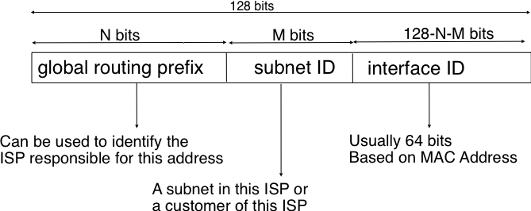
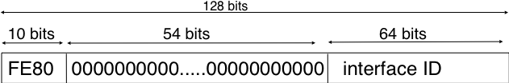
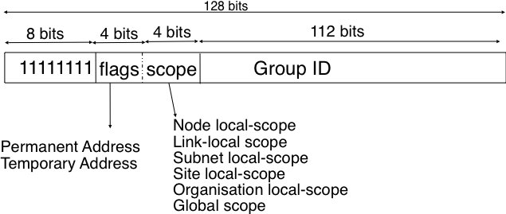
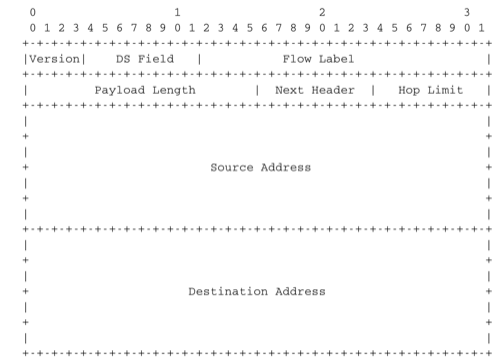
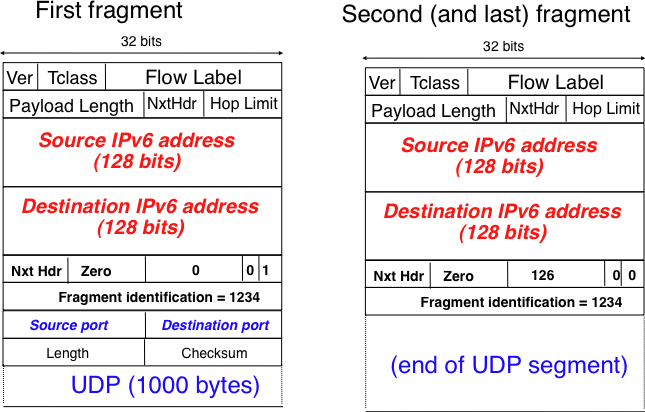

.. Copyright |copy| 2010 by Olivier Bonaventure
.. This file is licensed under a `creative commons licence <http://creativecommons.org/licenses/by-sa/3.0/>`_

IP version 6
============

In the late 1980s and early 1990s the growth of the Internet was causing several operational problems on routers. Many of these routers had a single CPU and up to 1 MByte of RAM to store their operating system, packet buffers and routing tables. Given the rate of allocation of IPv4 prefixes to companies and universities willing to join the Internet, the routing tables where growing very quickly and some feared that all IPv4 prefixes would quickly be allocated. In 1987, a study cited in :rfc:`1752`, estimated that there would be 100,000 networks in the near future. In August 1990, estimates indicated that the class B space would be exhausted by March 1994. 
Two types of solution were developed to solve this problem. The first short term solution was the introduction of Classless Inter Domain Routing (:term:`CIDR`). A second short term solution was the Network Address Translation (:term:`NAT`) mechanism, defined in :rfc:`1631`. NAT allowed multiple hosts to share a single public IP address, it is explained in section :ref:`Middleboxes`.

However, in parallel with these short-term solutions, which have allowed the IPv4 Internet to continue to be usable until now, the Internet Engineering Task Force started to work on developing a replacement for IPv4. This work started with an open call for proposals, outlined in :rfc:`1550`. Several groups responded to this call with proposals for a next generation Internet Protocol (IPng) :

 * TUBA proposed in :rfc:`1347` and :rfc:`1561`
 * PIP proposed in :rfc:`1621`
 * SIPP proposed in :rfc:`1710`

The IETF decided to pursue the development of IPng based on the SIPP proposal. As IP version `5` was already used by the experimental ST-2 protocol defined in :rfc:`1819`, the successor of IP version 4 is IP version 6. The initial IP version 6 defined in :rfc:`1752` was designed based on the following assumptions :

 * IPv6 addresses are encoded as a 128 bits field
 * The IPv6 header has a simple format that can easily be parsed by hardware devices
 * A host should be able to configure its IPv6 address automatically
 * Security must be part of IPv6

.. note:: The IPng address size

 When the work on IPng started, it was clear that 32 bits was too small to encode an IPng address and all proposals used longer addresses. However, there were many discussions about the most suitable address length. A first approach, proposed by SIP in :rfc:`1710`, was to use 64 bit addresses. A 64 bits address space was 4 billion times larger than the IPv4 address space and, furthermore, from an implementation perspective, 64 bit CPUs were being considered and 64 bit addresses would naturally fit inside their registers. Another approach was to use an existing address format. This was the TUBA proposal (:rfc:`1347`) that reuses the ISO CLNP 20 bytes addresses. The 20 bytes addresses provided room for growth, but using ISO CLNP was not favored by the IETF partially due to political reasons, despite the fact that mature CLNP implementations were already available. 128 bits appeared to be a reasonable compromise at that time.

IPv6 addressing architecture
----------------------------

The experience of IPv4 revealed that the scalability of a network layer protocol heavily depends on its addressing architecture. The designers of IPv6 spent a lot of effort defining its addressing architecture :rfc:`3513`. All IPv6 addresses are 128 bits wide. This implies that there are :math:`340,282,366,920,938,463,463,374,607,431,768,211,456 (3.4 \times 10^{38})` different IPv6 addresses. As the surface of the Earth is about 510,072,000 :math:`km^2`, this implies that there are about :math:`6.67 \times 10^{23}` IPv6 addresses per square meter on Earth. Compared to IPv4, which offers only 8 addresses per square kilometer, this is a significant improvement on paper. 

IPv6 supports unicast, multicast and anycast addresses. As with IPv4, an IPv6 unicast address is used to identify one datalink-layer interface on a host. If a host has several datalink layer interfaces (e.g. an Ethernet interface and a WiFi interface), then it needs several IPv6 addresses. In general, an IPv6 unicast address is structured as shown in the figure below.

   
   Structure of IPv6 unicast addresses

An IPv6 unicast address is composed of three parts :

#. A global routing prefix that is assigned to the Internet Service Provider that owns this block of addresses
#. A subnet identifier that identifies a customer of the ISP
#. An interface identifier that identifies a particular interface on an endsystem 

In today's deployments, interface identifiers are always 64 bits wide. This implies that while there are :math:`2^{128}` different IPv6 addresses, they must be grouped in :math:`2^{64}` subnets. This could appear as a waste of resources, however using 64 bits for the host identifier allows IPv6 addresses to be auto-configured and also provides some benefits from a security point of view, as explained in section ICMPv6_

.. note:: Textual representation of IPv6 addresses

 It is sometimes necessary to write IPv6 addresses in text format, e.g. when manually configuring addresses or for documentation purposes. The preferred format for writing IPv6 addresses is `x:x:x:x:x:x:x:x`, where the `x` 's are hexadecimal digits representing the eight 16-bit parts of the address. Here are a few examples of IPv6 addresses :

  - ABCD:EF01:2345:6789:ABCD:EF01:2345:6789
  - 2001:DB8:0:0:8:800:200C:417A
  - FE80:0:0:0:219:E3FF:FED7:1204

 IPv6 addresses often contain a long sequence of bits set to `0`. In this case, a compact notation has been defined. With this notation, `::` is used to indicate one or more groups of 16 bits blocks containing only bits set to `0`. For example, 
 
  - 2001:DB8:0:0:8:800:200C:417A  is represented as  `2001:DB8::8:800:200C:417A`
  - FF01:0:0:0:0:0:0:101   is represented as `FF01::101` 
  - 0:0:0:0:0:0:0:1 is represented as `::1`
  - 0:0:0:0:0:0:0:0 is represented as `\:\:`

 An IPv6 prefix can be represented as `address/length`, where `length` is the length of the prefix in bits. For example, the three notations below correspond to the same IPv6 prefix :

  - 2001:0DB8:0000:CD30:0000:0000:0000:0000/60
  - 2001:0DB8::CD30:0:0:0:0/60
  - 2001:0DB8:0:CD30::/60

.. index:: Provider Independent address
.. index:: Provider Aggregatable address

In practice, there are several types of IPv6 unicast address. Most of the `IPv6 unicast addresses <http://www.iana.org/assignments/ipv6-address-space/ipv6-address-space.xhtml>`_ are allocated in blocks under the responsibility of IANA_. The current IPv6 allocations are part of the `2000::/3` address block. Regional Internet Registries (RIR) such as RIPE_ in Europe,  ARIN_ in North-America or AfriNIC in Africa have each received a `block of IPv6 addresses <http://www.iana.org/assignments/ipv6-unicast-address-assignments/ipv6-unicast-address-assignments.xhtml>`_ that they sub-allocate to Internet Service Providers in their region.  The ISPs then sub-allocate addresses to their customers. 

When considering the allocation of IPv6 addresses, two types of address allocations are often distinguished. The RIRs allocate `provider-independent (PI)` addresses. PI addresses are usually allocated to Internet Service Providers and large companies that are connected to at least two different ISPs [CSP2009]_. Once a PI address block has been allocated to a company, this company can use its address block with the provider of its choice and change its provider at will. Internet Service Providers allocate `provider-aggregatable (PA)` address blocks from their own PI address block to their customers. A company that is connected to only one ISP should only use PA addresses. The drawback of PA addresses is that when a company using a PA address block changes its provider, it needs to change all the addresses that it uses. This can be a nightmare from an operational perspective and many companies are lobbying to obtain `PI` address blocks even if they are small and connected to a single provider. The typical size of the IPv6 address blocks are :

 - /32 for an Internet Service Provider
 - /48 for a single company
 - /64 for a single user (e.g. a home user connected via ADSL) 
 - /128 in the rare case when it is known that no more than one endhost will be attached

.. index:: Unique Local Unicast IPv6

For the companies that want to use IPv6 without being connected to the IPv6 Internet, :rfc:`4193` defines the `Unique Local Unicast (ULA)` addresses (`FC00::/7`). These ULA addresses play a similar role as the private IPv4 addresses defined in :rfc:`1918`. However, the size of the `FC00::/7` address block allows ULA to be much more flexible than private IPv4 addresses.

.. index:: ::1, ::

Furthermore, the IETF has reserved some IPv6 addresses for a special usage. The two most important ones are :

 - `0:0:0:0:0:0:0:1` (`::1` in compact form) is the IPv6 loopback address. This is the address of a logical interface that is always up and running on IPv6 enabled hosts. This is the equivalent of `127.0.0.1` in IPv4.
 - `0:0:0:0:0:0:0:0` (`\:\:` in compact form) is the unspecified IPv6 address. This is the IPv6 address that a host can use as source address when trying to acquire an official address.

.. index:: Link Local address

The last type of unicast IPv6 addresses are the `Link Local Unicast` addresses. These addresses are part of the `FE80::/10` address block and are defined in :rfc:`4291`. Each host can compute its own link local address by concatenating the `FE80::/64` prefix with the 64 bits identifier of its interface. Link local addresses can be used when hosts that are attached to the same link (or local area network) need to exchange packets. They are used notably for address discovery and auto-configuration purposes. Their usage is restricted to each link and a router cannot forward a packet whose source or destination address is a link local address. Link local addresses have also been defined for IPv4 :rfc:`3927`. However, the IPv4 link local addresses are only used when a host cannot obtain a regular IPv4 address, e.g. on an isolated LAN.

   
   IPv6 link local address structure

An important consequence of the IPv6 unicast addressing architecture and the utilisation of link-local addresses is that an IPv6 host has several IPv6 addresses. This implies that an IPv6 stack must be able to handle multiple IPv6 addresses. This was not always the case with IPv4.

:rfc:`4291` defines a special type of IPv6 anycast address. On a subnetwork having prefix `p/n`, the IPv6 address whose `128-n` low-order bits are set to `0` is the anycast address that corresponds to all routers inside this subnetwork. This anycast address can be used by hosts to quickly send a packet to any of the routers inside their own subnetwork.

Finally, :rfc:`4291` defines the structure of the IPv6 multicast addresses [#fmultiiana]_. This structure is depicted in the figure below

   
   IPv6 multicast address structure

The low order 112 bits of an IPv6 multicast address are the group's identifier. The high order bits are used as a marker to distinguish multicast addresses from unicast addresses. Notably, the 4 bits flag field indicates whether the address is temporary or permanent. Finally, the scope field indicates the boundaries of the forwarding of packets destined to a particular address. A link-local scope indicates that a router should not forward a packet destined to such a multicast address. An organisation local-scope indicates that a packet sent to such a multicast destination address should not leave the organisation. Finally the global scope is intended for multicast groups spanning the global Internet.

Among these addresses, some are well known. For example, all endsystem automatically belong to the `FF02::1` multicast group while all routers automatically belong to the `FF02::2` multicast group. We discuss IPv6 multicast later.

.. _IPv6Packet:

IPv6 packet format
------------------

The IPv6 packet format was heavily inspired by the packet format proposed for the SIPP protocol in :rfc:`1710`. The standard IPv6 header defined in :rfc:`2460` occupies 40 bytes and contains 8 different fields, as shown in the figure below.

   The IP version 6 header (:rfc:`2460`)

Apart from the source and destination addresses, the IPv6 header contains the following fields :

 - `version` : a 4 bits field set to `6` and intended to allow IP to evolve in the future if needed
 - `Traffic class` : this 8 bits field plays a similar role as the `DS` byte in the IPv4 header
 - `Flow label` : this field was initially intended to be used to tag packets belonging to the same `flow`. However, as of this writing, there is no clear guideline on how this field should be used by hosts and routers
 - `Payload length` : this is the size of the packet payload in bytes. As the length is encoded as a 16 bits field, an IPv6 packet can contain up to 65535 bytes of payload.
 - `Next Header` : this 8 bits field indicates the type [#fianaprotocol]_ of header that follows the IPv6 header. It can be a transport layer header (e.g. `6` for TCP or `17` for UDP) or an IPv6 option. Handling options as a next header allows simplifying the processing of IPv6 packets compared to IPv4.
 - `Hop Limit` : this 8 bits field indicates the number of routers that can forward the packet. It is decremented by one by each router and has the same purpose as the TTL field of the IPv4 header.

In comparison with IPv4, the IPv6 packets are much simpler and easier to process by routers. A first important difference is that there is no checksum inside the IPv6 header. This is mainly because all datalink layers and transport protocols include a checksum or a CRC to protect their frames/segments against transmission errors. Adding a checksum in the IPv6 header would have forced each router to recompute the checksum of all packets, with limited benefit in detecting errors. In practice, an IP checksum allows for catching errors that occur inside routers (e.g. due to memory corruption) before the packet reaches its destination. However, this benefit was found to be too small given the reliability of current memories and the cost of computing the checksum on each router.

A second difference with IPv4 is that the IPv6 header does not support fragmentation and reassembly. Experience with IPv4 has shown that fragmenting packets in routers was costly [KM1995]_ and the developers of IPv6 have decided that routers would not fragment packets anymore. If a router receives a packet that is too long to be forwarded, the packet is dropped and the router returns an ICMPv6 messages to inform the sender of the problem. The sender can then either fragment the packet or perform Path MTU discovery. In IPv6, packet fragmentation is performed only by the source by using IPv6 options.

The third difference are the IPv6 options, which are simpler and easier to process than the IPv4 options.

.. note:: Header compression on low bandwidth links

 Given the size of the IPv6 header, it can cause huge overhead on low bandwidth links, especially when small packets are exchanged such as for Voice over IP applications. In such environments, several techniques can be used to reduce the overhead. A first solution is to use data compression in the datalink layer to compress all the information exchanged [Thomborson1992]_. These techniques are similar to the data compression algorithms used in tools such as :manpage:`compress(1)` or :manpage:`gzip(1)` :rfc:`1951`. They compress streams of bits without taking advantage of the fact that these streams contain IP packets with a known structure. A second solution is to compress the IP and TCP header. These header compression techniques, such as the one defined in :rfc:`2507` take advantage of the redundancy found in successive packets from the same flow to significantly reduce the size of the protocol headers. Another solution is to define a compressed encoding of the IPv6 header that matches the capabilities of the underlying datalink layer :rfc:`4944`. 

.. _IPv6Options:

IPv6 options
------------

In IPv6, each option is considered as one header containing a multiple of 8 bytes to ensure that IPv6 options in a packet are aligned on 64 bit boundaries. IPv6 defines several type of options :

 - the hop-by-hop options are options that must be processed by the routers on the packet's path 
 - the type 0 routing header, which is similar to the IPv4 loose source routing option
 - the fragmentation option, which is used when fragmenting an IPv6 packet
 - the destination options 
 - the security options that allow IPv6 hosts to exchange packets with cryptographic authentication (AH header) or encryption and authentication (ESP header)

:rfc:`2460` provides lots of detail on the encodings of the different types of options. In this section, we only discus some of them. The reader may consult :rfc:`2460` for more information about the other options. The first point to note is that each option contains a `Next Header` field, which indicates the type of header that follows the option. A second point to note is that in order to allow routers to efficiently parse IPv6 packets, the options that must be processed by routers (hop-by-hop options and type 0 routing header) must appear first in the packet. This allows the router to process a packet without being forced to analyse all the packet's options. A third point to note is that hop-by-hop and destination options are encoded using a `type length value` format. Furthermore, the `type` field contains bits that indicate whether a router that does not understand this option should ignore the option or discard the packet. This allows the introduction of new options into the network without forcing all devices to be upgraded to support them at the same time.

.. index:: jumbogram

Two `hop-by-hop` options have been defined. :rfc:`2675` specifies the jumbogram that enables IPv6 to support packets containing a payload larger than 65535 bytes. These jumbo packets have their `payload length` set to `0` and the jumbogram option contains the packet length as a 32 bits field. Such packets can only be sent from a source to a destination if all the routers on the path support this option. However, as of this writing it does not seem that the jumbogram option has been implemented. The router alert option defined in :rfc:`2711` is the second example of a `hop-by-hop` option. The packets that contain this option should be processed in a special way by intermediate routers. This option is used for IP packets that carry Resource Reservation Protocol (RSVP) messages. Its usage is explained later.

The type 0 routing header defined in :rfc:`2460` is an example of an IPv6 option that must be processed by some routers. This option is encoded as shown below.

.. figure:: pkt/ipv6-routing-0.png
   :align: center
   :scale: 100

   The Type 0 routing header (:rfc:`2460`)

The type 0 routing option was intended to allow a host to indicate a loose source route that should be followed by a packet by specifying the addresses of some of the routers that must forward this packet. Unfortunately, further work with this routing header, including an entertaining demonstration with scapy_ [BE2007]_ , revealed some severe security problems with this routing header. For this reason, loose source routing with the type 0 routing header has been removed from the IPv6 specification :rfc:`5095`.
  
.. index:: IPv6 fragmentation

In IPv6, fragmentation is performed exclusively by the source host and relies on the fragmentation header. This 64 bits header is composed of six fields :

 - a `Next Header` field that indicates the type of the header that follows the fragmentation header
 - a `reserved` field set to `0`. 
 - the `Fragment Offset` is a 13-bit unsigned integer that contains the offset, in 8 bytes units, of the data following this header, relative to the start of the original packet. 
 - the `More` flag, which is set to `0` in the last fragment of a packet and to `1` in all other fragments. 
 - the 32 bits `Identification` field indicates to which original packet a fragment belongs. When a host sends fragmented packets, it should ensure that it does not reuse the same `identification` field for packets sent to the same destination during a period of `MSL` seconds. This is easier with the 32 bits `identification` used in the IPv6 fragmentation header, than with the 16 bits `identification` field of the IPv4 header.

Some IPv6 implementations send the fragments of a packet in increasing fragment offset order, starting from the first fragment. Others send the fragments in reverse order, starting from the last fragment. The latter solution can be advantageous for the host that needs to reassemble the fragments, as it can easily allocate the buffer required to reassemble all fragments of the packet upon reception of the last fragment. When a host receives the first fragment of an IPv6 packet, it cannot know a priori the length of the entire IPv6 packet. 

The figure below provides an example of a fragmented IPv6 packet containing a UDP segment. The `Next Header` type reserved for the IPv6 fragmentation option is 44. 

   
   IPv6 fragmentation example

Finally, the last type of IPv6 options is the Encaspulating Security Payload (ESP) defined in :rfc:`4303` and the Authentication Header (AH) defined in :rfc:`4302`. These two headers are used by IPSec :rfc:`4301`. They are discussed in another chapter.

.. _ICMPv6:

ICMP version 6
==============

ICMPv6 defined in :rfc:`4443` is the companion protocol for IPv6 as ICMPv4 is the companion protocol for IPv4. ICMPv6 is used by routers and hosts to report problems when processing IPv6 packets. However, as we will see in chapter :doc:`../lan/lan`, ICMPv6 is also used when auto-configuring addresses.

The traditional utilisation of ICMPv6 is similar to ICMPv4. ICMPv6 messages are carried inside IPv6 packets (the `Next Header` field for ICMPv6 is 58). Each ICMP message contains an 8 bits header with a `type` field, a `code` field and a 16 bits checksum computed over the entire ICMPv6 message. The message body contains a copy of the IPv6 packet in error.

.. figure:: pkt/icmpv6.png
   :align: center
   :scale: 100
  
   ICMP version 6 packet format

.. comment:: Number 4 below... "but"... what follows the but?

ICMPv6 specifies two classes of messages : error messages that indicate a problem in handling a packet and informational messages. Four types of error messages are defined in :rfc:`4443` :

 - 1 : Destination Unreachable. Such an ICMPv6 message is sent when the destination address of a packet is unreachable. The `code` field of the ICMP header contains additional information about the type of unreachability. The following codes are specified in :rfc:`4443` 
     - 0 : No route to destination. This indicates that the router that sent the ICMPv6 message did not have a route towards the packet's destination
     - 1 : Communication with destination administratively prohibited. This indicates that a firewall has refused to forward the packet towards its destination. 
     - 2 : Beyond scope of source address. This message can be sent if the source is using link-local addresses to reach a global unicast address outside its subnet.
     - 3 : Address unreachable. This message indicates that the packet reached the subnet of the destination, but the host that owns this destination address cannot be reached.
     - 4 : Port unreachable. This message indicates that the IPv6 packet was received by the destination, but 
 - 2 : Packet Too Big. The router that was to send the ICMPv6 message received an IPv6 packet that is larger than the MTU of the outgoing link. The ICMPv6 message contains the MTU of this link in bytes. This allows the sending host to implement Path MTU discovery :rfc:`1981`
 - 3 : Time Exceeded. This error message can be sent either by a router or by a host. A router would set `code` to `0` to report the reception of a packet whose `Hop Limit` reached `0`. A host would set `code` to `1` to report that it was unable to reassemble received IPv6 fragments.
 - 4 : Parameter Problem. This ICMPv6 message is used to report either the reception of an IPv6 packet with an erroneous header field (type `0`) or an unknown `Next Header` or IP option (types `1` and `2`). In this case, the message body contains the erroneous IPv6 packet and the first 32 bits of the message body contain a pointer to the error.

.. index:: ping6

Two types of informational ICMPv6 messages are defined in :rfc:`4443` : `echo request` and `echo reply`, which are used to test the reachability of a destination by using :manpage:`ping6(8)`.

.. index:: traceroute6

ICMPv6 also allows the discovery of the path between a source and a destination by using :manpage:`traceroute6(8)`. The output below shows a traceroute between a host at UCLouvain and one of the main IETF servers. Note that this IPv6 path is different than the IPv4 path that was described earlier although the two traceroutes were performed at the same time.

.. code-block:: text
 
 traceroute6 www.ietf.org
 traceroute6 to www.ietf.org (2001:1890:1112:1::20) from 2001:6a8:3080:2:217:f2ff:fed6:65c0, 30 hops max, 12 byte packets
  1  2001:6a8:3080:2::1  13.821 ms  0.301 ms  0.324 ms
  2  2001:6a8:3000:8000::1  0.651 ms  0.51 ms  0.495 ms
  3  10ge.cr2.bruvil.belnet.net  3.402 ms  3.34 ms  3.33 ms
  4  10ge.cr2.brueve.belnet.net  3.668 ms 10ge.cr2.brueve.belnet.net  3.988 ms 10ge.cr2.brueve.belnet.net  3.699 ms
  5  belnet.rt1.ams.nl.geant2.net  10.598 ms  7.214 ms  10.082 ms
  6  so-7-0-0.rt2.cop.dk.geant2.net  20.19 ms  20.002 ms  20.064 ms
  7  kbn-ipv6-b1.ipv6.telia.net  21.078 ms  20.868 ms  20.864 ms
  8  s-ipv6-b1-link.ipv6.telia.net  31.312 ms  31.113 ms  31.411 ms
  9  s-ipv6-b1-link.ipv6.telia.net  61.986 ms  61.988 ms  61.994 ms
  10  2001:1890:61:8909::1  121.716 ms  121.779 ms  121.177 ms
  11  2001:1890:61:9117::2  203.709 ms  203.305 ms  203.07 ms
  12  mail.ietf.org  204.172 ms  203.755 ms  203.748 ms

.. send after Ethernet

.. note:: Rate limitation of ICMP messages

 High-end hardware based routers use special purpose chips on their interfaces to forward IPv6 packets at line rate. These chips are optimised to process `correct` IP packets. They are not able to create ICMP messages at line rate. When such a chip receives an IP packet that triggers an ICMP message, it interrupts the main CPU of the router and the software running on this CPU processes the packet. This CPU is much slower than the hardware acceleration found on the interfaces [Gill2004]_. It would be overloaded if it had to process IP packets at line rate and generate one ICMP message for each received packet. To protect this CPU, high-end routers limit the rate at which the hardware can interrupt the main CPU and thus the rate at which ICMP messages can be generated. This implies that not all erroneous IP packets cause the transmission of an ICMP message. The risk of overloading the main CPU of the router is also the reason why using hop-by-hop IPv6 options, including the router alter option is discouraged [#falert]_. 

Interactions between IPv6 and the datalink layer
------------------------------------------------

.. index:: Neighbour Discovery Protocol

There are several differences between IPv6 and IPv4 when considering their interactions with the datalink layer. In IPv6, the interactions between the network and the datalink layer is performed using ICMPv6. 

First ICMPv6 is used to resolve the datalink layer address that corresponds to a given IPv6 address. This part of ICMPv6 is the Neighbour Discovery Protocol (NDP) defined in :rfc:`4861`. NDP is similar to ARP, but there are two important differences. First, NDP messages are exchanged in ICMPv6 messages while ARP messages are sent as datalink layer frames. Second, an ARP request is sent as a broadcast frame while an NDP solication message is sent as a multicast ICMPv6 packet that is transported inside a multicast frame. The operation of the NDP protocol is similar to ARP. To obtain an address mapping, a host sends a Neighbour Solicitation message. This message is sent inside an ICMPv6 message that is placed in an IPv6 packet whose source address is the IPv6 address of the requesting host and the destination address is the all-hosts IPv6 multicast address (`FF02::1`) to which all IPv6 hosts listen. The Neighbour Solication contains the requested IPv6 address. The owner of the requested address replies by sending a unicast Neighbour Advertisement message to the requesting host. NDP suffers from similar security issues as the ARP protocol. However, it is possible to secure NDP by using the `Cryptographically Generated IPv6 Addresses` (CGA) defined in :rfc:`3972`. The Secure Neighbour Discovery Protocol is defined in :rfc:`3971`, but a detailed description of this protocol is outside the scope of this chapter.

.. index:: DHCPv6, SLAC, Stateless Address Configuration

IPv6 networks also support the Dynamic Host Configuration Protocol. The IPv6 extensions to DHCP are defined in :rfc:`3315`. The operation of DHCPv6 is similar to DHCP that was described earlier. In addition to DHCPv6, IPv6 networks support another mechanism to assign IPv6 addresses to hosts. This is the Stateless Address Configuration (SLAC) defined in :rfc:`4862`. When a host boots, it derives its identifier from its datalink layer address [#fprivacy]_ and concatenates this 64 bits identifier to the `FE80::/64` prefix to obtain its link-local IPv6 address. It then sends a Neighbour Sollicitation with its link-local address as a target to verify whether another host is using the same link-local address on this subnet. If it receives a Neighbour Advertisement indicating that the link-local address is used by another host, it generates another 64 bits identifier and sends again a Neighbour Sollicitation. If there is no answer, the host considers its link-local address to be valid. This address will be used as the source address for all NDP messages sent on the subnet. To automatically configure its global IPv6 address, the host must know the globally routable IPv6 prefix that is used on the local subnet. IPv6 routers regularly send ICMPv6 Router Advertisement messages that indicate the IPv6 prefix assigned to each subnet. Upon reception of this message, the host can derive its global IPv6 address by concatenating its 64 bits identifier with the received prefix. It concludes the SLAC by sending a Neighbour Solicitation message targeted at its global IPv6 address to ensure that another host is not using the same IPv6 address.

.. :rfc:`5072` ipv6 ppp

.. rubric:: Footnotes

.. [#fmultiiana] The full list of allocated IPv6 multicast addresses is available at http://www.iana.org/assignments/ipv6-multicast-addresses

.. [#fianaprotocol] The IANA_ maintains the list of all allocated Next Header types at http://www.iana.org/assignments/protocol-numbers/ The same registry is used for the IPv4 protocol field and for the IPv6 Next Header.

.. [#falert] For a discussion of the issues with the router alert IP option, see http://tools.ietf.org/html/draft-rahman-rtg-router-alert-dangerous-00 or
 http://tools.ietf.org/html/draft-rahman-rtg-router-alert-considerations-03

.. [#fprivacy] Using a datalink layer address to derive a 64 bits identifier for each host raises privacy concerns as the host will always use the same identifier. Attackers could use this to track hosts on the Internet. An extension to the Stateless Address Configuration mechanism that does not raise privacy concerns is defined in :rfc:`4941`. These privacy extensions allow a host to generate its 64 bits identifier randomly everytime it attaches to a subnet. It then becomes impossible for an attacker to use the 64-bits identifier to track a host. 
