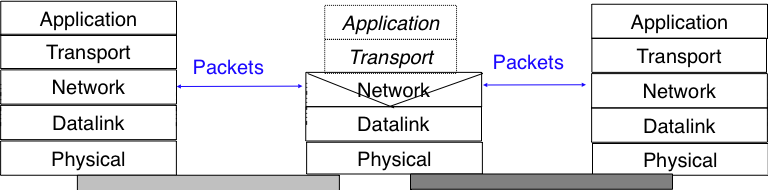
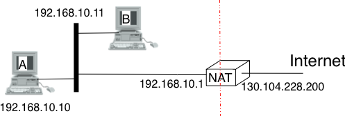

.. Copyright |copy| 2010 by Olivier Bonaventure
.. This file is licensed under a `creative commons licence <http://creativecommons.org/licenses/by-sa/3.0/>`_

.. _Middleboxes:

Middleboxes
===========

.. index:: Middlebox

When the TCP/IP architecture and the IP protocol were defined, two types of devices were considered in the network layer : endhosts and routers. Endhosts are the sources and destinations of IP packets while routers forward packets. When a router forwards an IP packet, it consults its forwarding table, updates the packets' TTL, recomputes its checksum and forward it to the nexthop. A router does not need to read nor change the contents of the packet's payload.

However, in today's Internet, there exist devices that are not strictly routers but process, sometimes modify, and forward IP packets. These devices are often called `middleboxes` :rfc:`3234`. Some middleboxes operate only in the network layer, but most middleboxes are able to analyse the payload of the received packets and extract the transport header and in some cases the application layer protocols.  
  

   
   IP middleboxes and the reference model

In this section, we briefly describe two types of middleboxes : firewalls and network address translation (NAT) devices. A discussion of the different types of middleboxes with references may be found in :rfc:`3234`.

.. index:: firewall

Firewalls
---------

When the Internet was only a research network interconnecting research labs, security was not a concern and most hosts agreed to exchange packets over TCP connections with most other hosts. However, as companies and more and more users became connected to Internet, allowing unlimited access to the hosts managed by companies was becoming a concern. Furthermore, at the end of the 1980s, several security issues affected the Internet such as the first Internet worm [RE1989]_ and some widely publicised security breaches [Stoll1988]_ [CB2003]_ [Cheswick1990]_

    
These security problems convinced the industry that IP networks are a key part of the infrastructure of a company that should be protected by special devices like security guards and fences are used to protect buildings. These special devices were quickly called `firewalls`. A typical firewall has two interfaces :
 
  - an external interface connected to the global Internet
  - an internal interface connected to a trusted network

The first firewalls included configurable packet filters. A packet filter is a set of rules that define the security policy of a network. In practice, these rules are based on the values of fields of the IP or transport layer headers. Any field of the IP or transport header can be used in a firewall rule, but the most common ones :

 - filter on the source address. For example, a company may decide to discard all packets received from one of its competitors. In this case, all packets whose source address belong to the competitor's address block would be rejected 
 - filter on destination address. For example, the hosts of the research lab of a company may receive packets from the global Internet, but not the hosts of the financial department
 - filter on the `Protocol` number found in the IP header. For example, a company may only allow its hosts to use TCP or UDP, but not other more experimental transport protocols
 - filter on the TCP or UDP port numbers. For example, only the DNS server of a company should received UDP segments whose destination port is set to `53` or only the official SMTP servers of the company can send TCP segments whose source ports are set to `25`
 - filter on the TCP flags. For example, a simple solution to prohibit external hosts from opening TCP connections with hosts inside the company is to discard all TCP segments received from the external interface with only the `SYN` flag set.

Such firewalls are often called `stateless` firewalls because they do not maintain any state about the TCP connections that pass through them.

A second type of firewalls are the `stateful` firewalls. A stateful firewall tracks the state of each TCP connection passing through it. It maintains a TCB for each TCP connection. This TCB allows it to reassemble the received segments to extract their payload and perform verifications in the application layer. Some firewalls are able to inspect the URLs accessed by using HTTP and log all URLs visited or block TCP connections where a dangerous URL is exchanged. Some firewalls can verify that SMTP commands are used when a TCP connection is established on port `25` or that a TCP connection on port `80` carries HTTP commands and responses, ... 

.. note:: Beyond firewalls

 Besides the firewalls, different types of "security" devices have been installed at the periphery of corporate networks. Intrusion Detection Systems (IDS) such as the popular snort_ are stateful devices that are capable of matching reassembled segments against regular expressions that correspond to signatures of viruses, worms or other types of attacks. Deep Packet Inspection (DPI) is another type of middlebox that analyse the packet's payload and possibly reassemble TCP segments to detect inappropriate usages. While IDS are mainly used in corporate networks, DPI is mainly used in Internet Service Providers. Some ISPs use DPI to detect and limit the bandwidth consumed by peer-to-peer applications. Some countries such as China or Iran use DPI to detect inappropriate Internet usage.

.. index:: Network Address Translation, NAT

NAT
---

Network Address Translation (NAT) was proposed in [TE1993]_ and :rfc:`3022` as a short term solution to deal with the expected shortage of IPv4 addresses in the late 1980s - early 1990s. Combined with CIDR, NAT allowed to significantly slow the consumption of IPv4 addresses. A NAT is a middlebox that interconnects two networks that are using IPv4 addresses from different addressing spaces. Usually, one of these addressing spaces is the public Internet while the other is using the private IPv4 addresses defined in :rfc:`1918`.

A very common deployment of NAT is in broadband access routers as shown in the figure below. The broadband access router interconnects a home network, either WiFi or Ethernet based and the global Internet via one ISP over ADSL or CATV. A single IPv4 address is allocated to the broadband access router and network address translation allows all the hosts attached to the home network to share a single public IPv4 address.

   
   A simple NAT with one public IPv4 address

A second type of deployment is in enterprise networks as shown in the figure below. In this case, the NAT functionality is installed on a border router of the enterprise. A private IPv4 address is assigned to each enterprise host while the border router manages a pool containing several public IPv4 addresses. 

.. figure:: png/network-fig-159-c.png
   :align: center
   :scale: 70
   
   An enterprise NAT with several public IPv4 addresses

As the name implies, a NAT is a device that "translates" IP addresses. A NAT maintains a mapping table between the private IP addresses used in the internal network and the public IPv4 addresses. NAT allows a large number of hosts to share a pool of IP addresses because these hosts do not all access the global Internet at the same time. 

The simplest NAT is a middlebox that uses a one-to-one mapping between a private IP address and a public IP address. To understand its operation, let us assume that a NAT such as the one shown above has booted. When the NAT receives a first packet from source `S` in the internal network destined to the public Internet, it creates a mapping between internal address `S` and the first address of its pool of public addresses (`P1`). Then it translates the received packet so that it can be sent to the public Internet. This translation is performed as followed :

 - the source address of the packet (`S`) is replaced by the mapped public address (`P1`)
 - the checksum of the IP header is incrementally updated as its content has changed
 - if the packet carried a TCP or UDP segment, the transport layer checksum found of the included segment must also be updated as it is computed over the segment and a pseudo-header that includes the source and destination addresses

When a packet destined to `P1` is received from the public Internet, the NAT consults its mapping table to find `S`. The received packet is translated and forwarded in the internal network. 

This works as long as the pool of public IP addresses of the NAT does not become empty. In this case, a mapping must be removed from the mapping table to allow a packet from a new host to be translated. This garbage collection can be implemented by adding to each entry in the mapping table a timestamp that contains the last utilisation time of a mapping entry. This timestamp is updated each time a the corresponding entry is used. Then, the garbage collection algorithm can remove the oldest mapping entry in the table.

A drawback of such as simple enterprise NAT is the size of the pool of public IPv4 addresses that is often too small to allow a large number of hosts to share such a NAT. In this case, a better solution is to allow the NAT to translate both IP addresses and port numbers. 

Such a NAT maintains a mapping table that maps an internal IP address and TCP port number with an external IP address and TCP port number. When such a NAT receives a packet from the internal network, it performs a lookup in the mapping table with the packet's source IP address and source TCP port number. If a mapping is found, the source IP address and the source TCP port number of the packet are translated with the values found in the mapping table, the checksums are updated and the packet is sent to the global Internet. If no mapping is found, a new mapping is created with the first available couple `(IP address, TCP port number)` and the packet is translated. The entries of the mapping table are either removed at the end of the corresponding TCP connection is the NAT tracks TCP connection state like a stateful firewall or after some idle time.

When such a NAT receives a packet from the global Internet, it looks up its mapping table with the packet's destination IP address and destination TCP port number. If a mapping is found, the packet is translated and forwarded in the internal network. Otherwise, the packet is discarded as the NAT cannot determine to which particular internal host the packet should be forwarded. For this reason, 

With :math:`2^{16}` different port numbers, a NAT may support a large number of hosts with a single public IPv4 address. However, it should be noted that some applications open a large number of TCP connections [Miyakawa2008]_. Each of these TCP connections consumes one mapping entry in the NAT's mapping table. 

.. index:: Application Level Gateway, ALG

NAT allows many hosts to share one or a few public IPv4 addresses. However, using NAT has two important drawbacks. First, it is difficult for external hosts to open TCP connections with hosts that are behind a NAT. Some consider this to be a benefit from a security viewpoint. However, a NAT should not be confused with a firewall as there are some techniques to traverse NATs. Second, NAT breaks the end-to-end transparency of the network and transport layers. The main problem is when an application layer protocol uses IP addresses in some of the ADUs that it sends. A popular example is ftp defined in :rfc:`959`. In this case, there is a mismatch between the packet header translated by the NAT and the packet payload. The only solution to solve this problem is to place on the NAT an Application Level Gateway (ALG) that understands the application layer protocol and can thus translate the IP addresses and port numbers found in the ADUs. However, defining an ALG for each application is costly and application developers should avoid using IP addresses in the messages exchanged in the application layer :rfc:`3235`.

.. index:: NAT66
.. note:: IPv6 and NAT

 NAT has been very successful with IPv4. Given the size of the IPv6 addressing space, the IPv6 designers expected that NAT would never be useful with IPv6. The end-to-end transparency of IPv6 has been one of its key selling points compared to IPv4. However, recently the expected shortage of IPv4 addresses lead enterprise network administrators to consider IPv6 more seriously. One of the results of this analysis is that the IETF is considering the definition of NAT devices [WB2008]_ that are IPv6 specific. Another usage of NAT with IPv6 is to allow IPv6 hosts to access IPv4 destinations and conversely. The early IPv6 specifications included the Network Address Translation - Protocol Translation (NAT-PT) mechanism defined in :rfc:`2766`. This mechanism was later deprecated in :rfc:`4966` but has been recently restarted under the name NAT64 [BMvB2009]_. A NAT64 is a middlebox that performs the IPv6<->IPv4 packet translation to allow IPv6 hosts to contact IPv4 servers. 

