================== 
The network layer
==================

The network layer is a very important layer in computer networks as it is the glue that allows the applications running above the transport layers to use a wide range of different and interconnected networks built with different datalink and physical layers. The network layer enables applications to run above networks built with very different network technologies. 

In this chapter, we first explain the principles of the network layer. These principles include the datagram and virtual circuit modes, the separation between the data plane and the control plane and the algorithms used by routing protocols. Then, we explain in more details the network layer in the Internet, starting with IPv4 and IPv6 and then moving to the routing protocols (RIP, OSPF and BGP).

Principles 
###########

The main objective of the network layer is to allow endsystems connected to different networks to exchange information through intermediate systems that are called :term:`router`s. The unit of information in the network layer is called a :term:`packet`.

.. figure:: png/network-fig-001-c.png
   :align: center
   :scale: 70
   
   The network layer in the reference model

Before explaining the network layer in details, it is useful to first analyse the service provided by the `datalink` layer. There are many variants of the datalink layer. Some provide a connection-oriented service while others provide a connectionless service. In this section, we focus on connectionless datalink layer services that are the most widely used. Using a connection-oriented datalink layer causes some problems that are beyond the scope of this chapter. See :rfc:`3819` for a discussion on this topic.

.. figure:: png/network-fig-003-c.png
   :align: center
   :scale: 70   

   The point-to-point datalink layer

There are three main types of datalink layers. The simplest datalink layer is when there are only two communicating systems that are directly connected through the physical layer. Such a datalink layer is used when there is a point-to-point link between the two communicating systems. The two systems can be endsystems or routers. :abbr:`PPP (Point-to-Point Protocol)` defined in :rfc:`1661` in an example of such a point-to-point datalink layer. Datalink layers exchange `frames` and a datalink :term:`frame` sent by a datalink layer entity on the left is transmitted through the physical layer so that it can reach the datalink layer entity on the right. Point-to-point datalink layers can either provide an unreliable service (frames can be corrupted or lost) or a reliable service (in this case, the datalink layer includes retransmission mechanisms similar to the ones used in the transport layer). The unreliable service is frequently used above physical layers (e.g. optical fiber, twisted pairs) having a low bit error ratio while reliability mechanisms are often used in wireless networks to recover locally from transmission errors.

The second type of datalink layer is the one used in Local Area Networks (LAN). Conceptually, a LAN is a set of communicating devices such that any two devices can directly exchange frames through the datalink layer. Both endsystems and routers can be connected to a LAN. Some LANs only connect a few devices, but there are LANs may connect hundreds or even thousands of devices.

.. figure:: png/network-fig-002-c.png
   :align: center
   :scale: 70    
   
   A local area network 

We describe in the next chapter the organisation and the operation of Local Area Networks. An important difference between the point-to-point datalink layers and the datalink layers used in LANs is that in a LAN, each communicating device is identified by a unique `datalink layer address`. This address is usually embedded in the hardware of the device and different types of LANs use different types of datalink layer addresses. A communicating device attached to a LAN can send a datalink frame to any other communicating device that is attached to the same LAN. Most LANs also support special broadcast and multicast datalink layer addresses. A frame sent to the broadcast address of the LAN is delivered to all communicating devices that are attached to the LAN. The multicast addresses are used to identify groups of communicating devices. When a frame is sent towards a multicast datalink layer address, it is delivered by the LAN to all communicating devices that belong to the corresponding group.

.. index:: NBMA, Non-Broadcast Multi-Access Networks

The third type of datalink layers are used in Non-Broadcast Multi-Access (NBMA) networks. These networks are used to interconnect devices like a LAN. All devices attached to an NBMA network are identified by a unique datalink layer address. However, and this is the main difference between an NBMA network and a traditionnal LAN, the NBMA service only supports unicast. The datalink layer service provided by an NBMA network does not support neither broadcast nor multicast.

Unfortunately no datalink layer is able to send frames of unlimited side. Each datalink layer is characterised by a maximum frame size. There are more than a dozen different datalink layers and unfortunately most of them use a different maximum frame size. The network layer must cope with the heterogeinity of the datalink layer.

The network layer itself relies on the following principles : 

 #. Each network layer entity is identified by a `network layer address`. This address is independent of the datalink layer addresses that it may use.
 #. The service provided by the network layer does not depend on the service or the internal organisation of the underlying datalink layers.
 #. The network layer is conceptually divided in two planes : the `data plane` and the `control plane`. The `data plane` contains the protocols and mechanisms that allow hosts and routers to exchange packets carrying user data. The `control plane` contains the protocols and mechanisms that enable routers to efficiently learn how to forward packets towards their final destination. 

The independance of the network layer from the underlying datalink layer is a key principle of the network layer. It ensures that the network layer can be used to allow hosts attached to different types of datalink layers to exchange packets through intermediate routers. Furthermore, this allows the datalink layers and the network layer to evolve independently from each other. This enables the network layer to be easily adapted to a new datalink layer every time a new datalink layer is invented.

There are two types of services that can be provided by the network layer :

 - an `unreliable connectionless` service
 - a `connection-oriented`, reliable or unreliable, service

Connection-oriented services have been popular with technologies such as :term:`X.25` and :term:`ATM` or :term:`frame-relay`, but nowadays most networks use an `unreliable connectionless` service. This is our main focus in this chapter.

Organisation of the network layer
=================================

.. index:: datagram, virtual circuit

There are two possible internal organisations of the network layer : 

 - datagram 
 - virtual circuits 

The internal organisation of the network is orthogonal to the service that it provides, but most of the time a datagram organisation is used to provide a connectionless service while a virtual circuit organisation is used in networks that provide a connection-oriented service.

Datagram organisation
---------------------

The first and most popular organisation of the network layer is the datagram organisation. This organisation is inspired from the organisation of the postal service. Each host is identified by a `network layer address`. To send information to a remote host, a host creates a packet that contains :

 - the network layer address of the destination host
 - its own network layer address
 - the information to be sent

The network layer limits the maximum packet size. Thus, the information must have been divided in packets by the transport layer before being passed to the network layer. 

To understand the datagram organisation, let us consider the figure below. A network layer address, represented by a letter, has been assigned to each host and router. To send some information to host `J`, host `A` creates a packet containing its own address, the destination address and the information to be exchanged.

.. figure:: png/network-fig-006-c.png
   :align: center
   :scale: 70   

   A simple internetwork 

.. index:: hop-by-hop forwarding

With the datagram organisation, routers use `hop-by-hop forwarding`. This means that when a router receives a packet that is not destined to itself, it lookups the destination address of the packet in its `routing table`. A `routing table` is a data structure that maps each destination address (or set of destination addresses) on the outgoing interface over which a packet destined to this address must be forwarded to reach its final destination. 

The main constraint imposed on the routing tables is that they must allow any host in the network to reach any other host. This implies that each router must know a route towards each destination but also that the paths composed from the information stored in the routing tables cannot not contain loops. Otherwise, some destinations would be unreachable. 

In the example above, host `A` sends its packet to router `R1`. `R1` consults its routing table and forwards the packet towards `R2`. Based on its own routing table, `R2` decides to forward the packet to `R5` that can deliver it to its destination.

To allow hosts to exchange packets, a network relies on two different types of protocols and mechanisms. First, there must be a precise definition of the format of the packets that are sent by hosts and processed by routers. Second, the algorithm used by the routers to forward these packets must be defined. This protocol and this algorithm are part of the `data plane` of the network layer. The `data plane` contains all the protocols and algorithms that are used by hosts and routers to create and process the packets that contain user data.

The `data plane` and in particular the forwarding algorithm used by the routers depends on the routing tables that are maintained on reach router. These routing tables can be maintained by using various techniques (manual configuration, distributed protocols, centralised computation, ...). These techniques are part of the `control plane` of the network layer. The `control plane` contains all the protocols and mechanisms that are used to compute and install routing tables  on the routers. 

The datagram organisation has been very popular in computer networks. Datagram based network layers include IPv4 and IPv6 in the global Internet, CLNP defined by the ISO, IPX defined by Novell or XNS defined by Xerox.

Virtual circuit organisation
----------------------------

The main advantage of the datagram organisation is its simplicity. The principles of this organisation can be easily understood. Furthermore, it allows a host to easily send a packet towards any destination at any time. However, as each packet is forwarded independently by intermediate routers, packets sent by a host may not follow the same path to reach a given destination. This may cause packet reordering which may be annoying for transport protocols. Furthermore, as a router using `hop-by-hop forwarding` always forwards over the same outgoing interface the packets sent towards the same destination, this may cause congestion over some links.

The second organisation of the network layer, called `virtual circuits` has been inspired from the organisation of the telephone networks. Telephone networks have been designed to carry phone calls that usually last a few minutes. Each phone is identified by a telephone number and is attached to a telephone switch. To initiate a phone call, a telephone first needs to send the destination's phone number to its local switch. The switch cooperates with the other switches in the network to create a bi-directionnal channel between the two telephones through the network. This channel will be used by the two telephones during the lifetime of the call and will be released at the end of the call. Until the 1960s, most of these channels were created manually by the telephone operators upon request of the caller. Today's telephone networks use automated switches and allow several channels to be carried over the same physical link, but the principles remain roughly the same.

In a network using virtual circuits all hosts are identified with a network layer address. However, a host must explicitely request the establishment of a `virtual circuit before being able to send packets to a destination host. 
The request to establish a virtual circuit is processed by the `control plane` that installs state to create the virtual circuit between the source and the destination through intermediate routers. All the packets that are sent on the virtual circuit contain a virtual circuit identifier that allows the routers to determine to which virtual circuit each packet belongs. This is illustrated in the figure below with one virtual circuit between host `A` and host `I` and another one between host `A` and host `J`. 

.. figure:: png/network-fig-008-c.png
   :align: center
   :scale: 70   

   A simple internetwork using virtual-circuits

				   
The establishment of a virtual circuit is performed by using a `signalling protocol` in the `control plane`. Usually, the source host sends a signalling message to indicate to its router the address of the destination and possibly some performance characteristics of the virtual circuit to be established. The first router can process the signalling message in two different ways. 

A first solution is for the router to consult its routing table, remember the characteristics of the requested virtual circuit and forward it over its outgoing interface towards the destination. The signalling message is thus forwarded hop-by-hop until it reaches the destination and the virtual circuit is opened along the path followed by the signalling message. This is illustrated with the red virtual circuit in the figure below.

.. figure:: png/network-fig-007-c.png
   :align: center
   :scale: 70   

   Virtual circuit establishment

.. index:: source routing, label

A second solution can be used if the routers know the entire topology of the network. In this case, the first router can use a technique called `source routing`. Upon reception of the signalling message, the first router chooses the path of the virtual circuit in the network. This path is encoded as the list of the addresses of all intermediate routers to reach the destination. It is included in the signalling message and intermediate routers can remove their address from the signalling message before forwarding it. This technique enables routers to better spread the virtual circuits throughout the network. If the routers know the load of remote links, they can also select the less loaded path when establishing a virtual circuit. This solution is illustrated with the blue circuit in the figure above.
	   
The last point to be discussed about the virtual circuit organisation is its `data plane`. The `data plane` defines mainly the format of the data packets and the algorithm used by routers to forward packets. The data packets contain a virtual circuit identifier that is encoded as a fixed number of bits. These virtual circuit identifiers are usually called `labels`. 

Each host maintains a flow table that associates a label with each virtual circuit that is has established. When a router receives a packet that contains a label, it extracts the label and consults its `label forwarding table`. This table is a data structure that maps each couple `(incoming interface, label)` to the outgoing interface to be used to forward the packet and the label that must be placed in the outgoing packets. In practice, the label forwarding table can be implemented as a vector and the couple `(incoming interface, label)` is the index of the entry in the vector that contains the outgoing interface and the outgoing label. Thus a single memory access is sufficient to consult the label forwarding table. The utilisation of the label forwarding table is illustrated in the figure below.

.. figure:: png/network-fig-009-c.png
   :align: center
   :scale: 70   

   Label forwarding tables in a network using virtual circuits

The virtual circuit organisation has been mainly used in public networks, starting from X.25 and then Frame elay and Asynchronous Transfert Mode (ATM) network. 

Both the datagram and virtual circuit organisations have advantages and drawbacks. The main advantage of the datagram organisation is that hosts can easily send packets to any number of destinations while the virtual circuit organisation requires the establishment of a virtual circuit before the transmission of data packet. This solution can be costly for hosts that exchange small amounts of data. On the other hand, the main advantage of the virtual circuit organisation is that the forwarding algorithm used by routers is simpler than when using the datagram organisation. Furthermore, the utilisation of virtual circuits may allow the load to be better spread through the network thanks to the utilisation of multiple virtual circuits. The MultiProtocol Label Switching (MPLS) technique that we discuss in chapter ??? can be considered as a good compromise between datagram and virtual circuits. MPLS uses virtual circuits between routers, but does not extend them to the endhosts.

.. maybe add more information

The control plane
=================

One of the objectives of the `control plane` in the network layer is to maintain the routing tables that are used on all routers. As indicated earlier, a routing table is a data structure that contains, for each destination address (or block of addresses) known by the router, the outgoing interface over which the router must forward a packet destined to this address. The routing table may also contain additional information such as the address of the next router on the path towards the destination or an estimation of the cost of this path. 

In this section, we discuss the three main techniques that can be used to maintain the routing tables in a network.

Static routing
--------------

.. comment:: comment formaliser l'absence de boucles

The simplest solution is to pre-compute all the routing tables of all routers solution and to install them on each router. Several algorithms can be used to compute these tables. A simple solution is to use shortest path routing and to minimise the number of intermediate routers to reach each destination. More complex algorithms can take into account the expected load on the links to ensure that congestion does not occur for a given traffic demand. Those algorithms must all ensure that :

 - all routers are configured with a route to reach each destination
 - the paths composed with the entries found in the routing tables do not cause forwarding loops

The figure below shows sample routing tables in a five routers network.

.. figure:: png/network-fig-011-c.png
   :align: center
   :scale: 70   

   Routing tables in a simple network 

The main drawback of static routing is that it does not adapt to the evolution of the network. When a new router or link is added, all routing tables must be recomputed. Furthermore, when a link or router fails, the routing tables must be updated as well.

Distance vector routing
-----------------------

Distance vector routing is a simple distributed routing protocol. Distance vector routing allows the routers to automatically discover the destinations that are reachable inside the network and the shortest path to reach each of these destinations. The shortest path is computed based on `metrics` or `costs` that are associated to each link. We use `l.cost` to represent the metric that has been configured for link `l` on a router. 

Each router maintains a routing table. The routing table `R` can be modelled as a data structure that stores, for each known destination address `d`, the following attributes :

 - `R[d].link` is the outgoing link that the router uses to forward packets towards destination `d`
 - `R[d].cost` is the sum of the metrics of the links that compose the shortest path to reach destination `d`
 - `R[d].time` is the timestamp of the last distance vector containing destination `d`

A router that uses distance vector routing regularly sends its distance vector over all its interfaces. The distance vector is a summary of the router's routing table that indicates the distance towards each known destination. This distance vector can be computed from the routinng table by using the pseudo-code below ::

 Every N seconds: 
  v=Vector()
  for each destination=d in R[]
  {
   v.add(Pair(d,R[d].cost));
  }
  for each interface
  {
   Send(v,interface)  # send vector v on this interface
  }

When a router boots, it does not know any destination in the network and its routing table only contains itself. It thus sends to all its neighbours a distance vector that contains only its address at a distance of `0`. When a router receives a distance vector on link `l`, it processes it as follows ::

 Received(Vector V[],link l)
 { # received vector from link l 
  for each destination=d in V[]
  {
   if not (d isin R[])
    { # new route 
      R[d].cost=V[d].cost+l.cost;
      R[d].link=l;
      R[d].time=now;
    }
    else
    { 
     if ( ((V[d].cost+l.cost) < R[d].cost) or ( R[d].link == l) ) 
     { # Better route or change to current route 
       R[d].cost=V[d].cost+l.cost;
       R[d].link=l;
       R[d].time=now;
     }
   }
 }

The router iterates over all addresses included in the distance vector. If the distance vector contains an address that the router does not know, it inserts the destination inside its routing table via link `l` and at a distance which is the sum between the distance indicated in the distance vector and the cost associated to link `l`. If the destination was already known by the router, it only updates the corresponding entry in its routing table if either : 
 
 - the cost of the new route is smaller than the cost of the already known route `( (V[d].cost+l.cost) < R[d].cost)`
 - the new route was learned over the same link as the current best route towards this destination `( R[d].link == l)`

The first condition ensures that the router discovers the shortest path towards each destination. The second condition is used to take into account the changes of routes that may occur after a link failure or a change of the metric associated to a link.

To understand the operation of a distance vector protocol, let us consider the five routers network shown below.

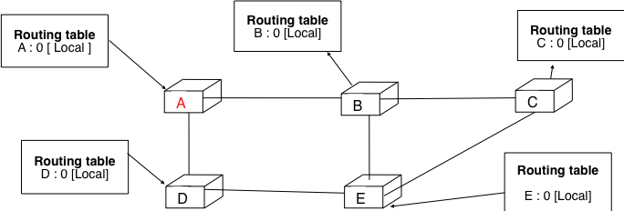

   Operation of distance vector routing in a simple network

Assume that `A` is the first to send its distance vector `[A=0]`.

 - `B` and `D` process the received distance vector and update their routing table with a route towards `A`. 
 - `D` sends its distance vector `[D=0,A=1]` to `A` and `E`. `E` can now reach `A` and `D`.
 - `C` sends its distance vector `[C=0]` to `B` and `E`
 - `E` sends its distance vector `[E=0,D=1,A=2,C=2]` to `D`, `B` and `C`. `B` can now reach `A`, `C`, `D` and `E`
 - `B` sends its distance vector `[B=0,A=1,C=1,D=2,E=1]` to `A`, `C` and `E`. `A`, `B`, `C` and `E` can now reach all destinations.
 - `A` sends its distance vector `[A=0,B=1,C=2,D=1,E=2]` to `B` and `D`. 

At this point, all routers can reach all other routers in the network thanks to the routing tables shown in the figure below.

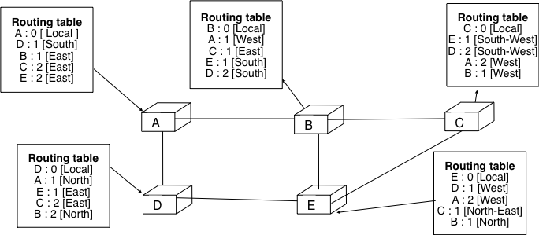

   Routing tables computed by distance vector in a simple network

To deal with link and router failures, routers use the timestamp that is stored in their routing table. As all routers send their distance vector every `N` seconds, the timestamp of each route should be regularly refreshed. Thus no route should have a timestamp older than `N` seconds unless the route is not reachable anymore. In practice, to cope with the possible loss of a distance vector due to transmission errors, routers check every `N` seconds the timestamp of the routes stored in their routing table and remove the routes that are older than :math:`3 \times N` seconds. When a router notices that a route towards a destination has expired, it must first associate an :math:`\infty` cost to this route and send its distance vector to its neighbours to inform them. The route can then be removed from the routing table after some time (e.g. :math:`3 \times N` seconds) to ensure that the neighbour routers have received the bad news even if some distance vectors do not reach them due to transmission errors. 

Consider the example above and assume that the link between routers `A` and `B` fails. Before the failure, `A` used `B` to reach destinations `B`, `C` and `E` while `B` only used the `A-B` link to reach `A`. The affected entries timeout on routers `A` and `B` and they both send their distance vector.

 - `A` sends its distance vector :math:`[A=0,D=\infty,C=\infty,D=1,E=\infty]`. `D` knows that it cannot reach `B` anymore via `A`
 - `D` sends its distance vector :math:`[D=0,B=\infty,A=1,C=2,E=1]` to `A` and `E`. `A` recovers routes towards `C` and `E` via `D`.
 - `B` sends its distance vector :math:`[B=0,A=\infty,C=1,D=2,E=1]` to `E` and `C`. `D` learns that there is no route anymore to reach `A` via `B`.
 - `E` sends its distance vector :math:`[E=0,A=2,C=1,D=1,B=1]` to `D`, `B` and `C`. `D` learns a route towards `B`. `C` and `B` learn a route towards `A`. 
 
At this point, all routers have a routing table that allows them to reach all another routers, except router `A` that cannot yet reach router `B`. `A` recovers the route towards `B` once router `D` sends its updated distance vector :math:`[A=1,B=2,C=2,D=1,E=1]`. This last step is illustrated in figure :ref:`fig-afterfailure` that shows the routing tables on all routers.

.. _fig-afterfailure:

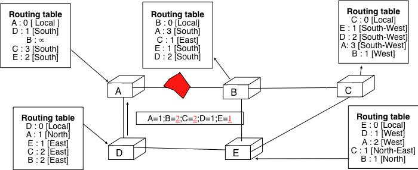

   Routing tables computed by distance vector after a failure

.. index:: count to infinity

Consider now that the link between `D` and `E` fails. The network is now partitionned in two disjoint parts : (`A` , `D`)  and (`B`, `E`, `C`). The routes towards `B`, `C` and `E` expire first on router `D`. At this time, router `D` updates its routing table.

If `D` sends :math:`[D=0, A=1, B=\infty, C=\infty, E=\infty]` `A` learns that `B`, `C` and `E` are unreachable and updates its routing table.

Unfortunately, if the distance vector sent to `A` is lost or if `A` sends its own distance vector ( :math:`[A=0,D=1,B=3,C=3,E=2]` ) at the same time as `D` sends its distance vector, `D` updates its routing table to use the shorter routes advertised by `A` towards `B`, `C` and `E`. After some time `D` sends a new distance vector : :math:`[D=0,A=1,E=3,C=4,B=4]`. `A` updates its routing table and after some time sends its own distance vector :math:`[A=0,D=1,B=5,C=5,E=4]` ... This problem is known as the `count to infinity problem` in the networking literature. Routers `A` and `D` exchange distance vectors with increasing costs until these costs reach :math:`\infty`. This problem may occur in other scenarios than the one depicted in the above figure. In fact, distance vector routing may suffer from count to infinity problems as soon as there is a cycle in the network. Cycles are necessary to have enough redundancy to deal with link and router failures. To mitigate the impact of counting to infinity, some distance vector protocols consider that :math:`16=\infty`. Unfortunately, this limits the metrics that network operators can use and the diameter of the networks using distance vectors.

.. index:: split horizon, split horizon with poison reverse

This count to infinity problem occurs because router `A` advertises to router `D` a route that it has learned via router `D`. A possible solution to avod this problem could be to change how a router creates its distance vector. Instead of computing one distance vector and sending it to all its neighbors, a router could create a distance vector that is specific to each neighbour and only contains the routes that have not been learned via this neighbour. This could be implemented by the following pseudocode ::

 Every N seconds:
  for each link=l
  { /* one different vector for each link */
   Vector=null;
   for each destination=d in R[]
   {
    if (R[d].link<>l) 
      Vector=Vector+Pair(d,R[d].cost); 
   } 
   Send(Vector);
  }

This technique is called `split-horizon`. With this technique, the count to infinity problem would not have happened in the above scenario as router `A` would have advertised :math:`[A=0]` since it learned all its other routes via router `D`. Another variant called `split-horizon with poison reverse` is also possible.  Routers using this variant advertise a cost of :math:`\infty` for the destinations that they reach via the router to which they send the distance vector. This can be implemented by using the pseudocode below ::

 Every N seconds:
  for each link=l
  { /* one different vector for each link */
   Vector=null;
   for each destination=d in R[]
   {
    if (R[d].link<>l) 
      Vector=Vector+Pair(d,R[d].cost); 
    else
      Vector=Vector+Pair(d,infinity);
   } 
   Send(Vector);
  }

Unfortunately, split-horizon, is not sufficient to avoid all count to infinity problems with distance vector routing. Consider the failure of link `A-B` in the four routers network below.

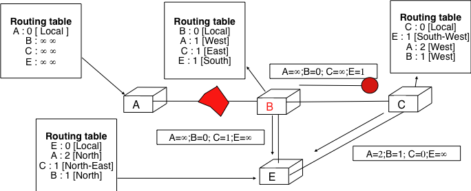

   Count to infinity problem

After having detected the failure, router `A` sends its distance vectors :

 - :math:`[A=\infty,B=0,C=\infty,E=1]` to router `C`
 - :math:`[A=\infty,B=0,C=1,E=\infty]` to router `E`

If unfortunately the distance vector sent to router `C` is lost due to a transmission error or because router `C` is overloaded, a new count to infinity problem can occur. If router `C` sends its distance vector :math:`[A=2,B=1,C=0,E=\infty]` to router `E`, this router installs a route of distance `3` to reach `A` via `C`. Router `E` sends its distance vectors :math:`[A=3,B=\infty,C=1,E=1]` to router `B` and :math:`[A=\infty,B=1,C=\infty,E=0]` to router `C`. This distance vector allows `B` to recover a route of distance `4` to reach `A`...

.. index:: link-state routing

Link state routing
------------------

Link state routing is the second family of routing protocols. While distance vector routers use a distributed algorithm to compute their routing tables, link-state routers exchange messages to allow each router to learn the entire network topology. Based on this learned topology, each router is then able to compute its routing table by using a shortest path computation [Dijkstra1959]_. 

For link-state routing, a network is modelled as a `directed weighted graph`. Each router is a node and the links between routers are the edges in the graph.  A positive weight is associated to each directed edge and routers use the shortest path  to reach each destination. In practice, different types of weights can be associated to each directed edge :

 - unit weight. If all links have a unit weight, shortest path routing prefers the paths with the smallest number of intermediate routers.
 - weight proportionnal to the propagation delay on the link. If all links weights are configured this way, shortest path routing uses the paths with the smallest propagation delay. 
 - :math:`weight=\frac{C}{bandwidth}` where `C` is a constant larger than the highest link bandwidth in the network. If all link weights are configured this way, shortest path routing prefers higher bandwidth paths over lower bandwidth paths
 
Other variants are possible. Some networks use optimisation algorithms to find the best set of weights to minimize congestion inside the network for a given traffic demand [FRT2002]_. Usually, the same weight is associated to the two directed edges that correspond to a physical link. 

However, in some cases, these weights can differ (e.g. because the uplink and downlink bandwidths are different or because one direction is overloaded and fewer destinations should be reached over this directed link).

.. index:: Hello message

When a link-state router boots, it first needs to discover to which routers it is directly connected. For this, each router sends every `N` seconds a HELLO message on all its interfaces. This message contains the router's address. Each router has a unique address. As its neighbouring routers also send HELLO messages, the router automatically discovers to which neighbours it is connected. These HELLO messages are only sent to the direct neighbour. A router never forwards the HELLO messages that they receive. HELLO messages are also used to detect link and router failures. A link is considered to have failed if no HELLO message has been received from the neighboring router during a period of :math:`k \times N` seconds.

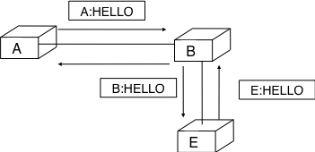

   The exchange of HELLO messages

Once a router has discovered its neighbours, it must reliably distribute its local links to all routers in the network to allow them to compute their local view of the network topology. For this, each router builds a `link-state packet` (LSP) that contains the following information :

 - LSP.Router : identification (address) of the sender of the LSP
 - LSP.age : age or remaining lifetime of the LSP
 - LSP.seq : sequence number of the LSP
 - LSP.Links[] : links advertised in the LSP. Each directed link starting at this is represented with the following information :  
   - LSP.Links[i].Id : identification of the neighbour
   - LSP.Links[i].cost : cost of the link

As the LSPs are used to distribute the network topology that allows routers to compute their routing tables, routers cannot rely on their non-existing routing tables to distribute the LSPs. `Flooding` is used to efficiently distribute the LSPs of all routers.  Each router that implements `flooding` maintains a `link state database` (LSDB) that contains the most recent LSP sent by each router. When a router receives a LSP, it first verifies whether this LSP is already stored inside its LSDB. If so, the router has already distributed the LSP earlier and it does not need to forward it. Otherwise, the router forwards the LSP on all links expect the link over which the LSP was received. Reliable flooding can be implemented by using the pseudo-code below ::

 # links is the set of all links on the router
 # Router R's LSP arrival on link l:
 if newer(LSP, LSDB(LSP.Router)):
   LSDB.add(LSP)
   for i in links :
     if i!=l send(LSP,i)
 else:
  # LSP has already been flooded 

In this pseudocode, `LSDB(r)` returns the most recent `LSP` originated by router `r` that is stored in the `LSDB`. `newer(lsp1,lsp2)` returns true if `lsp1` is more recent than `lsp2`. See the sidebar below for a discussion on how `newer` can be implemented.

.. sidebar:: Which is the most recent LSP ?

 A router that implements flooding must be able to detect whether a received LSP is newer than the received LSP. This requires a comparison between the sequence number of the received LSP and the sequence number of the LSP stored in the link state database. The ARPANET routing protocol [MRR1979]_ used a 6 bits sequence number and implemented the comparison as follows :rfc:`789` ::

  def newer( lsp1, lsp2 ):
    return ( ( ( lsp1.seq > lsp2.seq) and ( (lsp1.seq-lsp2.seq)<=32) ) or
    	     ( ( lsp1.seq < lsp2.seq) and ( (lsp2.seq-lsp1.seq)> 32) )    )

 This comparison takes into account the modulo :math:`2^{6}` arithemtic used to increment the sequence numbers. Intuitively, the comparaison divides the circle of all sequence numbers in two halves. Usually, the sequence number of the received LSP is equal to the sequence number of the stored LSP incremented by one, but sometimes the sequence numbers of two successive LSPs may differ, e.g. if one router has been disconnected from the network for some time. The comparison above worked well until October 27, 1980. On this day, the ARPANET crashed completely. The crash was complex and involved several routers. At one point, LSP `40` and LSP `44` from one of the routers were stored in the LSDB of some routers in the ARPANET. As LSP `44` was the newest it should have replaced LSP `40` on all routers. Unfortunately, one of the ARPANET routers suffered from a memory problem and sequence number `40` (`101000` in binary) was replaced by `8` (`001000` in binary) in the buggy router and flooded. Three LSPs were present in the network and `44` was newer than `40` that is newer than `8`, but unfortunately `8` was considered as newer than `44`... All routers started to exchange these three link state packets for ever and the only solution to recover from this problem was to shutdown the entire network :rfc:`789`.

 Current link state routing protocols usually use 32 bits sequence number and include a special mechanism in the unlikely case that a sequence number reaches the maximum value (using a 32 bits sequence number space takes 136 years if a link state packet is generated every second).

 To deal with the memory corruption problem, link state packets contain a checksum. This checksum is computed by the router that generates the LSP. Each router must verify the checksum when it receives or floods a LSP. Furthermore, each router must periodically verify the checksums of the LSPs stored in its LSDB.

Flooding is illustrated in the figure below. By exchanging HELLO messages, each router learns its direct neighbours. For example, router `E` learns that it is directly connected to routers `D`, `B` and `C`. Its first LSP has sequence number `0` and contains the directed links `E->D`, `E->B` and `E->C`. Router `E` sends its LSP on all its links and routers `D`, `B` and `C` insert the LSP in their LSDB and forward it over their other links. 

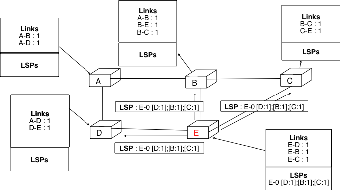

   Flooding : example 

Flooding allows LSPs to be distributed to all routers inside the network without relying on routing tables. In the example above, the LSP sent by router `E` is likely sent twice on some links in the network. For example, routers `B` and `C` receive `E`'s LSP at almost the same time and forward it over the `B-C` link. To avoid sending the same LSP twice on each link, a possible solution is to slightly change the pseudo-code above so that a router waits for some random time before forwarding a LSP on each link. The drawback of this solution is that the delay to flood a LSP to all routers in the network increases. In practice, routers flood immediately the LSPs that contain new information (e.g. addition or removal of a link) and delay the flooding of refresh LSPs (i.e. LSPs that contain exactly the same information as the previous LSP originated by this router) [FFEB2005]_.

To ensure that all routers receive all LSPs even when there are transmissions errors, link state routing protocols use `reliable flooding`. With `reliable flooding`, routers use acknowledgements and if necessary retransmissions to ensure that all link state packets are successfully transferred to all neighboring routers.  Thanks to reliable flooding, all routers store in their LSDB the most recent LSP sent by each router in the network. By combining the received LSPs with its own LSP, each router can compute the entire network topology.

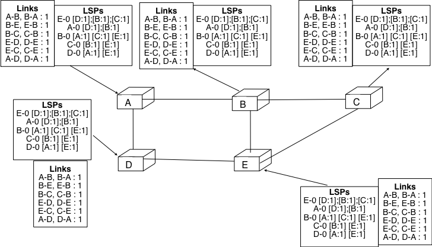

   Link state databases received by all routers 

.. sidebar:: Static or dynamic link metrics ?

 As link state packets are flooded regularly, routers could measure the quality (e.g. delay or load) and their links and adjust the metric of each link according to its current quality. Such dynamic adjustements were included in the ARPANET routing protocol [MRR1979]_ . However, experience showed that it was difficult to tune the dynamic adjustements and ensure that no forwarding loops happen in the network [KZ1989]_. Today's link state routing protocols use metrics that are manually configured on the routers and are only changed by the network operators or network management tools [FRT2002]_.

.. index:: two-way connectivity

When a link fails, the two routers attached to the link detect the failure by the lack of HELLO messages during the last :math:`k \times N` seconds. Once a router has detected a local link failure, it generates and floods a new LSP that does not contain anymore the failed link. The new LSP replaces the previous LSP in the network. As the two routers attached to a link do not detect this failure exactly at the same time, some links may be announced in only one direction. This is illustrated in the figure below. Router `E` has detected the failures of link `E-B` and flooded a new LSP, but router `B` has not yet detected the failure.

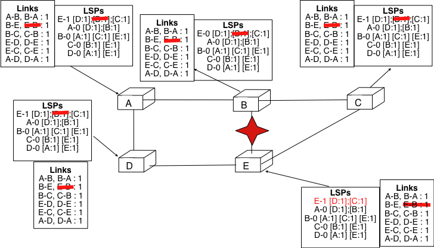

   The two-way connectivity check

When a link is reported in the LSP of only one of the attached routers, routers consider the link as having failed and they remove it from the directed graph that they compute from their LSDB. This is called the `two-way connectivity check`. This check allows link failures to be flooded quickly as a single LSP is sufficient to announce such a bad news. However, when a link comes up, it can only be used once the two attached routers have sent their LSPs. The `two-way connectivity check` also allows to deal with router failures. When a router fails, all its links fail by defintion. Unfortunately, it does not, of course, send a new LSP to announce its failure. The `two-way connectivity check` ensures that the failed router is removed from the graph.

When a router has failed, its LSP must be removed from the LSDB of all routers [#foverload]_. This can be done by using the `age` field that is included in each LSP. The `age` field is used to bound the maximum lifetime of a link state packet in the network. When a router generates a LSP, it sets its lifetime (usually measured in seconds) in the `age` field. All routers regularly decrement the `age` of the LSPs in their LSDB and a LSP is discarded once its `age` reaches `0`. Thanks to the `age` field, the LSP from a failed router does not remain in the LSDBs forever.

To compute its routing table, each router computes the spanning rooted at itself by using Dijkstra's shortest path algorithm [Dijkstra1959]_. The routing table can be derived automatically from the spanning as shown in the figure below.

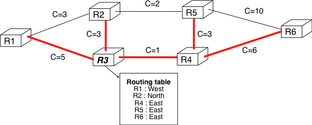

   Computation of the routing table

.. todo explain broadcast address IPv4 ?

Internet Protocol
#################

The Internet Protocol (IP) is the network layer protocol of the TCP/IP protocol suite. IP allows the applications running above the transport layer (UDP/TCP) to use a wide range of heterogeneous datalink layers. IP was designed when most point-to-point links were telephone lines with modems. Since then, IP has been able to use Local Area Networks (Ethernet, Token Ring, FDDI, ...), new wide area data link layer technologies (X.25, ATM, Frame Relay, ...) and more recently wireless networks (802.11, 802.15, UMTS, GPRS, ...). The flexibility  of IP and its ability to use various types of underlying data link layer technologies is one of its key advantages.

.. figure:: png/network-fig-051-c.png
   :align: center
   :scale: 70

   IP and the reference model

.. there is a draft on expectations of lower layer

The current version of IP is version 4 specified in :rfc:`791`. We first describe this version and later explain IP version 6 that is expected to replace IP version 4 in the future.

IP version 4
============

IP version 4 is the data plane protocol of the network layer in the TCP/IP protocol suite. The design of IP version 4 was based on the following assumptions :

 - IP should provide an unreliable connectionless service (TCP provides reliability when required by the application)
 - IP operates with the datagram transmission mode
 - IP addresses have a fixed size of 32 bits 
 - IP must be useable above different types of datalink layers
 - IP hosts exchange variable length packets

The addresses are an important part of any network layer protocol. In the late 1970s, the developers of IPv4 designed IPv4 for a research network that would interconnect some research labs and universities. For this utilisation, 32 bits wide addresses were much larger than the expected number of hosts on the network. Furthermore, 32 bits was a nice address size for software-based routers. None of the developers of IPv4 were expecting that IPv4 would become as widely used as it is today.

IPv4 addresses are encoded as a 32 bits field. IPv4 addresses are often represented in `dotted-decimal` format as a sequence of four integers separated by a `dot`. The first integer is the decimal representation of the most significant byte of the 32 bits IPv4 address, ... For example, 

 * 1.2.3.4 corresponds to 00000001000000100000001100000100
 * 127.0.0.1 corresponds to 01111111000000000000000000000001
 * 255.255.255.255 corresponds to 11111111111111111111111111111111

.. index:: multihomed host

An IPv4 address is used to identify an interface on a router or a host. A router has thus as many IPv4 addresses as the number of interfaces that it has in the datalink layer. Most hosts have a single datalink layer interface and thus have a single IPv4 address. However, with the growth of wireless, more and more hosts have several datalink layer interfaces (e.g. an Ethernet interface and a WiFi interface). These hosts are said to be `multihomed`. A multihomed host with two interfaces has thus two IPv4 addresses.

An important point to be defined in a network layer protocol is the allocation of the network layer addresses. A naive allocation scheme would be to provide an IPv4 address to each host when the host is attached to the Internet on a first come first served basis. With this solution, a host in Belgium could have address 2.3.4.5 while another host located in Africa would use address 2.3.4.6. Unfortunately, this would force all routers to maintain a specific route towards each host. The figure below shows a simple enterprise network with two routers and three hosts and the associated routing tables if such isolated addresses were used.

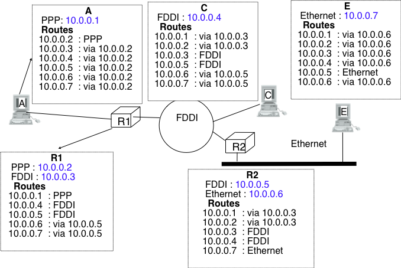
   
   Scalability issues when using isolated IP addresses 

.. index:: IP subnet, IP prefix, subnet mask

To preserve the scalability of the routing system, it is important to minimize the number of routes that are stored on each router. A router cannot store and maintain one route for each of the almost 1 billion hosts that are connected to today's Internet. Routers should only maintain routes towards blocks of addresses and not towards individual hosts. For this, hosts are grouped in `subnets` based on their location in the network. A typical subnet groups all the hosts that are part of the same enterprise. An enterprise network is usually composed of several LANs interconnected by routers. A small block of addresses from the Enterprise's block is usually assigned to each LAN. An IPv4 address is composed of two parts : a `subnetwork identifier` and  a `host identifier`. The `subnetwork identifier` is composed of the high order bits of the address and the host identifier is encoded in the low order bits of the address. This is illustrated in the figure below.

.. figure:: png/network-fig-054-c.png
   :align: center
   :scale: 70
   
   The subnetwork and host identifiers inside an IPv4 address

.. index:: Class A IPv4 address, Class B IPv4 address, Class C IPv4 address

When a router needs to forward a packet, it must know the `subnet` of the destination address to be able to consult its forwarding table to forward the packet. :rfc:`791` proposed to use the high-order bits of the address to encode the length of the subnet identifier. This lead to the definition of three `classes` of unicast addresses [#fclasses]_

=======  ==========  =========  =============	=============
Class    High-order  Length of  Number of	Addresses per
         bits        subnet id	networks   	network
=======  ==========  =========  =============	=============
Class A	 `0`	     8 bits	128 		16,777,216 (:math:`2^{24}`)	
Class B	 `10`        16 bits	16,384     	65,536 (:math:`2^{16}`)	
Class C	 `110`	     24 bits	2,097,152  	256 (:math:`2^8`)
=======  ==========  =========  =============	=============

However, these three classes of addresses were not flexible enough. A class `A` subnet was too large for most organisations and a class `C` subnet was too small. Flexibility was added by the introduction of `variable-length subnets` in :rfc:`1519`. With `variable-length` subnets, the subnet identifier can have any size from `1` to `31` bits. `Variable-length` subnets allow the network operators to use a subnet that better matches the number of hosts that are placed inside the subnet. A subnet identifier or IPv4 prefix is usually [#fnetmask]_ represented as `A.B.C.D/p` where `A.B.C.D` is the network address obtained by concatenating the subnet identifier with a host identifier containing only `0` and `p` is the length of the subnet identifier in bits. The table below provides examples of IP subnets.

============== 	==========  ============  ===============
Subnet      	Number of   Smallest      Highest
	    	addresses   address	  address
============== 	==========  ============  ===============
10.0.0.0/8  	16,777,216  10.0.0.0      10.255.255.255	
192.168.0.0/16	65,536	    192.168.0.0   192.168.255.255
198.18.0.0/15	131,072	    198.18.0.0 	  198.19.255.255
192.0.2.0/24	256	    192.0.2.0 	  192.0.2.255
10.0.0.0/30	4	    10.0.0.0	  10.0.0.3
10.0.0.0/31	2	    10.0.0.0	  10.0.0.1
============== 	==========  ============  ===============

The figure below provides a simple example of the utilisation of IPv4 subnets in an enterprise network. The length of the subnet identifier assigned to a LAN usually depends on the expected number of hosts attached to the LAN. For point-to-point links, many deployments have used `/30` prefixes, but recent routers are now using `/31` subnets on point-to-point links :rfc:`3021` or even do not use IPv4 addresses on such links [#funumbered]_. 
 

   
   IP subnets in a simple enterprise network

A second issue concerning the addresses of the network layer is the allocation scheme that is used to allocated blocks of addresses to organisations. The first allocation scheme was based on the different classes of addresses. The pool of IPv4 addresses was managed by a secretariat that allocated address blocks on a first-come first served basis. Large organisations such as IBM, BBN, but also Stanford or the MIT were able to obtain a class `A` address block. Most organisations requested a class `B` address block that contains 65536 addresses, which was suitable for most enterprises and universities. The table below provides examples of some IPv4 address blocks in the class `B` space. 

==============            ===========================================
Subnet	       		  Organisation
--------------            -------------------------------------------
130.100.0.0/16 		  Ericsson, Sweden
130.101.0.0/16		  University of Akron, USA
130.102.0.0/16		  The University of Queensland, Australia
130.103.0.0/16		  Lotus Development, USA
130.104.0.0/16 		  Université catholique de Louvain, Belgium
130.104.0.0/16		  Open Software Foundation, USA
==============            ===========================================

However, the Internet was a victim of its own success and in the late 1980s, many organisations were requesting blocks of IPv4 addresses and connected to the Internet. Most of these organisations requested class `B` address blocks because class `A` address were too large and in limited supply while class `C` address blocks were considered to be too small. Unfortunately, there were only 16,384 different class `B` address blocks and this address space was being consumed quickly. As a consequence, the routing tables maintained by the routers were growing quickly and some routers had difficulties in maintaining all these routes in their limited memory [#fciscoags]_.

.. figure:: png/network-fig-162-c.png
   :align: center
   :scale: 70
   
   Evolution of the size of the routing tables on the Internet (Jul 1988- Dec 1992 - source : :rfc:`1518`)

.. index:: Classless Interdomain Routing

Faced with these two problems, the Internet Engineering Task Force decided to develop the Classless Interdomain Routing (CIDR) architecture :rfc:`1518`. This architecture aims at allowing IP routing to scale better than the class-based architecture. CIDR contains three important modifications compared to :rfc:`791`.

      1. IP address classes are deprecated. All IP equipments must use and support variable-length subnets.
      2. IP address blocks are not allocated anymore on a first-come-first-served basis. Instead, CIDR introduces a hierarchical address allocation scheme.
      3. IP routers must use longest-prefix match when they lookup a destination address in their forwarding table

The last two modifications were introduced to improve the scalability of the IP routing system. The main drawback of the first-come-first-served address block allocation scheme was that neighboring address blocks were allocated to very different organisations and conversely, very different address blocks were allocated to similar organisations. With CIDR, address blocks are allocated by Regional IP Registries (RIR) in an aggregatable manner. A RIR is responsible for a large block of addresses and a region. For example, RIPE_ is the RIR that is responsible for Europe. A RIR allocates smaller address blocks from its large block to Internet Service Providers :rfc:`2050`. Internet Service Providers then allocate smaller address blocks to their customers, ... When an organisation requests an address block, it must prove that it already has or expects to have in the near future, a number of hosts or customers that is equivalent to the size of the requested address block. 

The main advantage of this hierarchical address block allocation scheme is that it allows the routers to maintain fewer routes. For example, consider the address blocks that were allocated to some of the Belgian universities as shown in the table below.

==============            =============================================
Address block   	  Organisation
==============            =============================================
130.104.0.0/16 		  Université catholique de Louvain
134.58.0.0/16		  Katholiek Universiteit Leuven
138.48.0.0/16		  Facultés universitaires Notre-Dame de la Paix
139.165.0.0/16		  Université de Liège
164.15.0.0/16		  Université Libre de Bruxelles
==============            =============================================

These universities are all connected to the Internet exclusively via  `Belnet <http://www.belnet.be>`_. As each university has been allocated a different address block, the routers of the `Belnet <http://www.belnet.be>`_ must announce one route for each university and all routers on the Internet must maintain a route towards each university. In contrast, consider all the high schools and the government institutions that are connected to the Internet via `Belnet <http://www.belnet.be>`_. An address block was assigned to these institutions after the introduction of CIDR in the `193.190.0.0/15` address block owned by `Belnet <http://www.belnet.be>`_. With CIDR, `Belnet <http://www.belnet.be>`_ can announce a single route towards `193.190.0.0/15` that covers all these high schools. 

 
.. index:: multihomed network

However, there is one difficulty with the aggregatable variable length subnets used by CIDR. Consider for example `FEDICT <http://www.fedict.be>`_, a governmental institution that uses the `193.191.244.0/23` address block. Assume that in addition to being connected to the Internet via `Belnet <http://www.belnet.be>`_ , `FEDICT <http://www.fedict.be>`_ also wants to be connected to another Internet Service Provider. The FEDICT network is then said to be multihomed. This is shown in the figure below.

.. figure:: png/network-fig-163-c.png
   :align: center
   :scale: 70
   
   Multihoming and CIDR

With such a multihomed network, routers `R1` and `R2` would have two routes towards IPv4 address `193.191.245.88` : one route via Belnet (`193.190.0.0/15`) and one direct route  (`193.191.244.0/23`). Both routes match IPv4 address `193.192.145.88`. Since :rfc:`1519` when a router knows several routes towards the same destination address, it must forward packets along the route having the longest prefix length. In the case of `193.191.245.88`, this is the route `193.191.244.0/23` that is used to forward the packet. This forwarding rule is called the `longest prefix match` or the `more specific match`. All IPv4 routers implement this forwarding rule.

To understand the `longest prefix match` forwarding, consider the figure below. With this rule, the route `0.0.0.0/0` plays a particular role. As this route has a prefix length of `0` bits, it matches all destination addresses. This route is often called the `default` route. 

 - a packet with destination `192.168.1.1` received by router `R` is destined to the router itself. It is delivered to the appropriate transport protocol.
 - a packet with destination `11.2.3.4` matches two routes : `11.0.0.0/8` and `0.0.0.0/0`. The packet is forwarded on the `West` interface.
 - a packet with destination `130.4.3.4` matches one route : `0.0.0.0/0`. The packet is forwarded on the `North` interface.
 - a packet with destination `4.4.5.6` matches two routes : `4.0.0.0/8` and `0.0.0.0/0`. The packet is forwarded on the `West` interface.
 - a packet with destination `4.10.11.254` matches three routes : `4.0.0.0/8`, `4.10.11.0/24 and `0.0.0.0/0`. The packet is forwarded on the `South` interface.

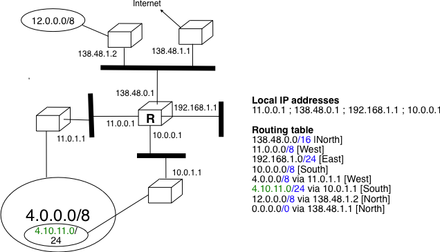
   
   Longest prefix match example 

The longest prefix match can be implemented by using different data structures. One possibility is to use a trie. The figure below shows a trie that encodes six routes having different outgoing interfaces.

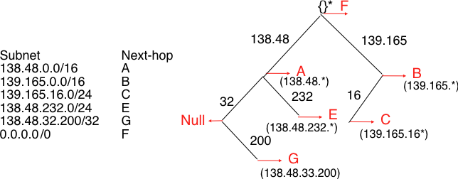
   
   A trie representing a routing table 

.. index :: 0.0.0.0, 127.0.0.1, private IPv4 addresses, link local IPv4 addresses

.. sidebar:: Special IPv4 addresses

 Most unicast IPv4 addresses can appear as source and destination addresses in packets on the global Internet. However, it is worth to note that some  blocks of IPv4 addresses have a special usage as described in :rfc:`3330`. These include :

  - `0.0.0.0/8` that is reserved for self-identification. A common address in this block is `0.0.0.0` that is sometimes used when a host boots and does not yet know its IPv4 address.
  - `127.0.0.0/8` that is reserved for loopback addresses. Each host implementing IPv4 must have a loopback interface (that is not attached to a datalink layer). By convention, IPv4 address `127.0.0.1` is assigned to this interface. This allows processes running on a host to use TCP/IP to contact other processes running on the same host. This can be very useful for testing purposes. 
  - `10.0.0.0/8`, `172.16.0.0/12` and `192.168.0.0/16` are reserved for private networks that are not directly attached to the Internet. These addresses are often called private addresses or :rfc:`1918` addresses. 
  - `169.254.0.0/16` is used for link-local addresses :rfc:`3927`. Some hosts use an address in this block when they are connected to a network that does not allocate addresses as expected. 

IPv4 packets
------------

Now that we have clarified the allocation of IPv4 addresses and the utilisation of the longest prefix match to forward IPv4 packets, we can have a more detailed look at IPv4 by starting with the format of the IPv4 packets. The IPv4 packet format was defined in :rfc:`791`. Besides a few clarifications and some backward compatible changes, the IPv4 packet format did not change significantly since the publication of :rfc:`791`. All IPv4 packets use the 20 bytes header shown below. Some IPv4 packets contain an optional header extension that is described later. 

::

    0                   1                   2                   3
    0 1 2 3 4 5 6 7 8 9 0 1 2 3 4 5 6 7 8 9 0 1 2 3 4 5 6 7 8 9 0 1
   +-+-+-+-+-+-+-+-+-+-+-+-+-+-+-+-+-+-+-+-+-+-+-+-+-+-+-+-+-+-+-+-+
   |Version|  IHL  |    DS Field   |          Total Length         |
   +-+-+-+-+-+-+-+-+-+-+-+-+-+-+-+-+-+-+-+-+-+-+-+-+-+-+-+-+-+-+-+-+
   |         Identification        |Flags|      Fragment Offset    |
   +-+-+-+-+-+-+-+-+-+-+-+-+-+-+-+-+-+-+-+-+-+-+-+-+-+-+-+-+-+-+-+-+
   |  Time to Live |    Protocol   |         Header Checksum       |
   +-+-+-+-+-+-+-+-+-+-+-+-+-+-+-+-+-+-+-+-+-+-+-+-+-+-+-+-+-+-+-+-+
   |                       Source Address                          |
   +-+-+-+-+-+-+-+-+-+-+-+-+-+-+-+-+-+-+-+-+-+-+-+-+-+-+-+-+-+-+-+-+
   |                    Destination Address                        |
   +-+-+-+-+-+-+-+-+-+-+-+-+-+-+-+-+-+-+-+-+-+-+-+-+-+-+-+-+-+-+-+-+
    
   The IP version 4 header

The main fields of the IPv4 header are :

 - a 4 bits `version` that indicates the version of IP used to build the header. Using a version field in the header allows the network layer protocol to evolve. 
 -  a 4 bits `IP Header Length (IHL)` that indicates the length of the IP header in 32 bits words. This field allows IPv4 to use options if required, but as it is encoded as a 4 bits field, the IPv4 header cannot be longer than 64 bytes. 
 - an 8 bits `DS` field that is used for Quality of Service and whose usage is described later.
 - an 8 bits `Protocol` field that indicates the transport layer protocol that must process the packet's payload at the destination. Common values for this field [#fprotocolnumber]_ are `6` for TCP and `17` for UDP
 - a 16 bits `length` field that indicates the total length of the entire IPv4 packet (header and payload) in bytes. This implies that an IPv4 packet cannot be longer than 65535 bytes.
 - a 32 bits `source address` field that contains the IPv4 address of the source host
 - a 32 bits `destination address` field that contains the IPv4 address of the destination host 
 - a 16 bits `checksum` that protects only the IPv4 header against transmission errors

.. index:: Time To Live (IP)

The other fields of the IPv4 header are used for specific purposes. The first is the 8 bits `Time To Live (TTL)` field. This field is used by IPv4 to avoid the risk of having an IPv4 packet caught in an infinite loop due to a transient or permanent error in routing tables [#fttl]_. Consider for example the situation depicted in the figure below where destination `D` uses address `11.0.0.56`. If `S` sends a packet towards this destination, the packet is forwarded to router `B` that forwards it to router `C` that forwards it back to router `A`...

.. figure:: png/network-fig-164-c.png
   :align: center
   :scale: 70
   
   Forwarding loops in an IP network

Unfortunately, such loops can occur for two reasons in IP networks. First, if the network uses static routing, the loop can be caused by a simple configuration error. Second, if the network uses dynamic routing, such a loop can occur transiently, for example during the convergence of the routing protocol after a link or router failure. The `TTL` field of the IPv4 header ensures that even if there are forwarding loops in the network, packets will not loop forever. Hosts send their IPv4 packets with a positive `TTL` (usually `64` or more [#finitialttl]_). When a router receives an IPv4 packet, it first decrements the `TTL` by one. If the `TTL` becomes `0`, the packet is discarded and a message is sent back to the packet's source (see section ICMP_). Otherwise, the router performs a lookup in its forwarding table to forward the packet.

.. index:: Maximum Transmission Unit, MTU

A second problem for IPv4 is the heterogeneity of the datalink layer. IPv4 is used above many very different datalink layers. Each datalink layer has its own characteristics and as indicated earlier, each datalink layer is characterised by a maximum frame size. From IP's viewpoint, a datalink layer interface is characterised by its `Maximum Transmission Unit (MTU)`. The MTU of an interface is the largest IPv4 packet (including header) that it can send. The table below provides some common MTU sizes [#f6lowpan]_. 

==============      ==================
Datalink layer      MTU
--------------      ------------------
Ethernet	    1500 bytes
WiFi		    2272 bytes
ATM (AAL5)	    9180 bytes
802.15.4	    102 or 81 bytes
Token Ring	    4464 bytes
FDDI  		    4352 bytes
==============      ==================

Although IPv4 can send 64 KBytes long packets, few datalink layer technologies that are used today are able to send a 64 KBytes IPv4 packet inside a frame. Furthermore, as illustrated in the figure below, another problem is that a host may send a packet that would be too large for one of the datalink layers used by the intermediate routers. 

.. figure:: png/network-fig-063-c.png
   :align: center
   :scale: 70
   
   The need for fragmentation and reassembly

.. Index:: IPv4 fragmentation and reassembly

To solve these problems, IPv4 includes a packet fragmentation and reassembly mechanism. Both hosts and intermediate routers may fragment an IPv4 packet if the packet is too long to be sent via the datalink layer. In IPv4, fragmentation is completely performed in the IP layer and a large IPv4 is fragmented into two or more IPv4 packets (called fragments). The IPv4 fragments of a large packet are normal IPv4 packets that are forwarded towards the destination of the large packet by intermediate routers. 

The IPv4 fragmentation mechanism relies on four fields of the IPv4 header : `Length`, `Identification`, the `flags` and the `Fragment Offset`. The IPv4 header contains two flags : `More` and `Don't Fragment (DF)`. When the `DF` flag is set, this indicates that the packet cannot be fragmented.

.. index:: Maximum Transmission Unit (MTU)

The basic operation of the IPv4 fragmentation is as follows. A large packet is fragmented into two or more fragments. The size of all fragments, except the last one, is equal to the Maximum Transmission Unit of the link used to forward the packet. Each IPv4 packet contains a 16 bits `Identification` field. When a packet is fragmented, the `Identification` of the large packet is copied in all fragments to allow the destination to reassemble the received fragments together. In each fragment, the `Fragment Offset` indicates, in units of 8 bytes, the position of the payload of the fragment in the payload of the original packet. The `Length` field in each fragment indicates the length of the payload of the fragment as in a normal IPv4 packet. Finally, the `More` flag is set only in the last fragment of a large packet.

.. 
  sidebar:: IPv4 in scapy
  In the pseudo-code used in this section, we use the scapy_ notations for the fields of the IPv4 header. `ihl` is the `IP Header Length`, `tos` is the `DS` byte, `len` is the packet length, `id` the packet identifier, `flags` contains the `DF` and `More` flags, `proto` is the `Protocol` field, `chksum` contains the Internet checksum and `src` (resp. `dst`) the source (resp. destination) IPv4 address. 

The following pseudo-code details the IPv4 fragmentation, assuming that the packet does not contain options ::

 #mtu : maximum size of the packet (including header) of outgoing link
 if p.len <  mtu : 
    send(p)
 # packet is too large
 maxpayload=8*int((mtu-20)/8)  # must be n times 8 bytes
 if p.flags=='DF' :
    discard(p)
 # packet must be fragmented
 payload=p[IP].payload
 pos=0
 while len(payload) > 0 :
    if len(payload) > maxpayload :
       toSend=IP(dest=p.dest,src=p.src,
	         ttl=p.ttl, id=p.id, 
	         frag=p.frag+(pos/8),
		 len=mtu, proto=p.proto)/payload[0:maxpayload]
       pos=pos+maxpayload
       payload=payload[maxpayload+1:]	   
    else
       toSend=IP(dest=p.dest,src=p.src,
	         ttl=p.ttl, id=p.id, 
	         frag=p.frag+(pos/8),
		 flags=p.flags,
		 len=len(payload), proto=p.proto)/payload
    forward(toSend)   

The fragments of an IPv4 packet may arrive at the destination in any order as each fragment is forwarded independently in the network and may follow different paths. Furthermore, some fragments may be lost and never reach the destination.

The reassembly algorithm used by the destination host is roughly as follows. First, the destination can verify whether a received IPv4 packet is a fragment or not by checking the value of the `More` flag and the `Fragment Offset`. If the `Fragment Offset` is set to `0` and the `More` flag is reset, the received packet has not been fragmented. Otherwise, the packet has been fragmented and must be reassembled. The reassembly algorithm relies on the `Identification` field of the received fragments to associate a fragment with the corresponding packet being reassembled. Furthermore, the `Fragment Offset` field indicates the position of the fragment payload in the original unfragmented packet. Finally, the packet with the `More` flag reset allows the destination to determine the total length of the original unfragmented packet.

Note that the reassembly algorithm must deal with the unreliability of the IP network. This implies that a fragment may be duplicated or a fragment may never reach the destination. The destination can easily detect fragment duplication thanks to the `Fragment Offset`. To deal with fragment losses, the reassembly algorithm must bound the time during which the fragments of a packet are stored in its buffer while the packet is being reassembled. This can be implemented by starting a timer when the first fragment of a packet is received. If the packet has not been reassembled upon expiration of the timer, all fragments are discarded and the packet is considered to be lost. 

.. index:: IP options

The original IP specification defined in :rfc:`791` several types of options that can be added to the IP header. Each option is encoded by using a `type length value` format. They are not widely used today and are thus only briefly described. Additional details may be found in :rfc:`791`.

The most interesting options in IPv4 are the three options that are related to routing. The `Record route` option was defined to allow network managers to determine the path followed by a packet. When the `Record route` option was present, routers on the packet's path had to insert their IP address in the option. This option was implemented, but as the optional part of the IPv4 header can only contain 44 bytes, it is impossible to discover an entire path on the global Internet. :manpage:`traceroute(8)`, despite its limitations, is a better solution to record the path towards a destination.

The other routing options are the `Strict source route` and the `Loose source route` option. The main idea behind these options is that a host may want, for any reason, to specify the path to be followed by the packets that it sends. The `Strict source route` option allows a host to indicate inside each packet the exact path to be followed. The `Strict source route` option contains a list of IPv4 address and a pointer to indicate the next address in the list. When a router receives a packet containing this option, it does not lookup the destination address in its routing table but forwards the packet directly to the next router in the list and advances the pointer. This is illustrated in the figure below where `S` forces its packets to follow the `RA-RB-RD` path.

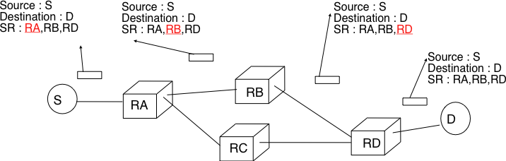
   
   Usage of the `Strict source route` option 

The maximum length of the optional part of the IPv4 header is a severe limitation for the `Strict source route` option as for the `Record Route` option. The `Loose source route` option does not suffer from this limitation. This option allows the sending host to indicate inside its packet `some` of the routers that must be traversed to reach the destination. This is shown in the figure below. `S` sends a packet containing a list of addresses and a pointer to the next router in the list. Initially, this pointer points to `RB`. When `RA` receives the packet sent by `S`, it looks up in its forwarding table the address pointed in the `Loose source route` option and not the destination address. The packet is then forwarded to router `RB` that recognises its address in the option and advances the pointer. As there is no address listed in the `Loose source route` option anymore, `RB` and other downstream routers forward the packet by performing a lookup for the destination address.

.. figure:: png/network-fig-066-c.png
   :align: center
   :scale: 70
   
   Usage of the `Loose source route` option 

These two options are usually ignored by routers because they cause security problems.

.. index:: Internet Control Message Protocol, ICMP
.. _ICMP:

ICMP version 4
==============

It is sometimes necessary for intermediate routers or the destination host to inform the sender of the packet of a problem that occurred while processing a packet. In the TCP/IP protocol suite, this reporting is done by the Internet Control Message Protocol (ICMP). ICMP is defined in :rfc:`792`. ICMP messages are carried as the payload of IP packets (the protocol value reserved for ICMP is `1`). An ICMP message is composed of an 8 byte header and a variable length payload that usually contains the first bytes of the packet that triggered the transmission of the ICMP message.

::

    0                   1                   2                   3
    0 1 2 3 4 5 6 7 8 9 0 1 2 3 4 5 6 7 8 9 0 1 2 3 4 5 6 7 8 9 0 1
   +-+-+-+-+-+-+-+-+-+-+-+-+-+-+-+-+-+-+-+-+-+-+-+-+-+-+-+-+-+-+-+-+
   |Version|  IHL  |    DS Field   |          Total Length         |
   +-+-+-+-+-+-+-+-+-+-+-+-+-+-+-+-+-+-+-+-+-+-+-+-+-+-+-+-+-+-+-+-+
   |         Identification        |Flags|      Fragment Offset    |
   +-+-+-+-+-+-+-+-+-+-+-+-+-+-+-+-+-+-+-+-+-+-+-+-+-+-+-+-+-+-+-+-+
   |  Time to Live |    Protocol   |         Header Checksum       |
   +-+-+-+-+-+-+-+-+-+-+-+-+-+-+-+-+-+-+-+-+-+-+-+-+-+-+-+-+-+-+-+-+
   |                       Source Address                          |
   +-+-+-+-+-+-+-+-+-+-+-+-+-+-+-+-+-+-+-+-+-+-+-+-+-+-+-+-+-+-+-+-+
   |                    Destination Address                        |
   +-+-+-+-+-+-+-+-+-+-+-+-+-+-+-+-+-+-+-+-+-+-+-+-+-+-+-+-+-+-+-+-+
   |     Type      |     Code      |          Checksum             |
   +-+-+-+-+-+-+-+-+-+-+-+-+-+-+-+-+-+-+-+-+-+-+-+-+-+-+-+-+-+-+-+-+
   |                             Data	                           |
   ~				 				   ~
   +-+-+-+-+-+-+-+-+-+-+-+-+-+-+-+-+-+-+-+-+-+-+-+-+-+-+-+-+-+-+-+-+
   |      IPv4 header of errored packet + 64 bits of payload       |
   +-+-+-+-+-+-+-+-+-+-+-+-+-+-+-+-+-+-+-+-+-+-+-+-+-+-+-+-+-+-+-+-+
   
   ICMP version 4 (:rfc:`792`)

In the ICMP header, the `Type` and `Code` fields indicate the type of problem that was detected by the sender of the ICMP message. The `Checksum` protects the entire ICMP message against transmission errors and the `Data` field contains additional information for some ICMP messages.

The main types of ICMP messages are :

 - `Destination unreachable` : a `Destination unreachable` ICMP message is sent when a packet cannot be delivered to its destination due to routing problems. Different types of unreachability are distinguished :

   - `Network unreachable` : this ICMP message is sent by a router that does not have a route for the subnet containing the destination address of the packet 
   - `Host unreachable` : this ICMP message is sent by a router that is attached to the subnet that contains the destination address of the packet, but this destination address cannot be reached at this time
   - `Protocol unreachable` : this ICMP message is sent by a destination host that has received a packet, but does not support the transport protocol indicated in the packet's `Protocol` field
   - `Port unreachable` : this ICMP message is sent by a destination host that has received a packet destined to a port number, but no server process is bound to this port 

 - `Fragmentation needed` : this ICMP message is sent by a router that receives a packet with the `Don't Fragment` flag set that is larger than the MTU of the outgoing interface 

 - `Redirect` : this ICMP message can be sent when there are two routers on the same LAN. Consider a LAN with one host and two routers : `R1` and `R2`. Assume that `R1` is also connected to subnet `130.104.0.0/16` while `R2` is connected to subnet `138.48.0.0/16`. If a host on the LAN sends a packet towards `130.104.1.1` to `R2`, `R2` needs to forward the packet again on the LAN to reach `R1`. This is not optimal as the packet is sent twice on the same LAN. In this case, `R2` could send an ICMP `Redirect` message to the host to inform it that it should have sent the packet directly to `R1`. This allows the host to send the other packets to `130.104.1.1` directly via `R1`. 

 .. figure:: png/network-fig-165-c.png
   :align: center
   :scale: 70
   
   ICMP redirect

 - `Parameter problem` : this ICMP message is sent when a router or a host receives an IP packet containing an error (e.g. an invalid option)
 - `Source quench` : a router was supposed to send this message when it had to discard packets due to congestion. However, sending ICMP messages in case of congestion was not the best way to reduce the congestion and since the inclusion of a congestion control scheme in TCP, this ICMP message has been deprecated. 

 - `Time Exceeded` : there are two types of `Time Exceeded` ICMP messages

   - `TTL exceeded` : a `TTL exceeded` message is sent by a router when it discards an IPv4 packet because its `TTL` reached `0`.
   - `Reassembly time exceeded` : this ICMP message is sent when a destination has been unable to reassemble all the fragments of a packet before the expiration of its reassembly timer. 

 - `Echo request` and `Echo reply` : these ICMP messages are used by the :manpage:`ping(8)` network debugging software. 

.. sidebar:: Redirection attacks

 ICMP redirect messages are useful when several routers are attached to the same LAN as hosts. However, they should be used with care as they also create an important security risk. One of the most annoying attack in an IP network is called the `man in the middle attack`. Such an attack occurs if an attacker is able to receive, process, possibly modify and forward all the packets exchanged between a source and a destination. As the attacker receives all the packets it can easily collect passwords or credit card numbers or even inject fake information in an established TCP connection. ICMP redirects unfortunately enable an attacker to easily perform such an attack. In the figure above, consider host `H` that is attached to the same LAN as `A` and `R1`. If `H` sends to `A` an ICMP redirect for prefix `138.48.0.0/16`, `A` forwards to `H` all the packets that it wants to send to this prefix. `H` can then forward them to `R2`. To avoid these attacks, host should ignore the ICMP redirect messages that they receive.

.. index:: ping

:manpage:`ping(8)` is often used by network operators to verify that a given IP address is reachable. Each host is supposed [#fpingproblems]_ to reply with an ICMP `Echo reply` message when its receives an  ICMP `Echo request` message. A sample usage of :manpage:`ping(8)` is shown below ::

  ping 130.104.1.1
  PING 130.104.1.1 (130.104.1.1): 56 data bytes
  64 bytes from 130.104.1.1: icmp_seq=0 ttl=243 time=19.961 ms
  64 bytes from 130.104.1.1: icmp_seq=1 ttl=243 time=22.072 ms
  64 bytes from 130.104.1.1: icmp_seq=2 ttl=243 time=23.064 ms
  64 bytes from 130.104.1.1: icmp_seq=3 ttl=243 time=20.026 ms
  64 bytes from 130.104.1.1: icmp_seq=4 ttl=243 time=25.099 ms
  --- 130.104.1.1 ping statistics ---
  5 packets transmitted, 5 packets received, 0% packet loss
  round-trip min/avg/max/stddev = 19.961/22.044/25.099/1.938 ms

.. index:: traceroute

Another very useful debugging tool is :manpage:`traceroute(8)`. The traceroute man page describes this tool as `"print the route packets take to network host"`. traceroute uses the `TTL exceeded` ICMP messages to discover the intermediate routers on the path towards a destination. The principle behind traceroute is very simple. When a router receives an IP packet whose `TTL` is set to `1` it decrements the `TTL` and is forced to return to the sending host a `TTL exceeded` ICMP message containing the header and the first bytes of the discarded IP packet. To discover all routers on a network path, a simple solution is to first send a packet whose `TTL` is set to `1`, then a packet whose `TTL` is set to `2`, ... A sample traceroute output is shown below ::

 traceroute www.ietf.org
 traceroute to www.ietf.org (64.170.98.32), 64 hops max, 40 byte packets
  1  CsHalles3.sri.ucl.ac.be (192.168.251.230)  5.376 ms  1.217 ms  1.137 ms
  2  CtHalles.sri.ucl.ac.be (192.168.251.229)  1.444 ms  1.669 ms  1.301 ms
  3  CtPythagore.sri.ucl.ac.be (130.104.254.230)  1.950 ms  4.688 ms  1.319 ms
  4  fe.m20.access.lln.belnet.net (193.191.11.9)  1.578 ms  1.272 ms  1.259 ms
  5  10ge.cr2.brueve.belnet.net (193.191.16.22)  5.461 ms  4.241 ms  4.162 ms
  6  212.3.237.13 (212.3.237.13)  5.347 ms  4.544 ms  4.285 ms
  7  ae-11-11.car1.Brussels1.Level3.net (4.69.136.249)  5.195 ms  4.304 ms  4.329 ms
  8  ae-6-6.ebr1.London1.Level3.net (4.69.136.246)  8.892 ms  8.980 ms  8.830 ms
  9  ae-100-100.ebr2.London1.Level3.net (4.69.141.166)  8.925 ms  8.950 ms  9.006 ms
  10  ae-41-41.ebr1.NewYork1.Level3.net (4.69.137.66)  79.590 ms 
      ae-43-43.ebr1.NewYork1.Level3.net (4.69.137.74)  78.140 ms 
      ae-42-42.ebr1.NewYork1.Level3.net (4.69.137.70)  77.663 ms
  11  ae-2-2.ebr1.Newark1.Level3.net (4.69.132.98)  78.290 ms  83.765 ms  90.006 ms
  12  ae-14-51.car4.Newark1.Level3.net (4.68.99.8)  78.309 ms  78.257 ms  79.709 ms
  13  ex1-tg2-0.eqnwnj.sbcglobal.net (151.164.89.249)  78.460 ms  78.452 ms  78.292 ms
  14  151.164.95.190 (151.164.95.190)  157.198 ms  160.767 ms  159.898 ms
  15  ded-p10-0.pltn13.sbcglobal.net (151.164.191.243)  161.872 ms  156.996 ms  159.425 ms
  16  AMS-1152322.cust-rtr.swbell.net (75.61.192.10)  158.735 ms  158.485 ms  158.588 ms
  17  mail.ietf.org (64.170.98.32)  158.427 ms  158.502 ms  158.567 ms

The above :manpage:`traceroute(8)` output shows a 17 hops path between a host at UCLouvain and one of the main IETF servers. For each hop, traceroute provides the IPv4 address of the router that sent the ICMP message and the measured round-trip-time between the source and this router. traceroute sends three probes with each `TTL` value. In some cases, such as at the 10th hop above, the ICMP messages may be received from different addresses. This is usually because different packets from the same source have followed different paths [#ftraceroutemore]_ in the network. 

.. index:: Path MTU discovery

Another important utilisation of ICMP messages is to discover the maximum MTU that can be used to reach a destination without fragmentation. As explained earlier, when an IPv4 router receives a packet that is larger than the MTU of the outgoing link, it must fragment the packet. Unfortunately, fragmentation is a complex operation and routers cannot perform it at line rate [KM1995]_. Furthermore, when a TCP segment is transported in an IP packet that is fragmented in the network, the loss of a single fragment forces TCP to retransmit the entire segment (and thus all the fragments). If TCP was able to send only packets that do not require fragmentation in the network, it could retransmit only the information that was lost in the network. In addition, IP reassembly causes several challenges at high speed as discussed in :rfc:`4963`. Using IP fragmentation to allow UDP applications to exchange large messages raises several security issues [KPS2003]_.

ICMP, combined with the `Don't fragment (DF)` IPv4 flag, is used by TCP implementations to discover the largest MTU size to be used to reach a destination host without causing network fragmentation. This is the `Path MTU discovery` mechanism defined in :rfc:`1191`. A TCP implementation that includes `Path MTU discovery` (most do) requests the IPv4 layer to send all segments inside IPv4 packets having the `DF` flag set. This prohibits intermediate routers from fragmenting these packets. If a router needs to forward an unfragmentable packet over a link with a smaller MTU, it returns a `Fragmentation needed` ICMP message to the source indicating the MTU of its outgoing link. This ICMP message contains in its `Data` field the MTU of the router's outgoing link. Upon reception of this ICMP message, the source TCP implementation adjusts its Maximum Segment Size (MSS) so that the packets containing the segments that it sends can be forwarded by this router without requiring fragmentation. 

Interactions between IPv4 and the datalink layer
------------------------------------------------

.. _IPEthernet:

As mentionned in the first section of this chapter, there are three main types of datalink layers : `point-to-point` links, LANs supporting broadcast and multicast and NBMA networks. There are different issues to be addressed when using IPv4 in these types of networks. The first issue is how an IPv4 device determines its IPv4 address. The second issue is how IPv4 packets are exchanged over the datalink layer service. 

On a `point-to-point` link, the IPv4 addresses of the communicating devices can be configured manually or through a protocol. IPv4 addresses are often configured manually on `point-to-point` links between routers. When `point-to-point` links are used to attach hosts to the network, automatic configuration is often preferred to avoid problems with incorrect IPv4 addresses. For example, the :abbr:`PPPP (Point-to-Point Protocol)`, specified in :rfc:`1661` includes an IP network control protocol that can be used by the router in the figure below to advertise the IPv4 address that the attached hosts must configure for its interface. The transmission of IPv4 packets on a point-to-point link is usually easy. Depending on the particular datalink layer considered, this may require some fragmentation and reassembly mechanisms in the datalink layer. Furthermore, IPv4 should be informed of the link's MTU. We will discuss these issues in the next chapter.

.. figure:: ../lan/png/lan-fig-044-c.png
   :align: center
   :scale: 70
   
   IPv4 on point-to-point links

Using IPv4 in a LAN introduces an additonal problem. On a LAN, each device is identified by its unique datalink layer address. The datalink layer service can be used by any host attached to the LAN to send a frame to any other host attached to the same LAN provided that the sending host knows the datalink layer of the destination host. For example, the figure below shows four hosts attached to the same LAN configured with IPv4 addresses in the `10.0.1.0/24` subnet and datalink layer addresses represented as a single character [#fdladdress]_. In this network, if host `10.0.1.22/24` wants to send an IPv4 packet to the host having address `10.0.1.8`, it must know that the datalink layer address of this host is `C`.

.. figure:: ../lan/png/lan-fig-045-c.png
   :align: center
   :scale: 70
   
   A simple LAN

.. index:: Address Resolution Protocol, ARP

In a simple network such as the one shown above, it could be possible to manually configure the mapping between the IPv4 addresses of the hosts and the corresponding datalink layer addresses. However, in a larger LAN this is impossible and it should be possible for an IPv4 host to automatically obtain the datalink layer address that corresponds to any IPv4 address on the same LAN. This is the objective of the `Address Resolution Protocol` (`ARP`) defined in :rfc:`826`. ARP is a datalink layer protocol that is used by IPv4. It relies on the ability of the datalink layer service to easily deliver a broadcast frame to all devices attached to the same LAN. 

.. index:: ARP cache

The easiest way to unerstand the operation of ARP is to consider the simple network shown above and assume that host `10.0.1.22/24` needs to send an IPv4 packet to host `10.0.1.8`. As this IP address belongs to the same subnet, the packet must be sent directly to its destination via the datalink layer service. To use this service, the sending host must find the datalink layer address that is attached to host `10.0.1.8`. Each IPv4 host maintains an `ARP cache` that contains the list of all the mappings between IPv4 addresses and datalink layer addresses that it knows. When an IPv4 hosts boots, its ARP cache is empty. `10.0.1.22` thus consults first its ARP cache. As the cache does not contain the requested mapping, host `10.0.1.22` sends a broadcast ARP query frame on the LAN. The frame contains the datalink layer address of the sending host (`A`) and the requested IPv4 address (`10.0.1.8`). This broadcast frame is received by all devices on the LAN and only the host that owns the requested IPv4 address replies by returning a unicast ARP reply frame with the requested mapping. Upon reception of this reply, the sending host updates its ARP cache and sends the IPv4 packet by using the datalink layer service. To deal with devices that move or whose addresses are reconfigured, some ARP implementations remove the cache entries that have not been used for a few minutes. Other implementations revalidate ARP cache entries from time to time by sending ARP queries [#farplinux]_.

.. index:: man-in-the-middle attack

.. sidebar:: Security issues with the Address Resolution Protocol

 :term:`ARP` is an old and widely used protocol that was unfortunately designed when security issues were not a concern. :term:`ARP` is almost insecure by design. Hosts using :term:`ARP` can suffer from several types of attacks. First, a malicious host could create a denial of service attack on a LAN by sending random replies to the received ARP queries. This would pollute the ARP cache of the other hosts on the same LAN. On a fixed network, such attacks are usually fixed by the system administrator who physically removes the malicious hosts from the LAN. On a wireless network, this is much more difficult.
 
 A second type of attack are the `man-in-the-middle` attacks. This name is used for network attacks where the attacker is able to read and possibly modify all the messages sent by the attacked users. Such an attack is possible in a LAN. Assume in the figure above that host `10.0.1.9` is malicious and would like to receive and modify all packets sent by host `10.0.1.22` to host `10.0.1.8`. This can be easily achieved is host `10.0.1.9` manages by sending fake ARP replies to convince host `10.0.1.22` (resp. `10.0.1.8`) that his own datalink layer address must be used to reach `10.0.1.8` (resp. `10.0.1.22`). 
 

:term:`ARP` is used by all devices that are connected to LANs and implement IPv4. Both routers and endhosts implement ARP. When a host needs to send an IPv4 packet to a destination outside of its local subnet, it must first send the packet to one of the routers that reside on this subnet. Consider for example the network shown in the figure below. Each host is configured with an IPv4 address in the `10.0.1.0/24` subnet and uses `10.0.1.1` as its default router. To send a packet to `1.2.3.4`, host `10.0.1.8` will first need to know the datalink layer of the default router. It will thus send an ARP request for `10.0.1.1`. Upon reception of the ARP reply, host `10.0.1.8` will be able to send its packet in a frame to its default router. The router will then forward the packet towards its final destination.

.. figure:: ../lan/png/lan-fig-049-c.png
   :align: center
   :scale: 70
   
   A simple LAN with a router

.. index:: DHCP, Dynamic Host Configuration Protocol, 0.0.0.0, 255.255.255.255

In the early days of the Internet, IP addresses were manually configured on both hosts and routers and never changed. However, this manual configuration can be complex [#fifconfig]_ and often causes errors that are sometimes difficult to debug. Recent TCP/IP implementations are able to detect some of these misconfigurations. For example, if two hosts are configured on the same subnet with the same IPv4 address they will be unable to communicate. To detect this problem hosts send an ARP request for their configured address each time their addressed is changed :rfc:`5227`. If they receive an answer to this ARP request, they trigger an alarm or inform the system administrator.  

To ease the attachment of hosts to subnets, most networks now support the Dynamic Host Configuration Protocol (DHCP) :rfc:`2131`. DHCP allows a host to automatically retrieve its assigned IPv4 address. A DHCP server is associated to each subnet [#fdhcpserver]_. Each DHCP server manages a pool of IPv4 addresses assigned to the subnet. When a host is first attached to the subnet, it sends a DHCP request message. This message is placed in a UDP segment (the DHCP server listens on port 67). As the host does not know neither its IPv4 address nor the IPv4 address of the DHCP server, this UDP segment is placed in an IPv4 packet whose source and destination addresses are respectively `0.0.0.0` and `255.255.255.255`. The DHCP request may contain various options such as the name of the host, its datalink layer address, ... The server captures the DHCP request and finds an unassigned address in its address pool. It then sends the assigned IPv4 address in a DHCP reply message that contains the datalink layer address of the host and additional information such as the subnet mask of the IPv4 address, the address of the default router or the address of the DNS resolver. This DHCP reply message is sent in an IPv4 packet whose source and destination addresses are respectively the IPv4 address of the DHCP server and the `255.255.255.255` broadcast address. The DHCP reply also contains the lifetime of the address allocation. The host must renew its address allocation once it expires.

.. search OUI http://standards.ieee.org/regauth/oui/index.shtml

In an NBMA network, the interactions between IPv4 and the datalink layer address are more complex as the ARP protocol cannot be used as in a LAN. Such NBMA networks use special servers that store the mappings between IP addresses and the corresponding datalink layer address. Asynchronous Transfer Mode (ATM) networks for example can use either the ATMARP protocol defined in :rfc:`2225` or the NextHop Resolution Protocol (NHRP) defined in :rfc:`2332`. ATM networks are less frequently used today and we will not describe the detailed operation of these servers.

Operation of IPv4 devices
-------------------------

At this point of the description of IPv4, it is useful to have a detailed look at how an IPv4 implementation sends, receives and forwards IPv4 packets. The simplest case is when a host needs to send a segment in an IPv4 packet. The host performs two operations. First, it must decide on which interface the packet will be sent. Second it must create the corresponding IP packet(s). 

To simplify the discussion in this section, we ignore the utilisation of IPv4 options. This is not a severe limitation as today IPv4 packets rarely contain options. Details about the processing of the IPv4 options may be found in the relevant RFCs such as :rfc:`791`. Furthermore, we also assume that only point-to-point links are used. We defer the explanation of the operation of IPv4 over Local Area Networks until the next chapter.

An IPv4 host having :math:`n` datalink layer interfaces manages :math:`n+1` IPv4 addresses :

 - the `127.0.0.1/32` IPv4 address assigned by convention to its loopback address
 - one `A.B.C.D/p` IPv4 address assigned to each of its :math:`n` datalink layer interfaces

Such a host maintains a routing table that contains one entry for its loopback address and one entry for each subnet identifier assigned to its interfaces. Furthermore, the host usually uses one of its interfaces as the `default` interface when sending packets that are not addressed to a directly connected destination. This is represented by the `default` route : `0.0.0.0/0` that is associated to one interface.

When a transport protocol running on the host requests the transmission of a segment, it usually provides to the IPv4 layer the IPv4 destination address in addition to the segment [#fdfflag]_. The IPv4 implementation first performs a longest prefix match with the destination address in its routing table. The lookup returns the identification of the interface that must be used to send the packet. The host can then create the IPv4 packet that contains the segment. The source IPv4 address of the packet is the IPv4 address of the host on the interface returned by the longest prefix match. The `Protocol` field of the packet is set to the identification of the local transport protocol that created the segment. The `TTL` field of the packet is set to the default `TTL` used by the host. The host must now choose the packet's `Identification`. This `Identification` is important if the packet becomes fragmented in the network as it ensures that the destination is able to reassemble the received fragments. Ideally, a sending host should never send twice a packet with the same `Identification` to the same destination host to ensure that all fragments are correctly reassembled by the destination. Unfortunately, with a 16 bits `Identification` field and an expected MSL of 2 minutes, this implies that the maximum bandwidth to a given destination is limited to roughly 286 Mbps. With a more realistic 1500 bytes MTU, that bandwidth drops to 6.4 Mbps :rfc:`4963` if fragmentation must be possible [#fiddf]_. This is very low and is another reason why hosts are highly encouraged to avoid fragmentation. If despite of this the MTU of the outgoing interface is smaller than the packet's length, the packet is fragmented. Finally, the packet's checksum is computed before transmission.

When a host receives an IPv4 packet destined to itself, there are several operations that it must perform. First, it must check the packet's checksum. If the checksum is incorrect, the packet is discarded. Then, it must check whether the packet has been fragmented. If yes, the packet is passed to the reassembly algorithm described earlier. Otherwise, the packet must be passed to the upper layer. This is done by looking at the `Protocol` field (`6` for TCP, `17` for UDP). If the host does not implement the transport layer protocol corresponding to the received `Protocol` field, it sends a `Protocol unreachable` ICMP message to the sending host. If the received packet contains an ICMP message (`Protocol` field set to `1`), the processing is more complex. An `Echo-request` ICMP message triggers the transmission of an `ICMP Echo-reply` message. The other types of ICMP messages indicate an error that was caused by a previously transmitted packet. These ICMP messages are usually forwarded to the transport protocol that sent the erroneous packet. This can be done by inspecting the contents of the ICMP message that includes the header and the first 64 bits of the erroneous packet. If the IP packet did not contain options, which is the case for most IPv4 packets, the transport protocol can find in the first 32 bits of the transport header the source and destination ports to determine the affected transport flow. This is important for Path MTU discovery for example.

When a router receives an IPv4 packet, it must first check the packet's checksum. If the checksum is invalid, it is discarded. Otherwise, the router must check whether the destination address is one of the IPv4 addresses assigned to the router. If so, the router must behave as a host and process the packet as described above. Although routers mainly forward IPv4 packets, they sometimes need to be accessed as hosts by network operators or network management software. 

If the packet is not addressed to the router, it must be forwarded on an outgoing interface according to the router's routing table. The router first decrements the packet's `TTL`. If the `TTL` reaches `0`, a `TTL Exceeded` ICMP message is sent back to the source. As the packet header has been modified, the checksum must be recomputed. Fortunately, as IPv4 uses an arithmetic checksum, a router can incrementally update the packet's checksum as described in :rfc:`1624`. Then, the router performs a longest prefix match for the packet's destination address in its forwarding table. If no match is found, the router must return a `Destination unreachable` ICMP message to the source. Otherwise, the lookup returns the interface over which the packet must be forwarded. Before forwarding the packet over this interface, the router must first compare the length of the packet with the MTU of the outgoing interface. If the packet is smaller than the MTU, it is forwarded. Otherwise, a `Fragmentation needed` ICMP message is sent if the `DF` flag was sent or the packet is fragmented if the `DF` was not set. 

.. sidebar:: Longest prefix match in IP routers

 Performing the longest prefix match at line rate on routers requires highly tuned data structures and algorithms. Consider for example an implementation of the longest match based on a Radix tree on a router with a 10 Gbps link. On such a link, a router can receive 31,250,000 40 bytes IPv4 packets every second. To forward the packets at line rate, the router must process one IPv4 packet every 32 nanoseconds. This cannot be achieved by a software implementation. For a hardware implementation, the main difficulty lies in the number of memory accesses that are necessary to perform the longest prefix match. 32 nanoseconds is very small compared to the memory accesses that are required by a naive longest prefix match implement. Additional information about faster longest prefix match algorithms may be found in [Varghese2005]_.

IP version 6
============

In the late 1980s and early 1990s the growth of the Internet was causing several operational problems on routers. Many of these routers had a single CPU and up to 1 MByte of RAM to store their operating system, packet buffers and routing tables. Given the rate of allocation of IPv4 prefixes to companies and universities willing to join the Internet, the routing tables where growing very quickly and some feared that all IPv4 prefixes would be quickly allocated. In 1987, a study cited in :rfc:`1752` estimated 100,000 networks in the near future. In August 1990, estimates indicated that the class B space would be exhausted by March 1994. 
Two types of solutions were developed to solve this problem. The first short term solution was the introduction of Classless Inter Domain Routing (:term:`CIDR`). A second short term solution was the Network Address Translation (:term:`NAT`) mechanism defined in :rfc:`1631` that allowed multiple hosts to share a single public IP address. NAT is explained in section :ref:`Middleboxes`.

However, in parallel with these short-term solutions, that have allowed the IPv4 Internet to continue to be usable until now, the Internet Engineering Task Force started to work on developing a replacement for IPv4. This work started with an open call for proposal outline in :rfc:`1550`. Several groups responded to this call with proposals for a next generation Internet Protocol (IPng) :

 * TUBA proposed in :rfc:`1347` and :rfc:`1561`
 * PIP proposed in :rfc:`1621`
 * SIPP proposed in :rfc:`1710`

The IETF decided to pursue the development of IPng on the basis on the SIPP proposal. As IP version `5` was already used by the experimental ST-2 protocol defined in :rfc:`1819`, the successor of IP version 4 is IP version 6. The initial IP version 6 defined in :rfc:`1752` was designed based on the following assumptions :

 * IPv6 addresses are encoded as a 128 bits field
 * The IPv6 header has a simple format that can be easily parsed by hardware devices
 * A host should be able to configure its IPv6 address automatically
 * Security must be part of IPv6

.. sidebar:: The IPng address size

 When the work on IPng started, it was clear that 32 bits was too small to encode an IPng address and all proposals used longer addresses. However, there were many discussions on the most suitable address length. A first approach, proposed by SIP in :rfc:`1710` was to use 64 bits addresses. A 64 bits address space was 4 billion times larger than the IPv4 address space and furthermore from an implementation viewpoint, 64 bits CPU were being considered and 64 bits addresses would naturally fit inside their registers. Another approach was to use an existing address format. This was the TUBA proposal (:rfc:`1347`) that reuses the ISO CLNP 20 bytes addresses. The 20 bytes addresses provided room for growth, but using ISO CLNP was not favored by the IETF partially due to political reasons, despite the fact that mature CLNP implementations were already available. 128 bits appeared as a reasonable compromise at that time.

IPv6 addressing architecture
----------------------------

The experience with IPv4 revealed that the scalability of a network layer protocol heavily depends on its addressing architecture. The designers of IPv6 spent a lot of effort defining its addressing architecture :rfc:`3513`. All IPv6 addresses are 128 bits wide. This implies that there are 340,282,366,920,938,463,463,374,607,431,768,211,456 (3.4 × 10^38) different IPv6 addresses. As the surface of the Earth is about 510,072,000 :Math:`km^2`, this implies that there are about :math:`6.67 \times 10^{23}` IPv6 addresses per square meter on Earth. Compared to IPv4 that offers only 8 addresses per square kilometer, this is a significant improvement on paper. 

IPv6 supports unicast, multicast and anycast addresses. As with IPv4, an IPv6 unicast address is used to identify one datalink-layer interface on a host. If a host has several datalink layer interfaces (e.g. an Ethernet interface and a WiFi interface), then it needs several IPv6 addresses. In general, an IPv6 unicast address is structured as shown in the figure below.

.. figure:: png/network-fig-073-c.png
   :align: center
   :scale: 70
   
   Structure of IPv6 unicast addresses

An IPv6 unicast address is composed of three parts :

#. A global routing prefix that is assigned to the Internet Service Provider that owns this block of addresses
#. A subnet identifier that identifies a customer of the ISP
#. An interface identifier that identifies a particular interface on an endsystem 

In today's deployments, interface identifiers are always 64 bits wide. This implies that while there are :math:`2^{128}` different IPv6 addresses, they must be grouped in :math:`2^{64}` subnets. This could appear as a waste of resources, however using 64 bits for the host identifier allows IPv6 addresses to be auto-configured and also provides some benefits from a security viewpoint as explained in section ICMPv6_

.. sidebar:: Textual representation of IPv6 addresses

 It is sometimes necessary to write IPv6 addresses in text format, e.g. when manually configuring addresses of for documentation purposes. The preferred format  is `x:x:x:x:x:x:x:x`, where the `x` are hexadecimal digits representing the eight 16-bit parts of the address. Here are a few example IPv6 address :

  - ABCD:EF01:2345:6789:ABCD:EF01:2345:6789
  - 2001:DB8:0:0:8:800:200C:417A
  - FE80:0:0:0:219:E3FF:FED7:1204

 IPv6 addresses often contain a long sequence of bits set to `0`. In this case, a compact notation has been defined. With this notation, `::` is used to indicate one or more groups of 16 bits blocks containing only bits set to `0`. For example, 
 
  - 2001:DB8:0:0:8:800:200C:417A  is represented as  `2001:DB8::8:800:200C:417A`
  - FF01:0:0:0:0:0:0:101   is represented as `FF01::101` 
  - 0:0:0:0:0:0:0:1 is represented as `::1`
  - 0:0:0:0:0:0:0:0 is represented as `\:\:`

 An IPv6 prefix can be represented as `address/length` where `length` is the length of the prefix in bits. For example, the three notations below correspond to the same IPv6 prefix :

  - 2001:0DB8:0000:CD30:0000:0000:0000:0000/60
  - 2001:0DB8::CD30:0:0:0:0/60
  - 2001:0DB8:0:CD30::/60

.. index:: Provider Independent address
.. index:: Provider Aggregatable address

There are in practice several types of IPv6 unicast address. Most of the `IPv6 unicast addresses <http://www.iana.org/assignments/ipv6-address-space/ipv6-address-space.xhtml>`_ are allocated in blocks under the responsibility of IANA_ The current IPv6 allocations are part of the `2000::/3` address block. Regional Internet Registries (RIR) such as RIPE_ in Europe,  ARIN_ in North-America or AfriNIC in Africa have each received a `block of IPv6 addresses <http://www.iana.org/assignments/ipv6-unicast-address-assignments/ipv6-unicast-address-assignments.xhtml>`_ that they sub-allocate to Internet Service Providers in their region.  The ISPs then sub-allocate addresses to their customers. 

When considering the allocation of IPv6 addresses, two types of address allocations are often distinguished. The RIRs allocate `provider-independent (PI)` addresses. PI addresses are usually allocated to Internet Service Providers and large companies that are connected to at least two different ISPs [CSP2009]_. Once a PI address block has been allocated to a company, this company can use its address block with the provider of its choice and change of provider at will. Internet Service Providers allocate `provider-aggregatable (PA)` address blocks from their own PI address block to their customers. A company that is connected to only one ISP should only use PA addresses. The drawback of PA addresses is that when a company using a PA address block changes of provider, it needs to change all the addresses that it uses. This can be a nightmare from an operational viewpoint and many companies are lobbying to obtain `PI` address blocks even if they are small and connected to a single provider. The typical size of the IPv6 address blocks are :

 - /32 for an Internet Service Provider
 - /48 for a single company
 - /64 for a single user (e.g. a home user connected via ADSL) 
 - /128 in the rare case when it is known that no more than one endhost will be attached

.. index:: Unique Local Unicast IPv6

For the companies that want to use IPv6 without being connected to the IPv6 Internet, :rfc:`4193` defines the `Unique Local Unicast (ULA)` addresses (`FC00::/7`). These ULA addresses play a similar role as the private IPv4 addresses defined in :rfc:`1918`. However, the size of the `FC00::/7` address block allows ULA to be much more flexible than private IPv4 addresses.

.. index:: ::1, ::

Furthermore, the IETF has reserved some IPv6 addresses for a special usage. The two most important ones are :

 - `0:0:0:0:0:0:0:1` (`::1` in compact form) is the IPv6 loopback address. This is the address of a logical interface that is always up and running on IPv6 enabled hosts. This is the equivalent of `127.0.0.1` in IPv4.
 - `0:0:0:0:0:0:0:0` (`\:\:` in compact form) is the unspecified IPv6 address. This is the IPv6 address that a host can use as source address when trying to acquire an official address.

.. index:: Link Local address

The last type of unicast IPv6 addresses are the `Link Local Unicast` addresses. These addresses are part of the `FE80::/10` address block and are defined in :rfc:`4291`. Each host can compute its own link local address by concatenating the `FE80::/64` prefix with the 64 bits identifier of its interface. Link local addresses can be used when hosts that are attached to the same link (or local area network) need to exchange packets. They are used notably for address discovery and auto-configuration purposes. Their usage is restricted to each link and a router cannot forward a packet whose source or destination address is a link local address. Link local addresses have also been defined for IPv4 :rfc:`3927`. However, the IPv4 link local addresses are only used when a host cannot obtain a regular IPv4 address, e.g. on an isolated LAN.

.. figure:: png/network-fig-074-c.png
   :align: center
   :scale: 70
   
   IPv6 link local address structure

An important consequence of the IPv6 unicast addressing architecture and the utilisation of link-local addresses is that an IPv6 host has several IPv6 addresses. This implies that an IPv6 stack must be able to handle multiple IPv6 addresses. This was not always the case with IPv4.

:rfc:`4291` defines a special type of IPv6 anycast address. On a subnetwork having prefix `p/n`, the IPv6 address whose `128-n` low-order bits are set to `0` is the anycast address that corresponds to all routers inside this subnetwork. This anycast address can be used by hosts to quickly send a packet to any of the routers inside their own subnetwork.

Finally, :rfc:`4291` defines the structure of the IPv6 multicast addresses [#fmultiiana]_. This structure is depicted in the figure below

.. figure:: png/network-fig-075-c.png
   :align: center
   :scale: 70
   
   IPv6 multicast address structure

The low order 112 bits of an IPv6 multicast address are the group's identifier. The high order bits are used as a marker to distinguish multicast addresses from unicast addresses. The 4 bits flag field indicates notably whether the address is temporary or permanent. Finally, the scope field indicates the boundaries of the forwarding of packets destined to a particular address. A link-local scope indicates that a router should not forward a packet destined to such a multicast address. An organisation local-scope indicates that a packet sent to such a multicast destination address should not leave the organisation. Finally the global scope is intended for multicast groups spanning the global Internet.

Among these addresses some are well known. For example, all endsystem automatically belong to the `FF02::1` multicast group while all routers automatically belong to the `FF02::2` multicast group. We discuss IPv6 multicast later.

.. _IPv6Packet:

IPv6 packet format
------------------

The IPv6 packet format was heavily inspired by the packet format proposed for the SIPP protocol in :rfc:`1710`. The standard IPv6 header defined in :rfc:`2460` occupies 40 bytes and contains 8 different fields as shown in the figure below.

::

    0                   1                   2                   3
    0 1 2 3 4 5 6 7 8 9 0 1 2 3 4 5 6 7 8 9 0 1 2 3 4 5 6 7 8 9 0 1
   +-+-+-+-+-+-+-+-+-+-+-+-+-+-+-+-+-+-+-+-+-+-+-+-+-+-+-+-+-+-+-+-+
   |Version|    DS Field   |           Flow Label                  |
   +-+-+-+-+-+-+-+-+-+-+-+-+-+-+-+-+-+-+-+-+-+-+-+-+-+-+-+-+-+-+-+-+
   |         Payload Length        |  Next Header  |   Hop Limit   |
   +-+-+-+-+-+-+-+-+-+-+-+-+-+-+-+-+-+-+-+-+-+-+-+-+-+-+-+-+-+-+-+-+
   |                                                               |
   +                                                               +
   |                                                               |
   +                         Source Address                        +
   |                                                               |
   +                                                               +
   |                                                               |
   +-+-+-+-+-+-+-+-+-+-+-+-+-+-+-+-+-+-+-+-+-+-+-+-+-+-+-+-+-+-+-+-+
   |                                                               |
   +                                                               +
   |                                                               |
   +                      Destination Address                      +
   |                                                               |
   +                                                               +
   |                                                               |
   +-+-+-+-+-+-+-+-+-+-+-+-+-+-+-+-+-+-+-+-+-+-+-+-+-+-+-+-+-+-+-+-+

   The IP version 6 header (:rfc:`2460`)

Besides the source and destination addresses, the IPv6 header contains the following fields :

 - `version` : a 4 bits field set to `6` and intended to allow IP to evolve in the future if needed
 - `Traffic class` : this 8 bits field plays a similar role as the `DS` byte in the IPv4 header
 - `Flow label` : this field was initially intended to be used to tag packets belonging to the same `flow`. However, as of this writing, there is no clear guideline on how this field should be used by hosts and routers
 - `Payload length` : this is the size of the packet payload in bytes. As the length is encoded as a 16 bits field, an IPv6 packet can contain up to 65535 bytes of payload.
 - `Next Header` : this 8 bits field indicates the type [#fianaprotocol]_ of header that follows the IPv6 header. It can be a transport layer header (e.g. `6` for TCP or `17` for UDP) or an IPv6 option. Handling options as a next header allows to simplify the processing of IPv6 packets compared to IPv4.
 - `Hop Limit` : this 8 bits field indicates the number of routers that can forward the packet. It is decremented by one by each router and has the same purpose as the TTL field of the IPv4 header.

In comparison with IPv4, the IPv6 packets are much simpler and easier to process by routers. A first important difference is that there is no checksum inside the IPv6 header. This is mainly because all datalink layers and transport protocols include a checksum or a CRC to protect their frames/segments against transmission errors. Adding a checksum in the IPv6 header would have forced each router to recompute the checksum of all packets, with a limited benefit in detecting errors. In practice, an IP checksum allows to catch errors that occur inside routers (e.g. due to memory corruption) before the packet reaches its destination. However, this benefit was found to be too small given the reliability of current memories and the cost of computing the checksum on each router.

A second difference with IPv4 is that the IPv6 header does not support fragmentation and reassembly. The experience with IPv4 has shown that fragmenting packets in routers was costly [KM1995]_ and the developers of IPv6 have decided that routers would not fragment packets anymore. If a router receives a packet that is too long to be forwarded, the packet is dropped and the router returns an ICMPv6 messages to inform the sender of the problem. The sender can then either fragment the packet or perform Path MTU discovery. In IPv6, packet fragmentation is performed only by the source by using IPv6 options.

The third difference are the IPv6 options that are simpler and easier to process than the IPv4 options.

.. sidebar:: Header compression on low bandwidth links

 Given the size of the IPv6 header, it can cause a huge overhead on low bandwidth links, especially when small packets are exchanged such as for Voice over IP applications. In such environments, several techniques can be used to reduce the overhead. A first solution is to use data compression in the datalink layer to compress all the information exchanged [Thomborson1992]_. These techniques are similar to the data compression algorithms used in tools such as :manpage:`compress(1)` or :manpage:`gzip(1)` :rfc:`1951`. The compress streams of bits without taking advantage of the fact that these streams contain IP packets with a known structure. A second solution is to compress the IP and TCP header. These header compression techniques, such as the one defined in :rfc:`2507` take advantage of the redundancy found in successive packets from the same flow to reduce significantly the size of the protocol headers. Another solution is to define a compressed encoding of the IPv6 header that matches the capabilities of the underlying datalink layer :rfc:`4944`. 

.. _IPv6Options:

IPv6 options
------------

In IPv6, each option is considered as one header containing a multiple of 8 bytes to ensure that IPv6 options in a packet are aligned on 64 bits boundaries. IPv6 defines several types of options :

 - the hop-by-hop options are the options that must be processed by the routers on the packet's path 
 - the type 0 routing header that is similar to the IPv4 loose source routing option
 - the fragmentation option that is used when fragmenting an IPv6 packet
 - the destination options 
 - the security options that allow IPv6 hosts to exchange packets with cryptographic authentication (AH header) or encryption and authentication (ESP header)

:rfc:`2460` provides lots of details on the encodings of the different types of options. In this section, we only discus some of them. The reader may consult :rfc:`2460` for more information about the other options. The first point to note is that each option contains a `Next Header` field that indicates the type of the next header that follows the option. A second point to note is that to allow routers to efficiently parse IPv6 packets, the options that must be processed by routers (hop-by-hop options and type 0 routing header) must appear first in the packet. This allows the router to process a packet without being forced to analyse all the packet's options. A third point to note is that hop-by-hop and destination options are encoded by using a `type length value` format. Furthermore, the `type` field contains bits that indicate whether a router that does not understand this option should ignore the option or discard the packet. This allows to introduce new options in the network without forcing all devices to be upgraded to support it at the same time.

.. index:: jumbogram

Two `hop-by-hop` options have been defined. :rfc:`2675` specifies the jumbogram that enables IPv6 to support packets containing a payload larger than 65535 bytes. These jumbo packets have their `payload length` set to `0` and the jumbogram option contains the packet length as a 32 bits field. Such packets can only be sent from a source to a destination if all the routers on the path support this option. However, as of this writing it does not seem that the jumbogram option has been implemented. The router alert option defined in :rfc:`2711` is the second example of a `hop-by-hop` option. The packets that contain this option should be processed in a special way by intermediate routers. This option is used for IP packets that carry Resource Reservation Protocol (RSVP) messages. Its usage is explained later.

The type 0 routing header defined in :rfc:`2460` is an example of an IPv6 option that must be processed by some routers. This option is encoded as shown below.

::

    0                   1                   2                   3
    0 1 2 3 4 5 6 7 8 9 0 1 2 3 4 5 6 7 8 9 0 1 2 3 4 5 6 7 8 9 0 1
    +-+-+-+-+-+-+-+-+-+-+-+-+-+-+-+-+-+-+-+-+-+-+-+-+-+-+-+-+-+-+-+-+
    |  Next Header  |  Hdr Ext Len  | Routing Type=0| Segments Left |
    +-+-+-+-+-+-+-+-+-+-+-+-+-+-+-+-+-+-+-+-+-+-+-+-+-+-+-+-+-+-+-+-+
    |                            Reserved                           |
    +-+-+-+-+-+-+-+-+-+-+-+-+-+-+-+-+-+-+-+-+-+-+-+-+-+-+-+-+-+-+-+-+
    |                                                               |
    +                                                               +
    |                                                               |
    +                           Address[1]                          +
    |                                                               |
    +                                                               +
    |                                                               |
    +-+-+-+-+-+-+-+-+-+-+-+-+-+-+-+-+-+-+-+-+-+-+-+-+-+-+-+-+-+-+-+-+
    |                                                               |
    +                                                               +
    |                                                               |
    +                           Address[2]                          +
    |                                                               |
    +                                                               +
    |                                                               |
    +-+-+-+-+-+-+-+-+-+-+-+-+-+-+-+-+-+-+-+-+-+-+-+-+-+-+-+-+-+-+-+-+
    .                               .                               .
    .                               .                               .
    .                               .                               .
    +-+-+-+-+-+-+-+-+-+-+-+-+-+-+-+-+-+-+-+-+-+-+-+-+-+-+-+-+-+-+-+-+
    |                                                               |
    +                                                               +
    |                                                               |
    +                           Address[n]                          +
    |                                                               |
    +                                                               +
    |                                                               |
    +-+-+-+-+-+-+-+-+-+-+-+-+-+-+-+-+-+-+-+-+-+-+-+-+-+-+-+-+-+-+-+-+
   
    The Type 0 routing header (:rfc:`2460`)

The type 0 routing option was intended to allow a host to indicate a loose source router that should be followed by a packet by specifying the addresses of some of the routers that must forward this packet. Unfortunately, further work with this routing header, including an entertaining demonstration with scapy_ [BE2007]_ revealed some severe security problems with this routing header. For this reason, loose source routing with the type 0 routing header has been removed from the IPv6 specification :rfc:`5095`.
  
.. index:: IPv6 fragmentation

In IPv6, fragmentation is performed exclusively by the source host and relies on the fragmentation header. This 64 bits header is composed of six fields :

 - a `Next Header` field that indicates the type of the header that follows the fragmentation header
 - a `reserved` field set to `0`. 
 - the `Fragment Offset` is a 13-bit unsigned integer that contains the offset, in 8 bytes units, of the data following this header, relative to the start of the original packet. 
 - the `More` flag that is set to `0` in the last fragment of a packet and to `1` in all other fragments. 
 - the 32 bits `Identification` field indicates to which original packet a fragment belongs. When a host sends fragmented packets, it should ensure that it does not reuse the same `identification` field for packets sent to the same destination during a period of `MSL` seconds. This is easier with the 32 bits `identification` used in the IPv6 fragmentation header, than with the 16 bits `identification` field of the IPv4 header.

Some IPv6 implementations send the fragments of a packet in increasing fragment offset order, starting from the first fragment. Others send the fragments in reverse order, starting from the last fragment. The latter solution can be advantageous for the host that needs to reassemble the fragments as it can easily allocate the buffer that is required to reassemble all fragments of the packet upon reception of the last fragment. When a host receives the first fragment of an IPv6 packet, it cannot know a priori the length of the entire IPv6 packet. 

The figure below provides an example of a fragmented IPv6 packet containing a UDP segment. The `Next Header` type reserved for the IPv6 fragmentation option is 44. 

.. figure:: png/network-fig-087-c.png
   :align: center
   :scale: 70
   
   IPv6 fragmentation example

Finally, the last type of IPv6 options are the Encaspulating Security Payload (ESP) defined in :rfc:`4303` and the Authentication Header (AH) defined in :rfc:`4302`. These two headers are used by IPSec :rfc:`4301`. They are discussed in another chapter.

.. _ICMPv6:

ICMP version 6
==============

ICMPv6 defined in :rfc:`4443` is the companion protocol for IPv6 as ICMPv4 is the companion protocol for IPv4. ICMPv6 is used by routers and hosts to report problems when processing IPv6 packets. However, as we will see in chapter :doc:`../lan/lan`, ICMPv6 is also used when auto-configuring addresses.

The traditional utilisation of ICMPv6 is similar to ICMPv4. ICMPv6 messages are carried inside IPv6 packets (the `Next Header` field for ICMPv6 is 58). Each ICMP message contains an 8 bits header with a `type` field, a `code` field and a 16 bits checksum computed over the entire ICMPv6 message. The message body contains a copy of the IPv6 packet in error.

::

       0                   1                   2                   3
       0 1 2 3 4 5 6 7 8 9 0 1 2 3 4 5 6 7 8 9 0 1 2 3 4 5 6 7 8 9 0 1
      +-+-+-+-+-+-+-+-+-+-+-+-+-+-+-+-+-+-+-+-+-+-+-+-+-+-+-+-+-+-+-+-+
      |     Type      |     Code      |          Checksum             |
      +-+-+-+-+-+-+-+-+-+-+-+-+-+-+-+-+-+-+-+-+-+-+-+-+-+-+-+-+-+-+-+-+
      |                                                               |
      +                         Message Body                          +
      |                                                               |
  
      ICMP version 6 packet format

ICMPv6 specifies two classes of messages : error messages that indicate a problem in handling a packet and informational messages. Four types of error messages are defined in :rfc:`4443` :

 - 1 : Destination Unreachable. Such an ICMPv6 message is sent when the destination address of a packet is unreachable. The `code` field of the ICMP header contains additional information about the type of unreachability. The following codes are specified in :rfc:`4443` 
     - 0 : No route to destination. This indicates that the router that sent the ICMPv6 message did not have a route towards the packet's destination
     - 1 : Communication with destination administratively prohibited. This indicates that a firewall has refused to forward the packet towards its destination. 
     - 2 : Beyond scope of source address. This message can be sent if the source is using link-local addresses to reach a global unicast address outside its subnet.
     - 3 : Address unreachable. This messages indicates that the packet reached the subnet of the destination, but the host that owns this destination address cannot be reached.
     - 4 : Port unreachable. This message indicates that the IPv6 packet was received by the destination, but 
 - 2 : Packet Too Big. The router that sends the ICMPv6 message received an IPv6 packet that is larger than the MTU of the outgoing link. The ICMPv6 message contains the MTU of this link in bytes. This allows the sending host to implement Path MTU discovery :rfc:`1981`
 - 3 : Time Exceeded. This error message can be sent either by a router or by a host. A router would set `code` to `0` to report the reception of a packet whose `Hop Limit` reached `0`. A host would set `code` to `1` to report that it was unable to reassemble received IPv6 fragments.
 - 4 : Parameter Problem. This ICMPv6 messages is used to report either the reception of an IPv6 packet with an erroneous header field (type `0`) or an unknown `Next Header` or IP option (types `1` and `2`). In this case, the message body contains the erroneous IPv6 packet and the first 32 bits of the message body contain a pointer to the error.

.. index:: ping6

Two types of informational ICMPv6 messages are defined in :rfc:`4443` : `echo request` and `echo reply` that are used to test the reachability of a destination by using :manpage:`ping6(8)`.

.. index:: traceroute6

ICMPv6 also allows to discover the path between a source and a destination by using :manpage:`traceroute6(8)`. The output below shows a traceroute between a host at UCLouvain and one of the main IETF servers. Note that this IPv6 path is different than the IPv4 path that was described earlier although the two traceroutes were performed at the same time ::
 
 traceroute6 www.ietf.org
 traceroute6 to www.ietf.org (2001:1890:1112:1::20) from 2001:6a8:3080:2:217:f2ff:fed6:65c0, 30 hops max, 12 byte packets
  1  2001:6a8:3080:2::1  13.821 ms  0.301 ms  0.324 ms
  2  2001:6a8:3000:8000::1  0.651 ms  0.51 ms  0.495 ms
  3  10ge.cr2.bruvil.belnet.net  3.402 ms  3.34 ms  3.33 ms
  4  10ge.cr2.brueve.belnet.net  3.668 ms 10ge.cr2.brueve.belnet.net  3.988 ms 10ge.cr2.brueve.belnet.net  3.699 ms
  5  belnet.rt1.ams.nl.geant2.net  10.598 ms  7.214 ms  10.082 ms
  6  so-7-0-0.rt2.cop.dk.geant2.net  20.19 ms  20.002 ms  20.064 ms
  7  kbn-ipv6-b1.ipv6.telia.net  21.078 ms  20.868 ms  20.864 ms
  8  s-ipv6-b1-link.ipv6.telia.net  31.312 ms  31.113 ms  31.411 ms
  9  s-ipv6-b1-link.ipv6.telia.net  61.986 ms  61.988 ms  61.994 ms
  10  2001:1890:61:8909::1  121.716 ms  121.779 ms  121.177 ms
  11  2001:1890:61:9117::2  203.709 ms  203.305 ms  203.07 ms
  12  mail.ietf.org  204.172 ms  203.755 ms  203.748 ms

.. send after Ethernet

.. sidebar:: Rate limitation of ICMP messages

 High-end hardware based routers use special purpose chips on their interfaces to forward IPv6 packets at line rate. These chips are optimised to process `correct` IP packets. They are not able to create ICMP messages at line rate. When such a chip receives an IP packet that triggers an ICMP message, it interrupts the main CPU of the router and the software running on this CPU processes the packet. This CPU is much slower than the hardware acceleration found on the interfaces [Gill2004]_. It would be overloaded if it had to process IP packets at line rate and generate one ICMP message for each received packet. To protect this CPU, high-end routers limit the rate at which the hardware can interrupt the main CPU and thus the rate at which ICMP messages can be generated. This implies that not all erroneous IP packets cause the transmission of an ICMP message. The risk of overloading the main CPU of the router is also the reason why using hop-by-hop IPv6 options, including the router alter option is discouraged [#falert]_. 

Interactions between IPv6 and the datalink layer
------------------------------------------------

There are several differences between IPv6 and IPv4 when considering their interactions with the datalink layer. ICMPv6 plays a key role in these interactions. 

.. index:: Neighbour Discovery Protocol

ICMPv6 is first used to resolve the datalink layer address that corresponds to a given IPv6 address. This part of ICMPv6 is the Neighbour Discovery Protocol (NDP) defined in :rfc:`4861`. NDP is similar to ARP, but there are two important differences. First, NDP messages are exchanged in ICMPv6 messages while ARP messages are sent as datalink layer frames. Second, an ARP request is sent as a broadcast frame while an NDP sollication message is sent as a multicast ICMPv6 packet that is transported inside a multicast frame. The operation of the NDP protocol is as simple as ARP. To obtain an address mapping, a host sends a Neighbour Sollicitation message. This message is sent inside an ICMPv6 message that is placed in an IPv6 packet whose source address is the IPv6 address of the requesting host and the destination address is the all-hosts IPv6 multicast address (`FF02::1`) to which all IPv6 hosts listen. The HopLimit of the IPv6 packet is set to `255` :rfc:`58032`. The Neighbour Sollication contains the requested IPv6 address. The owner of the requested address replies by sending a unicast Neighbour Advertisement message to the requesting host. NDP suffers from similar security issues as the ARP protocol. A Secure Neighbour Discovery Protocol has been defined in :rfc:`3971`, but a detailed description of this protocol is outside the scope of this chapter.

.. index:: DHCPv6, SLAC, Stateless Address Configuration

IPv6 networks also support the Dynamic Host Configuration Protocol. The IPv6 extensions to DHCP are defined in :rfc:`3315`. The operation of DHCPv6 is similar to DHCP that was described earlier. In addition to DHCPv6, IPv6 networks support another mechanism to assign IPv6 addresses to hosts. This is the Stateless Address Configuration (SLAC) defined in :rfc:`4862`. When a host boots, it derives its identifier from its datalink layer address [#fprivacy]_ and concatenates this 64 bits identifier to the `FE80::/64` prefix to obtain its link-local IPv6 address. It then sends a Neighbour Sollicitation with its link-local address as a target to verify whether another host is using the same link-local address on this subnet. If it receives a Neighbour Advertisement that indicates that the link-local address is used by another host, it generates another 64 bits identifier and sends again a Neighbour Sollicitation. If there is no answer, the host consider its link-local address to be valid. This address will be used as the source address for all NDP messages sent on the subnet. To automatically configure its global IPv6 address, the host must know the IPv6 prefix that is used on the local subnet. IPv6 routers send regularly ICMPv6 Router Advertisement messages that indicate the IPv6 prefix assigned to each subnet. Upon reception of this message, the host can derive its global IPv6 address by concatenating its 64 bits identifier with the received prefix. It concludes the SLAC by sending a Neighbour Sollicitation message targeted at its global IPv6 address to ensure that another host is not using the same IPv6 address.

.. :rfc:`5072` ipv6 ppp

.. _Middleboxes:

Middleboxes
===========

.. index:: Middlebox

When the TCP/IP architecture and the IP protocol were defined, two types of devices were considered in the network layer : endhosts and routers. Endhosts are the sources and destinations of IP packets while routers forward packets. When a router forwards an IP packet, it consults its forwarding table, updates the packets' TTL, recomputes its checksum and forward it to the nexthop. A router does not need to read nor change the contents of the packet's payload.

However, in today's Internet, there exist devices that are not strictly routers but process, sometimes modify, and forward IP packets. These devices are often called `middleboxes` :rfc:`3234`. Some middleboxes operate only in the network layer, but most middleboxes are able to analyse the payload of the received packets and extract the transport header and in some cases the application layer protocols.  
  

.. figure:: png/network-fig-161-c.png
   :align: center
   :scale: 70
   
   IP middleboxes and the reference model

In this section, we briefly describe two types of middleboxes : firewalls and network address translation (NAT) devices. A discussion of the different types of middleboxes with references may be found in :rfc:`3234`.

.. index:: firewall

Firewalls
---------

When the Internet was only a research network interconnecting research labs, security was not a concern and most hosts agreed to exchange packets over TCP connections with most other hosts. However, as companies and more and more users became connected to Internet, allowing unlimited access to the hosts managed by companies was becoming a concern. Furthermore, at the end of the 1980s, several security issues affected the Internet such as the first Internet worm [RE1989]_ and some widely publicised security breaches [Stoll1988]_ [CB2003]_ [Cheswick1990]_

    
These security problems convinced the industry that IP networks are a key part of the infrastructure of a company that should be protected by special devices like security guards and fences are used to protect buildings. These special devices were quickly called `firewalls`. A typical firewall has two interfaces :
 
  - an external interface connected to the global Internet
  - an internal interface connected to a trusted network

The first firewalls included configurable packet filters. A packet filter is a set of rules that define the security policy of a network. In practice, these rules are based on the values of fields of the IP or transport layer headers. Any field of the IP or transport header can be used in a firewall rule, but the most common ones :

 - filter on the source address. For example, a company may decide to discard all packets received from one of its competitors. In this case, all packets whose source address belong to the competitor's address block would be rejected 
 - filter on destination address. For example, the hosts of the research lab of a company may receive packets from the global Internet, but not the hosts of the financial department
 - filter on the `Protocol` number found in the IP header. For example, a company may only allow its hosts to use TCP or UDP, but not other more experimental transport protocols
 - filter on the TCP or UDP port numbers. For example, only the DNS server of a company should received UDP segments whose destination port is set to `53` or only the official SMTP servers of the company can send TCP segments whose source ports are set to `25`
 - filter on the TCP flags. For example, a simple solution to prohibit external hosts from opening TCP connections with hosts inside the company is to discard all TCP segments received from the external interface with only the `SYN` flag set.

Such firewalls are often called `stateless` firewalls because they do not maintain any state about the TCP connections that pass through them.

A second type of firewalls are the `stateful` firewalls. A stateful firewall tracks the state of each TCP connection passing through it. It maintains a TCB for each TCP connection. This TCB allows it to reassemble the received segments to extract their payload and perform verifications in the application layer. Some firewalls are able to inspect the URLs accessed by using HTTP and log all URLs visited or block TCP connections where a dangerous URL is exchanged. Some firewalls can verify that SMTP commands are used when a TCP connection is established on port `25` or that a TCP connection on port `80` carries HTTP commands and responses, ... 

.. sidebar:: Beyond firewalls

 Besides the firewalls, different types of "security" devices have been installed at the periphery of corporate networks. Intrusion Detection Systems (IDS) such as the popular snort_ are stateful devices that are capable of matching reassembled segments against regular expressions that correspond to signatures of viruses, worms or other types of attacks. Deep Packet Inspection (DPI) is another type of middlebox that analyse the packet's payload and possibly reassemble TCP segments to detect inappropriate usages. While IDS are mainly used in corporate networks, DPI is mainly used in Internet Service Providers. Some ISPs use DPI to detect and limit the bandwidth consumed by peer-to-peer applications. Some countries such as China or Iran use DPI to detect inappropriate Internet usage.

.. index:: Network Address Translation, NAT

NAT
---

Network Address Translation (NAT) was proposed in [TE1993]_ and :rfc:`3022` as a short term solution to deal with the expected shortage of IPv4 addresses in the late 1980s - early 1990s. Combined with CIDR, NAT allowed to significantly slow the consumption of IPv4 addresses. A NAT is a middlebox that interconnects two networks that are using IPv4 addresses from different addressing spaces. Usually, one of these addressing spaces is the public Internet while the other is using the private IPv4 addresses defined in :rfc:`1918`.

A very common deployment of NAT is in broadband access routers as shown in the figure below. The broadband access router interconnects a home network, either WiFi or Ethernet based and the global Internet via one ISP over ADSL or CATV. A single IPv4 address is allocated to the broadband access router and network address translation allows all the hosts attached to the home network to share a single public IPv4 address.

.. figure:: png/network-fig-158-c.png
   :align: center
   :scale: 70
   
   A simple NAT with one public IPv4 address

A second type of deployment is in enterprise networks as shown in the figure below. In this case, the NAT functionality is installed on a border router of the enterprise. A private IPv4 address is assigned to each enterprise host while the border router manages a pool containing several public IPv4 addresses. 

.. figure:: png/network-fig-159-c.png
   :align: center
   :scale: 70
   
   An enterprise NAT with several public IPv4 addresses

As the name implies, a NAT is a device that "translates" IP addresses. A NAT maintains a mapping table between the private IP addresses used in the internal network and the public IPv4 addresses. NAT allows a large number of hosts to share a pool of IP addresses because these hosts do not all access the global Internet at the same time. 

The simplest NAT is a middlebox that uses a one-to-one mapping between a private IP address and a public IP address. To understand its operation, let us assume that a NAT such as the one shown above has booted. When the NAT receives a first packet from source `S` in the internal network destined to the public Internet, it creates a mapping between internal address `S` and the first address of its pool of public addresses (`P1`). Then it translates the received packet so that it can be sent to the public Internet. This translation is performed as followed :

 - the source address of the packet (`S`) is replaced by the mapped public address (`P1`)
 - the checksum of the IP header is incrementally updated as its content has changed
 - if the packet carried a TCP or UDP segment, the transport layer checksum found of the included segment must also be updated as it is computed over the segment and a pseudo-header that includes the source and destination addresses

When a packet destined to `P1` is received from the public Internet, the NAT consults its mapping table to find `S`. The received packet is translated and forwarded in the internal network. 

This works as long as the pool of public IP addresses of the NAT does not become empty. In this case, a mapping must be removed from the mapping table to allow a packet from a new host to be translated. This garbage collection can be implemented by adding to each entry in the mapping table a timestamp that contains the last utilisation time of a mapping entry. This timestamp is updated each time a the corresponding entry is used. Then, the garbage collection algorithm can remove the oldest mapping entry in the table.

A drawback of such as simple enterprise NAT is the size of the pool of public IPv4 addresses that is often too small to allow a large number of hosts to share such a NAT. In this case, a better solution is to allow the NAT to translate both IP addresses and port numbers. 

Such a NAT maintains a mapping table that maps an internal IP address and TCP port number with an external IP address and TCP port number. When such a NAT receives a packet from the internal network, it performs a lookup in the mapping table with the packet's source IP address and source TCP port number. If a mapping is found, the source IP address and the source TCP port number of the packet are translated with the values found in the mapping table, the checksums are updated and the packet is sent to the global Internet. If no mapping is found, a new mapping is created with the first available couple `(IP address, TCP port number)` and the packet is translated. The entries of the mapping table are either removed at the end of the corresponding TCP connection is the NAT tracks TCP connection state like a stateful firewall or after some idle time.

When such a NAT receives a packet from the global Internet, it looks up its mapping table with the packet's destination IP address and destination TCP port number. If a mapping is found, the packet is translated and forwarded in the internal network. Otherwise, the packet is discarded as the NAT cannot determine to which particular internal host the packet should be forwarded. For this reason, 

With :math:`2^{16}` different port numbers, a NAT may support a large number of hosts with a single public IPv4 address. However, it should be noted that some applications open a large number of TCP connections [Miyakawa2008]_. Each of these TCP connections consumes one mapping entry in the NAT's mapping table. 

.. index:: Application Level Gateway, ALG

NAT allows many hosts to share one or a few public IPv4 addresses. However, using NAT has two important drawbacks. First, it is difficult for external hosts to open TCP connections with hosts that are behind a NAT. Some consider this to be a benefit from a security viewpoint. However, a NAT should not be confused with a firewall as there are some techniques to traverse NATs. Second, NAT breaks the end-to-end transparency of the network and transport layers. The main problem is when an application layer protocol uses IP addresses in some of the ADUs that it sends. A popular example is ftp defined in :rfc:`959`. In this case, there is a mismatch between the packet header translated by the NAT and the packet payload. The only solution to solve this problem is to place on the NAT an Application Level Gateway (ALG) that understands the application layer protocol and can thus translate the IP addresses and port numbers found in the ADUs. However, defining an ALG for each application is costly and application developers should avoid using IP addresses in the messages exchanged in the application layer :rfc:`3235`.

.. index:: NAT66
.. sidebar:: IPv6 and NAT

 NAT has been very successful with IPv4. Given the size of the IPv6 addressing space, the IPv6 designers expected that NAT would never be useful with IPv6. The end-to-end transparency of IPv6 has been one of its key selling points compared to IPv4. However, recently the expected shortage of IPv4 addresses lead enterprise network administrators to consider IPv6 more seriously. One of the results of this analysis is that the IETF is considering the definition of NAT devices [WB2008]_ that are IPv6 specific. Another usage of NAT with IPv6 is to allow IPv6 hosts to access IPv4 destinations and conversely. The early IPv6 specifications included the Network Address Translation - Protocol Translation (NAT-PT) mechanism defined in :rfc:`2766`. This mechanism was later deprecated in :rfc:`4966` but has been recently restarted under the name NAT64 [BMvB2009]_. A NAT64 is a middlebox that performs the IPv6<->IPv4 packet translation to allow IPv6 hosts to contact IPv4 servers. 

Routing in IP networks
######################

In a large IP network such as the global Internet, routers need to exchange routing information. The Internet is an interconnection of networks, often called domains, that are under different responsibilities. As of this writing, the Internet is composed on more than 30,000 different domains and this number is still growing [#fpotaroo]_. A domain can be a small enterprise that manages a few routers in a single building, a larger enterprise with hundred routers at multiple locations or a large Internet Service Provider that manages thousands of routers. Two classes of routing protocols are used to allow these domains to efficiently exchange routing information. 

.. figure:: png/network-fig-093-c.png
   :align: center
   :scale: 70
   
   Organisation of a small Internet

The first class of routing protocols are the `intradomain routing protocols` (sometimes also called the interior gateway protocols or :term:`IGP`). An intradomain routing protocol is used by all the routers inside a domain to exchange routing information about the destinations that are reachable inside the domain. There are several intradomain routing protocols. Some domains use :term:`RIP`  which is a distance vector protocol. Other domains use link-state routing protocols such as :term:`OSPF` or :term:`IS-IS`. Finally, some domains use static routing or proprietary protocols such as :term:`IGRP` or :term:`EIGRP`.

These intradomain routing protocols usually have two objectives. First, they distribute routing information that corresponds to the shortest path between two routers in the domain. Second, they should allow the routers to quickly recover from link and router failures.

The second class of routing protocols are the `interdomain routing protocols` (sometimes also called the exterior gateway protocols or :term:`EGP`). The objective of an interdomain routing protocol is to distribute routing information between domains. For scalability reasons, an interdomain routing protocol must distribute aggregated routing information and considers each domain as a blackbox.

A very important difference between intradomain and interdomain routing are the `routing policies` that are used by each domain. Inside a single domain, all routers are considered equal and when several routes are available to reach a given destination prefix, the best route is selected based on technical criteria such as the route with the shortest delay, the route with the minimum number of hopsor the route with the highest bandwidth, ... 

When we consider the interconnection of domains that are managed by different organisations, this is not true anymore. Each domain implements its own routing policy. A routing policy is composed of three elements : an `import filter` that specifies which routes can be accepted by a domain, an `export filter` that specifies which routes can be advertised by a domain and a ranking algorithm that selects the best route when a domain knows several routes towards the same destination prefix. As we will see later, another important difference is that the objective of the interdomain routing protocol is to find the `cheapest` route towards each destination. There is only one interdomain routing protocol : :term:`BGP`.

Intradomain routing 
===================

In this section, we briefly describe the key features of the two main intradomain unicast routing protocols : RIP and OSPF. 

.. index:: RIP

RIP
---

The Routing Information Protocol (RIP) is the simplest routing protocol that was standardised for the TCP/IP protocol suite. RIP is defined in :rfc:`2453`. Additional information about RIP may be found in [Malkin1999]_

RIP routers periodically exchange RIP messages. The format of these messages is show below. A RIP message is sent inside a UDP segment whose destination port is set to `521`. A RIP message contains several fields. The `Cmd` field indicates whether the RIP message is a request or a response. Routers send one of more RIP response messages every 30 seconds. These messages contain the distance vectors that summarize the router's routing table. The RIP requests messages can be used by routers or hosts to query other routers about the content of their routing table. A typical usage is when a router boots and wants to receive quickly the RIP responses from its neighbours to compute its own routing table. The current version of RIP is version 2 defined in :rfc:`2453` for IPv4 and :rfc:`2080` for IPv6. 

::

    0                   1                   2                   3 
    0 1 2 3 4 5 6 7 8 9 0 1 2 3 4 5 6 7 8 9 0 1 2 3 4 5 6 7 8 9 0 1
   +-+-+-+-+-+-+-+-+-+-+-+-+-+-+-+-+-+-+-+-+-+-+-+-+-+-+-+-+-+-+-+-+
   | Command (1)   | Version (1)   |            unused             |
   +---------------+---------------+-------------------------------+
   |             0xFFFF            |    Authentication Type (2)    |
   +-------------------------------+-------------------------------+
   ~                       Authentication (16)                     ~
   +---------------------------------------------------------------+
   ~                     Up to 20 Route Entries                    ~
   +---------------------------------------------------------------+

   RIP message format

The RIP header contains an authentication field. This authentication can be used by network administrators to ensure that only the RIP messages sent by the routers that they manage are used to build the routing tables. :rfc:`2453` only supports a basic authentication scheme where all routers are configured with the same password and include this password in all RIP messages. This is not very secure since an attacker can know the password by capturing a single RIP message. However, this password can protect against configuration errors. Stronger authentication schemes are described in :rfc:`2082` and :rfc:`4822`, but the details of these mechanisms are outside the scope of this section.

Each RIP message contains a set of route entries. Each route entry is encoded as a 20 bytes field whose format is shown below. RIP was designed initially to be suitable for different network layer protocols. Some implementations of RIP were used in XNS or IPX networks. The first field of the RIP route entry is the `Address Family Identifier` (`AFI`). This identifier indicates the type of address found in the route entry [#fafi]_. IPv4 uses `AFI=1`. The other important fields of the route entry are the IPv4 prefix, the netmask that indicates the length of the subnet identifier and is encoded as a 32 bits netmask and the metric. Although the metric is encoded as a 32 bits field, the maximum RIP metric is `15` (for RIP, :math:`16=\infty`)

::

    0                   1                   2                   3 3
    0 1 2 3 4 5 6 7 8 9 0 1 2 3 4 5 6 7 8 9 0 1 2 3 4 5 6 7 8 9 0 1
   +-+-+-+-+-+-+-+-+-+-+-+-+-+-+-+-+-+-+-+-+-+-+-+-+-+-+-+-+-+-+-+-+
   | Address Family Identifier (2) |        Route Tag (2)          |
   +-------------------------------+-------------------------------+
   |                         IP Address (4)                        |
   +---------------------------------------------------------------+
   |                         Subnet Mask (4)                       |
   +---------------------------------------------------------------+
   |                         Next Hop (4)                          |
   +---------------------------------------------------------------+
   |                         Metric (4)                            |
   +---------------------------------------------------------------+

   Format of the RIP IPv4 route entries (:rfc:`2453`)

With a 20 bytes route entry, it was difficult to use the same format as above to support IPv6. Instead of defining a variable length route entry format, the designers of :rfc:`2080` defined a new format that does not include an `AFI` field. The format of the route entries used by :rfc:`2080` is shown below. `Plen` is the length of the subnet identifier in bits and the metric is encoded as one byte. The maximum metric is still `15`.

::

       0                   1                   2                   3
       0 1 2 3 4 5 6 7 8 9 0 1 2 3 4 5 6 7 8 9 0 1 2 3 4 5 6 7 8 9 0 1
      +-+-+-+-+-+-+-+-+-+-+-+-+-+-+-+-+-+-+-+-+-+-+-+-+-+-+-+-+-+-+-+-+
      |                                                               |
      ~                        IPv6 prefix (16)                       ~
      |                                                               |
      +---------------------------------------------------------------+
      |         route tag (2)         | prefix len (1)|  metric (1)   |
      +-+-+-+-+-+-+-+-+-+-+-+-+-+-+-+-+-+-+-+-+-+-+-+-+-+-+-+-+-+-+-+-+
   
      Format of the RIP IPv6 route entries

.. sidebar:: A note on timers

 The first RIP implementations sent their distance vector exactly every 30 seconds. This worked well in most networks, but some researchers noticed that routers were sometimes overloaded because they were processing too many distance vectors at the same time [FJ1994]_. They collected packet traces in these networks and found that after some time the routers' timers became synchronised, i.e. almost all routers were sending their distance vectors at almost the same time. This synchronisation of the transmission times of the distance vectors caused an overload on the routers' CPU but also increased the convergence time of the protocol in some cases. This was mainly due to the fact that all routers set their timers to the same expiration time after having processed the received distance vectors. `Sally Floyd`_ and `Van Jacobson`_ proposed in [FJ1994]_ a simple solution to solve this synchronisation problem. Instead of advertising their distance vector exactly after 30 seconds, a router should send its next distance vector after a delay chosen randomly in the [15,45] interval :rfc:`2080`. This randomisation of the delays prevents the synchronisations that occur with a fixed delay and is today a recommended practice for protocol designers. 

.. index:: OSPF

OSPF
----

Two link-state routing protocols are used in IP networks. Open Shortest Path First (OSPF), defined in :rfc:`2328` is the link state routing protocol that has been standardised by the IETF. The last version of OSPF that supports IPv6 is defined in :rfc:`5340`. OSPF is frequently used in entreprise networks and in some ISP networks. However, ISP networks often use the IS-IS link-state routing protocol [ISO10589]_ that was developped for the ISO CLNP protocol but was adapted to be used in IP :rfc:`1195` networks before the finalisation of the standardisation of OSPF. A detailed analysis of ISIS and OSPF may be found in [BMO2006]_ and [Perlman2000]_.  Additional information about OSPF may be found in [Moy1998]_.

.. index:: OSPF area

Compared to the basics of link-state routing protocols that we discussed in section :ref:`linkstate`, there are some specificities of OSPF that are worth to be discussed. First, in a large network, flooding the information about all routers and links to thousands of routers or more may be costly as each router needs to store all the information about the entire network. A better approach would be to introduce hierarchical routing. Hierarchical routing divides the network in regions. All the routers inside a region have detailed information about the topology of the region but only learn aggregated information about the topology of the other regions and their interconnections. OSPF supports a restricted variant of hierarchical routing. In OSPF's terminology, a region is called an `area`. 

OSPF imposes restrictions on how a network can be divided in areas. An area is a set of routers and links that are grouped together. Usually, the topology of an area is chosen so that a packet sent by one router inside the area can reach any other router in the area without leaving the area [#fvirtual]_ . An OSPF area contains two types of routers :rfc:`2328`: 

 - Internal router : A router whose directly connected networks belong to the area 
 - Area border routers : A router that is attached to several areas.  

For example, the network shown in the figure below has been divided in three areas : `area 1`, containing routers `R1`, `R3`, `R4`, `R5` and `RA`, `area 2` containing `R7`, `R8`, `R9`, `R10`, `RB` and `RC`. OSPF areas are identified by a 32 bits integer, that is sometimes represented as an IP address. Among the OSPF areas, `area 0`, also called the `backbone area` has a special role. The backbone area groups all the area border routers (routers `RA`, `RB` and `RC` in the figure below) and the routers that are directly connected to the backbone routers but do not belong to another area (router `RD` in the figure below). An important restriction imposed by OSPF is that the path between two routers that belong to two different areas (e.g. `R1` and `R8` in the figure below) must pass through the backbone area.

.. figure:: png/network-fig-100-c.png
   :align: center
   :scale: 70
   
   OSPF areas 

Inside each non-backbone area, routers exchange link state packets to distribute the topology of the area to all routers of the area. The internal routers do not know the topology of other areas, but each router knows how to reach the backbone area. Inside an area, the routers exchange link-state packets for all the destinations that are reachable inside the area. In OSPF, the inter-area routing is done by exchanging distance vectors. This is illustrated by the network topology shown below.

.. figure:: png/network-fig-102-c.png
   :align: center
   :scale: 70
   
   Hierarchical routing with OSPF 

Let us first consider OSPF routing inside `area 2`. All routers of the area learn a route towards `192.168.1.0/24` and `192.168.10.0/24`. The two area border routers, `RB` and `RC`, create network summary advertisements. Assuming that all links have a unit link metric :
  
 - `RB` advertises `192.168.1.0/24` at a distance of `2` and `192.168.10.0/24` at a distance of `3`
 - `RC` advertises `192.168.1.0/24` at a distance of `3` and `192.168.10.0/24` at a distance of `2`

These summary advertisements are flooded in the backbone area attached to routers `RB` and `RC`. In its routing table, router `RA` selects the summary advertised by `RB` to reach `192.168.1.0/24` and the summary advertised by `RC` to reach `192.168.10.0/24`. Router `RA` advertises inside `area 1` a summary indicating that `192.168.1.0/24` and `192.168.10.0/24` are both at a distance of `3` from itself.

On the other hand, consider the prefixes `10.0.0.0/24` and `10.0.1.0/24` that are inside `area 1`. Router `RA` is the only area border router that is attached to this area. This router can create two different network summary advertisements :

 - `10.0.0.0/24` at a distance of `1` and `10.0.1.0/24` at a distance of `2` from `RA`
 - `10.0.0.0/23` at a distance of `2` from `RA`

The first summary advertisement provides precise information about the distance used to reach each prefix. However, all routers in the network have to maintain a route towards `10.0.0.0/24` and a route towards `10.0.1.0/24` that are both via router `RA`. The second advertisement allows to improve the scalability of OSPF by reducing the number of routes that are advertised across area boundaries. However, in practice this requires manual configuration on the border routers.

.. index:: OSPF Designated Router

The second OSPF particularity that is worth discussing is the support of Local Area Networks (LAN). As shown in the example below, several routers may be attached to the same LAN.

.. figure:: png/network-fig-096-c.png
   :align: center
   :scale: 70
   
   An OSPF LAN containing several routers

A first solution to support such a LAN with a link-state routing protocol would be to consider that a LAN is equivalent to a full-mesh of point-to-point links as each router that can directly reach any other router on the LAN. However, this approach has two important drawbacks :

 #. Each router must exchange HELLOs and link state packets with all the other routers on the LAN. This increases the number of OSPF packets that are sent and processed by each router.
 #. Remote routers, when looking at the topology distributed by OSPF, consider that there is a full-mesh of links between all the LAN routers. Such a full-mesh implies a lot of redundancy in case of failure, while in practice the entire LAN may completely fail. In case of a failure of the entire LAN, all routers need to detect the failures and flood link state packets before the LAN is completely removed from the OSPF topology by remote routers. 

To better represent LANs and reduce the number of OSPF packets that are exchanged, OSPF handles LAN differently. When OSPF routers boot on a LAN, they elect [#felection]_ one of them as the `Designated Router (DR)` :rfc:`2328`. The `DR` router `represents` the local area network. It advertises the LAN's subnet (`138.48.4.0/24` in the example above). Furthermore, LAN routers only exchange HELLO packets with the `DR`. Thanks to the utilisation of a `DR`, the topology of the LAN appears as a set of point-to-point links connected to the `DR` as shown in the figure below. 

.. figure:: png/network-fig-099-c.png
   :align: center
   :scale: 70
   
   OSPF representation of a LAN

.. tp: :rfc:`2991` ECMP

.. sidebar:: How to quickly detect a link failure ?

 Network operators expect an OSPF network to be able to quickly recover from link or router failures [VPD2004]_. In an OSPF network, the recovery after a failure is performed in three steps [FFEB2005] :

  - the routers that are adjacent to the failure detect it quickly. The default solution is to rely on the regular exchange of HELLO packets. However, the interval between successive HELLOs is often set to 10 seconds... Setting the HELLO timer down to a few milliseconds is difficult as HELLO packets are created and processed by the main CPU of the routers and these routers cannot easily generate and process a HELLO packet every millisecond on each of their interfaces. A better solution is to use a dedicated failure detection protocol such as the Bidirectionnal Forwarding Detection (BFD) protocol defined in [KW2009]_ that can be implemented directly on the router interfaces. Another solution to detect the failure is to instrument the physical and the datalink layer so that they can interrupt the router when a link fails. Unfortunately, such a solution cannot be used on all types of physical and datalink layers.
 - the routers that have detected the failure flood their updated link state packets in the network
 - all routers update their routing table 

Interdomain routing
===================

As explained earlier, the Internet is composed of more than 30,000 different networks [#fasnum]_ called `domains`. Each domain is composed of a group of routers and hosts that are managed by the same organisation. Example domains include belnet_, sprint_, level3_, geant_, abilene_ cisco_, google_ ... 

.. index:: stub domain, transit domain

Each domain contains a set of routers. From a routing viewpoint, these domains can be divided in two classes : the `transit` and the `stub` domains. A `stub` domain sends and receive packets whose source or destination are one of its hosts. A `transit` domain is a domain that provides a transit service for other domains, i.e. the routers in this domain forward packets whose source and destinations do not belong to the transit domain. As of this writing, there are about 85% of stub domains in the Internet [#fpotaroo]_. A `stub` domain that is connected to a single transit domain is called a `single-homed stub`. A `multihomed stub` is a `stub` domain connected to two or more transit providers.

.. figure:: png/network-fig-089-c.png
   :align: center
   :scale: 70
   
   Transit and stub domains 

The stub domains can be further classified by considering whether they mainly send or receive packets. An `access-rich` stub domain is a domain that contains hosts that mainly receive packets. Typical examples include small ADSL- or cable modem-based Internet Service Providers or enterprise networks. On the other hand, a `content-rich` stub domain is a domain that mainly produces packets. Examples of `content-rich` stub domains include google_, yahoo_, microsoft_, facebook_ or content distribution networks such as akamai_ or limelight_ During the last years, we have seen a rapid growth of these `content-rich` stub domains. Recent measurements [ATLAS2009]_ indicate that a growing fraction of all the packets exchanged on the Internet are produced in the data centers managed by these content providers.

Domains need to be interconnected to allow a host inside a domain to exchange IP packets with hosts located in other domains. From a physical viewpoint, domains can be interconnected in two different ways. The first solution is to directly connect a router belonging to the first domain with a router inside the second domain. Such links between domains are called private interdomain links or `private peering links`. In practice, for redundancy or performance reasons, distinct physical links are usually established between different routers in the two domains that are interconnected.

.. figure:: png/network-fig-104-c.png
   :align: center
   :scale: 70
   
   Interconnection of two domains via a private peering link 

Such `private peering links` are useful when for example an enterprise or university network needs to be connected to its Internet Service Provider. However, some domains are connected to hundreds of other domains [#fasrank]_. For some of these domains, using only private peering links would be too costly. A better solution to allow many domains to interconnect cheaply are the `Internet eXchange Points` (:term:`IXP`). An :term:`IXP` is usually some space in a data center that hosts routers belonging to different domains. A domains willing to exchange packets with other domains present at the :term:`IXP` installs one of its routers on the :term:`IXP` and connects it to other routers inside its own network. The IXP contains a Local Area Network to which all the participating routers are connected. When two domains that are present at the IXP wish [#fwish]_ to exchange packets, they simply use the Local Area Network. IXPs are very popular in Europe and many Internet Service Providers and Content providers are present on these IXPs.

.. figure:: png/network-fig-103-c.png
   :align: center
   :scale: 70
   
   Interconnection of two domains at an Internet eXchange Point

In the early days of the Internet, domains would simply exchange all the routes they know to allow a host inside one domain to reach any host in the global Internet. However, in today's highly commercial Internet, this is not true anymore as interdomain routing mainly needs to take into account the economical relationships between the domains. Furthermore, while intradomain routing usually prefers some routes over others based on their technical merits (e.g. prefer route with the minimum number of hops, prefer route with the minimum delay, prefer high bandwidth routes over low bandwidth ones, ...) interdomain routing mainly deals with economical issues. For interdomain routing, the cost of using a route is often more important than the quality of the route measured by its delay or bandwidth.

There are different types of economical relationships that can exist between domains. Interdomain routing converts these relationships on peering relationships between domains that are connected via a peering links. 

.. index:: customer-provider peering relationship

The first category of peering relationship is the `customer->provider` relationship. Such a relationship is used when a customer domain pays an Internet Service Provider to be able to exchange packets with the global Internet over an interdomain link. A similar relationship is used when a small Internet Service Provider pays a larger Internet Service Provider to exchange packets with the global Internet. 

.. figure:: png/network-fig-106-c.png
   :align: center
   :scale: 70
   
   A simple Internet with peering relationships

To understand the `customer->provider` relationship, let us consider the simple internetwork shown in the figure above. In this internetwork, `AS7` is a stub domain that is connected to one provider : `AS4`. The contract between `AS4` and `AS7` allows a host inside `AS7` to exchange packets with any host in the internetwork. To enable this exchange of packets, `AS7` must know a route towards any domain and all the domains of the internetwork must know a route via `AS4` that allows them to reach hosts inside `AS7`. From a routing viewpoint, the commercial contract between `AS7` and `AS4` leads to the following routes being exchanged :

 - over a `customer->provider` relationship, the `customer` domain advertises to its `provider`  all its routes and all the routes that it has learned from its own customers.
 - over a `provider->customer` relationship, the `provider` advertises all the routes that it knows to its `customer`

The second rule ensures that the customer domain receives a route towards all destinations that are reachable via its provider. The first rule allows the routes of the customer domain to be distributed throughout the Internet.

Coming back to the figure above, `AS4` advertises to its two providers `AS1` and `AS2` its own routes and the routes learned from its customer, `AS7`. On the other hand, `AS4` advertises to `AS7` all the routes that it knows. 

.. index:: shared-cost peering relationship

The second type of peering relationship is the `shared-cost` peering relationship. Such a relationship usually does not involve a payment from one domain to the other in contrast with the `customer->provider` relationship. A `shared-cost` peering relationship is usually established between domains having a similar size and geographic coverage. For example, consider the figure above. If `AS3` and `AS4` exchange many packets via `AS1`, they both need to pay `AS1`. A cheaper alternative for `AS3` and `AS4` would be to establish a `shared-cost` peering. Such a peering can be established at IXPs where both `AS3` and `AS4` are present or by using private peering links. This `shared-cost` peering should be used to exchange packets between hosts inside `AS3` and hosts inside `AS4`. However, `AS3` does not want to receive on the `AS3-AS4` `shared-cost` peering links packets whose destination belongs to `AS1` and `AS3` would have to pay to send these packets to `AS1`. 

From a routing viewpoint, over a `shared-cost` peering relationship a domain only advertises its internal routes and the routes that it has learned from its customers. This restriction ensures that only packets destined to the local domain or one of its customers is received over the `shared-cost` peering relationship. This implies that the routes that have been learned from a provider or from another `shared-cost` peer is not advertised over a `shared-cost` peering relationship. This is motivated by economical reasons. If a domain were advertising over a `shared-cost` peering relationship that does not bring revenue the routes that it learned from a provider it would have allowed its `shared-cost` peer to use the link with its provider without any payment. If a domain were advertising over a `shared-cost` peering relationship the routes learned over another `shared-cost` peering relationship, it would have allowed these `shared-cost` peers to use its own network (which may span one or more continents) freely to exchange packets.

.. index:: sibling peering relationship

Finally, the last type of peering relationship is the `sibling`. Such a relationship is used when two domains exchange all their routes in both directions. In practice, such a relationship is only used between domains that belong to the same company.

.. index:: interdomain routing policy

These different types of relationships are implemented in the `interdomain routing policies` defined by each domain. The `interdomain routing policy` of a domain is composed of three main parts :

 - the `import filter` that specifies, for each peering relationship, the routes that can be accepted from the neighboring domain (the non-acceptable routes are ignored and the domain never uses them to forward packets)
 - the `export filter` that specifies, for each peering relationship, the routes that can be advertised to the neighboring domain 
 - the `ranking` algorithm that is used to select the best route among all the routes that the domain has received towards the same destination prefix 

.. index:: import policy, export policy

A domain's import and export filters can be defined by using the Route Policy Specification Language (RPSL) specified in :rfc:`2622` [GAVE1999]_. Some Internet Service Providers, notably in Europe, use RPSL to document [#fripedb]_ their import and export policies. Several tools allow to easily convert a RPSL policy into router commands. 

The figure below provides a simple example of import and export filters for two domains in a simple internetwork. In RPSL, the keyword `ANY` is used to replace any route from any domain. It is typically used by a provider to indicate that it announces all its routes to a customer over a `provider->customer` relationship. This is the case for `AS4`'s export policy. The example below shows clearly the difference between a `provider->customer` and a `shared-cost` peering relationship. `AS4`'s export filter indicates that it announces only its internal routes (`AS4`) and the routes learned from its clients (`AS7`) over its `shared-cost` peering with `AS3` while it advertises to `AS7` all the routes that it uses (including the routes learned from `AS3`). 

.. figure:: png/network-fig-109-c.png
   :align: center
   :scale: 70
   
   Import and export policies 

.. index:: BGP, Border Gateway Protocol

The Border Gateway Protocol
---------------------------

The Internet uses a single interdomain routing protocol : the Border Gateway Protocol (BGP). The current version of BGP is defined in :rfc:`4271`. BGP differs from the intradomain routing protocols that we have already discussed in several ways. First, BGP is a `path-vector` protocol. When a BGP router advertises a route towards a prefix, it announces the IP prefix and the interdomain path used to reach this prefix. From BGP's viewpoint, each domain is identified by a unique `Autonomous System` (AS) number [#fasdomain]_ and the interdomain path contains the AS numbers of the transit domains that are used to reach the associated prefix. This interdomain path is called the `AS Path`. Thanks to these AS-Paths, BGP does not suffer from the count-to-infinity problems that affect distance vector routing protocols. Furthermore, the AS-Path can be used to implement some routing policies. Another difference between BGP and the intradomain routing protocols is that a BGP router does not send the entire contents of its routing table to its neighbours regularly. Given the size of the global Internet, routers would be overloaded by the number of BGP messages that they would need to process. BGP uses incremental updates, i.e. it only announces to its neighbours the routes that have changed.

The figure below shows a simple example of the BGP routes that are exchanged between domains. In this example, prefix `1.0.0.0/8` is announced by `AS1`. `AS1` advertises to `AS2` a BGP route towards this prefix. The AS-Path of this route indicates that `AS1` is the originator of the prefix. When `AS4` receives the BGP route from `AS1`, it re-announces it to `AS2` and adds its AS number in the AS-Path. `AS2` has learned two routes towards prefix `1.0.0.0/8`. It compares the two routes and prefers the route learned from `AS4` based on its own ranking algorithm. `AS2` advertises to `AS5` a route towards `1.0.0.0/8` with its AS-Path set to `AS2:AS4:AS1`. Thanks to the AS-Path, `AS5` knows that if it sends a packet towards `1.0.0.0/8` the packet first passes through `AS2`, then through `AS4` before reaching its destination inside `AS1`.

.. figure:: png/network-fig-111-c.png
   :align: center
   :scale: 70
   
   Simple exchange of BGP routes 

.. index:: BGP peer

BGP routers exchange routes over BGP sessions. A BGP session is established between two routers belonging to two different domains that are directly connected. As explained earlier, the physical connection between the two routers can be implemented as a private peering link or over an Internet eXchange Point. A BGP session between two adjacent routers runs above a TCP connection (the default BGP port is 179). In contrast with intradomain routing protocols that exchange IP packets or UDP segments, BGP runs above TCP because TCP ensures a reliable delivery of the BGP messages sent by each router without forcing the routers to implement acknowledgements, checksums, ... Furthermore, the two routers consider the peering link to be up as long as the BGP session and the underlying TCP connection remains up [#flifetimebgp]_. The two endpoints of a BGP session are called `BGP peers`.

.. figure:: png/network-fig-112-c.png
   :align: center
   :scale: 70
   
   A BGP peering session between two directly connected routers

In practice, to establish a BGP session between routers `R1` on `R2` on the figure above, the network administrator of `AS3` must first configure on `R1` the IP address of `R2` on the `R1-R2` link and the AS number of `R2`. Router `R1` then tries to regularly establish the BGP session with `R2`. `R2` only agrees to establish the BGP session with `R1` once it has been configured with the IP address of `R1` and its AS number. For security reasons, a router never establishes a BGP session that has not been manually configured on the router. 

.. index BGP OPEN, BGP NOTIFICATION, BGP KEEPALIVE, BGP UPDATE

The BGP protocol :rfc:`4271` defines several types of messages that can be exchanged over a BGP session :

 - `OPEN` : this message is sent as soon as the TCP connection between the two routers has been established. It initialises the BGP session and allows to negotiate some options. Details about this message may be found in :rfc:`4271`
 - `NOTIFICATION` : this message is used to terminate a BGP session, usually because an error has been detected by the BGP peer. A router that sends or receives a `NOTIFICATION` message immediately shutdowns the corresponding BGP session.
 - `UPDATE`: this message is used to advertise new or modified routes or to withdraw previously advertised routes.
 - `KEEPALIVE` : this message is used to ensure a regular exchange of messages on the BGP session, even when no route changes. When a BGP router has not sent an `UPDATE` message during the last 30 seconds, it shall send a `KEEPALIVE` message to confirm to the other peer that it is still up. If a peer does not receive any BGP message during a period of 90 seconds [#fdefaultkeepalive]_, the BGP session is considered to be down and all the routes learned over this session are withdrawn. 

As explained earlier, BGP relies on incremental updates. This implies that when a BGP session starts, each router first sends BGP `UPDATE` messages to advertise to the other peer all the exportable routes that it knows. Once all these routes have been advertised, the BGP router only sends BGP `UPDATE` message about a prefix if the route is new, one of its attributes has changed or the route became unreachable and must be withdrawn. The BGP `UPDATE` message allows BGP routers to efficiently exchange such information while minimising the number of bytes exchanged. Each `UPDATE` message contains :

 - a list of IP prefixes that are withdrawn
 - a list of IP prefixes that are (re-)advertised
 - the set of attributes (e.g. AS-Path) associated to the advertised prefixes

In the remainder of this chapter, and although all routing information is exchanged by using BGP `UPDATE` messages, we assume for simplicity that a BGP message contains only information about one prefix and we use the words :

 - `Withdraw message` to indicate a BGP `UPDATE` message containing one route that is withdrawn 
 - `Update message` to indicate a BGP `UPDATE` containing a new or updated route towards one destination prefix with its attributes 

.. index:: BGP Adj-RIB-In, BGP Adj-RIB-Out, BGP RIB

From a conceptual viewpoint, a BGP router connected to `N` BGP peers, can be described as being composed of four parts as shown in the figure below.

.. _bgprouter:

.. figure:: png/network-fig-113-c.png
   :align: center
   :scale: 70
   
   Organisation of a BGP router 

In this figure, the router receives BGP messages on the left part of the figure, processes these messages and possibly sends BGP messages on the right part of the figure. A BGP router contains three important data structures :

 - the `Adj-RIB-In` contains the BGP routes that have been received from each BGP peer. The routes in the `Adj-RIB-In` are filtered by the `import filter` before being placed in the `BGP-Loc-RIB`. There is one `import filter` per BGP peer.
 - the `Local Routing Information Base` (`Loc-RIB`) contains all the routes that are considered as acceptable by the router. The `Loc-RIB` may contain several routes, learned from different BGP peers, towards the same destination prefix.
 - the `Forwarding Information Base` (`FIB`) is used by the dataplane to forward packets towards their destination. The `FIB` contains, for each destination, the best route that has been selected by the `BGP decision process`. This decision process is an algorithm that selects, for each destination prefix, the best route according to the router's ranking algorithm that is part of its policy.
 - the `Adj-RIB-Out` contains the BGP routes that have been advertised to each BGP peer. The `Adj-RIB-Out` for a given peer is built by applying the peer`s `export filter` on the routes that have been installed in the `FIB`. There is one `export filter` per BGP peer. For this reason, the Adj-RIB-Out of a peer may contain different routes than the Adj-RIB-Out of another peer.

When a BGP session starts, the routers first exchange `OPEN` messages to negotiate the options that apply throughout the entire session. Then, each router extracts from its FIB the routes to be advertised to the peer. It is important to note that, for each known destination prefix, a BGP router can only advertise to a peer the route that it has itself installed inside its `FIB`. The routes that are advertised to a peer must pass the peer's `export filter`. The `export filter` is a set of rules that define which routes can be advertised over the corresponding session, possibly after having modified some of its attributes. One `export filter` is associated to each BGP session. For example, on a `shared-cost peering`, the `export filter` only selects the internal routes and the routes that have been learned from a `customer`. The pseudo-code below shows the initialisation of a BGP session ::

 Initialize_BGP_Session(RemoteAS, RemoteIP)
 { 
 /* Initialize and start BGP session */
 /* Send BGP OPEN Message to RemoteIP on port 179*/
 /* Follow BGP state machine */ 

 /* advertise local routes and routes learned from peers*/
 foreach (destination=d inside BGP Loc-RIB)
 {
  B=build_BGP_UPDATE(d); // best path
  S=apply_export_filter(RemoteAS,B);
  if (S<>NULL)
	{ /* send UPDATE message */
         send_UPDATE(S,RemoteAS, RemoteIP)
        }
  }	
 /* entire RIB has been sent */
 /* new UPDATE will be sent only to reflect local or distant
   changes in routes */
 ...
 }

In the above pseudo-code, the `build_BGP_UPDATE(d)` procedure extracts from the `BGP Loc-RIB` the best path towards destination `d` (i.e. the route installed in the FIB) and prepares the corresponding BGP `UPDATE` message. This message is then passed to the `export filter` that returns NULL if the route cannot be advertised to the peer or the (possibly modified) BGP `UPDATE` message to be advertised. BGP routers allow network administrators to specify very complex `export filters`, see e.g. [WMS2004]_. A simple `export filter` that implements the equivalent of `split horizon` is shown below ::

 BGPMsg Apply_export_filter(RemoteAS, BGPMsg)
 { /* check if Remote AS already received route */
 if (RemoteAS isin BGPMsg.ASPath)
   BGPMsg==NULL;
  /* Many additional export policies can be configured : */
  /* Accept or refuse the BGPMsg */
  /* Modify selected attributes inside BGPMsg */
 }

At this point, the remote router has received all the exportable BGP routes. After this initial exchange, the router only sends `BGP UPDATE` messages when there is a change (addition of a route, removal of a route or change in the attributes of a route) in one of these exportable routes. Such a change can happen when the router receives a BGP message. The pseudo-code below summarizes the processing of these BGP messages. ::

 Recvd_BGPMsg(Msg, RemoteAS)
 { 
  B=apply_import_filer(Msg,RemoteAS);
  if (B==NULL) /* Msg not acceptable */
	exit();
  if IsUPDATE(Msg)
  { 
   Old_Route=BestRoute(Msg.prefix); 
   Insert_in_RIB(Msg);
   Run_Decision_Process(RIB);
   if (BestRoute(Msg.prefix)<>Old_Route)
   { /* best route changed */
    B=build_BGP_Message(Msg.prefix);
    S=apply_export_filter(RemoteAS,B);
    if (S<>NULL) /* announce best route */
	send_UPDATE(S,RemoteAS);     
    else if (Old_Route<>NULL) 
     send_WITHDRAW(Msg.prefix);
   } 
  if IsWITHDRAW(Msg)
  { 
   Old_Route=BestRoute(Msg.prefix); 
   Remove_from_RIB(Msg);
   Run_Decision_Process(RIB);
   if (Best_Route(Msg.prefix)<>Old_Route)
   { /* best route changed */
     B=build_BGP_Message(d);
     S=apply_export_filter(RemoteAS,B);
     if (S<>NULL) /* still one best route */
       send_UPDATE(S,RemoteAS, RemoteIP);
     else if(Old_Route<>NULL)/* no best route anymore */
       send_WITHDRAW(Msg.prefix,RemoteAS,RemoteIP);
   }
  }
 }     

When a BGP message is received, the router first applies the peer's `import filter` to verify whether the message is acceptable or not. If the message is not acceptable, the processing stops. The pseudo-code below shows a simple `import filter`. This `import filter` accepts all routes, except those that already contain the local AS in their AS-Path. If such a route was used, it would cause a routing loop. Another example of an `import filter` would be a filter used by an Internet Service Provider on a session with a customer to only accept routes towards the IP prefixes assigned to the customer by the provider. On real routers, `import filters` can be much more complex and some `import filters` modify the attributes of the received BGP `UPDATE` [WMS2004]_ ::

 BGPMsg apply_import_filter(RemoteAS, BGPMsg)
 { /* check that we are not already inside  ASPath */ 
  if (MyAS isin BGPMsg.ASPath)
   BGPMsg==NULL;
  /* Many additional import policies can be configured : */
  /* Accept or refuse the BGPMsg */
  /* Modify selected attributes inside BGPMsg */
 }

.. sidebar:: The bogon filters

 Another example of a frequently used `import filters` are the filters that Internet Service Providers use to ignore bogon routes. In the ISP community, a bogon route is a route that should not be advertised on the global Internet. Typical examples include the private IPv4 prefixes defined in :rfc:`1918`, the loopback prefixes (`127.0.0.1/8` and `::1/128`) or the IP prefixes that have not yet been allocated by IANA. A well managed BGP router should ensure that it never advertises bogons on the global Internet. Detailed information about these bogons may be found at http://www.team-cymru.org/Services/Bogons/

If the import filter accepts the BGP message, the pseudo-code distinguishes two cases. If this is an `Update message` for prefix `p`, this can be a new route for this prefix or a modification of the route's attributes. The router first retrieves from its `RIB` the best route towards prefix `p`. Then, the new route is inserted in the `RIB` and the `BGP decision process` is run to find whether the best route towards destination `p` changes. A BGP message only needs to be sent to the router's peers if the best route has changed. For each peer, the router applies the  `export filter` to verify whether the route can be advertised. If yes, the filtered BGP message is sent. Otherwise, a `Withdraw message` is sent. When the router receives a `Withdraw message`, it also verifies whether the removal of the route from its `RIB` caused its best route towards this prefix to change. It should be noted that, depending on the content of the `RIB` and the `export filters`, a BGP router may need to send a `Withdraw message` to a peer after having received an `Update message` from another peer and conversely.

Let us now discuss in more details the operation of BGP in an IPv4 network. For this, let us consider the simple network composed of three routers located in three different ASes and shown in the figure below.

.. figure:: png/network-fig-121-c.png
   :align: center
   :scale: 70
   
   Utilisation of the BGP nexthop attribute

This network contains three routers : `R1`, `R2` and `R3`. Each router is attached to a local IPv4 subnet that it advertises by using BGP. There are two BGP sessions, one between `R1` and `R2` and the second between `R2` and `R3`. A `/30` subnet is used on each interdomain link (`195.100.0.0/30` on `R1-R2` and `195.100.0.4/30` on `R2-R3`). The BGP sessions run above TCP connections established between the neighbouring routers (e.g. `195.100.0.1 - 195.100.0.2` for the `R1-R2` session).

.. index:: BGP nexthop

Let us assume that the `R1-R2` BGP session is the first to be established. A `BGP Update` message sent on such a session contains three fields :

 - the advertised prefix
 - the `BGP nexthop`
 - the attributes including the AS-Path 

We use the notation `U(prefix, nexthop, attributes)` to represent such a `BGP Update` message in this section. Similarly, `W(prefix)` represents a `BGP withdraw` for the specified prefix. Once the `R1-R2` session has been established, `R1` sends `U(194.100.0.0/24,195.100.0.1,AS10)` to `R2` and `R2` sends `U(194.100.2.0/23,195.100.0.2,AS20)`. At this point, `R1` can reach `194.100.2.0/23` via `195.100.0.2` and `R2` can reach `194.100.0.0/24` via `195.100.0.1`.

Once the `R2-R3` has been established, `R3` sends `U(194.100.1.0/24,195.100.0.6,AS30)`. `R2` announces on the `R2-R3` session all the routes inside its RIB. It thus sends to `R3` : `U(194.100.0.0/24,195.100.0.5,AS20:AS10)` and `U(194.100.2.0/23,195.100.0.5,AS20)`. Note that when `R2` advertises the route that it learned from `R1`, it updates the BGP nexthop and adds it AS number in the AS-Path. `R2` also sends `U(194.100.1.0/24,195.100.0.2,AS20:AS30)` to `R1` on the `R1-R3` session. At this point, all BGP routes have been exchanged and all routers can reach `194.100.0.0/24`, `194.100.2.0/23` and `194.100.1.0/24`.

If the link between `R2` and `R3` fails, `R3` detects the failure because it did not receive `KEEPALIVE` messages recently from `R2`. At this time, `R3` removes from its RIB all the routes learned over the `R2-R3` BGP session. `R2` also removes from its RIB the routes learned from `R3`. `R2` also sends  `W(194.100.1.0/24)` to `R1` over the `R1-R3` BGP session since it does not have a route anymore towards this prefix.

.. sidebar:: Origin of the routes advertised by a BGP router

 A frequent practical question about the operation of BGP is how a BGP router decides to originate or advertise a route for the first time. In practice, this occurs in two situations :

  - the router has been manually configured by the network operator to always advertise one or several routes on a BGP session. For example, on the BGP session between UCLouvain and its provider, belnet_ , UCLouvain's router always advertises the `130.104.0.0/16` IPv4 prefix assigned to the campus network
  - the router has been configured by the network operator to advertise over its BGP session some of the routes that it learns with its intradomain routing protocol. For example, an enterprise router may advertise over a BGP session with its provider the routes to remote sites when these routes are reachable and advertised by the intradomain routing protocol
 The first solution is the most frequent. Advertising routes learned from an intradomain routing protocol is not recommended as if the route flaps [#fflap]_, this w cause a large number of BGP messages being exchanged in the global Internet.

Most networks that use BGP contain more than one router. For example, consider the network shown in the figure below where `AS20` contains two routers attached to interdomain links : `R2` and `R4`. In this network, two routing protocols are used by `R2` and `R4`. They use an intradomain routing protocol such as OSPF to distribute the routes towards the internal prefixes : `195.100.0.8/30`, `195.100.0.0/30`, ... `R2` and `R4` also use BGP. `R2` receives the routes advertised by `AS10` while `R4` receives the routes advertised by `AS30`. These two routers need to exchange the routes that they have respectively received over their BGP sessions. 

.. figure:: png/network-fig-136-c.png
   :align: center
   :scale: 70
   
   A larger network using BGP

A first solution to allow `R2` and `R3` to exchange the interdomain routes that they have learned over their respective BGP sessions would be to configure the intradomain routing protocol to distribute inside `AS20` the routes learned over the BGP sessions. Although current routers support this feature, this is a bad solution for two reasons :

 1. Intradomain routing protocols cannot distribute the attributes that are attached to a BGP route. If `R4` received via the intradomain routing protocol a route towards `194.100.0.0/23` that `R2` learned via BGP, it would not know that the route was originated by `AS10` and the only advertisement that it could send to `R3` would contain an incorrect AS-Path
 2. Intradomain routing protocols have not been designed to support the hundreds of thousands routes that a BGP router can receive on today's global Internet.

.. index:: eBGP, iBGP

The best solution to allow BGP routers to distribute, inside an AS, all the routes learned over BGP sessions is to establish BGP sessions among all the BGP routers inside the AS. In practice, there are two types of BGP sessions :

 - :term:`eBGP session` or `external BGP session`. Such a BGP session is established between two routers that are directly connected and belong to two different domains.
 - :term:`iBGP session` or `internal BGP session`. Such a BGP session is established between two routers belonging to the same domain. These two routers do not need to be directly connected.

In practice, each BGP router inside a domain maintains an `iBGP session` with each other BGP router in the domain [#frr]_. This creates a full-mesh of `iBGP sessions` among all BGP routers of the domain. `iBGP sessions`, like `eBGP sessions` run over TCP connections. Note that in contrast with `eBGP sessions` that are established between directly connected routers, `iBGP sessions` are often established between routers that are not directly connected.

An important point to note about `iBGP sessions` is that a BGP router only advertises a route over an `iBGP session` provided that :

 - the router uses this route to forward packets, and
 - the route was learned over one of the router's `eBGP sessions`

A BGP router does not advertise over an `iBGP session` a route that it has learned over another `iBGP session`. Note that a router can, of course, advertise over an `eBGP session` a route that it has learned over an `iBGP session`. This difference between the behaviour of a BGP router over `iBGP` and `eBGP` session is due to the utilisation of a full-mesh of `iBGP sessions`. Consider a network containing three BGP routers : `A`, `B` and `C` interconnected via a full-mesh of iBGP sessions. If router `A` learns a route towards prefix `p` from router `B`, router `A` does not need to advertise the received route to router `C` since router `C` also learns the same route over the `C-B` `iBGP session`.

To understand the utilisation of an `iBGP session`, let us consider in the network shown below what happens when router `R1` sends `U(194.100.0.0/23,195.100.0.1,AS10)`. This BGP message is processed by `R2` that advertises it over its `iBGP session` with `R4`. The `BGP Update` sent by `R2` contains the same nexthop and the same AS-Path as in the `BGP Update` received by `R2`. `R4` then sends `U(194.100.0.0/23,195.100.0.5,AS20:AS10)` to `R3`. Note that the BGP nexthop and the AS-Path are only updated [#fnexthopself]_ when a BGP route is advertised over an `eBGP session`.

.. figure:: png/network-fig-138-c.png
   :align: center
   :scale: 70
   
   iBGP and eBGP sessions

.. index:: loopback interface

.. sidebar:: Loopback interfaces and iBGP sessions

 In addition to their physical interfaces, routers can also be configured with a special loopback interface. A loopback interface is a software interface that is always up. When a loopback interface is configured on a router, the address associated to this interface is advertised by the intradomain routing protocol inside the domain. Thus, the IP address associated to a loopback interface is always reachable while an IP address associated to a physical interface becomes unreachable as soon as the corresponding physical interface fails. `iBGP sessions` are usually established by using the router's loopback addresses as endpoints. This allows the `iBGP session` and its underlying TCP connection to remain up even if physical interfaces fail on the routers.

.. example route not selected ?

Now that routers can learn interdomain routes over iBGP and eBGP sessions, let us examine what happens when router `R3` sends a packet destined to `194.100.1.234`. `R3` forwards this packet to `R4`.  `R4` uses an intradomain routing protocol and BGP. Its BGP routing table contains the following longest prefix match : 

 - `194.100.0.0/23` via `195.100.0.1`

This routes indicates that to forward a packet towards `194.100.0.0/23`, `R4` needs to forward the packet along the route towards `195.100.0.1`. However, `R4` is not directly connected to `195.100.0.1`. `R4` learned a route that matches this address thanks to its intradomain routing protocol that distributed the following routes :

 - `195.100.0.0/30`  via `195.100.0.10`
 - `195.100.0.4/30`  East
 - `195.100.0.8/30`  North
 - `194.100.2.0/23`  via `195.100.0.10`
 - `194.100.0.4/23`  West

To build its forwarding table, `R4` must combine the routes learned from the intradomain routing protocol with the routes learned from BGP. Thanks to its intradomain routing table, `R4` replaces for each interdomain route the BGP nexthop with its shortest path computed by the intradomain routing protocol. In the figure above, `R4` forwards packets to `194.100.0.0/23` via `195.100.0.10` to which it is directly connected via its North interface. `R4` resulting forwarding table, that associates an outgoing interface for a directly connected prefix or a directly connected nexthop and an outgoing interface for prefixes learned via BGP, is shown below :

 - `194.100.0.0/23`  via `195.100.0.10` (North)
 - `195.100.0.0/30`  via `195.100.0.10` (North)
 - `195.100.0.4/30`  East
 - `195.100.0.8/30`  North
 - `194.100.2.0/23`  via `195.100.0.10` (North)
 - `194.100.4.0/23`  West

There is thus a coupling between the interdomain and the intradomain routing tables. If the intradomain routes change, e.g. due to link failures or changes in link metrics, then the forwarding table must be updated on each router as the shortest path towards a BGP nexthop may have changed.

The last point to be discussed before looking at the BGP decision process is that a network may contain routers that do not maintain any eBGP session. These routers can be stub routers attached to a single router in the network or core routers that reside on the path between two border routers that are using BGP as illustrated in the figure below.

.. figure:: png/network-fig-144-c.png
   :align: center
   :scale: 70
   
   How to deal with non-BGP routers ?

In the scenario above, router `R2` needs to be able to forward a packet towards any destination in the `12.0.0.0/8` prefix inside `AS30`. Such a packet would need to be forwarded by router `R5` since this router resides on the path between `R2` and its BGP nexthop attached to `R4`. Two solutions can be used to ensure that `R2` is able to forward such interdomain packets :

 - enable BGP on router `R5` and include this router in the `iBGP` full-mesh. Two iBGP sessions would be added in the figure above : `R2-R5` and `R4-R5`. This solution works and is used by many ASes. However, it forces all routers to have enough resources (CPU and memory) to run BGP and maintain a large forwarding table
 - encapsulate the interdomain packets sent through the AS so that router `R5` never needs to forward a packet whose destination is outside the local AS. Different encapsulation mechanisms exist. MultiProtocol Label Switching (MPLS) :rfc:`3031` and the Layer 2 Tunneling Protocol (L2TP) :rfc:`3931` are frequently used in large domains, but a detailed explanation of these techniques is outside the scope of this section. The simplest encapsulation scheme to understand is in IP in IP defined in :rfc:`2003`. This encapsulation scheme places an IP packet (called the inner packet), including its payload, as the payload of a larger IP packet (called the outer packet). It can be used by border routers to forward packets via routers that do not maintain a BGP routing table. For example, in the figure above, if router `R2` needs to forward a packet towards destination `12.0.0.1`, it can add at the front of this packet an IPv4 header whose source address is set to one of its IPv4 addresses and whose destination address is one of the IPv4 addresses of `R4`. The `Protocol` field of the IP header is set to `4` to indicate that it contains an IPv4 packet. The packet is forwarded by `R5` to `R4` based on the forwarding table that it built thanks to its intradomain routing table. Upon reception of the packet, `R4` removes the outer header and consult its (BGP) forwarding table to forward the packet towards `R3`. 

.. index:: BGP decision process

The BGP decision process
........................

Besides the import and export filters, a key difference between BGP and the intradomain routing protocols is that each domain can define is own ranking algorithm to determine which route is chosen to forward packets when several routes have been learned towards the same prefix. This ranking depends on several BGP attributes that can be attached to a BGP route.

.. index:: BGP local-preference

The first BGP attribute that is used to rank BGP routes is the `local-preference` (local-pref) attribute. This attribute is an unsigned integer that is attached to each BGP route received over an eBGP session by the associated import filter.

When comparing routes towards the same destination prefix, a BGP router always prefers the routes with the highest `local-pref`. If the BGP router knows several routes with the same `local-pref`, it prefers among the routes having this `local-pref` the ones with the shortest AS-Path.

The `local-pref` attribute is often used to prefer some routes over others. This attribute is always present inside `BGP Updates` exchanged over `iBGP sessions`, but never present in the messages exchanged over `eBGP sessions`. 

A common utilisation of `local-pref` is to support backup links. Consider the situation depicted in the figure below. `AS1` would like to always use the high bandwidth link to send an receive packets via `AS2` and only use the backup link upon failure of the primary one.

.. figure:: png/network-fig-122-c.png
   :align: center
   :scale: 70
   
   How to create a backup link with BGP ?

As BGP routers always prefer the routes having the highest `local-pref` attribute, this policy can be implemented by using the following import filter on `R1`::

 import: from  AS2 RA at R1 set localpref=100;
         from  AS2 RB at R1 set localpref=200;
         accept ANY

With this import filter, all the BGP routes learned from `RB` over the high bandwidth links are preferred over the routes learned over the backup link. If the primary link fails, the corresponding routes are removed from `R1`'s RIB and `R1` uses the route learned from `RA`. `R1` reuses the routes via `RB` as soon as they are advertised by `RB` once the `R1-RB` link comes back.

The import filter above modifies the selection of the BGP routes inside `AS1`. Thus, it influences the route followed by the packets forwarded by `AS1`. In addition to using the primary link to send packets, `AS1` would like to receive its packets via the high bandwidth link. For this, `AS2` also needs to set the `local-pref` attribute in its import filter ::

  import: from  AS1 R1 at RA set localpref=100;
          from  AS1 R1 at RB set localpref=200;
          accept AS1

Sometimes, the `local-pref` attribute is used to prefer a `cheap` link compared to a more expensive one. For example, in the network below, `AS1` could wish to send and receive packets mainly via its interdomain link with `AS4`.

.. figure:: png/network-fig-123-c.png
   :align: center
   :scale: 70
   
   How to prefer a cheap link over an more expensive one ? 

`AS1` can install the following import filter on `R1` to ensure that it always sends packets via `R2` when it has learned a route via `AS2` and another via `AS4` ::

 import: from  AS2 RA at R1 set localpref=100;
         from  AS4 R2 at R1 set localpref=200;
         accept ANY

However, this import filter does not influence how `AS3` for example prefers some routes over others. If the link between `AS3` and `AS2` is less expensive than the link between `AS3` and `AS4`, `AS3` could send all its packets via `AS2` and `AS1` would receive packets over its expensive link. An important point to remember about `local-pref` is that it can be used to prefer some routes over others to send packets, but it has no influence on the routes followed by received packets.

Another important utilisation of the `local-pref` attribute is to support the `customer->provider` and `shared-cost` peering relationships. From an economic viewpoint, there is an important difference between these three types of peering relationships. A domain usually earns money when it sends packets over a `provider->customer` relationship. On the other hand, it must to pay its provider when it sends packets over a `customer->provider` relationship. Using a `shared-cost` peering to send packets is usually neutral from an economic viewpoint. To take into account these economic issues, domains usually configure the import filters on their routers as follows :

 - insert a high `local-pref` attribute in the routes learned from a customer
 - insert a medium `local-pref` attribute in the routes learned over a shared-cost peering
 - insert a low `local-pref` attribute in the routes learned from a provider

With such an import filter, the routers of a domain always prefer to reach destinations via their customers whenever such a route exists. Otherwise, they prefer to use `shared-cost` peering relationships and they only send packets via their providers when they do not know any alternate route. A consequence of this setting of the `local-pref` attribute is that Internet paths are often assymetrical. Consider for example the internetwork shown in the figure below.

.. figure:: png/network-fig-135-c.png
   :align: center
   :scale: 70
   
   Assymetry of Internet paths

Consider in this internetwork the routes available inside `AS1` to reach `AS5`. `AS1` learns the `AS4:AS6:AS7:AS5` path from `AS4`, the `AS3:AS8:AS5` path from `AS3` and the `AS2:AS5` path from `AS2`. The first path is chosen since it was from learned from a customer. `AS5` on the other hand receives three paths towards `AS1` via its providers. I may select any of these paths to reach `AS1` depending on how it prefers one provider over the others.

Coming back to the organisation of a BGP router shown in the figure :ref:`bgprouter`, the last part to be discussed is the BGP decision process. The `BGP Decision Process` is the algorithm used by routers to select the route to be installed in the FIB when there are multiple routes towards the same prefix. The BGP decision process receives a set of candidate routes towards the same prefix and uses seven steps. At each step, some routes are removed from the candidate set and the process stops when the set contains only one route [#fbgpmulti]_ :

 1. Ignore routes having an unreachable BGP nexthop
 2. Prefer routes having the highest local-pref
 3. Prefer routes having the shortest AS-Path
 4. Prefer routes having the smallest MED
 5. Prefer routes learned via eBGP sessions over routes learned via iBGP sessions
 6. Prefer routes having the closest next-hop 
 7. Tie breaking rules : prefer routes learned from the router with lowest router id

The first step of the BGP decision process ensures that a BGP router does not install in its FIB a route whose nexthop is considered to be unreachable by the intradomain routing protocol. This could happen for example when a router has crashed. The intradomain routing protocol usually advertises the failure of this router before the failure of the BGP sessions that it terminates. This rule implies that the BGP decision process must be re-run each time the intradomain routing protocol reports a change in the reachability of a prefix containing one of more BGP nexthops.

The second rule allows each domain to define its routing preferences. The `local-pref` attribute is set by the import filter of the router that learned a route over an eBGP session. 

In contrast with intradomain routing protocols, BGP does not contain an explicit metric. This is because in the global Internet it is impossible for all domains to agree on a common metric that meets the requirements of all domains. Despite of this, BGP routers prefer routes having a short AS-Path attribute over routes with a long AS-Path. This step of the BGP decision process is motivated by the fact that operators expect that a route with a long AS-Path has a lower quality than a route with a shorter AS-Path. However studies have shown that there was not always a strong correlation between the quality of a route and the length of its AS-Path [HFPMC2002]_. 

.. index:: Hot potato routing

Before explaining the fourth step of the BGP decision process, let us first describe the fifth and the sixth steps of the BGP decision process. These two steps are used to implement `hot potato` routing. Intuitively, when a domain implements `hot potato routing`, it tries to forward as quickly as possible to other domains packets that are destined to addresses outside of its domain. 

To understand `hot potato routing`, let us consider the two domains shown in the figure below. `AS2` advertises prefix `1.0.0.0/8` over the `R2-R6` and `R3-R7` peering links. The routers inside `AS1` learn two routes towards `1.0.0.0/8`: one via `R6-R2` and the second via `R7-R3`.

.. _fig-med:

.. figure:: png/network-fig-151-c.png
   :align: center
   :scale: 70
   
   Hot and cold potato routing

With the fifth step of the BGP decision process, a router always prefers to use a route learned over an `eBGP session` compared to a route learned over an `iBGP session`. Thus, router `R6` (resp. `R7`)  prefers to use the route via router `R2` (resp. `R3`) to reach prefix `1.0.0.0/8`. 

The sixth step of the BGP decision process takes into account the distance, measured as the length of the shortest intradomain path, between a BGP router and the BGP nexthop for routes learned over `iBGP sessions`. This rule is used on router `R8` in the example above. This router has received two routes towards `1.0.0.0/8`:
 
 - `1.0.0.0/8` via `R7` that is at a distance of `1` from `R8` 
 - `1.0.0.0/8` via `R6` that is at a distance of `50` from `R8`

The first route, via `R7` is the one that router `R8` prefers as this is the route that minimises the cost of forwarding packets inside `AS1` before sending them to `AS2`.

`Hot potato routing` allows `AS1` to minimise the cost of forwarding packets towards `AS2`. However, there are situations where this is not desirable. For example, assume that `AS1` and `AS2` are domains with routers on both the East and the West coast of the US. In these two domains, the high metric associated to links `R6-R8` and `R0-R2` correspond to the cost of forwarding a packet across the USA. If `AS2` is a customer that pays `AS1`, it would prefer to received the packets destined to `1.0.0.0/8` via the `R2-R6` link instead of the `R7-R3` link. This is the objective of `cold potato routing`.

.. index:: Multi-Exit Discriminator (MED), Cold potato routing

`Cold potato routing` is implemented by using the `Multi-Exit Discriminator (MED)` attribute. This attribute is an optional BGP attribute that may be set [#fmed]_ by border routers when advertising a BGP route over an `eBGP session`. The MED attribute is usually used to indicate over an `eBGP session` the cost to reach the BGP nexthop for the advertised route. The `MED` attribute is set by the router that advertises a route over an `eBGP session`. In the example above, router `R2` sends `U(1.0.0.0/8,R2,AS2,MED=1)` while `R3` sends `U(1.0.0.0/8,R3,AS2,MED=98)`. 

Assume that the BGP session `R7-3` is the first to be established. `R7` sends `U(1.0.0.0/8,R3,AS2,MED=98)` to both `R8` and `R6`. At this point, all routers inside `AS1` send the packets towards `1.0.0.0/8` via `R7-R3`. Then, the `R6-R2` BGP session is established and router `R6` receives `U(1.0.0.0/8,R2,AS2,MED=1)`. Router `R6` runs its decision process for destination `1.0.0.0/8` and selects the route via `R2` as its chosen route to reach this prefix since this is the only route that it knows. `R6` sends `U(1.0.0.0/8,R2,AS2,MED=1)` to routers `R8` and `R7`. They both run their decision prefer and prefer the route advertised by `R6` as it contains the smallest `MED`. Now, all routers inside `AS1` forward the packets to `1.0.0.0/8` via link `R6-R2` as expected by `AS2`. As router `R7` does not anymore use the BGP route learned via `R3` it must stop advertising it over `iBGP sessions` and sends `W(1.0.0.0/8)` over its `iBGP sessions` with `R6` and `R8`. However, router `R7` still keeps the route learned from `R3` inside its Adj-RIB-In. If the `R6-R2` link fails, `R6` sends `W(1.0.0.0/8)` over its iBGP sessions and router `R7` responds by sending `U(1.0.0.0/8,R3,AS2,MED=98)` over its iBGP sessions.

In practice, the fifth step of the BGP decision process is slightly more complex because the routes towards a given prefix can be learned from different ASes. For example, assume that in figure :ref:`fig-med`, `1.0.0.0/8` is also advertised by `AS3` (not shown in the figure) that has peering links with routers `R6` and `R8`. If `AS3` advertises a route whose MED attribute is set to `2` and another with a MED set to `3`, how should `AS1`'s router compare the four BGP routes towards `1.0.0.0/8` ? Is a MED value of `1` from `AS2` better than a MED value of `2` from `AS3` ?  The fifth step of the BGP decision process solves this problem by only comparing the MED attribute of the routes learned from the same neighbour AS. Additional details about the MED attribute may be found in :rfc:`4451`. It should be noted that using the MED attribute may cause some problems in BGP networks as explained in [GW2002]_. In practice, the `MED` attribute is not used on `eBGP sessions` unless the two domains agree to enable it.

.. index: BGP router-id

The last step of the BGP decision allows to select a single route when a BGP router has received several routes that are considered as equal by the first six steps of the decision process. This can happen for example in a dual-homed stub attached to two different providers. As shown in the figure below, router `R1` receives two equally good BGP routes towards `1.0.0.0/8`. To break the ties, each router is identified by a unique `router-id` which in practice is one of the IP addresses assigned to the router. On some routers, the lowest router id step in the BGP decision process is replaced by the selection of the oldest route :rfc:`5004`. Preferring the oldest route when breaking ties is used to prefer stable paths over unstable paths. However, a drawback of this approach is that the selection of the BGP routes depends on the arrival times of the corresponding messages. This makes the BGP selection process non-deterministic and can lead to problems that are difficult to debug.

.. figure:: png/network-fig-153-c.png
   :align: center
   :scale: 70
   
   A stub connected to two providers

BGP convergence
...............

In the previous sections, we have explained the operation of BGP routers. Compared to intradomain routing protocols, a key feature of BGP is its ability to support interdomain routing policies that are defined by each domain as its import and export filters and ranking process. A domain can define its own routing policies and router vendors have implemented many configuration tweaks to support complex routing policies. However, the routing policy chosen by a domain may interfere with the routing policy chosen by another domain. To understand this issue, let us first consider the simple internetwork shown below.

.. figure:: png/network-fig-127-c.png
   :align: center
   :scale: 70
   
   The disagree internetwork 

In this internetwork, we focus on the route towards `1.0.0.0/8` that is advertised by `AS1`. Let us also assume that `AS3` (resp. `AS4`) prefers, e.g. for economical reasons, a route learned from `AS4` (`AS3`) over a route learned from `AS1`. When `AS1` sends `U(1.0.0.0/8,AS1)` to `AS3` and `AS4`, three sequences of exchanges of BGP messages are possible :

 #. `AS3` sends first `U(1.0.0.0/8,AS3:AS1)` to `AS4`. `AS4` has learned two routes towards `1.0.0.0/8`. It runs its BGP decision process and selects the route via `AS3` and does not advertise a route to `AS3`
 #. `AS4` sends first `U(1.0.0.0/8,AS3:AS1)` to `AS3`. `AS3` has learned two routes towards `1.0.0.0/8`. It runs its BGP decision process and selects the route via `AS4` and does not advertise a route to `AS4`
 #. `AS3` sends `U(1.0.0.0/8,AS3:AS1)` to `AS4` and, at the same time, `AS4` sends `U(1.0.0.0/8,AS4:AS1)`.  `AS3` prefers the route via `AS4` and thus sends `W(1.0.0.0/8)` to `AS4`. In the mean time, `AS4` prefers the route via `AS3` and thus sends `W(1.0.0.0/8)` to `AS3`. Upon reception of the `BGP Withdraws`, `AS3` and `AS4` only know the direct route towards `1.0.0.0/8`. `AS3` (resp. `AS4`) sends `U(1.0.0.0/8,AS3:AS1)` (resp. `U(1.0.0.0/8,AS4:AS1)`) to `AS4` (resp. `AS3`). `AS3` and `AS4` could in theory continue to exchange BGP messages for ever. In practice, one of them sends one message faster than the other and BGP converges. 

The example above has shown that the routes selected by BGP routers may sometimes depend on the ordering of the BGP messages that are exchanged. Other similar scenarios may be found in :rfc:`4264`. 

From an operationnal viewpoint, the above configuration is annoying since the network operators cannot easily predict which paths are chosen. Unfortunately, there are even more annoying BGP configurations. For example, let us consider the configuration below that is often named `Bad Gadget` [GW1999]_

.. figure:: png/network-fig-133-c.png
   :align: center
   :scale: 70
   
   The bad gadget internetwork

In this internetwork, there are four ASes. `AS0` advertises one route toward one prefix and we only analyse the routes towards this prefix. The routing preferences of `AS1`, `AS3` and `AS4` are the following :

 - `AS1` prefers the path `AS3:AS0` over all other paths
 - `AS3` prefers the path `AS4:AS0` over all other paths
 - `AS4` prefers the path `AS1:AS0` over all other paths

`AS0` sends `U(p,AS0)` to `AS1`, `AS3` and `AS4`. As this is the only route known by `AS1`, `AS3` and `AS4` towards `p`, they all select the direct path. Let us know consider one possible exchange of BGP messages :
 
 #. `AS1` sends `U(p, AS1:AS0)` to `AS3` and `AS4`. `AS4` selects the path via `AS1` since this is its preferred path. `AS3` still uses the direct path.
 #. `AS4` advertises `U(p,AS4:AS1:AS0)` to `AS3`.
 #. `AS3` sends `U(p, AS3:AS0)` to `AS1` and `AS4`. `AS1` selects the path via `AS3` since this is its preferred path. `AS4` still uses the path via `AS1`.
 #. As `AS1` has changed its path, it sends `U(p,AS1:AS3:AS0)` to `AS4` and `W(p)` to `AS3` since its new path is via `AS3`. `AS4` switches back to the direct path.
 #. `AS4` sends `U(p,AS4:AS0)` to `AS1` and `AS3`. `AS3` prefers the path via `AS4`.
 #. `AS3` sends `U(p,AS3:AS4:AS0)` to `AS1` and `W(p)` to `AS4`. `AS1` switches back to the direct path and we are back at the first step.

This example shows that the convergence of BGP is unfortunately not always guaranteed as some interdomain routing policies may interfere with each other in complex ways. [GW1999]_ have shown that checking for global convergence is either NP-complete or NP-hard. See [GSW2002]_ for a more detailed discussion.

Fortunately, there are some operationnal guidelines [GR2001]_ [GGR2001]_ that can guarantee BGP convergence in the global Internet. To ensure that BGP will converge, these guidelines consider that there are two types of peering relationships : `customer->provider` and `shared-cost`. In this case, BGP convergence is guaranteed provided that the following conditions are fulfilled :

 #. The topology composed of all the directed `customer->provider` peering links is an acyclic graph
 #. An AS always prefers a route received from a `customer` over a route received from a `shared-cost` peer or a `provider`.

The first guideline implies that the provider of the provider of `ASx` cannot be a customer of `ASx`. Such as relationship would not make sense from an economical viewpoint as it would imply circular payments. Furthermore, providers are usually larger than customers.

The second guideline also corresponds to economical preferences. Since a provider earns money when sending packets to one of its customers, it makes sense to prefer such customer learned routes over routes learned from providers. [GR2001]_ also shows that BGP convergence is guaranteed even if an AS associates the same preference to routes learned from a `shared-cost` peer and routes learned from a customer.

From a theoretical viewpoint, these guidelines should be verified automatically to ensure that BGP will always converge in the global Internet. However, such a verification cannot be performed in practice because this would force all domains to disclose their routing policies (and few are willing to do so) and furthermore the problem is known to be NP-hard [GW1999]. 

In practice, researchers and operators expect that these guidelines are verified [#fgranularity]_ in most domains. Thanks to the large amount of BGP data that has been collected by operators and researchers [#fbgpdata]_, several studies have analysed the AS-level topology of the Internet. [SARK2002]_ is one of the first analysis. More recent studies include [COZ2008]_ and [DKF+2007]_

Based on these studies and [ATLAS2009]_, the AS-level Internet topology can be summarised as shown in the figure below.

.. figure:: png/network-fig-110-c.png
   :align: center
   :scale: 70
   
   The layered structure of the global Internet

.. index:: Tier-1 ISP

The domains on the Internet can be divided in about four categories according to their role and their position in the AS-level topology. 

 - the core of the Internet is composed of a dozen-twenty `Tier-1` ISPs. A `Tier-1` is a domain that has no `provider`. Such an ISP has `shared-cost` peering relationships with all other `Tier-1` ISPs and `provider->customer` relationships with smaller ISPs. Examples of `Tier-1` ISPs include sprint_, level3_ or opentransit_
 - the `Tier-2` ISPs are national or continental ISPs that are customers of `Tier-1` ISPs. These `Tier-2` ISPs have smaller customers and `shared-cost` peering relationships with other `Tier-2` ISPs. Example of `Tier-2` ISPs include France Telecom, Belgacom, British Telecom, ...
 - the `Tier-3` networks are either stub domains such as entreprise or campus networks networks and smaller ISPs. They are customers of Tier-1 and Tier-2 ISPs and have sometimes `shared-cost` peering relationships
 - the large content providers that are managing large datacenters. These content providers are producing a growing fraction of the packets exchanged on the global Internet [ATLAS2009]_. Some of these content providers are customers of Tier-1 or Tier-2 ISPs, but they often try to establish `shared-cost` peering relationships, e.g. at IXPs, with many Tier-1 and Tier-2 ISPs.

Due to this organisation of the Internet and due to the BGP decision process, most AS-level paths on the Internet have a length of 3-5 AS hops. 

.. nosidebar:: BGP security

.. no   explain Youtube attack and briefly discuss the work in SIDR

.. rubric:: Footnotes

.. [#foverload] It should be noted that link state routing assumes that all routers in the network have enough memory to store the entire LSDB. The routers that do not have enough memory to store the entire LSDB cannot participate in link state routing. Some link state routing protocols allow routers to report that they do not have enough memory and must be removed from the graph by the other routers in the network.

.. [#fclasses] In addition to the A, B and C classes, :rfc:`791` also defined the `D` and `E` classes of IPv4 addresses. Class `D` (resp. `E`) addresses are those whose high order bits are set to `1110` (resp. `1111`). Class `D` addresses are used by IP multicast and will be explained later. Class `E` addresses are currently unused, but there are some discussions on possible future usages [WMH2008]_ [FLM2008]_

.. [#fnetmask] Another way of representing IP subnets is to use netmasks. A netmask is a 32 bits field whose `p` high order bits are set to `1` and the low order bits are set to `0`. The number of high order bits set `1` indicates the length of the subnet identifier. Netmasks are usually represented in the same dotted decimal format as IPv4 addresses. For example `10.0.0.0/8` would be represented as `10.0.0.0 255.0.0.0` while `192.168.1.0/24` would be represented as `192.168.1.0 255.255.255.0`. In some cases, the netmask can be represented in hexadecimal.

.. [#funumbered] A point-to-point link to which no IPv4 address has been allocated is called an unnumbered link. See :rfc:`1812` section 2.2.7 for a discussion of such unnumbered links.

.. [#fprotocolnumber] See http://www.iana.org/assignments/protocol-numbers/ for the list of all assigned `Protocol` numbers

.. [#fttl] The initial IP specification in :rfc:`791` suggested that routers would decrement the `TTL` at least once every second. This would ensure that a packet would never remain for more than `TTL` seconds in the network. However, in practice most router implementations simply chose to decrement the `TTL` by one. 

.. [#finitialttl] The initial TTL value used to send IP packets vary from one implementation to another. Most current IP implementations use an initial TTL of 64 or more. See http://members.cox.net/~ndav1/self_published/TTL_values.html for additional information.

.. [#f6lowpan] Supporting IP over the 802.15.4 datalink layer technology requires special mechanisms. See :rfc:`4944` for a discussion of the special problems posed by 802.15.4

.. [#fpingproblems] Until a few years ago, all hosts replied to `Echo request` ICMP messages. However, due to the security problems that have affected TCP/IP implementations, many of these implementations can now be configured to disable answering `Echo request` ICMP messages. 

.. [#ftraceroutemore] A detailed analysis of traceroute output is outside the scope of this document. Additional information may be found in [ACO+2006]_ and [DT2007]_

.. ping of death http://insecure.org/sploits/ping-o-death.html

.. [#fciscoags] Example routers from this period include the Cisco AGS http://www.knossos.net.nz/don/wn1.html and AGS+ http://www.ciscopress.com/articles/article.asp?p=25296

.. [#fdladdress] In practice, most local area networks use addresses encoded as a 48 bits field [802]_. Some recent local area network technologies use 64 bits addresses.

.. [#farplinux] See chapter 28 of [Benvenuti2005] for a description of the implementation of ARP in the Linux kernel. 

.. [#fifconfig] For example, consider all the options that can be specified for the `ifconfig utility<http://en.wikipedia.org/wiki/Ifconfig>` on Unix hosts.

.. [#fdhcpserver] In practice, there is usually one DHCP server per group of subnets and the routers capture on each subnet the DHCP messages and forward them to the DHCP server.

.. [#fdfflag] A transport protocol implementation can also specify whether the packet must be sent with the `DF` set or set. A TCP implementation using `Path MTU Discovery` would always request the transmission of IPv4 packets with the `DF` flag set.

.. [#fiddf] It should be noted that only the packets that can be fragmented (i.e. whose `DF` flag is reset) must have different `Identification` fields. The `Identification` field is not used in the packets having the `DF` flag set.

.. [#fmultiiana] The full list of allocated IPv6 multicast addresses is available at http://www.iana.org/assignments/ipv6-multicast-addresses

.. [#fianaprotocol] The IANA_ maintains the list of all allocated Next Header types at http://www.iana.org/assignments/protocol-numbers/ The same registry is used for the IPv4 protocol field and for the IPv6 Next Header.

.. [#falert] For a discussion of the issues with the router alert IP option, see http://tools.ietf.org/html/draft-rahman-rtg-router-alert-dangerous-00 or
 http://tools.ietf.org/html/draft-rahman-rtg-router-alert-considerations-03

.. [#fprivacy] Using a datalink layer address to derive a 64 bits identifier for each host raises privacy concerns as the host will always use the same identifier. Attackers could use this to track hosts on the Internet. An extension to the Stateless Address Configuration mechanism that does not raise privacy concerns is defined in :rfc:`4941`. These privacy extensions allow a host to generate its 64 bits identifier randomly everytime it attaches to a subnet. It then becomes impossible for an attacker to use the 64-bits identifier to track a host. 

.. [#fpotaroo] Several web sites collect and analyse data about the evolution of BGP in the global Internet. http://bgp.potaroo.net provides lots of statistics and analyses that are updated daily.

.. [#fafi] The Address Family Identifiers are maintained by IANA at http://www.iana.org/assignments/address-family-numbers/

.. [#fvirtual] OSPF can support `virtual links` to connect together routers that belong to the same area but are not directly connected. However, this goes beyond this introduction to OSPF.

.. [#felection] The OSPF Designated Router election procedure is defined in :rfc:`2328`. Each router can be configured with a router priority that influences the election process since the router with the highest priority is preferred when an election is run. 

.. [#fasnum] An analysis of the evolution of the number of domains on the global Internet during the last ten years may be found in http://www.potaroo.net/tools/asn32/

.. [#fasrank] See http://as-rank.caida.org/ for an  analysis of the interconnections between domains based on measurements collected in the global Internet

.. [#fwish] Two routers that are attached to the same IXP only exchange packets when the owners of their domains have an economical incentive to exchange packets on this IXP. Usually, a router on an IXP is only able to exchange packets with a small fraction of the routers that are present on the same IXP.

.. [#fripedb] See ftp://ftp.ripe.net/ripe/dbase for the RIPE database that contains the import and export policies of many European ISPs

.. [#fasdomain] In this text, we consider Autonomous System and domain as synonyms. In practice, a domain may be  divided into several Autonomous Systems, but we ignore this detail. 

.. [#flifetimebgp] The BGP sessions and the underlying TCP connection are typically established by the routers when they boot based on information found in their configuration. The BGP sessions are rarely released, except if the corresponding peering link fails or one of the endpoints crashes or needs to be rebooted. 

.. [#fdefaultkeepalive] 90 seconds is the default delay recommended by :rfc:`4271`. However, two BGP peers can negotiate a different timer during the establishment of their BGP session. Using a too small interval to detect BGP session failures is not recommended. BFD [KW2009]_ can be used to replace BGP's KEEPALIVE mechanism if fast detection of interdomain link failures is required.

.. [#fflap] A link is said to be flapping if it switches several between an operationnal state and a disabled state within a short period of time. A router attached to such a link would need to frequently send routing messages.

.. [#fnexthopself] Some routers, when they receive a `BGP Update` over an `eBGP session`, set the nexthop of the received route to one of their own addresses. This is called `nexthop-self`. See e.g. [WMS2004]_ for additional details.

.. [#frr] Using a full-mesh of iBGP sessions is suitable in small networks. However, this solution does not scale in large networks containing hundreds or more routers since :math:`\frac{n \times (n-1)}{2}` iBGP sessions must be established in a domain containing :math:`n` BGP routers. Large domains use either Route Reflection :rfc:`4456` or confederations :rfc:`5065` to scale their iBGP, but this goes beyond this introduction.

.. [#fbgpmulti] Some BGP implementations can be configured to install several routes towards a single prefix in their FIB for load-balancing purposes. However, this goes beyond this introduction to BGP.

.. [#fmed] The MED attribute can be used on `customer->provider` peering relationships upon request of the customer. On `shared-cost` peering relationship, the MED attribute is only enabled when there is a explicit agreement between the two peers. 

.. [#fgranularity] Some researchers such as [MUF+2007]_ have shown that modelling the Internet topology at the AS-level requires more than the `shared-cost` and `customer->provider` peering relationships. However, there is no publically available model that goes beyond these classical peering relationships.

.. [#fbgpdata] BGP data is often collected by establishing BGP sessions between Unix hosts running a BGP daemon and BGP routers in different ASes. The Unix hosts stores all BGP messages received and regular dumps of its BGP routing table. See http://www.routeviews.org, http://www.ripe.net/ris, http://bgp.potaroo.net or http://irl.cs.ucla.edu/topology/

.. include:: ../links.rst

..
   Local Variables:
   mode: rst
   End:
