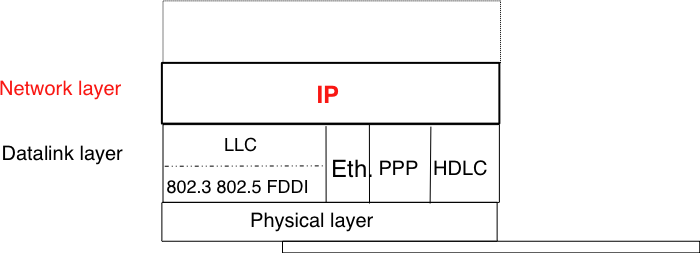
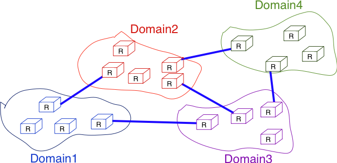

================== 
The network layer
==================

The network layer is a very important layer in computer networks as it is the glue that allows the applications running above the transport layers to use a wide range of different and interconnected networks built with different datalink and physical layers. The network layer enables applications to run above networks built with very different network technologies. 

In this chapter, we first explain the principles of the network layer. These principles include the datagram and virtual circuit modes, the separation between the data plane and the control plane and the algorithms used by routing protocols. Then, we explain in more details the network layer in the Internet, starting with IPv4 and IPv6 and then moving to the routing protocols (RIP, OSPF and BGP).

.. include:: principles.rst

.. todo explain broadcast address IPv4 ?

Internet Protocol
#################

The Internet Protocol (IP) is the network layer protocol of the TCP/IP protocol suite. IP allows the applications running above the transport layer (UDP/TCP) to use a wide range of heterogeneous datalink layers. IP was designed when most point-to-point links were telephone lines with modems. Since then, IP has been able to use Local Area Networks (Ethernet, Token Ring, FDDI, ...), new wide area data link layer technologies (X.25, ATM, Frame Relay, ...) and more recently wireless networks (802.11, 802.15, UMTS, GPRS, ...). The flexibility  of IP and its ability to use various types of underlying data link layer technologies is one of its key advantages.

   IP and the reference model

.. there is a draft on expectations of lower layer

The current version of IP is version 4 specified in :rfc:`791`. We first describe this version and later explain IP version 6 that is expected to replace IP version 4 in the future.

.. include:: ipv4.rst

.. include:: ipv6.rst

.. include:: middleboxes.rst

Routing in IP networks
######################

In a large IP network such as the global Internet, routers need to exchange routing information. The Internet is an interconnection of networks, often called domains, that are under different responsibilities. As of this writing, the Internet is composed on more than 30,000 different domains and this number is still growing [#fpotaroo]_. A domain can be a small enterprise that manages a few routers in a single building, a larger enterprise with hundred routers at multiple locations or a large Internet Service Provider that manages thousands of routers. Two classes of routing protocols are used to allow these domains to efficiently exchange routing information. 

   
   Organisation of a small Internet

The first class of routing protocols are the `intradomain routing protocols` (sometimes also called the interior gateway protocols or :term:`IGP`). An intradomain routing protocol is used by all the routers inside a domain to exchange routing information about the destinations that are reachable inside the domain. There are several intradomain routing protocols. Some domains use :term:`RIP`  which is a distance vector protocol. Other domains use link-state routing protocols such as :term:`OSPF` or :term:`IS-IS`. Finally, some domains use static routing or proprietary protocols such as :term:`IGRP` or :term:`EIGRP`.

These intradomain routing protocols usually have two objectives. First, they distribute routing information that corresponds to the shortest path between two routers in the domain. Second, they should allow the routers to quickly recover from link and router failures.

The second class of routing protocols are the `interdomain routing protocols` (sometimes also called the exterior gateway protocols or :term:`EGP`). The objective of an interdomain routing protocol is to distribute routing information between domains. For scalability reasons, an interdomain routing protocol must distribute aggregated routing information and considers each domain as a blackbox.

A very important difference between intradomain and interdomain routing are the `routing policies` that are used by each domain. Inside a single domain, all routers are considered equal and when several routes are available to reach a given destination prefix, the best route is selected based on technical criteria such as the route with the shortest delay, the route with the minimum number of hopsor the route with the highest bandwidth, ... 

When we consider the interconnection of domains that are managed by different organisations, this is not true anymore. Each domain implements its own routing policy. A routing policy is composed of three elements : an `import filter` that specifies which routes can be accepted by a domain, an `export filter` that specifies which routes can be advertised by a domain and a ranking algorithm that selects the best route when a domain knows several routes towards the same destination prefix. As we will see later, another important difference is that the objective of the interdomain routing protocol is to find the `cheapest` route towards each destination. There is only one interdomain routing protocol : :term:`BGP`.

Intradomain routing 
===================

In this section, we briefly describe the key features of the two main intradomain unicast routing protocols : RIP and OSPF. 

.. include:: rip.rst

.. include:: ospf.rst

.. include:: bgp.rst

Summary
#######

.. rubric:: Footnotes

.. [#foverload] It should be noted that link state routing assumes that all routers in the network have enough memory to store the entire LSDB. The routers that do not have enough memory to store the entire LSDB cannot participate in link state routing. Some link state routing protocols allow routers to report that they do not have enough memory and must be removed from the graph by the other routers in the network.

.. [#fclasses] In addition to the A, B and C classes, :rfc:`791` also defined the `D` and `E` classes of IPv4 addresses. Class `D` (resp. `E`) addresses are those whose high order bits are set to `1110` (resp. `1111`). Class `D` addresses are used by IP multicast and will be explained later. Class `E` addresses are currently unused, but there are some discussions on possible future usages [WMH2008]_ [FLM2008]_

.. [#fnetmask] Another way of representing IP subnets is to use netmasks. A netmask is a 32 bits field whose `p` high order bits are set to `1` and the low order bits are set to `0`. The number of high order bits set `1` indicates the length of the subnet identifier. Netmasks are usually represented in the same dotted decimal format as IPv4 addresses. For example `10.0.0.0/8` would be represented as `10.0.0.0 255.0.0.0` while `192.168.1.0/24` would be represented as `192.168.1.0 255.255.255.0`. In some cases, the netmask can be represented in hexadecimal.

.. [#funumbered] A point-to-point link to which no IPv4 address has been allocated is called an unnumbered link. See :rfc:`1812` section 2.2.7 for a discussion of such unnumbered links.

.. [#fprotocolnumber] See http://www.iana.org/assignments/protocol-numbers/ for the list of all assigned `Protocol` numbers

.. [#fttl] The initial IP specification in :rfc:`791` suggested that routers would decrement the `TTL` at least once every second. This would ensure that a packet would never remain for more than `TTL` seconds in the network. However, in practice most router implementations simply chose to decrement the `TTL` by one. 

.. [#finitialttl] The initial TTL value used to send IP packets vary from one implementation to another. Most current IP implementations use an initial TTL of 64 or more. See http://members.cox.net/~ndav1/self_published/TTL_values.html for additional information.

.. [#f6lowpan] Supporting IP over the 802.15.4 datalink layer technology requires special mechanisms. See :rfc:`4944` for a discussion of the special problems posed by 802.15.4

.. [#fpingproblems] Until a few years ago, all hosts replied to `Echo request` ICMP messages. However, due to the security problems that have affected TCP/IP implementations, many of these implementations can now be configured to disable answering `Echo request` ICMP messages. 

.. [#ftraceroutemore] A detailed analysis of traceroute output is outside the scope of this document. Additional information may be found in [ACO+2006]_ and [DT2007]_

.. ping of death http://insecure.org/sploits/ping-o-death.html

.. [#fciscoags] Example routers from this period include the Cisco AGS http://www.knossos.net.nz/don/wn1.html and AGS+ http://www.ciscopress.com/articles/article.asp?p=25296

.. [#fdladdress] In practice, most local area networks use addresses encoded as a 48 bits field [802]_. Some recent local area network technologies use 64 bits addresses.

.. [#farplinux] See chapter 28 of [Benvenuti2005] for a description of the implementation of ARP in the Linux kernel. 

.. [#fifconfig] For example, consider all the options that can be specified for the `ifconfig utility<http://en.wikipedia.org/wiki/Ifconfig>` on Unix hosts.

.. [#fdhcpserver] In practice, there is usually one DHCP server per group of subnets and the routers capture on each subnet the DHCP messages and forward them to the DHCP server.

.. [#fdfflag] A transport protocol implementation can also specify whether the packet must be sent with the `DF` set or set. A TCP implementation using `Path MTU Discovery` would always request the transmission of IPv4 packets with the `DF` flag set.

.. [#fiddf] It should be noted that only the packets that can be fragmented (i.e. whose `DF` flag is reset) must have different `Identification` fields. The `Identification` field is not used in the packets having the `DF` flag set.

.. [#fmultiiana] The full list of allocated IPv6 multicast addresses is available at http://www.iana.org/assignments/ipv6-multicast-addresses

.. [#fianaprotocol] The IANA_ maintains the list of all allocated Next Header types at http://www.iana.org/assignments/protocol-numbers/ The same registry is used for the IPv4 protocol field and for the IPv6 Next Header.

.. [#falert] For a discussion of the issues with the router alert IP option, see http://tools.ietf.org/html/draft-rahman-rtg-router-alert-dangerous-00 or
 http://tools.ietf.org/html/draft-rahman-rtg-router-alert-considerations-03

.. [#fprivacy] Using a datalink layer address to derive a 64 bits identifier for each host raises privacy concerns as the host will always use the same identifier. Attackers could use this to track hosts on the Internet. An extension to the Stateless Address Configuration mechanism that does not raise privacy concerns is defined in :rfc:`4941`. These privacy extensions allow a host to generate its 64 bits identifier randomly everytime it attaches to a subnet. It then becomes impossible for an attacker to use the 64-bits identifier to track a host. 

.. [#fpotaroo] Several web sites collect and analyse data about the evolution of BGP in the global Internet. http://bgp.potaroo.net provides lots of statistics and analyses that are updated daily.

.. [#fafi] The Address Family Identifiers are maintained by IANA at http://www.iana.org/assignments/address-family-numbers/

.. [#fvirtual] OSPF can support `virtual links` to connect together routers that belong to the same area but are not directly connected. However, this goes beyond this introduction to OSPF.

.. [#felection] The OSPF Designated Router election procedure is defined in :rfc:`2328`. Each router can be configured with a router priority that influences the election process since the router with the highest priority is preferred when an election is run. 

.. [#fasnum] An analysis of the evolution of the number of domains on the global Internet during the last ten years may be found in http://www.potaroo.net/tools/asn32/

.. [#fasrank] See http://as-rank.caida.org/ for an  analysis of the interconnections between domains based on measurements collected in the global Internet

.. [#fwish] Two routers that are attached to the same IXP only exchange packets when the owners of their domains have an economical incentive to exchange packets on this IXP. Usually, a router on an IXP is only able to exchange packets with a small fraction of the routers that are present on the same IXP.

.. [#fripedb] See ftp://ftp.ripe.net/ripe/dbase for the RIPE database that contains the import and export policies of many European ISPs

.. [#fasdomain] In this text, we consider Autonomous System and domain as synonyms. In practice, a domain may be  divided into several Autonomous Systems, but we ignore this detail. 

.. [#flifetimebgp] The BGP sessions and the underlying TCP connection are typically established by the routers when they boot based on information found in their configuration. The BGP sessions are rarely released, except if the corresponding peering link fails or one of the endpoints crashes or needs to be rebooted. 

.. [#fdefaultkeepalive] 90 seconds is the default delay recommended by :rfc:`4271`. However, two BGP peers can negotiate a different timer during the establishment of their BGP session. Using a too small interval to detect BGP session failures is not recommended. BFD [KW2009]_ can be used to replace BGP's KEEPALIVE mechanism if fast detection of interdomain link failures is required.

.. [#fflap] A link is said to be flapping if it switches several between an operationnal state and a disabled state within a short period of time. A router attached to such a link would need to frequently send routing messages.

.. [#fnexthopself] Some routers, when they receive a `BGP Update` over an `eBGP session`, set the nexthop of the received route to one of their own addresses. This is called `nexthop-self`. See e.g. [WMS2004]_ for additional details.

.. [#frr] Using a full-mesh of iBGP sessions is suitable in small networks. However, this solution does not scale in large networks containing hundreds or more routers since :math:`\frac{n \times (n-1)}{2}` iBGP sessions must be established in a domain containing :math:`n` BGP routers. Large domains use either Route Reflection :rfc:`4456` or confederations :rfc:`5065` to scale their iBGP, but this goes beyond this introduction.

.. [#fbgpmulti] Some BGP implementations can be configured to install several routes towards a single prefix in their FIB for load-balancing purposes. However, this goes beyond this introduction to BGP.

.. [#fmed] The MED attribute can be used on `customer->provider` peering relationships upon request of the customer. On `shared-cost` peering relationship, the MED attribute is only enabled when there is a explicit agreement between the two peers. 

.. [#fgranularity] Some researchers such as [MUF+2007]_ have shown that modelling the Internet topology at the AS-level requires more than the `shared-cost` and `customer->provider` peering relationships. However, there is no publically available model that goes beyond these classical peering relationships.

.. [#fbgpdata] BGP data is often collected by establishing BGP sessions between Unix hosts running a BGP daemon and BGP routers in different ASes. The Unix hosts stores all BGP messages received and regular dumps of its BGP routing table. See http://www.routeviews.org, http://www.ripe.net/ris, http://bgp.potaroo.net or http://irl.cs.ucla.edu/topology/

.. include:: ../links.rst

.. include:: exercises/ex-network.rst

.. include:: exercises/cha-network.rst
