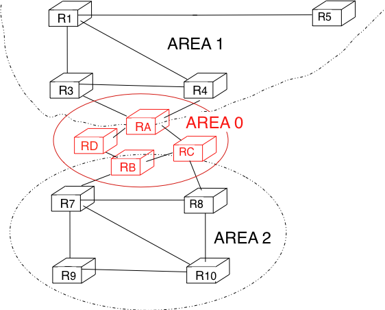
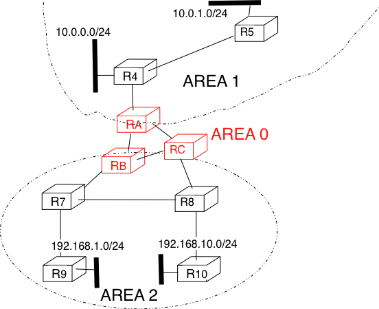
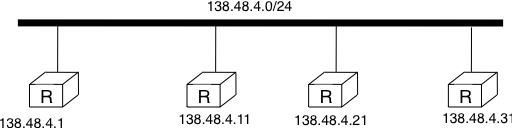
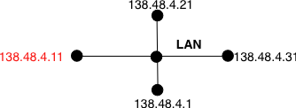

.. Copyright |copy| 2010 by Olivier Bonaventure
.. This file is licensed under a `creative commons licence <http://creativecommons.org/licenses/by-sa/3.0/>`_

.. index:: OSPF, Open Shortest Path First

OSPF
----

Link-state routing protocols are used in IP networks. Open Shortest Path First (OSPF), defined in :rfc:`2328`, is the link state routing protocol that has been standardised by the IETF. The last version of OSPF, which supports IPv6, is defined in :rfc:`5340`. OSPF is frequently used in enterprise networks and in some ISP networks. However, ISP networks often use the IS-IS link-state routing protocol [ISO10589]_ , which was developped for the ISO CLNP protocol but was adapted to be used in IP :rfc:`1195` networks before the finalisation of the standardisation of OSPF. A detailed analysis of ISIS and OSPF may be found in [BMO2006]_ and [Perlman2000]_.  Additional information about OSPF may be found in [Moy1998]_.

.. index:: OSPF area

Compared to the basics of link-state routing protocols that we discussed in section :ref:`linkstate`, there are some specificities of OSPF that are worth discussing. First, in a large network, flooding the information about all routers and links to thousands of routers or more may be costly as each router needs to store all the information about the entire network. A better approach would be to introduce hierarchical routing. Hierarchical routing divides the network into regions. All the routers inside a region have detailed information about the topology of the region but only learn aggregated information about the topology of the other regions and their interconnections. OSPF supports a restricted variant of hierarchical routing. In OSPF's terminology, a region is called an `area`. 

OSPF imposes restrictions on how a network can be divided into areas. An area is a set of routers and links that are grouped together. Usually, the topology of an area is chosen so that a packet sent by one router inside the area can reach any other router in the area without leaving the area [#fvirtual]_ . An OSPF area contains two types of routers :rfc:`2328`: 

 - Internal router : A router whose directly connected networks belong to the area 
 - Area border routers : A router that is attached to several areas.  

For example, the network shown in the figure below has been divided into three areas : `area 1`, containing routers `R1`, `R3`, `R4`, `R5` and `RA`, `area 2` containing `R7`, `R8`, `R9`, `R10`, `RB` and `RC`. OSPF areas are identified by a 32 bit integer, which is sometimes represented as an IP address. Among the OSPF areas, `area 0`, also called the `backbone area` has a special role. The backbone area groups all the area border routers (routers `RA`, `RB` and `RC` in the figure below) and the routers that are directly connected to the backbone routers but do not belong to another area (router `RD` in the figure below). An important restriction imposed by OSPF is that the path between two routers that belong to two different areas (e.g. `R1` and `R8` in the figure below) must pass through the backbone area.

   
   OSPF areas 

Inside each non-backbone area, routers distribute the topology of the area by exchanging link state packets with the other routers in the area. The internal routers do not know the topology of other areas, but each router knows how to reach the backbone area. Inside an area, the routers only exchange link-state packets for all destinations that are reachable inside the area. In OSPF, the inter-area routing is done by exchanging distance vectors. This is illustrated by the network topology shown below.

   
   Hierarchical routing with OSPF 

Let us first consider OSPF routing inside `area 2`. All routers in the area learn a route towards `192.168.1.0/24` and `192.168.10.0/24`. The two area border routers, `RB` and `RC`, create network summary advertisements. Assuming that all links have a unit link metric, these would be:
  
 - `RB` advertises `192.168.1.0/24` at a distance of `2` and `192.168.10.0/24` at a distance of `3`
 - `RC` advertises `192.168.1.0/24` at a distance of `3` and `192.168.10.0/24` at a distance of `2`

These summary advertisements are flooded through the backbone area attached to routers `RB` and `RC`. In its routing table, router `RA` selects the summary advertised by `RB` to reach `192.168.1.0/24` and the summary advertised by `RC` to reach `192.168.10.0/24`. Inside `area 1`, router `RA` advertises a summary indicating that `192.168.1.0/24` and `192.168.10.0/24` are both at a distance of `3` from itself.

On the other hand, consider the prefixes `10.0.0.0/24` and `10.0.1.0/24` that are inside `area 1`. Router `RA` is the only area border router that is attached to this area. This router can create two different network summary advertisements :

 - `10.0.0.0/24` at a distance of `1` and `10.0.1.0/24` at a distance of `2` from `RA`
 - `10.0.0.0/23` at a distance of `2` from `RA`

The first summary advertisement provides precise information about the distance used to reach each prefix. However, all routers in the network have to maintain a route towards `10.0.0.0/24` and a route towards `10.0.1.0/24` that are both via router `RA`. The second advertisement would improve the scalability of OSPF by reducing the number of routes that are advertised across area boundaries. However, in practice this requires manual configuration on the border routers.

.. index:: OSPF Designated Router

The second OSPF particularity that is worth discussing is the support of Local Area Networks (LAN). As shown in the example below, several routers may be attached to the same LAN.

   
   An OSPF LAN containing several routers

A first solution to support such a LAN with a link-state routing protocol would be to consider that a LAN is equivalent to a full-mesh of point-to-point links as if each router can directly reach any other router on the LAN. However, this approach has two important drawbacks :

 #. Each router must exchange HELLOs and link state packets with all the other routers on the LAN. This increases the number of OSPF packets that are sent and processed by each router.
 #. Remote routers, when looking at the topology distributed by OSPF, consider that there is a full-mesh of links between all the LAN routers. Such a full-mesh implies a lot of redundancy in case of failure, while in practice the entire LAN may completely fail. In case of a failure of the entire LAN, all routers need to detect the failures and flood link state packets before the LAN is completely removed from the OSPF topology by remote routers. 

To better represent LANs and reduce the number of OSPF packets that are exchanged, OSPF handles LAN differently. When OSPF routers boot on a LAN, they elect [#felection]_ one of them as the `Designated Router (DR)` :rfc:`2328`. The `DR` router `represents` the local area network, and advertises the LAN's subnet (`138.48.4.0/24` in the example above). Furthermore, LAN routers only exchange HELLO packets with the `DR`. Thanks to the utilisation of a `DR`, the topology of the LAN appears as a set of point-to-point links connected to the `DR` as shown in the figure below. 

   
   OSPF representation of a LAN

.. tp: :rfc:`2991` ECMP

.. note:: How to quickly detect a link failure ?

 Network operators expect an OSPF network to be able to quickly recover from link or router failures [VPD2004]_. In an OSPF network, the recovery after a failure is performed in three steps [FFEB2005] :

  - the routers that are adjacent to the failure detect it quickly. The default solution is to rely on the regular exchange of HELLO packets. However, the interval between successive HELLOs is often set to 10 seconds... Setting the HELLO timer down to a few milliseconds is difficult as HELLO packets are created and processed by the main CPU of the routers and these routers cannot easily generate and process a HELLO packet every millisecond on each of their interfaces. A better solution is to use a dedicated failure detection protocol such as the Bidirectionnal Forwarding Detection (BFD) protocol defined in [KW2009]_ that can be implemented directly on the router interfaces. Another solution to be able to detect the failure is to instrument the physical and the datalink layer so that they can interrupt the router when a link fails. Unfortunately, such a solution cannot be used on all types of physical and datalink layers.
  - the routers that have detected the failure flood their updated link state packets in the network
  - all routers update their routing table 

.. rubric:: Footnotes

.. [#fvirtual] OSPF can support `virtual links` to connect routers together that belong to the same area but are not directly connected. However, this goes beyond this introduction to OSPF.

.. [#felection] The OSPF Designated Router election procedure is defined in :rfc:`2328`. Each router can be configured with a router priority that influences the election process since the router with the highest priority is preferred when an election is run. 
