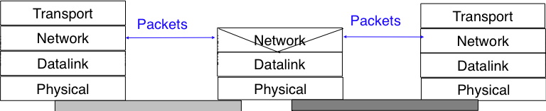
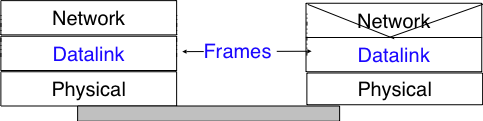
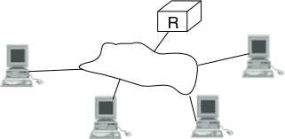
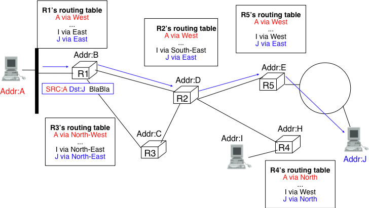
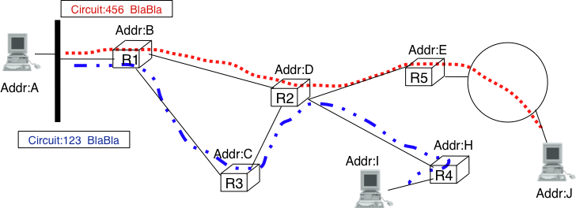
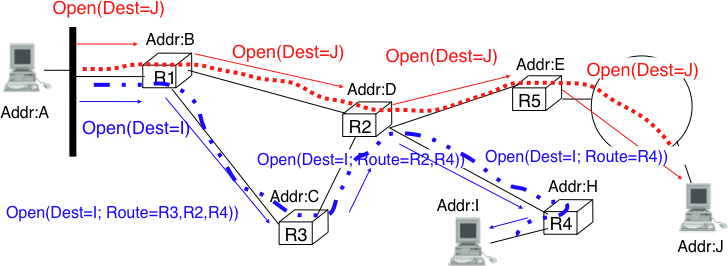
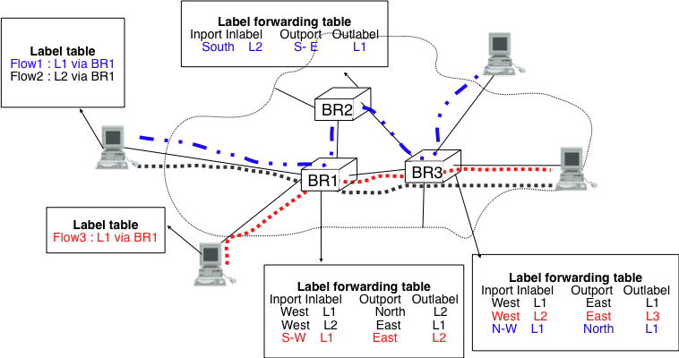
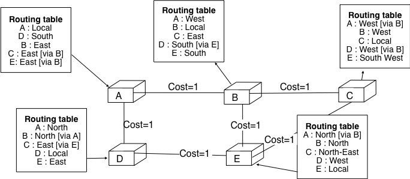

.. Copyright |copy| 2010 by Olivier Bonaventure
.. This file is licensed under a `creative commons licence <http://creativecommons.org/licenses/by-sa/3.0/>`_

Principles 
###########

The main objective of the network layer is to allow endsystems connected to different networks to exchange information through intermediate systems that are called :term:`router`. The unit of information in the network layer is called a :term:`packet`.

   
   The network layer in the reference model

Before explaining the network layer in details, it is useful to first analyse the service provided by the `datalink` layer. There are many variants of the datalink layer. Some provide a connection-oriented service while others provide a connectionless service. In this section, we focus on connectionless datalink layer services that are the most widely used. Using a connection-oriented datalink layer causes some problems that are beyond the scope of this chapter. See :rfc:`3819` for a discussion on this topic.

   The point-to-point datalink layer

There are three main types of datalink layers. The simplest datalink layer is when there are only two communicating systems that are directly connected through the physical layer. Such a datalink layer is used when there is a point-to-point link between the two communicating systems. The two systems can be endsystems or routers. :abbr:`PPP (Point-to-Point Protocol)` defined in :rfc:`1661` in an example of such a point-to-point datalink layer. Datalink layers exchange `frames` and a datalink :term:`frame` sent by a datalink layer entity on the left is transmitted through the physical layer so that it can reach the datalink layer entity on the right. Point-to-point datalink layers can either provide an unreliable service (frames can be corrupted or lost) or a reliable service (in this case, the datalink layer includes retransmission mechanisms similar to the ones used in the transport layer). The unreliable service is frequently used above physical layers (e.g. optical fiber, twisted pairs) having a low bit error ratio while reliability mechanisms are often used in wireless networks to recover locally from transmission errors.

The second type of datalink layer is the one used in Local Area Networks (LAN). Conceptually, a LAN is a set of communicating devices such that any two devices can directly exchange frames through the datalink layer. Both endsystems and routers can be connected to a LAN. Some LANs only connect a few devices, but there are LANs may connect hundreds or even thousands of devices.

   
   A local area network 

We describe in the next chapter the organisation and the operation of Local Area Networks. An important difference between the point-to-point datalink layers and the datalink layers used in LANs is that in a LAN, each communicating device is identified by a unique `datalink layer address`. This address is usually embedded in the hardware of the device and different types of LANs use different types of datalink layer addresses. A communicating device attached to a LAN can send a datalink frame to any other communicating device that is attached to the same LAN. Most LANs also support special broadcast and multicast datalink layer addresses. A frame sent to the broadcast address of the LAN is delivered to all communicating devices that are attached to the LAN. The multicast addresses are used to identify groups of communicating devices. When a frame is sent towards a multicast datalink layer address, it is delivered by the LAN to all communicating devices that belong to the corresponding group.

.. index:: NBMA, Non-Broadcast Multi-Access Networks

The third type of datalink layers are used in Non-Broadcast Multi-Access (NBMA) networks. These networks are used to interconnect devices like a LAN. All devices attached to an NBMA network are identified by a unique datalink layer address. However, and this is the main difference between an NBMA network and a traditionnal LAN, the NBMA service only supports unicast. The datalink layer service provided by an NBMA network does not support neither broadcast nor multicast.

Unfortunately no datalink layer is able to send frames of unlimited side. Each datalink layer is characterised by a maximum frame size. There are more than a dozen different datalink layers and unfortunately most of them use a different maximum frame size. The network layer must cope with the heterogeinity of the datalink layer.

The network layer itself relies on the following principles : 

 #. Each network layer entity is identified by a `network layer address`. This address is independent of the datalink layer addresses that it may use.
 #. The service provided by the network layer does not depend on the service or the internal organisation of the underlying datalink layers.
 #. The network layer is conceptually divided in two planes : the `data plane` and the `control plane`. The `data plane` contains the protocols and mechanisms that allow hosts and routers to exchange packets carrying user data. The `control plane` contains the protocols and mechanisms that enable routers to efficiently learn how to forward packets towards their final destination. 

The independance of the network layer from the underlying datalink layer is a key principle of the network layer. It ensures that the network layer can be used to allow hosts attached to different types of datalink layers to exchange packets through intermediate routers. Furthermore, this allows the datalink layers and the network layer to evolve independently from each other. This enables the network layer to be easily adapted to a new datalink layer every time a new datalink layer is invented.

There are two types of services that can be provided by the network layer :

 - an `unreliable connectionless` service
 - a `connection-oriented`, reliable or unreliable, service

Connection-oriented services have been popular with technologies such as :term:`X.25` and :term:`ATM` or :term:`frame-relay`, but nowadays most networks use an `unreliable connectionless` service. This is our main focus in this chapter.

Organisation of the network layer
=================================

.. index:: datagram, virtual circuit

There are two possible internal organisations of the network layer : 

 - datagram 
 - virtual circuits 

The internal organisation of the network is orthogonal to the service that it provides, but most of the time a datagram organisation is used to provide a connectionless service while a virtual circuit organisation is used in networks that provide a connection-oriented service.

Datagram organisation
---------------------

The first and most popular organisation of the network layer is the datagram organisation. This organisation is inspired from the organisation of the postal service. Each host is identified by a `network layer address`. To send information to a remote host, a host creates a packet that contains :

 - the network layer address of the destination host
 - its own network layer address
 - the information to be sent

The network layer limits the maximum packet size. Thus, the information must have been divided in packets by the transport layer before being passed to the network layer. 

To understand the datagram organisation, let us consider the figure below. A network layer address, represented by a letter, has been assigned to each host and router. To send some information to host `J`, host `A` creates a packet containing its own address, the destination address and the information to be exchanged.

   A simple internetwork 

.. index:: hop-by-hop forwarding

With the datagram organisation, routers use `hop-by-hop forwarding`. This means that when a router receives a packet that is not destined to itself, it lookups the destination address of the packet in its `routing table`. A `routing table` is a data structure that maps each destination address (or set of destination addresses) on the outgoing interface over which a packet destined to this address must be forwarded to reach its final destination. 

The main constraint imposed on the routing tables is that they must allow any host in the network to reach any other host. This implies that each router must know a route towards each destination but also that the paths composed from the information stored in the routing tables cannot not contain loops. Otherwise, some destinations would be unreachable. 

In the example above, host `A` sends its packet to router `R1`. `R1` consults its routing table and forwards the packet towards `R2`. Based on its own routing table, `R2` decides to forward the packet to `R5` that can deliver it to its destination.

To allow hosts to exchange packets, a network relies on two different types of protocols and mechanisms. First, there must be a precise definition of the format of the packets that are sent by hosts and processed by routers. Second, the algorithm used by the routers to forward these packets must be defined. This protocol and this algorithm are part of the `data plane` of the network layer. The `data plane` contains all the protocols and algorithms that are used by hosts and routers to create and process the packets that contain user data.

The `data plane` and in particular the forwarding algorithm used by the routers depends on the routing tables that are maintained on reach router. These routing tables can be maintained by using various techniques (manual configuration, distributed protocols, centralised computation, ...). These techniques are part of the `control plane` of the network layer. The `control plane` contains all the protocols and mechanisms that are used to compute and install routing tables  on the routers. 

The datagram organisation has been very popular in computer networks. Datagram based network layers include IPv4 and IPv6 in the global Internet, CLNP defined by the ISO, IPX defined by Novell or XNS defined by Xerox.

Virtual circuit organisation
----------------------------

The main advantage of the datagram organisation is its simplicity. The principles of this organisation can be easily understood. Furthermore, it allows a host to easily send a packet towards any destination at any time. However, as each packet is forwarded independently by intermediate routers, packets sent by a host may not follow the same path to reach a given destination. This may cause packet reordering which may be annoying for transport protocols. Furthermore, as a router using `hop-by-hop forwarding` always forwards over the same outgoing interface the packets sent towards the same destination, this may cause congestion over some links.

The second organisation of the network layer, called `virtual circuits` has been inspired from the organisation of the telephone networks. Telephone networks have been designed to carry phone calls that usually last a few minutes. Each phone is identified by a telephone number and is attached to a telephone switch. To initiate a phone call, a telephone first needs to send the destination's phone number to its local switch. The switch cooperates with the other switches in the network to create a bi-directionnal channel between the two telephones through the network. This channel will be used by the two telephones during the lifetime of the call and will be released at the end of the call. Until the 1960s, most of these channels were created manually by the telephone operators upon request of the caller. Today's telephone networks use automated switches and allow several channels to be carried over the same physical link, but the principles remain roughly the same.

In a network using virtual circuits all hosts are identified with a network layer address. However, a host must explicitely request the establishment of a `virtual circuit before being able to send packets to a destination host. 
The request to establish a virtual circuit is processed by the `control plane` that installs state to create the virtual circuit between the source and the destination through intermediate routers. All the packets that are sent on the virtual circuit contain a virtual circuit identifier that allows the routers to determine to which virtual circuit each packet belongs. This is illustrated in the figure below with one virtual circuit between host `A` and host `I` and another one between host `A` and host `J`. 

   A simple internetwork using virtual-circuits

				   
The establishment of a virtual circuit is performed by using a `signalling protocol` in the `control plane`. Usually, the source host sends a signalling message to indicate to its router the address of the destination and possibly some performance characteristics of the virtual circuit to be established. The first router can process the signalling message in two different ways. 

A first solution is for the router to consult its routing table, remember the characteristics of the requested virtual circuit and forward it over its outgoing interface towards the destination. The signalling message is thus forwarded hop-by-hop until it reaches the destination and the virtual circuit is opened along the path followed by the signalling message. This is illustrated with the red virtual circuit in the figure below.

   Virtual circuit establishment

.. index:: source routing, label

A second solution can be used if the routers know the entire topology of the network. In this case, the first router can use a technique called `source routing`. Upon reception of the signalling message, the first router chooses the path of the virtual circuit in the network. This path is encoded as the list of the addresses of all intermediate routers to reach the destination. It is included in the signalling message and intermediate routers can remove their address from the signalling message before forwarding it. This technique enables routers to better spread the virtual circuits throughout the network. If the routers know the load of remote links, they can also select the less loaded path when establishing a virtual circuit. This solution is illustrated with the blue circuit in the figure above.
	   
The last point to be discussed about the virtual circuit organisation is its `data plane`. The `data plane` defines mainly the format of the data packets and the algorithm used by routers to forward packets. The data packets contain a virtual circuit identifier that is encoded as a fixed number of bits. These virtual circuit identifiers are usually called `labels`. 

Each host maintains a flow table that associates a label with each virtual circuit that is has established. When a router receives a packet that contains a label, it extracts the label and consults its `label forwarding table`. This table is a data structure that maps each couple `(incoming interface, label)` to the outgoing interface to be used to forward the packet and the label that must be placed in the outgoing packets. In practice, the label forwarding table can be implemented as a vector and the couple `(incoming interface, label)` is the index of the entry in the vector that contains the outgoing interface and the outgoing label. Thus a single memory access is sufficient to consult the label forwarding table. The utilisation of the label forwarding table is illustrated in the figure below.

   Label forwarding tables in a network using virtual circuits

The virtual circuit organisation has been mainly used in public networks, starting from X.25 and then Frame elay and Asynchronous Transfert Mode (ATM) network. 

Both the datagram and virtual circuit organisations have advantages and drawbacks. The main advantage of the datagram organisation is that hosts can easily send packets to any number of destinations while the virtual circuit organisation requires the establishment of a virtual circuit before the transmission of data packet. This solution can be costly for hosts that exchange small amounts of data. On the other hand, the main advantage of the virtual circuit organisation is that the forwarding algorithm used by routers is simpler than when using the datagram organisation. Furthermore, the utilisation of virtual circuits may allow the load to be better spread through the network thanks to the utilisation of multiple virtual circuits. The MultiProtocol Label Switching (MPLS) technique that we discuss in chapter ??? can be considered as a good compromise between datagram and virtual circuits. MPLS uses virtual circuits between routers, but does not extend them to the endhosts.

.. maybe add more information

The control plane
=================

One of the objectives of the `control plane` in the network layer is to maintain the routing tables that are used on all routers. As indicated earlier, a routing table is a data structure that contains, for each destination address (or block of addresses) known by the router, the outgoing interface over which the router must forward a packet destined to this address. The routing table may also contain additional information such as the address of the next router on the path towards the destination or an estimation of the cost of this path. 

In this section, we discuss the three main techniques that can be used to maintain the routing tables in a network.

Static routing
--------------

.. comment:: comment formaliser l'absence de boucles

The simplest solution is to pre-compute all the routing tables of all routers solution and to install them on each router. Several algorithms can be used to compute these tables. A simple solution is to use shortest path routing and to minimise the number of intermediate routers to reach each destination. More complex algorithms can take into account the expected load on the links to ensure that congestion does not occur for a given traffic demand. Those algorithms must all ensure that :

 - all routers are configured with a route to reach each destination
 - the paths composed with the entries found in the routing tables do not cause forwarding loops

The figure below shows sample routing tables in a five routers network.

   Routing tables in a simple network 

The main drawback of static routing is that it does not adapt to the evolution of the network. When a new router or link is added, all routing tables must be recomputed. Furthermore, when a link or router fails, the routing tables must be updated as well.

.. include:: dv.rst

..  include:: linkstate.rst
