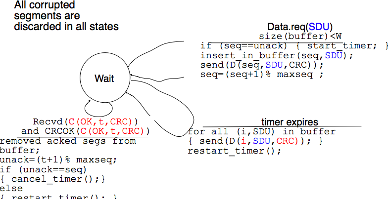
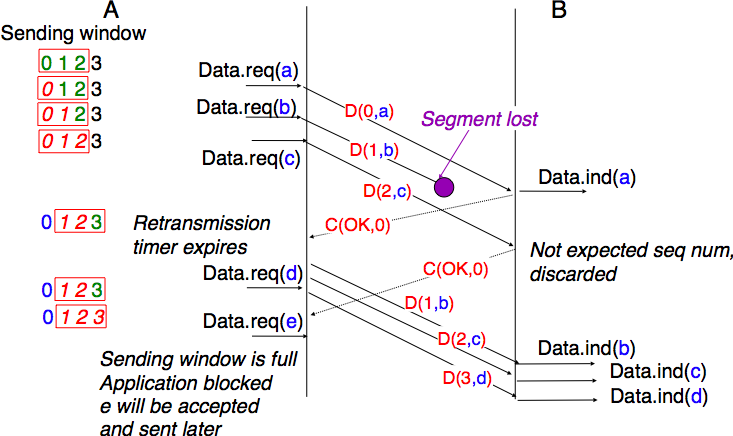
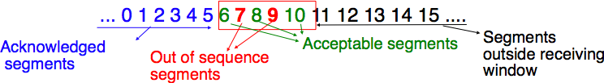
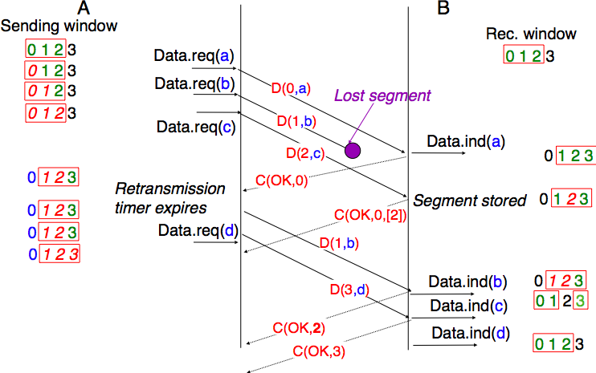
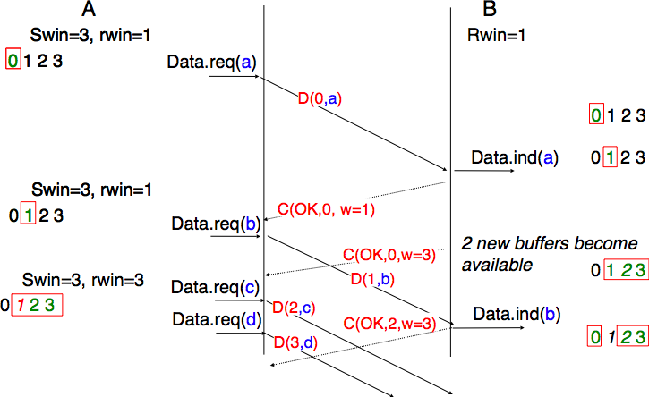
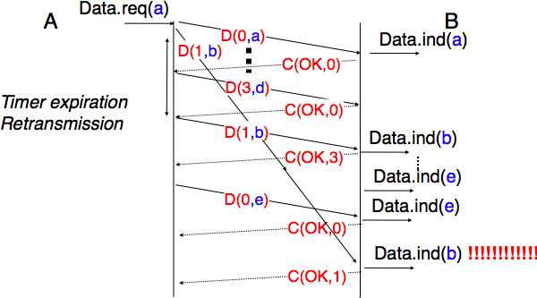
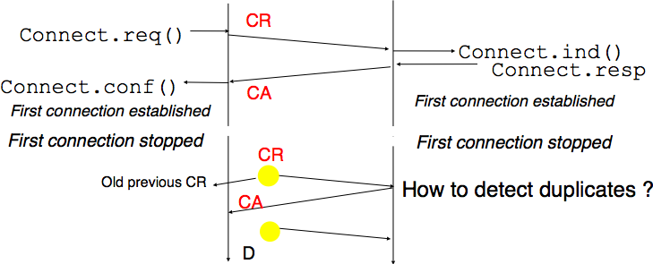
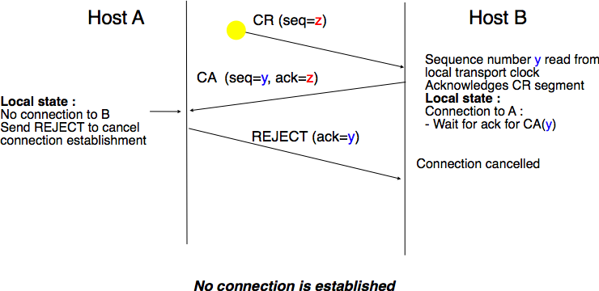

.. Copyright |copy| 2010 by Olivier Bonaventure
.. This file is licensed under a `creative commons licence <http://creativecommons.org/licenses/by-sa/3.0/>`_

Principles of a reliable transport protocol
###########################################

In this section, we design a reliable transport protocol running above a connectionless network layer service. For this, we first assume that the network layer provides a perfect service, i.e. :

 - the connectionless network layer service never corrupts SDUs
 - the connectionless network layer service never discards SDUs
 - the connectionless network layer service never delays, reorders nor duplicate SDUs
 - the connectionless network layer service can support SDUs of *any size*

We will remove these assumptions one after the other in order to better understand the mechanisms that are used to solve each imperfection.

Reliable data transfer on top of a perfect network service
==========================================================

The transport layer entity interacts with a user in the application layer and also with an entity in the network layer. According to the reference model, these interactions will be performed by using `DATA.req`and DATA.ind` primitives. However, to simplify the presentation and avoid a confusion between a `DATA.req` primitive issued by the user of the transport layer entity and a `DATA.req` issued by the transport layer entity itself, we use the following terminology :

 - the interactions between the user and the transport layer entity are represented by using the classical `DATA.req`, `DATA.ind`, ... primitives
 - the interactions between the transport layer entity and the network layer service are represented by using `send` instead of `DATA.req` and `recvd` instead of `DATA.ind`
 

This is illustrated in the figure below.

.. figure:: png/transport-fig-007-c.png
   :align: center
   :scale: 70 

   Interactions between the transport layer and its user and its network layer provider

When running on top of a perfect connectionless network service, a transport level entity can simply issue a `send(SDU)` upon arrival of `DATA.req(SDU)`. Similarly, the receiver issues a `DATA.ind(SDU)` upon reception of a `recvd(SDU)`. Such a simple protocol is sufficient when a single SDU is sent. 

.. figure:: png/transport-fig-004-c.png
   :align: center
   :scale: 70 

   The simplest transport protocol

Unfortunately, this is not sufficient to always ensure a reliable delivery of the SDUs. Consider the case of a client that sends tens of SDUs to a server. If the server is faster that the client, it will be able to receive and process all the segments sent by the client and deliver their content to its user. However, if the server is slower than the client, problems could arise. The transport entity contains buffers to store that SDUs that have been received as `Data.request` from the application and not yet sent via the network service. If the application is faster than the network layer, the buffer becomes full and the operating system suspends the application to let the transport entity empty its transmission queue. The transport entity also uses a buffer to store the segments received from the network layer that have not yet been processed by the application. If the application is slow to process the data, this buffer becomes full and the transport entity is not able to accept anymore the segments from the network layer. The buffers of the transport entity have a limited size [#fqueuesize]_ and if they overflow, the transport entity is forced to discard received segments. 

To solve this problem, we need to introduce inside our transport protocol, and despite the fact that the network layer provides a perfect service, a feedback mechanism that allows the receiver to inform the sender that it has processed a segment and that another one can be sent. For this, our transport protocol must process two types of segments :

 - data segments carrying a SDU
 - control segments carrying an acknowledgment that indicates that the previous segment was processed correctly

These two types of segments can be distinguished by using a segment composed of two parts :

 - a `header` that contains one bit set to `0` in data segments and to `1` in control segments
 - the payload containing the SDU supplied by the user application

The transport entity can then be modelled as a finite state machine containing two states for the receiver and two states for the sender. The figure below provides a graphical representation of this state machine with the sender above and the receiver below.

.. figure:: png/transport-fig-008-c.png
   :align: center
   :scale: 70 

   Finite state machine of the simplest transport protocol

The above FSM shows that the sender has to wait for an acknowledgement from the receiver before being able to transmit the next SDU.  The figure below illustrates the exchange of a few segments between two hosts.

.. figure:: png/transport-fig-009-c.png
   :align: center
   :scale: 70 

   Time sequence diagram illustrating the operation simplest transport protocol

Reliable data transfer on top of an imperfect network service
=============================================================

The transport layer must deal with the imperfections of the network layer service. There are three types of imperfections that must be considered by the transport layer :

 #. Segments can be corrupted by transmission errors 
 #. Segments can be lost
 #. Segments can be reordered or duplicated

To deal with these four types of imperfections, transport protocols rely on different types of mechanisms. The first problem are the transmission errors. The segments sent by a transport entity is processed by the network and datalink layers and finally transmitted by the physical layer. All these layers are imperfect. For example, the physical layer may be affected different types of errors :

 - random isolated errors where the value of single bit has been modified changed due to a transmission error.
 - random burst errors where the values of `n` consecutive bits have been changed due to transmission errors
 - random bit creations and random bit removals where bits have been added or removed due to transmission errors

The only solution to protect against transmission errors is to add redundancy to the segments that are sent. `Information Theory` defines two mechanisms that can be used to transmit information over a transmission channel that is affected by random errors. These two mechanisms add redundancy to the information sent to allow the receiver to detect or sometimes even correct transmission errors. A detailed discussion of these mechanisms is outside the scope of this chapter, but it is useful to consider a simple mechanism to understand its operation and its limitations.

`Information theory` defines `coding schemes`. There are different types of coding schemes, but let us focus on coding schemes that operate on binary strings. A coding scheme is a function that maps information encoded as a string of `m` bits into a string of `n` bits. The simplest coding scheme is the even parity coding. This coding scheme takes a `m` bits source string and produces a `m+1` bits coded string where the first `m` bits of the coded string are the bits of the source string and the last bit of the coded string is always chosen such that the coded string always contains an even number of bits set to `1`. For example :

 - `1001` is encoded as `10010`
 - `1101` is encoded as `11011`

This parity scheme has been used in some RAMs and to encode characters sent over a serial line. It is easy to show that this coding scheme allows the receiver to detect a single transmission error, but it cannot correct it. If two or more bits are in error, the receiver may not always be able to detect the error.

Some coding schemes allow the receiver to correct some transmission errors. For example, consider the coding scheme that encodes each source bit as follows :

 - `1` is encoded as `111`
 - `0` is encoded as `000`

This simple coding scheme forces the sender to transmit three bits for each source bit. However, it allows the receiver to correct single bit errors. More advanced coding systems that allow to recover from errors are used in several types of physical layers.

Transport protocols use error detection schemes, but none of the widely used transport protocols relies on error correction schemes. For this, a segment is usually divided in two parts :

 - a `header` that contains the fields used by the transport protocol to ensure a reliable delivery. The header contains a checksum or Cyclical Redundancy Check (CRC) [Williams1993]_ that is used to detect transmission errors
 - a `payload` that contains the user data passed by the application layer.

Some segment header also include a `length` that indicates the total length of the segment or the length of the payload. 

The simplest error detection scheme is the checksum. A checksum is basically an arithmetic sum of all the bytes that compose a segment. There are different types of checksums. For example, an eight bits checksum can be computed as the arithmetic sum of all the bytes of (the header and trailer of) the segment. The checksum is computed by the sender before sending the segment and the receiver verifies the checksum upon reception of each segment. The receiver discards the segments received with an invalid checksum. Checksums can be easily implemented in software, but their error detection capabilities are limited. Cyclical Redundancy Checks (CRC) have better error detection capabilities [SGP98]_, but require more CPU when implemented in software.

.. note:: Checksums, CRCs, ...

   Most of the protocols in the TCP/IP protocol suite rely on the simple Internet checksum to verify that the received segment has not been affected by transmission errors. Despite its popularity and ease of implementation, the Internet checksum is not the only available checksum mechanism. The Cyclical Redundancy Checks (CRC_) are very powerful error detection schemes that are used notably on disks, by many datalink layer protocols and file formats such as zip or png. They can be easily implemented efficiently in hardware and have better error-detection capabilities that Internet checksum [SGP98]_ . However, when the first transport protocols were designed the CRCs were considered to be too CPU-intensive for software implementations and other checksum mechanisms were chosen. The TCP/IP community chose the Internet checksum, the OSI community chose the Fletcher checksum [Sklower89]_ . There are now efficient techniques to quickly compute CRCs in software [Feldmeier95]_ . The SCTP protocol initially chose the Adler-32 checksum but replaced it recently with a CRC (see :rfc:`3309`).

.. CRC, checksum, fletcher, crc-32, Internet checksum
.. real checksum http://citeseerx.ist.psu.edu/viewdoc/summary?doi=10.1.1.55.8520
.. do not invent your own checksum, use existing ones
.. implementations can be optimised by using table lookups
.. crc : http://en.wikipedia.org/wiki/Cyclic_redundancy_check
.. tcp offload engine http://www.10gea.org/tcp-ip-offload-engine-toe.htm
.. stcp used Adler-32 but it now uses CRC :rfc:`3309`

The second imperfection of the network layer is that it may lose segments. As we will see later, the main cause of packet losses in the network layers is the lack of buffers in intermediate routers. Since the receiver sends an acknowledgement segment after having received each segment, the simplest solution to deal with losses is to use a retransmission timer. When the sender sends a segment, it starts a retransmission timer. The value of this retransmission timer should be larger than the `round-trip-time`, i.e. the delay between the transmission of a data segment and the reception of the corresponding acknowledgement. When the retransmission timer expires, the sender assumes that the data segment has been lost and retransmits it. This is illustrated in the figure below.

.. figure:: png/transport-fig-018-c.png
   :align: center
   :scale: 70 

   Using retransmission timers to recover from segment losses

Unfortunately, retransmission timers alone are not sufficient to recover from segment losses. Let us for example consider the situation depicted below where an acknowledgement is lost. In this case, the sender retransmits the data segment that has not been acknowledged. Unfortunately, as illustrated in the figure below, the receiver considers the retransmission as a new segment whose payload must be delivered to its user.

.. figure:: png/transport-fig-019-c.png
   :align: center
   :scale: 70 

   Limitations of retransmission timers 

.. index:: sequence number

To solve this problem, transport protocols associate a `sequence number` to each data segment. This `sequence number` is one of the fields found in the header of the data segments. We use the notation `D(S,...)` to indicate a data segment whose sequence number field is set to `S`. The acknowledgements also contain a sequence number that indicates the data segments that it acknowledges. We use `OKS` to indicate an acknowledgement segment that confirms the reception of `D(S,...)`. The sequence number is encoded as a bit string of fixed length. The simplest transport is the Alternating Bit Protocol (ABP). 

.. index:: Alternating Bit Protocol

The Alternating Bit Protocol uses a single bit to encode the sequence number. It can be implemented by using a simple Finite State Machine. 

.. figure:: png/transport-fig-021-c.png
   :align: center
   :scale: 70 

   Alternating bit protocol : Sender FSM

The initial state of the sender is `Wait for D(0,...)`. In this state, the sender waits for a `Data.request`. The first data segment that it sends uses sequence number `0`. After having sent this segment, the sender waits for an `OK0` acknowledgement. A segment is retransmitted upon expiration of the retransmission timer or if an acknowledgement with an incorrect sequence number has been received.

The receiver first waits for `D(0,...)`. If the segment has a correct `CRC`, it passes the SDU to its user and sends `OK0`. Then, the receiver waits for `D(1,...)`. In this state, it may receive a duplicate `D(0,...)` or a data segment with an invalid CRC. In both cases, it returns an `OK0` segment to allow the sender to recover from the possible loss of the previous `OK0` segment.

.. figure:: png/transport-fig-022-c.png
   :align: center
   :scale: 70 

   Alternating bit protocol : Receiver FSM

The figure below illustrates the operation of the alternating bit protocol.

.. figure:: png/transport-fig-023-c.png
   :align: center
   :scale: 70 

   Operation of the alternating bit protocol
   

.. 
   note:: Random errors versus malicious modifications
   The protocols of the transport layer are designed to recover from the random errors and losses that may occur in the underlying layers. There random errors are caused by 
   see [SPMR09]_ for how to recompute a CRC
   Checksums and CRCs should not be confused with hash functions such as MD5 defined in :rfc:`1321` or `SHA-1 <http://www.itl.nist.gov/fipspubs/fip180-1.htm>`_ .

The Alternating Bit Protocol can recover from the transmission errors and the segment losses. However, it has one important drawback. Consider two hosts that are directly connected by a 50 Kbits/sec satellite link that has a 250 milliseconds propagation delay. If these hosts send 1000 bits segments, then the maximum throughput that can be achieved by the alternating bit protocol is one segment every :math:`20+250+250=520` milliseconds if we ignore the transmission time of the acknowledgement. This is less than 2 Kbits/sec ! 

.. 
  figure:: png/transport-fig-024-c.png
  :align: center
  :scale: 70 
  Performance of the alternating bit protocol

Go-back-n and selective repeat
------------------------------

To overcome the performance limitations of the alternating bit protocol, transport protocols rely on `pipelining`. This technique allows a sender to transmit several consecutive segments without being forced to wait for an acknowledgement after each segment. Each data segment contains a sequence number encoded in a `n` bits field.

.. figure:: png/transport-fig-025-c.png
   :align: center
   :scale: 70 

   Pipelining to improve the performance of transport protocols

`Pipelining` allows the sender to transmit segments faster, but we need to ensure that the receiver does not become overloaded. Otherwise, the segments sent by the sender are not correctly received by the destination. The transport protocols that rely on pipelining allow the sender to transmit `W` unacknowledged segments before being forced to wait for an acknowledgement from the receiving entity. 

This is implemented by using a `sliding window`. The sliding window is the set of consecutive sequence numbers that the sender can use when transmitting segments without being forced to wait for an acknowledgement. The figure below shows a sliding window that contains five segments (`6,7,8,9` and `10`). Two of these sequence numbers (`6` and `7`) have been used to send segments and only three sequence numbers (`8`, `9` and `10`) remain in the sliding window. The sliding window is said to be closed once all sequence numbers contained in the sliding window have been used. 

.. figure:: png/transport-fig-026-c.png
   :align: center
   :scale: 70 

   The sliding window 

The figure below illustrates the operation of the sliding window. The sliding window contains three segments. The sender can thus transmit three segments before being forced to wait for an acknowledgement. The sliding window moves to the higher sequence numbers upon reception of acknowledgements. When the first acknowledgement (`OK0`) is received, it allows the sender to move its sliding window to the right and sequence number `3` becomes available. This sequence number is used later to transmit SDU `d`.

.. figure:: png/transport-fig-027-c.png
   :align: center
   :scale: 70 

   Utilisation of the sliding window 

In practice, as the segment header encodes the sequence number in a `n` bits string, only the sequence numbers between :math:`0` and :math:`2^{n}-1` can be used. This implies that the same sequence number is used for different segments and that the sliding window will wrap. This is illustrated in the figure below assuming that `2` bits are used to encode the sequence number in the segment header. Note that upon reception of `OK1`, the sender slides its window and can reuse sequence number `0`.

.. figure:: png/transport-fig-028-c.png
   :align: center
   :scale: 70 

   Utilisation of the sliding window with modulo arithmetic

.. index:: go-back-n

Unfortunately, segment losses do not disappear because a transport protocol is using a sliding window. To recover from segment losses, a sliding window protocol must define : 

 - a heuristic to detect segment losses 
 - a `retransmission strategy` to retransmit the lost segments.

.. index:: cumulative acknowledgements

The simplest sliding window protocol uses `go-back-n` recovery. Intuitively, `go-back-n` operates as follows. A `go-back-n` receiver is as simple as possible. It only accepts the segments that arrive in-sequence. A `go-back-n` receiver discards any out-of-sequence segment that it receives. When a `go-back-n` receives a data segment, it always returns an acknowledgement that contains the sequence number of the last in-sequence segment that it received. This acknowledgement is said to be `cumulative`. When a `go-back-n` receiver send an acknowledgement for sequence number `x`, it implicitly acknowledges the reception of all segments whose sequence number is earlier than `x`. A key advantage of these cumulative acknowledgements is that it is easy to receove from the loss of an acknowledgement. Consider for example a `go-back-n` receiver that received segments `1`, `2` and `3`. It sent `OK1`, `OK2` and `OK3`. Unfortunately, `OK1` and `OK2` were lost. Thanks to the cumulative acknowledgements, when the receiver receives `OK3`, it knows that all three segments have been correctly received. 

The figure below shows the FSM of a simple `go-back-n` receiver. This receiver uses two variables : `lastack` and `next`. `next` is the next expected sequence number and `lastack` the sequence number of the last data segment that has been acknowledged. The receiver only accepts the segments that are received in sequence. `maxseq` is the number of different sequence numbers (:math:`2^n`).

.. figure:: png/transport-fig-029-c.png
   :align: center
   :scale: 70 

   Go-back-n : receiver

A `go-back-n` sender is also very simple. It uses a sending buffer that can store an entire sliding window of segments [#fsizesliding]_ . The segments are sent with increasing sequence number (modulo `maxseq`). The sender must wait for an acknowledgement once its sending buffer is full. When a `go-back-n` sender receives an acknowledgement, it removes from the sending buffer all the acknowledged segments. It uses a retransmission timer to detect segment losses. A simple `go-back-n` sender maintains one retransmission timer per connection. This timer is started when the first segment is sent. When the `go-back-n sender` receives an acknowledgement, it restarts the retransmission timer only if there are still unacknowledged segments. When the retransmission timer expires, the `go-back-n` sender assumes that all the unacknowledged segments that are stored in its sending buffer have been lost. It thus retransmits all the unacknowledged segments and restarts its retransmission timer.

   Go-back-n : sender

The operation of `go-back-n` is illustrated in the figure below. In this figure, note that upon reception of the out-of-sequence segment `D(2,c)`, the receiver returns a cumulative acknowledgements `C(OK,0)` that acknowledges all the segments that were received in sequence. The lost segment is retransmitted upon the expiration of the retransmission timer.

   Go-back-n : example

The main advantage of `go-back-n` is that it can be easily implemented. It can provide good performance when few segments are lost. However, when there are many losses, the performance of `go-back-n` drops quickly for two reasons :
 
 - the `go-back-n` receiver does not accept out-of-sequence segments
 - the `go-back-n` sender retransmits all unacknowledged segments once its has detected a loss

.. index:: selective repeat

`Selective repeat` is a better strategy to recover from segment losses. Intuitively, `selective repeat` allows the receiver to accept out-of-sequence segments. Furthermore, when a `selective repeat` sender detects losses, it only retransmits the lost segments and not the segments that have already been correctly received.

A `selective repeat` receiver maintains a sliding window of `W` segments and stores in a buffer the out-of-sequence segments that it receives. The figure below shows a five segment receive window on a receiver that has already received segments `7` and `9`.

   The receiving window with selective repeat 

A `selective repeat` receiver discards all segments having an invalid CRC. The receiver maintains (variable `lastack`) the sequence number of the last in-sequence segment that it has received. It always includes the value of `lastack` in the acknowledgements that it sends. Some protocols also allow the `selective repeat` receiver to acknowledge the out-of-sequence that it has received. This can be done for example by placing the list of the sequence numbers of the correctly received out-of-sequence segments in the acknowledgements together with the `lastack` value.

When a `selective repeat` receivers receives a data segment, it first verifies whether the segment is inside its receiving window. If yes, the segment is placed in the receive buffer. Otherwise, it is discarded and an acknowledgement containing `lastack` is sent. Then the receiver removes from the receive buffer all consecutive segments starting at `lastack` (if any). The payloads of these segments are delivered to the user, `lastack` and the receiving window are updated and an acknowledgement that acknowledges the last segment received in sequence is sent.

The `selective repeat` sender maintains a sending buffer that can store up to `W` unacknowledged segments. The segments are sent as long as the sending buffer is not full. Several implementations of a `selective repeat` sender are possible. A simple implementation is to associate a retransmission timer to each segment. The timer is started when the segment is sent and cancelled upon reception of an acknowledgement that covers this segment. When a retransmission timer expires, the corresponding segment is retransmitted and this retransmission timer is restarted. When an acknowledgement is received, all the segments that are covered by this acknowledgement are removed from the sending buffer and the sliding window is updated.

The figure below illustrates the operation of `selective repeat` when segments are lost. In this figure, `C(OK,x)` is used to indicate that all segments, up to and including sequence number `x` have been received correctly.

   Selective repeat : example 

.. index:: selective acknowledgements

Pure cumulative acknowledgements work well with the `go-back-n` strategy. However, with only cumulative acknowledgements a `selective repeat` sender cannot easily determine which data segments have been correctly received after a lost data segment. For example, in the figure above, the second `C(OK,0)` does not inform explicitly the sender of the reception of `D(2,c)` and the sender could retransmit this segment although it has already been received. A possible solution to improve the performance of `selective repeat` is to provide additional information about the received segments in the acknowledgements that are returned by the receiver. For example, the receiver could add in the returned acknowledgement the list of the sequence numbers of all segments that have already been received. Such acknowledgements are sometimes called `selective acknowledgements`. This is illustrated in the figure below. 

In the figure above, when the sender receives `C(OK,0,[2])`, it knows that all segments up to and including `D(0,...)` have been correctly received. It also knows that segment `D(2,...)` has been received and can cancel the retransmission timer associated to this segment. However, this segment should not be removed from the sending buffer before the reception of a cumulative acknowledgement (`C(OK,2)` in the figure above) that covers this segment. 

.. note:: Maximum window size with `go-back-n` and `selective repeat`

 A transport protocol that uses `n` bits to encode its sequence number can send up to :math:`2^n` different segments. However, to ensure a reliable delivery of the segments, `go-back-n` and `selective repeat` cannot use a sending window of :math:`2^n` segments.
 Consider first `go-back-n` and assume that a sender sends :math:`2^n` segments. These segments are received in-sequence by the destination, but all the returned acknowledgements are lost. The sender will retransmit all segments and they will all be accepted by the receiver and delivered a second time to the user. It can be easily shown that this problem can be avoided if the maximum size of the sending window is :math:`{2^n}-1` segments.
 A similar problem occurs with `selective repeat`. However, as the receiver accepts out-of-sequence segments, a sending window of :math:`{2^n}-1` segments is not sufficient to ensure a reliable delivery of the segments. It can be easily shown that to avoid this problem, a `selective repeat` sender cannot use a window that is larger than :math:`\frac{2^n}{2}` segments.

`Go-back-n` or `selective repeat` are used by transport protocols to provide a reliable data transfer above an unreliable network layer service. Until now, we have assumed that the size of the sliding window was fixed for the entire lifetime of the connection. In practice a transport layer entity is usually implemented in the operating system and shares memory with other parts of the system. Furthermore, a transport layer entity must support at the same time several (possibly hundreds or thousands) of transport connections. This implies that the memory that can be used to support the sending or the receiving buffer of a transport connection may change during the lifetime of the connection [#fautotune]_ . Thus, a transport protocol must allow the sender and the receiver to adjust their window sizes.

To deal with this issue, transport protocols allow the receiver to advertise the current size of its receiving window in all the acknowledgements that it sends. The receiving window advertised by the receiver bounds the size of the sending buffer used by the sender. In practice, the sender maintains two state variables : `swin`, the size of its sending window (that may be adjuster by the system) and `rwin`, the size of the receiving window advertised by the receiver. At any time, the number of unacknowledged segments cannot be larger than `min(swin,rwin)` [#facklost]_ . The utilisation of dynamic windows is illustrated in the figure below.

   Dynamic receiving window

The receiver may adjust its advertised receive window based on its current memory consumption but also to limit the bandwidth used by the sender. In practice, the receive buffer can also shrink because the application is not able to process the received data quickly enough. In this case, the receive buffer may be completely full and the advertised receive window may shrink to `0`. When the sender receives an acknowledgement with a receive window set to `0`, it is blocked until it receives an acknowledgement with a positive receive window. Unfortunately, as shown in the figure below, the loss of this acknowledgement could cause a deadlock as the sender waits for an acknowledgement while the receiver is waiting for a data segment.

.. figure:: png/transport-fig-040-c.png
   :align: center
   :scale: 70 

   Risk of deadlock with dynamic windows

.. index:: persistence timer

To solve this problem, transport protocols rely on a special timer : the `persistence timer`. This timer is started by the sender when it receives an acknowledgement that advertises a `0` window. When the timer expires, the sender retransmits an old segment to force the receiver to send a new acknowledgement.

.. 
 note:: Negative acknowledgements
 difficult, only if ordering is guaranteed

To conclude our description of the basic mechanisms found in transport protocols, we still need to discuss the impact of segments reordering. If two consecutive segments are reordered, the receiver relies on their sequence numbers to reorder them in its receive buffer. Unfortunately, as transport protocols reuse the same sequence number for different segments, if a segment is delayed for a too long time, it might still be accepted by the receiver. This is illustrated in the figure below where segment `D(1,b)` is delayed.

   Ambiguities caused by excessive delays

.. index:: maximum segment lifetime (MSL)

To deal with this problem, transport protocols combine two solutions. First, they use 32 bits or more to encode the sequence number in the segment header. This increases the overhead, but also increases the delay between the transmission of two different segments having the same sequence number. Second, transport protocols require the network layer to enforce a `Maximum Segment Lifetime (MSL)`. The network layer must ensure that no packet remains in the network during more than MSL seconds. In the Internet the MSL is assumed [#fmsl]_ to be 2 minutes :rfc:`793`. Note that this limits the maximum bandwidth of a transport protocol. If it uses `n` bits to encode its sequence numbers, then it cannot send more than :math:`2^n` segments every MSL seconds.

.. index:: piggybacking

Transport protocols often need to send data in both directions. To reduce the overhead caused by the acknowledgements, most transport protocols use `piggybacking`. Thanks to this technique, a transport entity can place inside the header of the data segments that it sends the acknowledgements and the receive window that it advertises for the opposite direction of the data flow. The main advantage of piggybacking is that it reduces the overhead as it is not necessary to send a complete segment to carry an acknowledgement. This is illustrated in the figure below where the acknowledgement number is underlined in the data segments. Piggybacking is only used when data flows in both directions. A receiver will generate a pure acknowledgement when it does not send data in the opposite direction as shown in the bottom of the figure.

.. figure:: png/transport-fig-043-c.png
   :align: center
   :scale: 70 

   Piggybacking

.. index:: provision of a byte stream service

The last point to be discussed about the data transfer mechanisms used by transport protocols is the provision of a byte stream service. As indicated in the first chapter, the byte stream service is widely used in the transport layer. The transport protocols that provide a byte stream service associate a sequence number to all the bytes that are sent and place the sequence number of the first byte of the segment in the segment's header. This is illustrated in the figure below. In this example, the sender choose to put two bytes in each of the first three segments. This is due to graphical reasons, a real transport protocol would use larger segments in practice. However, the division of the byte stream in segments combined with the losses and retransmissions explain why the byte stream service does not preserve the SDU boundaries.

.. figure:: png/transport-fig-044-c.png
   :align: center
   :scale: 70 

   Provision of the byte stream service

Connection establishment and release
------------------------------------

The last points to be discussed about the transport protocol are the mechanisms used to establish and release a transport connection. 

We explained in the first chapters the service primitives that are used to establish a connection. The simplest approach to establish a transport connection would be to define two special control segments : `CR` and `CA`. The `CR` segment is sent by the transport entity that wishes to initiate a connection. If the remote entity wishes to accept the connection, it replies by sending a `CA` segment. The transport connection is considered to be established once the `CA` segment has been received and data segments can be sent in both directions.
 
.. figure:: png/transport-fig-045-c.png
   :align: center
   :scale: 70 

   Naive transport connection establishment 

Unfortunately, this scheme is not sufficient for several reasons. First, a transport entity usually needs to maintain several transport connections with remote entities. Sometimes, different users (i.e. processes) running above a given transport entity request the establishment of several transport connections to different users attached to the same remote transport entity. These different transport connections must be clearly separated to ensure that data from one connection is not passed to the other connections. This can be achieved by using a connection identifier that is chosen by the transport entities and placed inside each segment to allow the entity that receives a segment to easily associate it to one established connection. 

Second, as the network layer is imperfect, the `CR` or `CA` segment can be lost, delayed or suffer from transmission errors. To deal with these problems, the control segments must be protected by using a CRC or checksum to detect transmission errors. Furthemore, since the `CA` segment acknowledges the reception of the `CR` segment, the `CR` segment can be protected by using a retransmission timer. 

Unfortunately, this scheme is not sufficient to ensure the reliability of the transport service. Consider for example a short-lived transport connection where a single, but important (e.g. money transfer from a bank account) is sent. Such a short-lived connection starts with a `CR` segment acknowledged by a `CA` segment, then the data segment is sent, acknowledged and the connection terminates. Unfortunately, as the network layer service is unreliable, delays combined to retransmissions may lead to the situation depicted in the figure below where delayed `CR` and data segments from a former connection are accepted by the receiving entity as valid segments and the corresponding data is delivered to the user. Duplicating SDUs is not acceptable, and the transport protocol must solve this problem. 

   Duplicate transport connections ?

.. index:: Maximum Segment Lifetime (MSL), transport clock

To avoid these duplicates, transport protocols require the network layer to bound the `Maximum Segment Lifetime (MSL)`. The organisation of the network must guarantee that no segment remains in the network for longer than `MSL` seconds. On today's Internet, `MSL` is expected to be 2 minutes. To avoid duplicate transport connections, transport protocols entities must be able to safely distinguish between a duplicate `CR` segment and a new `CR` segment, without forcing each transport entity to remember all the transport connections that it has established in the past. 

A classical solution to avoid remembering the previous transport connections to detect duplicates is to use a clock inside each transport entity. This `transport clock` has the following characteristics :

 - the `transport clock` is implemented as a `k` bits counter and its clock cycle is such that :math:`2^k \times cycle >> MSL`. Furthermore, the `transport clock` counter is incremented every clock cycle and after each connection establishment. This clock is illustrated in the figure below.
 - the `transport clock` must continue to be incremented even if the transport entity stops or reboots

.. figure:: png/transport-fig-048-c.png
   :align: center
   :scale: 70 

   Transport clock

It should be noted that `transport clocks` do not need and usually are not synchronised to the real-time clock. Precisely synchronising realtime clocks is an interesting problem, but it is outside the scope of this document. See [Mills2006]_ for a detailed discussion on synchronising the realtime clock.

The `transport clock` is combined with an exchange of three segments that is called the `three way handshake` to detect duplicates. This `three way handshake` occurs as follows :

 #. The initiating transport entity sends a `CR` segment. This segment requests the establishment of a transport connection. It contains a connection identifier (not shown in the figure) and a sequence number (`seq=x` in the figure below) whose value is extracted from the `transport clock` . The transmission of the `CR` segment is protected by a retransmission timer.

 #. The remote transport entity processes the `CR` segment and creates state for the connection attempt. At this stage, the remote entity does not yet know whether this is a new connection attempt or a duplicate segment. It returns a `CA` segment that contains an acknowledgement number to confirm the reception of the `CR` segment (`ack=x` in the figure below) and a sequence number (`seq=y` in the figure below) whose value is extracted from its transport clock. At this stage, the connection is not yet established.

 #. The initiating entity receives the `CA` segment. The acknowledgement number of this segment confirms that the remote entity has correctly received the `CA` segment. The transport connection is considered to be established by the initiating entity and the numbering of the data segments starts at sequence number `x`. Before sending data segments, the initiating entity must acknowledge the received `CA` segments by sending another `CA` segment. 

 #. The remote entity considers the transport connection to be established after having received the segment that acknowledges its `CA` segment. The numbering of the data segments sent by the remote entity starts at sequence number `y`.

 The three way handshake is illustrated in the figure below.

.. figure:: png/transport-fig-049-c.png
   :align: center
   :scale: 70 

   Three-way handshake

Thanks to the three way handshake, transport entities avoid duplicate transport connections. This is illustrated by the three scenarios below.

The first scenario is when the remote entity receives an old `CR` segment. It considers this `CR` segment as a connection establishment attempt and replies by sending a `CA` segment. However, the initiating host cannot match the received `CA` segment with a previous connection attempt. It sends a control segment (`REJECT` in the figure below) to cancel the spurious connection attempt. The remote entity cancels the connection attempt upon reception of this control segment. 

   Three-way handshake : recovery from a duplicate `CR`

A second scenario is when the initiating entity sends a `CR` segment that does not reach the remote entity and receives a duplicate `CA` segment from a previous connection attempt. This duplicate `CA` segment cannot contain a valid acknowledgement for the `CR` segment as the sequence number of the `CR` segment was extracted from the transport clock of the initiating entity. The `CA` segment is thus rejected and the `CR` segment is retransmitted upon expiration of the retransmission timer.

.. figure:: png/transport-fig-051-c.png
   :align: center
   :scale: 70 

   Three-way handshake : recovery from a duplicate `CA`

The last scenario is less likely, but it it important to consider it as well. The remote entity receives and old `CR` segment. It notes the connection attempt and acknowledges it by sending a `CA` segment. The initiating entity does not have a matching connection attempt and replies by sending a `REJECT`. Unfortunately, this segment never reaches the remote entity. Instead, the remote entity receives a retransmission of an older `CA` segment that contains the same sequence number as the first `CR` segment. This `CA` segment cannot be accepted by the remote entity as a confirmation of the transport connection as its acknowledgement number cannot have the same value as the sequence number of the first `CA` segment. 

.. figure:: png/transport-fig-052-c.png
   :align: center
   :scale: 70 

   Three-way handshake : recovery from duplicates `CR` and `CA`

.. index:: abrupt connection release

When we discussed the connection-oriented service, we mentionned that there are two types of connection releases : `abrupt release` and `graceful release`. 

The first solution to release a transport connection is to define a new control segment (e.g. the `DR` segment) and consider the connection to be released once this segment has been sent or received. This is illustrated in the figure below.

.. figure:: png/transport-fig-053-c.png
   :align: center
   :scale: 70 

   Abrupt connection release

As the entity that sends the `DR` segment cannot know whether the other entity has already sent all its data on the connection, SDUs can be lost during such an `abrupt connection release`. 

.. index:: graceful connection release

The second method to release a transport connection is to release independently the two directions of data transfer. Once a user of the transport service has sent all its SDUs, it performs a `DISCONNECT.req` for its direction of data transfer. The transport entity sends a control segment to request the release of the connection *after* the delivery of all previous SDUs to the remote user. This is usually done by placing in the `DR` the next sequence number and by delivering the `DISCONNECT.ind` only after all previous `DATA.ind`. The remote entity confirms the reception of the `DR` segment and the release of the corresponding direction of data transfer by returning an acknowledgement. This is illustrated in the figure below.

.. figure:: png/transport-fig-054-c.png
   :align: center
   :scale: 70 

   Graceful connection release

.. rubric:: Footnotes

.. [#fqueuesize] In the application layer, most servers are implemented as processes. The network and transport layer on the other hand are usually implemented inside the operating system and the amount of memory that they can use is limited by the amount of memory allocated to the entire kernel.

.. [#fsizesliding] The size of the sliding window can be either fixed for a given protocol or negotiated during the connection establishment phase. We'll see later that it is also possible to change the size of the sliding window during the connection's lifetime.

.. [#fautotune] For a discussion on how the sending buffer can change, see e.g. [SMM1998]_

.. [#facklost] Note that if the receive window shrinks, it might happen that the sender has already sent a segment that is not anymore inside its window. This segment will be discarded by the receiver and the sender will retransmit it later.

.. [#fmsl] As we will see in the next chapter, the Internet does not strictly enforce this MSL. However, it is reasonable to expect that most packets on the Internet will not remain in the network during more than 2 minutes. There are a few exceptions to this rule, such as :rfc:`1149` whose implementation is described in http://www.blug.linux.no/rfc1149/ but there are few real links supporting :rfc:`1149` in the Internet.
