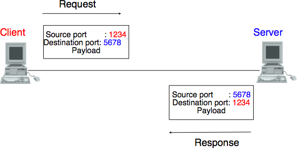
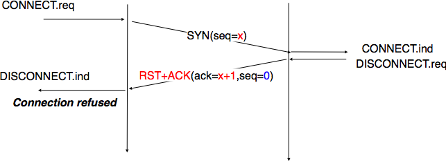
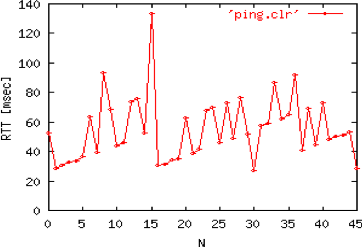
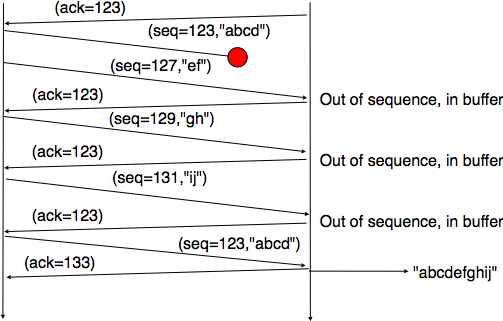

=====================
 The transport layer
=====================

As the transport layer is built on top of the network layer, it is important to know the key features of the network layer service. There are two types of network layer services : connectionless and connection-oriented. The connectionless network layer service is the most widespread. Its main characteristics are :

 - the connectionless network layer service can only transfer SDUs of *limited size* [#fsize]_
 - the connectionless network layer service may discard SDUs
 - the connectionless network layer service may corrupt SDUs
 - the connectionless network layer service may delay, reorder or even duplicate SDUs

.. figure:: png/transport-fig-001-c.png
   :align: center
   :scale: 70 

   The transport layer in the reference model

These imperfections of the connectionless network layer service will be better understood once we have explained the network layer in the next chapter. At this point, let us simply assume that these imperfections occur without trying to understand why they occur.

Some transport protocols can be used on top of a connection-oriented network service, such as class 0 of the ISO Transport Protocol (TP0) defined in [X224]_ , but they have not been widely used. We do not discuss such utilisation of a connection-oriented network service in more details in this book.

This chapter is organised as follows. We first explain how it is possible to provide a reliable transport service on top of an unreliable connectionless network service. For this, we explain the main mechanisms found in such protocols. Then, we study in details the two transport protocols that are used in the Internet. We begin with the User Datagram Protocol (UDP) that provides a simple connectionless transport service. Then, we describe the Transmission Control Protocol (TCP) in details, including its congestion control mechanism.

Principles of a reliable transport protocol
===========================================

In this section, we design a reliable transport protocol running above a connectionless network layer service. For this, we first assume that the network layer provides a perfect service, i.e. :

 - the connectionless network layer service never corrupts SDUs
 - the connectionless network layer service never discards SDUs
 - the connectionless network layer service never delays, reorders nor duplicate SDUs
 - the connectionless network layer service can support SDUs of *any size*

We will remove these assumptions one after the other in order to better understand the mechanisms that are used to solve each imperfection.

Reliable data transfer on top of a perfect network service
----------------------------------------------------------

The transport layer entity interacts with a user in the application layer and also with an entity in the network layer. According to the reference model, these interactions will be performed by using `DATA.req`and DATA.ind` primitives. However, to simplify the presentation and avoid a confusion between a `DATA.req` primitive issued by the user of the transport layer entity and a `DATA.req` issued by the transport layer entity itself, we use the following terminology :

 - the interactions between the user and the transport layer entity are represented by using the classical `DATA.req`, `DATA.ind`, ... primitives
 - the interactions between the transport layer entity and the network layer service are represented by using `send` instead of `DATA.req` and `recvd` instead of `DATA.ind`
 

This is illustrated in the figure below.

.. figure:: png/transport-fig-007-c.png
   :align: center
   :scale: 70 

   Interactions between the transport layer and its user and its network layer provider

When running on top of a perfect connectionless network service, a transport level entity can simply issue a `send(SDU)` upon arrival of `DATA.req(SDU)`. Similarly, the receiver issues a `DATA.ind(SDU)` upon reception of a `recvd(SDU)`. Such a simple protocol is sufficient when a single SDU is sent. 

.. figure:: png/transport-fig-004-c.png
   :align: center
   :scale: 70 

   The simplest transport protocol

Unfortunately, this is not sufficient to always ensure a reliable delivery of the SDUs. Consider the case of a client that sends tens of SDUs to a server. If the server is faster that the client, it will be able to receive and process all the segments sent by the client and deliver their content to its user. However, if the server is slower than the client, problems could arise. The transport entity contains buffers to store that SDUs that have been received as `Data.request` from the application and not yet sent via the network service. If the application is faster than the network layer, the buffer becomes full and the operating system suspends the application to let the transport entity empty its transmission queue. The transport entity also uses a buffer to store the segments received from the network layer that have not yet been processed by the application. If the application is slow to process the data, this buffer becomes full and the transport entity is not able to accept anymore the segments from the network layer. The buffers of the transport entity have a limited size [#fqueuesize]_ and if they overflow, the transport entity is forced to discard received segments. 

To solve this problem, we need to introduce inside our transport protocol, and despite the fact that the network layer provides a perfect service, a feedback mechanism that allows the receiver to inform the sender that it has processed a segment and that another one can be sent. For this, our transport protocol must process two types of segments :

 - data segments carrying a SDU
 - control segments carrying an acknowledgment that indicates that the previous segment was processed correctly

These two types of segments can be distinguished by using a segment composed of two parts :

 - a `header` that contains one bit set to `0` in data segments and to `1` in control segments
 - the payload containing the SDU supplied by the user application

The transport entity can then be modelled as a finite state machine containing two states for the receiver and two states for the sender. The figure below provides a graphical representation of this state machine with the sender above and the receiver below.

.. figure:: png/transport-fig-008-c.png
   :align: center
   :scale: 70 

   Finite state machine of the simplest transport protocol

The above FSM shows that the sender has to wait for an acknowledgement from the receiver before being able to transmit the next SDU.  The figure below illustrates the exchange of a few segments between two hosts.

.. figure:: png/transport-fig-009-c.png
   :align: center
   :scale: 70 

   Time sequence diagram illustrating the operation simplest transport protocol

Reliable data transfer on top of an imperfect network service
-------------------------------------------------------------

The transport layer must deal with the imperfections of the network layer service. There are three types of imperfections that must be considered by the transport layer :

 #. Segments can be corrupted by transmission errors 
 #. Segments can be lost
 #. Segments can be reordered or duplicated

To deal with these four types of imperfections, transport protocols rely on different types of mechanisms. The first problem are the transmission errors. The segments sent by a transport entity is processed by the network and datalink layers and finally transmitted by the physical layer. All these layers are imperfect. For example, the physical layer may be affected different types of errors :

 - random isolated errors where the value of single bit has been modified changed due to a transmission error.
 - random burst errors where the values of `n` consecutive bits have been changed due to transmission errors
 - random bit creations and random bit removals where bits have been added or removed due to transmission errors

The only solution to protect against transmission errors is to add redundancy to the segments that are sent. `Information Theory` defines two mechanisms that can be used to transmit information over a transmission channel that is affected by random errors. These two mechanisms add redundancy to the information sent to allow the receiver to detect or sometimes even correct transmission errors. A detailed discussion of these mechanisms is outside the scope of this chapter, but it is useful to consider a simple mechanism to understand its operation and its limitations.

`Information theory` defines `coding schemes`. There are different types of coding schemes, but let us focus on coding schemes that operate on binary strings. A coding scheme is a function that maps information encoded as a string of `m` bits into a string of `n` bits. The simplest coding scheme is the even parity coding. This coding scheme takes a `m` bits source string and produces a `m+1` bits coded string where the first `m` bits of the coded string are the bits of the source string and the last bit of the coded string is always chosen such that the coded string always contains an even number of bits set to `1`. For example :

 - `1001` is encoded as `10010`
 - `1101` is encoded as `11011`

This parity scheme has been used in some RAMs and to encode characters sent over a serial line. It is easy to show that this coding scheme allows the receiver to detect a single transmission error, but it cannot correct it. If two or more bits are in error, the receiver may not always be able to detect the error.

Some coding schemes allow the receiver to correct some transmission errors. For example, consider the coding scheme that encodes each source bit as follows :

 - `1` is encoded as `111`
 - `0` is encoded as `000`

This simple coding scheme forces the sender to transmit three bits for each source bit. However, it allows the receiver to correct single bit errors. More advanced coding systems that allow to recover from errors are used in several types of physical layers.

Transport protocols use error detection schemes, but none of the widely used transport protocols relies on error correction schemes. For this, a segment is usually divided in two parts :

 - a `header` that contains the fields used by the transport protocol to ensure a reliable delivery. The header contains a checksum or Cyclical Redundancy Check (CRC) [Williams1993]_ that is used to detect transmission errors
 - a `payload` that contains the user data passed by the application layer.

Some segment header also include a `length` that indicates the total length of the segment or the length of the payload. 

The simplest error detection scheme is the checksum. A checksum is basically an arithmetic sum of all the bytes that compose a segment. There are different types of checksums. For example, an eight bits checksum can be computed as the arithmetic sum of all the bytes of (the header and trailer of) the segment. The checksum is computed by the sender before sending the segment and the receiver verifies the checksum upon reception of each segment. The receiver discards the segments received with an invalid checksum. Checksums can be easily implemented in software, but their error detection capabilities are limited. Cyclical Redundancy Checks (CRC) have better error detection capabilities [SGP98]_, but require more CPU when implemented in software.

.. sidebar:: Checksums, CRCs, ...

   Most of the protocols in the TCP/IP protocol suite rely on the simple Internet checksum to verify that the received segment has not been affected by transmission errors. Despite its popularity and ease of implementation, the Internet checksum is not the only available checksum mechanism. The Cyclical Redundancy Checks (CRC_) are very powerful error detection schemes that are used notably on disks, by many datalink layer protocols and file formats such as zip or png. They can be easily implemented efficiently in hardware and have better error-detection capabilities that Internet checksum [SGP98]_ . However, when the first transport protocols were designed the CRCs were considered to be too CPU-intensive for software implementations and other checksum mechanisms were chosen. The TCP/IP community chose the Internet checksum, the OSI community chose the Fletcher checksum [Sklower89]_ . There are now efficient techniques to quickly compute CRCs in software [Feldmeier95]_ . The SCTP protocol initially chose the Adler-32 checksum but replaced it recently with a CRC (see :rfc:`3309`).

.. CRC, checksum, fletcher, crc-32, Internet checksum
.. real checksum http://citeseerx.ist.psu.edu/viewdoc/summary?doi=10.1.1.55.8520
.. do not invent your own checksum, use existing ones
.. implementations can be optimised by using table lookups
.. crc : http://en.wikipedia.org/wiki/Cyclic_redundancy_check
.. tcp offload engine http://www.10gea.org/tcp-ip-offload-engine-toe.htm
.. stcp used Adler-32 but it now uses CRC :rfc:`3309`

The second imperfection of the network layer is that it may lose segments. As we will see later, the main cause of packet losses in the network layers is the lack of buffers in intermediate routers. Since the receiver sends an acknowledgement segment after having received each segment, the simplest solution to deal with losses is to use a retransmission timer. When the sender sends a segment, it starts a retransmission timer. The value of this retransmission timer should be larger than the `round-trip-time`, i.e. the delay between the transmission of a data segment and the reception of the corresponding acknowledgement. When the retransmission timer expires, the sender assumes that the data segment has been lost and retransmits it. This is illustrated in the figure below.

.. figure:: png/transport-fig-018-c.png
   :align: center
   :scale: 70 

   Using retransmission timers to recover from segment losses

Unfortunately, retransmission timers alone are not sufficient to recover from segment losses. Let us for example consider the situation depicted below where an acknowledgement is lost. In this case, the sender retransmits the data segment that has not been acknowledged. Unfortunately, as illustrated in the figure below, the receiver considers the retransmission as a new segment whose payload must be delivered to its user.

.. figure:: png/transport-fig-019-c.png
   :align: center
   :scale: 70 

   Limitations of retransmission timers 

.. index:: sequence number

To solve this problem, transport protocols associate a `sequence number` to each data segment. This `sequence number` is one of the fields found in the header of the data segments. We use the notation `D(S,...)` to indicate a data segment whose sequence number field is set to `S`. The acknowledgements also contain a sequence number that indicates the data segments that it acknowledges. We use `OKS` to indicate an acknowledgement segment that confirms the reception of `D(S,...)`. The sequence number is encoded as a bit string of fixed length. The simplest transport is the Alternating Bit Protocol (ABP). 

.. index:: Alternating Bit Protocol

The Alternating Bit Protocol uses a single bit to encode the sequence number. It can be implemented by using a simple Finite State Machine. 

.. figure:: png/transport-fig-021-c.png
   :align: center
   :scale: 70 

   Alternating bit protocol : Sender FSM

The initial state of the sender is `Wait for D(0,...)`. In this state, the sender waits for a `Data.request`. The first data segment that it sends uses sequence number `0`. After having sent this segment, the sender waits for an `OK0` acknowledgement. A segment is retransmitted upon expiration of the retransmission timer or if an acknowledgement with an incorrect sequence number has been received.

The receiver first waits for `D(0,...)`. If the segment has a correct `CRC`, it passes the SDU to its user and sends `OK0`. Then, the receiver waits for `D(1,...)`. In this state, it may receive a duplicate `D(0,...)` or a data segment with an invalid CRC. In both cases, it returns an `OK0` segment to allow the sender to recover from the possible loss of the previous `OK0` segment.

.. figure:: png/transport-fig-022-c.png
   :align: center
   :scale: 70 

   Alternating bit protocol : Receiver FSM

The figure below illustrates the operation of the alternating bit protocol.

.. figure:: png/transport-fig-023-c.png
   :align: center
   :scale: 70 

   Operation of the alternating bit protocol
   

.. 
   sidebar:: Random errors versus malicious modifications
   The protocols of the transport layer are designed to recover from the random errors and losses that may occur in the underlying layers. There random errors are caused by 
   see [SPMR09]_ for how to recompute a CRC
   Checksums and CRCs should not be confused with hash functions such as MD5 defined in :rfc:`1321` or `SHA-1 <http://www.itl.nist.gov/fipspubs/fip180-1.htm>`_ .

The Alternating Bit Protocol can recover from the transmission errors and the segment losses. However, it has one important drawback. Consider two hosts that are directly connected by a 50 Kbits/sec satellite link that has a 250 milliseconds propagation delay. If these hosts send 1000 bits segments, then the maximum throughput that can be achieved by the alternating bit protocol is one segment every :math:`20+250+250=520` milliseconds if we ignore the transmission time of the acknowledgement. This is less than 2 Kbits/sec ! 

.. 
  figure:: png/transport-fig-024-c.png
  :align: center
  :scale: 70 
  Performance of the alternating bit protocol

Go-back-n and selective repeat
------------------------------

To overcome the performance limitations of the alternating bit protocol, transport protocols rely on `pipelining`. This technique allows a sender to transmit several consecutive segments without being forced to wait for an acknowledgement after each segment. Each data segment contains a sequence number encoded in a `n` bits field.

.. figure:: png/transport-fig-025-c.png
   :align: center
   :scale: 70 

   Pipelining to improve the performance of transport protocols

`Pipelining` allows the sender to transmit segments faster, but we need to ensure that the receiver does not become overloaded. Otherwise, the segments sent by the sender are not correctly received by the destination. The transport protocols that rely on pipelining allow the sender to transmit `W` unacknowledged segments before being forced to wait for an acknowledgement from the receiving entity. 

This is implemented by using a `sliding window`. The sliding window is the set of consecutive sequence numbers that the sender can use when transmitting segments without being forced to wait for an acknowledgement. The figure below shows a sliding window that contains five segments (`6,7,8,9` and `10`). Two of these sequence numbers (`6` and `7`) have been used to send segments and only three sequence numbers (`8`, `9` and `10`) remain in the sliding window. The sliding window is said to be closed once all sequence numbers contained in the sliding window have been used. 

.. figure:: png/transport-fig-026-c.png
   :align: center
   :scale: 70 

   The sliding window 

The figure below illustrates the operation of the sliding window. The sliding window contains three segments. The sender can thus transmit three segments before being forced to wait for an acknowledgement. The sliding window moves to the higher sequence numbers upon reception of acknowledgements. When the first acknowledgement (`OK0`) is received, it allows the sender to move its sliding window to the right and sequence number `3` becomes available. This sequence number is used later to transmit SDU `d`.

.. figure:: png/transport-fig-027-c.png
   :align: center
   :scale: 70 

   Utilisation of the sliding window 

In practice, as the segment header encodes the sequence number in a `n` bits string, only the sequence numbers between :math:`0` and :math:`2^{n}-1` can be used. This implies that the same sequence number is used for different segments and that the sliding window will wrap. This is illustrated in the figure below assuming that `2` bits are used to encode the sequence number in the segment header. Note that upon reception of `OK1`, the sender slides its window and can reuse sequence number `0`.

.. figure:: png/transport-fig-028-c.png
   :align: center
   :scale: 70 

   Utilisation of the sliding window with modulo arithmetic

.. index:: go-back-n

Unfortunately, segment losses do not disappear because a transport protocol is using a sliding window. To recover from segment losses, a sliding window protocol must define : 

 - a heuristic to detect segment losses 
 - a `retransmission strategy` to retransmit the lost segments.

.. index:: cumulative acknowledgements

The simplest sliding window protocol uses `go-back-n` recovery. Intuitively, `go-back-n` operates as follows. A `go-back-n` receiver is as simple as possible. It only accepts the segments that arrive in-sequence. A `go-back-n` receiver discards any out-of-sequence segment that it receives. When a `go-back-n` receives a data segment, it always returns an acknowledgement that contains the sequence number of the last in-sequence segment that it received. This acknowledgement is said to be `cumulative`. When a `go-back-n` receiver send an acknowledgement for sequence number `x`, it implicitly acknowledges the reception of all segments whose sequence number is earlier than `x`. A key advantage of these cumulative acknowledgements is that it is easy to receove from the loss of an acknowledgement. Consider for example a `go-back-n` receiver that received segments `1`, `2` and `3`. It sent `OK1`, `OK2` and `OK3`. Unfortunately, `OK1` and `OK2` were lost. Thanks to the cumulative acknowledgements, when the receiver receives `OK3`, it knows that all three segments have been correctly received. 

The figure below shows the FSM of a simple `go-back-n` receiver. This receiver uses two variables : `lastack` and `next`. `next` is the next expected sequence number and `lastack` the sequence number of the last data segment that has been acknowledged. The receiver only accepts the segments that are received in sequence. `maxseq` is the number of different sequence numbers (:math:`2^n`).

.. figure:: png/transport-fig-029-c.png
   :align: center
   :scale: 70 

   Go-back-n : receiver

A `go-back-n` sender is also very simple. It uses a sending buffer that can store an entire sliding window of segments [#fsizesliding]_ . The segments are sent with increasing sequence number (modulo `maxseq`). The sender must wait for an acknowledgement once its sending buffer is full. When a `go-back-n` sender receives an acknowledgement, it removes from the sending buffer all the acknowledged segments. It uses a retransmission timer to detect segment losses. A simple `go-back-n` sender maintains one retransmission timer per connection. This timer is started when the first segment is sent. When the `go-back-n sender` receives an acknowledgement, it restarts the retransmission timer only if there are still unacknowledged segments. When the retransmission timer expires, the `go-back-n` sender assumes that all the unacknowledged segments that are stored in its sending buffer have been lost. It thus retransmits all the unacknowledged segments and restarts its retransmission timer.

.. figure:: png/transport-fig-030-c.png
   :align: center
   :scale: 70 

   Go-back-n : sender

The operation of `go-back-n` is illustrated in the figure below. In this figure, note that upon reception of the out-of-sequence segment `D(2,c)`, the receiver returns a cumulative acknowledgements `C(OK,0)` that acknowledges all the segments that were received in sequence. The lost segment is retransmitted upon the expiration of the retransmission timer.

.. figure:: png/transport-fig-032-c.png
   :align: center
   :scale: 70 

   Go-back-n : example

The main advantage of `go-back-n` is that it can be easily implemented. It can provide good performance when few segments are lost. However, when there are many losses, the performance of `go-back-n` drops quickly for two reasons :
 
 - the `go-back-n` receiver does not accept out-of-sequence segments
 - the `go-back-n` sender retransmits all unacknowledged segments once its has detected a loss

.. index:: selective repeat

`Selective repeat` is a better strategy to recover from segment losses. Intuitively, `selective repeat` allows the receiver to accept out-of-sequence segments. Furthermore, when a `selective repeat` sender detects losses, it only retransmits the lost segments and not the segments that have already been correctly received.

A `selective repeat` receiver maintains a sliding window of `W` segments and stores in a buffer the out-of-sequence segments that it receives. The figure below shows a five segment receive window on a receiver that has already received segments `7` and `9`.

.. figure:: png/transport-fig-033-c.png
   :align: center
   :scale: 70 

   The receiving window with selective repeat 

A `selective repeat` receiver discards all segments having an invalid CRC. The receiver maintains (variable `lastack`) the sequence number of the last in-sequence segment that it has received. It always includes the value of `lastack` in the acknowledgements that it sends. Some protocols also allow the `selective repeat` receiver to acknowledge the out-of-sequence that it has received. This can be done for example by placing the list of the sequence numbers of the correctly received out-of-sequence segments in the acknowledgements together with the `lastack` value.

When a `selective repeat` receivers receives a data segment, it first verifies whether the segment is inside its receiving window. If yes, the segment is placed in the receive buffer. Otherwise, it is discarded and an acknowledgement containing `lastack` is sent. Then the receiver removes from the receive buffer all consecutive segments starting at `lastack` (if any). The payloads of these segments are delivered to the user, `lastack` and the receiving window are updated and an acknowledgement that acknowledges the last segment received in sequence is sent.

The `selective repeat` sender maintains a sending buffer that can store up to `W` unacknowledged segments. The segments are sent as long as the sending buffer is not full. Several implementations of a `selective repeat` sender are possible. A simple implementation is to associate a retransmission timer to each segment. The timer is started when the segment is sent and cancelled upon reception of an acknowledgement that covers this segment. When a retransmission timer expires, the corresponding segment is retransmitted and this retransmission timer is restarted. When an acknowledgement is received, all the segments that are covered by this acknowledgement are removed from the sending buffer and the sliding window is updated.

The figure below illustrates the operation of `selective repeat` when segments are lost. In this figure, `C(OK,x)` is used to indicate that all segments, up to and including sequence number `x` have been received correctly.

.. figure:: png/transport-fig-037-c.png
   :align: center
   :scale: 70 

   Selective repeat : example 

.. index:: selective acknowledgements

Pure cumulative acknowledgements work well with the `go-back-n` strategy. However, with only cumulative acknowledgements a `selective repeat` sender cannot easily determine which data segments have been correctly received after a lost data segment. For example, in the figure above, the second `C(OK,0)` does not inform explicitly the sender of the reception of `D(2,c)` and the sender could retransmit this segment although it has already been received. A possible solution to improve the performance of `selective repeat` is to provide additional information about the received segments in the acknowledgements that are returned by the receiver. For example, the receiver could add in the returned acknowledgement the list of the sequence numbers of all segments that have already been received. Such acknowledgements are sometimes called `selective acknowledgements`. This is illustrated in the figure below. 

In the figure above, when the sender receives `C(OK,0,[2])`, it knows that all segments up to and including `D(0,...)` have been correctly received. It also knows that segment `D(2,...)` has been received and can cancel the retransmission timer associated to this segment. However, this segment should not be removed from the sending buffer before the reception of a cumulative acknowledgement (`C(OK,2)` in the figure above) that covers this segment. 

.. sidebar:: Maximum window size with `go-back-n` and `selective repeat`

 A transport protocol that uses `n` bits to encode its sequence number can send up to :math:`2^n` different segments. However, to ensure a reliable delivery of the segments, `go-back-n` and `selective repeat` cannot use a sending window of :math:`2^n` segments.
 Consider first `go-back-n` and assume that a sender sends :math:`2^n` segments. These segments are received in-sequence by the destination, but all the returned acknowledgements are lost. The sender will retransmit all segments and they will all be accepted by the receiver and delivered a second time to the user. It can be easily shown that this problem can be avoided if the maximum size of the sending window is :math:`{2^n}-1` segments.
 A similar problem occurs with `selective repeat`. However, as the receiver accepts out-of-sequence segments, a sending window of :math:`{2^n}-1` segments is not sufficient to ensure a reliable delivery of the segments. It can be easily shown that to avoid this problem, a `selective repeat` sender cannot use a window that is larger than :math:`\frac{2^n}{2}` segments.

`Go-back-n` or `selective repeat` are used by transport protocols to provide a reliable data transfer above an unreliable network layer service. Until now, we have assumed that the size of the sliding window was fixed for the entire lifetime of the connection. In practice a transport layer entity is usually implemented in the operating system and shares memory with other parts of the system. Furthermore, a transport layer entity must support at the same time several (possibly hundreds or thousands) of transport connections. This implies that the memory that can be used to support the sending or the receiving buffer of a transport connection may change during the lifetime of the connection [#fautotune]_ . Thus, a transport protocol must allow the sender and the receiver to adjust their window sizes.

To deal with this issue, transport protocols allow the receiver to advertise the current size of its receiving window in all the acknowledgements that it sends. The receiving window advertised by the receiver bounds the size of the sending buffer used by the sender. In practice, the sender maintains two state variables : `swin`, the size of its sending window (that may be adjuster by the system) and `rwin`, the size of the receiving window advertised by the receiver. At any time, the number of unacknowledged segments cannot be larger than `min(swin,rwin)` [#facklost]_ . The utilisation of dynamic windows is illustrated in the figure below.

.. figure:: png/transport-fig-039-c.png
   :align: center
   :scale: 70 

   Dynamic receiving window

The receiver may adjust its advertised receive window based on its current memory consumption but also to limit the bandwidth used by the sender. In practice, the receive buffer can also shrink because the application is not able to process the received data quickly enough. In this case, the receive buffer may be completely full and the advertised receive window may shrink to `0`. When the sender receives an acknowledgement with a receive window set to `0`, it is blocked until it receives an acknowledgement with a positive receive window. Unfortunately, as shown in the figure below, the loss of this acknowledgement could cause a deadlock as the sender waits for an acknowledgement while the receiver is waiting for a data segment.

.. figure:: png/transport-fig-040-c.png
   :align: center
   :scale: 70 

   Risk of deadlock with dynamic windows

.. index:: persistence timer

To solve this problem, transport protocols rely on a special timer : the `persistence timer`. This timer is started by the sender when it receives an acknowledgement that advertises a `0` window. When the timer expires, the sender retransmits an old segment to force the receiver to send a new acknowledgement.

.. 
 sidebar:: Negative acknowledgements
 difficult, only if ordering is guaranteed

To conclude our description of the basic mechanisms found in transport protocols, we still need to discuss the impact of segments reordering. If two consecutive segments are reordered, the receiver relies on their sequence numbers to reorder them in its receive buffer. Unfortunately, as transport protocols reuse the same sequence number for different segments, if a segment is delayed for a too long time, it might still be accepted by the receiver. This is illustrated in the figure below where segment `D(1,b)` is delayed.

.. figure:: png/transport-fig-041-c.png
   :align: center
   :scale: 70 

   Ambiguities caused by excessive delays

.. index:: maximum segment lifetime (MSL)

To deal with this problem, transport protocols combine two solutions. First, they use 32 bits or more to encode the sequence number in the segment header. This increases the overhead, but also increases the delay between the transmission of two different segments having the same sequence number. Second, transport protocols require the network layer to enforce a `Maximum Segment Lifetime (MSL)`. The network layer must ensure that no packet remains in the network during more than MSL seconds. In the Internet the MSL is assumed [#fmsl]_ to be 2 minutes :rfc:`793`. Note that this limits the maximum bandwidth of a transport protocol. If it uses `n` bits to encode its sequence numbers, then it cannot send more than :math:`2^n` segments every MSL seconds.

.. index:: piggybacking

Transport protocols often need to send data in both directions. To reduce the overhead caused by the acknowledgements, most transport protocols use `piggybacking`. Thanks to this technique, a transport entity can place inside the header of the data segments that it sends the acknowledgements and the receive window that it advertises for the opposite direction of the data flow. The main advantage of piggybacking is that it reduces the overhead as it is not necessary to send a complete segment to carry an acknowledgement. This is illustrated in the figure below where the acknowledgement number is underlined in the data segments. Piggybacking is only used when data flows in both directions. A receiver will generate a pure acknowledgement when it does not send data in the opposite direction as shown in the bottom of the figure.

.. figure:: png/transport-fig-043-c.png
   :align: center
   :scale: 70 

   Piggybacking

.. index:: provision of a byte stream service

The last point to be discussed about the data transfer mechanisms used by transport protocols is the provision of a byte stream service. As indicated in the first chapter, the byte stream service is widely used in the transport layer. The transport protocols that provide a byte stream service associate a sequence number to all the bytes that are sent and place the sequence number of the first byte of the segment in the segment's header. This is illustrated in the figure below. In this example, the sender choose to put two bytes in each of the first three segments. This is due to graphical reasons, a real transport protocol would use larger segments in practice. However, the division of the byte stream in segments combined with the losses and retransmissions explain why the byte stream service does not preserve the SDU boundaries.

.. figure:: png/transport-fig-044-c.png
   :align: center
   :scale: 70 

   Provision of the byte stream service

Connection establishment and release
------------------------------------

The last points to be discussed about the transport protocol are the mechanisms used to establish and release a transport connection. 

We explained in the first chapters the service primitives that are used to establish a connection. The simplest approach to establish a transport connection would be to define two special control segments : `CR` and `CA`. The `CR` segment is sent by the transport entity that wishes to initiate a connection. If the remote entity wishes to accept the connection, it replies by sending a `CA` segment. The transport connection is considered to be established once the `CA` segment has been received and data segments can be sent in both directions.
 
.. figure:: png/transport-fig-045-c.png
   :align: center
   :scale: 70 

   Naive transport connection establishment 

Unfortunately, this scheme is not sufficient for several reasons. First, a transport entity usually needs to maintain several transport connections with remote entities. Sometimes, different users (i.e. processes) running above a given transport entity request the establishment of several transport connections to different users attached to the same remote transport entity. These different transport connections must be clearly separated to ensure that data from one connection is not passed to the other connections. This can be achieved by using a connection identifier that is chosen by the transport entities and placed inside each segment to allow the entity that receives a segment to easily associate it to one established connection. 

Second, as the network layer is imperfect, the `CR` or `CA` segment can be lost, delayed or suffer from transmission errors. To deal with these problems, the control segments must be protected by using a CRC or checksum to detect transmission errors. Furthemore, since the `CA` segment acknowledges the reception of the `CR` segment, the `CR` segment can be protected by using a retransmission timer. 

Unfortunately, this scheme is not sufficient to ensure the reliability of the transport service. Consider for example a short-lived transport connection where a single, but important (e.g. money transfer from a bank account) is sent. Such a short-lived connection starts with a `CR` segment acknowledged by a `CA` segment, then the data segment is sent, acknowledged and the connection terminates. Unfortunately, as the network layer service is unreliable, delays combined to retransmissions may lead to the situation depicted in the figure below where delayed `CR` and data segments from a former connection are accepted by the receiving entity as valid segments and the corresponding data is delivered to the user. Duplicating SDUs is not acceptable, and the transport protocol must solve this problem. 

.. figure:: png/transport-fig-047-c.png
   :align: center
   :scale: 70 

   Duplicate transport connections ?

.. index:: Maximum Segment Lifetime (MSL), transport clock

To avoid these duplicates, transport protocols require the network layer to bound the `Maximum Segment Lifetime (MSL)`. The organisation of the network must guarantee that no segment remains in the network for longer than `MSL` seconds. On today's Internet, `MSL` is expected to be 2 minutes. To avoid duplicate transport connections, transport protocols entities must be able to safely distinguish between a duplicate `CR` segment and a new `CR` segment, without forcing each transport entity to remember all the transport connections that it has established in the past. 

A classical solution to avoid remembering the previous transport connections to detect duplicates is to use a clock inside each transport entity. This `transport clock` has the following characteristics :

 - the `transport clock` is implemented as a `k` bits counter and its clock cycle is such that :math:`2^k \times cycle >> MSL`. Furthermore, the `transport clock` counter is incremented every clock cycle and after each connection establishment. This clock is illustrated in the figure below.
 - the `transport clock` must continue to be incremented even if the transport entity stops or reboots

.. figure:: png/transport-fig-048-c.png
   :align: center
   :scale: 70 

   Transport clock

It should be noted that `transport clocks` do not need and usually are not synchronised to the real-time clock. Precisely synchronising realtime clocks is an interesting problem, but it is outside the scope of this document. See [Mills2006]_ for a detailed discussion on synchronising the realtime clock.

The `transport clock` is combined with an exchange of three segments that is called the `three way handshake` to detect duplicates. This `three way handshake` occurs as follows :

 #. The initiating transport entity sends a `CR` segment. This segment requests the establishment of a transport connection. It contains a connection identifier (not shown in the figure) and a sequence number (`seq=x` in the figure below) whose value is extracted from the `transport clock` . The transmission of the `CR` segment is protected by a retransmission timer.

 #. The remote transport entity processes the `CR` segment and creates state for the connection attempt. At this stage, the remote entity does not yet know whether this is a new connection attempt or a duplicate segment. It returns a `CA` segment that contains an acknowledgement number to confirm the reception of the `CR` segment (`ack=x` in the figure below) and a sequence number (`seq=y` in the figure below) whose value is extracted from its transport clock. At this stage, the connection is not yet established.

 #. The initiating entity receives the `CA` segment. The acknowledgement number of this segment confirms that the remote entity has correctly received the `CA` segment. The transport connection is considered to be established by the initiating entity and the numbering of the data segments starts at sequence number `x`. Before sending data segments, the initiating entity must acknowledge the received `CA` segments by sending another `CA` segment. 

 #. The remote entity considers the transport connection to be established after having received the segment that acknowledges its `CA` segment. The numbering of the data segments sent by the remote entity starts at sequence number `y`.

 The three way handshake is illustrated in the figure below.

.. figure:: png/transport-fig-049-c.png
   :align: center
   :scale: 70 

   Three-way handshake

Thanks to the three way handshake, transport entities avoid duplicate transport connections. This is illustrated by the three scenarios below.

The first scenario is when the remote entity receives an old `CR` segment. It considers this `CR` segment as a connection establishment attempt and replies by sending a `CA` segment. However, the initiating host cannot match the received `CA` segment with a previous connection attempt. It sends a control segment (`REJECT` in the figure below) to cancel the spurious connection attempt. The remote entity cancels the connection attempt upon reception of this control segment. 

.. figure:: png/transport-fig-050-c.png
   :align: center
   :scale: 70 

   Three-way handshake : recovery from a duplicate `CR`

A second scenario is when the initiating entity sends a `CR` segment that does not reach the remote entity and receives a duplicate `CA` segment from a previous connection attempt. This duplicate `CA` segment cannot contain a valid acknowledgement for the `CR` segment as the sequence number of the `CR` segment was extracted from the transport clock of the initiating entity. The `CA` segment is thus rejected and the `CR` segment is retransmitted upon expiration of the retransmission timer.

.. figure:: png/transport-fig-051-c.png
   :align: center
   :scale: 70 

   Three-way handshake : recovery from a duplicate `CA`

The last scenario is less likely, but it it important to consider it as well. The remote entity receives and old `CR` segment. It notes the connection attempt and acknowledges it by sending a `CA` segment. The initiating entity does not have a matching connection attempt and replies by sending a `REJECT`. Unfortunately, this segment never reaches the remote entity. Instead, the remote entity receives a retransmission of an older `CA` segment that contains the same sequence number as the first `CR` segment. This `CA` segment cannot be accepted by the remote entity as a confirmation of the transport connection as its acknowledgement number cannot have the same value as the sequence number of the first `CA` segment. 

.. figure:: png/transport-fig-052-c.png
   :align: center
   :scale: 70 

   Three-way handshake : recovery from duplicates `CR` and `CA`

.. index:: abrupt connection release

When we discussed the connection-oriented service, we mentionned that there are two types of connection releases : `abrupt release` and `graceful release`. 

The first solution to release a transport connection is to define a new control segment (e.g. the `DR` segment) and consider the connection to be released once this segment has been sent or received. This is illustrated in the figure below.

.. figure:: png/transport-fig-053-c.png
   :align: center
   :scale: 70 

   Abrupt connection release

As the entity that sends the `DR` segment cannot know whether the other entity has already sent all its data on the connection, SDUs can be lost during such an `abrupt connection release`. 

.. index:: graceful connection release

The second method to release a transport connection is to release independently the two directions of data transfer. Once a user of the transport service has sent all its SDUs, it performs a `DISCONNECT.req` for its direction of data transfer. The transport entity sends a control segment to request the release of the connection *after* the delivery of all previous SDUs to the remote user. This is usually done by placing in the `DR` the next sequence number and by delivering the `DISCONNECT.ind` only after all previous `DATA.ind`. The remote entity confirms the reception of the `DR` segment and the release of the corresponding direction of data transfer by returning an acknowledgement. This is illustrated in the figure below.

.. figure:: png/transport-fig-054-c.png
   :align: center
   :scale: 70 

   Graceful connection release

.. index:: UDP
.. _UDP:

The User Datagram Protocol
==========================

The User Datagram Protocol (UDP) is defined in :rfc:`768`. It provides an unreliable connectionless transport service on top of the unreliable network layer connectionless service. The main characteristics of the UDP service are :

 - the UDP service cannot deliver SDUs that are larger than 65507 bytes [#fmtuudp]_ 
 - the UDP service does not guarantee the delivery of SDUs (losses and desquencing can occur)
 - the UDP service will not deliver a corrupted SDU to the destination

Compared to the connectionless network layer service, the main advantage of the UDP service is that it allows several applications running on a host to exchange SDUs with several other applications running on remote hosts. Let us consider two hosts, e.g. a client and a server. The network layer service allows the client to send information to the server, but if an application running on the client wants to contact a particular application running on the server, then an additional addressing mechanism is required besides the IP address that identifies a host to differentiate the application running on a host. This additional addressing is provided by the `port numbers`. When a server using UDP is enabled on a host, this server registers a `port number`. This `port number` will be used by the clients to contact the server process via UDP. 

The figure below shows a typical usage of the UDP port numbers. The client process uses port number `1234` while the server process uses port number `5678`. When the client sends a request, it is identified as originating from port number `1234` on the client host and destined to port number `5678` on the server host. When the server process replies to this request, the server's UDP implementation will send the reply as originating from port  `5678` on the server host and destined to port `1234` on the client host.

   Usage of the UDP port numbers

.. index:: UDP segment

UDP uses a single segment format shown below. The UDP header contains four fields :

 - a 16 bits source port
 - a 16 bits destination port
 - a 16 bits length field 
 - a 16 bits checksum

.. figure:: png/transport-fig-055-c.png
   :align: center
   :scale: 70 

   The UDP segment format

As the port numbers are encoded as a 16 bits field, there can be only up to 65535 different server processes that are bound to a different UDP port at the same time on a given server. In practice, this limit is never reached. However, it is worth to notice that most implementations divide the range of allowed UDP port numbers in three different ranges :

 - the privileged port numbers (1 < port < 1024 )
 - the ephemeral port numbers ( officially [#fephemeral]_ 49152 <= port <= 65535 )
 - the registered port numbers (officially 1024 <= port < 49152)

In most Unix variants, only processes having system administrator privileges can be bound to port numbers smaller than `1024`. Well-known servers such as :term:`DNS`, :term:`NTP` or :term:`RPC` use privileged port numbers. When a client needs to use UDP, it usually does not require a specific port number. In this case, the UDP implementation will allocate the first available port number in the ephemeral range. The registered port numbers range should be used by servers. In theory, developers of network servers should register their port number officially through IANA, but few developers do this. 

.. mention inetd and super servers somewhere ?

.. index:: UDP Checksum, Checksum computation

.. sidebar:: Computation of the UDP checksum

 The checksum of the UDP segment is computed over :
 
  - a pseudo header containing the source IP address, the destination IP address and a 32 bits bit field containing the most significant byte set to 0, the second set to 17 and the length of the UDP segment in the lower two bytes
  - the entire UDP segment, including its header
 
 This pseudo-header allows the receiver to detect errors that affect the IP source or destination addresses that are placed in the IP layer below. This is a violation of the layering principle that dates from the time when UDP and IP were elements of a single protocol. It should be noted that if the checksum algorithm computes value '0x0000', then value '0xffff' is transmitted. A UDP segment whose checksum is set to '0x0000' is a segment for which the transmitter did not compute a checksum upon transmission. Some :term:`NFS` servers chose to disable UDP checksums for performance reasons, but this caused `problems <http://lynnesblog.telemuse.net/192>`_ that were difficult to diagnose. In practice, there are rarely good reasons to disable UDP checksums. A detailed discussion of the implementation of the Internet checksum may be found in :rfc:`1071`

Several types of applications rely on UDP. As a rule of thumb, UDP is used for applications where delay must be minimised or losses can be recovered by the application itself. A first class of the UDP-based applications are applications where the client sends a short request and expects quickly a short answer. The :term:`DNS` is an example of a UDP application that is often used in the wide area. However, in local area networks, many distributed systems rely on Remote Procedure Call (:term:`RPC`) that is often used on top of UDP. In Unix environments, the Network File System (:term:`NFS`) is built on top of RPC and runs frequently on top of UDP. A second class of UDP-based applications are the interactive computer games that need to exchange frequently small messages such as the player's location or their recent actions. Many of these games use UDP to minimise the delay and can recover from losses. A third class of applications are the multimedia applications such as interactive Voice over IP or interactive Video over IP. These interactive applications expect a delay shorter than about 200 milliseconds between the sender and the receiver and can recover from losses directly inside the application. 

.. index:: TCP
.. _TCP:

The Transmission Control Protocol
=================================

The Transmission Control Protocol (TCP) was initially defined in :rfc:`793`. Several parts of the protocol have been improved since the publication of the original protocol specification [#ftcpspecs]_. However, the basics of the protocol remain and an implementation that only supports :rfc:`793` should interoperate with today's implementation.

TCP provides a reliable bytestream connection-oriented transport service on top of the unreliable connectionless network service provided by :term:`IP`. TCP is used by a large number of applications, including :

 - Email (:term:`SMTP`, :term:`POP`, :term:`IMAP`)
 - World wide web ( :term:`HTTP`, ...)
 - Most file transfer protocols ( :term:`ftp`, peer-to-peer file sharing applications , ...)
 - remote computer access : :term:`telnet`, :term:`ssh`, :term:`X11, VNC, ...
 - non-interactive multimedia applications : flash

On the global Internet, most of the applications used in the wide area rely on TCP. Many studies [#ftcpusage]_ have reported that TCP was responsible for more than 90% of the data exchange`d in the global Internet.

.. index:: TCP header
 
To provide this service, TCP relies on a simple segment format. Each TCP segment contains a header described below and optionally a payload. The default length of the TCP header is twenty bytes, but some TCP headers contain options.

.. figure:: png/transport-fig-058-c.png
   :align: center
   :scale: 70 

   TCP segment format 

A TCP header contains the following fields :

 - Source and destination ports. The source and destination ports play an important role in TCP as they allow to identify the connection to which a TCP segment belongs. When a client opens a TCP connection, it typically selects an ephemeral TCP port number as its source port and contacts the server by using the server's port number. All the segments that are sent by the client on this connection have the same source and destination ports. The server sends segments that contain as source (resp. destination) port the destination (resp. source) port of the segments sent by the client (see figure :ref:`fig-tcpports`). A TCP connection is always identified by five informations :

   - the IP address of the client
   - the IP address of the server
   - the port chosen by the client
   - the port chosen by the server
   - TCP

 - the `sequence number` (32 bits), `acknowledgement number` (32 bits) and `window` (16 bits) fields are used to provide a reliable data transfer by using a window-based protocol. In a TCP bytestream, each byte of the stream consumes one sequence number. Their utilisation will be described in more details in section :ref:`TCPReliable`
 - the `Urgent pointer` is used to indicate that some data should be considered as urgent in a TCP bytestream. However, it is rarely used in practice and will not be described here. Additional details about the utilisation of this pointer may be found in :rfc:`793`, :rfc:`1122` or [StevensTCP]_
 - the flags field contain a set of bit flags that indicate how a segment should be interpreted by the TCP entity receiving it : 

    - the `SYN` flag is used during connection establishment
    - the `FIN` flag is used during connection release
    - the `RST` is used in case of problems or when an invalid segment has been received
    - when the `ACK` flag is set, it indicates that the `acknowledgment` field contains a valid number. Otherwise, the content of the `acknowledgment` field must be ignored by the receiver
    - the `URG` flag is used together with the `Urgent pointer`
    - the `PSH` flag is used as a notification from the sender to indicate to the receiver that it should pass all the data it has received to the receiving process. However, in practice TCP implementations do not allow TCP users to indicate when the `PSH` flag should be set and thus there are few real utilizations of this flag. 

 - the `checksum` field contains the value of the Internet checksum computed over the entire TCP segment and a pseudo-header as with UDP
 - the `Reserved` field was initially reserved for future utilization. It is now used by :rfc:`3168`.
 - the `TCP Header Length` (THL) or `Data Offset` field is a four bits field that indicates the size of the TCP header in 32 bits words. The maximum size of the TCP header is thus 64 bytes.
 - the `Optional header extension` is used to add optional information in the TCP header. Thanks to this header extension, it is possible to add new fields in the TCP header that were not planned in the original specification. This allowed TCP to evolve since the early eighties. The details of the TCP header extension are explained in sections :ref:`TCPOpen` and :ref:`TCPReliable`.
 
.. _fig-tcpports:

.. figure:: png/transport-fig-057-c.png
   :align: center
   :scale: 70 

   Utilization of the TCP source and destination ports

The rest of this section is organised as follows. We first explain the establishment and the release of a TCP connection, then we discuss the mechanisms that are used by TCP to provide a reliable bytestream service. We end the section with a discussion of network congestion and explain the mechanisms that TCP uses to avoid congestion collapse.

.. Urgent pointer not discussed, rarely used, see http://www.ietf.org/id/draft-ietf-tcpm-urgent-data-00.txt for discussion, defined in :rfc:`793` and updated in :rfc:`1122`

.. _TCPOpen:

TCP connection establishment
----------------------------

.. index:: TCP Connection establishment, TCP SYN, TCP SYN+ACK

A TCP connection is established by using a three-way handshake. The connection establishment phase uses the `sequence number`, the `acknowledgment number` and the `SYN` flag. When a TCP connection is established, the two communicating hosts negotiate the initial sequence number used on both directions of the connection. For this, each TCP entity maintains a 32 bits counter that is supposed to be incremented by one at least every 4 microseconds and after each connection establishment [#ftcpclock]_. When a client host wants to open a TCP connection with a server host, it creates a TCP segment with :

 - the `SYN` flag set
 - the `sequence number` set to the current value of the 32 bits counter of the client host's TCP entity

Upon reception of this segment (which is often called a `SYN segment`), the server host replies with a segment containing :

 - the `SYN` flag set
 - the `sequence number` set to the current value of the 32 bits counter of the client host's TCP entity
 - the `ACK` flag set
 - the `acknowledgment number` set to the `sequence number` of the received `SYN` segment incremented by 1 (:math:`~mod~2^{32}`). When a TCP entity sends a segment having `x+1` as acknowledgment number, this indicates that it has received all data up to and including sequence number `x` and that it is expecting data having sequence number `x+1`. As the `SYN` flag was set in a segment having sequence number `x`, this implies that setting the `SYN` flag in a segment consumes one sequence number.

This segment is often called a `SYN+ACK` segment. The acknowledgment confirms to the client that the server has correctly received the `SYN` segment. The `sequence number` of the `SYN+ACK` segment is used by the server host to verify that the `client` has received the segment. Upon reception of the `SYN+ACK` segment, the client host replies with a segment containing :

 - the `ACK` flag set
 - the `acknowledgment number` set to the `sequence number` of the received `SYN+ACK` segment incremented by 1 ( :math:`~mod~2^{32}`)

At this point, the TCP connection is open and both the client and the server are allowed to send TCP segments containing data. This is illustrated in the figure below. 

.. figure:: png/transport-fig-059-c.png
   :align: center
   :scale: 70 

   Establishment of a TCP connection

In the figure above, the connection is considered established by the client once it has received the `SYN+ACK` segment while the server considers the connection to be established upon reception of the `ACK` segment. The first data segment sent by the client (server) has its `sequence number` set to `x+1` (resp. `y+1`). 

.. index:: TCP Initial Sequence Number

.. sidebar:: Computing TCP's initial sequence number

 In the original TCP specification :rfc:`793`, each TCP entity maintained a clock to compute the initial sequence number (:term:`ISN`) placed in the `SYN` and `SYN+ACK` segments. This made the ISN predictable and caused a security issue. The typical security problem was the following. Consider a server that trusts a host based on its IP address and allows the system administrator to login from this host without giving a password [#frlogin]_. Consider now an attacker who knows this particular configuration and is able to send IP packets having the client's address as source. He can send fake TCP segments to the server, but does not receive the server's answers. If he can predict the `ISN` that is chosen by the server, he can send a fake `SYN` segment and shortly after the fake `ACK` segment that confirms the reception of the `SYN+ACK` segment sent by the server. Once the TCP connection is open, he can use it to send any command on the server. To counter this attack, current TCP implementations add randomness to the `ISN`. One of the solutions, proposed in :rfc:`1948` is to compute the `ISN` as ::
 
  ISN = M + H(localhost, localport, remotehost, remoteport, secret).

 where `M` is the current value of the TCP clock and `H` a cryptographic hash function. `localhost` and `remotehost` (resp. `localport` and `remoteport` ) are the IP addresses (port numbers) of the local and remote host and `secret` is a random number only known by the server. This method allows the server to use different ISNs for different clients at the same time. `Measurements <http://lcamtuf.coredump.cx/newtcp/>`_ performed with the first implementations of this technique showed that it was difficult to implement it correctly, but today's TCP implementation now generate good ISNs.

 
.. index:: TCP RST

A server could, of course, refuse to open a TCP connection upon reception of a `SYN` segment. This refusal may be due to various reasons. There may be no server process that is listening on the destination port of the `SYN` segment. The server could always refuse connection establishments from this particular client (e.g. due to security reasons) or the server may not have enough resources to accept a new TCP connection at that time. In this case, the server would reply with a TCP segment having its `RST` flag and containing the `sequence number` of the received `SYN` segment as its `acknowledgment number`. This is illustrated in the figure below. We discuss the other utilizations of the TCP `RST` flag later (see :ref:`TCPRelease`).

   TCP connection establishment rejected by peer

The TCP connection establishment can be described as the four states Finite State Machine shown below. In this FSM, `!X` (resp. `?Y`) indicates the transmission of segment `X` (resp. reception of segment `Y`) during the corresponding transition. `Init` is the initial state. 

.. figure:: png/transport-fig-063-c.png
   :align: center
   :scale: 70 

   TCP FSM for connection establishment

A client host starts in the `Init` state. It then sends a `SYN` segment and enters the `SYN Sent` state where it waits for a `SYN+ACK` segment. Then, it replies with an `ACK` segment and enters the `Established` state where data can be exchanged. On the other hand, a server host starts in the `Init` state. When a server process starts to listen to a destination port, the underlying TCP entity creates a TCP control block and a queue to process incoming `SYN` segments. Upon reception of a `SYN` segment, the server's TCP entity replies with a `SYN+ACK` and enters the `SYN RCVD` state. It remains in this state until it receives an `ACK` segment that acknowledges its `SYN+ACK` segment.

Besides these two paths in the TCP connection establishment FSM, there is a third path that corresponds to the case when both the client and the server send a `SYN` segment to open a TCP connection [#ftcpboth]_. In this case, the client and the server send a `SYN` segment and enter the `SYN Sent` state. Upon reception of the `SYN` segment sent by the other host, they reply by sending a `SYN+ACK` segment and enter the `SYN RCVD` state. The `SYN+ACK` that arrives from the other host allows it to transition to the `Established` state. The figure below illustrates such a simultaneous establishment of a TCP connection.

.. figure:: png/transport-fig-062-c.png
   :align: center
   :scale: 70 

   Simultaneous establishment of a TCP connection

.. index:: SYN cookies, Denial of Service

.. sidebar:: Denial of Service attacks

 When a TCP entity opens a TCP connection, it creates a Transmission Control Block (:term:`TCB`). The TCB contains all the state that is maintained by the TCP entity for each TCP connection. During connection establishment, the TCB contains the local IP address, the remote IP address, the local port number, the remote port number, the current local sequence number, the last sequence number received from the remote entity, ... Until the mid 1990s, TCP implementations had a limit on the number of TCP connections that could be in the `SYN RCVD` state at a given time. Many implementations set this limit to about 100 TCBs. This limit was considered sufficient even for heavily load http servers given the small delay between the reception of a `SYN` segment and the reception of the `ACK` segment that terminates the establishment of the TCP connection. When the limit of 100 TCBs in the `SYN Rcvd` state is reached, the TCP entity discard all received TCP `SYN` segments that do not correspond to an existing TCB. 

 This limit of 100 TCBs in the `SYN Rcvd` state was chosen to protect the TCP entity from the risk of overloading its memory with too many TCBs in the `SYN Rcvd` state. However, it was also the reason for a new type of the Denial of Service (DoS) attack :rfc:`4987`. A DoS attack is defined as an attack where an attacker can render a resource unavailable in the network. For example, an attacker may cause a DoS attack on a 2 Mbps link used by a company by sending more than 2 Mbps of packets through this link. In this case, the DoS attack was more subtle. As a TCP entity discards all received `SYN` segments as soon as it has 100 TCBs in the `SYN Rcvd` state, an attacker simply had to send a few 100s of `SYN` segments every second to a server and never reply to the received `SYN+ACK` segments. To avoid being caught, attackers were of course sending these `SYN` segments with a different address than their own IP address [#fspoofing]_. On most TCP implementations, once a TCB entered the `SYN Rcvd` state, it remained in this state for several seconds, waiting for a retransmission of the initial `SYN` segment. This attack was later called a `SYN flood` attack and the servers of the ISP named panix were among the firsts to `be affected <http://memex.org/meme2-12.html>`_ by this attack.

 To avoid the `SYN flood` attacks, recent TCP implementations do not anymore enter the `SYN Rcvd` state upon reception of a `SYN segment`. Instead, they reply directly with a `SYN+ACK` segment and wait until the reception of a valid `ACK`. This implementation trick is only possible if the TCP implementation is able to verify that the received `ACK` segment acknowedges the `SYN+ACK` segment sent earlier without storing the initial sequence number of this `SYN+ACK` segment in a TCB. The solution to solve this problem, which is known as `SYN cookies <http://cr.yp.to/syncookies.html>`_ is to compute the 32 bits of the `ISN` as follows :

   - the high order bits contain a the low order bits of a counter that is incremented slowly
   - the low order bits contain a hash value computed over the local and remote IP addresses and ports and a random secret only known to the server
   
 The advantage of the `SYN cookies`_ is that by using them, the server does not need to create a :term:`TCB` upon reception of the `SYN` segment and can still check the returned `ACK` segment by recomputing the `SYN cookie`.

.. sidebar:: Retransmitting the first `SYN` segment

   As IP provides an unreliable connectionless service, the `SYN` and `SYN+ACK` segments sent to open a TCP connection could be lost. Current TCP implementations start a retransmission timer when then send the first `SYN` segment. This timer is often set to a three seconds for the first retransmission and then doubles after each retransmission :rfc:`2988`. TCP implementations also enforce a maximum number of retransmissions for the initial `SYN` segment.  

.. index:: TCP Options

As explained earlier, TCP segments may contain an optional header extension. In the `SYN` and `SYN+ACK` segments, these options are used to negotiate some parameters and the utilisation of extensions to the basic TCP specification. 

.. index:: TCP MSS, Maximum Segment Size, MSS

The first parameter which is negotiated during the establishment of a TCP connection is the Maximum Segment Size (:term:`MSS`). The MSS is the size of the largest segment that a TCP entity is able to process. According to :rfc:`879`, all TCP implementations must be able to receive TCP segments containing 536 bytes of payload. However, most TCP implementations are able to process larger segments. Such TCP implementations use the TCP MSS Option in the `SYN`/`SYN+ACK` segment to indicate the largest segment that are able to process. The MSS value indicates the maximum size of the payload of the TCP segments. The client (resp. server) stores in its :term:`TCB` the MSS value announced by the server (resp. the client).

Another utilisation of the TCP options during connection establishment is to enable TCP extensions. For example, consider :rfc:`1323` (that is discussed in :ref:`TCPReliable`). :rfc:`1323` defines TCP extensions to support timestamps and larger windows. If the client supports :rfc:`1323` it adds a :rfc:`1323` option to its `SYN` segment. If the server understands this :rfc:`1323` option and wishes to use it, it replies with an :rfc:`1323` option in the `SYN+ACK` segment and the extension defined in :rfc:`1323` is used throughout the TCP connection. Otherwise, if the server's `SYN+ACK` does not contain the :rfc:`1323` option, the client is not allowed to use this extension and the corresponding TCP header options throughout the TCP connection. TCP's option mechanism is flexible and it allows to extend TCP while maintaining compatibility with older implementations.

The TCP options are encoded by using a Type Length Value format where :

 - the first byte indicates the `type` of the option.
 - the second byte indicates the total length of the option (including the first two bytes) in bytes
 - the last bytes are specific for each type of option

:rfc:`793` defines the Maximum Segment Size (MSS) TCP option that must be understood by all TCP implementations. This option (type 2) has a length of 4 bytes and contains a 16 bits word that indicates the MSS supported by the sender of the `SYN` segment. The MSS option can only be used in TCP segments having the `SYN` flag set.

:rfc:`793` also defines two special options that must be supported by all TCP implementations. The first option is `End of option`. It is encoded as a single byte having value `0x00` and can be used to ensure that the TCP header extension ends on a 32 bits boundary. The `No-Operation` option, encoded as a single byte having value `0x01`, can be used when the TCP header extension contains several TCP options that should be aligned on 32 bits boundaries. All other options [#ftcpoptions]_ are encoded by using the TLV format. 

.. sidebar:: The robustness principle

 The handling of the TCP options by TCP implementations is one of the many applications of the `robustness principle` which is usually attributed to `Jon Postel`_ and is often quoted as `"Be liberal in what you accept, and conservative in what you send"` :rfc:`1122`

 Concerning the TCP options, the robustness principle implies that a TCP implementation should be able to accept TCP options that it does not understand, in particular in received `SYN` segments, and that it should be able to parse any received segment without crashing, even if the segment contains an unknown TCP option. Furthermore, a server should not send in the `SYN+ACK` segment or later, options that have not been proposed by the client in the `SYN` segment.

.. _TCPRelease:

TCP connection release
----------------------

.. index:: TCP connection release

TCP, like most connection-oriented transport protocols, supports two types of connection release :

 - graceful connection release where each TCP user can release its own direction of data transfer
 - abrupt connection release where either one user closes both directions of data transfert or one TCP entity is forced to close the connection (e.g. because the remote host does not reply anymore or due to lack of resources)

.. _TCPReset:

The abrupt connection release mechanism is very simple and relies on a single segment having the `RST` bit set. A TCP segment containing the `RST` bit can be sent for the following reasons :

 - a non-`SYN` segment was received for a non-existing TCP connection :rfc:`793`
 - by extension, some implementations respond with an `RST` segment to a segment that is received on an existing connection but with an invalid header :rfc:`3360`. This causes the corresponding connection to be closed and has caused security attacks :rfc:`4953`
 - by extension, some implementations send an `RST` segment when they need to close an existing TCP connection (e.g. because there are not enough resources to support this connection or because the remote host is considered to be unreachable). Measurements have shown that this usage of TCP `RST` was widespread [AW05]_

When an `RST` segment is sent by a TCP entity, it should contain the current value of the `sequence number` for the connection (or 0 if it does not belong to any existing connection) and the `acknowledgement number` should be set to the next expected in-sequence `sequence number` on this connection.  

.. sidebar:: TCP `RST` wars

 .. index:: Robustness principle
 
 TCP implementers should ensure that two TCP entities never enter in a TCP `RST` war where host `A` is sending a `RST` segment in response to a previous `RST` segment that was sent by host `B` in response to a TCP `RST` segment sent by host `A` ... To avoid such an infinite exchange of `RST` segments that do not carry data, a TCP entity is *never* allowed to send a `RST` segment in response to another `RST` segment. 

The normal way of terminating a TCP connection is by using the graceful TCP connection release. This mechanism uses the `FIN` flag of the TCP header and allows each host to release its own direction of data transfer. As for the `SYN` flag, the utilisation of the `FIN` flag in the TCP header consumes one sequence number. The figure :ref:`fig-tcprelease` shows the part of the TCP FSM that is used when a TCP connection is released. 

.. _fig-tcprelease:

.. figure:: png/transport-fig-067-c.png
   :align: center
   :scale: 70 

   FSM for TCP connection release

Starting from the `Established` state, there are two main paths through this FSM.

The first path is when the host receives a segment with sequence number `x` and the `FIN` flag set. The utilisation of the `FIN` flag indicates that the byte before `sequence number` `x` was the last byte of the byte stream sent by the remote host. Once all data have been delivered to the user, the TCP entity sends an `ACK` segment whose `ack` field is set to :math:`~(x+1)~mod~2^{32}` to acknowledge the `FIN` segment. The `FIN` segment is subject to the same retransmission mechanisms as a normal TCP segment. In particular, its transmission is protected by the retransmission timer. At this point, the TCP connection enters the `CLOSE\_WAIT` state. In this state, the host can still send data to the remote host. Once all its data have been sent, it sends a `FIN` segment and enter the `LAST\_ACK` state. In this state, the TCP entity waits for the acknowledgement of its `FIN` segment. It may still retransmit unacknowledged data segments e.g. if the retransmission timer expires. Upon reception of the acknowledgement for the `FIN` segment, the TCP connection is completely closed and its :term:`TCB` can be discarded. 

The second path is when the host decides first to send a `FIN` segment. In this case, it enters the `FIN_WAIT1` state. It this state, it can retransmit unacknowledged segments but cannot send new data segments. It waits for an acknowledgement of its `FIN` segment, but may receive a `FIN` segment sent by the remote host. In the first case, the TCP connection enters the `FIN\_WAIT2` state. In this state, new data segments from the remote host are still accepted until the reception of the `FIN` segment. The acknowledgement for this `FIN` segment is sent once all data received before the `FIN` segment have been delivered to the user and the connection enters the `TIME\_WAIT` state. In the second case, a `FIN` segment is received and the connection enters the `Closing` state once all data received from the remote host have been delivered to the user. In this state, no new data segments can be sent and the host waits for an acknowledgement of its `FIN` segment before entering the `TIME\_WAIT` state.

The `TIME\_WAIT` state is different from the other states of the TCP FSM. A TCP entity enters this state after having sent the last `ACK` segment on a TCP connection. This segment indicates to the remote host that all the data that it has sent have been correctly received and that it can safely release the TCP connection and discard the corresponding :term:`TCB`. After having sent the last `ACK` segment, a TCP connection enters the `TIME\_WAIT` and remains in this state during :math:`2*MSL` seconds. During this period, the TCB of the connection is maintained. This ensures that the TCP entity that sent the last `ACK` maintains enough state to be able to retransmit this segment if this `ACK` segment is lost and the remote host retransmits its last `FIN` segment or another one. The delay of :math:`2*MSL` seconds ensures that any duplicate segments on the connection would be handled correctly without causing the transmission of a `RST` segment. Without the `TIME\_WAIT` state and the :math:`2*MSL` seconds delay, the connection release would not be graceful when the last `ACK` segment is lost. 

.. sidebar:: TIME\_WAIT on busy TCP servers

 The :math:`2*MSL` seconds delay in the `TIME\_WAIT` state is an important operationnal problem on servers having thousands of simultaneously opened TCP connections [FTY99]_. Consider for example a busy web server that processes 10.000 TCP connections every second. If each of these connections remains in the `TIME\_WAIT` state during 4 minutes, this implies that the server would have to maintain more than 2 millions TCBs at any time. For this reason, some TCP implementations prefer to perform an abrupt connection release by sending a `RST` segment to close the connection [AW05]_ and immediately discard the corresponding :term:`TCB`. However, if the `RST` segment is lost, the remote host continues to maintain a :term:`TCB` for a connection that does not exist anymore. This optimisation reduces the number of TCBs maintained by the host sending the `RST` segment but at the cost of possibly more processing on the remote host when the `RST` segment is lost.

.. tuning timewait http://publib.boulder.ibm.com/infocenter/wasinfo/v7r0/index.jsp?topic=/com.ibm.websphere.edge.doc/cp/admingd45.htm bad idea

.. sidebar TCP RST attacks  Explain TCP reset and the risks of attacks rfc4953

.. _TCPReliable:

TCP reliable data transfer
--------------------------

The original TCP data transfer mechanisms were defined in :rfc:`793`. Based on the experience of using TCP on the growing global Internet, this part of the TCP specification has been updated and improved several times, always while preserving the backward compatibility with older TCP implementations. In this section, we review the main data transfer mechanisms used by TCP. 

TCP is a window-based transport protocol that provides a bi-directionnal byte stream service. This has several implications on the fields of the TCP header and the mechanisms used by TCP. The three fields of the TCP header are :

 - `sequence number`. TCP uses a 32 bits sequence number. The `sequence number` placed in the header of a TCP segment containing data is the sequence number of the first byte of the payload of the TCP segment.
 - `acknowledgement number`. TCP uses cumulative positive acknowledgements. Each TCP segment contains the `sequence number` of the next byte that the sender of the acknowledgement expects to receive from the remote host. In theory, the `acknowledgement number` is only valid if the `ACK` flag of the TCP header is set. In practice almost all [#fackflag]_ TCP segments have their `ACK` flag set.
 - `window`. a TCP receiver uses this 16 bits field to indicate the current size of its receive window expressed in bytes.

.. index:: Transmission Control Block

.. sidebar:: The Transmission Control Block

 For each established TCP connection, a TCP implementation must maintain a Transmission Control Block (:term:`TCB`). A TCB contains all the information required to send and receive segments on this connection :rfc:`793`. This includes [#ftcpurgent]_ :

  - the local IP address
  - the remote IP address
  - the local TCP port number 
  - the remote TCP port number
  - the current state of the TCP FSM 
  - the `maximum segment size` (MSS) 
  - `snd.nxt` : the sequence number of the next byte in the byte stream (the first byte of a new data segment that you send use this sequence number)
  - `snd.una` : the earliest sequence number that has been sent but has not yet been acknowledged
  - `snd.wnd` : the current size of the sending window (in bytes)
  - `rcv.nxt` : the sequence number of the next byte that is expected to be received from the remote host
  - `rcv.wnd` : the current size of the receive window advertised by the remote host
  - `sending buffer` : a buffer used to store all unacknowledged data
  - `receiving buffer` : a buffer to store all data received from the remote host that has not yet been delivered to the user. Data may be stored in the `receiving buffer` because either it was not received in sequence or because the user is too slow to process it  

The original TCP specification can be categorised as a transport protocol that provides a byte stream service and uses `go-back-n`. 

To send new data on an established connection, a TCP entity performs the following operations on the corresponding TCB. It first checks that the `sending buffer` does not contain more data than the receive window advertised by the remote host (`rcv.wnd`). If the window is not full, up to `MSS` bytes of data are placed in the payload of a TCP segment. The `sequence number` of this segment is the sequence number of the first byte of the payload. It is set to the first available sequence number : `snd.nxt` and `snd.nxt` is incremented by the length of the payload of the TCP segment. The `acknowledgement number` of this segment is set to the current value of `rcv.nxt` and the `window` field of the TCP segment is computed based on the current occupancy of the `receiving buffer`. The data is kept in the `sending buffer` in case it needs to be retransmitted later.

When a TCP segment with the `ACK` flag set is received, the following operations are performed. `rcv.wnd` is set to the value of the `window` field of the received segment. The `acknowledgement number` is compared to `snd.una`. The newly acknowledged data is remove from the `sending buffer` and `snd.una` is updated. If the TCP segment contained data, the `sequence number` is compared to `rcv.nxt`. If they are equal, the segment was received in sequence and the data can be delivered to the user and `rcv.nxt` is updated. The contents of the `receiving buffer` is checked to see whether other data already present in this buffer can be delivered in sequence to the user. If so, `rcv.nxt` is updated again. Otherwise, the segment's payload is placed in the `receiving buffer`.

Segment transmission strategies
~~~~~~~~~~~~~~~~~~~~~~~~~~~~~~~

.. index:: Nagle algorithm

In a transport protocol such as TCP that offers a bytestream, a practical issue that was left as an implementation choice in :rfc:`793` is to decide when a new TCP segment containing data must be sent. There are two simple and extreme implementation choices. The first implementation choice is to send a TCP segment as soon as the user has requested the transmission of some data. This allows TCP to provide a low delay service. However, if the user is sending data one byte at a time, TCP woulld place each user byte in a segment containing 20 bytes of TCP header [#fnagleip]_. This is a huge overhead that is not acceptable in wide area networks. A second simple solution would be to only transmit a new TCP segment once the user has produced MSS bytes of data. This solution reduces the overhead, but at the cost of a potentially very high delay. 

An elegant solution to this problem was proposed by John Nagle in :rfc:`896`. John Nagle observed that the overhead caused by the TCP header was a problem in wide area connections, but less in local area connections where the available bandwidth is usually higher. He proposed the following rules to decide to send a new data segment when a new data has been produced by the user or a new ack segment has been received ::

  if rcv.wnd>= MSS and len(data) >= MSS :
    send one MSS-sized segment
  else
    if there are unacknowledged data:
      place data in buffer until acknowledgement has been received
    else
      send one TCP segment containing all buffered data

The first rule ensures that a TCP connection used for bulk data transfer always sends full TCP segments. The second rule sends one partially filled TCP segment every round-trip-time.
 
.. index:: packet size distribution

This algorithm, called the Nagle algorithm, takes a few lines of code in all TCP implementations. These lines of code have a huge impact on the packets that are exchanged in TCP/IP networks. Researchers have analysed the distribution of the packet sizes by capturing and analysing all the packets passing through a given link. These studies have shown several important results :

  - in TCP/IPv4 networks, a large fraction of the packets are TCP segments that contain only an acknowledgement. These packets usually account for 40-50% of the packets passing through the studied link
  - in TCP/IPv4 networks, most of the bytes are exchanged in long packets, usually packets containing up to 1460 bytes of payload which is the default MSS for hosts attached to an Ethernet network, the most popular type of LAN

The figure below provides a distribution of the packet sizes measured on a link. It shows a three-modal distribution of the packet size. 50% of the packets contain pure TCP acknowledgements and occupy 40 bytes. About 20% of the packets contain about 500 bytes [#fmss500]_ of user data and 12% of the packets contain 1460 bytes of user data. However, most of the user data is transported in large packets. This packet size distribution has implications on the design of routers as we discuss in the next chapter.

.. figure:: png/transport-fig-079-c.png
   :align: center
   :scale: 70 

   Packet size distribution in the Internet 

`Recent measurements <http://www.caida.org/research/traffic-analysis/pkt_size_distribution/graphs.xml>`_ indicate that these packet size distributions are still valid in today's Internet, although the packet distribution tends to become bimodal with small packets corresponding to TCP pure acks (40-64 bytes depending on the utilisation of TCP options) and large 1460-bytes packets carrying most of the user data. 

.. index:: large window

TCP windows
~~~~~~~~~~~

From a performance viewpoint, one of the main limitations of the original TCP specification is the 16 bits `window` field in the TCP header. As this field indicates the current size of the receive window in bytes, it limits the TCP receive window at 65535 bytes. This limitation was not a severe problem when TCP was designed since at that time high-speed wide area networks offered a maximum bandwidth of 56 kbps. However, in today's network, this limitation is not acceptable anymore. The table below provides the rough [#faveragebandwidth]_ maximum throughput that can be achieved by a TCP connection with a 64 KBytes window in function of the connection's round-trip-time 

======== ==================  
 RTT     Maximum Throughput  
======== ==================  
1 msec   524 Mbps
10 msec  52.4 Mbps
100 msec 5.24 Mbps
500 msec 1.05 Mbps
======== ==================  

To solve this problem, a backward compatible extension that allows TCP to use larger receive windows was proposed in :rfc:`1323`. Today, most TCP implementations support this option. The basic idea is that instead of storing `snd.wnd` and `rcv.wnd` as 16 bits integers in the :term:`TCB`, they should be stored as 32 bits integers. As the TCP segment header only contains 16 bits to place the window field, it is impossible to copy the value of `snd.wnd` in each sent TCP segment. Instead the header contains `snd.wnd >> S` where `S` is the scaling factor ( :math:`0 \le S \le 14`) negotiated during connection establishment. The client adds its proposed scaling factor as a TCP option in the `SYN` segment. If the server supports :rfc:`1323`, it places in the `SYN+ACK` segment the scaling factor that it uses when advertising its own receive window. The local and remote scaling factors are included in the :term:`TCB`. If the server does not support :rfc:`1323`, it ignores the received option and no scaling is applied. 

By using the window scaling extensions defined in :rfc:`1323`, TCP implementations can use a receive buffer of up to 1 GByte. With such a receive buffer, the maximum throughput that can be achieved by a single TCP connection becomes :

======== ==================  
 RTT     Maximum Throughput  
======== ==================  
1 msec   8590 Gbps
10 msec  859 Gbps
100 msec 86 Gbps
500 msec 17 Gbps
======== ==================  

These throughputs are acceptable in today's networks. However, there are already servers having 10 Gbps interfaces... Early TCP implementations had fixed receiving and sending buffers [#ftcphosts]_. Today's high performance implementations are able to automatically adjust the size of the sending and receiving buffer to better support high bandwidth flows [SMM1998]_

.. index::retransmission timer, round-trip-time, timestamp option

TCP's retransmission timeout
~~~~~~~~~~~~~~~~~~~~~~~~~~~~

In a go-back-n transport protocol such as TCP, the retransmission timeout must be correctly set in order to achieve good performance. If the retransmission timeout expires too early, then bandwith is wasted by retransmitting segments that have been already correctly received. If the retransmission timeout expires too late, then bandwidth is wasted because the sender is idle waiting for the expiration of its retransmission timeout.

A good setting of the retransmission timeout clearly depends on an accurate estimation of the round-trip-time on each TCP connection. The round-trip-time differs between TCP connections, but may also change during the lifetime of a single connection. For example, the figure below shows the evolution of the round-trip-time  between two hosts during a period of 45 seconds.

   Evolution of the round-trip-time between two hosts 

The easiest solution to measure the round-trip-time on a TCP connection is to measure the delay between the transmission of a data segment and the reception of a corresponding acknowledgement [#frttmes]_. As illustrated in the figure below, this measurement works well when there are no segment losses.

.. figure:: png/transport-fig-072-c.png
   :align: center
   :scale: 70 

   How to measure the round-trip-time ? 

However, when a data segment is lost, as illustrated in the bottom part of the figure, the measurement is ambiguous as the sender cannot determine whether the received acknowledgement was triggered by the first transmission of segment `123` or its retransmission. Using incorrect round-trip-time estimations could lead to incorrect values of the retransmission timeout. For this reason, Phil Karn and Craig Partridge proposed in [KP91]_ to ignore the round-trip-time measurements performed during retransmissions.

To avoid this ambiguity in the estimation of the round-trip-time when segments are retransmitted, recent TCP implementations rely on the `timestamp option` defined in :rfc:`1323`. This option allows a TCP sender to place two 32 bits timestamps in each TCP segment that it sends. The first timestamp, TS Value (`TSval`) is chosen by the sender of the segment. It could for example be the current value of its real-time clock [#ftimestamp]_. The second value, TS Echo Reply (`TSecr`), is the last `TSval` that was received from the remote host and stored in the :term:`TCB`. The figure below shows how the utilization of this timestamp option allows the disembiguate the round-trip-time measurement when there are retransmissions.
  
.. figure:: png/transport-fig-073-c.png
   :align: center
   :scale: 70  

   Disembiguating round-trip-time measurements with the :rfc:`1323` timestamp option 

Once the round-trip-time measurements have been collected for a given TCP connection, the TCP entity must compute the retransmission timeout. As the round-trip-time measurements may change during the lifetime of a connection, the retransmission timeout may also change. At the beginning of a connection [#ftcbtouch]_ , the TCP entity that sends a `SYN` segment does not know the round-trip-time to reach the remote host and the initial retransmission timeout is usually set to 3 seconds :rfc:`2988`. 

The original TCP specification proposed in :rfc:`793` to include two additional variables in the TCB : 

 - `srtt` : the smoothed rount-trip-time computed as :math:`srrt=(\alpha \times srtt)+( (1-\alpha) \times rtt)` where `rtt` is the round-trip-time measured according to the above procedure and :math:`\alpha` a smoothing factor (e.g. 0.8 or 0.9)
 - `rto` : the retransmission timeout is computed as :math:`rto=min(60,max(1,\beta \times srtt))` where :math:`\beta` is used to take into account the delay variance (value : 1.3 to 2.0). The `60` and `1` constants are used to ensure that the `rto` is not larger than one minute nor smaller than 1 second.
    
However, in practice, this computation for the retransmission timeout did not work well. The main problem was that the computed `rto` did not correctly take into account the variations in the measured round-trip-time. `Van Jacobson` proposed in his seminal paper [Jacobson1988]_ an improved algorithm to compute the `rto` and implemented it in the BSD Unix distribution. This algorithm is now part of the TCP standard :rfc:`2988`.

Jacobson's algorithm uses two state variables, `srtt` the smoothed `rtt` and `rttvar` the estimation of the variance of the `rtt` and two parameters : :math:`\alpha` and :math:`\beta`. When a TCP connection starts, the first `rto` is set to `3` seconds. When a first estimation of the `rtt` is available, the `srtt`, `rttvar` and `rto` are computed as ::

  srtt=rtt
  rttvar=rtt/2
  rto=srtt+4*rttvar

Then, when other rtt measurements are collected, `srtt` and `rttvar` are updated as follows :

   :math:`rttvar=(1-\beta) \times rttvar + \beta \times |srtt - rtt|`

   :math:`srtt=(1-\alpha) \times srtt + \alpha \times rtt`
 
   :math:`rto=srtt + 4 \times rttvar`

The proposed values for the parameters are :math:`\alpha=\frac{1}{8}` and :math:`\beta=\frac{1}{4}`. This allows a TCP implementation implemented in the kernel to perform the `rtt` computation by using shift operations instead of the more costly floating point operations [Jacobson1988]_. The figure below illustrates the computation of the `rto` upon `rtt` changes.

.. figure:: png/transport-fig-071-c.png
   :align: center
   :scale: 70 

   Example computation of the `rto`

 
Advanced retransmission strategies
~~~~~~~~~~~~~~~~~~~~~~~~~~~~~~~~~~

.. index:: exponential backoff
 
The default go-back-n retransmission strategy was defined in :rfc:`793`. When the retransmission timer expires, TCP retransmits the first unacknowledged segment (i.e. the one having sequence number `snd.una`). After each expiration of the retransmission timeout, :rfc:`2988` recommends to double the value of the retransmission timout. This is called an `exponential backoff`. This doubling of the retransmission timeout after a retransmission was include in TCP to deal with issues including network/receiver overload and incorrect initial estimations of the retransmission timeout. If the same segment is retransmitted several times, the retransmission timeout is doubled after every retransmission until it reaches a configured maximum. :rfc:`2988` suggests a maximum retransmission timeout of at least 60 seconds. Once the retransmission timeout reaches this configured maximum, the remote host is considered to be unreachable and the TCP connection is closed.

.. index:: delayed acknowledgements

This retransmission strategy has been refined based on the experience of using TCP on the Internet. The first refinement was a clarification of the strategy used to send acknowledgements. As TCP uses piggybacking, the easiest and less costly method to send acknowledgements is to place them in the data segments sent in the other direction. However, few application layer protocols exchange data in both directions at the same time and thus this method rarely works. For an application that is sending data segments in one direction only, the remote TCP entity returns empty TCP segments whose only useful information is their acknowledgement number. This may cause a large overhead in wide area network if a pure `ACK` segment is sent in response to each received data segment. Most TCP implementations use a `delayed acknowledgement` strategy. This strategy ensures that piggybacking is used when possible and otherwise pure `ACK` segments are sent for every second received data segments when there are no losses. When there are losses or reordering, `ACK` segments are more important for the sender and they are sent immediately :rfc:`813` :rfc:`1122`. This strategy relies on a new timer with a short delay (e.g. 50 milliseconds) and one additional flag in the TCB. It can be implemented as follows ::

  reception of a data segment:
     if pkt.seq==rcv.nxt:   # segment received in sequence
     	if delayedack : 
	   send pure ack segment
	   cancel acktimer
	   delayedack=False
	else:
	   delayedack=True
	   start acktimer
     else:			# out of sequence segment
     	send pure ack segment
        if delayedack:
	   delayedack=False
	   cancel acktimer 	   			

  transmission of a data segment:  # piggyback ack
     if delayedack:
     	delayedack=False
        cancel acktimer
 
  acktimer expiration:
     send pure ack segment
     delayedack=False

Due to this delayed acknowledgement strategy, during a bulk transfer, a TCP implementation usually acknowledges every second received TCP segment.

The default go-back-n retransmission strategy used by TCP has the advantage of being simple to implement, in particular on the receiver side, but when there are losses, a go-back-n strategy provides a lower performance than a selective repeat strategy. The TCP developpers have designed several extensions to TCP to allow it to use a selective repeat strategy while maintaining backward compatibility with older TCP implementations. These TCP extensions assume that the receiver is able to buffer the segments that it receives out-of-sequence. 

.. index:: TCP fast retransmit

The first extension that was proposed is the fast retransmit heuristics. This extension can be implemented on TCP senders and thus not require any change to the protocol. It only assumes that the TCP receiver is able to buffer out-of-sequence segments. 

From a performance viewpoint, one issue with the TCP's `retransmission timeout` is that when there are isolated segment losses, the TCP sender often remains idle waiting for the expiration of its retransmission timeouts. Such isolated losses are frequent in the global Internet [Paxson99]_.  A heuristic to deal with isolated losses without waiting for the expiration of the retransmission timeout has been included in many TCP implementations since the early 1990s. To understand this heuristic, let us consider the figure below that shows the segments exchanged over a TCP connection when an isolated segment is lost.

.. figure:: png/transport-fig-074-c.png 
   :align: center
   :scale: 70 

   Detecting isolated segment losses

As shown above, when an isolated segment is lost the sender receives several `duplicate acknowledgements` since the TCP receiver immediately sends a pure acknowledgement when it receives an out-of-sequence segment. A duplicate acknowledgement is an acknowledgement that contains the same `acknowledgement number` as a previous segment. A single duplicate acknowledgement does not necessarily imply that a segment was lost as a simple reordering of the segments may cause duplicate acknowledgements as well. Measurements  [Paxson99]_ have shown that segment reordering is frequent in the Internet. Based on these observations, the `fast retransmit` heuristics has been included in most TCP implementations. It can be implemented as follows ::

   ack arrival:
       if tcp.ack==snd.una:    # duplicate acknowledgement
       	  dupacks++
	  if dupacks==3:
	     retransmit segment(snd.una)
       else:
	  dupacks=0
	  # process acknowledgement

This heuristic requires an additional variable in the TCB (`dupacks`). Most implementations set the default number of duplicate acknowledgements that trigger a retransmission to 3. It is now part of the standard TCP specification :rfc:`2581`. The `fast retransmit` heuristics improves the TCP performance provided that isolated segments are lost and the current window is large enough to allow the sender to send three duplicate acknowledgements

The figure below illustrates the operation of the `fast retransmit` heuristic.

   TCP fast retransmit heuristics

.. index:: TCP selective acknowledgements, TCP SACK

When losses are not isolated or when the windows are small, the performance of the `fast retransmit` heuristics decreases. In such environments, it is necessary to allow a TCP sender to use a selective repeat strategy instead of the default go-back-n strategy. Implementing selective-repeat requires a change to the TCP protocol as the receiver needs to be able to inform the sender of the out-of-order segments that it has already received. This can be done by using the Selective Acknowledgements (SACK) option defined in :rfc:`2018`. This TCP option is negotiated during the establishment of a TCP connection. If both TCP hosts support the option, SACK blocks can be attached by the receiver to the segments that it sends. SACK blocks allow a TCP receiver to indicate the blocks of data that it has received correctly but out of sequence. The figure below illustrates the utilisation of the SACK blocks.

.. figure:: png/transport-fig-076-c.png 
   :align: center
   :scale: 70 

   TCP selective acknowledgements

A SACK option contains one or more blocks. A block corresponds to all the sequence numbers between the `left edge` and the `right edge` of the block. The two edges of the block are encoded as 32 bits numbers (the same size as the TCP sequence number) in a SACK option. As the SACK option contains one byte to encode its type and one byte for its length, a SACK option containing `b` blocks is encoded as a sequence of :math:`2+8 \times b` bytes. In practice, the size of the SACK option can be problematic as the optional TCP header extension cannot be longer than 44 bytes. As the SACK option is usually combined with the :rfc:`1323` timestamp extension, this implies that a TCP segment cannot usually contain more than three SACK blocks. This limitation implies that a TCP receiver cannot always place in the SACK option that it sends information about all the received blocks.

To deal with the limited size of the SACK option, a TCP receiver that has currently more than 3 blocks inside its receiving buffer must select the blocks that it places in the SACK option. A good heuristic is to put in the SACK option the blocks that have changed the most recently as the sender is likely already aware of the older blocks. 

When a sender receives a SACK option that indicates a new block and thus a new possible segment loss, it usually does not retransmit the missing segment(s) immediately. To deal with reordering, a TCP sender can use a heuristic similar to `fast retransmit` by retransmitting a gap only once it has received three SACK options indicating this gap. It should be noted that the SACK option does not supersede the `acknowledgement number` of the TCP header. A TCP sender can only remove data from its sending buffer once they have been acknowledged by TCP's cumulative acknowledgements. This design was chosen for two reasons. First, it allows the receiver to discard parts of its receiving buffer when it is running out of memory without loosing data. Second, as the SACK option is not transmitted reliably, the cumulative acknowledgements are still required to deal with losses of `ACK` segments carrying only SACK information. Thus, the SACK option only serves as a hint to allow the sender to optimise its retransmissions.

.. oldsidebar:: Protection agains wrapped sequence numbers
  
.. todo

.. Many researchers have worked on techniques to improve the data transfer mechanisms used by TCP. 

.. _TCPCongestion:

TCP congestion control
----------------------

In the previous sections, we have explained the mechanisms that TCP uses to deal with transmission errors and segment losses. In an heterogeneous network such as the Internet or enterprise IP networks, endsystems have very different performances. Some endsystems are highend servers attached to 10 Gbps links while others are mobile devices attached to a very low bandwidth wireless link. Despite of this huge difference in terms of performance, the mobile device should be able to efficiently exchange segments with the highend server.

.. index:: TCP self clocking

To better understand this problem, let us consider the scenario shown in the figure below where a server (`A`) attached to a `10 Mbps` link is sending TCP segments to a laptop (`C`) attached to a `2 Mbps` link.

.. figure:: png/transport-fig-090-c.png 
   :align: center
   :scale: 70 

   TCP over heterogenous links 

In this network, the TCP segments sent by the server reach router `R1`. `R1` forward the segments towards router `R2`. Router `R2` can potentially receive segments at `10 Mbps`, but it can only forward them at `2 Mbps` to host `C`.  Router `R2` contains buffers that allow it to store the packets that cannot be immediately forwarded to their destination. To understand the operation of TCP in this environment, let us consider a simplified model of this network where host `A` is attached to a `10 Mbps` link to a queue that represents the buffers of router `R2`. This queue is emptied at a rate of `2 Mbps`.

.. figure:: png/transport-fig-082-c.png 
   :align: center
   :scale: 70 

   TCP self clocking

Let us consider that host `A` uses a window of three segments. It thus sends three back-to-back segments at `10 Mbps` and then waits for an acknowledgement. Host `A` stops sending segments when its window is full. These segments reach the buffers of router `R2`. The first segment stored in this buffer is sent by router `R2` at a rate of `2 Mbps` to the destination host. Upon reception of this segment, the destination sends an acknowledgement. This acknowledgement allows host `A` to transmit a new segment. This segment is stored in the buffers of router `R2` while it is transmitting the second segment that was sent by host `A`... Thus, after the transmission of the first window of segments, TCP sends one data segment after the reception of each acknowledgement returned by the destination [#fdelack]_ . In practice, the acknowledgements sent by the destination serve as a kind of `clock` that allows the sending host to adapt its transmission rate to the rate at which segments are received by the destination. This `TCP self-clocking` is the first mechanism that allows TCP to adapt to heterogeneous networks [Jacobson1988]_. It depends on the availability of buffers to store the segments that have been sent by the sender but have not yet been transmitted to the destination.

However, TCP is not always used in this environement. In the global Internet, TCP is used in networks where a large number of hosts send segments to a large number of receivers. For example, let us consider the network depicted below that is similar to the one discussed in [Jacobson1988]_ and :rfc:`896`. In this network, we assume that the buffers of the router are infinite to ensure that no packet is lost.

.. index:: congestion collapse

.. figure:: png/transport-fig-083-c.png 
   :align: center
   :scale: 70 

   The congestion collapse problem

If many TCP senders are attached to the left part of the network above, they all send a window full of segments. These segments are stored in the buffers of the router before being transmitted towards their destination. If there are many senders on the left part of the network, the occupancy of the buffers quickly grows. A consequence of the buffer occupancy is that the round-trip-time, measured by TCP, between the sender and the receiver increases. Consider a network where 10.000 bits segments are sent. When the buffer is empty, such a segment requires 1 millisecond to be transmitted on the `10 Mbps` link and 5 milliseconds to be the transmitted on the `2 Mbps` link. Thus, the round-trip-time measured by TCP is roughly 6 milliseconds if we ignore the propagation delay on the links. Most routers manage their buffers as a FIFO queue [#ffifo]_. If the buffer contains 100 segments, the round-trip-time becomes :math:`1+100 \times 5+ 5` milliseconds as a new segment are only transmitted on the `2 Mbps` link once all previous segments have been transmitted. Unfortunately, TCP uses a retransmission timer and performs `go-back-n` to recover from tranmission errors. If the buffer occupancy is high, TCP assumes that some segments have been lost and retransmits a full window of segments. This increases the occupancy of the buffer and the delay through the buffer... Furthermore, the buffer may store and send on the low bandwidth links several retransmissions of the same segment. This problem is called `congestion collapse`. It occured several times in the late 1980s. For example, [Jacobson1988]_ notes that in 1986, the useable bandwidth of a 32 Kbits link dropped to 40 bits per second due to congestion collapse [#foldtcp]_ !

The `congestion collapse` is a problem that faces all heterogenous networks. Different mechanisms have been proposed in the scientific literature to avoid or control network congestion. Some of them have been implemented and deployed in real networks. To understand this problem in more details, let us first consider a simple network with two hosts attached to a high bandwidth link that are sending segments to destination `C` attached to a low bandwidth link as depicted below.

.. figure:: png/transport-fig-080-c.png 
   :align: center
   :scale: 70 

   The congestion problem

To avoid `congestion collapse`, the hosts must regulate their transmission rate [#fcredit]_ by using a `congestion control` mechanism. Such a mechanism can be implemented in the transport layer or in the network layer. In TCP/IP networks, it is implemented in the transport layer, but other technologies such as `Asynchronous Transfert Mode (ATM)` or `Frame Relay` include congestion control mechanisms in lower layers.

.. index:: Fairness, max-min fairness

Let us first consider the simple problem of a set of :math:`i` hosts that share a single bottleneck link as shown in the example above. In this network, the congestion control scheme must achieve the following objectives [CJ1989]_ :

 #. The congestion control scheme must `avoid congestion`. in practice, this means that the bottleneck link cannot be overloaded. If :math:`r_i(t)` is the transmission rate allocated to host :math:`i` at time :math:`t` and :math:`R` the bandwidth of the bottleneck link, then the congestion control scheme should ensure that, on average, :math:`\forall{t} \sum{r_i(t)} \le R`. 
 #. The congestion control scheme must be `efficient`. The bottleneck link is usually both a shared and an expensive resource. Usually, bottleneck links are wide area links that are much more expensive to upgrade than the local area networks. The congestion control scheme should ensure that such links are efficiently used. Mathematically, the control scheme should ensure that :math:`\forall{t} \sum{r_i(t)} \approx R`.
 #. The congestion control scheme should be `fair`. Most congestion schemes aim at achieving `max-min fairness`. An allocation of transmission rates to sources is said to be `max-min fair` if :
  - no link in the network is congested 
  - the rate allocated to source :math:`j` cannot be increased without decreasing the rate allocated to a source :math:`i` whose allocation is smaller than the rate allocated to source :math:`j` [Leboudec2008]_. 
 Depending on the network, a `max-min fair allocation` may not always exist. In practice, `max-min fairness` is an ideal objective that cannot necessarily be achieved. When there is a single blottlneck link as in the example above, `max-min fairness` implies that each source should be allocated the same transmission rate.

To visualise the different rate allocations, it is useful to consider the graph shown below. In this graph, we plot on the `x-axis` (resp. `y-axis`) the rate allocated to host `B` (resp. `A`). A point in the graph :math:`(r_B,r_A)` Corresponds to a possible allocation of the transmission rates. Since there is a `2 Mbps` bottleneck link in this network, the graph can be divided in two regions. The  lower left part of the graph contains all allocations :math:`(r_B,r_A)` that are such that the bottleneck link is not congested (:math:`r_A+r_B<2`). The right border of this region is the `efficiency line`, i.e. the set of allocations that completely utilise the bottleneck link (:math:`r_A+r_B=2`). Finally, the `fairness line` is the set of fair allocations. 

.. figure:: png/transport-fig-092-c.png 
   :align: center
   :scale: 70 

   Possible allocated transmission rates

As shown in the graph above, a rate allocation may be fair but not efficient (e.g. :math:`r_A=0.7,r_B=0.7`), fair and efficient ( e.g. :math:`r_A=1,r_B=1`) or efficient but not fair (e.g. :math:`r_A=1.5,r_B=0.5`). Ideally, the allocation should be both fair and efficient. Unfortunately, maintaining such an allocation with fluctuations in the number of flows that use the network is a challenging problem. Furthermore, might be several thousands of TCP connections or more that pass through the same link [#fflowslink]_.

To deal with these fluctuations in the demand that result in fluctuations in the available bandwidth, computer networks use a congestion control scheme. This congestion control scheme should achieve the three objectives listed above. Some congestion control schemes rely on a close cooperation between the endhosts and the routers while others are mainly implemented on the endhosts with limited support from the routers. 

A congestion control scheme can be modelled as an algorithm that adapts the transmission rate (:math:`r_i(t)`) of host :math:`i` based on the feedback received from the network. Different types of feedbacks are possible. The simplest scheme is a binary feedback [CJ1989]_  [Jacobson1988]_ where the hosts simply learn whether the network is congested or not. Some congestion control schemes allow the network to regularly send an allocated transmission rate in Mbps to each host [BF1995]_. 

.. index:: Additive Increase Multiplicative Decrease (AIMD)

Let us focus on the binary feedback scheme which is today the most widely used. Intuitively, the congestion control scheme should decrease the transmission rate of a host when congestion has been detected in the network to avoid congestion collapse. Furthermore, the hosts should increase their transmission rate when the network is not congested. Otherwise, the hosts would not be able to efficiently utilise the network. The rate allocated to each host fluctuates with time depending on the feedback received from the network. The figure below illustrates the evolution of the transmission rates allocated to two hosts in our simple network. Initially, two hosts have a low allocation, but this is not efficient. The allocations increase until the network becomes congested. At this point, the hosts decrease their transmission rate to avoid congestion collapse. If the congestion control scheme works well, after some time the allocations should become both fair and efficient.

.. figure:: png/transport-fig-093-c.png 
   :align: center
   :scale: 70 

   Evolution of the transmission rates 

Various types of rate adaption algorithms are possible. `Dah Ming Chiu`_ and `Raj Jain`_ have analysed in [CJ1989]_ different types of algorithms that can be used by a source to adapt its transmission rate to the feedback received from the network. Intuitively, such a rate adaptation algorithm increases the transmission rate when the network is not congested (ensure that the network is efficiently used) and decrease the transmission rate when the network is congested (to avoid congestion collapse).

The simplest form of feedback that the network can send to a source is a binary feedback (the network is congested or not congested). In this case, a `linear` rate adaptation algorithm can be expressed as :

 - :math:`rate(t+1)=\alpha_C + \beta_C rate(t)` when the network is congested
 - :math:`rate(t+1)=\alpha_N + \beta_N rate(t)` when the network is *not* congested

With a linear adaption algorithm, :math:`\alpha_C,\alpha_N, \beta_C` and :math:`\beta_N` are constants. 
The analysis of [CJ1989]_ shows that to be fair and efficient, such a binary rate adaption mechanism must rely on `Additive Increase and Multiplicative Decrease`. When the network is not congested, the hosts should slowy increase their transmission rate (:math:`\beta_N=1~and~\alpha_N>0`). When the network is congested, the hosts must multiplicatively decrease their transmission rate (:math:`\beta_C < 1~and~\alpha_C = 0`). Such an AIMD rate adapation algorithm can be implemented by the pseudocode below ::

 # Additive Increse Multiplicative Decrease	
 if congestion :
    rate=rate*betaC    # multiplicative decrease, betaC<1
 else
    rate=rate+alphaN    # additive increase, v0>0

.. sidebar:: Which binary feedback ?

 Two types of binary feedback are possible in computer networks. A first solution is to rely on implicit feedback. This is the solution chosen for TCP. TCP's congestion control scheme [Jacobson1988]_ does not require any cooperation from the router. It only assumes that they use buffers and that they discard packets when there is congestion. TCP uses the segment losses as an indication of congestion. When there are no losses, the network is assumed to be not congested. This implies that congestion is the main cause of packet losses. This is true in wired networks, but unfortunately not always true in wireless networks. 
 Another solution is to rely on explicit feedback. This is the solution proposed in the DECBit congestion control scheme [RJ1995]_ and used in Frame Relay and ATM networks. This explicit feedback can be implemented in two ways. A first solution would be to define a special message that could be sent by routers to hosts when they are congested. Unfortunately, generating such messages may increase the amount of congestion in the network. Such a congestion indication packet is thus discouraged :rfc:`1812`. A better approach is to allow the intermediate routers to indicate, in the packets that they forward, their current congestion status. A binary feedback can be encoded by using one bit in the packet header. With such a scheme, congested routers set a special bit in the packets that they forward while non-congested routers leave this bit unmodified. The destination host returns the congestion status of the network in the acknowledgements that it sends. Details about such a solution in IP networks may be found in :rfc:`3168`. Unfortunately, as of this writing, this solution is still not deployed despite its potential benefits.

.. todo provide illustrations with simulations

The TCP congestion control scheme was initially proposed by `Van Jacobson`_ in [Jacobson1988]_. The current specification may be found in :rfc:`5681`. TCP relies on `Additive Increase and Multiplicative Decrease (AIMD)`. To implement :term:`AIMD`, a TCP host must to control its transmission rate. A first approach would be to use timers and adjust their expiration times in function of the rate imposed by :term:`AIMD`. Unfortunately, maintaining such timers for a large number of TCP connections can be difficult. Instead, `Van Jacobson`_ noted that the rate of a TCP congestion can be artificially controlled by constraining its sending window. A TCP connection cannot send data faster than :math:`\frac{window}{rtt}` where :math:`window` is the maximum between the host's sending window and the window advertised by the receiver.

TCP's congestion control scheme is based on a `congestion window`. The current value of the congestion window (`cwnd`) is stored in the TCB of each TCP connection and the window that can be used by the sender is constrained by :math:`min(cwnd,rwin,swin)` where :math:`swin` is the current sending window and :math:`rwin` the last received receive window. The `Additive Increase` part of the TCP congestion control increments the congestion window by :term:`MSS` bytes every round-trip-time. In the TCP literature, this phase is often called the `congestion avoidance` phase. The `Multiplicative Decrease` part of the TCP congestion control divides the current value of the congestion window once congestion has been detected.

When a TCP connection begins, the sending host does not know whether the part of the network that it uses to reach the destination is congested or not. To avoid causing too much congestion, it must start with a small congestion window. [Jacobson1988]_ recommends an initial window of MSS bytes. As the additive increase part of the TCP congestion control scheme increments the congestion window by MSS bytes every round-trip-time, the TCP connection may have to wait many round-trip-times before being able to efficiently use the available bandwidth. This is especially important in environments where the :math:`bandwidth \times rtt` product is high. To avoid waiting too many round-trip-times before reaching a congestion window that is large enough to efficiently utilise the network, the TCP congestion control scheme includes the `slow-start` algorithm. The objective of the TCP `slow-start` is to quickly reach an acceptable value for the `cwnd`. During `slow-start`, the congestion window is doubled every round-trip-time. The `slow-start` algorithm uses an additional variable in the TCB : `sshtresh` (`slow-start threshold`). The `ssthresh` is an estimation of the last value of the `cwnd` that did not cause congestion. It is initialised at the sending window and is updated after each congestion event. 

In practice, a TCP implementation considers the network to be congested once its needs to retransmit a segment. The TCP congestion control scheme distinguishes between two types of congestion :

 - `mild congestion`. TCP considers that the network is lightly congested if it receives three duplicate acknowledgements and performs a fast retransmit. If the fast retransmit is successful, this implies that only one segment has been lost. In this case, TCP performs multiplicative decrease and the congestion window is divided by `2`. The slow-start theshold is set to the new value of the congestion window.
 - `severe congestion`. TCP considers that the network is severely congested when its retransmission timer expires. In this case, TCP retransmits the first segment, sets the slow-start threshold to 50% of the congestion window. The congestion window is reset to its initial value and TCP performs a slow-start.

The figure below illustrates the evolution of the congestion window when there is severe congestion. At the beginning of the connection, the sender performs `slow-start` until the first segments are lost and the retransmission timer expires. At this time, the `ssthresh` is set to half of the current congestion window and the congestion window is reset at one segment. The lost segments are retransmitted at the sender performs again slow-start until the congestion window reaches the `sshtresh`. Then, it switches to congestion avoidance and the congestion window increases linearily until segments are lost and the retransmission timer expires ...

.. figure:: png/transport-fig-088-c.png 
   :align: center
   :scale: 70 

   Evaluation of the TCP congestion window with severe congestion

The figure below illustrates the evolution of the congestion window when the network is lightly congested and all lost segments can be retransmitted by using fast retransmit. The sender begins with a slow-start. A segment is lost but successfully retransmitted by a fast retransmit. The congestion window is divided by 2 and the senders immediately enters congestion avoidance as this was a mild congestion.

.. figure:: png/transport-fig-094-c.png 
   :align: center
   :scale: 70 

   Evaluation of the TCP congestion window when the network is lightly congested

Most TCP implementations update the congestion window when they receive an acknowledgement. If we assume that the receiver acknowledges each received segment and the the sender only sends MSS sized segments, the TCP congestion control scheme can be implemented by using the simplified pseudocode [#fwrap]_ below ::

 # Initialisation 
 cwnd = MSS;
 ssthresh= swin;
    
 # Ack arrival 
 if tcp.ack > snd.una :  # new ack, no congestion
    if  cwnd < ssthresh :
      # slow-start : increase quickly cwnd
      # double cwnd  every rtt
      cwnd = cwnd + MSS
    else:
      # congestion avoidance : increase slowly cwnd
      # increase cwnd by one mss every rtt
      cwnd = cwnd+ mss*(mss/cwnd)
 else: # duplicate or old ack
    if tcp.ack==snd.una:    # duplicate acknowledgement
      dupacks++
      if dupacks==3:
	retransmitsegment(snd.una)
	ssthresh=max(cwnd/2,2*MSS)
	cwnd=ssthresh   
      else:
	dupacks=0
	# ack for old segment, ignored
  
 Expiration of the retransmission timer:
  send(snd.una)     # retransmit first lost segment
  sshtresh=max(cwnd/2,2*MSS)
  cwnd=MSS
  
 
Furthermore when a TCP connection has been idle for more than its current retransmission timer, it should reset its congestion window to the congestion window size that it uses when the connection begins as it does not know anymore the current congestion state of th e network.

.. sidebar:: Initial congestion window

 The original TCP congestion control mechanism proposed in [Jacobson1988]_ recommended that each TCP connection begins by setting :math:`cwnd=MSS`. However, in today's higher bandwidth networks, using such a small initial congestion window severely affects the performance for short TCP connections, such as those used by web servers. Since the publication of :rfc:`3390`, TCP hosts are allowed to use an initial congestion window of about 4 KBytes, which corresponds to 3 segments in many environments. 

.. todo example

Thanks to its congestion control scheme, TCP adapts its transmission rate to the losses that occur in the network. Intuitively, the TCP transmission rate decreases when the percentage of losses increases. Researchers have proposed detailed models that allow to predict the throughput of a TCP connection when losses occur [MSMO1997]_ . To have some intuition about the factors that affect the performance of TCP, let us consider a very simple model. Its assumptions are not completely realistics, but it gives us a good intuition without requiring complex mathematics.

This model considers an hypothetical TCP connection that suffers from equally spaced segment losses. If :math:`p` is the segment loss ratio, then the TCP connection successfully transfers :math:`\frac{1}{p}-1` segments and the next segment is lost. If we ignore the slow-start at the beginning of the connection, TCP in this environment is always in congestion avoidance as there are only isolated losses that can be recovered by using fast retransmit. The evolution of the congestion window is thus as shown in the figure below. Note the that `x-axis` of this figure represents time measured in units of one round-trip-time, which is supposed to be constant in the model, and the `y-axis` represents the size of the congestion window measured in MSS-sized segments.

.. figure:: png/transport-fig-089-c.png 
   :align: center
   :scale: 70 

   Evolution of the congestion window with regular losses

As the losses are equally spaced, the congestion window always starts at some value (:math:`\frac{W}{2}`), be incremented by one MSS every round-trip-time until it reaches twice this value (`W`). At this point, a segment is retransmitted and the cycle starts again. If the congestion window is measured in MSS-sized segments, a cycle lasts :math:`\frac{W}{2}` round-trip-times. The bandwidth of the TCP connection is the number of bytes that have been transmitted during a given period of time. During a cycle, the number of segments that are sent on the TCP connection is equal to the area of the yellow trapeze in the figure. Its area is thus :

 :math:`area=(\frac{W}{2})^2 + \frac{1}{2} \times (\frac{W}{2})^2 = \frac{3 \times W^2}{8}`

However, given the regular losses that we consider, the number of segments that are sent between two losses (i.e. during a cycle) is by definition equal to :math:`\frac{1}{p}`. Thus, :math:`W=\sqrt{\frac{8}{3 \times p}}=\frac{k}{\sqrt{p}}`. The throughput (in bytes per second) of the TCP connection is equal to the number of segments transmitted divided by the duration of the cycle :
 
 :math:`Throughput=\frac{area \times MSS}{time} = \frac{ \frac{3 \times W^2}{8}}{\frac{W}{2} \times rtt}`
 or, after having eliminated `W`, :math:`Throughput=\sqrt{\frac{3}{2}} \times \frac{MSS}{rtt \times \sqrt{p}}`

More detailed models and the analysis of simulations have shown that a first order model of the TCP throughput when losses occur was :math:`Throughput \approx \frac{k \times MSS}{rtt \times \sqrt{p}}`. This is an important result that shows that :

 - TCP connections with a small round-trip-time can achieve a higher throughput than TCP connections having a longer round-trip-time when losses occur. This implies that the TCP congestion control scheme is not completely fair since it favors the connections that have the shorter round-trip-time
 - TCP connections that use a large MSS can achieve a higher throughput that the TCP connections that use a shorter MSS. This creates another source of unfairness between TCP connections. However, it should be noted that today most hosts are using almost the same MSS that is roughly 1460 bytes. 

In general, the maximum throughput that can be achieved by a TCP connection depends on its maximum window size and the round-trip-time if there are no losses. If there are losses, it depends on the MSS, the round-trip-time and the loss ratio.

 :math:`Throughput<min(\frac{window}{rtt},\frac{k \times MSS}{rtt \times \sqrt{p}})`

.. sidebar:: The TCP congestion control zoo

 The first TCP congestion control scheme was proposed by `Van Jacobson`_ in [Jacobson1988]_. In addition to writing the scientific paper, `Van Jacobson`_ also implemented the slow-start and congestion avoidance schemes in release 4.3 `Tahoe` of the BSD Unix distributed by the University of Berkeley. Later, he improved the congestion control by adding the fast retransmit and the fast recovery mechanisms in the `Reno` release of 4.3 BSD Unix. Since then, many researchers have proposed, simulated and implemented modifications to the TCP congestion control scheme. Some of these modifications are still used today, e.g. :

  - `NewReno` (:rfc:`3782`) that was proposed in as an improvement over the fast recovery mechanism in the `Reno` implementation 
  - `TCP Vegas` that uses changes in the round-trip-time to estimate congestion in order to avoid it [BOP1994]_
  - `CUBIC` that was designed for high bandwidth links and is the default congestion control scheme in the Linux 2.6.19 kernel [HRX2008]_
  - `Compound TCP` that was designed for high bandwidth links is the default congestion control scheme in several Microsoft operating systems [STBT2009]_

 A search of the scientific literature will probably reveal more than 100 different variants of the TCP congestion control scheme. Most of them have only been evaluated by simulations. However, the TCP implementation in the recent Linux kernels supports several congestion control schemes and new ones can be easily added. We can expect that new TCP congestion control schemes will always continue to appear... 

.. dccp RFC 4340 :rfc:`4340`

.. Other transport protocols
.. =========================

.. stcp 
.. xtp 
.. dccp
.. rtp :rfc:`1889`
.. udplite :rfc:`3828`

.. rubric:: Footnotes

.. [#fsize] Many network layer services are unable to carry SDUs that are larger than 64 KBytes. 

.. [#fqueuesize] In the application layer, most servers are implemented as processes. The network and transport layer on the other hand are usually implemented inside the operating system and the amount of memory that they can use is limited by the amount of memory allocated to the entire kernel.

.. [#fsizesliding] The size of the sliding window can be either fixed for a given protocol or negotiated during the connection establishment phase. We'll see later that it is also possible to change the size of the sliding window during the connection's lifetime.

.. [#fautotune] For a discussion on how the sending buffer can change, see e.g. [SMM1998]_

.. [#facklost] Note that if the receive window shrinks, it might happen that the sender has already sent a segment that is not anymore inside its window. This segment will be discarded by the receiver and the sender will retransmit it later.

.. [#fmsl] As we will see in the next chapter, the Internet does not strictly enforce this MSL. However, it is reasonable to expect that most packets on the Internet will not remain in the network during more than 2 minutes. There are a few exceptions to this rule, such as :rfc:`1149` whose implementation is described in http://www.blug.linux.no/rfc1149/ but there are few real links supporting :rfc:`1149` in the Internet.

.. [#fmtuudp] This limitation is due to the fact that the network layer (IPv4 and IPv6) cannot transport packets that are larger than 64 KBytes. As UDP does not include any segmentation/reassembly mechanism, it cannot split a SDU before sending it.

.. [#fportnum] The complete list of allocated port numbers is maintained by IANA_ . It may be downloaded from http://www.iana.org/assignments/port-numbers

.. [#fephemeral] A discussion of the ephemeral port ranges used by different TCP/UDP implementations may be found in http://www.ncftp.com/ncftpd/doc/misc/ephemeral_ports.html

.. [#ftcpspecs] A detailed presentation of all standardisation documents concerning TCP may be found in :rfc:`4614`

.. [#ftcpusage] Several researchers have analysed the utilisation of TCP and UDP in the global Internet. Most of these studies have been performed by collecting all the packets transmitted over a given link during a period of a few hours or days and then analysing their headers to infer the transport protocol used, the type of application, ... Recent studies include http://www.caida.org/research/traffic-analysis/tcpudpratio/, https://research.sprintlabs.com/packstat/packetoverview.php or http://www.nanog.org/meetings/nanog43/presentations/Labovitz_internetstats_N43.pdf

.. [#ftcpclock] This 32 bits counter was specified in :rfc:`793`. A 32 bits counter that is incremented every 4 microseconds wraps in about 4.5 hours. This period is much larger than the Maximum Segment Lifetime that is fixed at 2 minutes in the Internet (:rfc:`791`, :rfc:`1122`).

.. [#frlogin] On many departmental networks containing Unix workstations, it was common to allow users on one of the hosts to use rlogin :rfc:`1258`  to run commands on any of the workstations of the network without giving any password. In this case, the remote workstation "authenticated" the client host based on its IP address. This was a bad practice from a security viewpoint.

.. [#ftcpboth] Of course, such a simultaneous TCP establishment can only occur if the source port chosen by the client is equal to the destination port chosen by the server. This may happen when a host can serve both as a client as a server or in peer-to-peer applications when the communicating hosts do not use ephemeral port numbers. 

.. [#fspoofing] Sending a packet with a different source IP address than the address allocated to the host is called sending a :term:`spoofed packet`.

.. [#ftcpoptions] The full list of all TCP options may be found at http://www.iana.org/assignments/tcp-parameters/

.. [#fackflag] In practice, only the `SYN` segment do not have their `ACK` flag set.

.. [#ftcpurgent] A complete TCP implementation contains additional information in its TCB, notably to support the `urgent` pointer. However, this part of TCP is not discussed in this book. Refer to :rfc:`793` and :rfc:`2140` for more details about the TCB. 

.. [#fmss] In theory, TCP implementations could send segments as large as the MSS advertised by the remote host during connection establishment. In practice, most implementations use as MSS the minimum between the received MSS and their own MSS. This avoids fragmentation in the underlying IP layer and is discussed in the next chapter.

.. [#fnagleip] This TCP segment is then placed in an IP header. We describe IPv4 and IPv6 in the next chapter. The minimum size of the IPv4 (resp. IPv6) header is 20 bytes (resp. 40 bytes). 

.. [#fmss500] When these measurements were taken, some hosts had a default MSS of 552 bytes (e.g. BSD Unix derivatives) or 536 bytes (the default MSS specified in :rfc:`793`). Today, most TCP implementation derive the MSS from the maximum packet size of the LAN interface they use (Ethernet in most cases). 

.. [#faveragebandwidth] A precise estimation of the maximum bandwidth that can be achieved by a TCP connection should take into account the overhead of the TCP and IP headers as well.

.. [#ftcphosts] See http://fasterdata.es.net/tuning.html for more information on how to tune a TCP implementation

.. [#frttmes] In theory, a TCP implementation could store the timestamp of each data segment transmitted and compute a new estimate for the round-trip-time upon reception of the corresponding acknowledgement. However, using such frequent measurements introduces a lot of noise in practice and many implementations still measure the round-trip-time once per round-trip-time by recording the transmission time of one segment at a time :rfc:`2988`

.. [#ftimestamp] Some security experts have raised concerns that using the real-time clock to set the `TSval` in the timestamp option can leak information such as the system's uptime. Solutions proposed to solve this problem may be found in [CNPI09]_

.. [#ftcbtouch] As a TCP client often establishes several parallel or successive connections with the same server, :rfc:`2140` has proposed to reuse for a new connection some information that was collected in the TCB of a previous connection, such as the measured rtt. However, this solution has not been widely implemented. 

.. [#fdelack] If the destination is using delayed acknowledgements, the sending host sends two data segments after each acknowedgement.

.. [#ffifo] We discuss in another chapter other possible organisations of the router's buffers.

.. [#foldtcp] At this time, TCP implementations were mainly following :rfc:`791`. The round-trip-time estimations and the retransmission mechanisms were very simple. TCP was improved after the publication of [Jacobson1988]_

.. [#fcredit] In this section, we focus on congestion control mechanisms that regulate the transmission rate of the hosts. Other types of mechanisms have been proposed in the literature. For example, `credit-based` flow-control has been proposed to avoid congestion in ATM networks [KR1995]_. With a credit-based mechanism, hosts can only send packets once they have received credits from the routers and the credits depend on the occupancy of the router's buffers. 

.. [#fflowslink] For example, the measurements performed in the Sprint network in 2004 reported more than 10k active TCP connections on a link, see https://research.sprintlabs.com/packstat/packetoverview.php. More recent information about backbone links may be obtained from caida_ 's realtime measurements, see e.g.  http://www.caida.org/data/realtime/passive/ 

.. [#fwrap] In this pseudo-code, we assume that TCP uses unlimited sequence and acknowledgement numbers. Furthermore, we do not detail how the `cwnd` is adjusted after the retransmission of the lost segment by fast retransmit. Additional details may be found in :rfc:`5681`.

.. include:: ../links.rst
